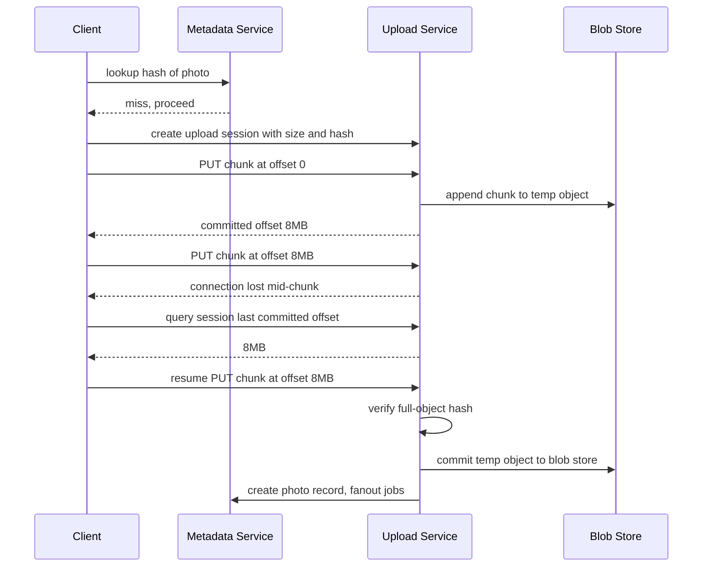
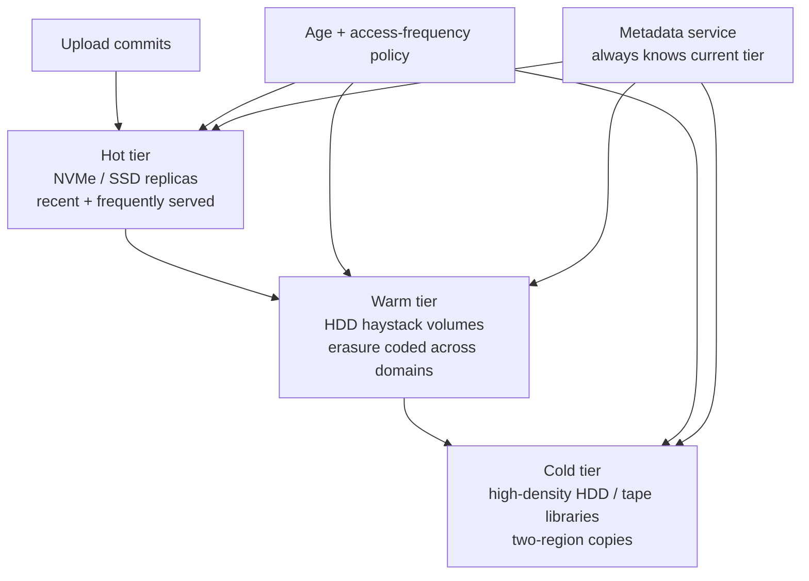
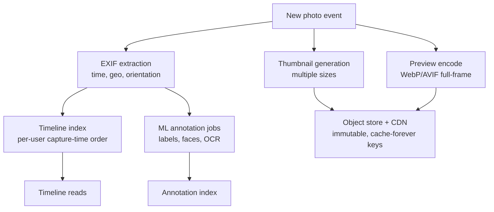

# Case Study: Design Google Photos (Photo Storage & Sharing at Scale)

## Overview

This is the design walkthrough for a consumer photo service at Google Photos scale: exabyte-class blob storage, tens of thousands of uploads per second, a derived-artifact pipeline (thumbnails, previews, ML embeddings) that multiplies every stored byte, and a sharing model that must revoke reliably because photos are the most privacy-sensitive content most people store anywhere. Unlike [How Dropbox Works](../real-world/dropbox.md), which syncs *files* between devices, a photo service ingests an append-only camera roll and optimizes for per-object serving economics — which pushes the design toward haystack-style blob storage and tiering rather than a filesystem. Expect this as a 45-minute HLD round with follow-ups on storage cost, ML pipelines, or deletion semantics; the interviewer usually probes exactly one of those three deeply.

## Step 1 — Requirements

### Functional

- Upload photos/videos from mobile and web; **deduplicate** identical uploads across devices before bytes leave the client
- Organize by capture time (timeline), albums, people/pets (face clustering), places (geo), and auto-generated "memories"
- Serve thumbnails instantly, full-resolution originals on demand; transcode video variants (see [Video Transcoding Pipeline](./video-transcoding-pipeline.md) for that sibling)
- **Sharing**: private by default; per-album ACLs with named collaborators; partner sharing (auto-share photos of a chosen person); unguessable link sharing
- Delete with recovery window, then propagate deletion to every copy, derived artifact, and cache
- Search: "beach 2019 sunset" — semantic search over EXIF + ML-derived annotations

### Non-Functional

- **Scale**: Google announced (July 2020, 5-year anniversary) **4 trillion photos stored** and **28 billion uploaded weekly** — that is ~46K uploads/s sustained, multi-× peaks on holidays, and storage measured in 10¹⁸–10¹⁹ bytes (thousands of petabytes). Any "quadrillions of bytes" phrasing in an interview is the floor, not the ceiling
- **Durability**: effectively zero tolerance for losing a user's only copy of a photo — erasure-coded multi-region storage, 11-nines-style durability targets
- **Latency**: timeline opens in < 300 ms p99 (thumbnails only); full-resolution fetch < 1 s p99 via signed CDN URLs
- **Cost**: storage $ dominate the P&L — the design is a cost-optimization argument as much as a correctness one (tiering, dedup, re-encoding, cold media)
- **Privacy**: private by default, geo data handled specially, deletion that actually deletes

## Step 2 — Back-of-Envelope Estimation

| Quantity | Assumption | Result |
|---|---|---|
| Upload rate | 28B/week (Google, 2020) | ~46K uploads/s avg; 3–5× peak on weekends/holidays |
| Upload bandwidth | 3 MB avg original | ~140 GB/s sustained ingress |
| Original storage | 4T photos × ~2 MB avg (mix of originals + compressed) | ~8 EB — multi-exabyte regime |
| Thumbnail storage | 4T × ~25 KB | ~100 PB — derived artifacts are PB-scale on their own |
| Preview storage | 4T × ~150 KB (1080p-class WebP) | ~600 PB |
| Serving | 2B photo views/day, 90%+ thumbnails | ~25K serves/s; ~2.5 TB/day egress before CDN fanout |
| Metadata | 4T objects × ~2 KB (EXIF, ACL, ML labels) | ~8 TB — hot, sharded key-value |
| Dedup | ~15% of uploads are re-uploads/duplicates | ~7K uploads/s eliminated at ingest |

The reframe that scores points: **metadata is trivially small; blobs are everything**. The 8 TB metadata index fits in RAM across shards, so every hard problem (cost, durability, serving latency) lives in the blob store and its derived-artifact pipeline — which is exactly why Facebook built Haystack for this workload and why the blob layer is the deep-dive centerpiece of this interview.

## Step 3 — API Sketch

```text
Upload and library:
  POST /v1/uploads              → { session_uri }                  body: size, content_hash
  PUT  {session_uri}            → { committed_offset }             chunked, resumable
  POST /v1/photos               → { photo_id, status: processing } body: upload_id, exif?
  GET  /v1/photos/{id}          → { metadata, variants: { t256, preview, original_signed_url } }
  DELETE /v1/photos/{id}        → { recoverable_until }            trash, not hard delete

Timeline and search:
  GET  /v1/timeline?day=2019-07-14  → { photos[] }                 capture-time index
  POST /v1/search                body: { q, filters }          → semantic + EXIF results

Sharing:
  POST /v1/albums/{id}/acl       body: { user_id, role }        → collaborator grant
  POST /v1/share/links           body: { album_id }             → { capability_url, token_id }
  DELETE /v1/share/links/{id}    → revokes capability
  POST /v1/partner-sharing       body: { person_cluster, user_id } → standing rule
```

Decisions worth stating out loud while sketching:

- **`GET /photos/{id}` returns variant URLs, not bytes** — the client fetches thumbnails from the CDN and originals from short-lived signed URLs; the metadata service never proxies media
- **`DELETE` returns a recovery deadline**, encoding the trash-window semantics in the API contract rather than leaving them implicit
- **Uploads are two resources** (session → photo): the session is resumable storage, the photo is the library entry — conflating them makes retry semantics impossible to define
- Every listing-style mutation carries an idempotency key (retry-safe `POST /photos`), mirroring the discipline in [API Idempotency](../../../backend/api/api-idempotency.md)

## Step 4 — Upload Pipeline

### Client-Side Deduplication

Before uploading, the client computes a content hash (SHA-256 of the file bytes) and queries the dedup index with it. On a hit, the upload becomes a metadata-only operation linking the user's library to the already-stored blob — same pattern as Dropbox's hash-based dedup, but scoped per-photo and executed *pre-upload* to save the most expensive resource (mobile uplink bytes and battery). Hash-on-encrypted-plaintext is safe here because the hash is compared server-side on upload, not used as a public identifier; a 256-bit hash collision is not a threat model worth designing for at these scales. Dedup also applies at the byte-range level for videos (resume + chunk reuse), where re-uploads of the same file are common after network failures.

### Resumable Upload

Mobile uploads fail — tunnels, app kills, flight mode. The upload protocol is chunked and resumable: the client creates an upload session, sends fixed-size chunks (e.g., 8 MB) with an offset, and on restart asks the session for the last committed offset before continuing. This is the same contract as Google Cloud Storage resumable uploads and the tus protocol: an explicit session resource, monotonic committed-offset tracking, and idempotent chunk PUTs so a retried chunk never corrupts the object.



Decisions to articulate:

- **Commit is hash-verified server-side**; a mismatch discards the temp object — clients are adversarial by accident (buggy camera pipelines produce corrupt files)
- **The session is durable state**, so any frontend replica can resume any session; sessions expire (e.g., 7 days) and are garbage-collected
- **Post-commit fanout is asynchronous**: metadata write succeeds, then jobs enqueue for thumbnail generation, EXIF extraction, ML annotation, and timeline-index updates. Upload latency is bounded by the metadata write, not the pipeline

## Step 5 — Storage Tiering and the Blob Layout

### The Haystack Layout for Photo Blobs

The defining workload fact: billions of small files, mostly written once, read by content ID, rarely updated, deleted softly. A POSIX filesystem wastes one inode and one or more metadata disk ops per photo — the `stat()` storm that Haystack (OSDI 2010) was built to kill. The haystack design: aggregate photos into large append-only **volume files** (~100 GB); keep the full in-memory index mapping `(user, photo) → (volume, offset, size)` in the store node's RAM; each read is then **exactly one disk operation** — seek to offset, read the needle, verify magic number + cookie + checksum, return. Writes append; deletes flip a tombstone bit in the needle and reclaim space later via compaction rewrite. This repo's [Haystack & SeaweedFS](../../../storage/haystack-seaweedfs.md) page walks the byte layout in detail; in the interview, cite the in-RAM index and the one-disk-op-per-read invariant as the two load-bearing ideas.

### Hot → Warm → Cold Tiering

Age changes the access distribution: photos get most views in the days after upload, then drop to "viewed once a year at reunions." Tiering exploits that curve.



| Tier | Media | Layout | Access pattern | Protection |
|---|---|---|---|---|
| Hot | NVMe/SSD | recent uploads, CDN-miss working set | ms reads, high IOPS | 3× replication |
| Warm | HDD | haystack volumes, append-only needles | seek-bound, one disk op per read | erasure coding across failure domains |
| Cold | high-density HDD / tape | tape-era archives à la f4-style warm blobs | restore in minutes-hours, batch | erasure coding, 2 regions minimum |

The f4 paper (OSDI 2014) is the canonical reference for the warm tier: it showed Facebook could move aged blobs to erasure-coded HDD arrays across failure domains and still meet read SLAs, cutting storage cost roughly in half versus replicated warm storage. State the trade explicitly: cold tiers trade **restore latency** (minutes–hours) for ~5–10× lower $/TB, which is acceptable only because the metadata service knows the tier of every object and user-facing SLAs are met by serving *thumbnails* (never cold) while originals restore from cold if actually requested.

### Replication vs Erasure Coding per Tier

The protection choice follows the tier's economics, not a one-size policy. Hot-tier 3× replication buys fast reads and instant failover for the small recent working set; warm/cold erasure coding (e.g., 10 data + 4 parity blocks spread across failure domains) cuts raw overhead from ~200% to ~40% at a write-amplification and repair-cost price. Erasure-coded repair after a node loss touches many surviving nodes to reconstruct lost fragments — on cold tiers that cost is amortizable, on hot tiers it competes with user traffic. Mechanics and code choices live in [Erasure Coding](../../../storage/erasure-coding.md); the interview-level point is that durability targets (11 nines) are met by *combining* erasure coding, cross-region copies for cold data, and background scrubbing that detects bit rot before it aggregates.

## Step 6 — Thumbnails, Previews, and the Metadata Index

### Derived-Artifact Pipeline

Every upload fans out into a generation pipeline — this is the small-files and compute-heavy twin of the blob problem.



- **Thumbnails are immutable and cache-forever**: keys like `photo/{id}/t256_v3` are content-addressed by photo ID + size + pipeline version; CDN TTLs are effectively infinite, and a pipeline upgrade bumps the version suffix to regenerate — this is how you serve 25K photo views/s without touching origin (see [CDN case study](./cdn-service.md))
- **EXIF is security-relevant**: parse it defensively (real-world parsers have had memory-corruption CVEs), normalize orientation server-side once, and treat GPS as privacy-restricted data (below)
- **Timezone is a classic gotcha**: capture times are local; the timeline index stores UTC + inferred IANA zone (from GPS or settings) so "July 2019" renders correctly for photos taken across timezones
- **Timeline index**: per-user, capture-time-ordered — a partitioned key-value layout `user_id → (capture_time, photo_id)` with day-level buckets; the timeline view is served from this index plus a thumbnail CDN blast, never by scanning blobs

## Step 7 — ML Pipeline: Face Clustering and the Embedding Store

Face grouping ("here are all photos of your dog / your grandmother") is the pipeline that shows you can run ML at photo scale without leaking privacy. The stages:

1. **Detection**: per-photo face bounding boxes, run once at ingest on GPU queues (batch, not realtime — 46K uploads/s of *photos*, not frames)
2. **Embedding**: each face crops to a 128–512 dimensional embedding (FaceNet-style triplet training is the classic reference); the photo stores only crops + embeddings, never a raw biometric database beyond that
3. **Clustering**: per-user approximate nearest-neighbor clustering over embeddings — HNSW-style ANN indexes give sub-ms neighbor queries, and clusters merge/split incrementally as new photos arrive (Malkov & Yashunin's HNSW paper is the standard cite)
4. **Serving**: cluster → representative thumbnail + photo sets; user-facing "people" album; partner-sharing and memories use these clusters as input

Design points the interviewer probes:

- **Clustering is per-user by construction** — embeddings never cross user boundaries, which is both a privacy invariant and a sharding strategy (partition ANN indexes by user, avoiding a global face database entirely)
- **The embedding store is a feature store problem**: embeddings and cluster IDs are features consumed by search, memories, and sharing-suggestion models — online/offline consistency and backfill-on-model-upgrade are covered in [Feature Store case study](./feature-store.md) and [ML Systems](../../../ml/mlops/ml-systems.md)
- **Reprocessing is the recurring cost**: a better embedding model means re-embedding and re-clustering 4T photos; design pipelines as idempotent versioned jobs (input key includes model version) or the migration becomes a one-shot big-bang that never finishes
- **Memories/albums are derived artifacts**: montage renders, story layouts, and "X years ago" assets are all *projections* — generated asynchronously, never blocking upload, and individually deletable without touching originals

## Step 8 — Sharing Model, Privacy, and Deletion Propagation

### Sharing Modes and Their ACL Semantics

| Mode | Mechanism | Grants | Revocation story |
|---|---|---|---|
| Private (default) | owner-only ACL | none | trivial |
| Album collaborators | named-user ACL entries | view/comment/add per role | remove entry; all copies lose access at next check |
| Partner sharing | standing rule "auto-share photos containing person P with user U" | ongoing, future-inclusive | disable rule; revoke dependent shares |
| Link sharing | unguessable capability URL (128-bit token) | view-only, no account needed | rotate/kill token; hot links die at CDN next validation |
| Shared album export | recipient-side copies where supported | snapshot | may outlive revocation — say so honestly |

Link sharing is a **capability**: possession of the token *is* authorization, so tokens must be high-entropy, scoped (view-only, no metadata leakage beyond the asset), and revocable. The security invariants worth stating: ACL checks happen on metadata reads and signed-URL issuance — blobs themselves are only reachable via short-lived signed URLs, so revocation is a metadata operation, not a blob-store rewrite. Partner sharing is the subtle one: it is a *standing query* ("photos containing this person"), so revoking it must invalidate future matching and shared copies with a propagation delay the UI should disclose.

### Privacy: Geo Data and Deletion Propagation

- **Geo data gets redacted at the serving boundary**: location on shared assets is stripped or rounded unless the owner explicitly includes it; timeline/maps features read the unredacted store only under the owner's session
- **Deletion is a pipeline, not a delete key**: trash/recovery window (Google Photos uses 60 days) → tombstone in metadata → background sweep deletes blobs (tombstone in haystack), derived artifacts, ANN clusters, and ACL grants → CDN and client caches expire (bounded TTLs) → backups age out per retention schedule. "Delete" honestly means *eventual* across the estate; the design goal is bounded, auditable propagation — every store must answer "what tombstones have you processed?" for compliance
- **The interviewer trap**: "the user deleted a photo but their partner still has it in a shared album." Answer: shared-album semantics are disclosed at share time — removing an item removes it for all viewers of the album, but anything the partner *exported* is beyond system reach; capability-based systems cannot recall what has left the building, and pretending otherwise is a lie compliance teams will inherit

## Bottlenecks & Follow-Up Questions

- **Flashcrowds on one asset**: a viral photo serves 1M views/hour; answer: CDN absorbs it — origin never sees it; the follow-up "and if CDN is bypassed?" → per-photo rate limits at the edge and signed-URL issuance throttles
- **Hot user shard**: one user uploads 500K photos; per-user timeline buckets and metadata shards must split on hot-partition signals, not just user count
- **Cold-restore storms**: "on this 10-year anniversary everyone opens their 2015 photos" — thumbnail tier serves the UX while cold restores queue; cap restore concurrency, expose "high resolution processing" placeholder states
- **ML queue backlog**: a model upgrade re-queues 4T photos; follow-up: "how do you not starve fresh uploads?" → priority classes in the job system (fresh ingest > backfill), token-bucket on backfill throughput
- **Tape restore latency vs user expectation**: cold-tier originals restore in minutes — acceptable only if previews/thumbnails are always hot; state that invariant as a hard SLO
- **Metadata shard failover**: 8 TB hot metadata — replicate synchronously per region, async cross-region; timeline reads degrade to "photos since last sync" rather than failing

## Interview Questions

1. **Why not just put photos in S3-style object storage and call it done?** You could — and for moderate scale it is the right answer. At 4T objects the economics and tail latencies of generic object storage hurt: per-request costs on trillion-scale serving, and the small-file metadata overheads that motivated Haystack. The interview answer is comparative: managed object storage for the warm/cold tiers (erasure-coded, cheap), plus a CDN-first serving path for thumbnails, with a haystack-style layout only when per-object cost accounting justifies the operational burden. Naming the crossover scale (~billions of objects, 100s of PB) is what separates a designed answer from a stack recital.
2. **Where does dedup actually happen and why there?** Client-side, pre-upload, on full-file content hash: it saves mobile uplink bytes and battery — the scarcest resources in the path — and it is the only layer that can reject before a session is created. Server-side hash checks remain as a correctness backstop (two users uploading concurrently), and block-level dedup applies to video resume. Dedup never crosses encryption boundaries in E2E-encrypted variants, which is the standard follow-up: there you trade dedup ratios for key-scoped storage.
3. **Design the deletion story for a photo shared via link and in a partner-shared album.** Delete moves the item to a recovery window, tombstones it in metadata, and every serving path (timeline, shared album, links, signed-URL issuance) checks tombstones — so view access dies within TTL bounds. Background sweeps then delete blob + thumbnails + previews + embeddings + cluster memberships, and CDN caches expire via bounded TTL. Revoking the share rule stops future matches, but exported copies and already-fetched link fetches are unrecoverable — bounded propagation with audit, not instant global amnesia, is the honest contract.
4. **How does face clustering stay per-user and still scale to billions of embeddings?** Partition by user: each user's embedding set is small (10³–10⁵), so per-user ANN indexes shard cleanly, never communicate, and create a structural privacy invariant — there is no global face index to subpoena or leak. Cluster updates are incremental (insert, local merge/split around the new point), and model migrations re-run as versioned idempotent backfills with priority below fresh ingest. The sharding and the privacy property are the same design decision, which is the point worth making.
5. **What breaks first at 10× current scale, and what do you pre-emptively change?** Derived-artifact storage and ML backfills, not originals: thumbnails/previews at 4T objects already push ~700 PB, and re-embedding backfills are the loudest consumer of GPU queues. Pre-emptive moves: content-addressed artifact stores with aggressive cross-user artifact dedup for renders, tiered artifact storage (thumbnails hot, previews warm), and priority-classed job systems. Originals tiering is already cost-optimal; the derived estate is where unmanaged growth lives.
6. **Why keep an in-memory index per haystack store node instead of one central metadata service for blobs?** The per-node in-memory index is what makes a photo read one disk operation — a central metadata lookup adds a network hop and a availability dependency to every read, and at 25K serves/s the fan-out cost and tail latency dominate. The store node's index is rebuilt from volume footers on restart, and the *master* metadata service holds the logical object → location mapping for tiering and replication; the two levels serve different questions (where is this needle on this node vs which tier/realm owns this object).

## Key Takeaways

- Photo storage at scale is a blob-economics problem: metadata is terabytes, blobs are exabytes — design for the needle store, tier by age, and serve everything user-facing from immutable thumbnails
- Haystack's two invariants — all metadata in RAM, one disk op per read — remain the reference design for small-append-only-object stores; f4 generalizes them to warm erasure-coded HDD tiers
- Uploads are resumable sessions with server-side hash verification; commit is metadata-write-fast with asynchronous fanout into the artifact and ML pipelines
- Thumbnails are content-versioned, CDN-cached-forever artifacts; pipeline upgrades ship by bumping version suffixes, never by mutating in place
- Face clustering is per-user by construction: the privacy invariant and the sharding strategy are one decision; embeddings are features with versioned backfills
- Sharing mixes ACLs (named users), standing rules (partner sharing), and capabilities (link tokens); revocation must be a metadata-layer operation via short-lived signed URLs
- Deletion is a bounded, auditable propagation pipeline across blobs, artifacts, indexes, caches, and backups — trash windows and tombstones, with honest limits about exported copies

## References

- Beaver, Kumar, Li, Sobel, Vajgel, "Finding a needle in Haystack: Facebook's Photo Storage," USENIX OSDI 2010: https://www.usenix.org/legacy/event/osdi10/tech/full_papers/Beaver.pdf
- Muralidhar et al., "f4: Facebook's Warm BLOB Storage System," USENIX OSDI 2014: https://www.usenix.org/system/files/conference/osdi14/osdi14-paper-muralidhar.pdf
- Google Cloud Storage documentation — object storage, storage classes, lifecycle: https://cloud.google.com/storage/docs
- Google Cloud Storage — resumable uploads (session URIs, committed offsets): https://cloud.google.com/storage/docs/resumable-uploads
- tus — open protocol for resumable uploads: https://tus.io/
- RFC 9110 (HTTP Semantics) — range requests and caching semantics behind resumable/CDN paths: https://datatracker.ietf.org/doc/rfc9110/
- Schroff, Kalenichenko, Philbin, "FaceNet: A Unified Embedding for Face Recognition and Clustering," CVPR 2015: https://arxiv.org/abs/1503.03832
- Malkov & Yashunin, "Efficient and robust approximate nearest neighbor search using Hierarchical Navigable Small World graphs," IEEE TPAMI 2018: https://arxiv.org/abs/1603.09320
- Google (The Keyword, July 2020) — Google Photos 5-year milestone: 4 trillion photos stored, 28 billion uploaded weekly (no stable URL — cite as company announcement)
- Google SRE books — capacity, tail-latency, and degradation discipline: https://sre.google/books/

## Cross-References

- [Real-World: Dropbox](../real-world/dropbox.md) — the file-sync sibling: chunk dedup and sync metadata vs our append-only camera-roll ingest
- [Storage: Haystack & SeaweedFS](../../../storage/haystack-seaweedfs.md) — the needle-layout deep dive this page's blob tier builds on
- [Case Study: Video Transcoding Pipeline](./video-transcoding-pipeline.md) — the media-pipeline sibling for the video half of the library
- [Real-World: Instagram](../real-world/instagram.md) — photo *serving* at social scale: fanout and CDN-first delivery
- [Storage: Object Storage](../../../storage/object-storage.md) — the managed-storage baseline and when haystack-style layouts beat it
- [Storage: Tiered Storage](../../../storage/tiered-storage.md) — the hot/warm/cold economics formalized
- [Case Study: ML Feature Store](./feature-store.md) — embedding/feature serving discipline behind face clusters and search
- [Case Study: Design a CDN](./cdn-service.md) — the thumbnail-serving machinery at 25K views/s
- [References: Distributed Systems Library](../../../references/distributed-systems.md) — verified primary sources for the stores and queues named here
