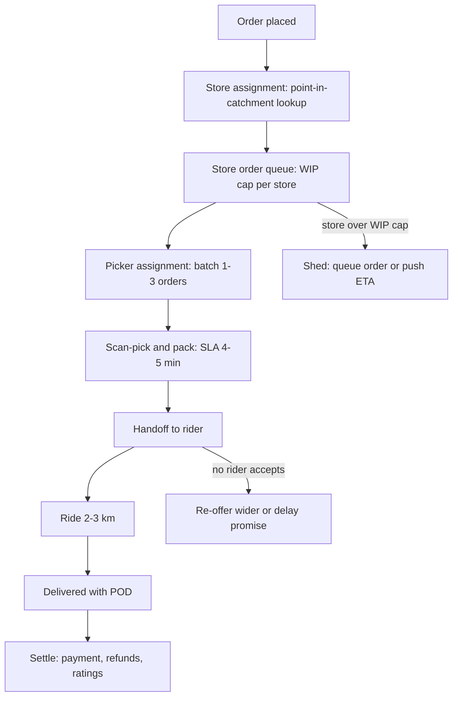
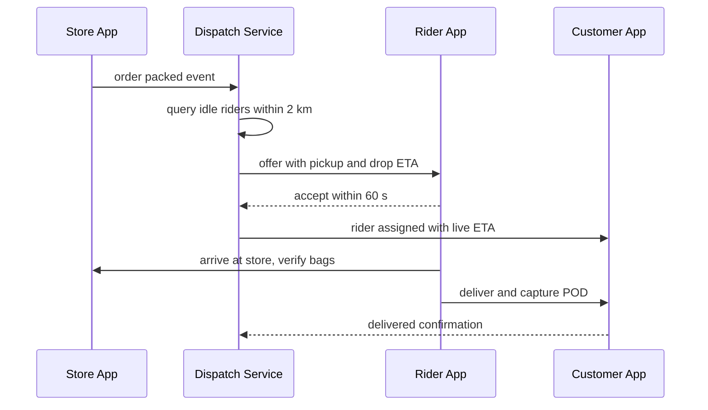

# Case Study: Design a 10-Minute Grocery Delivery Platform (Blinkit/Zepto/GoPuff)

## Overview

Quick-commerce platforms promise groceries in ~10 minutes by keeping small inventories of 2–8K fast-moving SKUs inside densely placed dark stores and dispatching riders on sub-3-km trips. The design problem is a tightly choreographed local pipeline — assign store, pick, pack, ride — where every added minute breaks the promise and every idle rider burns money. Unlike restaurant food-delivery marketplaces (no inventory, courier between two third parties), here the platform owns inventory, pricing, and the fulfillment SLA end to end. Expect this problem in 45-minute system-design rounds at Indian consumer-tech companies and in "design an operations-heavy system" variants elsewhere: the winning answers are about stage-level SLAs and physical-world feedback loops, not about scaling databases. This page builds the system in the 45-minute format: hyperlocal geo-sharding, per-micro-warehouse inventory, picker SLAs, rider batching, the ETA promise, unit economics, and peak load shedding. For the matching-and-dispatch deep dive, the closest cousin is [Real-World: Ride-Hailing](../real-world/ride-hailing.md).

## Step 1 — Requirements

### Functional

- Catalog with per-store serviceability: what is orderable depends on the customer's exact location and the assigned dark store's stock
- Cart, checkout, payment (COD + prepaid), and live order tracking
- Picker workflow inside the store: pick list, scan verification, substitution handling, packing
- Rider dispatch with short-radius assignment and optional order batching
- ETA promise per order, with SLA-breach compensation
- Refunds, returns at doorstep, and out-of-stock resolution flows

### Non-Functional

- **Scale**: one metro with 5M population; ~400K orders/day city-wide; a dark store network of 500–700 stores; peak hour carries ~10% of daily orders
- **Latency**: order-to-store assignment < 30 s; picker assignment < 60 s; rider offer < 10 s; ETA computed at checkout and recomputed at each state transition
- **Promise**: 10-minute delivery for the core assortment; degrade to 15–30 min during rain/festival peaks rather than fail
- **Consistency**: inventory shown to customers is eventually consistent; the picker's scanned truth is authoritative and feeds back within seconds
- **Availability**: browse/search always available; ordering can queue during extreme peaks; rider dispatch never goes down (idle riders = burning money)

## Step 2 — Back-of-Envelope Estimation

| Quantity | Assumption | Result |
|---|---|---|
| City orders | 5M population × 60% serviceable × 4 orders/user/month | ~400K orders/day |
| Dark store capacity | ~60–80 orders/hour peak, 600–1,000 orders/day each | ~500–700 stores for the metro |
| Peak order rate | 10% of daily volume in the dinner hour | ~11 orders/s city-wide, ~1 order/2 min per store |
| Catalog | 8K SKUs globally, 2–5K stocked per store | 5.6M inventory rows city-wide — small data, high churn |
| Location updates | 40K concurrent riders × 1 ping / 8 s | ~5K location writes/s (Redis GEO + stream) |
| Dispatch decisions | ~11 orders/s × offer fan-out to ~5 riders | ~55 offer events/s — the hard part is latency, not volume |
| Inventory events | picker scans + order deductions ≈ 25 items × 11 orders/s | ~275 inventory deltas/s per metro |

The framing that lands: **data volume is tiny; timing precision is everything**. A grocery order is ~25 rows in a database, but ten minutes end-to-end means each pipeline stage owns a sub-minute budget, and the system must measure, alert, and shed at stage granularity.

### Stage-by-Stage SLA Budget

The 10-minute promise decomposes into owned budgets; each stage reports its own percentile, and a breach pages the owner of that stage, not "the platform."

| Stage | Budget (p85) | Owned by | Breach signal |
|---|---|---|---|
| Payment + store assignment | 30–45 s | assignment service | catchment polygon cache misses |
| Queue wait before pick | 30–60 s | store queue (WIP cap) | queue depth > 4 orders |
| Pick 25 items | 2–3 min | picker + pick-path engine | pick rate < 100 units/hour |
| Pack + stage | 90–120 s | packing station | staging-area dwell time |
| Rider wait + load | 30–60 s | dispatch service | handoff-zone dwell |
| Ride 2–3 km | 4–5 min | rider + ETA engine | road-speed model drift |

Summing the p85 budgets lands at 9–11 minutes, which is the honest arithmetic behind the promise: the marketing number is the sum of p50s, the app's per-order promise is the sum of p85s, and the difference between the two is the compensation budget.

## Step 3 — Dark-Store Network and Catchment Mapping

The dark store is the unit of both inventory and geography. Network design is a data problem before it is a real-estate problem.

- **Catchment mapping**: the city is partitioned into demand hexagons (H3 at resolution ~8–9 gives sub-km cells, see [Uber H3](https://github.com/uber/h3)). Historical demand per cell, rider travel times, and expected basket mix drive store placement — each store's catchment is the set of hexagons it can serve within the promise (roughly a 2–3 km ride radius adjusted for road network, not straight-line distance)
- **Assignment service**: customer lat/lon → exactly one primary store, with a deterministic fallback store for boundary addresses. Indian PIN codes are far too coarse (a large PIN can span multiple dark-store catchments), so assignment must run point-in-polygon over cached catchment polygons, not a PIN-code lookup table
- **Serviceability**: the app shows only SKUs the primary store stocks, blended with an out-of-stock suppression layer (Step 6). Edge customers may see a slightly smaller catalog; a "not serviceable" address is a last resort, because every un-served hexagon is revenue surrendered to a competitor
- **Hyperlocal geo-sharding**: orders, inventory state, and dispatch are all partitioned by store/catchment ID, not by customer ID. One store's fire (rain surge, stockout cascade) is contained within its shard; cross-shard operations (fallback store, rider re-balancing) are explicit, rare events



### Network Expansion Decisions

Every candidate store is an optimization query before it is a lease signature. The inputs are demand heat per hexagon, cannibalization against existing catchments, real-estate constraints such as floor plate and last-mile road access, and projected unit economics at the expected basket mix. The platform's job is to make the experiment cheap: a new store launches with a conservative catalog and a wider ETA promise, and the same dashboards that manage peak load measure whether the new catchment captures incremental demand or merely splits an existing store's orders. Expansion wrong calls are expensive in fixed cost, so the assignment service supports shadow catchments — computing what the new store *would* have served for weeks before it opens. This is a place where the engineering artifact, a catchment simulator over historical orders, changes a business decision directly, and interviewers reward naming it.

## Step 4 — Inventory per Micro-Warehouse

A dark store is a small warehouse with aggressive real-time feedback loops. The inventory model has three layers:

- **SKU master (global)**: product identity, dimensions, shelf life, substitution groups ("same as" links), and price rules. One team owns it; all stores inherit
- **Store catalog (per store)**: which SKUs this store stocks and where they live — rack/bin coordinates that drive the pick path. Typically 2–5K SKUs per 2,500–5,000 sq ft store; premium stores push toward 8K
- **On-hand quantities (per store per SKU)**: decremented at order confirmation, corrected at picker scan, incremented on replenishment. Batches with expiry dates are tracked for perishables, consumed first-expiry-first-out (FEFO)

Operational mechanics worth stating in an interview:

- **Negative on-hand is a signal, not an error**: it means the virtual count drifted from the shelf; the picker scan reconciles reality and a cycle-count task is scheduled for that bin
- **Out-of-stock detection is layered**: real-time (picker scan, demand to zero), predictive (sales velocity vs reorder point), and scheduled (cycle counts per bin per week). Every OOS event suppresses the SKU from the app for that catchment within seconds and opens a replenishment task
- **Wastage accounting**: expired or damaged units are written off through an inventory ledger (same append-only discipline as [Real-World: Billing & Metering](../real-world/billing-metering.md)), so shrinkage is attributable per store and per category
- **Replenishment**: hub-to-store transfers run 2–3× daily off demand forecasts; the forecast is per store per SKU per hour-of-day, which is where the ML lives (see [Feature Store](./feature-store.md) for the offline/online feature machinery behind such forecasts)

### Core Data Model

```text
stores            (id, lat, lon, catchment_polygon, wip_cap, status)
store_catalog     (store_id, sku_id, bin_location, stocked_qty,
                   reorder_point, batch_expires_at, UNIQUE(store_id, sku_id))
orders            (id, user_id, store_id, promised_eta_s, state,
                   placed_at, payment_state)
order_items       (order_id, sku_id, qty, unit_price_cents,
                   fulfillment_state, substituted_by_sku)
pick_runs         (id, store_id, picker_id, order_ids[], started_at)
pick_events       (run_id, sku_id, qty, scan_ts, oos_flag)  -- inventory truth
riders            (id, home_store_id, state, last_lat, last_lon, last_ping_ts)
rider_offers      (order_id, rider_id, offered_at, outcome, batch_id)
eta_snapshots     (order_id, state_change, promised_s, computed_s)
```

Two tables deserve explicit call-outs. `pick_events` is the append-only truth stream — virtual inventory is a projection of scans, order deductions, and replenishments, so a nightly job can rebuild any store's on-hand from the event log. `eta_snapshots` records the promise at every state change, which is what makes SLA-breach compensation automatic: the customer's entitlement is computed from data the system captured, not from what a support agent believes.

## Step 5 — Picker Workflow and the Packing SLA

The picker is the throughput bottleneck inside the store: 10-minute delivery budgets roughly 4–5 minutes for pick + pack, and a picker processes 100–150 units/hour at good performance.

- **Batching at pick time**: the store queue groups 1–3 orders into one pick run when their SKUs overlap aisles; batching trades picker walking time against per-order latency, and the WIP cap (orders in progress per store) is the pressure valve
- **Pick-path optimization**: the pick list is ordered by bin position (serpentine aisle traversal), not by cart order — walking is 50–60% of pick time, so sequencing the route is the single biggest picker-productivity lever
- **Scan verification**: each unit is barcode-scanned; wrong-item and short-pick events are caught at the shelf, not at the customer's door. Scan events are also the inventory truth stream (Step 4)
- **Packing SLA**: bagged, labeled, and staged at the handoff zone within a 90–120 s pack window; the store dashboard shows a per-order countdown, and breaches page the store manager, not an on-call engineer — this is an operations-alert tier, not a systems-alert tier
- **Substitution interaction**: short-picked items trigger the substitution flow (Step 7) before the order leaves the packing station, because a post-dispatch substitution costs a rider round-trip

### Store Layout and Bin Design

Layout is a caching problem in physical form. Fast-moving SKUs (roughly 20% of SKUs generating 80% of picks) sit at eye level near the packing station; the pick-path engine orders the run serpentine through aisles so the picker never backtracks. Bin design carries data too: each bin has a fixed pick face and an overstock shelf, the catalog's `bin_location` encodes aisle-rack-level, and scan events reconcile against the bin, so a misplaced case shows up as a repeated short-pick pattern at one location. Seasonal resets (monsoon umbrellas to the front, exam-season snacks for nearby hostels) are catalog operations — the system treats a layout change as a bulk `bin_location` update with a verification pass, because a stale bin map quietly degrades pick rate, which then surfaces as an ETA breach two stages later.

## Step 6 — Rider Dispatch and Batching

Dispatch converts a packed order plus a pool of nearby riders into a delivery promise. It is a continuous, latency-critical matching problem at small radius.

- **Rider state machine**: `offline → idle → assigned → at_store → en_route → delivered → idle`. Location pings every 5–10 s stream into Redis GEO structures plus a Kafka stream for analytics; idle-rider density per hexagon is the key supply metric (see [Real-World: Ride-Hailing](../real-world/ride-hailing.md) for the supply-demand version of this problem)
- **Offer strategy**: when an order is packed, the dispatcher offers it to the best idle rider within ~1–2 km — scored by ETA-to-store, current direction, and acceptance history. Multi-offer fan-out (offer to 3–5 riders, first-accept-wins) trades slight inefficiency for sub-10-s assignment, which the SLA needs
- **Batching**: a rider may carry 2 orders with compatible drop directions; batching raises deliveries/ride from ~1.0 to ~1.3–1.5 and is the difference between contribution-positive and negative in many cohorts. The cost is ETA variance on the second drop, so batching is distance-gated (drop points within ~1 km of each other)
- **Return-to-store**: riders return to their home store rather than roaming, because the next order's pick stage starts only after handoff — unlike ride-hailing, supply and demand are anchored to fixed points, which makes coverage planning tractable



### Rider Supply Planning

Dispatch quality is bounded by supply planning, which runs at three horizons. Weekly: shift schedules per store from forecasted order curves, tuned so rider supply leads demand by 15–30 minutes at each peak rather than tracing it. Daily: rain and festival forecasts trigger pre-emptive incentives — attendance bonuses and surge pay announced the evening before — because reaction during the peak is already too late. Real-time: a rebalancing hint nudges idle riders toward the store whose queue model predicts the next packed order, a gentle version of ride-hailing's driver repositioning. The metric that ties the horizons together is offer-accept latency and its refusal rate per catchment: refusals rising on a specific leg usually mean a road-closure or map-data problem, which is a data bug wearing an operations costume. Supply metrics belong on the same dashboards as system metrics because in this domain rider supply is a component whose failure mode is an SLA breach, exactly like a crashed service.

## Step 7 — ETA Promise vs Reality

The ETA is a contract with three components, each measured independently:

- **Promise = store queue delay + pick/pack time + ride time + buffer.** At checkout the system computes it from live per-store load (queue depth, picker occupancy) and historical ride-time distributions for the exact road path, then adds a percentile buffer (e.g., p85) rather than a mean — a constantly broken promise destroys trust faster than a slower honest one
- **Promise vs marketing**: the "10-minute delivery" brand claim is the *best case* for the core assortment in normal conditions; the app-level promise is computed per order and may be 12–18 min. Stating this distinction explicitly is an interview differentiator — operational honesty beats marketing arithmetic
- **Recomputation on state change**: each transition (assigned → picked → rider en route) tightens the ETA. If a computed ETA exceeds a threshold (say 1.5× the promise), the customer is notified proactively and the order may qualify for automatic fee waivers
- **SLA breach handling**: breaches beyond a threshold trigger compensation (coupon/fee refund) automatically from the order's audit trail. The tracking page is a projection of order events over Kafka, so customer support replays the same events the customer saw

## Step 8 — Substitutions and Out-of-Stock Handling

Out-of-stock at pick time is the norm to manage, not the exception — top SKUs run 2–5% OOS rates even in healthy stores.

- **Policy tiers per product**: at one extreme, auto-refund the item and proceed (default for commodity items); at the other, auto-substitute with the customer-confirmed "same as" product at the lower of the two prices (default for staples where the substitute is equivalent); in between, allow the picker to offer a phone/chat choice. Tiers are a catalog attribute, set per product category
- **Consent and pricing**: unrequested substitutions are a top complaint driver; auto-substitution must never increase price, and the delta is refunded to the original payment instrument immediately
- **Inventory feedback loop**: the picker's OOS scan immediately suppresses the SKU from the catchment's app catalog, decrements on-hand, and creates a replenishment task. Suppression prevents the classic quick-commerce failure where the app keeps selling an empty shelf all evening
- **Item-level refunds** settle through the payments service with idempotency keys keyed by `(order_id, item_id, reason)`; doorstep returns re-enter the same inventory ledger as restocked or wastage units

### Payments, COD, and Doorstep Returns

Cash-on-delivery is a meaningful share of Indian orders and stresses the pipeline uniquely: the rider's device becomes a payment terminal, so the delivered event must carry a payment confirmation (collected, UPI QR, refused), and end-of-shift rider cash reconciliation is a ledger problem identical to a bank teller's drawer. Doorstep returns (customer inspects a perishable and refuses it) create a same-trip inventory event — the unit rides back and re-enters stock only after a quality check, or into wastage; the order's refund posts immediately either way. Prepaid failures mid-funnel (PSP timeouts during festival peaks) must not block the queue: the order proceeds in a `payment_pending` state with a bounded retry, and a final failure converts to a COD-equivalent or cancels with a scripted refund. Every money path here reuses the idempotency-key discipline from [Real-World: Payment System](../real-world/payment-system.md) — the grocery variant's twist is only that cash and goods move in the same vehicle.

## Step 9 — Unit Economics Levers

Quick commerce is an economics problem wearing an engineering costume. The contribution margin per order is roughly: (basket revenue + ad revenue + delivery fee) − (COGS − wastage) − (store fixed cost share) − (picker + rider cost per order) − (packaging, payment fees). The levers:

| Lever | Mechanism | Typical effect |
|---|---|---|
| Basket size | minimum-cart nudges, free-delivery thresholds, assortment depth | AOV +20–30% flips contribution positive in dense cohorts |
| Rider batching | 2 compatible drops per ride | deliveries/ride 1.0 → 1.3–1.5; rider cost per order −25% |
| Picker productivity | pick-path sequencing, batched runs | 100 → 150 units/hour; picker cost per order −30% |
| Wastage control | FEFO, per-SKU forecasts, markdowns near expiry | perishables wastage 3–5% of COGS → 2% |
| Ad revenue | sponsored listings, search ads | highest-margin revenue line; scales with DAU, not orders |
| Private label | own-brand staples at 2–3× gross margin | margin mix +5–10 pts over time |
| Store density | more, smaller stores | shortens ride time; risks catchment overlap — measure demand capture vs fixed-cost duplication |
| Delivery/small-cart fees | explicit fees or thresholds | prices peak and tiny baskets away; pure demand shaping |

The engineering tie-in: every lever is a metric the platform must instrument per store, per hour, per cohort — the data pipeline is as much a deliverable as the dispatch loop (see [HLD: Data-Intensive Design](../hld/data-intensive.md)).

## Step 10 — Peak Load Shedding (Rain and Festivals)

Rain, festivals, and flash sales compress demand 2–3× while simultaneously cutting rider supply (riding slows, riders log off). The system degrades in a planned order:

- **Demand side**: widen ETA promises (10 → 20–30 min), raise surge delivery fees, enforce stricter small-cart fees, and cap orders per store via the WIP limit — when the cap binds, new orders queue or route to the fallback store if its catchment has headroom
- **Catalog side**: suppress long-tail SKUs to shorten pick paths ("crisis assortment"), and hide SKUs below a safety-stock threshold to protect the next orders
- **Supply side**: widen dispatch radius, raise offer batching aggressiveness, and pause rider idle-time penalties; surge pay must target the *next* hour's supply, which makes the surge controller a feedback loop with a 30–60 min lag (see [Google SRE books](https://sre.google/books/) on overload behavior and shedding)
- **System side**: browse/search served from cache only; non-critical writes (ratings, wishlists) degrade; tracking updates coalesce to 15-s intervals. Ordering never goes dark — a queued order beats a rejected one as long as the queue is honest about the ETA

**What the interviewer is probing:** whether shedding is designed or accidental. The answer names the order of sacrifice — revenue features first, promise accuracy second, ordering last — and ties each threshold to a measurable signal (rider density per hexagon, WIP occupancy, promise-breach rate).

### The Surge Controller as a Feedback Loop

Rain-peak response is a control system, not a switch. The controller samples two inputs every minute — effective rider supply per catchment (idle riders × road-speed factor) and order inflow rate — and adjusts a small set of set-points: the WIP cap, the ETA buffer percentile, the surge fee multiplier, and the assortment scope. Because rider supply responds to incentives with a 30–60 minute lag (riders must see the surge pay, log on, and arrive), naive proportional control oscillates: a big surge fee floods the next hour, then riders idle and surge pay collapses, and they log off again. The practical fix is anticipatory control — weather and calendar feeds are known hours ahead, so the controller ramps set-points before the demand curve moves, and caps how fast each set-point can change. All of this is throttled by one hard invariant: a queued order must be told an honest ETA within seconds of placement, because an order that silently disappears from tracking generates more support volume than a 35-minute promise ever will.

## Interview Questions

1. **Why dark stores rather than warehouses with courier fleets?** The 10-minute promise is physically impossible from a central warehouse: the ride alone would exceed it. Dark stores put 2–5K fast-moving SKUs within a 2–3 km ride of demand, trading assortment and inventory efficiency for speed. The design consequence is that inventory, forecasting, and replenishment become per-store problems with ~2–5K SKU decision points each, multiplied across hundreds of stores — the hard engineering is coordination, not scale of data.
2. **How do you keep the app's availability aligned with shelf reality?** Three layers: virtual on-hand decremented at checkout, authoritative corrections from picker scans at pick time, and predictive suppression from sales velocity vs reorder points. A picker OOS scan suppresses the SKU from that catchment's catalog within seconds. Availability is deliberately eventually consistent in the customer's favor of honesty — better to hide an item than to cancel it post-payment, because post-payment cancellations are the top trust killer.
3. **Design the rider dispatch decision.** On a packed-order event, query idle riders within ~2 km via Redis GEO, score by ETA-to-store, direction, and acceptance history, and multi-offer to the top 3–5 with first-accept-wins inside 60 s; then widen or batch if no acceptance. Batching pairs orders whose drops are within ~1 km, raising deliveries per ride to ~1.3–1.5. The dispatch service is per-catchment sharded and must survive Redis loss with a degraded single-offer mode — assignment latency matters more than assignment optimality.
4. **What happens to the promise during a rain surge, and how do you decide what to shed?** Demand doubles while rider speed and supply drop, so the queue model blows past the buffer. The controller raises computed ETAs honestly, applies surge fees, caps per-store WIP, and suppresses the long tail to shorten pick paths. The shedding order is planned: non-critical writes first, catalog breadth second, promise width third, ordering last. Every threshold maps to a live signal — hexagon rider density, WIP occupancy, breach rate — so the response is measurable rather than heroic.
5. **Walk through an out-of-stock discovered at the shelf.** The picker short-scans, the app flow applies the product's substitution tier: auto-refund and proceed, auto-substitute at the lower price for confirmed "same as" links, or contact the customer. Simultaneously the scan stream decrements on-hand, suppresses the SKU from the storefront, and opens a replenishment task. The economics matter as much as the flow: substitution before packing costs nothing, substitution after dispatch costs a rider round-trip, so the flow must resolve before the handoff stage.
6. **What makes this different from designing a food-delivery marketplace?** A marketplace has no inventory: its hard problems are restaurant-side latency, courier matching, and pricing. Quick commerce owns inventory, so it adds per-store stock accuracy, expiry/FEFO batch tracking, wastage accounting, picker throughput, and store-network planning; the courier problem is a special case with fixed pickup points. The dispatch loop is shared DNA with ride-hailing, but the fulfillment SLA is owned end-to-end, which changes what the system must measure and refund.

## Key Takeaways

- Ten minutes is a pipeline of sub-minute budgets — assignment, pick, pack, ride — each independently measured, alerted, and shed; the data volume is trivial, the timing precision is not
- Geo-shard by dark-store catchment (point-in-polygon, not PIN codes); one store's surge must not become a city-wide incident
- Inventory truth flows from picker scans, not from checkout decrements; negative on-hand is a reconciliation trigger and OOS suppression must reach the storefront in seconds
- Rider dispatch optimizes latency over optimality: multi-offer fan-out in a 1–2 km radius, distance-gated batching to ~1.3–1.5 drops per ride
- The ETA promise is computed per order from live queue and ride-time distributions with a percentile buffer; marketing's "10 minutes" and the app's promise are different numbers by design
- Unit economics are engineered, not assumed: basket size, batching, picker productivity, wastage, ads, and private label each map to an instrumented lever
- Peak response is a planned shedding order — revenue features, then promise accuracy, then ordering — driven by rider density and WIP occupancy, not improvised heroics
- The engineering artifacts that change business outcomes are the catchment simulator, the per-store demand forecast, and the surge controller — name them as products, not scripts

## References

- Uber H3 — hexagonal hierarchical geospatial indexing used for catchment and demand mapping: https://github.com/uber/h3
- S2 Geometry — the alternative spherical geospatial indexing library for serviceability polygons: https://s2geometry.io/
- PostGIS documentation — spatial predicates for point-in-polygon serviceability: https://postgis.net/documentation/
- Redis documentation — GEO structures and streams for rider location and dispatch: https://redis.io/docs/latest/
- Apache Kafka documentation — order-event backbone and tracking projections: https://kafka.apache.org/documentation/
- Apache Flink documentation — streaming join of location, order, and inventory events: https://nightlies.apache.org/flink/flink-docs-stable/
- Google SRE books — overload, shedding, and capacity planning: https://sre.google/books/

## Cross-References

- [Real-World: Ride-Hailing](../real-world/ride-hailing.md) — supply-demand matching, surge control, and driver state machines that dispatch generalizes
- [HLD: Database Selection and Design](../hld/database-design.md) — choosing stores for inventory, orders, and location streams
- [Real-World: Order Management](../real-world/order-management.md) — order state machines, reservations, and fulfillment inventory in the e-commerce setting
- [LLD: Food Delivery](../lld/food-delivery.md) — the low-level class-design sibling for the marketplace variant
- [Real-World: Billing & Metering](../real-world/billing-metering.md) — append-only ledger pattern reused for inventory and wastage accounting
- [Case Study: Feature Store](./feature-store.md) — the offline/online feature machinery behind per-store demand forecasts
