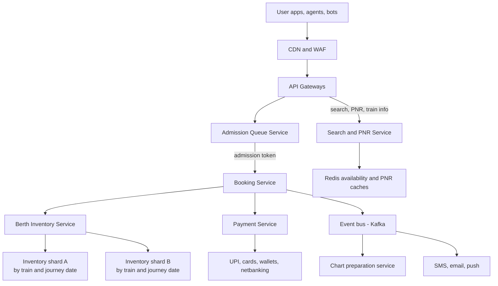
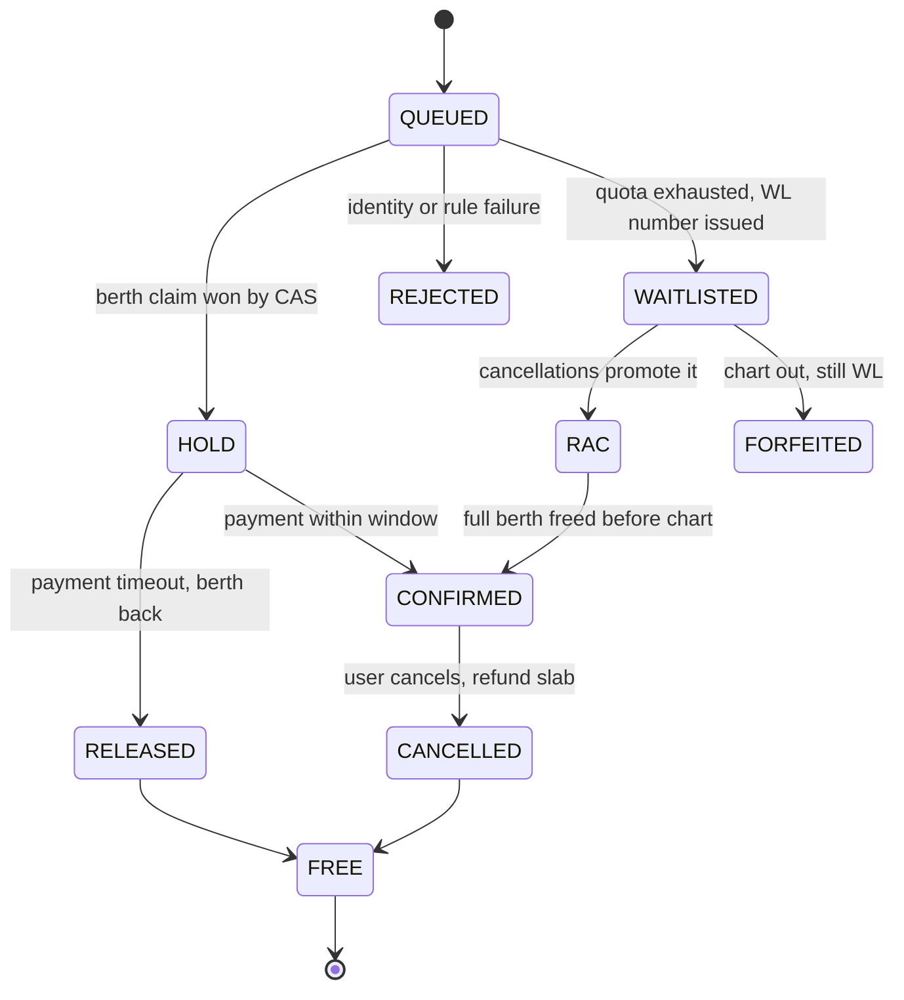
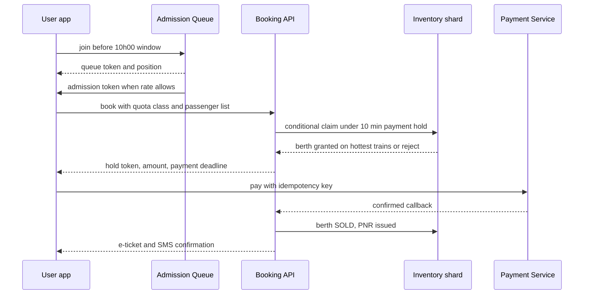

# Case Study: Design IRCTC — Train Ticket Booking at Indian Scale

## Overview

IRCTC (Indian Railway Catering and Tourism Corporation) sells roughly 1.5–2 million rail tickets per day on a baseline, with festival-season peaks reported near 3 million bookings in 24 hours — and its hardest moment recurs every single day: the Tatkal quota opens at fixed morning windows (10:00 AM for AC classes, 11:00 AM for non-AC classes, one day before travel) and hundreds of thousands of users land on the site within a five-minute span. This walkthrough designs the booking core: quota-partitioned berth inventory (general / Tatkal / premium), a waitlist and RAC state machine that renumbers continuously, no-oversell seat inventory per coach and berth class, the 10:00 AM spike traffic model with queue-based admission, and a cheap PNR status read path. It deliberately complements [Case Study: Ticketmaster](./ticketmaster.md): ticketing there is one-event seat maps with a 7-minute hold; here the product is *quotas, waitlists, and berth classes* on thousands of simultaneous train-departures, which changes the inventory model, the sharding key, and what "fairness" means.

## Step 1 — Requirements

### Functional

- Search trains by origin-destination-date; show availability per **class** (2S, SL, 3AC, 2AC, 1A, CC) and per **quota** (general, Tatkal, ladies, senior citizen, dividend/duty, premium Tatkal)
- Book tickets for one or more passengers with berth-type preferences (lower/middle/upper/side-lower) and auto-upgrade eligibility
- Issue a PNR (Passenger Name Record) that remains queryable from booking through chart preparation and travel
- Maintain waitlist (GNWL/TQWL/PQWL...) and RAC (Reservation Against Cancellation) with automatic confirmation as cancellations cascade
- Cancel and refund with class-based and time-based slabs; handle chart preparation ~4 hours before departure
- Enforce Tatkal rules: identity checks, per-user limits, premium-Tatkal dynamic fares

### Non-Functional

- **Correctness first**: a berth may never be sold twice; a delayed confirm beats a double-confirm (same invariant as [Ticketmaster](./ticketmaster.md))
- **Scale**: ~12,000 trains/day × ~16 coaches × ~70 berths ≈ 13–14M berth-state rows per calendar day; ~60-day advance reservation period (ARP) ⇒ ~800M live inventory rows
- **Burst shape**: traffic is a sawtooth — modest load all day, violent spikes at the 8:00 AM general-booking and 10:00/11:00 AM Tatkal windows; degradation must be graceful queueing, never oversell
- **Fairness**: every user gets a bounded chance at quota; agents/bots must not monopolize the Tatkal window
- **Reachability**: many users on 3G/low-end Androids — HTML-first pages, small payloads, and SMS fallbacks for ticket/PNR delivery
- **Auditability**: every state change (booking, cancellation, chart) is replayable for dispute resolution

## Step 2 — Back-of-Envelope Estimation

Work the numbers before drawing boxes — the spike, not the average, sets the design.

| Quantity | Assumption | Result |
|---|---|---|
| Trains on sale per day | ~12K including expresses, mail, passenger | inventory universe per calendar day |
| Berths per train | ~16 coaches × ~70 berths/seats avg | ~1.1K berth rows per train-date ⇒ ~13–14M rows/day |
| Live horizon | 60-day ARP | ~800M live berth-state rows ⇒ partition by journey date |
| Baseline writes | ~1.5–2M tickets/day ≈ 20–25 bookings/s avg | trivially handled; averages are meaningless here |
| Tatkal spike arrivals | ~2M users within 10:00–10:05 | ~6–7K logins/s; realistic completion capacity ~1–2K bookings/min |
| Spike reads | availability + PNR checks, 20–50× writes | ~100K+ RPS at spike ⇒ cache-first read path |
| Payment conversion | ~30–60% of holds convert within the 10-min window | holds churn fast; expiry sweeper matters |

The pattern to verbalize: the system is **read-heavy overall but write-tempestuous**. The average load is small; the design question is entirely about the 10:00 AM window, where arrival rate (thousands/s) exceeds the sustainable booking completion rate (hundreds/min), so something must convert arrivals into an ordered, metered stream — that something is admission control, not more app servers.

## Step 3 — API Sketch

```text
GET  /v1/trains?from=NDLS&to=BCT&date=2026-01-15        → trains + classes
GET  /v1/trains/{id}/availability?cls=3A&quota=GN        → { status: AVAILABLE|RAC|GNWL-42, fare }
POST /v1/bookings                                       → { hold_token, expires_at, amount }
     body: train_id, journey_date, cls, quota, passengers[], idempotency_key
POST /v1/bookings/{id}/pay                              → { status, pnr }  (payment callback/finalize)
GET  /v1/pnr/{pnr}                                      → { chart_status, passengers[]: CNF-B2-34|CAN|RAC-8 }
POST /v1/bookings/{id}/cancel                           → refund per slab rules
```

Decisions worth stating out loud in the interview:

- `POST /bookings` carries a client-generated **idempotency key**; a network retry returns the same hold instead of claiming a second berth (see [API Idempotency](../../../backend/api/api-idempotency.md) and RFC 9110 §9.2.2)
- Availability reads are eventually consistent; the only authority is the conditional claim inside `POST /bookings`
- PNR status is a *derived read model*: the booking store owns truth; PNR reads hit a cache fed by change events

## Step 4 — High-Level Architecture



Browse, search, and PNR traffic never touch the inventory database; they are served from CDN and Redis. The booking path is the only writer of berth state, and every claim goes through an atomic conditional update on the train-date shard. Payment is decoupled through a hold-with-TTL so the inventory never waits on a bank (see [Design: Payment System](../payment.md)).

## Step 5 — Berth Inventory and Data Model

The unit of inventory is a **berth** (or reserved seat) on a coach of a train for a journey date — not "an event seat" and not "a generic seat". Its row carries the class, the berth type (LB/MB/UB/SL/SU), the quota it belongs to, and the current logical status.

```sql
CREATE TABLE berth (
  train_id      bigint    NOT NULL,
  journey_date  date      NOT NULL,
  coach_no      smallint  NOT NULL,
  berth_no      smallint  NOT NULL,
  cls           text      NOT NULL,          -- SL | 3A | 2A | 1A | CC | 2S
  berth_type    text      NOT NULL,          -- LB | MB | UB | SL | SU
  quota         text      NOT NULL,          -- GN | TQ | PT | LD | HP ...
  status        text      NOT NULL,          -- FREE | HELD | SOLD | BLOCKED
  version       bigint    NOT NULL,
  PRIMARY KEY (train_id, journey_date, coach_no, berth_no)
);
CREATE TABLE booking (
  id            uuid PRIMARY KEY,
  pnr           char(10)  UNIQUE,
  train_id      bigint, journey_date date, cls text, quota text,
  state         text      NOT NULL,          -- QUEUED|HOLD|CNF|RAC|WL|CANCELLED
  idempotency_key uuid    UNIQUE,
  amount_paise  bigint, hold_expires_at timestamptz
);
```

Shard by `(train_id, journey_date)` hash: all coaches, all classes, all quotas of one departure live on one shard, so a multi-passenger booking with berth-adjacency preferences is a **single-shard transaction**. The 60-day horizon turns into ~800M rows, which is why journey date is in the key and old dates are archived wholesale (drop-to-cold-storage, no UPDATE storm). PNR lives in a separate horizontally-partitioned store fed by events, because PNR reads (status lookups from millions of households) have completely different access patterns from booking writes.

## Deep Dive 1 — The Quota System: Inventory as Multiple Budgets

The single most interview-relevant IRCTC fact: a 3AC coach's berths are not one pool — they are **pre-partitioned quotas**. General (GN) opens 60 days ahead at 8:00 AM; Tatkal (TQ) opens one day before travel (10:00 AM AC / 11:00 AM non-AC) on roughly **10% of berths in AC classes and 30% in non-AC classes** (subject to per-class caps); Premium Tatkal (PT) uses the Tatkal share with **dynamic pricing** that rises as remaining berths fall. Ladies, senior-citizen, and duty quotas carve out small fixed allocations.

| Quota | Typical share | Window | Fare | Waitlist namespace |
|---|---|---|---|---|
| General (GN) | remainder after others | ARP 60 days, 08:00 open | base | GNWL |
| Tatkal (TQ) | ~10% AC / ~30% non-AC | D−1, 10:00 / 11:00 | base + Tatkal charge | TQWL |
| Premium Tatkal (PT) | within Tatkal share | D−1, like Tatkal | dynamic, rises with scarcity | PTWL |
| Ladies (LD) | ~6 berths per SL coach | ARP | base | LDWL |
| Senior / duty / Divyangjan | small fixed blocks | ARP | concession rules | HP/DPWL |

Design consequences you should enumerate:

- Quota partitions are enforced as **attributes of the inventory rows** (`quota` column + per-quota counters), not as separate databases — a quota release (e.g., unsold Tatkal reverting toward the general pool around chart preparation) is a batch re-attribution job, not a migration
- A user picks a quota; availability reads aggregate per (train, class, quota); a booking claim atomically decrements that quota's free counter and flips the specific berth rows
- Dynamic pricing (PT) reads the free-counter trend: fare is a function of `sold / total` in the quota, computed server-side at claim time so the price on screen and the price charged cannot drift apart under contention
- Because quotas are per train-date shard-local, quota transitions need no distributed transactions — this is a direct payoff of the sharding choice in Step 5

## Deep Dive 2 — Waitlist and RAC State Machines

When a quota is exhausted the system does not say "sold out"; it sells **positions in a queue with a defined promotion order**. A confirmed passenger who cancels frees a berth; the lowest RAC gets the berth, the lowest WL becomes RAC, and every higher WL number slides down — a cascading renumber that must be atomic per train-date.



Mechanics to state precisely:

- **RAC is a real product**: two passengers share a side-lower berth (roughly a seat-and-a-half each); "confirmation" for them means promotion to a full berth. Any inventory model that treats a berth as binary available/sold cannot represent RAC — you need berth occupancy as a small ordered collection (0, 1, or 2 passengers, plus a "doubled" flag)
- **The cascade is an ordered event per train-date shard**: on cancellation, run the promotion transaction (release berth → promote RAC → promote WL) inside one shard-local transaction, then emit `pnr.promoted` events; downstream services re-read PNR state from the shard, never by distributed locks
- **Chart preparation (~4 h before departure, final chart later for remote stations) is the consistency boundary**: after the final chart, no new confirmations occur; leftover WL forfeits with automatic refund; Tatkal leftovers roll back toward the general pool earlier in D−1
- Renumbering millions of WL positions is bounded in practice: a hot train-date rarely has more than a few hundred live WL entries, so the cascade is a per-shard list shift, not a table rewrite

## Deep Dive 3 — The 10:00 AM Tatkal Spike: Traffic Model and Admission Control

The Tatkal window is a synchronized stampede: users have accounts logged in, identities ready, and a hard one-day-ahead deadline. Arrivals of ~6–7K logins/s are reported-scale; the booking pipeline's sustainable completion is set by payment success and shard-write throughput — maybe 20–50K berths in the first minutes across all trains, concentrated on the hottest routes. Letting arrivals hit search + booking directly would saturate connection pools and the hottest shards (Mumbai/Delhi-bound expresses) while most users see timeouts. The fix is the same waiting-room pattern as [Ticketmaster](./ticketmaster.md) with IRCTC-specific twists:



- **Admission is a rate matched to completion capacity**, not a rank: admit users at roughly the rate the payment path converts (~1–2K/min per hot-route group), and keep strict order soft (jitter by a few seconds) since global FIFO across CDNs is fiction
- **Per-user and per-agent rate limits** are layered at the edge: one active booking session per account, per-PNR agent caps, device fingerprinting — the "agents blocked the Tatkal window" scandal is a capacity-fairness failure, not just policy ([Rate Limiter](../rate-limiter.md))
- **Payment failure is the hidden bottleneck**: UPI/card gateway success rates degrade precisely under spike load, so the hold TTL (10 min) and a fast "retry with another instrument" path matter more than another app server. A payment timeout must release the berth to the next queuing user (sweeper), never leak it
- **Reads during the spike are pre-computed**: availability snapshots per train-class-quota are cached with short TTLs and delta-pushed; users tolerate 5–10 s staleness at 10:00 AM, and the claim API remains the arbiter of truth

## Deep Dive 4 — No-Oversell Berth Inventory per Coach and Class

The naive "check availability then insert booking" is a read-modify-write race: two users both see one berth free and both proceed. The candidates, mirroring [Ticketmaster](./ticketmaster.md) but with berth-level twists:

| Approach | Behavior under spike | Oversell risk | Fit |
|---|---|---|---|
| `SELECT ... FOR UPDATE` row locks | serializes claimants on hot train-date rows; connection-pool pressure | none | default baseline, moderate load |
| Optimistic CAS `UPDATE ... WHERE status='FREE' AND version=?` | losers retry or auto-try adjacent berth | none | inventory engine of choice |
| Actor per train-date | in-memory decisions, journal + snapshot recovery | none | top-N festival trains, adjacency-heavy bookings |
| Redis lease/lock | lease expiry hazards (GC pause past TTL) | possible | caching only, never truth |

- **CAS with fallback heuristics**: on losing the race for `B2-34 lower`, the engine retries the user's preference order (lower → side-lower → upper) before surfacing "not available" — most users prefer *a confirmation* to *a specific berth*
- **Group adjacency** is the constraint that makes actors attractive: a family of four wants consecutive berths in one coach; evaluating "a set of berths fits constraints" is cheapest against an in-memory coach bitmap, then committed as one multi-row conditional transaction
- **Auto-upgrade** (3A → 2A when space exists) is a post-claim re-allocation pass at chart time: it only ever moves passengers *up* a class, so it is an optimization that cannot violate the no-oversell invariant
- **Hot-shard mitigation**: the Mumbai Rajdhani on a festival date is one shard with tens of thousands of queued claims; since every claim is a microsecond conditional update once admitted, the shard survives — the queue in front of it, not sharding *more finely*, is what protects it (splitting one train-date across shards would reintroduce cross-shard adjacency and quota transactions, which is a bad trade)

**What the interviewer is probing:** whether you recognize that IRCTC's conflict domain is *train-date*, and that the right response to a hot train-date is admission control plus single-shard atomicity — not Redis locks and not micro-sharding the same row across nodes.

## Deep Dive 5 — PNR Status Read Path

PNR reads are the quiet giant: every passenger with a ticket checks status repeatedly in the last 48 hours, and cancellations cascade status changes for hundreds of PNRs at once. Reads outnumber booking writes by 20–50×, but they hit a narrow, hot key set — ideal for caching.

- **Write path**: every promotion/cancellation emits `pnr.updated` (PNR, new status, chart state) onto Kafka; a projector updates a Redis hash `pnr:{id} → {status, coach, berth, passengers}` plus a Postgres PNR read model for durability
- **Cache policy**: TTL ~30 s *plus* event-driven invalidation; a user reading at 10:01 AM after a cancellation wave still sees fresh-enough data, and the authoritative source remains the shard
- **Degradation ladder**: full freshness → 30 s stale → 5 min stale "status may be outdated" banner; PNR reads can never return *wrong* data, only older data — enumerate which parts of your system get that property and which (inventory) never do
- **Static and semi-static content** (train schedules, station codes, fare rules) belongs on the CDN with long TTLs and versioned keys; schedules change rarely and are announced, so they are perfect cache candidates

## Bottlenecks & Follow-Up Questions

- **Hottest shard**: festival Rajdhani with 50K queued claims. Follow-up: "What if one shard's CPU is the ceiling?" → The queue already throttles arrival; raise per-shard headroom by keeping claims O(1) (bitmap CAS), and never split the train-date — instead shed to waitlist earlier for that train
- **Payment gateway collapse at 10:00**: follow-up: "UPI success rate drops to 40% during the window" → Hold TTL absorbs slow payments; degrade gracefully by shortening holds and re-offering released berths quickly; pre-authorize small amounts is not viable for regulated rail fares, so mention retries with alternate instruments
- **Waitlist trust**: users want *when will I confirm*. Follow-up: prediction is a read-model ML feature on (historical cancellation rate, days-to-departure, quota, train class) — always presented as probability, never a promise
- **Concurrent booking races across quotas**: a passenger holds TQ while a GN cancellation would have confirmed them cheaper; follow-up: policy choice — rebook flow or keep it simple; state the invariant (no double sell) outranks fare optimization
- **Regional station final charts**: chart prep differs by station; follow-up: chart service consumes the train-date event log and per-station cut-offs are just different deadlines on the same log

## Interview Questions

1. **How is IRCTC fundamentally different from an event-ticketing design like Ticketmaster?** Three structural differences: inventory is pre-partitioned into quotas with different opening times and pricing, so availability is a matrix (class × quota), not one seat pool; unsatisfied demand becomes an explicit waitlist/RAC product with a promotion state machine, rather than "sold out"; and load is a recurring daily sawtooth (Tatkal windows) rather than an unpredictable on-sale. The consequence is that IRCTC spends its design effort on quota counters, cascade renumbering, and daily-tuned admission rates, while Ticketmaster spends it on seat maps and one-off event isolation. Same no-oversell invariant, different machinery around it.
2. **How do you shard berth inventory, and why that key?** Shard by `(train_id, journey_date)`. A booking touches one train-date only, so all conflicts — multiple passengers, berth adjacency, quota counters, RAC promotion — resolve inside one shard transaction with no 2PC. The 60-day ARP gives ~800M live rows but each date is written only around its booking window and archived wholesale after travel, so range-by-date plus hash-by-train keeps working sets small. PNR is sharded separately by PNR id because its read traffic (household lookups) is unrelated to booking writes.
3. **Walk through what happens when a confirmed passenger cancels at D−1.** The cancellation transaction on the train-date shard frees the berth, promotes the lowest RAC into the freed berth, promotes the lowest WL into RAC, and shifts waitlist numbers — all atomically on that shard. It then emits `pnr.updated` events; the PNR projector invalidates caches, the notification service sends SMS/push, and the refund flow starts keyed by the same idempotency discipline. If the final chart is already cut, the same event instead triggers forfeiture-plus-refund; the chart boundary is a state-machine transition, not an ad-hoc branch.
4. **Why does adding app servers not fix the 10:00 AM outage, and what does?** Because the failure is an arrival-rate mismatch: ~7K logins/s against a completion capacity of hundreds of bookings/min bounded by payment success and hot-shard writes — replicating stateless frontends just queues the same herd invisibly. What fixes it: queue-based admission that meters users in at the completion rate, cached availability reads so browsing never touches inventory, per-user/agent rate limits for fairness, and a hold-TTL sweeper so failed payments recycle berths quickly. Capacity planning for IRCTC is planning the *pipeline throughput*, not the *door width*.
5. **A user reports being double-charged after the app crashed mid-payment. What went wrong and what protects against it?** The booking hold and the payment must share one idempotency key: the client retry hits `POST /bookings`/`pay` with the same key and gets the same booking/payment result instead of a second claim or a second charge. The berth hold TTL (10 min) equals the payment timeout, so if the PSP call was lost, the sweeper releases the berth and reconciliation detects the orphan charge and auto-refunds. The deeper answer: money correctness is achieved by making retries converge (keyed operations) plus reconciliation as a backstop — never by hoping the client behaves.
6. **Where can IRCTC be eventually consistent, and where can it not?** It cannot be eventually consistent about berth exclusivity — two confirmed PNRs for one berth is a business-killing failure, so claims are atomic conditional updates on the owning shard. It can and should be eventually consistent about availability display, PNR status after a cascade, notifications, and analytics — all derived views fed by events with bounded staleness. Stating this split crisply, with the reasoning that only *state transitions that allocate a scarce resource* need linearizability, is the senior-level answer.

## Key Takeaways

- The core model is **quota-partitioned berth inventory** per (train, journey date): general, Tatkal, premium-Tatkal, and reserved quotas are budgeted slices of the same coach, with different opening windows and pricing
- **Waitlist and RAC are products, not error states**: a promotion cascade (WL → RAC → CNF) runs as one ordered transaction per train-date shard and drives notifications and refunds through events
- **Shard by train + journey date** so every conflict for a departure is single-shard; ~800M live rows are manageable only because the key bakes in date and old dates archive wholesale
- The **10:00 AM Tatkal spike** is an arrival-vs-completion mismatch: admission queues meter users to the payment-path capacity; per-user/agent limits protect fairness; hold TTLs recycle berths from failed payments
- **No-oversell comes from atomic conditional updates (or a per-train-date actor)**, with adjacency and auto-upgrade as optimization passes that never weaken the invariant
- **PNR reads are a derived, cache-first read model** (TTL + event invalidation) that can be stale but never wrong; inventory writes are linearizable — name the boundary explicitly in the interview
- Payment correctness rides on **idempotency keys threaded through hold → pay → PNR**, with reconciliation as the backstop, matching the pattern in [API Idempotency](../../../backend/api/api-idempotency.md)

## References

- IRCTC official portal — Tatkal windows, quota rules, and ARP as published by the operator: https://www.irctc.co.in/nget/
- PostgreSQL documentation — row locking, `SELECT FOR UPDATE`, and transactional DDL used for the inventory engine: https://www.postgresql.org/docs/current/
- RFC 9110 (HTTP Semantics) — idempotent methods and safe-request semantics: https://datatracker.ietf.org/doc/rfc9110/
- Apache Kafka documentation — the event backbone for PNR updates, chart events, and notifications: https://kafka.apache.org/documentation/
- Redis documentation — availability/PNR caches and pub/sub invalidation: https://redis.io/docs/latest/
- Google SRE books — queueing, load shedding, and overload response for recurring spikes: https://sre.google/books/

## Cross-References

- [Case Study: Ticketmaster](./ticketmaster.md) — the event-seating sibling: same no-oversell invariant, seat-map and waiting-room machinery
- [Case Study: Live Auction Platform](./live-auction.md) — continuous contention and ordered logs versus IRCTC's burst-with-quota shape
- [Real-World: Airline Reservation](../real-world/airline-reservation.md) — the closest cousin: class-based cabin inventory, holds, and overbooking policy
- [Design: Payment System](../payment.md) — hold-then-capture flows and PSP integration behind the 10-minute payment window
- [Design: Rate Limiter](../rate-limiter.md) — per-user, per-agent, and per-IP admission control for the Tatkal window
- [Real-World: Hotel Booking](../real-world/hotel-booking.md) — room-type inventory and TTL holds in another booking domain
- [Backend: API Idempotency](../../../backend/api/api-idempotency.md) — the idempotency-key mechanics that make booking/payment retries safe
