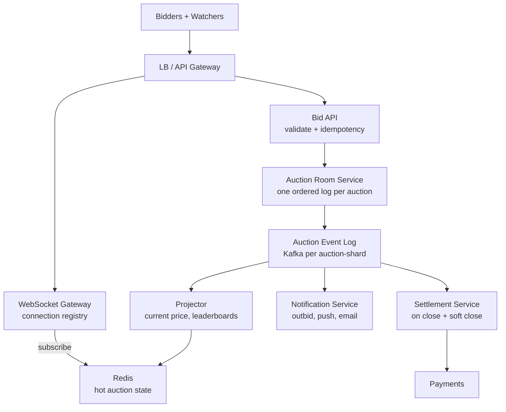
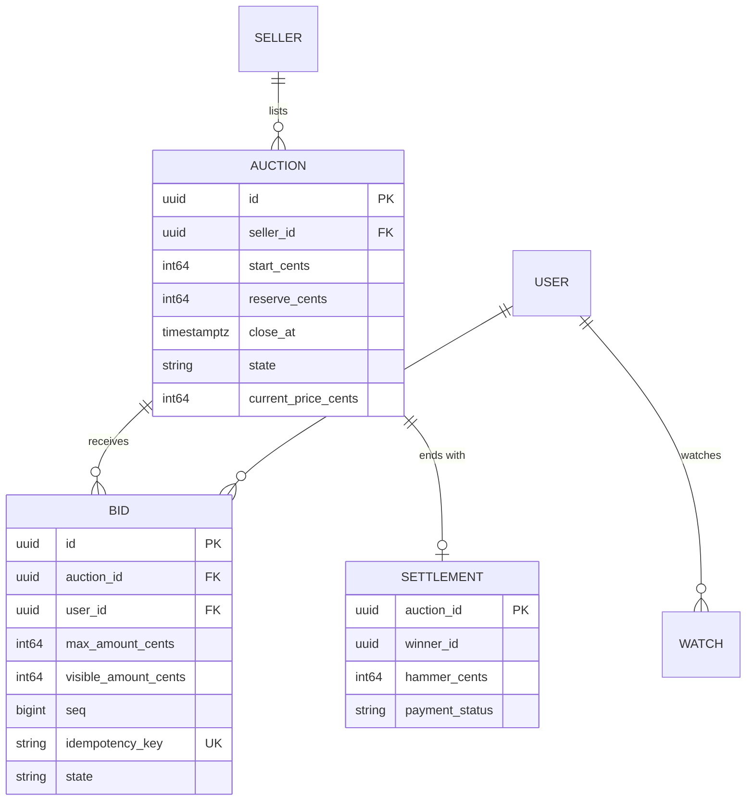
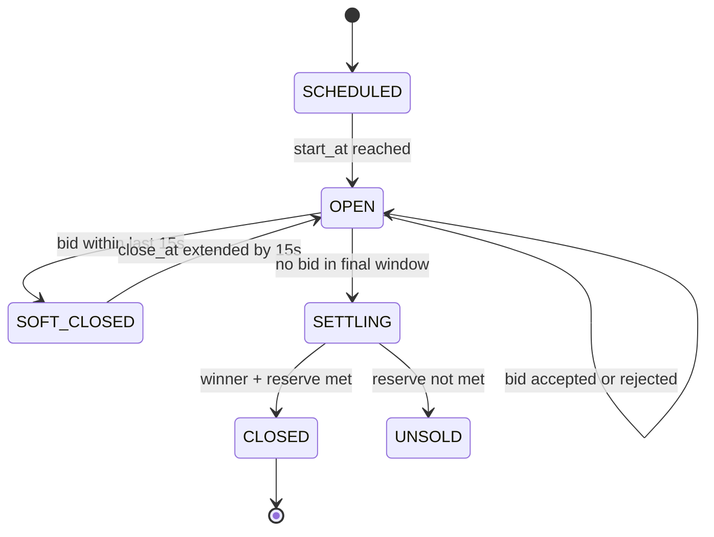
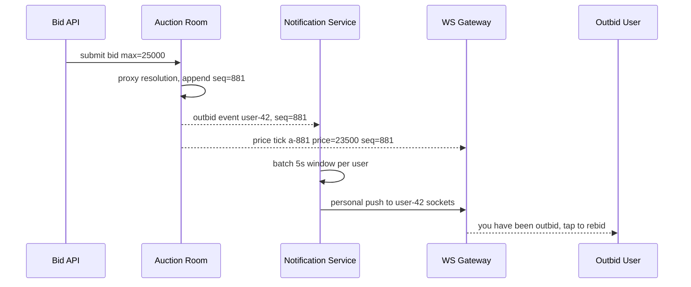

# Case Study: Design a Live Auction Platform

## Overview

Live auctions (eBay-style ascending bids plus timed marketplace auctions) are the interview for **fanout under contention**: thousands of watchers hammering one item, outbid notifications that must reach sockets in tens of milliseconds, and a close time that bots try to snipe in the last second. This walkthrough designs bid validation with proxy bidding, WebSocket fanout, soft-close anti-sniping, clock-skew fairness, and sharded auction rooms. It differs from the reserved-seating world in [Case Study: Ticketmaster](./ticketmaster.md): there, one seat is one winner with slow deliberation; here, contention is continuous and the *perception* of fairness is the product.

## Step 1 — Requirements

### Functional

- Sellers list items with start price, reserve, increment schedule, and close time
- Bidders place bids; **proxy bidding** holds each bidder's maximum and auto-bids the minimum increment on their behalf
- Real-time updates: current price, bid history, outbid notifications to losing bidders
- Soft close: a bid in the final N seconds extends the auction (anti-sniping)
- Outbid/bid-counters: watchers see live activity; bidders get push/email notifications
- Payment and settlement after close; seller/buyer reputation events

### Non-Functional

- **Scale**: 1M concurrent live auctions, 100K bids/s peak across the platform, hot auctions with 50K watchers each
- **Latency**: bid accepted (persisted) < 100 ms p99; fanout of new price to watchers < 200 ms p95
- **Consistency**: per-auction **total order** of bids — everyone sees the same history and the same winner; strict serialization per auction, relaxed across auctions
- **Fairness**: clock is server-authoritative; clients' wall clocks are irrelevant to who wins
- **Availability**: auctions rarely fail open — degraded (queued) service beats rejecting all bids

## Step 2 — Back-of-Envelope Estimation

| Quantity | Assumption | Result |
|---|---|---|
| Bids | 100K bids/s platform-wide | Trivially shardable by auction_id |
| Hot auction | 50K watchers × 1 bid every 2 s | 25 bids/s on ONE auction — the real problem is fanout, not bids |
| Watchers | Avg 20/auction × 1M auctions = 20M concurrent sockets | Connection registry sharded by user |
| Fanout messages | Outbid events + price ticks | A hot auction emits ~25 events/s to 50K sockets = 1.25M msg/s per auction worst case → batch/coalesce |
| Event bandwidth | 1.25M × 200 B | 250 MB/s per hot auction → coalesce to ~5 ticks/s ⇒ ~50 KB/s |
| Bid history | Append-only | 100K × 300 B ≈ 30 MB/day — small; durability is the point, not volume |

Key insight to say aloud: bids are cheap; **fanout is the system**. The bid path needs a total order per auction; the read path needs coalesced, throttled broadcast — two different machines.

## Step 3 — API Sketch

```text
POST /v1/auctions                              → create listing (seller)
GET  /v1/auctions/{id}                         → state: current_price, ends_at, bid_count
POST /v1/auctions/{id}/bids                    → { max_amount, idempotency_key }
WS   /v1/auctions/{id}/stream                  → price ticks, outbid events, close countdown
WS   /v1/users/{id}/notifications              → personal outbid/receipt events
POST /v1/auctions/{id}/settle                  → internal, on close
```

Bid request contract worth writing on the board:

```json
{ "auction_id": "a-881", "max_amount": 25000,
  "idempotency_key": "client-uuid-9f3", "client_ts": "2026-01-01T12:00:00.123Z" }
```

- `max_amount` enables proxy bidding; the server derives the visible bid from the incumbent's max
- `client_ts` is *recorded for dispute forensics only* — never used to order bids; the server clock plus the room's total order is the truth (fairness under skew, Deep Dive 3)
- WebSocket reconnection replays missed price ticks from the auction's event log by sequence number

## Step 4 — High-Level Architecture



- **Auction room**: one state machine per auction, sharded by `auction_id` — total order enforced by a single-threaded processor (actor) per auction or per auction-shard (see [Actor Model](../../../concurrency/actor-model-deep.md))
- **WebSocket gateway**: holds 20M sockets; subscribes to coalesced topics, not raw bid events
- **Notification service**: outbid is personal (1:1), price ticks are broadcast (1:N) — different paths, different guarantees

## Step 5 — Data Model



Bids are **append-only with a `seq` from the room's log**; nothing mutates a placed bid — retraction is a compensating event if policy allows. `visible_amount_cents` is derived (proxy logic) and recomputable, which is why the event log, not the row, is the truth.

## Deep Dive 1 — Bid Validation and Proxy Bidding

The room processor validates every bid against the current state, then applies proxy rules:

```text
1. auction state == OPEN and server_now < close_at (soft close may extend)
2. amount > current_price (or >= start if no bids)  → else reject "too low"
3. amount >= current + increment_schedule(current)  → else reject "below increment"
4. idempotency_key unseen for this auction           → else return original result
5. Proxy resolution:
   incumbent_max = incumbent.max_amount
   if new_max <= incumbent_max:
       incumbent stays; visible price = new_max + increment; notify new bidder "outbid instantly"
   if new_max > incumbent_max:
       new bidder leads; visible price = min(incumbent_max + increment, new_max)
6. Append BID event with seq; publish tick; update projections
```

The subtlety interviewers probe: **privacy of max_amount**. Visible price never reveals the leader's true max; the increment schedule (e.g., 5% steps) must be defined for every price band so rule 3 is total. Rejects are answers, not errors — a fast, specific reject ("current is 250, you sent 255, increment is 10") is what real bidders need.



## Deep Dive 2 — Outbid Notification and WebSocket Fanout



- **Two channels**: price ticks are *coalesced broadcasts* (at most ~2–5 ticks/s per auction; watchers need freshness, not completeness — the state endpoint reconciles); outbid alerts are *per-user, at-least-once*, batched briefly (a 5 s window collapses "outbid → rebid → outbid" storms)
- **Connection registry**: WS gateway shards by user_id; a user's sockets register on one shard, and fanout is a pub/sub from the notification service to the right shard (see [WebSocket](../../../networks/http/websocket.md))
- **Reconnect replay**: each tick carries the auction log `seq`; a reconnecting client asks for "events after seq S" — the log is the backfill
- **Backpressure**: a watcher that can't keep up gets coalesced state (last tick wins) — never per-event queueing on the socket (see [Backpressure](../backpressure.md))

**What the interviewer is probing:** the difference between broadcast and personal fanout. Merging them ("just push every bid to everyone") is how a hot auction DDoSes its own watchers.

## Deep Dive 3 — Soft Close and Fairness Under Clock Skew

The classic attack: a bot fires its real bid at T−50 ms so honest watchers cannot react. The defense:

- **Soft close**: any bid arriving within the final 15 s extends close_at to server_now + 15 s. Sniping loses its advantage because "last 15 s" keeps restarting while bidders remain active
- **Server-authoritative time**: acceptance order is the room log order; `client_ts` is forensic only. Clients' clocks (often seconds off; see [Time Synchronization](../../../networks/advanced/time-synchronization.md) and NTP, RFC 5905) can never decide a winner
- **Deadline ambiguity is a product decision**: an auction "closes" when the room observes `server_now ≥ close_at` with no pending bids in its ordered log — the close decision is itself an event in the log, so replays agree
- **Round-based alternative**: fixed 10 s rounds where all bids received in the round are ordered *within* the round (removes millisecond races entirely at the cost of pace) — good to name as the variant for regulated markets

| Mechanism | Protects | Cost | Notes |
|---|---|---|---|
| Soft close (extend N s) | Sniping | Auctions run long | Industry default (eBay uses it on some flows) |
| Round-based closing | Millisecond races | Pace, complexity | Regulated/auction-house style |
| Server-time authority | Clock-skew disputes | None | Non-negotiable |
| Latency-based seeding (queue bids, reveal at close) | Last-ms races entirely | Secrecy UX | "Sealed second-price" variant |

## Deep Dive 4 — Sharded Auction Rooms and Hot Auctions

- **Shard by `auction_id` hash** → rooms live on N processors; cross-auction interference is zero by construction, and 1M auctions spread across 100 shards is 10K rooms/shard — trivial load
- **Hot auction** (celebrity item, 50K watchers): the room is one ordered log; that part cannot parallelize by design. The *fanout* parallelizes: tick publishing is sharded by watcher-group, coalesced, and pushed via pub/sub fanout trees
- **Durability before ack**: the bid ack returns after the event is appended to the log (fsync/Kafka ack=all), not after projections update — projections are rebuildable, the log is not
- **Room crash recovery**: replay the auction's log slice from the last snapshot; in-flight bids are re-validated on replay (idempotency keys make replays safe)
- **Cross-region**: active region owns the auction (home-region pattern); failover mid-auction replays the log in the new region; the close event is the consistency boundary — bidding never writes to two regions

| Concern | Approach | Trade-off |
|---|---|---|
| Total order per auction | Single room processor + log | Serializes one auction — fine at 25 bids/s |
| Global bid history | Append-only log, sharded by auction | No cross-auction queries; analytics reads the log async |
| Hot fanout | Coalesced ticks + pub/sub trees | Watchers see last-wins state, not every event |
| Fairness | Server time + log order | Client clocks are advisory only |
| Settlement race | Close decided in-log; settlement consumes it | Payment retries need idempotency (see [Payments](../../../backend/api/api-idempotency.md)) |

## Bottlenecks & Follow-Up Questions

- **Socket storm at close**: 50K watchers × countdown UI polling; follow-up: server-push countdown ticks, stagger refreshes, CDN the static listing page
- **Notification amplification**: every outbid in a proxy war pings the loser; follow-up: 5 s batching + dedup by (user, auction, seq-range), email digest instead of per-event email
- **Reserve-price leakage**: rejects reveal information about the reserve; follow-up: generic "below reserve" messaging, no distance hints
- **Bid-rigging/shill detection**: seller bidding on own item; follow-up: graph features (device, payment, IP clusters) feeding the fraud system — say "post-hoc ML, not inline blocking" to stay honest
- **Settlement failure**: winner's payment bounces; follow-up: second-chance offer flow to next-highest bidder, defined in the state machine, not improvised

## Interview Questions

1. **How do you guarantee all bidders see the same bid history and winner?** Every bid is appended to a per-auction ordered log by a single room processor; all projections (price, UI, settlement) are functions of that log. Total order is enforced per auction by construction, not by distributed locks. Crashes replay the log; idempotency keys make replayed bids no-ops. Cross-auction, ordering doesn't matter, which is what makes sharding by auction_id safe.
2. **Why proxy bidding, and what does it change in the validation path?** Proxy bidding holds each bidder's max and auto-extends on their behalf, which reduces bid volume and hides the leader's true max. Validation becomes a two-max comparison: the new max either beats the incumbent's max (new leader, visible price = incumbent_max + increment) or loses (instant outbid at new_max + increment). The increment schedule must be total over price bands, and the visible price must never leak the leader's max.
3. **Design anti-sniping and defend its fairness.** A bid in the final 15 s extends close to server_now + 15 s, so the auction can only end after a quiet final window; sniping loses its edge because activity keeps the auction open. Fairness rests on server-authoritative time — client timestamps are forensic metadata, never ordering inputs — and the close decision is itself an event in the ordered log, so replays agree on the winner. Mention round-based closing as the variant for regulated settings.
4. **A hot auction has 50K WebSocket watchers. How do you fan out without melting down?** Separate broadcast from personal events. Price ticks are coalesced to a few per second per auction and pushed via pub/sub trees sharded by watcher-group; each tick carries the log seq so reconnects replay precisely. Personal outbid alerts batch per user. A slow watcher gets last-wins coalesced state rather than unbounded per-event queues. Bandwidth drops from ~1.25M msg/s to kilobytes per second per watcher.
5. **What happens if the auction room processor crashes with 30 seconds left?** The room is stateless-plus-log: a replacement processor loads the last snapshot and replays the auction's log slice, re-validating in-flight bids via idempotency keys. Because bid acks required the append to be durable (Kafka ack=all/fsync), no accepted bid is lost; the soft-close window also buys seconds of failover headroom. If failover exceeds the window, the close event simply occurs in the recovered log — still consistent.
6. **Where does this design meet the reserved-seating design in Ticketmaster?** Both serialize contention on a single resource (one auction, one seat set) via a single-owner state machine and an ordered log, and both make client clocks/order irrelevant. They diverge on load shape: ticketing is a burst at on-sale time metered by a waiting room; auctions are continuous low-rate contention with a fanout-heavy read path — which is why auctions spend their complexity on coalesced broadcast and soft closes rather than queues.

## Key Takeaways

- Per-auction total order via a single room processor + durable event log is the whole correctness story; everything else is a projection
- Proxy bidding changes validation into a two-max comparison and must never leak the leader's max through the visible price
- Fanout is the real load: coalesced broadcast ticks with seq-based reconnect replay, plus batched personal outbid notifications
- Soft close plus server-authoritative time neutralizes sniping and clock-skew disputes; the close decision lives in the log
- Sharding by auction_id gives horizontal scale for free because auctions don't interact; hot-auction fanout parallelizes reads, never the order itself
- Bid acks require durable appends (fsync/ack=all); projections and notifications are rebuildable — invest durability where it's unrecoverable

## References

- RFC 6455 — The WebSocket Protocol: https://datatracker.ietf.org/doc/rfc6455/
- RFC 5905 — Network Time Protocol v4 (why client clocks are advisory): https://datatracker.ietf.org/doc/rfc5905/
- Apache Kafka documentation — the per-shard ordered event log: https://kafka.apache.org/documentation/
- PostgreSQL documentation — transactional visibility for listing/settlement data: https://www.postgresql.org/docs/current/
- Redis documentation — pub/sub and coalesced tick storage: https://redis.io/docs/latest/
- Google SRE books — fanout, backpressure, and load-shedding patterns: https://sre.google/books/

## Cross-References

- [Case Study: Ticketmaster](./ticketmaster.md) — the reserved-inventory sibling with the same single-owner pattern
- [Real-World: Order Management](../real-world/order-management.md) — settlement and order state machines
- [Design: Notifications](../notifications.md) — outbid push/email delivery design
- [Networks: WebSocket](../../../networks/http/websocket.md) — the transport powering the watcher fanout
- [Networks: Time Synchronization](../../../networks/advanced/time-synchronization.md) — NTP, skew, and server-authoritative time
- [Backpressure](../backpressure.md) — coalescing and drop policies on hot sockets
- [Consistency Patterns](../consistency-patterns.md) — per-key ordering vs global consistency vocabulary
