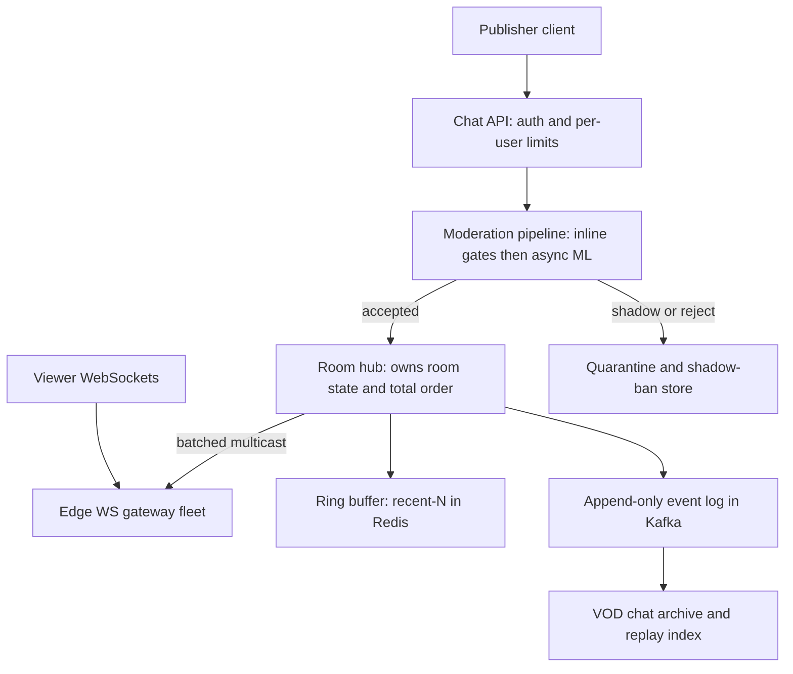
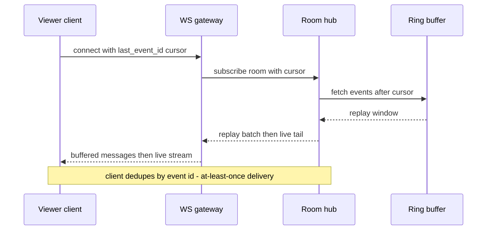

# Case Study: Design Live Comments (YouTube Live Chat / Twitch Chat / Live Reactions)

## Overview

This is the 45-minute walkthrough for the one-to-many chat problem: a single broadcaster's messages flowing *toward* millions of viewers, plus reactions, super-chat purchases, and moderation — where the fan-out ratio is 100,000:1, not 1:1. It looks like the [Real-Time Chat System](../real-world/chat-system.md) case study from a distance and is almost a different problem up close: direct-message chat optimizes durability and per-pair ordering, while broadcast chat optimizes *fan-out economics*, accepts loss on low-value events, and treats the message stream as a firehose you meter, sample, and prioritize. The running example is a flagship live event — an esports final or a record run on Twitch or YouTube Live — with ~1M concurrent viewers in one room. Pairs naturally with [Case Study: Video Conferencing](./video-conferencing.md), which covers the interactive small-room side of live media.

## Step 1 — Requirements

### Functional

- Viewers post text messages and emoji reactions to a live room; messages appear in a scrolling recent feed
- Paid priority messages (Super Chat / bits-style highlights) that are guaranteed visible and pinned briefly
- Channel-level moderation: automod filters, moderator delete/timeout/ban, slow mode, subscriber-only and member-only modes
- Sender metadata: badges, channel points, user color/name — attached at delivery, not stored per message
- VOD replay: chat scrolled alongside the recorded stream after the event
- Reconnect: a dropped viewer resumes within seconds without losing their place

### Non-Functional

- **Scale**: platform-wide Twitch runs ~2–3M concurrent viewers across 100K+ live channels; a single flagship room reaches 300K–1M+ concurrent
- **Delivery budget**: post-to-display p99 ≤ 2–3 s (looser than 1:1 chat — a few seconds of staleness is invisible in a scrolling feed)
- **Loss tolerance is tiered**: paid messages = guaranteed; chat messages = best-effort with sampling under overload; reactions = aggressively aggregatable
- **Ordering**: per-room total order *within* what the client displays; a message arriving out of order once every few seconds is acceptable if it self-corrects
- **Availability over durability**: during an event, accepting posts is optional (rate limits close the faucet); delivering the stream is not. Persisting every message is desirable, not required, for the free tier

## Step 2 — Back-of-Envelope Estimation

The naive fan-out number is the whole design argument — compute it first and the architecture writes itself.

| Quantity | Assumption | Result |
|---|---|---|
| Flagship room concurrent viewers | esports final / record attempt | ~1M concurrent |
| Inbound chat after per-user caps | ~50–100K active chatters, ~1 msg/s cap | ~1.7K msgs/s accepted |
| Naive fan-out load | 1.7K msgs/s × 1M viewers | **1.7B message deliveries/s** |
| Per-delivery cost | socket write + framing ≈ 1–5 µs CPU | 1.7B/s ≈ 5,000–8,500 dedicated cores, before GC |
| Reactions (hearts/emotes) | ~1M reactions/min in hype moments | ~17K events/s — aggregatable ~1000× |
| Bandwidth per room | 1.7K msgs/s × ~300 B × 1M viewers | ~5 Tbps if unbatched and unshaped |
| Connections per room | 1 WebSocket per viewer, ~100K conns/edge node | ~10–40 edge gateway nodes |
| Super Chats | maybe 50–200 during the event | trivial rate; must never be sampled |

The pattern to verbalize: inbound is trivial (a few K msgs/s), **outbound is the product of inbound and audience** — so every design decision either multiplies fan-out (bad) or divides the outbound stream (sampling, aggregation, per-user caps, batching). Bandwidth alone is survivable on batched writes; the unsolvable version is per-message per-viewer syscalls, which is why "just scale horizontally" is the wrong answer at 1.7B deliveries/s.

## Step 3 — API Sketch

```text
WS   /v1/rooms/{room_id}/live          → subscribe; server pushes event batches
POST /v1/rooms/{room_id}/messages      → post chat; 409/429 when capped or slowed
POST /v1/rooms/{room_id}/reactions     → fire-and-forget reaction, no ack by default
POST /v1/rooms/{room_id}/superchat     → paid message; idempotent purchase token
GET  /v1/rooms/{room_id}/messages      ?cursor=<event_id>&limit=200 → recent window or replay
POST /v1/rooms/{room_id}/moderation    → moderator actions (delete, timeout, ban)
```

Decisions worth stating out loud:

- The read side is **cursor-based**: every event carries a monotonic `event_id` per room, so reconnect and replay are the same mechanism (see [API Pagination](../../../backend/api/api-pagination.md) for cursor mechanics)
- Posting returns the server-assigned `event_id`; the client reconciles its optimistic UI against it, dropping duplicates by id
- Reactions deliberately have no per-event ack or ordering guarantee — they are counters, not messages

## Step 4 — High-Level Architecture



The load-bearing decision is the **room hub**: one logical process (or a small primary/standby pair) owns a room's state — roster, counters, the total event sequence — and is the single writer that stamps `event_id`s. Everything downstream is a subscriber. This gives per-room ordering for free and confines hot-room state to one place; the fan-out work is then about efficiently moving the hub's output to 10–40 edge gateways, each of which multicasts to its local connections.

Why not fan out from a Kafka stream consumed directly by every gateway? You can — the hub's event log goes to Kafka partitioned by `room_id` — but the direct hub→gateway push saves a hop of latency and lets the hub apply per-gateway shaping (sampling, aggregation) precisely when that gateway is behind. Production systems end up hybrid: hub push for the hot path, log for replay, moderation, and VOD indexing.

## Deep Dive 1 — Connection Gateway Layers

The edge tier holds connections and does almost nothing else, because at 100K sockets per node any extra per-message work multiplies badly:

- **Edge WS gateway**: terminates TLS/WebSocket, authenticates the session token once at connect, subscribes to the room's fan-out channel, and batches outbound frames — a flush every 100–200 ms turns ~17K per-message writes/s per node into a few thousand batched `writev` calls. Heartbeat/ping every 20–30 s with LB idle timeouts comfortably above it
- **Room router / registry**: maps `room_id → hub location` and `connection → gateway`, so a join is two lookups. Routing is sticky at connection granularity; a gateway never re-balances mid-event
- **Hub fan-out transport**: the hub multicasts one serialized batch per room per tick to each subscribed gateway (application-level pub/sub over TCP/mesh). Each gateway filters nothing — every gateway on the room gets the full batch and writes it to its local sockets, since its viewers all want the same stream
- **Capacity shape**: 1M viewers ≈ 10–40 gateway nodes; a hub with a 25 Gbps NIC is comfortable pushing the ~5 Tbps *before* batching math collapses to tens of Gbps after batching, aggregation, and sampling. The gateways are stateless and elastic; the hubs are few and stateful, so hot-room placement is a scheduling problem — flagship rooms get dedicated hub capacity, pre-warmed before the event (the same playbook as [Case Study: Ticketmaster](./ticketmaster.md) pre-warms for an on-sale)

**What the interviewer is probing:** whether you realize per-message costs are the enemy, not bandwidth. Quoting the batching math (17K syscalls/s → ~2K) shows you've operated something like this.

### Fleet Capacity Plan for a Flagship Event

Pre-event planning is arithmetic against the Step 2 table, done days ahead of the stream:

- **Edge**: 1M expected viewers → 10–40 gateway nodes at 50–100K connections each (4–8 vCPU of epoll work plus 5–10 GB RAM per node), provisioned at 1.5× forecast and distributed across 3–4 POPs per continent so a POP failure sheds load, not the stream
- **Hubs**: one active + one standby hub process for the flagship room, placed in the region with the lowest broadcaster RTT, pre-warmed with the room's state and the ring buffer; handover takes seconds because state is replayable from the event log
- **Inter-region**: one copy of the room's batch stream per continent (the cascade pattern), regional gateway trees beneath it — 2 cross-region streams, not 1M
- **Rehearsal**: synthetic load at 1.5× expected peak with production-shaped message mixes (95% reactions, 4.5% chat, 0.5% moderation) run against the real gateway fleet — a fleet that has never seen 15K msgs/s inbound will find its GC and TLS-accept limits on event night instead

## Deep Dive 2 — Throttling, Priority Queues, and Rate Limiting

Inbound shaping is what keeps fan-out bounded; it is a ladder of controls, cheapest first:

| Lever | Mechanism | Typical values | Effect |
|---|---|---|---|
| Per-user token bucket | N messages per window per user | 1 msg/s, burst 3–5 | Caps worst-case inbound; Twitch/YouTube-style spam floor |
| Room slow mode | Global inter-message delay per user | 3–30 s, raised live by mods | Converts a hype surge into a metered stream |
| Inline filters | ban-phrase, URL, duplicate-hash, caps-ratio | < 5 ms checks | Rejects obvious spam before fan-out |
| Shadow limit | Soft-drop: accept, deliver only to sender when room is saturated | invisible to user | Backpressure that doesn't feel like an error |
| Sampling at egress | Ship a fraction of events + "more messages" affordance | 20–50% under overload | The final relief valve; free tier only |
| Reaction aggregation | Count per 100–200 ms window per emote | ~1000× reduction | Hearts become counters, not messages |

The inbound acceptance rule is feedback-controlled: the hub knows outbound health (gateway buffer depth, lag), and adjusts a global acceptance rate plus per-user limits. Under extreme hype, the ladder tightens top-down; nothing is dropped that was accepted, so the client-visible contract is "accepted messages always appear."

The full contract, per event class, is worth stating as a table — it is the clearest way to show that delivery guarantees are a *budgeted product decision*, not an accident of implementation:

| Event class | Ack | Ordering | Guarantee | Under overload |
|---|---|---|---|---|
| Super Chat / paid | purchase token | total order per room | guaranteed, never sampled | never degraded — isolated queue |
| Chat message | server `event_id` | total order per room | at-least-once, client dedupe | acceptance narrows first, egress sampling last |
| Reaction | none | none | best-effort counters | aggregation window widens 100 ms → 1 s |
| Moderation action | `event_id`, priority | ahead of chat in batch | guaranteed | never dropped or sampled |
| System events (room state, stream status) | `event_id` | total order | guaranteed | never dropped — clients act on these |

**Paid priority (Super Chat) is a separate queue**, and that separation is the interview-grade point: purchase authorization produces a priority event with an idempotency token, the hub stamps it into the sequence with guaranteed delivery — never sampled, never shadow-limited — and the pinned banner state is maintained separately from chat text. Isolating the paid lane means free-tier backpressure can never damage the revenue path, and the money flow keeps its own exactly-once-ish semantics via the purchase token (see [Design: Payment System](../payment.md)).

## Deep Dive 3 — Moderation Pipeline

Moderation is a pipeline with two latency classes — cheap inline gates that block instantly, and smarter async stages that remove within seconds:

1. **Inline (< ~10 ms)**: rate limit, ban-phrase/regex list per channel, duplicate detection via rolling per-user message hash, link spam rules, new-account restrictions. Obvious violations are rejected here and never enter the stream
2. **Async ML (sub-second to seconds)**: toxicity/classifier scoring of the accepted stream; borderline messages are delivered then *recalled* — the client deletes-by-id on a moderation event. Classifier misses are acceptable; classifier latency in the hot path is not, which is why this stage is asynchronous
3. **Shadow ban / soft moderation**: shadow-banned users' messages are stored, acked, and shown *only to themselves* (and optionally mods) — they keep posting into the void, which removes the ban-appeal churn and denies the reaction signal spammers optimize for
4. **Human moderators**: delete/timeout/ban actions propagate as priority events with sub-second application across all gateways; automod levels per channel (per Twitch AutoMod's model) let mods tune the inline gate's aggressiveness live

Two properties to call out. First, moderation decisions are *events in the same stream* — a delete is an event that clients apply to their rendered buffer, which keeps every gateway and client convergent without re-fetching. Second, the pipeline is per-room configurable, so moderation policy scales with room risk, not platform uniformity; a 1M-viewer room runs the strict profile, a 20-viewer streamer runs defaults.

Per-room profiles are configuration, not code — the same shape as slow mode, tuned live by the channel owner or platform staff mid-event:

```yaml
automod:
  level: strict                 # off | default | strict | lockdown
  blocked_phrases: ["free skins", "giveaway", "click my"]
  link_policy: mods_only
  duplicate_window_s: 60        # same-hash within window → reject
  caps_ratio_max: 0.7
  new_account_min_hours: 24
escalation:
  strike_1: delete
  strike_2: timeout_600s
  strike_3: ban
  shadow_ban_on_repeat: true
```

Lockdown mode (subscriber-only, one message per 60 s) is the event-night profile for a room under a spam raid, and the fact that it is a config flip — not a deploy — is what makes the moderation system operational rather than aspirational.

## Deep Dive 4 — Read Models, Reconnect, and Event Replay

The read model is a **recent-N window**, not a mailbox: new joiners get the last ~100–200 events (or last ~30 s), rendered into a scrolling feed they can scroll up through a bounded history. The window lives in the hub's memory with a Redis-backed copy (`LIST`/sorted set capped by trim) so a hub handover doesn't blank the feed:



Delivery is **at-least-once with client-side dedupe by `event_id`** — exactly-once across gateways, reconnects, and replays is not worth the coordination cost when dedupe is a single set lookup on the client. Beyond the replay window (say, a viewer offline for an hour), reconnect falls back to a REST fetch of the recent window plus a fresh live tail; unbounded catch-up is explicitly a non-goal for live rooms. VOD replay is the durability tier: the same event log is archived in stream-time order and served by stream timestamp at replay, which is why the log write is worth its cost even though live delivery would survive without it.

The client-side half of the contract is a dozen lines, which is the point — put the complexity in the server, keep the client trivial:

```javascript
const seen = new Set();                    // dedupe across replays and re-delivery
function onBatch(batch) {
  for (const ev of batch) {
    if (seen.has(ev.id)) continue;         // at-least-once → idempotent render
    seen.add(ev.id);
    apply(ev);                             // insert, delete-by-id, counters, room state
  }
  lastCursor = batch.at(-1).id;            // persisted for reconnect
}
```

### Metrics and SLOs

- **Post-to-display p99** (measured client-side: message timestamps embedded by the hub vs render time) — the headline SLO, target ≤ 2–3 s at flagship scale
- **Egress lag per gateway**: age of the oldest unflushed batch per node — the earliest overload signal, and the input to the acceptance-rate feedback loop
- **Acceptance rate vs cap**: how much of the configured inbound budget is being used; a room pinned at 100% for minutes means slow mode should rise
- **Moderation recall latency**: accept-to-delete p95 for borderline content — the number that keeps the async-ML design honest (seconds, not minutes)
- **Reconnect success within cursor window**: percentage of rejoins served from the ring buffer rather than degraded to a REST refetch
- **Fan-out cost per delivery**: batched write calls per message delivered — the efficiency metric that proves the batching layer is working, and the first thing to regress after a "small refactor"

## Bottlenecks & Follow-Up Questions

- **The 1.7B deliveries/s headline**: even perfect batching can't absorb a 10× hype spike. Follow-up: "reactions triple in one minute — what gives first?" → Aggregation windows widen (100 ms → 1 s), then egress sampling of free chat starts, paid lane untouched; the ladder from Deep Dive 2 is the answer
- **Paid-lane abuse**: Super Chat is guaranteed delivery, which makes it a spam channel for anyone willing to pay. Follow-up: paid messages pass the same inline filters plus purchase-velocity limits, and refunds (not deletion) are the correction path once a paid message is pinned
- **Hot hub CPU/GC**: a single hub serializing 2K events/s is light, but serializing *to 40 gateways* with per-gateway framing is real. Follow-up: pre-serialize one batch, share the buffer, per-gateway header prep only
- **Gateway churn mid-event**: 100K mobile viewers reconnect per minute in bad networks. Follow-up: session tokens + hub-side hold window (same as conferencing rejoins), jittered backoff, and reconnect cursors to avoid re-fetching
- **Moderation recall latency**: a toxic message visible for 3 s at 1M viewers is 1M impressions. Follow-up: stricter inline profile for flagship rooms (accept fewer, recall fewer) — the trade between false positives and exposure is explicit and per-room
- **Cross-region viewers**: a room hosted in us-east serves eu/apac viewers at +150–300 ms. Follow-up: hub fan-out replicated inter-region (one cross-region copy, regional gateway trees) — the cascade pattern is identical to the conferencing SFU cascade
- **Log retention cost**: 1.7K events/s × 3 h = ~18M events per event. Follow-up: tiered storage — hot ring buffer, warm Kafka compaction for replay, cold object-store archive; never keep the full stream on the live path

## Interview Questions

1. **Why is broadcast chat architecturally different from 1:1 chat like WhatsApp?** The fan-out ratio changes the economics: 1:1 chat pays storage and per-pair delivery for a handful of recipients, so durability and ordering dominate. Broadcast pays inbound × audience — 1.7K msgs/s against 1M viewers is 1.7B deliveries/s — so the design optimizes outbound shaping: per-user rate limits, reaction aggregation, egress sampling, and batched gateway writes. Durability is demoted to a tiered read model (recent-N ring buffer, archived log for VOD), and loss tolerance is explicitly per event class: paid messages guaranteed, chat best-effort, reactions just counters.
2. **How do you keep 1M concurrent WebSockets healthy without them melting the gateways?** Connections are terminated at a stateless edge tier doing nothing but TLS, auth-at-connect, and batched frame writes — a flush every 100–200 ms collapses per-message syscalls by 10–20×. Heartbeats at 20–30 s keep LB idle timeouts happy; reconnects use session tokens, cursors, and jittered backoff so a network blip doesn't synchronize 100K rehandshakes. Capacity is elastic because gateways hold no room state; the stateful hubs are few, pre-warmed for flagship rooms, and the edge tier scales by addition only.
3. **Design the rate-limiting ladder for a hype spike.** Cheapest controls first: per-user token buckets (1 msg/s, small burst) cap the worst case; room slow mode converts a surge into a metered stream; inline filters kill obvious spam pre-fan-out; then the hub's acceptance rate tightens as outbound lag grows, with soft-drop (deliver-to-sender-only) instead of hard errors; finally egress sampling of free-tier chat at 20–50% with a "more messages" affordance. Paid messages bypass every tier — the revenue lane is a separate queue with guaranteed delivery. The key property: nothing *accepted* is ever dropped; the faucet narrows instead.
4. **How does moderation work when you can't afford inline ML latency?** Split by latency class: sub-10 ms inline gates (ban phrases, duplicate hashes, new-account rules) block the obvious before fan-out; async classifiers score the accepted stream and issue delete-by-id events that clients apply within seconds; shadow bans store and ack messages but deliver them only to the sender. The client-received contract stays uniform — moderation is just another event in the stream — and flagship rooms run stricter inline profiles so recall latency is bounded by accepting less, not by speeding up the classifier.
5. **A viewer's phone drops off Wi-Fi for 45 seconds mid-event. What happens on reconnect?** The client reconnects with its last `event_id` cursor; the gateway re-subscribes, the hub replays the ring-buffer window after that cursor in one batch, then resumes the live tail — at-least-once delivery with client-side dedupe by event id. If the outage exceeded the replay window, reconnect degrades to a REST fetch of the recent window plus a live tail, because unbounded catch-up is a non-goal for a scrolling live feed. Total perceived gap is a couple of seconds, which is exactly the delivery budget this product sets.
6. **Where do reactions fit if they're "just counters"?** Reactions are the highest-rate, lowest-value traffic — a hype moment is 17K events/s that nobody reads individually. The server aggregates per emote into 100–200 ms windows and ships counter deltas, a ~1000× reduction; clients render counts and decay animations. No ordering, no per-event ack, no replay beyond the live window, and under load their aggregation windows widen before any chat message is touched — the loss-tolerance ladder is explicit and reactions sit at the bottom.

## Key Takeaways

- The fan-out identity rules the design: outbound load = accepted inbound × audience, so every mechanism either caps inbound or divides the outbound stream
- Naive per-message delivery at flagship scale is ~1.7B deliveries/s — the fix is batching (10–20× syscall reduction), aggregation (~1000× on reactions), and sampling, in that order of severity
- A single-writer room hub gives per-room total order and one place to shape traffic; stateless edge gateways hold connections and scale horizontally
- Delivery guarantees are tiered by value: paid lane guaranteed and unsampled, chat at-least-once with client dedupe, reactions as aggregate counters
- Moderation is a two-latency-class pipeline (inline gates block, async ML recalls) whose decisions are events in the same stream, with shadow bans to neutralize abuse loops
- The read model is a recent-N ring buffer with cursor-based reconnect and replay; unbounded catch-up is a non-goal, and VOD durability comes from the archived event log, not the live path
- Backpressure is user-invisible by design: tighten the faucet and sample the free tier rather than erroring or dropping accepted messages
- The same cascade and pre-warming playbooks appear here as in conferencing and ticketing — hot-event scale is a scheduling problem, not a protocol problem

## References

- RFC 6455 — The WebSocket Protocol: https://datatracker.ietf.org/doc/rfc6455/
- MDN Web Docs — WebSockets API (connection lifecycle, backpressure via bufferedAmount): https://developer.mozilla.org/en-US/docs/Web/API/WebSockets_API
- Twitch Developer Documentation — EventSub (real-time event delivery for live channels): https://dev.twitch.tv/docs/eventsub/
- YouTube Data API — Live streaming resources (live chat messages, super chat events): https://developers.google.com/youtube/v3/live/docs
- Apache Kafka documentation — partitioned event log behind replay and VOD archival: https://kafka.apache.org/documentation/
- Redis documentation — capped lists/sorted sets for recent-N windows: https://redis.io/docs/latest/
- NATS documentation — lightweight pub/sub for gateway fan-out: https://docs.nats.io/
- Socket.IO documentation — connection management, rooms, and reconnection patterns as a reference implementation: https://socket.io/docs/v4/
- Google SRE Books — load shedding, backpressure, and overload behavior chapters: https://sre.google/books/

## Cross-References

- [Real-World: Chat System](../real-world/chat-system.md) — the 1:1/group chat sibling: durability and per-pair ordering where fan-out is small
- [Real-World: YouTube](../real-world/youtube.md) — the platform context this chat rides on: upload, transcoding, and delivery at YouTube scale
- [Case Study: Video Conferencing](./video-conferencing.md) — the interactive counterpart: small rooms, strict latency, and the media path
- [Design: Rate Limiter](../rate-limiter.md) — token-bucket mechanics behind the per-user and room-level throttle ladder
- [Design: Backpressure](../backpressure.md) — the load-shedding theory behind egress sampling and soft-drop
- [WebSockets](../../../networks/http/websocket.md) — the transport fundamentals: frames, heartbeats, and connection lifecycle
- [Design: API Pagination](../../../backend/api/api-pagination.md) — cursor mechanics reused for event replay
