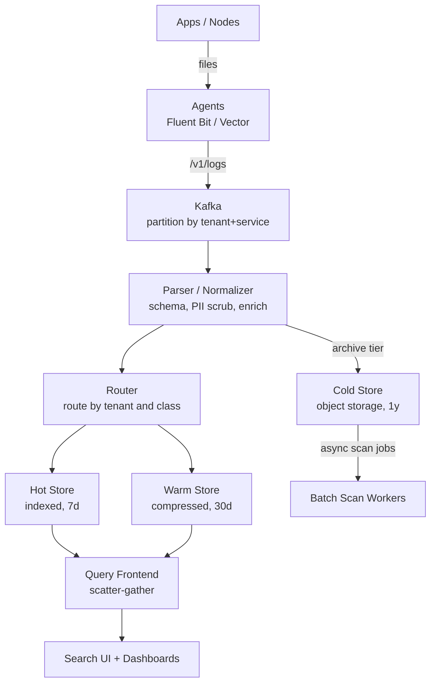
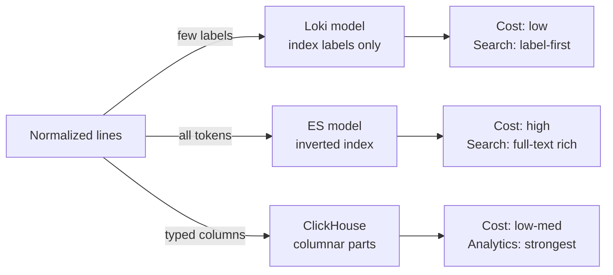
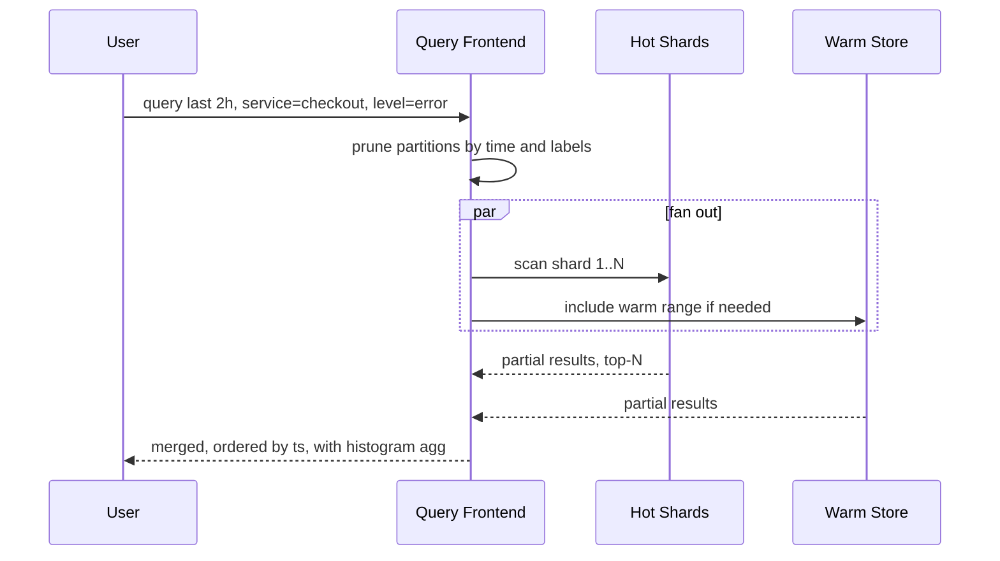

# Case Study: Design a Log Analytics Platform

## Overview

Log analytics is the cost-discipline interview: 1M+ events per second of noisy, semi-structured text must be collected, shipped, indexed (or deliberately not indexed), queried by humans under pressure at 3 AM, and stored for a year — on a budget someone will second-guess. This walkthrough designs the full pipeline: agents, Kafka transport, parser/normalizer, the storage-model decision (Loki's label model vs Elasticsearch's inverted index vs ClickHouse columnar), tiered retention, and query fanout — ending with the cost-per-GB table that decides real architectures. It complements the pillar overview in [HLD: Monitoring & Observability](../hld/monitoring-observability.md) and the index internals in [Index-Advanced](../../../dbms/advanced/index-advanced.md).

## Step 1 — Requirements

### Functional

- Collect stdout/stderr and structured JSON logs from containers, VMs, and managed services
- Parse/normalize into a common schema (timestamp, level, service, message, labels/fields) with PII scrubbing
- Full-text search ("find me the line"), field filters (service, level, k8s pod), and aggregations (counts, error rates per minute)
- Dashboards: error-rate trends, top messages, log-to-trace correlation (trace_id in every line)
- Alerts on log patterns (e.g., OOM-kill string appears) where metrics can't see the cause
- Retention tiers with per-namespace policy and legal hold

### Non-Functional

- **Scale**: 1M events/s sustained, 10 MB/s per busy node; spikes 10× during incidents
- **Ingest latency**: searchable within 60 s (log lines are *evidence* during outages)
- **Query**: filtered tail/scroll < 2 s p95 for recent data; historical scans bounded by tier
- **Retention**: hot 7 days (index), warm 30 days (compressed), cold 1 year (object storage, no index)
- **Delivery**: at-least-once with dedup by (source, offset); loss budget explicit — drop-and-count under overload, never block the app
- **Cost**: the design is judged in $/GB/month as much as in QPS

## Step 2 — Back-of-Envelope Estimation

| Quantity | Assumption | Result |
|---|---|---|
| Event rate | 1M events/s × 500 B avg | ~500 MB/s = **43 TB/day raw** |
| Compression (zstd) | 10–20× on repetitive logs | ~3–4 TB/day stored pre-index |
| Hot index (7 d) | 3.5 TB/day × 7 + index overhead 30% | ~30 TB hot cluster |
| Warm (30 d) | Compressed, no full index | ~105 TB on cheap NVMe/HDD |
| Cold (1 y) | Object storage, columnar/parquet | ~1.3 PB at $10–20/TB-month ≈ **$15–25K/mo** |
| Kafka transport | 500 MB/s, 3× replication, 24 h retention | 36 TB cluster; partitions = 200–400 |
| Agent footprint | Per node: 1–2% CPU, 100 MB RAM | Non-negotiable ceiling; agents are guests |
| Query fanout | 7-day hot scan over 30 shards | Scatter-gather with time pruning, top-N merge |

The framing to say out loud: logs are a **write-dominated, scan-mostly, cost-bounded** workload. Every design choice below is a point on the index-cost vs query-speed curve.

## Step 3 — API Sketch

```text
# Ingest (agents push; also OTLP logs endpoint)
POST /v1/logs          { records: [ { ts, level, service, msg, labels{}, trace_id } ] }
# Query (store API)
POST /v1/query
  { "time_range": "now-2h", "filter": { "service": "checkout", "level": "error" },
    "query": "timeout", "limit": 1000, "aggs": [ { "histo": "1m", "by": "service" } ] }
# Management
PUT  /v1/retention/{namespace}      { "hot_days": 7, "warm_days": 30, "cold_days": 365 }
POST /v1/parsers/{name}/test        → parse a sample line, show extracted fields
```

Collection is agent-side config, not an API you design, but state the contract: agents tail files (log files as the durable buffer), ship with at-least-once, and checkpoint offsets locally.

## Step 4 — High-Level Architecture



- **Agents** (Fluent Bit/Vector): tail files, multiline join (stack traces), backpressure handling, local disk buffer
- **Kafka**: decouples ingest bursts from indexing; partition by tenant/service for ordered per-source streams; 24 h retention is the pressure valve (see [Kafka](../../../backend/messaging/kafka.md))
- **Parser/normalizer**: JSON → schema, regex/GeoIP enrichment, PII redaction, dead-letter malformed lines (never silently drop)
- **Router**: tenant-aware; noisy tenants get their own partitions/shards (fairness again, like the [task scheduler](./distributed-task-scheduler.md))

## Deep Dive 1 — Agents: The Component Everyone Under-Specifies

The agent is resident software on every machine you run — its failure modes are everyone's failure modes:

- **Tail + checkpoint**: read files from byte offsets, persist offsets; file rotation handled via inode tracking; truncated/rotated files must not replay or skip
- **Backpressure**: Kafka unavailable → agent buffers to local disk (bounded, e.g., 1 GB) then **drops oldest with a counter** — a logging outage must never OOM the node it lives on (see [Backpressure](../backpressure.md))
- **Multiline handling**: stack traces span lines; join by indentation/regex before shipping, or search quality collapses
- **Cost discipline**: parse *at the edge* when cheap (drop debug lines, extract fields), because ingress bytes are priced at every hop
- **Vector vs Fluent Bit**: both do tail→transform→ship; Vector's VRL gives in-agent transforms, Fluent Bit wins on footprint — say "footprint and transform language" as the selection axes (https://vector.dev/docs/, https://docs.fluentbit.io/manual/)

## Deep Dive 2 — The Storage Model Decision (the core of the interview)

Three philosophies for the same data:

| | **Loki: label model** | **Elasticsearch: inverted index** | **ClickHouse: columnar** |
|---|---|---|---|
| What's indexed | Labels only (service, pod, level) — ~10 fields | Every (token, field) → doc IDs | Nothing full-text; columns + sparse primary index |
| Line storage | Compressed chunks per label set | Stored fields per doc | Column files, highly compressed |
| Query path | Label select → scan chunk blobs (grep-like, parallel) | Term lookup → intersect → fetch | Column scan with vectorized filters |
| Ingest cost | Very low (few indexes) | High (tokenization, merges) | Low-medium |
| Full-text search | Weak (no token index) | **Excellent** (relevance, wildcards) | Good (hasToken, regex slower) |
| Aggregations | Post-scan compute | Good (aggs pipeline) | **Excellent** (vectorized GROUP BY) |
| $/GB | Lowest of indexed options | Highest | Low-medium |
| Killer risk | High-cardinality labels recreate the ES problem | Index size ≈ data size; merge storms | JSON paths need schema discipline |

The interview answer is a **decision, not a survey**: default Loki-style label indexing for high-volume machine logs where queries are "filter by labels, eyeball lines"; Elasticsearch where humans need arbitrary full-text relevance (support, security investigation); ClickHouse where log *analytics* dominates (error rates by route, percentile latencies from logs, join with metrics). Hybrid is normal: hot tail in Loki/CH, security audit stream to ES, everything to object storage cold.



**What the interviewer is probing:** whether you know *why* Loki refuses to index message bodies — because index size was the reason everyone's ELK bill exploded — and whether you can articulate the query patterns that break each model.

## Deep Dive 3 — Parser/Normalizer and the Common Schema

- **Schema contract**: every line gets `ts, level, service, env, msg` + bounded label set; unknown fields land in a `fields` map (schema-on-read with a schema-on-write core)
- **Timestamp discipline**: parse to UTC at ingest; agent clocks are NTP-disciplined but logs interleave from thousands of hosts, so ordering within a service is *arrival-ordered*, not true-time — say this before someone asks
- **PII scrubbing** at the normalizer (emails, tokens, card-shaped strings) — cheaper here than retroactive redaction, and legal holds make retroactive impossible
- **Malformed lines** → dead-letter topic with the raw payload; the parser is versioned and replayable, because "we changed the parse rule" happens monthly
- **Enrichment**: k8s metadata (namespace, pod, node) joined from the platform's event stream; geo/IP from the line — all bounded, all label-eligible

## Deep Dive 4 — Query Fanout and Tiered Retention



- **Time-first pruning**: partitioning by day (and pre-aggregating per-shard min/max ts) means a 2 h query touches 2/N of shards — the single biggest latency lever
- **Scatter-gather with budgets**: per-shard limits + global top-N merge; a runaway `match_all` gets a bounded scan, not a cluster fire
- **Tier transitions**: hot index → warm (recompress, drop index or keep labels) → cold (columnar/parquet in object storage, no index; queried by batch scan jobs with a minutes-not-ms SLA)
- **Legal hold** pins specific time ranges/namespaces out of deletion; retention APIs are per-namespace and audited
- **Cost-per-GB table** (illustrative, order-of-magnitude, and interviewers want it):

| Tier | Technology | $/GB-month (order) | What you get |
|---|---|---|---|
| Hot indexed | ES/CH on NVMe, ×2 replica | $100–200/TB | 2 s queries, full search |
| Warm | Loki-style labels / compressed columns | $30–60/TB | Label filters + scan |
| Cold | S3 parquet, no index | $10–20/TB | Batch scans, compliance |
| Archive | Glacier-class | $1–4/TB | "It exists" — restores take hours |

## Bottlenecks & Follow-Up Questions

- **High-cardinality labels** (user_id, request_id as labels): recreates the index-size disease in the "cheap" system; follow-up: label allowlists, cardinality metrics per tenant, rejection at ingest
- **Kafka partition skew**: one noisy service floods one partition; follow-up: partition by (tenant, service, hash-of-source) with per-tenant quotas at the agent
- **Reindexing after schema change**: 43 TB/day raw; follow-up: versioned parsers + replay from cold tier only for affected namespaces, never fleet-wide
- **Query storms during incidents**: everyone opens the UI; follow-up: per-user query budgets, result caching, tier-aware defaults (hot only)
- **Log volume grows 2×/quarter**: follow-up: aggressive edge sampling of debug logs, per-service volume budgets with chargeback — cost control is a product feature, not a cleanup task

## Interview Questions

1. **Why is Kafka in the middle when agents could write directly to the store?** Indexers are batchy and restart for upgrades; direct writes couple ingest bursts to indexer health. Kafka absorbs 10× incident spikes, gives replay after parser changes, and its 24 h retention is a safety net during store outages. The trade-off is one more cluster to operate — at 43 TB/day it pays for itself in the first incident.
2. **Explain Loki's "index labels only" bet and when it loses.** Loki indexes a small label set and stores lines in compressed chunks per label set; queries select labels, then scan chunk blobs in parallel. It wins when queries are label-filtered tails and volume is huge; it loses on arbitrary full-text relevance and wildcard search across message bodies, where an inverted index (ES) or columnar token indexes (ClickHouse) are structurally better. The bet is that most log queries are "filter, then eyeball."
3. **Design the agent so a 30-minute Kafka outage doesn't take down customer nodes.** Tail files with persisted byte/inode checkpoints; buffer to a bounded local disk region (e.g., 1 GB); when full, drop oldest in priority order (keep error and audit lines) and increment a dropped-count metric that itself gets exported. Never grow unbounded, never block the app's stdout. After recovery, resume from checkpoints with at-least-once redelivery and store-side dedup by (source, offset).
4. **Where does the money actually go, and what's the biggest lever?** Index construction and replicas in the hot tier dominate; the biggest lever is volume *before* ingest (drop debug at the agent, sample chatty successes), the second is tiering (7 days hot vs 90 costs ~4× less per byte-month), the third is the storage model (labels/columnar vs full inverted index). Quote the $/GB tier table — it moves the conversation from architecture to economics, which is the point.
5. **How do you correlate a log line to a trace, and why is trace_id in logs not enough by itself?** SDKs inject trace_id into the log record and the normalizer promotes it to a first-class field; the UI links line → trace store by ID. It's not enough because sampling (see [Distributed Tracing](./distributed-tracing.md)) may have dropped the trace — so the log line must stand alone, and tracing must tail-keep errors so the click-through lands. Correlation is a two-sided contract: logs carry the ID, traces promise to have it.
6. **A tenant's logs contain PII that must never leave one region. Where does this constraint bite your pipeline?** Region pinning must exist before the first hop: agents route to regional Kafka, normalizers and stores are regional, cross-region cold archive is disabled for that namespace, and the retention API refuses cross-region replication. The bite is in *query* (global search must fan out per-region and merge without moving raw lines) and in the cold tier, where object-storage replication defaults would silently violate the constraint.

## Key Takeaways

- Logs are a cost-bounded, write-dominated, scan-mostly workload — every decision is a point on the index-cost vs query-speed curve
- Agents are resident guests on every node: bounded buffers, drop-and-count, multiline joins, and edge parsing are the spec
- Kafka buys replay and burst absorption; partition by tenant/service and enforce quotas or one noisy service owns the pipeline
- The storage model is a *choice*: Loki label model (cheap, label-first), Elasticsearch inverted index (rich full-text, expensive), ClickHouse columnar (analytics king) — pick per query pattern
- Time-first partitioning and scatter-gather budgets make queries fast; tiered retention makes the bill survivable
- PII scrubbing and legal holds happen at the normalizer and retention API, because retroactive redaction is impossible once bytes are held

## References

- Vector documentation — agent transforms and VRL: https://vector.dev/docs/
- Fluent Bit documentation — tail input, buffering, multiline: https://docs.fluentbit.io/manual/
- Grafana Loki documentation — label model and query language: https://grafana.com/docs/loki/latest/
- Elasticsearch documentation — inverted index and aggregations: https://www.elastic.co/docs
- ClickHouse documentation — MergeTree, Map columns, low-cardinality: https://clickhouse.com/docs
- Apache Kafka documentation — partitions, retention, delivery semantics: https://kafka.apache.org/documentation/
- RFC 5424 — The Syslog Protocol (the data model logs are normalized from): https://datatracker.ietf.org/doc/rfc5424/
- OpenTelemetry logs specification: https://opentelemetry.io/docs/specs/otel/logs/

## Cross-References

- [HLD: Monitoring & Observability](../hld/monitoring-observability.md) — where logging sits among the pillars
- [Case Study: Metrics Monitoring](./metrics-monitoring.md) — the metrics pillar; rules that page on log patterns
- [Case Study: Distributed Tracing](./distributed-tracing.md) — trace_id correlation and sampling contracts
- [Design: ClickHouse](../../../data-engineering/clickhouse.md) — the columnar engine from Deep Dive 2
- [Backpressure](../backpressure.md) — the agent buffering and drop-and-count contracts
- [Kafka](../../../backend/messaging/kafka.md) — the transport design between agents and parsers
- [Index-Advanced](../../../dbms/advanced/index-advanced.md) — inverted vs columnar index internals
