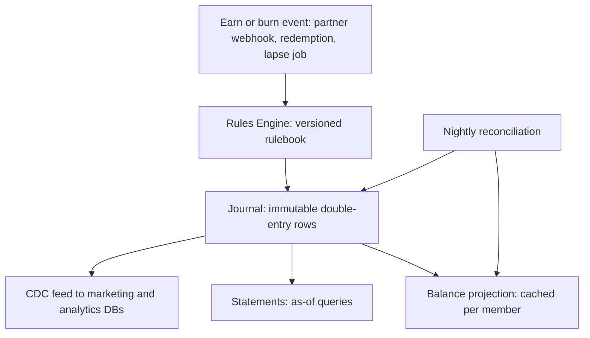
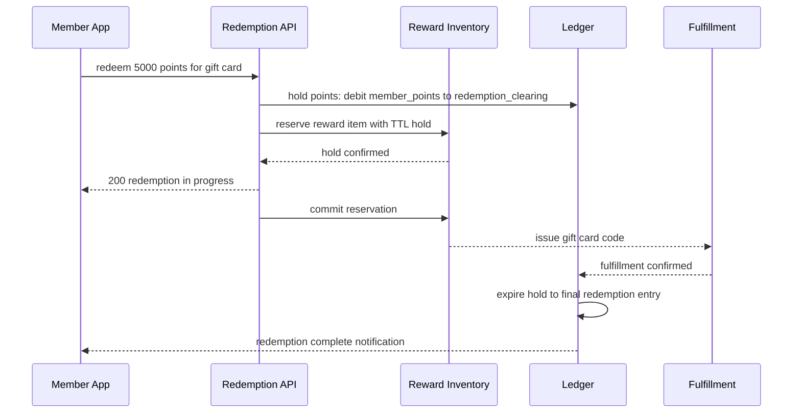

# Case Study: Design a Loyalty & Points Platform (Cross-Industry)

## Overview

Loyalty platforms — airline miles, hotel points, bank reward programs, retailer cashback — all reduce to one machine: an **earn/burn ledger** that moves points under partner-specific rules, an expiry engine that lapses idle balances, and a redemption marketplace that converts points into inventory-constrained rewards. The interview version of this problem tests whether you recognize that points are **money-shaped**: a liability on the company's balance sheet, subject to audit, fraud, and compliance, and therefore never a column called `balance` that you `UPDATE`. This page designs the platform in the 45-minute format: double-entry ledger, rules engine, redemption with holds, lapse policies, points-farming fraud, statement/compliance duties, eventual consistency between the marketing database and the ledger, and program-migration stories. The money-movement fundamentals live in [Banking Ledger](../banking-ledger.md); here we adapt them to a marketing currency.

## Step 1 — Requirements

### Functional

- **Earn**: partner transactions (flights, card spends, retail purchases) convert to points via a versioned rules engine; pending → confirmed lifecycle for refundable activity
- **Burn**: redeem points for rewards from a marketplace (gift cards, travel, merch, statement credit), with points + cash split payments
- **Expiry/lapse**: points expire under program policy; expiry resets on qualifying activity; lapse events are ledgered
- **Statements**: member-facing statements and balances as-of any date; support/CS tooling reads the same projections
- **Promotions**: multipliers, caps, and targeted campaigns with start/end semantics
- **Fraud controls**: velocity limits, review queues, clawbacks
- **Admin**: program configuration, partner onboarding, tier management

### Non-Functional

- **Scale**: 50M members; 2B earn events/year (~60/s average, 2K/s on sale days); 10M redemptions/year; 500B points outstanding
- **Correctness**: every earn/burn is posted exactly once; balances are reproducible from the journal; total points in circulation must equal the sum of ledger legs at any time
- **Latency**: earn confirmation visible to the member < 5 s after partner event (pending state is fine); redemption hold < 200 ms p99
- **Auditability**: every balance ever shown to a member or a regulator must be derivable from immutable journal rows
- **Consistency**: marketing DB (tiers, offers, balances shown in campaign emails) may lag the ledger by minutes but must never disagree irreconcilably — reconciliation detects and repairs
- **Compliance**: reward taxation reporting, immutable audit trails, program-terms versioning

### API Surface

```text
POST /v1/earn                     partner event, source_event_id idempotency key
GET  /v1/members/{id}/balance     ledger projection; pending vs confirmed split
GET  /v1/members/{id}/journal     cursor-paginated movement history
POST /v1/redemptions              body: reward_id, points, cash?, idem key
POST /v1/redemptions/{id}/cancel  releases hold, reverses ledger movement
GET  /v1/rewards?category=        marketplace catalog with live stock state
POST /v1/admin/rules              rulebook change: draft → dry-run → approve → activate
GET  /v1/admin/rules/{v}/dry-run  replay yesterday's traffic under a draft rulebook
GET  /v1/statements/{period}      generated statement document
```

Three API decisions carry design weight. The balance endpoint returns pending and confirmed separately because "why can't I redeem my 600 points?" is a support conversation that ends itself when the API says *pending until Friday*. Redemption cancel is a first-class resource, not an error path — holds expire by TTL anyway, and explicit cancel just takes the same code path. And the rules dry-run endpoint is the safety mechanism that makes bold marketing changes survivable; it exists because the blast radius of a bad multiplier is measured in money, not page views.

## Step 2 — Back-of-Envelope Estimation

| Quantity | Assumption | Result |
|---|---|---|
| Earn events | 2B/year, 2K/s peak | Kafka-partition by member ID; single-digit partitions saturate at 100K/s |
| Ledger rows | 2 legs per event, 2B earns + 10M redemptions + lapse jobs | ~4.5B rows/year — columnar/OLTP hybrid, partitioned by month |
| Redemption bursts | flash sales: 100K holds in 60 s | ~1.7K hold/s against reward inventory — the contention hotspot |
| Balance reads | 50M members × statement/app reads | ~5K RPS steady, cacheable projections |
| Expiry job | 500B points across 50M members | nightly cohort scan: ~2M member-accounts/hour in the job window |
| Liability math | 500B points × \\(\\$0.01\\) nominal value | \\(\\$5\\)B deferred revenue — why finance signs off on every rule change |

The framing that lands: **write volume is modest, but every write is financial**. The engineering budget goes to exactly-once posting, deterministic derivations, and reconciliation — not to exotic throughput.

## Step 3 — The Ledger Is the Product: Double-Entry Design

Every movement is a journal entry with two or more legs that sum to zero. Balances are derived, never hand-maintained.

| Account | Type | Meaning |
|---|---|---|
| `member_points` | liability | what the member can spend |
| `member_pending` | liability | earned but not yet confirmed (refund window) |
| `partner_earned_clearing` | contra-liability | in-flight partner accruals |
| `redemption_clearing` | contra-liability | redeemed, awaiting fulfillment |
| `expiry_lapse` | contra-liability | lapsed points → breakage income |
| `fraud_hold` | contra-liability | frozen pending investigation |
| `promotion_grants` | contra-liability | marketing-issued bonus points |



- **Journal rows are append-only**: `(journal_id, account, member_id, points_delta, currency_amount, rulebook_version, source_event_id, ts)`. An earn of 100 points posts `debit partner_earned_clearing 100` and `credit member_pending 100` — reading the two legs together always nets to zero, and the invariant `Σ all legs = 0` is the core integrity check
- **Idempotent posting**: `source_event_id` (partner transaction ID) has a uniqueness constraint; a retried webhook posts nothing new. This is the same discipline as payout idempotency in [Fantasy Sports settlement](./fantasy-sports.md) and RFC 9110's idempotency expectations
- **Pending → confirmed** is itself a ledger move (`member_pending → member_points`) triggered by the refund window closing or the flight being flown; reversals move points back to clearing and out of existence
- **No balance column in the OLTP truth path.** The balance the app shows is a projection table refreshed by the posting path and verified nightly by re-summing the journal. A drifted projection is a bug with a repair path; a drifted balance column is a mystery with none

**What the interviewer is probing:** whether "add points to the user" ever appears in your design without a counter-leg. Every point came from somewhere (partner liability, promotion budget) and goes somewhere (redemption, lapse, clawback) — the chart of accounts is the design.

### Core Data Model

```text
members           (id, tier, enrolled_at, status, program_id)
journal           (journal_id, entry_id, account, member_id,
                   points_delta, currency_amount, rulebook_version,
                   source_event_id UNIQUE, posted_at)
entries           (entry_id, journal_id_group, entry_type,
                   program_id, terms_version, posted_at)
reward_inventory  (reward_id, type, stock_qty, points_price,
                   cash_component_cents, hold_ttl_s)
reward_holds      (hold_id, member_id, reward_id, state,
                   expires_at, redemption_id)
expiry_cohorts    (member_id, cohort_month, points, expire_at,
                   policy_version, lapse_journal_id)
statement_periods (member_id, period, opening_balance,
                   closing_balance, document_ref)
```

The `journal` table is the whole ballgame: everything else is a projection or a configuration. `entries` groups the legs of one balanced movement so a journal entry can be displayed as a unit while its legs sum to zero. `expiry_cohorts` precomputes the lapse job's work surface, and `statement_periods` closes each month with an opening/closing pair that must equal the journal-derived balances — the check that makes statements auditable rather than printable.

## Step 4 — Earn Rules Engine

The rules engine converts a partner event into a specific number of points under program terms that change constantly. Rules are data, versioned and audited:

- **Rule shape**: condition (partner, product category, channel, member tier, time window, spend bands) → action (multiplier, flat bonus, spend-based rate) with **caps** (per month, per campaign, per member). Example: "3× points on grocery category, weekends of March, tier Gold+, cap 10K bonus points"
- **Evaluation order**: most-specific rule wins; ties resolve by explicit priority, and the *evaluated set* is recorded on the journal row so any historic balance can be re-derived ("why did I get 4,320 points?" must be answerable from data, not from a support agent's memory)
- **Rulebook versioning**: each event is evaluated under the rulebook version active at event time, stored on the journal. Retroactive rule changes re-earn via *new* adjustment events — never by rewriting history
- **Partner integration patterns**: webhooks (fast, at-least-once), batch files (nightly reconciliation of flight activity), and CDC from partner order systems. All three collapse into the same idempotent posting path keyed by the partner's transaction ID
- **Campaign safety**: a misconfigured 100× multiplier is a real financial loss; rule changes require a dry-run evaluation against the last day's traffic, a second approver, and an automatic spend ceiling per campaign that posts an alert journal entry when approached

### A Worked Earn Example

A Gold-tier member spends ₹2,000 on a partner grocery order on a promo weekend. The event enters with `source_event_id = partner_txn_88123`. The engine evaluates under rulebook v47: base rate 10 points per ₹100 → 200 points; weekend grocery multiplier 3× → 600 points; the member's monthly bonus cap has 4,000 of 10,000 remaining, so no clipping applies; total 600 points pending. The journal posts two legs — debit `partner_earned_clearing 600`, credit `member_pending 600` — plus a cap-usage counter row for the month. When the return window closes after 7 days, a confirmation movement posts `debit member_pending 600, credit member_points 600`. Every number in this paragraph is recoverable years later from `rulebook_version`, the rule references stored on the entry, and the journal rows — which is precisely what makes the system answerable to both members and finance.

## Step 5 — Redemption Marketplace and the Burn Path

Redemption is an inventory problem (each reward has finite stock) welded to a ledger problem (points leave the member only once).



- **Points hold before inventory hold**: the ledger first moves points from `member_points` to `redemption_clearing` (a reversible hold), then the inventory service reserves the reward with a TTL. If inventory is exhausted, the points hold is released — the member never sees points vanish for a failed redemption
- **Inventory tiers**: gift cards are *code inventory* (finite stock of issued codes), travel rewards are *dynamic pricing* (points + cash against live fares), merch is *SKU stock* (warehouse integration). Each tier has different failure modes: code stockout, fare expiry, SKU backorder — the hold/commit protocol must handle each with distinct compensation
- **Idempotent redemption**: client-generated redemption ID keyed in the ledger; a double-click or a timeout retry converges to one hold. The 200 ms p99 hold budget means the first ledger move is a fast conditional append, with inventory reservation happening optimistically in parallel and reconciled on failure
- **Split payments**: points + cash redemptions create two obligations — a ledger hold for points and a payment authorization for cash. They confirm independently and the order completes when both settle; partial-failure refunds follow each track's own path

## Step 6 — Expiry and Lapse Policies

Expiry is where marketing policy, accounting, and engineering collide. The design treats lapse as a bulk earn/burn event class with its own accounts:

| Policy | Mechanics | Notes |
|---|---|---|
| Fixed horizon | points expire N months after earn date, per earn cohort | cohort table per `(member, earn_month)`; simplest to audit |
| Activity-based | any qualifying earn/redeem resets the expiry clock for the whole balance | requires member-level "last activity" state plus per-cohort floors |
| Tier-based | elite tiers extend or waive expiry | evaluated at lapse time under the member's tier history |
| Program devaluation | blanket conversion event (e.g., 10:1 ratio change) | one-time mass journal migration, see Step 9 |

- **The lapse job** scans due cohorts nightly, posts `debit member_points, credit expiry_lapse` per member, and emits notifications at 30/7/1 days before expiry. The job is idempotent per `(member, cohort, policy_version)` so a rerun after failure never double-lapses
- **Notification is a correctness feature, not a courtesy**: program terms promise advance notice, and regulators (and class-action lawyers) read those terms literally. The notification log is part of the audit trail
- **Breakage accounting**: lapse reduces the deferred-revenue liability; finance needs monthly lapse totals by program and by cohort, which the `expiry_lapse` account provides directly. Typical programs see 10–20% of issued points never redeemed — breakage is a revenue line, not an accident
- **Expiry resets from activity**: the activity stream (already the ledger's input) also drives a "last qualifying activity" projection per member; the lapse job consults both cohort dates and activity resets, and the resolution logic is deterministic and unit-tested per policy version

## Step 7 — Fraud: Points Farming

Points are purchasable-power, so they attract industrialized abuse: fake referrals, colluding merchants issuing phantom transactions, credential-stuffed accounts drained of points, and gray-market resale of points and redemptions.

- **Velocity and structure limits**: caps per member/day and per device/payment instrument; earn events above thresholds route to review rather than auto-post. The routing itself is a ledger state (`fraud_hold`), so frozen points are visible and recoverable, never deleted
- **Graph signals**: referral chains that loop back on themselves, merchant earn patterns with no matching consumer returns, devices shared across dozens of accounts, and redemption addresses clustered on reseller markets. Batch graph jobs over the earn/redemption graph run daily; online scoring (via the same online/offline feature machinery as [Feature Store](./feature-store.md)) gates high-risk redemptions in real time
- **Clawback is a ledger operation**: confirmed fraud posts a reversal (`debit member_points, credit fraud_hold`), which can drive a balance negative — deliberately, so subsequent earns are absorbed until the debt clears. Terms of service must authorize negative balances, and finance must book the receivable
- **Account takeover defense**: points redemption is a favorite cash-out for stolen accounts, so redemption requires step-up authentication above value thresholds, and new-device redemption requests get delayed review. The fraud team's KPI is clawback rate and false-positive cost, both computable from the journal
- **Partner-side abuse**: phantom-earn merchants are caught by reconciliation — partner-reported activity totals must match posted earn totals per settlement period, and mismatches open a dispute case before money moves

## Step 8 — Statements and Compliance

Points programs sit inside real regulatory and accounting regimes; the platform must produce evidence, not assurances.

- **Member statements**: monthly statements derive from the journal with an as-of balance, itemized earns/burns/expiries, and the rule references that justified each line. Support tools read the same projections — a member and an agent must never see different numbers (see Step 9 for why they sometimes briefly do)
- **Tax reporting**: in the US, certain reward categories trigger 1099-INT/1099-MISC-style reporting above value thresholds (banking rewards in particular); cross-border programs may need equivalent local forms. The system tags each redemption's fair-market value at fulfillment time and accumulates per-member annual totals — retro-fitting this after launch is a data-archaeology project, so the value tagging belongs in the ledger schema from day one
- **Accounting interfaces**: monthly close needs points outstanding by program, earn accrual by partner, breakage by cohort, and campaign spend against budgets — all direct queries over the journal's account dimension. The ledger's chart of accounts *is* the finance integration
- **Audit immutability**: journal rows are append-only with database-level protections (no UPDATE grants), and rule/config changes are versioned with approver identities. A SOC-style audit question "show every change to earn rates in 2024 and who approved them" must be one query
- **Program-terms versioning**: each member's balance is governed by the terms versions they earned under; the journal's `rulebook_version` and `terms_version` columns make historic enforcement deterministic

### Data Retention and Privacy

Loyalty data is personal data at 50M-member scale, and the ledger's immutability collides with erasure obligations. The standard resolution: journal rows referencing a member are pseudonymized (member ID replaced by a detached token held by an escrow service) rather than deleted, because deleting one leg of a balanced entry breaks the sum-to-zero invariant that finance relies on. Marketing/analytics copies are deleted outright — they are projections with no integrity duty. Statements already issued to a member survive erasure as business records, with the member's contact data stripped. Consent flags govern which projections the marketing DB may receive, and the CDC pipeline enforces them structurally (a consent-revoked member's topics drop out of the stream), not by policy. Saying "we cannot delete, but we can pseudonymize, and here is why that satisfies the invariant" is the answer that shows both compliance and systems thinking.

## Step 9 — Eventual Consistency: Marketing DB vs Ledger

Two worlds coexist: the ledger (authoritative, strict) and the marketing/analytics world (fast, denormalized, eventually consistent). The design keeps them honestly separated:

- **CDC export**: ledger commits stream via Debezium-style CDC into the marketing DB (tiers, balances for campaign targeting, offer eligibility) and the analytics warehouse. The marketing DB may lag seconds-to-minutes; it is never written to directly for balance-affecting facts
- **What each side owns**: the ledger owns balances and movements; the marketing DB owns *interpretations* (segment membership, campaign eligibility, tier progress bars). A "you have 4,982 points!" email generated from a stale marketing read is an accepted artifact; a support agent's balance must come from the ledger-side projection, and the UI states which source it shows
- **Reconciliation**: nightly jobs re-derive balances from the journal and diff them against both the online projection and the marketing DB copy. Divergence beyond a threshold pages, auto-repairs the projection from the journal, and quarantines the affected members from redemption until repaired — the ledger is always the repair source
- **Read-your-writes paths**: right after a redemption, the member's app reads the projection; the posting path synchronously updates the projection for the acting member (write-through for the actor, async for everyone else), which is usually the only consistency UX actually notices

**What the interviewer is probing:** whether you conflate "eventually consistent" with "unreconciled." The mature answer: eventual consistency is fine for campaign targeting and unacceptable for balances shown on support screens — and reconciliation is the mechanism that makes the boundary enforceable rather than aspirational.

### Observability and Financial Controls

The platform's dashboards split into engineering and finance views over the same journal. Engineering watches posting lag (partner event → journal row), projection lag (journal → balance cache), hold-expiry sweeper lag, and lapse-job completion against its nightly window. Finance watches live liability (points outstanding × nominal value), earn accrual per partner against contractual caps, campaign spend against approved budgets, and breakage run-rate by cohort — each a continuous query over the accounts, alerting on slope rather than threshold. Two controls deserve naming in interviews: a daily "points in circulation" checksum (sum of member-facing accounts must equal program liability accounts, any drift pages immediately), and a redemption-value anomaly detector (redemption value per member per day against the member's earn history) that catches both fraud and pricing bugs before fulfillment. A loyalty platform that cannot state its liability to the rupee at any moment is not finished, whatever its feature list says.

## Step 10 — Migration Stories: Points Conversion Events

Program mergers, redesigns, and acquisitions force mass balance conversions. Done badly, they are the largest single integrity event in the platform's life; done well, they are a controlled ledger exercise.

- **Conversion as journal entries**: converting 1M members from Program A to Program B posts paired entries — `debit A:member_points` and `credit B:member_points` at the announced rate per member segment. Both programs' liabilities remain auditable, and the total-points invariant holds across the pair
- **Checksummed batches**: members are converted in deterministic batches (hash-partitioned); each batch records counts and point-sums before and after, and the migration driver halts on any checksum mismatch. A mid-flight failure resumes from the batch log, idempotent per member
- **Dual-run window**: for a defined period both ledgers accept earns (old program until partner cutover, new program from member cutover), with a cross-program translation view for support. Feature flags control the read path per surface (app, support tool, partner APIs), so rollback is a flag flip, not a data migration
- **Devaluation events**: ratio changes (e.g., 10:1) are announced in advance, versioned in terms, and executed by the same batch machinery — the engineering job is identical to a merger, just with the same program on both sides
- **Dispute handling**: post-migration, members contest balances; the audit trail (pre-conversion snapshot per member, conversion entry, rate justification) answers every dispute from data. The pre-conversion snapshot is kept immutable indefinitely — it is the reference answer for "how many points did I have before you changed everything?"

## Interview Questions

1. **Why double-entry instead of a balance column with updates?** A balance column cannot answer "where did these points come from," cannot enforce "total issued − redeemed − lapsed = Σ member balances," and turns every crash mid-update into a mystery. Double-entry journals each movement with balanced legs and an idempotent source key; balances become derived projections that can be recomputed, audited, and repaired. The invariant `Σ all legs = 0` is checkable by a single query, which is what makes the platform defensible to finance and auditors.
2. **How do you post 2K earn events per second without losing or duplicating any?** Partner events land on Kafka partitioned by member ID; the posting consumer runs with at-least-once delivery, and every post is keyed by the partner transaction ID under a uniqueness constraint — duplicates fail the insert harmlessly. Rule evaluation is deterministic per stored rulebook version. Throughput comes from partition parallelism; correctness comes from the idempotency key, exactly the pattern in [Banking Ledger](../banking-ledger.md).
3. **Design expiry for 500B points across 50M members without a lapse stampede.** Expiry is per earn-cohort, so the job scans a small set of due cohorts nightly rather than the whole balance universe, posting idempotent lapse entries keyed by `(member, cohort, policy_version)`. Notifications go out 30/7/1 days ahead from the same cohort tables. Activity-based resets consult a per-member last-activity projection. Breakage totals per cohort drop out of the `expiry_lapse` account for finance, and a rerun after a mid-night failure cannot double-lapse because the keys are already consumed.
4. **A member's app shows 4,982 points but the support tool shows 5,150. Diagnose.** Three likely causes: the app read a stale marketing-DB replica (acceptable, refreshes in minutes), a pending earn confirmed in the ledger but the app's projection lagged, or a genuine projection drift that nightly reconciliation will catch and repair from the journal. The design answer: support tools read ledger-derived projections, apps may read cached copies, and reconciliation is the enforcement mechanism. The diagnosis order is the same as the architecture's trust order.
5. **How do you handle a retroactive rule change — say, a multiplier was wrongly configured for two days?** Never rewrite the journal. Post adjustment events: identify affected transactions by `rulebook_version`, compute the delta per member under both rule versions, and post correction entries with their own idempotency keys and audit references. Caps apply against the corrected totals. This keeps every historical statement reproducible and makes the correction itself an auditable event rather than a silent mutation.
6. **Walk through a 50M-member program merger migration.** Snapshot every member's balance (immutable reference), define per-segment conversion rates, and execute hash-partitioned batches that post paired debit/credit entries across the two programs with per-batch checksums on member counts and point sums. Dual-run windows keep partner earns flowing while flags move read surfaces one by one; rollback is a flag flip. Disputes resolve against the snapshot and the conversion entry. The migration is big only in row count — mechanically it is the same idempotent, checksummed, auditable posting the platform does every day.

## Key Takeaways

- Points are a liability, so the ledger is the product: append-only double-entry journal, balanced legs, idempotent posting keyed by source events, balances always derivable
- The chart of accounts (member, pending, clearing, lapse, fraud hold, promotions) is the design; adding an account is a modeling decision, not a hack
- Earn rules are versioned data evaluated at event time; retroactive changes are adjustment events, never history rewrites
- Redemption = points hold in the ledger + TTL hold on reward inventory, with distinct compensation paths per inventory tier
- Expiry/lapse is a bulk ledger event class with per-cohort idempotency, mandated notifications, and breakage reporting finance consumes directly
- Fraud controls end in ledger states (`fraud_hold`, clawbacks, deliberate negative balances) so abuse response is auditable and reversible
- Marketing DB vs ledger is an honesty boundary: CDC for interpretations, reconciliation with the journal as the repair source, support screens read ledger-derived projections
- Migrations and devaluations are batched, checksummed, snapshot-backed journal exercises — the same machinery as daily posting, at larger row counts

## References

- PostgreSQL documentation — transaction isolation and constraint-backed idempotency: https://www.postgresql.org/docs/current/transaction-iso.html
- Apache Kafka documentation — earn-event backbone and partitioned posting: https://kafka.apache.org/documentation/
- Debezium documentation — CDC from the ledger to marketing and analytics stores: https://debezium.io/documentation/
- RFC 9110 (HTTP Semantics) — idempotency semantics for earn/redemption APIs: https://datatracker.ietf.org/doc/rfc9110/
- Jepsen analyses — consistency claims of stores used for projections, tested under faults: https://jepsen.io/analyses
- Google SRE books — batch-job monitoring, alerting, and reconciliation practice: https://sre.google/books/

## Cross-References

- [Banking Ledger](../banking-ledger.md) — the money-movement ledger discipline this platform adapts to points
- [Real-World: Payment System](../real-world/payment-system.md) — idempotent charge/hold flows behind points + cash split redemptions
- [Real-World: Billing & Metering](../real-world/billing-metering.md) — append-log + projection pattern shared with the balance store
- [HLD: Data-Intensive Design](../hld/data-intensive.md) — the consistency and derivation trade-offs between ledger and marketing stores
- [Consistency Patterns](../consistency-patterns.md) — eventual consistency, read-your-writes, and reconciliation vocabulary
- [API Idempotency](../../../backend/api/api-idempotency.md) — idempotency-key mechanics used by every earn, hold, and clawback
