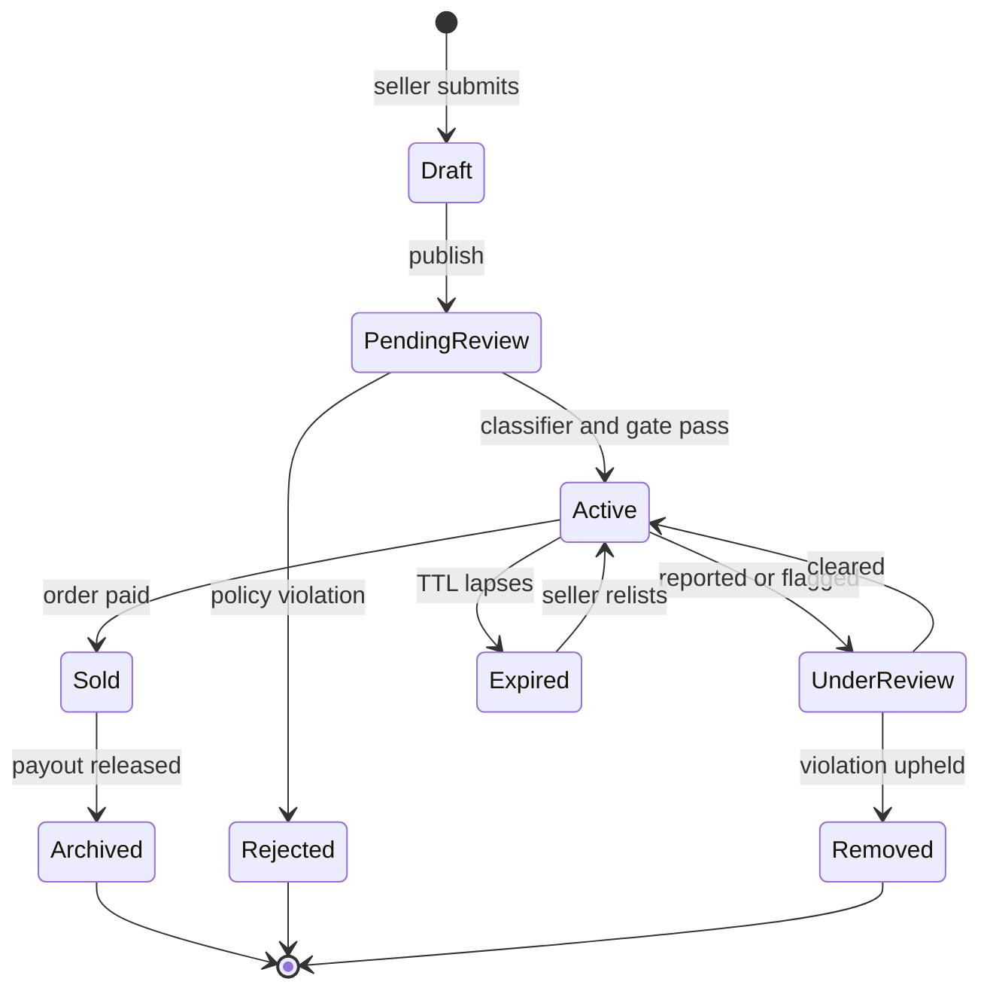
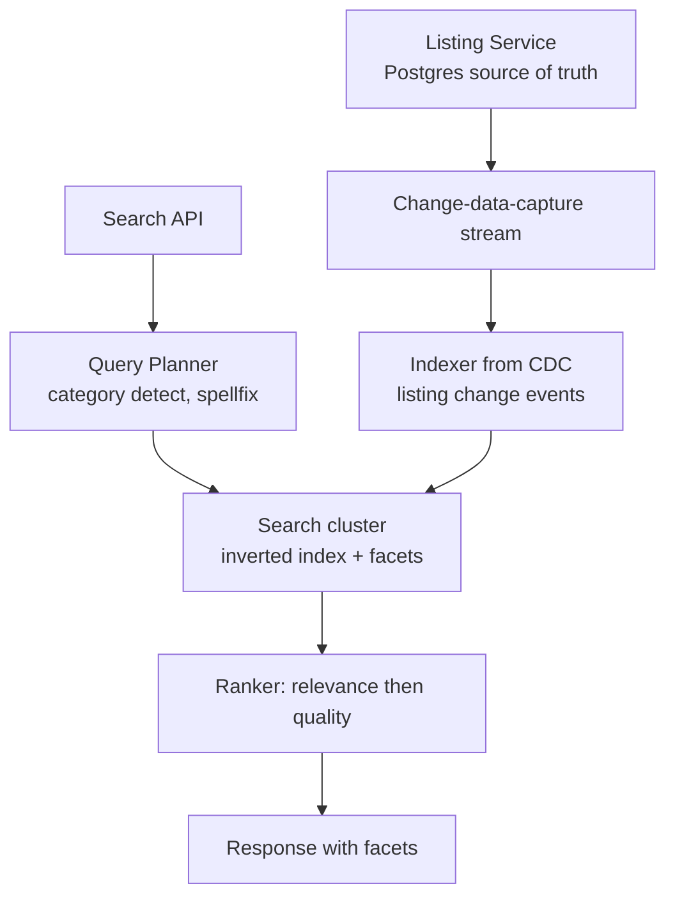
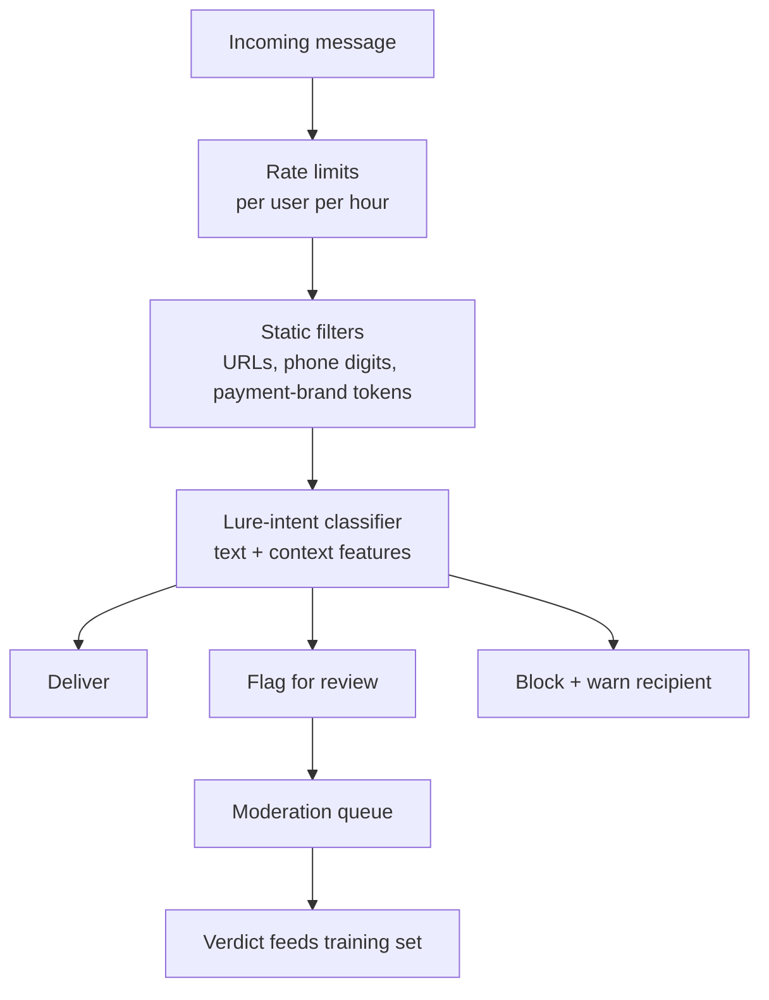
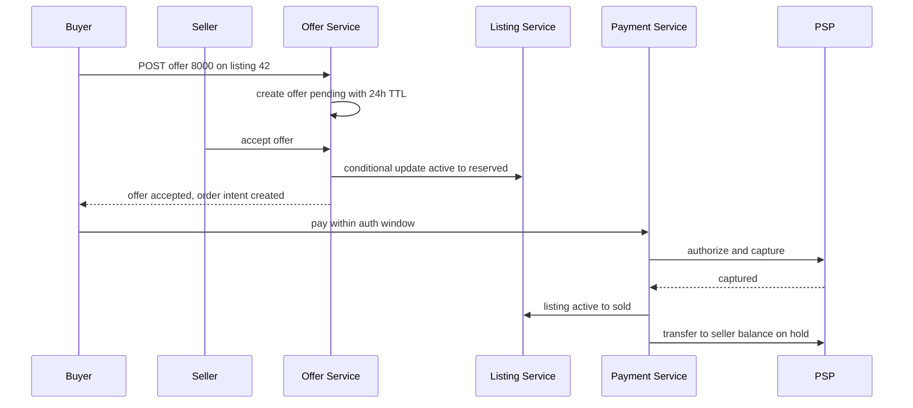

# Case Study: Design a C2C Marketplace Platform (OLX/Etsy/eBay-style)

## Overview

This is the walkthrough for designing a consumer-to-consumer marketplace: strangers transacting over *used and heterogeneous* goods, which means every unit of inventory is unique, every listing arrives untrusted, and the money flow needs escrow semantics rather than a simple charge. The design centers on a listing lifecycle with moderation gates, a faceted search engine with per-category ranking, buyer/seller messaging that survives abuse, an offer-and-negotiation flow, and payouts with holds. Interviewers pick this problem to see whether you treat the platform as three products in one — a classifieds search engine, a messaging network, and a payments/fraud system — instead of a CRUD app. It appears as a 45-minute HLD round or as a follow-up ("how would this change if we add offers and escrow?").

## Step 1 — Requirements

### Functional

- Sellers create listings (photos, title, description, price, category, location, condition); listings follow the lifecycle `draft → active → sold → archived`, with moderation gates before and after activation
- Buyers search and filter by category, price range, condition, location/distance, and category-specific attributes (e.g., "screen size" for phones, "frame size" for bicycles)
- Buyer/seller **messaging per listing**, with spam, phishing, and off-platform-payment-lure filtering
- **Offers**: buyer proposes a price, seller accepts, declines, or counters; acceptance creates a binding order intent
- **Payments**: card/wallet charge at purchase, funds held in escrow-style pending state, payout to seller after delivery confirmation or a hold window; refunds and dispute hooks
- Ratings and reviews both directions (buyer↔seller), visible trust signals on profiles
- Abuse surfaces: report listing, report user, block user; moderation actions (demote, delist, suspend)

### Non-Functional

- **Scale**: 100M MAU, 10M DAU, ~200M live listings, 2M new/edited listings per day (eBay reported >1.3B live listings and ~132M active buyers in 2023; Etsy ~10⁸-scale listings — assume 10⁸–10⁹ range and say so)
- **Search latency**: p99 < 200 ms for faceted queries; listing page loads < 300 ms p99 served mostly from cache/CDN
- **Freshness**: a new listing is searchable within seconds (near-real-time indexing), because "posted 2 min ago" is a competitive feature in C2C
- **Money correctness**: no double payouts, no payout before hold expiry, idempotent charge retries — same rigor as [Ticketmaster](./ticketmaster.md)
- **Abuse resistance**: assume a nonzero fraction of sellers are scammers; the system must degrade gracefully under organized fraud rather than trusting its own users

## Step 2 — Back-of-Envelope Estimation

| Quantity | Assumption | Result |
|---|---|---|
| Search traffic | 20M searches/day, diurnal ×3 peak | ~230 QPS avg, ~800 QPS peak — tiny for a search cluster |
| Listing writes | 2M creates/edits/day | ~23/s index updates; batch easily |
| Listing page views | 100M views/day, 90% cache hits | ~115 RPS to origin, ~1.2K RPS at edge |
| Messages | 5M/day, avg 4 messages per conversation | ~230 msg/s avg; store-and-write, no fanout storm |
| Offers | 500K/day → ~6/s | bursty evenings; state transitions per offer |
| Orders | 200K/day | ~2.3/s avg; payment PSP calls dominate latency |
| Reports/moderation flags | 1–2% of new listings auto-flagged | 20–40K items/day to review systems |
| Storage | 200M listings × 50 KB text + 8 photos × 300 KB | ~500 GB text + ~480 TB images (CDN/object storage) |

The pattern to verbalize: **search is the product, but it is not the hard part** — 800 QPS is two Elasticsearch nodes' worth of load. The hard parts are (a) correctness of the money path across offers, escrow, and payouts, and (b) adversarial user behavior, which no amount of caching fixes. Spend your interview time on lifecycle, payments, and fraud, not on search-cluster sizing.

## Step 3 — Listing Lifecycle and Data Model

### State Machine with Moderation Gates



Decisions this machine encodes, each worth stating out loud:

- **Moderation is a state, not a side effect.** `PendingReview` and `UnderReview` are first-class states so the listing is invisible or demoted while disputed, and the moderation verdict is an auditable transition with an actor (classifier version or human reviewer ID)
- **`Sold` is entered only on payment capture**, never on offer acceptance — an accepted offer creates an order intent with its own timeout; the listing stays `Active` (reserved) until money lands
- **TTL/expiry is a scheduled transition** handled by a sweeper (or per-listing timer), because C2C inventory rots: a 30–90 day default keeps the corpus searchable and relevant

### EAV vs Document: Category-Specific Attributes

A bicycle has a frame size; a phone has storage and screen size; furniture has dimensions. You cannot have 5,000 categories × 30 attributes as relational columns. Three credible options:

| Approach | Stores | Query story | Pain point | Use when |
|---|---|---|---|---|
| EAV tables | `listing_attr(listing_id, attr_id, value)` rows | Join/pivot per facet — heavy at read | Faceted queries explode into joins; needs materialized views | Thousands of sparse attributes, read volume low |
| JSONB column | Postgres `attributes JSONB` + GIN index | `@>` containment + expression indexes | Schema drift per category; stats weak for planner | One DB for everything, moderate facet cardinality |
| Document store | MongoDB per-category documents | Index per attribute path | Cross-entity transactions weak | Attribute-heavy categories, flexible schema |
| Denormalized into search | Flattened doc in Elasticsearch/OpenSearch | Facets/aggregations native | Duplication — this is a projection, not the source of truth | Always, as the read model |

The production answer is a hybrid: the **system of record** is Postgres with a `jsonb` attributes column plus a per-category attribute-registry table (name, type, unit, facetable flag); the **read model** is a flattened document in the search engine. Validation happens at write time against the registry, so search never sees attribute soup. This split — normalized-ish truth, denormalized search projection — is the single most reused idea in marketplace design.

```text
listings        (id, seller_id, category_id, title, price_cents, status,
                 location_geohash, created_at, expires_at, attributes JSONB)
categories      (id, parent_id, name, attribute_registry JSONB)
listing_events  (id, listing_id, event, actor, classifier_version, at)  -- audit trail
images          (id, listing_id, cdn_key, hash, moderation_verdict)
```

## Step 4 — Search and Faceted Filtering

### Inverted Index and Facets

Search over listings is a classic inverted-index problem: tokenize title/description, index attribute values as keyword fields, and answer filters as set intersections. Faceted counts ("Under ₹10,000: 1,204 · ₹10–20K: 870") are computed as aggregations over the matched set, which is why the search engine — not the OLTP database — owns this workload. Elasticsearch/OpenSearch exist for exactly this shape: NRT indexing (fresh listings visible in ~1 s), filter caches, and per-shard aggregation.



The flattened search document is the contract between the two stores; keeping it explicit makes the projection property auditable:

```text
{ "id": "42", "category": "phones", "title_tokens": [...],
  "price_cents": 8500, "condition": "good",
  "attrs_screen_in": 6.1, "attrs_storage_gb": 128,       "registered facets only",
  "geohash9": "u4pruydq", "city_ids": ["berlin"],
  "seller_score": 0.94, "photo_count": 6, "age_hours": 3,
  "status": "active", "demoted": false }
```

Fields not in the registry never reach the index; `status` and `demoted` are updated by the same CDC stream that serves search, so moderation actions and sold transitions take effect in the index within seconds. Reindexing from scratch (schema change, mapping migration) is a routine operation precisely because the index holds nothing unique — you can drop it and replay the CDC log.

- **Per-category attribute indexes**: a shared index with dynamic per-category fields, or an index per top-level category. The trade: one giant index keeps cross-category search simple but dilutes term statistics; per-category indexes give clean relevance but need a federated "all categories" tier
- **Location**: listings are geo-partitioned into geohash/H3 cells stored as a keyword field, so "within 10 km" is one more filter term rather than a runtime distance sort (see [Social Graph](../social-graph.md) for the geo-index mechanics in the matching context)
- **Freshness vs consistency**: a search hit can be stale (seller just sold it). The listing page and the "buy/offer" API re-check the authoritative status; UX covers staleness with a graceful "already sold" recovery. Never try to make the index transactionally consistent with Postgres — you will lose

### Per-Category Ranking

Ranking blends textual relevance with marketplace-specific quality: recency, seller score, photo count/completeness, listing velocity in that category, and a demotion multiplier for items under review. Two stages keep it tractable: retrieval (BM25 + filters, top ~400 candidates) then a lightweight score-fusion pass (recency decay × seller trust × engagement priors). Category priors matter — "recently posted" dominates electronics (fast churn) but not furniture. If the interviewer pushes toward ML ranking, name the features and the training signal (clicks, contact rate, sold rate) and point at [Search Ranking System Design](../../../ml/system-design/search-ranking.md) — do not try to design the learning-to-rank stack live.

## Step 5 — Messaging and Anti-Abuse

Messaging is the scam vector: most marketplace fraud starts in chat ("pay me by bank transfer, skip the fees"). The messaging service is boring — conversation store keyed by `(listing_id, buyer_id, sender)`, delivered via WebSocket or push, with the interesting part in the filter pipeline.



Filters, in escalating cost order:

- **Deterministic**: link whitelists (only platform payment links allowed), phone-number/IBAN regex stripping, known-bad URL and account hash sets in Bloom filters for O(1) rejection (see [Probabilistic Data Structures](../probabilistic-data-structures.md))
- **Velocity/behavior**: first-contact rate limits for new accounts, conversation-spam scores, account-age × message-volume guards — the same admission-control philosophy as a [Rate Limiter](../rate-limiter.md)
- **ML lure detection**: classifier over text + sender features (account age, prior verdicts, device graph) predicting "off-platform payment lure" with thresholded routing — high confidence blocks and warns the recipient, mid confidence silently flags for review, low confidence passes. Silent flagging is deliberate: tipping off scammers lets them probe the boundary
- **Reporting loop**: every conversation has report/block; verdicts feed back into training data. The filter pipeline is a product with its own metrics (lure-report rate per 10K conversations), not a utility

## Step 6 — Offers, Escrow Payments, and Payout Holds

### Offer and Negotiation Flow

An offer is a small state machine per listing-buyer pair: `pending → accepted | declined | countered | expired | withdrawn`. Acceptance must be atomic with respect to the listing status: exactly one buyer's offer can convert to a reserved order. The clean implementation is the same conditional-update pattern Ticketmaster uses for seats — accept is `UPDATE listings SET status='reserved', reserved_for=? WHERE id=? AND status='active'`; zero rows updated means someone else won the item and the offer answer is "sold out."



### Escrow-Style Payments and Payout Holds

C2C escrow is rarely a literal trust account per order; platforms implement **authorization at purchase + delayed transfer to seller**. The money path:

1. **Authorize** the buyer's card at order creation, capture on shipment/delivery confirmation (or automatically after N days with no dispute)
2. **Hold** the captured funds as a platform balance; a per-seller reserve or fixed hold window (e.g., payout after delivery + 3–14 days) absorbs chargebacks, "item not as described" claims, and stolen-goods clawbacks
3. **Payout** via PSP transfers (Stripe Connect's "separate charges and transfers" is the canonical building block) with idempotency keys end to end — same discipline as [API Idempotency](../../../backend/api/api-idempotency.md)
4. **Dispute** reverses the flow: a claim freezes the pending payout before release, which is *why holds exist* — after the money leaves, recovery is a collections problem, not a systems problem

New sellers get longer holds and lower instant-payout eligibility; the ramp is a fraud-control knob you tune like a rate limit, trading seller liquidity against loss rate.

## Step 7 — Trust, Ratings, and Fraud Detection

### Sybil-Resistant Reputation

Ratings are only useful if creating a 4.9-star identity costs more than a throwaway email. Defenses stack:

- **Identity cost**: phone/device verification at listing time (not just signup), payment-method verification for sellers, progressive KYC for payout
- **Velocity and graph signals**: review rings show up as dense subgraphs in the user-interaction graph; seller-buyer rating mutuality and short-lifetime account clusters are cheap sybil features (see [Social Graph Service](./social-graph-service.md) for the graph store that makes this queryable)
- **Weighted trust**: rating aggregates decayed by time and volume, with low-information ratings (first review from a brand-new buyer account) weighted down; review text can be filtered by the same lure classifier as messages

### Fraud Detection Surfaces

| Fraud pattern | Detecting signals | Mitigation |
|---|---|---|
| Off-platform payment lure | Message classifiers, link/IBAN detection | Block + education interstitial; platform loses escrow protection warning |
| Stolen goods / serial fraud | Duplicate photo hashes across accounts, serial-number lists, sudden category switch | Delist pending review, seller hold, law-enforcement workflow |
| Fake engagement / rating rings | Graph density, device/IP clusters, review velocity | Graph detection jobs, rating weighting, account bans by cluster |
| Account takeover | Login velocity, geo impossibility, device change + payout change | Step-up auth, freeze payouts on sensitive changes |
| Refund/chargeback abuse | Claim rate per seller/buyer, shipping anomalies | Holds, reserves, eventual suspension |

The ML angle (feature stores, online/offline consistency, model serving) is a whole page of its own — see [Fraud Detection System Design](../../../ml/system-design/fraud-detection.md). In the interview, the point is placement: fraud features ride the same event bus as search indexing (listing events, message events, order events), and every mitigation must degrade gracefully — blocking 1% of legitimate payouts is a better failure than releasing 1% of stolen funds.

## Bottlenecks & Follow-Up Questions

- **Hot categories**: phone listings get 100× the views of pottery; follow-up: "does search skew melt the cluster?" → replica groups per hot category, cache top-N query pages per city/category pair, and let facets be approximate (sampled counts) under load
- **Index lag on sold items**: buyer pays for a listing sold 5 s ago; follow-up: "can we prevent that?" → only by making the order path authoritative (it is); UX recovery beats a transactionally consistent index
- **Payout runaways**: a bug double-pays 1K sellers; follow-up: "what contains it?" → idempotency keys + per-seller payout ledger with daily reconciliation against PSP statements; detection within hours, not months
- **Moderation capacity**: 40K flagged listings/day with human review at ~60 items/hour needs ~110 reviewer-hours/day just for listings — automation must absorb 95%+ of volume or the economics collapse
- **Cross-border**: currency, VAT, and shipping make escrow per-market; follow-up: "one payments service or many?" → one domain model, per-market PSP adapters, feature-flagged rollout

## Interview Questions

1. **Why is EAV a trap for marketplace listings, and what do you use instead?** EAV turns every faceted query into multi-join pivots and every new attribute into schema-on-write ceremony; at read scale it forces materialized views that drift from the source. A `jsonb`/document column with a per-category attribute registry gives schema flexibility with write-time validation, and the search engine becomes the flat read model with native facets. The registry — not the storage format — is what keeps attribute chaos bounded, because it defines which attributes are typed, required, and facetable per category.
2. **Walk through what happens when two buyers' offers on one listing are accepted simultaneously.** Acceptance is a conditional update on the listing row (`status='active'` guard); the database serializes at the row and exactly one wins, the other gets zero rows updated and surfaces "already sold." No distributed lock is needed — this is a single-key conflict, so an atomic conditional write or per-listing actor is both safer and simpler. The losing offer transitions to `lost` (not `declined`) and the buyer gets a re-offer flow on similar listings.
3. **Why do payout holds exist, and how would you set their length?** The hold window exists because captured funds must stay reversible until dispute risk decays: chargeback windows, "not as described" claims, and stolen-goods reports all arrive days after delivery. The length is set from observed dispute-rate curves — e.g., 80% of claims arrive within 5 days, so a 7–14 day hold (longer for new sellers) buys most of the protection for bounded liquidity cost. Tuning it is a fraud-economics problem: expected loss rate × GMV vs conversion drop from impatient sellers.
4. **How do you keep the search index from becoming a consistency liability?** Treat it as a disposable projection: change-data-capture from the listing database rebuilds and updates it, the order/offer path always re-validates against the source of truth, and UX handles stale hits ("this item was just sold — here are 10 similar") instead of pretending freshness. Attempting transactional index consistency couples two systems with opposite availability needs and buys a failure mode where listing writes block on search. Eventual consistency with authoritative re-checks is the correct trade at marketplace scale.
5. **Where does messaging anti-abuse sit architecturally — synchronous or asynchronous?** Deterministic filters (rate limits, URL/phone/hash lists) run synchronously in the send path because they are microseconds and blocking scammers pre-delivery is the point. The ML lure classifier runs asynchronously for the borderline band: deliver silently, classify in parallel, and retract/flag within seconds if it fires — synchronous ML at p99 < 50 ms is achievable but couples message availability to model availability for marginal gain. The retraction path and the "silent flag" semantics are what interviewers want articulated.
6. **What makes marketplace reputation different from social "likes"?** Adversarial value: a like is worth entertainment, a rating is worth money, so it attracts industrial-scale forgery (sybils). Defenses are economic (identity cost at payout time), structural (graph-based ring detection, mutual-rating analysis), and statistical (time/volume-decayed, information-weighted aggregates). You also need asymmetry awareness — seller ratings affect income, buyer ratings mostly detect fraud — so the two sides need different weighting and different abuse models.

## Key Takeaways

- A C2C marketplace is three systems wearing one domain: a search engine (inverted index + facets over a denormalized read model), a messaging network (with a spam/lure filter pipeline as a first-class product), and a payments/fraud machine (auth → capture → hold → payout, all idempotent)
- The listing lifecycle encodes moderation as states (`PendingReview`, `UnderReview`) with auditable transitions — never as a side-effect flag
- Category-specific attributes: registry-validated `jsonb`/document as source of truth, flattened document in Elasticsearch/OpenSearch as read model; EAV only when attributes are both sparse and read-light
- Faceted search is eventually consistent by design; the offer/accept conditional update on the listing row is the only serialization point, and it needs no distributed lock
- Payout holds and per-seller reserves convert irreversible money movement into reversible platform balances; hold length is tuned from dispute-arrival curves, and new-seller ramps are a fraud knob
- Reputation must be sybil-resistant: identity cost, graph-based ring detection, and decayed/information-weighted aggregates — naive star averages get farmed within weeks
- Assume a hostile fraction of users in every estimate; the platform's job is to make fraud expensive and legible, not to make it impossible

## References

- Apache Kafka documentation — the listing/message/order event backbone and CDC transport: https://kafka.apache.org/documentation/
- Elasticsearch documentation — inverted index, facets/aggregations, NRT indexing: https://www.elastic.co/docs
- OpenSearch documentation — open-source alternative for faceted search clusters: https://docs.opensearch.org/latest/
- PostgreSQL documentation — `jsonb` type and GIN indexing for attribute columns: https://www.postgresql.org/docs/current/datatype-json.html
- RFC 9110 (HTTP Semantics) — idempotent methods and safe retries on the payment path: https://datatracker.ietf.org/doc/rfc9110/
- DeCandia et al., "Dynamo: Amazon's Highly Available Key-value Store," SOSP 2007 — eventually consistent read models with authoritative writes: https://www.allthingsdistributed.com/2007/10/amazons_dynamo.html
- Stripe Connect documentation — charges, transfers, and payout holds for marketplaces: https://docs.stripe.com/connect
- Google SRE books — error budgets and graceful degradation under adversarial load: https://sre.google/books/
- Jepsen analyses — what "we use a strong database" actually guarantees under partitions: https://jepsen.io/analyses

## Cross-References

- [Case Study: Ticketmaster](./ticketmaster.md) — the same no-double-sell conditional-update pattern applied to seat inventory
- [Case Study: Live Auction Platform](./live-auction.md) — the price-discovery sibling: competitive bidding instead of take-it-or-leave-it offers
- [Real-World: Job Portal](../real-world/job-portal.md) — listings + search + applied-funnel shape in a hiring domain
- [Design: Payment System](../payment.md) — idempotent charge/refund flows the escrow path builds on
- [Design: Chat](../chat.md) — the messaging infrastructure the anti-abuse pipeline sits in front of
- [Case Study: Social Graph Service](./social-graph-service.md) — the graph store behind sybil-ring detection and friend-graph features
- [ML: Fraud Detection System Design](../../../ml/system-design/fraud-detection.md) — feature pipelines, model choice, and serving for the fraud surfaces listed here
- [Design: Probabilistic Data Structures](../probabilistic-data-structures.md) — Bloom-filter mechanics behind cheap bad-hash rejection
- [References: Distributed Systems Library](../../../references/distributed-systems.md) — verified primary sources for Kafka, search engines, and the stores used here
