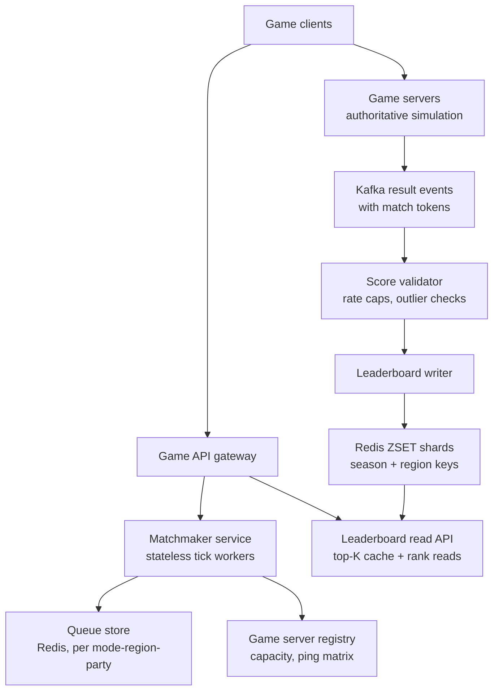
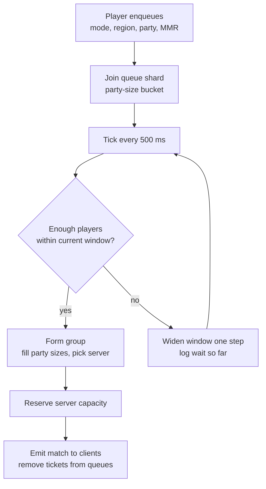

# Case Study: Real-Time Matchmaking & Leaderboard Service for Games

## Overview

Online games run two always-on services that look simple and are brutal at scale: a **matchmaker** that turns a stream of "find me a game" requests into fair, fast matches across skill and party-size dimensions, and a **leaderboard** that ingests validated score events and answers top-K and rank-of-player reads for 100M players within a season. This page designs both as one distributed system — skill ratings (Elo/Glicko-2/TrueSkill), queue design with a widening MMR window and party buckets, regional game-server selection, a Redis-ZSET write path partitioned by season and region, approximate ranks for the long tail, anti-cheat score validation, and hot-season resets. It is the HLD complement to the single-node implementation in [Machine Coding: Real-Time Leaderboard](../../../machine-coding/leaderboard.md): there you write the sorted structure and its concurrency; here you decide how it survives millions of concurrent players, writes from thousands of game servers, and a reset that touches every user at once. The single-writer ordering discipline echoes [Case Study: Live Auction](./live-auction.md), with contention replaced by fairness-vs-wait-time pressure.

## Step 1 — Requirements

### Functional

- **Matchmaking**: queue players (solo/duo/squad) by game mode and region; produce a match group of the right size (e.g., 100 players for battle royale, 10 for MOBA, 2 for duels) with a game server assigned
- **Skill fairness**: matches pair players of similar skill, using a rating system with uncertainty (new players resolve quickly, veterans converge)
- **Wait-time contract**: typical queue < 30 s; the system trades fairness for wait time explicitly and observably
- **Leaderboard**: record match results/scores; answer top-K (K ≈ 100), player rank, players-around-player, and paginated views; partitioned by season and region
- **Score integrity**: only server-authoritative, validated scores enter the ladder; anomalies are quarantined, not silently ranked
- **Season lifecycle**: ladder resets on a schedule; historical boards remain readable; rank decay/soft resets are product-tunable

### Non-Functional

- **Scale**: 50M DAU, ~2M concurrent at peak, ~50K match requests/s peak, ~20K score events/s peak
- **Latency**: matchmaker tick decisions in < 100 ms; leaderboard reads p99 < 50 ms; score ingest p99 < 200 ms async
- **Consistency**: score events are at-least-once with idempotent application; leaderboard is eventually consistent (seconds) — a rank shown 5 s late is fine, a lost season win is not
- **Availability**: matchmaking is the front door of the game — degraded (wider windows, fewer regions) beats down; leaderboards can serve read-only replicas if the write path degrades
- **Fairness/auditability**: every match and score decision must be explainable post-hoc (appeals, ban reviews)

## Step 2 — Back-of-Envelope Estimation

Use Little's law to size the matchmaking pool, and entry-count math to size the leaderboard.

| Quantity | Assumption | Result |
|---|---|---|
| Match requests | 50M DAU × ~3 sessions × ~10 searches = 1.5B/day | ~17K/s avg, ~50K/s peak |
| Avg search duration | ~20 s across all modes | pool ≈ 50K/s × 20 s ≈ 1M players waiting at peak (Little's law) |
| Matches produced | pool churn | ~15–20K matches/s at peak |
| Score events | ~1 per match end, batched per match | ~20K/s peak, ~2K/s off-peak |
| Ladder population | 100M players with ≥1 score per season-region board | see below |
| ZSET memory | 100M entries × ~90 B (member + score + overhead) | ~9 GB per global board → ~150 MB per shard across 64 |
| Write load per shard | 20K/s ÷ 64 shards | ~300 writes/s/shard — trivial for Redis |
| Top-K reads | lobby UIs, viewers, streamers | 100K+/s, dominated by top-100 — cache it |
| Rank-of-player reads | profile pages, post-match screens | 500K+/s, long-tail heavy |

The sentences to say aloud: the matchmaker's working set is **1M concurrent queue entries** with a 500 ms decision cadence — a memory-resident problem, not a database problem; the leaderboard's hard part is not writes (300/s per shard is nothing) but **exact rank for the long tail** at 500K reads/s, which is why approximate ranks exist.

## Step 3 — API Sketch

```text
POST /v1/matchmaking/queue     body: { mode, region, party_id, members[] }
                               → { ticket_id, state: searching }
GET  /v1/matchmaking/tickets/{ticket_id} → { state: searching|matched, match_id, server, players[] }
POST /v1/matchmaking/cancel    body: { ticket_id }
POST /v1/matches/{match_id}/result   (game server → trusted internal)
                               body: { results: [{player_id, score, outcome}], match_token }
GET  /v1/leaderboards/{board}/top?k=100&cursor=
GET  /v1/leaderboards/{board}/rank?player_id=  → { rank, score, exact|approx }
GET  /v1/leaderboards/{board}/neighbors?player_id=&n=10
```

Contracts worth stating out loud:

- The game server's result submission carries a **`match_token`** minted by the matchmaker at assignment time — uninvited servers cannot inject scores; this is the first anti-cheat gate
- `rank` responses declare `exact|approx` — clients render percentile bands ("Top 3%") for approximate answers, so the UI never lies about precision
- Leaderboard reads are keyed `board = {game}:{season}:{region}` — season and region are in the key, not in a filter, so every read is a single ordered structure

## Step 4 — High-Level Architecture



- **Matchmaker**: stateless tick workers over a Redis-backed queue store; each tick pulls candidate groups, applies the window and party rules, reserves a server, and writes the match — the assignment decision lives in one worker at a time per queue shard, which is what keeps it race-free without distributed locks
- **Game servers** are the source of truth for what happened in a match; the matchmaker only knows "these 100 players on server X," and the result path trusts servers, never clients
- **Score validator + leaderboard writer** are the only writers of ladder state; Kafka gives at-least-once delivery and replayability (rebuild a board from the log after a bad deploy — same log-as-truth pattern as the auction room)
- **Read API** caches top-100 (the only truly hot range) and serves everything else from ZSET reads or the approximate-rank path

## Deep Dive 1 — Skill Ratings: Elo, Glicko-2, TrueSkill

The rating system defines what "fair" means; pick it deliberately, because it changes the matchmaker's inputs and the leaderboard's semantics.

| System | Model | Teams | Uncertainty | Update cost | Notes |
|---|---|---|---|---|---|
| Elo (1978) | single number, logistic expected score | no | none | O(1) closed form | simple, transparent, slow to resolve new players; K-factor tuning is the whole game |
| Glicko-2 (Glickman) | rating + deviation (RD) + volatility | no (multiplayer variants exist) | yes (RD shrinks with play) | O(1) closed form | resolves new players fast; the default for serious 1v1 ladders |
| TrueSkill (Herbrich, Minka, Graepel — NIPS 2006) | Bayesian factor graph over Gaussian skills | yes, any team size, draws | yes (σ per player) | iterative message passing | native team/draw support; used by Xbox Live; heavier compute, needs service |

The Elo update rule, which is worth writing on the board because it anchors the whole discussion:

\\[ E_A = \\frac{1}{1 + 10^{(R_B - R_A)/400}} \\qquad R_A' = R_A + K \\, (S_A - E_A) \\]

- Elo's expected-score curve means a 400-point gap predicts a ~91% win probability — the number the matchmaker's window is *protecting*: keep `|R_A − R_B|` small and matches stay near coin-flips
- **Uncertainty is the feature that matters**: a new player at rating 1500 ± 350 is a different matchmaking problem than a veteran at 1500 ± 40. Glicko-2/TrueSkill let the matchmaker match on `μ ± kσ` bands (wide for new accounts, tight for established), which is how modern ladders avoid veteran-stomps-newbie matches during placement
- TrueSkill's conservative ranking `μ − 3σ` is what ladders *display* — it is the same rating, re-rendered to punish inactivity and smurfing; mention this and the interviewer knows you have read the paper
- Team games are where TrueSkill earns its compute: summing individual Elo over a 5-stack mis-attributes team synergy; the factor graph updates every player's skill from the joint outcome. If the product is 1v1-only, Glicko-2 is the better cost/benefit point
- Storage: ratings are a per-player row (μ, σ, RD, volatility, games_played, last_played) in a KV store — low write volume (one update per match), no ordering requirements until the ladder displays them, which is the leaderboard's job, not the rating system's

## Deep Dive 2 — Matchmaker Queue Design: Widening Windows and Party Buckets

The queue is a set of in-memory sorted structures per `(mode, region, party_size)`, scanned on a 500 ms tick. The core loop trades fairness for wait time with an explicit, logged window:



```text
window_start = 50    # MMR half-width
window_step  = 25 every 10 s of waiting
window_cap   = 300
match rule: group players whose skill bands overlap at the CURRENT window;
            prefer tighter bands; never exceed cap (fairness floor)
```

- **The widening window is the fairness knob in product terms**: fresh lobbies for the top and bottom of the distribution (dense populations), wider bands for rare edge cases (a 99.9th-percentile player at 3 a.m. waits longer, then plays someone 200 points off). Log `wait_time` per window step — this data is what product uses to tune `window_cap`
- **Party-size buckets** prevent structural unfairness: solos match with solos (or fill into squads by explicit consent), duos with duos, squads with squads. Buckets are separate queue shards; a squad-filling matchmaker may borrow solos only into a "fill" sub-pool where those solos opted in
- **Party MMR** for a duo/squad is itself a policy: max-of-party (strict), mean (loose), or TrueSkill joint-skill (principled) — name the choice and its abuse vector (a strong player carrying a weak friend under mean-merge)
- **Queue memory shape**: per shard, a sorted list by MMR makes "take a contiguous band" a range scan; 1M concurrent entries across shards is a few GB of RAM — this is why matchmaking is an in-memory service with Redis as durable standby, not a database query loop
- **Abandonment and cancel**: tickets TTL out (e.g., 5 min); a player who quit the client must not be matched — the matchmaker re-validates liveness (gateway presence) at group-form time, the same last-millisecond validation discipline as bid validation in the auction case

A worked example makes the window concrete. A 2400-MMR solo player queues in a 10M-DAU region:

```text
t=0s    joins solo bucket, window 50    -> pool band [2350, 2450] has 900 players
        -> but all are mid-match; no group formable this tick
t=10s   window 75  -> still no 9 companions overlapping simultaneously
t=20s   window 100 -> group forms: 2400 ± 100 band, 10 players,
        server eu-west-2 (client pings 18-45 ms), ticket -> matched in 22 s
logged: {player, mode, waits: [0,10,20], final_window: 100, band_width: 200}
```

The log line is the deliverable: product tunes `window_cap` and step timing from the distribution of `final_window`, and support can answer any "unfair match" appeal by replaying the band the group formed in. Off-peak, the same player's band widens to the 300 cap before forming — visible, explainable, and bounded.

## Deep Dive 3 — Regional Game-Server Selection

The match is not done until it has a server, and server choice is a latency problem layered on the matchmaker's fairness problem.

- **Registry**: game servers publish `(region, mode, current_ccu, capacity, health)` to a registry (lease-based, so dead servers expire); the matchmaker reserves slots atomically at assignment — overbooking a full server mid-match is the failure this prevents
- **Ping matrix**: clients measure RTT to each region's probe endpoints at session start; the matchmaking request carries the client's region-latency vector. Selection rule: prefer the lowest-ping region with capacity that *all* party members tolerate (< 80 ms p50), else widen region set with a fairness note in the match record
- **Cross-region matches** are a last resort with a product decision attached (ranked never, casual sometimes). Say the constraint as a number: 100 ms added RTT changes the game feel more than a 100-point MMR gap does
- **Routing layer**: region selection rides on GeoDNS/anycast mechanics for the connection itself — the same machinery as [Anycast and Geo-Aware Routing](../../../networks/cdn/anycast-and-geo-routing.md), minus the caching
- **Ping probes are cheap and scheduled**: one UDP probe per region per session start (~10 regions × 3 packets) costs microseconds and buys the whole selection input; probes refresh on session resume and after network-change events (wifi → cellular), because a stale ping matrix matches players to now-distant servers
- **Capacity smoothing**: the scheduler pre-warms servers ahead of peak (evenings, patch launches) using the same demand forecast the matchmaker's wait-time logs produce; otherwise every patch day begins with a 60-second queue spike — a real, recurring production incident pattern

## Deep Dive 4 — Leaderboard Write Path and Rank Reads

The ladder is an ordered-set problem at 100M entries, and Redis ZSETs are the industry answer because rank queries are O(log N) server-side — exactly the structure the LLD page implements by hand, minus the single-machine ceiling.

| Operation | Redis command | Complexity | Where used |
|---|---|---|---|
| Add/increment score | `ZINCRBY` | O(log N) | write path (idempotent by match token) |
| Top-K | `ZREVRANGE 0 K-1 WITHSCORES` | O(log N + K) | top-100, cached |
| Exact rank of player | `ZREVRANK` | O(log N) | profile pages |
| Neighbors around player | `ZREVRANGE rank-50 rank+50` | O(log N + K) | "players around you" |
| Count above a score | `ZCOUNT (score +inf` | O(log N) | percentile bands |

- **Partitioning by season and region** is the scale decision that makes everything else easy: keys `lb:{game}:s{season}:{region}` keep boards at 1–10M entries (~100–900 MB), bound write hotspots to regional load, and align with how players actually read ladders. Global boards are async materializations (merge of regional snapshots), never the online path
- **Sharding within a board**: 64 shards by `hash(player_id)`, each ~150 MB and ~300 writes/s. The *only* cross-shard operations are top-K (merge per-shard top-Ks in the read layer — 64 × 100-row merges, cached) and global rank (see approximate ranks below). Never route a single write across shards
- **Idempotency and correction**: score events carry `match_token`; the writer keeps a short-TTL `applied:{token}` key so Kafka's at-least-once replays are no-ops. Score corrections (a rescinded match) are compensating negative `ZINCRBY`s, also token-keyed — this is why the log, not the ZSET, is the system of record
- **Exact rank for the head, approximate for the tail**: `ZREVRANK` is exact at O(log N) and cheap, but the *product* question differs by population. Top 1M players: exact, served from ZSET. The other 99M: approximate via sampling — draw ~4K random members from the board (or from an hourly snapshot), count how many are above, estimate rank as \\( N \\cdot \\hat{p} \\) with standard error \\( \\sqrt{p(1-p)/s} \\) ≈ 0.8% of N at 95% confidence. Render "Top 12%" with the band, save the exact machinery for where ranks are contested
- **Percentile pre-aggregation** is the alternative tail answer: hourly, bucket the board into 1,000 percentile ZSETs/bands and serve band membership by construction; combine with sampling for the exact-ish number. Either way, the long tail must never be an O(N) computation at request time

The write path end to end, with the numbers from the estimation table attached:

```text
game server -> Kafka result event {match_token, results[100]}
validator   -> plausibility check (<= 500 pts/min mode cap), 20K/s aggregate
writer      -> pipeline per batch:
               ZINCRBY lb:br:s47:eu-west {shard} {delta} {player_id}
               SET applied:{match_token} 1 EX 86400
read API    -> ZREVRANGE lb:br:s47:eu-west:top 0 99 WITHSCORES   (cached 5 s)
               ZREVRANK lb:br:s47:eu-west:{shard} {player_id}    (exact, head)
               sampled rank                                       (approx, tail)
```

One operational note that separates a real design from a tutorial: ladder keys must run with **`maxmemory-policy noeviction`** (or volatile-ttl scoped away from ladder keys). An LRU-evicting Redis silently deletes the bottom of the ladder under memory pressure — players reappear "unranked," which is a worse integrity failure than being seconds stale.

## Deep Dive 5 — Anti-Cheat Score Validation and Season Resets

The write path is untrusted by design: game servers are compromised sometimes, exploits exist, and the ladder is the public scoreboard of the economy.

- **Server authority chain**: matchmaker mints `match_token` at assignment → only that server can report that match → results are schema-validated and cross-checked (players list = assignment list; timestamps within match window). This kills most injection classes before any heuristics run
- **Plausibility caps per mode**: a mode where 500 points/min is heroic enforces `Δscore/Δt ≤ cap` at the validator; impossible deltas quarantine the event. Caps are config, tuned per mode from the historical distribution (p99.9 × margin), not hand-picked folklore
- **Statistical outlier detection**: per-player score-rate z-scores against their own history and their cohort's; high-score-rate + sudden- improvement patterns route to quarantine and manual review. Weighted-vote across signals (device fingerprint reuse, impossible win rates, collusion graphs — same players repeatedly matched to trade wins) — the collusion check is a graph problem like the fraud patterns in payments
- **Quarantine, not silent drop**: suspicious scores land in a review ZSET outside the ladder; bans apply compensating `ZINCRBY`s. Silent drops create unappealable, undiscoverable false negatives — the audit trail is a requirement, not a nicety
- **Season resets without a thundering herd**: the new season's boards are *new keys* (`s{N+1}`), created and warmed (top-K caches preloaded, first percentile snapshots built) *before* the flip; the flip is a config pointer swap per region, staggered across regions over minutes. Old boards are archived to object storage/warehouse and expire from Redis lazily — the read path serves `s{N}` for history from the archive tier
- **Sub-season boards are free under this design**: daily and weekly ladders are just more keys (`lb:{game}:s{season}:w{week}:{region}`) fed by the same validated write stream — the machinery does not change, only the key layout and the expiry. This is the payoff of key-per-board over one mutable structure
- **Soft reset for ratings** (as opposed to ladder scores): TrueSkill inflates σ (re-add uncertainty, force re-placement); Elo-family ladders commonly compress toward the mean (`R' = (R + 1500)/2` style) or use decay. State which one the product uses and why — this is a product decision with matchmaking consequences, and the matchmaker's windows absorb the post-reset σ-inflation churn

## Bottlenecks & Follow-Up Questions

- **Top-of-ladder social storms**: a streamer hits rank 1 and 500K viewers refresh the top-100; the top-K cache with short TTL and jittered expiry absorbs it — the same hot-key discipline as celebrity lists in [Case Study: Social Graph Service](./social-graph-service.md)
- **Matchmaker pool fragmentation**: too many `(mode, region, party)` shards starve each other at off-peak; follow-up: merge pools across party buckets where product allows, or cross-region casual matching with a latency bound
- **Redis failover mid-season**: ZSET shards are rebuildable from the Kafka result log; RDB/AOF plus replay gives bounded staleness — say "the log is the truth, the ZSET is a materialization" and the follow-up dissolves
- **Patch-day capacity spikes**: server fleet warm-up lags a 3× queue spike; follow-up: pre-warm on deploy schedule + shed fairness (widen windows) temporarily rather than queue-fail
- **Score-event bursts** at global event end (millions of matches end ~simultaneously): Kafka backpressure + validator autoscaling; writes are async so the ladder may lag minutes — acceptable, declare it
- **Smurfing** (skilled players on new accounts): σ-aware placement windows + device/IP graph features; the matchmaker protects fairness, the anti-abuse system protects identity integrity — different services, shared data
- **Appeals and auditability**: every quarantine and compensating write must be reconstructible from the result log with the validator's decision attached — replay the log, get the same ladder

## Interview Questions

1. **Why Redis ZSETs, and where do they stop working?** The ladder's core operations — add, increment, exact rank, top-K, neighbors — are all O(log N) on a ZSET with native atomicity, which no on-the-fly `ORDER BY` query in Cassandra/DynamoDB can match (they cannot answer "what rank is this player" without scanning). A 100M-entry board is ~9 GB, so it fits in RAM *if* you partition by season/region and shard — 64 shards at ~150 MB each is comfortable. They stop working when you need a persistent queryable history (archive to warehouse), cross-shard exact global ranks (use approximate/sampled ranks or async merges), or when writes concentrate on one hot shard (repartition by region/skill tier).
2. **Walk me through the widening-window matchmaker and its fairness cost.** Queues are per `(mode, region, party_size)` sorted by MMR; a 500 ms tick tries to form groups within `window = 50`, widening by 25 every 10 s up to a 300 cap. Expected wait time falls as the pool grows (Little's law: 50K requests/s × 20 s ≈ 1M waiting at peak), so most players match at narrow windows and only the distribution's edges ride the widening curve. The fairness cost is explicit and logged: matches formed at wide windows have wider true skill gaps, `window_cap` is the product's fairness floor, and every step is recorded for tuning and appeals.
3. **How do you compute rank-of-player for 100M players without melting the read path?** Split the population: contested ranks (top ~1M) get exact `ZREVRANK` at O(log N) from the ZSET; the long tail gets a declared-approximate answer from sampling — 4K random members, count above, rank ≈ N·p̂ with ~0.8% of N standard error — refreshed from hourly snapshots, optionally refined by percentile bands. The API's `exact|approx` field keeps the UI honest ("Top 3%"). The design sin to avoid is serving O(N) rank computations at 500K reads/s, or pretending approximate numbers are exact.
4. **Design the season reset so nothing melts.** Boards are keyed by season (`s{N+1}`), so the reset creates no new write pattern — new keys, already created and warmed (top-K caches, percentile snapshots) before the flip. The flip is a config pointer swap, staggered across regions; `s{N}` archives to object storage for history reads. Ratings soft-reset with σ-inflation (TrueSkill) or mean-compression (Elo), which the matchmaker absorbs by temporarily widening windows while the population re-converges. The thundering herd you are defusing is read-side (everyone checks their new rank) — that is the pre-warmed cache's job.
5. **Where does anti-cheat sit so it doesn't add latency, and what can it actually catch?** Structurally: the matchmaker's `match_token` and the server-authority chain gate injection *synchronously and cheaply*; plausibility caps and statistical outliers run in the async validator between Kafka and the writer, so the write path stays p99-flat. It catches injection, score-rate exploits, impossible win rates, and collusion graphs (repeated win-trading pairs); it cannot catch aimbots inside fair matches — that is telemetry/ML in the game client domain. Quarantine with an audit trail beats silent drops: appeals need replayability, and the result log provides it.
6. **Where do this design and the live-auction design converge and diverge?** Both serialize a contested decision through a single logical owner (matchmaker tick worker per queue shard; auction room per auction) with an idempotent, replayable event log as truth, and both treat client inputs as untrusted. They diverge on the objective: auctions optimize *ordering correctness* under contention (one winner, total order); matchmaking optimizes a *fairness-latency trade-off* over a pool (no total order exists, the window is a policy knob). That distinction — correctness contract vs tuned trade-off — is the sentence that shows you understand both systems rather than pattern-matching them.

## Key Takeaways

- Matchmaking is an in-memory pool problem (1M entries, 500 ms ticks), not a database problem; Redis is the durable standby, the tick worker is the single writer per shard
- The widening MMR window is a product-tunable fairness floor — log every step and treat `window_cap` as policy, not implementation detail
- Party-size buckets are structural fairness: solos/duos/squads are separate shards, and borrowing is opt-in only
- Pick the rating model for its uncertainty handling: Elo for simplicity, Glicko-2 for serious 1v1, TrueSkill when teams/draws are core — and match on `μ ± kσ`
- Leaderboard scale comes from the key design: `season:region` boards, 64-way shards, top-K merged at the read layer, the log as system of record with idempotent token application
- Exact ranks for the contested head, declared-approximate sampled ranks for the 99M-long tail — never an O(N) rank at request time
- Anti-cheat is a chain: match tokens gate injection, plausibility caps and outlier stats quarantine in the async path, quarantine is auditable and appealable
- Season resets are new-key flips with pre-warmed caches and staggered rollout; rating soft-resets (σ-inflation, mean compression) are absorbed by the matchmaker's windows

## References

- Redis documentation — sorted sets (`ZADD`, `ZINCRBY`, `ZREVRANGE`, `ZREVRANK`) and sharding patterns: https://redis.io/docs/latest/
- Apache Kafka documentation — result-event log with at-least-once delivery and replay: https://kafka.apache.org/documentation/
- Amazon DynamoDB documentation — durable per-player rating rows and season archive tier: https://docs.aws.amazon.com/dynamodb/
- Herbrich, R., Minka, T., Graepel, T., "TrueSkill: A Bayesian Skill Rating System," NIPS 2006 (no URL cited — Microsoft Research publication)
- Glickman, M. E., "Example of the Glicko-2 system," 2012 — author-hosted at glicko.net (no deep URL cited)
- Elo, A. E., "The Rating of Chessplayers, Past and Present," Arco, 1978 (no URL cited — foundational rating text)
- Open Match — Google's open-source matchmaking framework under googleforgames: https://github.com/googleforgames/open-match
- RFC 9000 — QUIC transport (the connection game servers increasingly speak to clients): https://www.rfc-editor.org/rfc/rfc9000.html

## Cross-References

- [Machine Coding: Real-Time Leaderboard](../../../machine-coding/leaderboard.md) — the single-node LLD this HLD scales: sorted structures, concurrency, tie-breaking
- [Case Study: Live Auction](./live-auction.md) — sibling case: single-owner ordering, event log as truth, client inputs as untrusted
- [Case Study: Social Graph Service](./social-graph-service.md) — hot-key and celebrity-list handling, mirrored by top-of-ladder read storms
- [Anycast and Geo-Aware Routing](../../../networks/cdn/anycast-and-geo-routing.md) — the regional routing layer behind game-server selection
- [Rate Limiter](../rate-limiter.md) — token-bucket mechanics reused in plausibility caps and queue-flood defense
- [Consistency Patterns](../consistency-patterns.md) — the eventual-consistency contract for ladders and at-least-once ingestion vocabulary
- [Redis Caching](../../../dbms/caching/redis.md) — ZSET internals and operational characteristics in depth
- [References: Distributed Systems Library](../../../references/distributed-systems.md) — verified primary sources for Redis, Kafka, and DynamoDB
