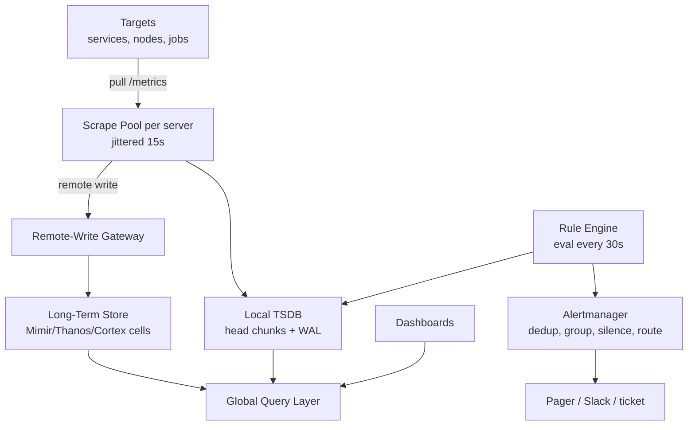
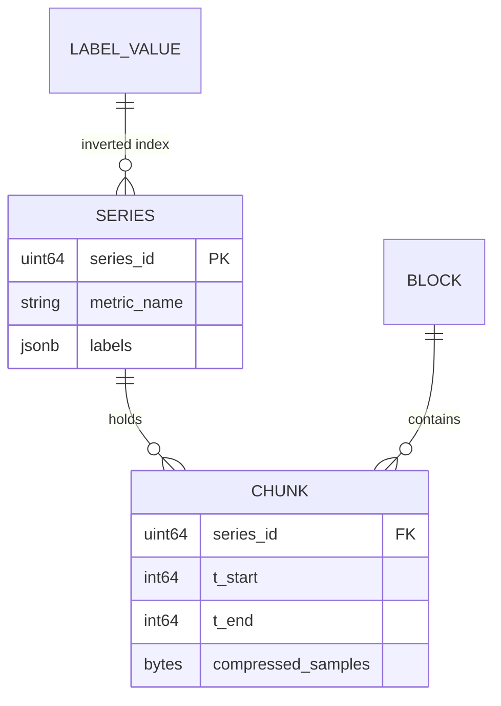
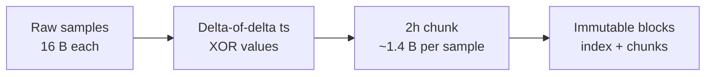
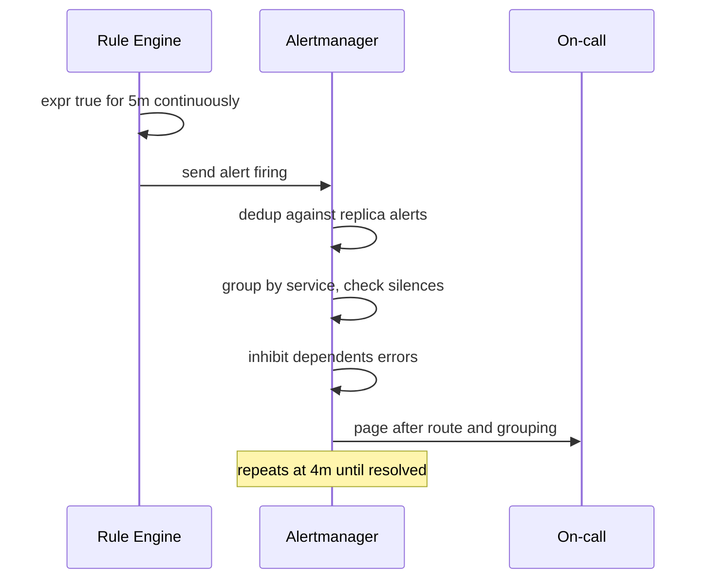

# Case Study: Design a Metrics Monitoring System (Prometheus-Style TSDB)

## Overview

Designing metrics monitoring is the interview where storage engineering meets operations: you must choose push or pull, invent or borrow a time-series database, make the cardinality math work, and then put alerting on top without paging the on-call for every blip. This walkthrough designs a Prometheus-style system — scrape-based collection, a chunked TSDB with delta-of-delta/XOR compression, downsampling and retention tiers, a rule engine plus Alertmanager, and federation for global views. It complements the concept coverage in [Monitoring & Observability](../hld/monitoring-observability.md) and the storage internals in [Time-Series Database Internals](../../../dbms/advanced/tsdb-internals.md); here the emphasis is designing it live, with capacity math you must get right out loud.

## Step 1 — Requirements

### Functional

- Collect numeric time series with labels (metric name + key/value pairs) from services, nodes, and jobs
- Query: selectors by label, range functions (`rate`, `avg_over_time`), aggregations (`sum by`), for dashboards and ad-hoc exploration
- Evaluate alerting and recording rules continuously; route firing alerts (dedup, group, silence, escalate)
- Long-term storage with downsampling (raw → 5 m → 1 h rollups) and retention per tier
- Multi-cluster federation/global views without a single mega-scraper

### Non-Functional

- **Scale**: 10M active series, 1M samples/s ingest sustained, 3× burst
- **Freshness**: data queryable ≤ 15–30 s after it exists (scrape interval × 2)
- **Query latency**: dashboard panel p95 < 1 s over hours of data; ad-hoc ≤ 5 s over days
- **Retention**: raw 15 days, 5 m rollups 90 days, 1 h rollups 2 years
- **Availability**: monitoring stays up *while production burns* — scrape path must be independent of query path
- **Correctness of alerting**: at-least-once delivery of notifications, dedup windows, no flapping

## Step 2 — Back-of-Envelope: The Capacity Math You Must Do Out Loud

| Quantity | Assumption | Result |
|---|---|---|
| Active series | 10M (the number that kills naive designs) | Cardinality budget, not traffic, is the constraint |
| Sample rate | One sample per series per 15 s | 10M / 15 ≈ **667K samples/s** |
| Raw sample size | 16 B (8 B timestamp + 8 B float) | 10.7 MB/s uncompressed |
| Compressed (Gorilla) | ~1.4 B/sample typical | ~0.93 MB/s ≈ **80 GB/day** |
| Raw retention 15 d | 80 GB/day × 15 | ~1.2 TB hot |
| 5 m rollups | 10M series → 2M rollup series, 1 sample/5 m | 2M/300 ≈ 6.7K samples/s → ~0.8 GB/day ≈ 72 GB for 90 d |
| Query fanout | Dashboard: 20 panels × 500 series × 7 d | Only cheap because chunks are columnar + rollups exist |
| Scrape fanout | 100 targets/server × 500 servers | 50K scrape targets; pull is agent-free |

Two insights to state explicitly: (1) **cardinality is the product of label values** — 10 series × 10 pods × 10 routes × 10 status codes = 10K series from one metric definition, which is why "just add a label" is how TSDBs die; (2) rollups reduce storage ~100× and make long-range dashboards possible at all.

## Step 3 — Push vs Pull: The Opening Trade-Off

| Dimension | Pull (Prometheus) | Push (StatsD/agent) |
|---|---|---|
| Discovery of dead targets | Free — a target that stops answering is *visible* | Hard — silence is indistinguishable from zero traffic |
| Backpressure | Natural: scraper decides cadence; overloaded target serves stale cache | Target pushes into a queue it must size |
| Short-lived jobs | Awkward (needs Pushgateway) | Natural |
| Firewalls/NAT | Ingress into monitored zone, or exporter on host | One egress — friendlier |
| Load patterns | Thundering herd at scrape time → jitter schedules | Constant stream |

The interview answer: **pull for long-lived server infrastructure** (dead-target detection is a feature you cannot get from push), **push or bridge for batch/lambda jobs** (Pushgateway pattern). State that the real systems do both, then defend pull as the default.

## Step 4 — API Sketch

```text
GET  /metrics                            → exposition format (agent side)
GET  /api/v1/query?query=...&time=...    → instant query
GET  /api/v1/query_range?query=...&start=&end=&step= → range query for charts
POST /api/v1/rules                       → recording + alerting rules
POST /api/v1/alerts                      → alert manager API: silence, list, ack
```

The data model is the API's foundation — a series is `metric_name{label=value,...}`:

```text
http_requests_total{job="api", handler="/v1/checkout", code="500", instance="10.0.4.7:9090"}
rate(http_requests_total[5m])                  # range → per-second
sum by (job) (rate(http_requests_total[5m]))   # aggregation across instances
```

Query examples worth writing on the board: error ratio as a *ratio of rates*, p99 from histogram buckets:

```text
sum(rate(http_request_duration_seconds_count{job="api"}[5m]))
sum(rate(http_request_duration_seconds_bucket{job="api",le="0.3"}[5m]))
/ sum(rate(http_request_duration_seconds_count{job="api"}[5m]))   # SLA ratio
histogram_quantile(0.99, sum by (le) (rate(http_request_duration_seconds_bucket[5m])))
```

## Step 5 — High-Level Architecture



Design points to defend: each server scrapes independently (no shared ingest path), evaluates local rules, and remote-writes to the long-term tier — so **alerts fire even when the global store is down**, and global queries are a read-only concern.

## Step 6 — Data Model and Storage Layout

A TSDB row is not a table row: it is a series (unique label set) with an ordered (timestamp, value) log. The storage questions are indexing and compression:

- **Series index**: inverted index `label=value → series IDs`; the sample data is stored per-series in time-ordered chunks
- **Head block**: recent chunks in memory + WAL for crash recovery; every 2 h, chunks compact into immutable on-disk blocks
- **Chunking**: ~120 samples per chunk (2 h at 15 s) — big enough to compress, small enough to prune queries by time



## Deep Dive 1 — Gorilla Compression: Delta-of-Delta + XOR

The paper to know (and its numbers): Facebook's Gorilla dropped from 16 B to **~1.37 bytes/sample** by exploiting time-series smoothness.

- **Timestamps, delta-of-delta**: at 15 s cadence, the delta of the delta is usually 0 → encode in a single '0' bit. irregular samples cost more but are rare
- **Values, XOR**: consecutive gauge/counter values usually differ in few leading/trailing bits; store XOR in (leading zeros, meaningful bits) with a repeating-window trick
- **Result**: 80 GB/day instead of ~900 GB/day at 667K samples/s — this compression is the difference between "monitoring is cheap" and "monitoring is a storage company"



**What the interviewer is probing:** whether you know *why* time-series compresses differently from row data — the answer is temporal locality of both timestamps (constant cadence) and values (smooth signals), which general-purpose compression only partially exploits.

## Deep Dive 2 — Histograms: Pre-Aggregation Is the Deal You Sign

Latency percentiles cannot be computed from stored averages, and storing every request duration is 10M× cardinality suicide. Histograms pre-bucket at write time:

- Client-side buckets (e.g., `le=0.005, 0.01, ..., 10, +Inf`) are stored as counters; quantiles are interpolated from bucket ratios
- **The trade-off**: bucket layout is fixed at instrument time; `histogram_quantile` error is bounded by bucket width — misconfigured buckets (one bucket = 90% of traffic) make p99 meaningless
- **Native histograms** (recent Prometheus) store bucket counts per schema with adaptive precision, cutting series count dramatically vs 30+ explicit buckets
- Counters must be **monotonic**; `rate()` extrapolates over the window and handles counter resets — write the ratio-of-rates pattern on the board, it signals operational maturity

| Metric type | Use | Query cost | Cardinality risk |
|---|---|---|---|
| Counter | requests, errors, bytes | `rate()` over range | Low |
| Gauge | memory, queue depth, temp | direct / `avg_over_time` | Low |
| Histogram | latency, sizes | `histogram_quantile` | High — × buckets |
| Summary (client-side q) | legacy | direct | Quantiles not aggregatable |

## Deep Dive 3 — Rule Engine + Alertmanager: Paging Without Lies

- **Recording rules**: precompute expensive expressions (per-service error ratios) every 30 s into new series — dashboards read cheap rollups instead of scanning raw
- **Alerting rules**: `expr` + `for: 5m` — the *for* clause is what kills flapping; a condition must persist, not blink
- **Alertmanager** does the pipeline every paging system needs: dedup (same alert from HA replicas), grouping (50 failing pods = 1 page), silencing (maintenance windows), inhibition (database-down inhibits every service's errors), routing/escalation
- **HA dedup**: two identical Prometheus replicas both fire; Alertmanager's gossip-based dedup collapses them — mention this or the interviewer will
- **SLO burn-rate alerts**: multi-window alerting ("5 m rate > 14.4× budget AND 1 h rate > 6×") from the Google SRE workbook pattern — fewer pages, higher precision (see https://sre.google/books/)



**What the interviewer is probing:** alert fatigue as a systems problem. The answer is structural (grouping, inhibition, burn-rate windows), not "make better thresholds."

## Deep Dive 4 — Downsampling, Retention, and Federation

- **Downsampling**: raw 15 s for 15 d; 5 m rollups (avg/min/max/count per series) for 90 d; 1 h for 2 y. Rollups must preserve *count* so ratios-of-rates remain computable from rollups
- **Retention is policy**: per-namespace TTL, enforced by dropping immutable blocks — cheap because storage is chunked, not row-based
- **Remote write / long-term store**: Mimir/Thanos/Cortex shard by tenant+series across a store cluster; object storage holds blocks; the query layer fans out and merges (dedup of HA replica labels included)
- **Federation** (Prometheus-native): a global Prometheus scrapes *aggregate* series from lower-level servers — cheap global views, not a global query engine. Know its limits: only selected series, no per-instance drill-down
- **Query fanout**: global query = scatter to N store-gateways by time/tenant, merge; the cost model is why rollups exist (a 30-day p99 chart over raw data is a career-limiting query)

| Tier | Resolution | Retention | Storage (from Step 2) | Serves |
|---|---|---|---|---|
| Hot (local) | 15 s | 15 d | ~1.2 TB | Real-time dashboards, alerts |
| Warm (object store) | 5 m rollups | 90 d | ~72 GB | Trending, weekly review |
| Cold | 1 h rollups | 2 y | ~5 GB | Capacity planning, SLO history |

## Bottlenecks & Follow-Up Questions

- **Cardinality explosion**: a debug label with user IDs; follow-up: "How do you detect and stop it?" → per-tenant series budgets, rejection at remote-write, cardinality top-N APIs; the fix is policy + limits, not more RAM (TSI indexes help queries, not memory)
- **Scrape storms**: 50K targets × 15 s from one server; follow-up: shard scrape pools by target hash; jitter to flatten the cadence spike
- **Query blowups**: `rate()` over 10M series for 7 d; follow-up: recording rules + rollup tiers + max-samples-per-query caps; timeouts as a first-class API behavior
- **Out-of-order data**: remote write from flaky networks; follow-up: bounded out-of-order windows (30 m), else drop with metrics about dropped samples — silent drops corrupt alerting
- **Monitoring the monitor**: self-scrape, meta-alerts (ingest lag, WAL replay time, rule eval duration), and the rule that alerting must not depend on the store it monitors for its own health

## Interview Questions

1. **Defend pull-based collection over push for a fleet of 50K services.** Pull gives free liveness: a target that stops exposing metrics becomes a visible gap (`up == 0`), which is the alert you need most and push structurally cannot produce. Cadence is centrally controlled, targets serve a cached snapshot so scrape cost is bounded, and overloaded targets self-limit. Push survives only as a bridge for batch jobs (Pushgateway), where the liveness signal is meaningless anyway.
2. **Why does 10M active series cost more than 10M samples/s?** Series count drives the *index* — every unique label set needs in-memory index structures, chunk references, and head memory; sample rate only drives sequential IO. 10M series at one sample per minute is more expensive to index than 1M series at one per second. This is why cardinality budgets and label hygiene are the first operational rule of TSDBs.
3. **Explain how Gorilla-style compression gets 1.37 bytes per sample.** Constant-cadence timestamps make delta-of-delta zero most of the time — one bit. Smooth signal values XOR to few changed bits, stored as (leading zeros, meaningful length) with a repeating window. It works because time series are locally smooth in *both* dimensions, which row-level compression never assumes. At 667K samples/s, that ratio moves daily ingest from ~900 GB to ~80 GB.
4. **Why can't you just store every request latency and compute p99 at query time?** Storage and query cost: 1M RPS × 8 B × 86,400 s is ~700 GB/day before indexes, and percentile queries scan it all. Client-side histogram buckets pre-aggregate at write time, making quantiles a cheap weighted count. The price is a fixed bucket layout — pick buckets from observed latency distributions, or p99 is fiction. Native histograms relax this with adaptive schemas.
5. **Design the alert path so 50 failing pods page once, not 50 times.** Rules fire per-pod alerts; Alertmanager groups by (service, severity) so one notification represents the group; inhibition suppresses dependent alerts when the root cause (database down) fires; silences cover maintenance. Burn-rate multi-window rules on SLOs replace per-pod thresholds for availability. Deduplication also handles HA replica senders via gossip.
6. **A team adds user_id as a metric label. What happens, and what's your control?** Series count multiplies by distinct users — millions of series within minutes; head memory and index blow up, and the server may OOM or drop data, taking down everyone's monitoring. Controls: cardinality budgets per tenant enforced at ingest, label allowlists, top-N cardinality dashboards, and dropping the series (with a metric counting drops) rather than dying silently. Prevention is policy, because the fix is never "buy more RAM."

## Key Takeaways

- Pull wins for servers because silence must be detectable; push is a bridge for batch workloads, not the default
- Cardinality (series count) is the budget that kills TSDBs; sample rate is just IO — quote both in the same breath
- Gorilla compression (delta-of-delta + XOR) turns monitoring from a storage company problem into an 80 GB/day problem
- Histograms trade query flexibility for write-time pre-aggregation; bucket design is a contract you must get right at instrument time
- Alert quality is structural: `for` durations, grouping, inhibition, silences, and SLO burn-rate multi-window rules — not threshold tuning
- Tiered rollups (15 s → 5 m → 1 h) make 2-year retention ~5 GB and keep long-range queries sub-second

## References

- Prometheus documentation — architecture and data model: https://prometheus.io/docs/introduction/overview/
- Prometheus metric types incl. histograms: https://prometheus.io/docs/concepts/metric_types/
- Prometheus alerting rules: https://prometheus.io/docs/prometheus/latest/configuration/alerting_rules/
- Alertmanager — grouping, inhibition, silences: https://prometheus.io/docs/alerting/latest/alertmanager/
- Gorilla: A Fast, Scalable, In-Memory Time Series Database — Pelkonen et al., VLDB 2015: https://www.vldb.org/pvldb/vol8/p1816-taleb.pdf
- Grafana Mimir documentation — horizontal, multi-tenant long-term storage: https://grafana.com/docs/mimir/latest/
- Google SRE books — SLOs and alerting on burn rates: https://sre.google/books/

## Cross-References

- [Time-Series Database Internals](../../../dbms/advanced/tsdb-internals.md) — TSDB storage internals beyond Prometheus
- [HLD: Monitoring & Observability](../hld/monitoring-observability.md) — the three-pillar overview (metrics, logs, traces)
- [Design: Metrics](../metrics.md) — metric concepts and RED/USE methods
- [Case Study: Distributed Tracing](./distributed-tracing.md) — the sibling pillar: per-request visibility
- [Case Study: Log Analytics](./log-analytics.md) — the sibling pillar: high-volume event search
- [Case Study: Distributed Task Scheduler](./distributed-task-scheduler.md) — rule evaluation as a scheduled workload
- [Production: Observability Advanced](../../../production-engineering/advanced/observability-advanced.md) — operating these systems at scale
