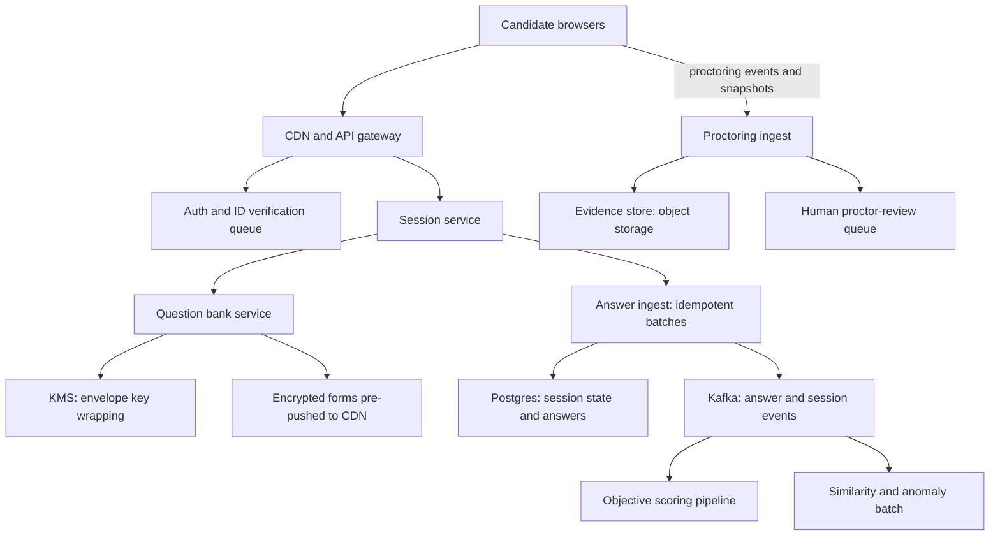
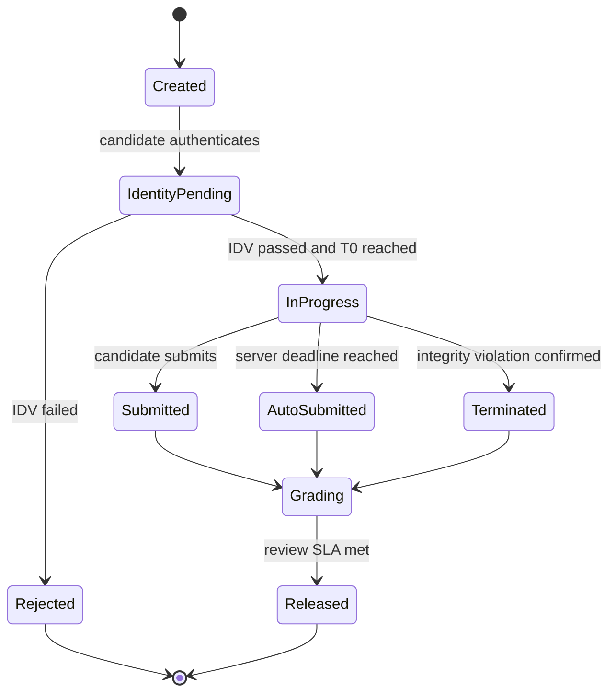

# Case Study: Design an Online Exam / Proctoring Platform

## Overview

This is the 45-minute walkthrough for designing an online examination platform: encrypted question delivery that resists leaks, a session state machine where the *server* owns the clock, proctoring signals gathered from untrusted clients, and a scoring pipeline that must survive disputes. The signature scale event is not steady traffic but a **thundering herd** — 100K candidates told to start at 09:00 sharp — which makes this a hybrid of the fairness-under-load playbook from [Case Study: Ticketmaster](./ticketmaster.md) and the real-time media plumbing of [Case Study: Video Conferencing](./video-conferencing.md). The candidate-facing cousin of this problem (which platforms exist, how to prepare) lives in [Coding Assessments](../../../placement-preparation/coding-assessments.md); this page builds the platform behind them. Interviewers use it to test integrity-first design: here, unlike most systems, a correctness failure is a scandal, not an outage.

## Step 1 — Requirements

### Functional

- Author and store a question bank with difficulty, topic tags, and versioning; compose exam **forms** from blueprints (e.g. "12 questions: 4 easy arrays, 4 medium DP, 4 hard graphs")
- Schedule an exam window; register candidates; verify identity before entry
- Run a session: deliver the form, accept autosaved answers, enforce the timer, auto-submit at the deadline
- Collect proctoring evidence: webcam snapshots, tab/blur events, fullscreen-exit events, clipboard attempts
- Score objective questions automatically; route essays/code to graders and similarity checks; release results with audit logs; support regrade and appeals

### Non-Functional

- **Integrity first**: question content never leaves encrypted storage until a specific, authenticated, active session decrypts it; a leaked form is a failed design, not an incident
- **Scale**: 100K concurrent candidates with a synchronized 15-minute start window; a national exam is 1–2M candidates over the day
- **Correctness of time**: candidate-visible remaining time may drift ≤ ~1 s from server truth; the server's deadline is the only deadline
- **Durability**: an accepted autosave is never lost — a candidate must never re-take an exam because of our crash. Answer durability beats availability (degrade: extend time, queue entry)
- **Availability**: 99.95% during exam windows; degradation is allowed, data loss and unfairness are not
- **Privacy**: proctoring evidence is minimized (snapshots and events, not continuous video where policy allows), retained for a bounded period, access-logged, and processed under GDPR-style lawfulness and consent

## Step 2 — Back-of-Envelope Estimation

The load is a spike, not a ramp — the shape matters more than the total.

| Quantity | Assumption | Result |
|---|---|---|
| Login burst | 70% of 100K arrive in the 10 min before T0, spiky | ~117/s avg, ~1K/s at spikes |
| T0 activation | form fetch + session start within 30 s | ~3.3K form fetches/s (CDN-served) |
| Autosave writes | 1 batch/30 s per candidate, ~5–50 KB | ~3.3K req/s steady-state writes |
| Total answers per sitting | 100K × 40 questions × ~1 KB | ~4 GB per exam — trivially storable |
| Proctoring evidence | 1 snapshot/20 s × ~45 KB × 100K | ~13.5 GB/min ≈ **810 GB/hour raw** |
| Evidence after filtering | client-side face/motion gating cuts 5–10× | ~80–160 GB/hour uploaded |
| ID verification | 10% need manual review at ~90 s each | 10K × 90 s ≈ 250 reviewer-hours |
| End-of-exam submit burst | 80% submit in the final 5 min | ~270 submits/s, each a small transaction |

Three patterns to verbalize. First, the **write path is modest** (3.3K autosaves/s) — this is not a throughput problem; it is a *synchronization* problem (everyone hits T0 together) and a **fairness** problem (timer authority). Second, raw proctoring evidence is the biggest storage line item, which drives the client-side filtering decision. Third, ID verification is a *human* bottleneck: 250 reviewer-hours means either pre-verification at registration or an elastic review workforce, and the exam cannot start without it.

## Step 3 — API Sketch

```text
POST /v1/exams/{id}/register          → { candidate_id, slot }
POST /v1/exams/{id}/sessions          → { session_id, idv_required }
POST /v1/sessions/{sid}/identity      → multipart ID photos → { state: pending | passed }
GET  /v1/sessions/{sid}/form          → encrypted envelope (short-TTL signed URL)
POST /v1/sessions/{sid}/answers       → idempotent batch autosave, body: answers[], client_nonce
POST /v1/sessions/{sid}/submit        → final submit; server stamps receive-time
GET  /v1/sessions/{sid}               → { state, remaining_ms, server_now }
POST /v1/sessions/{sid}/events        → proctoring event batch (tab blur, snapshot refs)
POST /v1/results/{rid}/appeal         → triggers regrade workflow
```

Decisions worth stating out loud:

- `POST /answers` is **idempotent** — the client retries autosaves on flaky networks with the same batch key, and replays are no-ops (the mechanics match [API Idempotency](../../../backend/api/api-idempotency.md) and RFC 9110 §9.2.2)
- The form endpoint returns an encrypted blob from the CDN, not from the app tier — the anti-leak design (Deep Dive 1) depends on this split
- Timer truth is only ever read from the server: `remaining_ms` is recomputed from an absolute server deadline on every read, never trusted from the client

## Step 4 — High-Level Architecture



The control plane (session service, question bank) and the data plane (CDN-served encrypted forms, object-storage evidence) are deliberately separated. The app tier never serves question bytes at exam time — it only authorizes. This is what makes the T0 spike survivable: the expensive bytes were pushed to CDN POPs *before* the exam, and live traffic is small authenticated transactions plus idempotent autosaves.

## Step 5 — Data Model (Session-Critical Tables)

```text
exam(id, title, blueprint_json, starts_at_utc, duration_min, bank_version)
form(id, exam_id, candidate_id, enc_blob_url, wrapped_dek, content_hash)
session(id, exam_id, candidate_id, state, deadline_utc, grace_s, region, resume_count)
answer(session_id, question_no, payload_enc, payload_hash, batch_key, received_at,
       UNIQUE(session_id, batch_key))
integrity_event(id, session_id, type, severity, evidence_ref, detected_at)
proctor_review(id, session_id, reviewer_id, disposition, decided_at)
audit_log(id, session_id, prev_hash, payload_hash, actor, action, ts)
```

Conventions that carry the integrity argument:

- `deadline_utc` is absolute on the session row — no countdown counter is ever incremented or decremented, so a crashed or resumed session computes identical time from any server
- The `UNIQUE(session_id, batch_key)` constraint *is* the autosave idempotency mechanism: a replayed batch inserts nothing and returns the same ack, no application-level check needed
- Answers store a `payload_hash` alongside the encrypted payload, so a regrade can prove the answer being rescored is the answer that was received at `received_at` — evidence, not assertion
- `audit_log` is append-only with a hash chain (`prev_hash`): tampering with history is detectable, which is what makes the record usable in an academic-appeal process
- `integrity_event` rows are facts ("blur event at T+12:04"), never verdicts; the verdict lives in `proctor_review` with a human name on it

## Deep Dive 1 — Question Bank and Anti-Leak Encrypted Delivery

The threat model is concrete: screenshots, screen recording, shared Google Docs during the exam, and post-exam resale of "leaked" forms. Defenses layer across delivery, composition, and detection:

- **Envelope encryption**: each form is serialized, encrypted with a per-session data key (AES-256-GCM), and the data key is wrapped by a KMS-held key encrypting key; the wrapped key is released *only* to the authenticated session after ID verification and only at activation. Storage and CDN hold ciphertext; even a full storage compromise yields nothing without KMS (key management patterns: [Design: Security](../hld/security-design.md))
- **Per-candidate composition**: forms are assembled from the bank per blueprint with randomized selection, shuffled option order, and — for quantitative items — per-candidate numeric parameters. Two neighbors with the same questions still have different answer keys; screenshot-sharing collapses into "get my answer key, not yours"
- **Short-TTL signed URLs + no-store**: form blobs and snapshot uploads move via signed URLs valid for minutes; browsers get `Cache-Control: no-store`; nothing question-related is cached at a shared proxy in plaintext form
- **Watermarking for leak tracing**: candidate-identifying marks are embedded invisibly — zero-width characters in question text, option-order permutations as a code, pixel-level noise in images. A leaked screenshot identifies the leaker, which changes attacker economics
- **Canary detection**: honeypot questions with unique phrasing are seeded into forms; scraping sites that sell exam content for canary matches detects leaks early and voids those questions' scores at scale

The honest caveat to state: a determined candidate with a camera pointed at the screen defeats software. The design goal is to make leakage *attributable* and *low-value* (per-candidate parameterization), not impossible — and interviewers reward saying exactly that.

## Deep Dive 2 — Session State Machine and Server-Authoritative Timer



The timer is the integrity core, and the rule is absolute: **the server owns time; the client only displays it.**

- The deadline is an absolute UTC timestamp (UTC internally — no DST or timezone arithmetic in the correctness path) stored on the session row; `remaining_ms = deadline - now(server)`. Servers are NTP-disciplined (RFC 5905) so cross-server skew stays in the tens of milliseconds
- The client computes its countdown with a *monotonic* timer (`performance.now()` deltas) between syncs — immune to the user changing the OS clock — and re-syncs `remaining_ms` on every autosave ack and heartbeat (every ~30 s)
- **Acceptance rule**: an answer is accepted iff the server *receives* it before `deadline + grace` (a 5–10 s grace absorbs in-flight requests at the boundary). At the deadline a per-session sweeper (or the write path itself, refusing new answers past deadline + grace) flips the session to `auto_submit` with whatever was durably saved — the candidate's "I clicked submit" at T-1 s means nothing if the request never arrived
- **Disconnection**: resume recomputes remaining time from the same absolute deadline — a laptop that crashes at T+20 min re-enters with 10 min left, not a restarted countdown. The state machine, not the client, defines whether work resumes or the exam is voided
- **Clock drift handling**: if client-reported remaining time diverges from server truth beyond a threshold (say 3 s), the server value wins silently and the divergence itself is logged as a weak integrity signal — tampering patterns correlate with violations

The timer and autosave policy is configuration, not code, because it varies per product line (hiring OAs vs national exams vs classroom quizzes):

```yaml
session:
  duration_min: 90
  autosave_interval_s: 30
  autosave_batch_max_answers: 10
  deadline_grace_s: 10
  client_drift_warn_s: 3
  resume_allowed: true
proctoring:
  snapshot_interval_s: 20
  client_side_face_model: on
  tab_switch_events: on
  evidence_retention_days: 90
  auto_terminate: never        # flags go to human review only
start:
  activation_jitter_max_s: 900
  waiting_room: on
```

**What the interviewer is probing:** whether you place trust in the client anywhere. The correct answer puts zero: client time is decoration, client events are evidence, client state is a cache of server state.

## Deep Dive 3 — Proctoring Signals and Privacy Trade-Offs

Proctoring collects evidence from an untrusted client, so every signal is advisory — the system's integrity never *depends* on it, and human review adjudicates flags.

| Signal | Collection | Detection value | Privacy cost | False-positive risk |
|---|---|---|---|---|
| Tab-switch / blur events | Page Visibility API + blur/focus listeners, zero bandwidth | High — Leaving = the textbook cheat signal | Low (no media) | Medium (OS notifications trigger blur) |
| Fullscreen exit | `fullscreenchange` events | High for lockdown flows | Low | Low |
| Webcam snapshots | 1 frame/20 s via `getUserMedia`, not continuous video | Medium — presence, gaze, second person | High (biometric-adjacent media) | Medium (lighting, movement) |
| Face detection | Client-side model (OpenCV.js/MediaPipe) emits counts/anomalies, not video | Medium | Medium (only metadata leaves device) | Medium-high |
| Clipboard/paste attempts | `paste`/`copy` events with context hashes | Medium for question resale | Low | Low |
| Keystroke/mouse cadence | Aggregate timing stats | Low-medium, mostly for forensics | Medium | High — never auto-flag on this |

Design rules that reconcile integrity with privacy (and that interviewers increasingly probe):

- **Data minimization**: prefer events over media, client-side inference over raw upload (the client model flags "second face detected" without shipping video), and snapshots over continuous recording — the 810 GB/hour raw figure from Step 2 drops to ~100 GB/hour and the per-candidate exposure drops with it
- **Lawful basis and consent**: proctoring requires explicit consent *before* ID collection, an appeal path, and GDPR-compliant handling for EU candidates (official text: EUR-Lex); refuse-to-consent flows need a defined alternative (in-person testing) or the product is legally fragile
- **Retention and access**: evidence is encrypted at rest, retained for a bounded window (e.g. 60–90 days to cover appeals, then deleted), and every access is logged — a proctor-review click is an auditable event
- **Never auto-punish**: flags create a review queue item, never a verdict; terminated sessions (state machine above) require a human confirmation step, because false positives at 100K candidates are thousands of destroyed exams

## Deep Dive 4 — 100K Synchronized Start: The Thundering Herd

A 09:00 exam with 100K candidates is the same animal as a hot ticket on-sale: demand spike that no steady-state capacity plan absorbs. The mitigations, in order of leverage:

- **Staggered personal start windows**: candidates receive start times spread across 0–15 min (or log in early, then activate within a jittered window). A 15-min spread turns a 3.3K/s spike into ~110/s. Fairness holds because *timer fairness is per-candidate* — each gets an identical 90-min server-anchored countdown regardless of activation second
- **Pre-warm everything before T0**: sessions created at login (not at activation), identity checks completed pre-exam, encrypted forms pushed to CDN POPs during the off-peak night, DB capacity and connection pools scaled ahead, and the answer-ingest tier duplicated. At T0 the only new work is an activation write per candidate
- **Admission control as the safety valve**: if activation demand still exceeds capacity, candidates queue with position feedback (the waiting-room pattern from Ticketmaster) and admitted candidates get the full timer — queueing degrades *schedule*, never *fairness* or *durability*
- **Separate planes under load**: control-plane saturation (join, activate) must not stall the data-plane autosave path; autosave ingestion is the highest-priority write path because it protects candidate work. Autosaves are idempotent, batched (up to N answers or 30 s), and retried with jittered backoff — a 30-second gap in autosaves is invisible in outcomes
- **End-of-exam submit burst** (~270/s): the same idempotent write path absorbs it; the sweeper handles anyone who never submits at all
- **Regional deployment**: each region runs session/ingest stacks with regional read replicas; forms and KMS-backed keys are regional, results merge centrally. A region down degrades to queue-and-delay for that region's candidates, with time compensated

The honest number to quote: with 15-min jitter plus pre-warming, T0 live load on the app tier is ~1K/s of small transactions — a fleet of modest services handles it; without them, it is a self-inflicted outage.

## Deep Dive 5 — Result Computation Pipeline

Scoring is an async pipeline that separates fast objective truth from slow judgment work:

1. **Objective scoring** consumes answer/submission events from Kafka and scores multiple-choice/fill-in deterministically — a per-candidate score exists within minutes of submit, but is *held* in `grading` state
2. **Similarity and anomaly batch** runs token-fingerprint comparison across the cohort (MOSS-style plagiarism detection for code exams), timing anomalies (answers submitted before the question could render), and score-vs-population outliers — flags attach to the session, not the score
3. **Proctor review join**: human reviewers adjudicate flagged sessions within an SLA; `terminated` and `auto_submit` sessions get explicit disposition before release. Reviewer throughput (~90 s per case) is itself a capacity item: 10K flagged sessions ≈ 250 reviewer-hours
4. **Release with audit trail**: every state transition is an append-only, hash-chained audit record (who/what/when + input hash), so an appeal regrades *deterministically from the log* rather than from memory. Regrade is idempotent recompute — the same inputs must produce the same score forever

The pipeline's key property: **score release is a deliberate gate**, not the end of a compute job. Integrity review must complete (or time out with documented policy) before candidates see results, because retracting a published score is a far worse failure than delaying one.

### Operational SLOs

- **Autosave durability**: 100% of acked batches recoverable — verified by chaos drills that kill ingest nodes mid-exam (the one SLO with zero tolerance)
- **Timer accuracy**: client-visible remaining time within 1 s of server truth at every sync; server fleet skew < 50 ms via NTP
- **Activation p95**: < 3 s from "start exam" click to decrypted form rendered, measured per region
- **IDV queue wait p95**: < 2 min at exam start; enforced by elastic reviewer staffing against the Step 2 arithmetic
- **Score release**: within the published SLA (e.g. 48 h) with the review gate satisfied — release-late beats release-wrong, and the audit log makes the trade explicit

## Bottlenecks & Follow-Up Questions

- **ID verification queue**: 250 reviewer-hours of manual checks cannot start at 08:55. Follow-up: "so what's the design?" → Verify at registration (days earlier), keep a small live-review desk for exceptions, and pre-approve 90%+ of candidates so exam-morning IDV is an edge case
- **KMS key-release rate**: 100K key unwraps at T0. Follow-up: KMS APIs sustain thousands of RPS — spread activations with jitter and cache wrapped keys (never unwrapped ones) in the session service
- **Proctoring ingest flood**: a platform bug spams snapshot uploads. Follow-up: evidence ingest is lossy-tolerant and backpressured — clients buffer and retry snapshots; answers always preempt evidence on the client's upload queue
- **Candidate with 2 devices / remote-desktop**: software signals are weak alone. Follow-up: cross-signal correlation (impossible focus+typing patterns, second-face events, IP/geo anomalies) feeds the human queue — correlation beats any single detector
- **Power cut at T+45 min**: the state machine answers it: resume from server deadline with saved answers; candidates get the *remaining* time, and exam policy (not code) decides extensions. The autosave durability target exists for exactly this question
- **Result-dispute storm after a hard exam**: regrade runs as deterministic recompute over the audit log with a feature-flagged scoring version; thousands of appeals are a batch job, not a fire drill

## Interview Questions

1. **Why must the timer live on the server, and how do you handle client clock drift?** The client is adversarial and its clock is user-controlled; any countdown maintained client-side is editable. The server stores an absolute UTC deadline per session and every read of `remaining_ms` is recomputed from it; the client renders using monotonic deltas between syncs and re-syncs on each autosave ack. Drift beyond a small threshold is silently overridden and logged as an integrity signal. Acceptance uses server receive-time with a 5–10 s grace for in-flight requests, and the deadline sweeper auto-submits regardless of client state.
2. **How do you deliver questions so a leak is neither catastrophic nor cheap?** Layer four mechanisms: per-session envelope encryption with KMS-wrapped keys so storage/CDN only ever hold ciphertext; per-candidate composition (randomized selection, shuffled options, parameterized numbers) so a shared screenshot yields someone else's answer key; invisible watermarks (zero-width chars, option-order codes, image noise) so leaks are attributable; and canary questions that detect resale early. State the honest limit — a camera at the screen defeats software — and the goal becomes low-value, attributable leakage, which is what drives attackers away.
3. **Walk me through 100K candidates starting at the same minute.** Pre-warm first: sessions created at login, IDV done at registration, encrypted forms pushed to CDN POPs the night before, ingest tiers scaled. Then jitter activations across ~15 min so live load is ~1K/s of small transactions instead of a 3.3K/s spike. If demand still saturates, a waiting room with position feedback admits candidates against service capacity, and admitted candidates get the full server-anchored timer — schedule degrades, fairness and durability never do. The end-of-exam submit burst rides the same idempotent write path.
4. **What exactly happens when a candidate's browser dies at T+50 of 90 minutes?** The session stays `in_progress` server-side; all accepted autosaves are durable (idempotent batched writes were acked before the crash). On reconnect the session service re-validates identity, re-issues the encrypted form, and reports `remaining_ms` from the same absolute deadline — the candidate gets the remaining 40 minutes, not a restarted exam. Proctoring evidence shows the gap; a human reviews if the gap pattern is suspicious. Nothing about recovery depends on client state, which is the whole point of the state machine.
5. **How do you design proctoring without building a surveillance system?** Minimize by default: visibility/blur events and clipboard hashes carry most detection value at near-zero privacy cost; webcam evidence is snapshots (1/20 s) gated by client-side face/motion models so metadata, not video, leaves the device; retention is bounded at 60–90 days with encrypted, access-logged storage; consent and an appeal path are product prerequisites, with GDPR-compliant handling for EU candidates. Decisively: flags open review-queue items, never verdicts — auto-terminating exams on ML signals at 100K candidates manufactures thousands of false accusations per sitting.
6. **Why is score release a gate rather than the end of a scoring job?** Objective scoring finishes in minutes, but integrity review (plagiarism similarity, timing anomalies, proctor adjudication) takes hours and sometimes reclassifies sessions. Publishing immediately means retracting scores later — a legal and reputational failure; holding release until review completes (or a documented timeout policy applies) converts integrity findings from corrections into decisions. The audit log with hash-chained transitions plus deterministic recompute makes any appeal a reproducible batch job, which is what keeps thousands of disputes cheap.

## Key Takeaways

- This is an integrity-first design: correctness failures are scandals, so trust sits entirely server-side — client clocks are decoration, client events are evidence, client state is a cache
- The thundering herd is solved before T0: pre-created sessions, pre-verified identity, pre-pushed encrypted forms, then jittered activations — and a waiting room that degrades schedule, never fairness
- Anti-leak delivery combines envelope encryption (KMS), per-candidate composition and parameterization, invisible watermarks, and canary questions; the goal is attributable, low-value leakage, not impossibility
- Timer authority is an absolute server deadline with monotonic client rendering between syncs, server-receive-time acceptance plus small grace, and a sweeper that auto-submits regardless of client
- Proctoring trades detection value against privacy explicitly: events over media, client-side inference over raw upload, snapshots over continuous video, human review over auto-punishment, bounded retention over forever
- ID verification is a human-capacity bottleneck — 250 reviewer-hours for 100K candidates — so it happens at registration, not on exam morning
- Raw proctoring evidence (≈810 GB/hour at 100K candidates) is the largest storage line item, which alone justifies client-side filtering
- Results are gated on review and backed by a hash-chained audit log with deterministic recompute, making appeals and regrades cheap batch work instead of crisis response

## References

- RFC 9110 — HTTP Semantics (idempotent methods, §9.2.2): https://datatracker.ietf.org/doc/rfc9110/
- RFC 6238 — TOTP: Time-Based One-Time Password (candidate/MFA second factor): https://datatracker.ietf.org/doc/rfc6238/
- RFC 7519 — JSON Web Token (session and activation tokens): https://datatracker.ietf.org/doc/rfc7519/
- RFC 5905 — Network Time Protocol (server clock discipline for deadline authority): https://datatracker.ietf.org/doc/rfc5905/
- RFC 8825 — WebRTC overview (the transport behind getUserMedia-based proctoring): https://datatracker.ietf.org/doc/rfc8825/
- MDN Web Docs — Page Visibility API (tab-switch detection): https://developer.mozilla.org/en-US/docs/Web/API/Page_Visibility_API
- MDN Web Docs — MediaDevices.getUserMedia (camera snapshot capture): https://developer.mozilla.org/en-US/docs/Web/API/MediaDevices/getUserMedia
- OpenCV documentation — face detection modules runnable client-side (OpenCV.js): https://docs.opencv.org/4.x/
- Regulation (EU) 2016/679 (GDPR), official EUR-Lex text — lawfulness, consent, retention for proctoring data: https://eur-lex.europa.eu/eli/reg/2016/679/oj
- PostgreSQL documentation — transactional session state and conditional updates: https://www.postgresql.org/docs/current/
- Apache Kafka documentation — answer-event backbone and deterministic recompute: https://kafka.apache.org/documentation/
- Redis documentation — IDV queue and waiting-room primitives (lists, sorted sets): https://redis.io/docs/latest/
- MOSS (Measure of Software Similarity), Stanford — reference plagiarism-detection approach for code exams (no stable public URL; cited by name)

## Cross-References

- [Case Study: Ticketmaster](./ticketmaster.md) — the thundering-herd and waiting-room playbook this platform reuses for synchronized exam starts
- [Case Study: Video Conferencing](./video-conferencing.md) — the WebRTC/media fundamentals behind camera-based proctoring
- [Coding Assessments](../../../placement-preparation/coding-assessments.md) — the candidate-side view: platforms, formats, and anti-cheat measures from the test-taker's seat
- [Design: Rate Limiter](../rate-limiter.md) — admission control and per-candidate throttling during the start window
- [Design: API Idempotency](../../../backend/api/api-idempotency.md) — the idempotent autosave and submit mechanics
- [HLD: Security Design](../hld/security-design.md) — KMS envelope encryption and threat-model patterns for the question bank
- [Consistency Patterns](../consistency-patterns.md) — the read-your-writes and durability contracts behind session state
