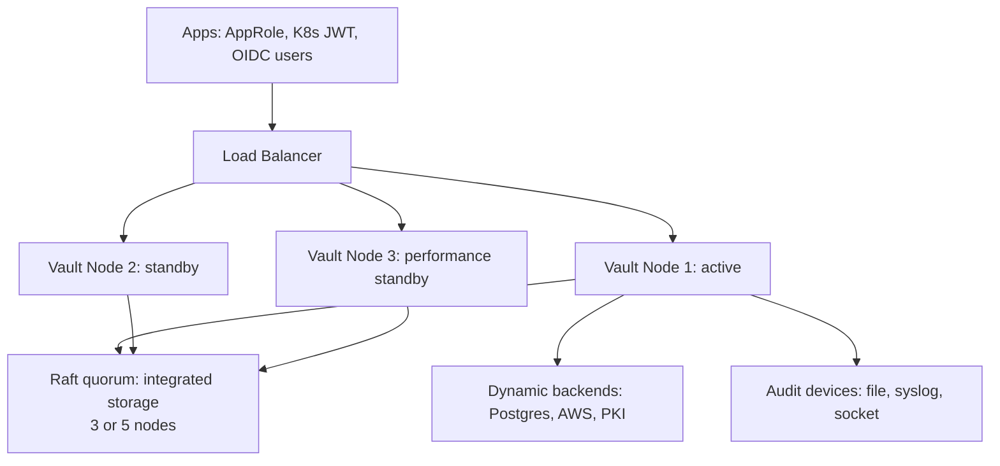
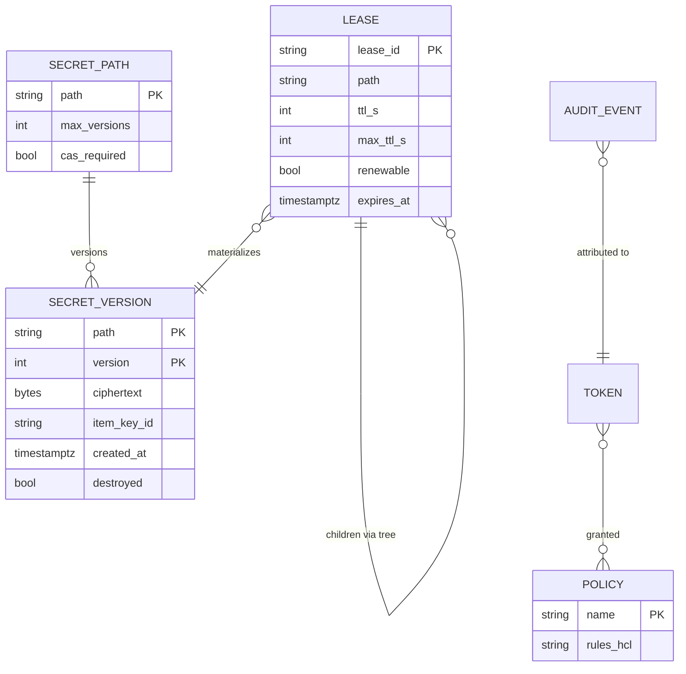
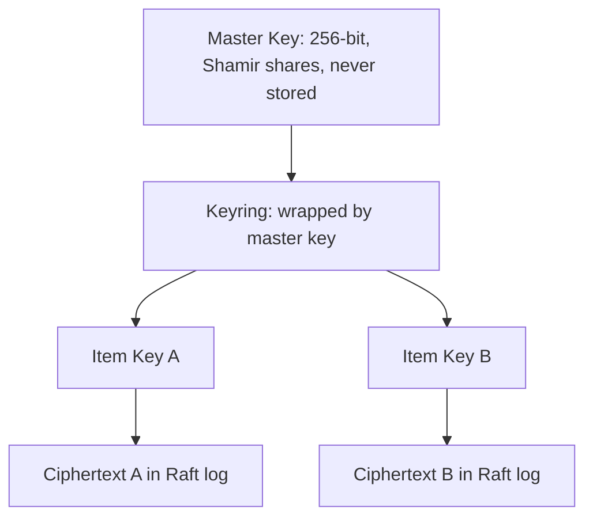
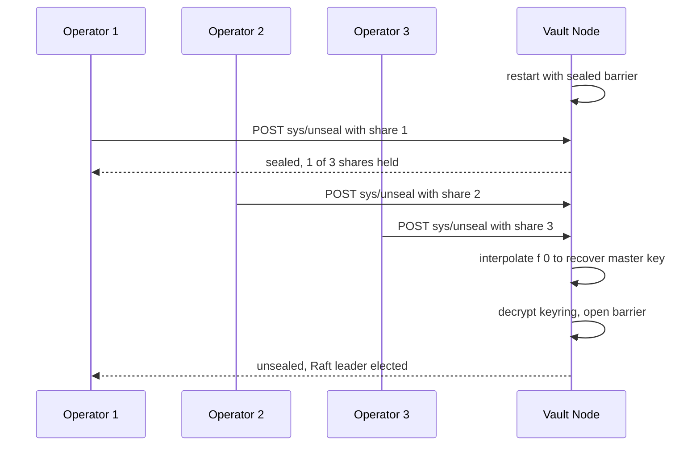
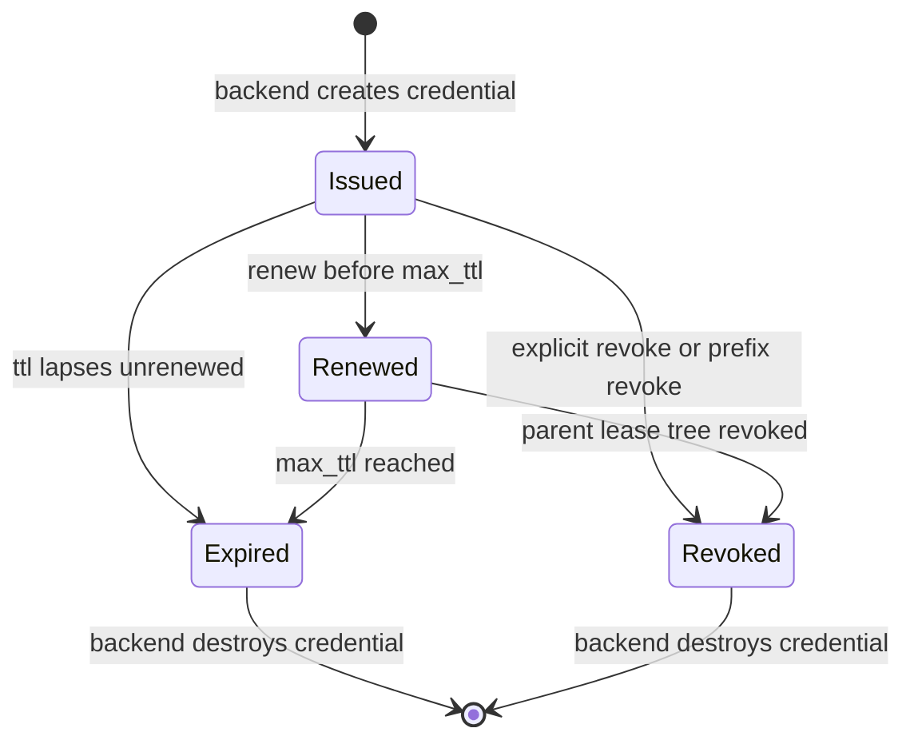

# Case Study: Design a Secrets Manager (Vault-Style)

## Overview

This is the interview walkthrough for designing a secrets management system in the style of HashiCorp Vault: an encrypted, audited, HA store where the *root of trust* is deliberately distributed among humans (Shamir-unseal), secrets are protected by envelope encryption, and — the part that separates senior answers — the system can mint **dynamic, leased credentials** (short-lived DB passwords, certificates) and revoke them deterministically. The existing [HashiCorp Vault](../../../security/vault.md) page explains how Vault works internally, and [Secrets Management](../../../security/secrets-management.md) covers the operational practice; this page builds the system from requirements on a whiteboard, with the unseal math, the lease/revocation engine, and the honest availability story of a fail-closed design. Expect it as a security-flavored system-design round (45 min) or as a deep follow-up to "design a KMS."

## Step 1 — Requirements

### Functional

- Store, read, list, and version **static secrets** at namespaced paths (KV v2 semantics: every write creates a new version, old versions readable, per-path rollback)
- Issue **dynamic secrets**: database credentials, TLS/SSH certificates, cloud credentials — generated on demand with a TTL, not stored
- **Leases**: every dynamic output has a `lease_id`, TTL, max TTL, and renewability; leases expire or are revoked explicitly, including by prefix (revoke everything under `aws/creds/deploy-*`)
- Auth methods for machines and humans: AppRole (machine), Kubernetes service-account JWTs, OIDC/LDAP for people; **policies** (path → capability) attached to identities
- **Audit**: every request and response logged to append-only audit devices, with secret values HMAC-hashed — 100% coverage, no exceptions
- Admin: seal/unseal, key rotation, policy management, DR snapshots

### Non-Functional

- **Fail-closed**: a sealed cluster serves nothing — availability is deliberately capped by design until unseal; the availability engineering happens *around* this
- **Latency**: p99 < 50 ms for KV reads on warm paths; dynamic DB credential issuance < 500 ms (it includes a DB round trip)
- **Throughput**: 10K reads/s per cluster; writes bounded by Raft commit latency, not by storage size
- **Durability**: zero tolerance — losing the storage backend's committed log without a snapshot means losing every secret
- **Auditability**: audit is all-or-nothing; if the audit device cannot confirm a write, the request fails

## Step 2 — Back-of-Envelope Estimation

| Quantity | Assumption | Result |
|---|---|---|
| Secret items | 200K paths × 4 KB avg payload | ~800 MB ciphertext — tiny dataset, heavy security |
| Version history | 10 versions per path | < 10 GB — storage is never the constraint |
| Read throughput | 5K KV reads/s steady, 10K peak | served by performance standbys |
| Dynamic leases | 50K active DB leases, 1 h TTL | ~14 creations/s + ~14 expirations/s sustained |
| Audit volume | 100% of 10K req/s × ~1 KB/entry | ~400 GB/day — audit pipeline sized like a log pipeline |
| Snapshot cadence | Raft snapshots, hourly, off-cluster | restore drill monthly — an unrestored snapshot is decoration |
| Unseal shares | K=3 of N=5 | any 3 of 5 keyholders restore the root key; 2 can be lost |

The reframe that scores points: this is a **small-data system with consensus-grade durability and human-ceremony security** — the design effort goes into key hierarchy, lease lifecycle, and fail-closed semantics, not into petabyte storage. Contrast that framing with a cache or feed design in the same interview day.

## Step 3 — API Sketch

```text
Auth and identity:
  POST /v1/auth/approle/login          body: { role_id, secret_id } → { client_token, ttl }
  POST /v1/auth/kubernetes/login       body: { jwt, role }          → { client_token }
  POST /v1/auth/token/renew-self       → extends token TTL

Static secrets (KV v2):
  POST   /v1/secret/data/app/db        body: { data: {...} } → { version }
  GET    /v1/secret/data/app/db        → { data, metadata: { version } }
  GET    /v1/secret/metadata/app/db    → version list (no values)
  POST   /v1/secret/undelete/app/db    body: { versions: [3] }

Dynamic secrets and leases:
  GET  /v1/database/creds/app-readonly → { lease_id, lease_duration, username, password }
  POST /v1/sys/leases/renew            body: { lease_id }    → new ttl
  POST /v1/sys/leases/revoke           body: { lease_id }    → credential destroyed
  POST /v1/sys/leases/revoke-prefix    body: { prefix: "aws/creds/deploy" }

Admin:
  POST /v1/sys/unseal                  body: { key: share_i }  → { sealed: false }
  GET/PUT /v1/sys/policies/acl/{name}  → policy documents
  GET   /v1/sys/audit                  → enabled audit devices
```

Decisions to state out loud: reads carry an implicit lease-audit (every read is logged); dynamic credential responses are **never cached by intermediaries** (`Cache-Control: no-store`); and every listing endpoint returns metadata only, so `list` capability is safe to grant more broadly than `read`.

## Step 4 — High-Level Architecture



Component responsibilities:

- **Barrier**: the encryption layer wrapping all persisted data; until it is unsealed with the master key, the storage contains only ciphertext. Every byte at rest, including Raft log entries, is barrier-encrypted
- **Logical backends**: `kv` (static), `database`, `pki`, `aws/gcp` (dynamic) — each turns a read into credential generation + lease creation when dynamic
- **Expiration manager**: owns lease TTLs, renewal, and the revocation queue; leases are persisted so restarts do not orphan credentials
- **Token store + policy engine**: authentication produces a token with attached policies; every request is authorized by path-capability matching before hitting any backend
- **Storage backend — Raft integrated storage** (the modern default since Vault 1.4): the log and snapshots are Raft-managed, removing the old Consul dependency; the active node is the Raft leader, standbys replicate, performance standbys additionally serve reads (see [KV Store case study](../kv-store.md) for the underlying engine design and the [Raft paper](https://raft.github.io/raft.pdf) for quorum semantics)

## Step 5 — Data Model



Modeling notes that matter in discussion: lease IDs are hierarchical (`backend/role/uuid`) so prefix revocation is a tree walk rather than a table scan; `destroyed` versions keep metadata (audit trail) while zeroing ciphertext; and tokens are referenced by **accessor** in audit logs, never by the token value itself.

## Deep Dive 1 — Storage Backend and Envelope Encryption

The key hierarchy has three tiers, each answering a different operational question:

1. **Master key** (256-bit): encrypts the keyring. Never stored — it exists only at unseal, reconstructed in memory from Shamir shares (or supplied by auto-unseal). Answers: *who can open the barrier?*
2. **Keyring**: holds the current encryption key plus retired key versions. Encrypted by the master key; rotated regularly. Answers: *how do we rotate without re-encrypting the world?*
3. **Item keys**: each secret write is enveloped — a fresh per-item key encrypts the payload, and only the item key is wrapped by the keyring. A compromised item key exposes exactly one item. Answers: *what is the blast radius of a single key leak?*



Envelope encryption pays off exactly at rotation time: rotating the keyring wraps new item keys with the new key version and leaves old ciphertext alone; rotating the *master key* is rare and ceremonial. This is the same hierarchy cloud KMS services expose (see the comparison table below and [Cryptography](../../../security/cryptography.md) for the underlying primitives). The Raft log itself is barrier-encrypted before disk, so a stolen disk or snapshot leaks nothing useful without the master key — durability and confidentiality are layered independently.

## Deep Dive 2 — Unseal: Shamir's K-of-N in Detail

Unseal is the trust ceremony that makes a secrets manager different from a database. Shamir's secret sharing (Shamir, *Communications of the ACM*, 1979) splits the master key \\( S \\) with a random polynomial of degree \\( K-1 \\): \\( f(x) = S + a_1 x + \\dots + a_{K-1} x^{K-1} \\) over a finite field; share \\( i \\) is the point \\( f(i) \\). Any \\( K \\) shares reconstruct \\( f(0) = S \\) by Lagrange interpolation; **fewer than \\( K \\) shares reveal nothing about \\( S \\)** — information-theoretically, not just computationally. Vault implements this byte-wise over \\( GF(2^8) \\), splitting the 256-bit key as 32 independent byte-secrets.



Design conversation the interviewer expects:

- **Choosing K and N**: `K=3, N=5` means any two keyholders colluding gain nothing and any two lost shares are survivable; lower K (2) weakens the adversary threshold, higher K (5 of 7) makes the 3 AM ceremony fragile. State the failure you are tuning for: insider collusion vs operational lockout
- **In-memory only**: the reconstructed master key lives in memory and the shares are never persisted — a restarted node must be re-unsealed (unless auto-unseal)
- **Auto-unseal trade-off**: delegating unseal to a cloud KMS/HSM removes the ceremony but moves the root of trust to the cloud provider — the honest answer is that auto-unseal is the default in most production clusters precisely because human ceremonies degrade, while HSM-backed auto-unseal keeps the root local for the paranoid
- **Root tokens**: generated at initialization, immediately re-shared or revoked; day-to-day administration should use narrowly-scoped policies, not the root

A concrete sketch of the split for one 8-bit slice of the key (the real key is 32 such slices):

```text
Slice s of master key S. Choose K=3, N=5.
Random polynomial per slice:  f(x) = s + a1*x + a2*x^2   over GF(2^8)
Share_i = f(i) for i = 1..5              -> five operators hold one point each
Recover:  f(0) = sum of f(i) * L_i(0)     with Lagrange basis L_i evaluated at 0
Any 3 of the 5 points reconstruct S exactly. Any 2 points leave S
statistically uniform over the field - zero information leaked.
```

The property to emphasize is *information-theoretic*: security does not rest on RSA hardness or cipher strength, so a future quantum computer does not help the attacker — two shares forever reveal nothing.

## Deep Dive 3 — Dynamic Secrets and the Lease/Revocation Engine

Dynamic secrets are the feature that justifies building this system instead of using a password vault. For a database backend: an authorized token requests `database/creds/app-readonly`; Vault asks Postgres to `CREATE ROLE` a uniquely-named user with the role's grants and an expiry, returns the credential, and records a lease. Nothing is stored — the *lease* is the state, and the credential is regenerated per consumer, so sharing a DB password between services stops being possible at all.



The revocation engine has the properties the interview probes:

- **Lease tree**: leases are hierarchical; revoking a prefix walks the tree and revokes children transitively (revoking a token revokes everything it created)
- **Idempotency and crash safety**: revocation is queued and retried until the backend confirms; a revocation that cannot reach Postgres is retried, never forgotten — an orphaned credential is a security bug, so the revocation queue is durable state in the barrier
- **TTL hygiene**: defaults are per-role (`ttl` and `max_ttl`); renewal cannot exceed `max_ttl`, so even a compromised app loses its credential within a bounded window. Sane numbers: DB creds `ttl=1h, max_ttl=24h`; PKI certs `ttl=90d` for services, hours for humans
- **Connection budget**: thousands of `CREATE ROLE`/`DROP ROLE` operations fight the database's `max_connections`; jitter lease expiry (avoid synchronized renewal storms), batch expiration sweeps, and cap roles per backend

## Deep Dive 4 — HA, Auth Methods, Audit, and the Managed-Alternative Comparison

**HA via Raft integrated storage**: 3 or 5 nodes form a quorum; the active (leader) node serves writes, standbys forward to it, and **performance standbys** serve read paths (KV reads, token lookups) to scale reads horizontally. Losing one of three nodes costs write availability only during leader re-election (~seconds); losing quorum seals the cluster into fail-closed — which is the correct behavior, since serving secrets from unquorum'd state would mean serving possibly-stale access control. Snapshots are the DR story: scheduled, encrypted, stored off-cluster, and *tested* (an unrestored snapshot is decoration).

**Auth methods**:

- **AppRole** (machines): `role_id` (identifier) + `secret_id` (credential, use-limited, CIDR-constrained, TTL'd). The classic split keeps the two values in different delivery channels so a single leaked config file is insufficient
- **Kubernetes**: pods present a projected service-account JWT; Vault validates it via the Kubernetes `TokenReview` API and maps the namespace/service account to a role — no long-lived kubeconfig secrets anywhere (see [Kubernetes documentation](https://kubernetes.io/docs/home/))
- **OIDC/LDAP** (humans): group-based policy mapping; humans get short TTLs and no `sudo` capabilities

**Audit devices**: every request/response pair is written to one or more append-only devices (file, syslog, socket) with all sensitive fields **HMAC-hashed using a per-device salt** — operations can prove what happened and verify integrity without a plaintext haystack. The critical semantic: **audit failure blocks the request**. An unaudited read of a secret is indistinguishable from no read having happened, so the system fails closed by design; buffering exists, but silence does not.

One more lifecycle primitive worth volunteering: **sealing is always available** — `sys/seal` (or losing quorum) drops the barrier immediately, wiping the master key and keyring from memory for incident response ("laptop with the audit logs was stolen — seal now"), while unsealing again requires the quorum ceremony. A useful drill is to verify the seal path works *faster* than the unseal path, because that asymmetry is what makes sealing a credible emergency control rather than a liability.

| Capability | Vault-style self-hosted | AWS KMS | AWS Secrets Manager | GCP Secret Manager |
|---|---|---|---|---|
| Static secrets + versioning | Yes (KV v2) | No (keys, not secrets) | Yes | Yes |
| Dynamic secrets (DB creds, PKI, cloud) | First-class | No | Rotation via Lambda, not leasing | No |
| Lease/revoke engine, prefix revocation | Yes | No | No | No |
| Root-of-trust control | Shamir or your HSM | AWS-managed HSM | AWS-managed | Google-managed |
| Multi-cloud / on-prem | Yes | AWS only | AWS only | GCP only |
| Audit | HMAC'd audit devices, self-owned | CloudTrail | CloudTrail | Cloud Audit Logs |
| Operational burden | Yours (quorum, unseal, upgrades) | None | None | None |

The verdict to articulate: managed secret stores win when secrets are static, single-cloud, and rotation can be scheduled; a Vault-style system wins on **dynamic credentials, strict revocation, multi-cloud, and PKI/transit crypto** — you are buying an engine, not a safe.

## Bottlenecks & Follow-Up Questions

- **Audit device backpressure**: a slow syslog target stalls all writes; follow-up: "is that a bug?" → no, it is the fail-closed contract; mitigations are buffered audit with bounded memory, a second device, and dedicated audit infrastructure
- **Raft write ceiling**: every lease creation is a consensus write; follow-up: "DB credential churn exceeds it?" → jitter TTLs, raise default TTLs, batch expirations, and place the revocation sweep off the critical path
- **Performance standby read amplification**: hot KV paths can saturate standbys; follow-up: read-only KV caches at the consumer (agent templates, sidecar injection) reduce read QPS by 10–100×
- **Unseal at 3 AM**: human ceremony under pressure; follow-up: auto-unseal with cloud KMS — and say out loud what trust you traded
- **Version bloat**: KV v2 history grows unbounded per path; tune `max_versions` and prune metadata, or the "tiny dataset" stops being tiny
- **Root token sprawl**: break-glass tokens that never die; policy: revoke root at init, re-generate via quorum (`generate-root`) only for emergencies
- **Federation sprawl**: teams asking for their own clusters; follow-up: DR replication vs namespace isolation — one cluster per trust boundary, not per team

## Interview Questions

1. **Why envelope encryption instead of one master key encrypting everything?** Blast radius and rotation economics. With per-item keys wrapped by a keyring, a leaked item key exposes one item, and rotation of the keyring never re-encrypts ciphertext — only the small key material is re-wrapped. A single monolithic key means every rotation re-encrypts every secret (operationally infeasible) and every key leak is total. The same three-tier hierarchy (root → keyring → item) is what cloud KMS products expose.
2. **Explain Shamir unseal — what exactly does K of N buy?** A degree-(K−1) polynomial over a finite field embeds the master key as \\( f(0) \\); shares are points on it. Any K shares interpolate the secret; K−1 shares reveal *nothing* (information-theoretic security). With K=3, N=5: no two insiders can open the barrier, and two lost shares still leave the cluster recoverable. You are explicitly tuning the adversary threshold against the operational lockout risk — say that trade aloud.
3. **Why does a failed audit device block writes? Isn't that fragile?** Because audit is a security invariant, not telemetry: if a secret read can happen without a record, the audit log cannot prove what was or was not accessed, which destroys its forensic value and often its compliance validity. The system therefore fails closed; the engineering answer is not to weaken the invariant but to make the audit path reliable — buffered devices with bounded memory, multiple independent devices, and dedicated infrastructure.
4. **Walk through revoking 50,000 dynamic AWS credentials deployed across a fleet.** `revoke-prefix` on the lease tree marks the subtree, the expiration manager enqueues all descendant leases, and each revocation is retried idempotently until the AWS backend confirms the key is destroyed — durable, off the request path, and never dropped on crash. Fleet-side, cached credentials die within the cache TTL, which is why dynamic secret TTLs are minutes-to-hours, not days: the total revocation window is `retry time + consumer cache TTL`, and you design both numbers.
5. **How does HA work without violating fail-closed?** Raft with 3–5 nodes: leader serves writes, performance standbys serve reads, and a node forwards anything it cannot serve. If quorum is lost, the cluster seals — it does *not* serve from local state, because access-control staleness is a security hole, not a freshness nuisance. Availability engineering lives outside the barrier: auto-unseal to remove the ceremony, multi-AZ quorum, snapshots for DR, and consumer-side agents that keep functioning through short seal windows.
6. **When would you use AWS Secrets Manager instead of building/buying a Vault-like system?** Static secrets, single-cloud, scheduled rotation, small team — Secrets Manager plus IAM gives you 90% of the value with zero operational burden. Choose the Vault-style engine when you need dynamic DB/PKI credentials with real leases, prefix revocation, multi-cloud or on-prem roots of trust, or transit/encryption-as-a-service. The interview point is that "secrets manager" bundles four products (static vault, dynamic engine, PKI, KMS) and the requirements decide which you actually need.

## Key Takeaways

- Secrets management is small-data, consensus-grade engineering: the design effort goes to key hierarchy, leases, and fail-closed semantics, not storage scale
- Three-tier envelope encryption (master key → keyring → item keys) buys bounded blast radius and cheap rotation — the same shape as cloud KMS offerings
- Shamir K-of-N unseal turns the root key into a policy: no insider subset below K can act alone, and you explicitly trade adversary threshold against 3 AM operability
- Dynamic secrets with durable leases are the real product: credentials become per-consumer, TTL-bounded, and revocable by tree prefix
- Revocation must be durable and idempotent — an orphaned credential is a security bug, so the revocation queue lives inside the barrier
- Audit is all-or-nothing by design: HMAC-hashed entries, self-owned devices, and a fail-closed contract on audit failure
- Sealing is the emergency control — instant, memory-wiping, and deliberately asymmetric with the slow quorum unseal ceremony
- HA never overrides fail-closed: quorum loss seals the cluster; availability is engineered with auto-unseal, multi-AZ quorum, and consumer-side agents instead

## References

- HashiCorp Vault documentation — architecture, seal/unseal, storage backends: https://developer.hashicorp.com/vault/docs
- HashiCorp Vault API documentation — lease, auth, and audit endpoints: https://developer.hashicorp.com/vault/api-docs
- Ongaro & Ousterhout, "In Search of an Understandable Consensus Algorithm (Raft)," USENIX ATC 2014: https://raft.github.io/raft.pdf
- hashicorp/raft — the production Raft library behind integrated storage: https://github.com/hashicorp/raft
- etcd documentation — the other Raft-backed store commonly used as a Vault backend historically: https://etcd.io/docs
- Shamir, "How to Share a Secret," Communications of the ACM 22(11):612–613, 1979 (no URL — paywalled classic; DOI: 10.1145/359168.359176)
- AWS KMS documentation — managed envelope-encryption reference: https://docs.aws.amazon.com/kms/
- AWS Secrets Manager documentation — managed static-secret rotation: https://docs.aws.amazon.com/secretsmanager/
- Kubernetes documentation — service account tokens and TokenReview: https://kubernetes.io/docs/home/

## Cross-References

- [Security: HashiCorp Vault](../../../security/vault.md) — the internals reference for the real product this case study abstracts
- [Security: Secrets Management](../../../security/secrets-management.md) — lifecycle practice (generate, rotate, audit) at a management level
- [Security: Cryptography](../../../security/cryptography.md) — primitives behind envelope encryption and HMAC audit
- [HLD: Security in System Design](../hld/security-design.md) — where a secrets manager sits in a broader security architecture
- [Case Study: KV Store](../kv-store.md) — the storage-engine fundamentals under the Raft-backed backend
- [Case Study: Ticketmaster](./ticketmaster.md) — sibling case study; another fail-safe-first design (no oversell) with a different consistency center of gravity
- [References: Distributed Systems Library](../../../references/distributed-systems.md) — verified sources for Raft, etcd, and consensus libraries
