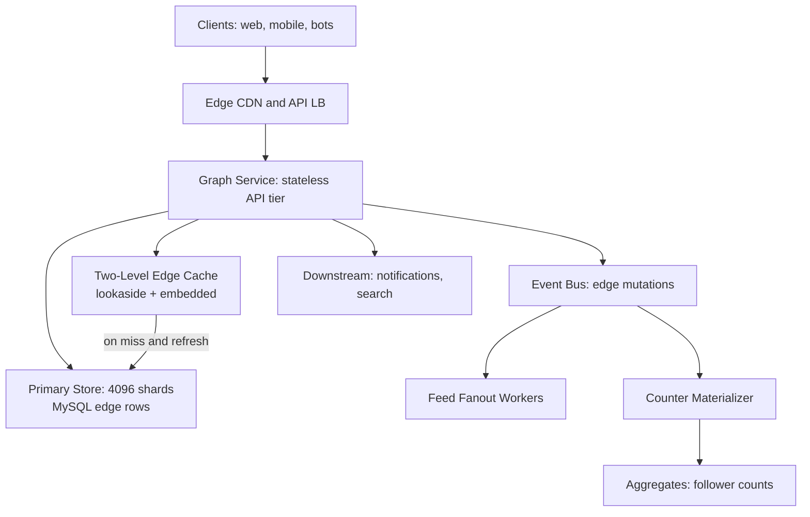
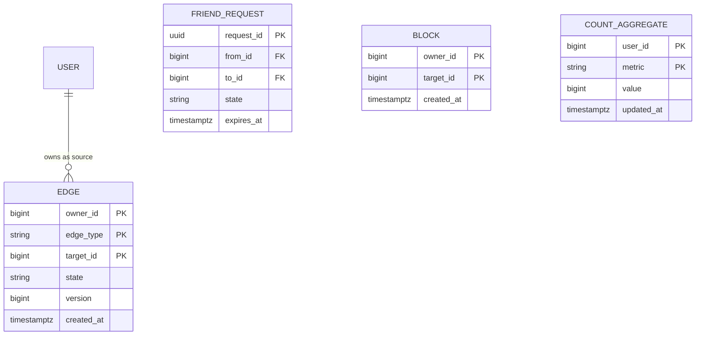
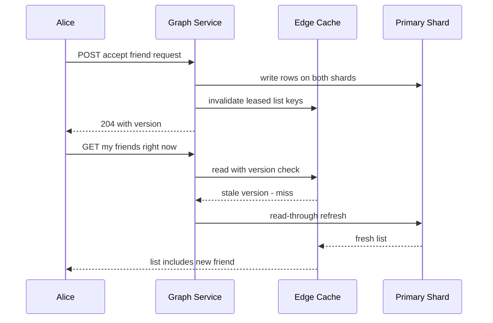
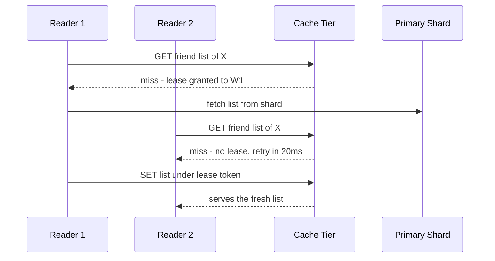

# Case Study: Design a Social Graph Service (Friendships at Facebook Scale)

## Overview

This is the storage-and-fanout deep dive behind "design Facebook's friend model": a service that stores hundreds of billions of directed edges, answers friend-list, mutual-friends, and friends-of-friends queries in milliseconds, and feeds the fanout engine that assembles a News Feed. The whiteboard skeleton (requirements, sharding, basic queries) lives in [Design a Social Graph](../social-graph.md); this page goes where the interview actually scores: dedicated graph store vs sharded RDBMS, TAO-inspired architecture, push-vs-pull fanout math for the celebrity problem, privacy-aware traversal, and the consistency contract for edges. Run it as a 45-minute standalone storage interview or as a follow-up to [Design a News Feed](../news-feed.md) — "you drew the feed, now design what stores the follow graph underneath it."

## Step 1 — Requirements

### Functional

- Maintain two relationship types: symmetric **friendship** (both sides consent, e.g. Facebook, LinkedIn) and asymmetric **follow** (no consent, e.g. Twitter/X)
- Reads: paginated friend list, follower/followee lists, mutual friends between two users, friends-of-friends (2nd degree), `isFriend(a, b)`, degree-of-separation up to 3 for suggestions
- Writes: send/accept/reject friend request, follow, unfollow, **block** — a block must terminate all traversals and remove prior edges within seconds
- Privacy: every traversal honors block relationships and per-edge audience rules (friends-only, public, custom lists)
- Emit edge-change events so feed fanout, notifications, and search react asynchronously

### Non-Functional

- **Scale**: 2B users; at an average of 350 edges/user that is ~700B directed edge rows. TAO (Facebook's social graph store) reported serving more than 1 billion requests per second already in 2013 — size your answer accordingly
- **Latency**: single-hop reads p99 < 50 ms; 2nd-degree reads p99 < 200 ms; writes acknowledged in < 100 ms
- **Consistency**: read-your-writes for a user's *own* edges (you accept a friend, your list shows it on the next refresh); eventual consistency everywhere else — counts, suggestions, 2nd-degree views
- **Availability**: 99.99% for reads; serve stale from cache rather than fail
- **Durability**: edges are the product — a committed friendship edge is never silently lost

## Step 2 — Back-of-Envelope Estimation

Work the skew before the totals: the average user has ~350 edges, the p99.9 user has ~5K, and a mega-celebrity has 100M followers. Averages lie; design for the tail.

| Quantity | Assumption | Result |
|---|---|---|
| Directed edge rows | 2B users × 350 avg | \\( 7 \\times 10^{11} \\) rows |
| Row size | 32 B (owner, target, type, state, version, ts) | ~22 TB primary store |
| With 3× replication | — | ~67 TB raw |
| Read rate | 500M actives × 20 graph reads/session/day | ~100K RPS avg, ~1M RPS peak |
| Write rate | friend events + follows + unfollows | ~1.5K/s avg, 50K/s bursts |
| Read:write ratio | social reads dominate | ~100:1 — this is a read problem |
| Hot working set | 100M actives × 350 edges × 32 B | ~1 TB across a two-level cache, not one flat tier |
| Shards | consistent-hash user_id → 4096 logical shards | ~170M rows ≈ 5.5 GB per shard |

The pattern to verbalize: 22 TB is *small* by modern standards — the hard parts are the **cache hit ratio at 1M RPS**, the **skew** (celebrity follower lists), and the **symmetric-write problem** (one friendship = two rows on two different shards).

## Step 3 — API Sketch

```text
POST /v1/friend-requests                → { request_id, state: pending }
POST /v1/friend-requests/{id}/accept    → { state: accepted, version }
DELETE /v1/friendships/{user_id}        → unfriends, removes both rows
POST /v1/follows                        body: { target_id } → { state: following }
DELETE /v1/follows/{user_id}            → { state: none }
GET  /v1/users/{id}/friends             ?cursor=&limit=100 → { edges[], next_cursor }
GET  /v1/users/{id}/followers           ?cursor=  (tail-first: newest follower)
GET  /v1/friendships/mutual?with_user_id=42   → { common_ids[], total_count }
GET  /v1/friendships/check?target=42    → { is_friend, distance ≤ 3? }
POST /v1/blocks                         body: { target_id } → edges removed, traversal cut
```

Decisions worth stating out loud:

- Pagination is **cursor-based and ordered by edge timestamp descending** — social UIs show recent relationships first, and offset pagination breaks under concurrent inserts (see [API Pagination](../../../backend/api/api-pagination.md))
- `GET /friendships/check` is a separate cheap single-hop endpoint; the full distance query is opt-in and more expensive
- Block is an idempotent write that *also* schedules edge removal and global cache purge — it is a moderation action, not just a graph mutation

## Step 4 — High-Level Architecture



The service is a **two-level cache in front of sharded row storage** — the TAO shape. Facebook's TAO (USENIX ATC 2013) stores the social graph as "objects" (users) and "associations" (edges) in MySQL, and puts a write-through cache tier (followers cache embedded in app servers, leader cache per region) in front of it; production TAO handles on the order of a billion reads per second with ~99.9% served from cache. The lesson to import: a social graph at this scale is *not* queried with graph algorithms 99.9% of the time — it is a KV workload with 4–5 hot query shapes, so build a KV-ish store with a deep cache rather than reach for a general graph engine.

## Step 5 — Data Model



Conventions that make the rest of the design work:

- **One physical row per directed edge per side**: friendship `A–B` writes `A→B` and `B→A` rows. This denormalization makes "get my friends" a single-shard prefix scan on `owner_id`
- Primary key `(owner_id, edge_type, target_id)` makes `isFriend(a, b)` one B-tree probe and the friend list a range scan
- `state` is a tiny state machine: for friendships `pending → accepted → (removed | blocked)`; blocks are also stored as rows of type `block` so traversals can filter with a join-free membership check
- Counts (follower total, mutual-friends total) are materialized aggregates, never `COUNT(*)` at request time

## Deep Dive 1 — Store Choice: Dedicated Graph Store vs Sharded RDBMS vs Graph Database

The interviewer wants the trade-off argued with workload numbers, not buzzwords.

| Option | Reads at this scale | Writes/skew | Query flexibility | Verdict |
|---|---|---|---|---|
| Sharded MySQL edge rows + cache (TAO-style) | ~99.9% from cache; shard scan = 1 index range | Shard-local; skew handled by shard splitting | Fixed query shapes only | **Production pick** — this is literally what Facebook built TAO on top of |
| Native graph DB (Neo4j, etc.) | Traversal-friendly, but 700B edges outgrows single-cluster Java heap caches; cross-shard BFS is brutal | Distributed transactions on hot nodes | Ad-hoc traversals, Cypher/Gremlin | Right tool below ~1-10B edges or for analytics/discovery subgraphs |
| Wide-column (Cassandra/DynamoDB) partitioned by owner | Excellent single-hop reads, tunable consistency | Great write throughput; symmetric edges need app-level dual-write | No joins, no server-side intersection | Solid alternative where MySQL ops are unwanted |

The decisive argument: **the query pattern is enumerable**. Friend list, isFriend, mutual friends, FoF, follower page — five shapes. When you can enumerate the queries, a relational row store with the right primary key plus a cache tier beats a flexible engine you will never fully use. Neo4j's own docs position it for connected-data use cases where traversals dominate; Facebook's own paper concluded the same workload at their scale demanded the TAO design instead of the ad-hoc graph queries their earlier MySQL+memcached setup made painfully slow.

Sharding layout worth drawing once the store is chosen — note the two-level mapping, which is what makes rebalancing possible without rehashing every user:

```text
Logical shard = hash(user_id) mod 4096, mapped to physical MySQL pairs
by an indirection table (so shards move without changing the hash):
  logical 0001 -> MySQL pair 07   user A rows:  A->(B,friend,accepted), A->(C,follow)
  logical 0002 -> MySQL pair 11   user B rows:  B->(A,friend,accepted)
Physical: 4096 logical shards on ~256 MySQL pairs (16 logical shards each),
each pair one primary + replicas; the logical->physical table is the
single seam used for split, move, and hot-shard evacuation.
```

Two consequences to verbalize: the indirection table is itself cached (it is read on every miss), and because a user's *outgoing* edges are the shard key, any query rooted at one user — the 99% case — is single-shard by construction. Cross-user queries (mutual friends) are exactly two shards, and the rare multi-hop batch jobs read replicas instead.

## Deep Dive 2 — Push vs Pull: The Celebrity Problem in Numbers

This math is the most commonly failed part of the interview. Feed assembly has two extreme strategies and the correct answer is a hybrid with an explicit threshold \\( T \\) on author follower count.

**Push (write fanout):** on every post, insert the post ID into each follower's pre-materialized feed list. Cost per post = follower count.

- Average author, 500 followers: 500 cache inserts — free
- Celebrity, \\( F = 10^8 \\) followers, 10 posts/day: \\( 10^9 \\) insertions/day ≈ 11.6K insertions/s sustained, bursting to ~100K/s seconds after posting. That is a dedicated cluster just for one account's writes

**Pull (read fanout):** at page load, fetch the last K posts of each followee and merge. Cost per refresh = followee count.

- 1B sessions/day × 10 refreshes × 500 followees = \\( 5 \\times 10^{12} \\) list lookups/day. Pull is *worse in aggregate* for the long tail but *trivial per celebrity* (3 celebrities you follow = 3 list reads)

| Strategy | Write cost | Read cost | Celebrity behavior | Freshness |
|---|---|---|---|---|
| Pure push | followers × posts | O(1) page fetch | 100M inserts per post — melts fanout workers | seconds |
| Pure pull | O(1) | followees × refreshes | Fine for celebs, brutal for the tail | read-time merge |
| Hybrid (threshold T) | push only if followers < T | merge pushed page + last K posts of pulled authors | Celebs are pulled at read; long tail is pre-pushed | seconds |

Worked hybrid example: you follow 300 friends and 3 celebrities. Your feed page = 1 fetch of your pushed list + 3 × "last 20 posts" lookups + rank/merge. The fanout worker that would have done 100M inserts did zero. State the threshold explicitly (commonly 1K–10K followers), note it is tunable per product, and point out the follow-up: **unfollow/purge** — when a celebrity loses followers or a user unfollows, pushed entries must be reaped, which is why pushed feed entries carry author + timestamp and TTL.

## Deep Dive 3 — Mutual Friends, FoF, and Privacy Traversal

**Mutual friends** = intersection of two adjacency lists. With lists cached as Redis sorted sets (member = target_id, score = edge timestamp), `ZINTERSTORE` computes the intersection server-side in O(min(|A|, |B|)). For two users on different shards: fetch both lists (2 shards, parallel), intersect in the service for lists ≤ ~10K, and cache the result keyed by `(min_id, max_id)` — order-independent so both directions hit the same entry. For *suggestions* (People You May Know), materialize top-K candidates offline in a stream/MapReduce job over edge events, because "rank all 2nd-degree contacts" cannot be an online query at 2B users.

**Friends-of-friends** is a bounded traversal: `FoF(a) = ⋃ friends(a) × friends(f_i) − friends(a) − {a}`, capped at degree 2. Serve it from cache with a short TTL; the online path only ever does 1 + |friends| single-shard lookups, all parallel. Never expose unbounded depth — degree-3+ queries at this scale are batch problems.

**Privacy traversal** is where designs fail review:

- Block edges are authoritative rows, checked **before expansion** at every hop — a blocked user must not appear even as a 2nd-degree contact through a mutual friend
- Each user's blocked set is cached locally as a small set *plus a Bloom filter* for fast negative checks in hot traversal paths (possible-positive falls through to the set; see [Probabilistic Data Structures](../probabilistic-data-structures.md))
- Audience rules (friends-only posts, private accounts) are evaluated as an edge-level predicate: the graph service returns edges *with* the caller's visibility class rather than raw rows, so downstream consumers cannot leak
- Block propagation is on a **priority channel**: a block purges traversal caches globally within seconds, ahead of the normal eventual-consistency lag

## Deep Dive 4 — Consistency Contract for Edges

The published contract: **read-your-writes on your own edges, eventual everywhere else.** Concretely:

1. Write path: both directional rows are written shard-locally; the *accepter's* row write is the commit point; an edge-change event goes to Kafka for caches, counts, and fanout
2. Read-your-writes: after a write, the user's graph reads are **pinned to the primary shard** (or a version-check against the cache) for a bounded window, e.g. 30 s. Cost is negligible — you only pin the writer's own reads
3. Cache coherence, TAO-style: caches hold a **lease** on each cached list. A write either invalidates a leased entry (cache must drop and refresh immediately) or the writer waits out the remaining lease lifetime — this is how a soft-state cache still delivers read-after-write without synchronous invalidation storms
4. Cross-shard symmetry: A–B accepted writes two rows on two shards; a reconciliation job diffs paired rows periodically to heal any shard that missed a write (partition during the accept, for instance)
5. Counts are strictly eventual and throttled — a celebrity's follower count is allowed to be seconds stale; `isFriend` for authorization-sensitive checks (who can DM me) is *not* cached beyond the lease window



**What the interviewer is probing:** whether you notice that *strong* consistency for the whole graph is both unnecessary and unaffordable at 1M RPS, while *no* consistency is a product bug. Drawing the line (own-edges RYW, everything else eventual) is the answer.

## Deep Dive 5 — Cache-Tier Mechanics: Herd Protection and Invalidation

All reads follow the lookaside pattern: the service asks the cache tier first, and only a miss goes to the primary shard, with the fetched list written back under a TTL. The dangerous moment is the **thundering-herd miss** — a celebrity's list expires while 500 readers arrive. Plain lookaside sends all 500 to the shard; the fix (used by Facebook's memcache tier in the "Scaling Memcache at Facebook" NSDI 2013 paper and by TAO) is a **lease**: the first miss receives a short-lived lease token and is the only reader allowed to fetch and refill, while the others wait tens of milliseconds and then read the refilled value.



Three mechanics complete the picture. First, **invalidation is delete-on-write with a version**: a stale list can be re-set by an in-flight fetch after the delete, so the write path deletes again within a short window or entries carry the version they were filled at. Second, **negative caching** matters as much as positive: `isFriend(a,b) = false` and empty mutual-friend results are cached briefly, because privacy checks and abuse probes are overwhelmingly negative answers and would otherwise hammer shards. Third, the two levels differ in lifetime — the embedded follower cache (per app server) is hot and tiny, while the per-region leader cache is larger and shared, which is what pushes the overall hit ratio to the ~99.9% the estimation table assumed.

## Bottlenecks & Follow-Up Questions

- **Celebrity follower list**: 100M rows cannot be one sorted set. Bucketize followers by follower_id hash into ~1K sub-lists; reads paginate newest-first from a small hot bucket. Follow-up: "celebrity follows someone — now what?" → that single write invalidates one tiny list, not 1K buckets
- **Shard hotspots**: popular users concentrate load on one shard. Fix: split logical shards (4096 → 8192) with consistent hashing and background copy; edges are append + state-flip so dual-write during migration is safe
- **Cross-shard friendship writes**: two shards, one logical action. Follow-up: "second shard write fails?" → retry via outbox event; until healed, `isFriend` is checked on the accepter's row (the commit point), so authorization is never ambiguous
- **Multi-region**: graph is owned by the user's home region; remote regions read replicas (stale 2nd-degree OK, own-edges RYW via region pinning). Follow-up: "user moves regions?" → background copy, cutover per user
- **Count drift**: follower counts diverge from edge rows under partitions; hourly reconciliation recomputes deltas from the event log, never full recount
- **Herd on hot keys**: a single celebrity list expiring pulls hundreds of readers to one shard; lease tokens (Deep Dive 5) plus staggered TTL jitter bound it
- **Negative-cache poisoning**: cached `isFriend = false` answers must honor the block priority channel — a block event also purges negative entries or a privacy check briefly lies
- **Search integration**: handle/@username lookup is a separate inverted-index problem, not a graph query (see [Search Autocomplete](../real-world/search-autocomplete.md))

## Interview Questions

1. **Why not just run Neo4j for the whole social graph?** The workload is 99.9% five enumerable read shapes — it is a KV problem, not a traversal problem. A native graph DB earns its cost on ad-hoc deep traversals, which a production social product does not serve online (suggestions are precomputed). TAO's paper is the reference outcome: Facebook kept MySQL for storage and built a specialized two-level cache because that shape beat a general engine at billions of reads per second. Neo4j remains correct for analytics subgraphs or products under ~1B edges.
2. **Walk me through the celebrity problem.** Push fanout writes cost followers × posts: a 100M-follower account posting 10×/day is ~1B insertions/day, bursting ~100K/s. Pull moves the cost to reads: hundreds of millions of refreshes × followee lookups, which is worse in aggregate. The hybrid sets a follower threshold T: below T pre-push, above T pull the author's last K posts at read time and merge. State that T is tunable and that pushed entries carry TTLs so unfollows and de-boosts eventually reclaim space.
3. **How do you give read-your-writes on edges while caches serve 99.9% of reads?** Pin only the *writer's* reads to the primary for a bounded window (30 s) or version-check cache entries against the write version; everyone else keeps reading leased cache copies. TAO's lease protocol does exactly this: writes either force a leased entry to refresh immediately or wait out the remaining lease. The cost is a small extra read latency for writers only, which is the right trade at 100:1 read:write.
4. **How do mutual friends work for two users on different shards?** Each user's list is a single-shard prefix scan by primary key, so fetch both in parallel and intersect in the service (ZINTERSTORE when lists live in Redis; in-memory set intersection below ~10K elements). Cache the result under an order-independent key `(min_id, max_id)`. For suggestions, never do this online — a stream job materializes ranked 2nd-degree candidates per user, refreshed incrementally from edge events.
5. **A user blocks a harasser — what must happen and how fast?** Within seconds: both directional friendship/follow rows are removed or masked, the blocked set (authoritative + Bloom-filter-backed) is purged into every traversal cache on a priority channel, and audience checks must filter the blocked user from FoF results immediately, including via mutual friends. Everything else in the graph is eventually consistent; blocks are the one edge class that gets strong-ish propagation because it is a safety boundary, not a convenience feature.
6. **Where does the social graph service end and the feed service begin?** The graph service owns edges and answers graph queries; it does not rank or materialize feeds. The contract is the edge-change event stream (followed, unfollowed, blocked) on the bus, which the feed's fanout workers consume. This boundary matters in interviews: a candidate who puts feed assembly inside the graph service has merged two different consistency and scaling regimes into one service.

## Key Takeaways

- A social graph at scale is a KV workload with a cache in front: TAO (MySQL + two-level cache) outperformed general solutions by exploiting enumerable query shapes
- Denormalize one directed edge row per side; the primary key `(owner, type, target)` turns every hot read into a single-shard index operation
- Celebrity math decides the fanout design: push costs followers × posts, pull costs followees × refreshes, hybrid with an explicit threshold T wins
- Read-your-writes is a per-user, per-window property (pin to primary or version-check leases), not a global transactionality requirement
- Mutual friends = cached 2-shard intersection; suggestions = offline materialization; never serve degree-3 traversals online
- Blocks are a safety boundary: authoritative rows + Bloom-filter fast path + priority cache purge, ahead of the graph's eventual consistency
- The cache tier is part of the correctness story, not just performance: leases for read-after-write, herd protection on hot keys, negative caching on privacy checks
- Precompute what you cannot serve online — suggestions, counts, and degree-3 candidates are stream materializations, not request-time traversals

## References

- Atikoglu et al., "TAO: Facebook's Distributed Data Store for the Social Graph," USENIX ATC 2013: https://www.usenix.org/conference/atc13/technical-sessions/presentation/bronson
- Nishtala et al., "Scaling Memcache at Facebook," USENIX NSDI 2013 — lease tokens and herd protection: https://www.usenix.org/conference/nsdi13/technical-sessions/presentation/nishtala
- Facebook Engineering, "TAO — The power of the graph" (2013): https://engineering.fb.com/2013/06/25/core-data/tao-the-power-of-the-graph/
- Neo4j documentation — where native graph databases actually fit: https://neo4j.com/docs/
- Apache Cassandra documentation — wide-column alternative for adjacency rows: https://cassandra.apache.org/doc/latest/
- Amazon DynamoDB documentation — partitioned KV design and adaptive capacity: https://docs.aws.amazon.com/dynamodb/
- Redis documentation — sorted sets and ZINTERSTORE for list intersections: https://redis.io/docs/latest/
- Apache Kafka documentation — edge-change event backbone: https://kafka.apache.org/documentation/

## Cross-References

- [Design: Social Graph](../social-graph.md) — the whiteboard skeleton this page deep-dives: sharding basics and query design
- [Design: News Feed](../news-feed.md) — the consumer of the fanout math; shows push/pull from the feed side
- [Real-World: LinkedIn](../real-world/linkedin.md) — the professional-graph variant with degrees of connection as a product feature
- [Real-World: Twitter/X](../real-world/twitter.md) — follow-graph at extreme skew; celebrity fanout in production
- [Consistency Patterns](../consistency-patterns.md) — formal definitions behind the read-your-writes / eventual split
- [Probabilistic Data Structures](../probabilistic-data-structures.md) — Bloom filters in the block-check fast path
- [Case Study: Ticketmaster](./ticketmaster.md) — sibling case study; the same "skew decides the design" reasoning applied to inventory
- [References: Distributed Systems Library](../../../references/distributed-systems.md) — verified primary sources for graph stores and caching papers
