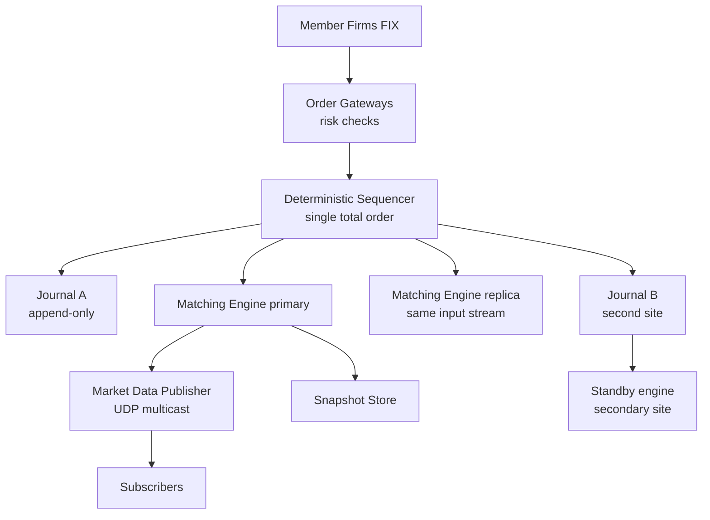
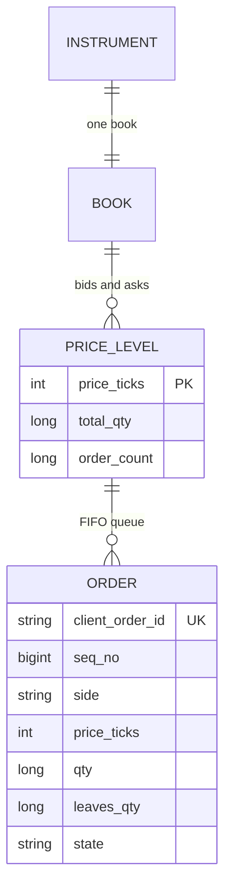
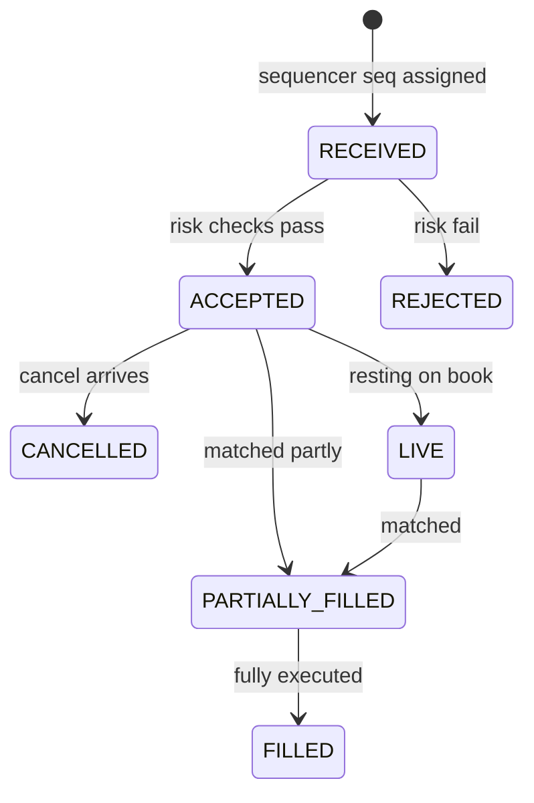

# Case Study: Design a Stock Exchange Matching Engine

## Overview

Designing an exchange is the canonical "correctness + latency" interview: you must maintain a fair order book under price-time priority, guarantee that no order is lost or double-executed, and do it inside a tens-of-microseconds budget. This page walks the full 45-minute design: requirements → latency budget → sequencer-based architecture → order book data structures → deterministic recovery → disaster recovery. It complements the concept overview in [Design a Stock Exchange](../stock-exchange.md); here the emphasis is the *interview-grade reasoning*: why a deterministic sequencer replaces locks, why exactly-once is an illusion you engineer around, and how a secondary site achieves RPO=0.

## Step 1 — Requirements

### Functional

- Accept limit, market, and cancel orders from member firms (FIX protocol) and retail brokers
- Match orders under strict **price-time priority**; emit execution reports
- Publish market data: trades, best bid/ask (L1), depth (L2), full book (L3)
- Enforce pre-trade risk checks (buying power, fat-finger bounds, self-trade prevention)
- Support trading halts and auction states (opening/closing auctions)

### Non-Functional

- **Latency**: wire-to-wire < 50 µs p50, < 200 µs p99 (modern venues); matching decision itself < 5 µs
- **Throughput**: 500K messages/s peak per venue; 1M+ msg/s across instruments
- **Durability**: zero order loss; every accepted order replayable after a crash
- **Fairness**: one total order of events; no reordering under any failure
- **Availability**: 99.999% during trading hours, with a secondary site for disaster recovery
- **Determinism**: replaying the same inputs in the same order yields the same outputs, bit-for-bit

The determinism requirement is the one candidates miss. It is what makes recovery, replication, and dispute resolution possible at all.

## Step 2 — Back-of-Envelope Estimation

| Quantity | Assumption | Result |
|---|---|---|
| Peak order flow | 500K msgs/s (orders + cancels) | 2M msgs over a 4s burst |
| Instruments | 10K symbols, skew: top 100 symbols take 60% | Shard by symbol, 8–16 engines |
| Execution reports + market data out | 5× inbound (every event re-published) | ~2.5M msgs/s egress |
| Market data subscribers | 500K downstream connections (broker aggregators) | Fan out via UDP multicast + ABI feeds |
| Journal write rate | Every message journaled pre-match | 500K appends/s, sequential, ~100B avg |
| Journal bandwidth | 500K × 100B | ~50 MB/s per active engine — trivial for NVMe |
| Snapshot size | Full book per symbol ~1–10 MB | Snapshot every 100K msgs; replay gap < 1 s |

The lesson to voice: matching is *not* a big-data problem. A single modern core with cache-friendly data structures processes millions of decisions per second; the hard parts are ordering, durability, and recovery latency.

## Step 3 — Latency Budget (the answer interviewers want drawn)

| Hop | Budget | Technique |
|---|---|---|
| NIC → application | 2 µs | Kernel bypass (Solarflare/DPDK), busy-poll cores |
| Gateway validation + risk | 1 µs | Pre-compiled checks, no syscalls on hot path |
| Sequencer stamp + forward | 1 µs | Lock-free ring buffer, L1-hot structures |
| Match decision | 3 µs | Array-based book, no pointers, no allocation |
| Outbound encode + NIC | 2 µs | Pre-allocated templates, Aeron/UDP multicast |
| **Total wire-to-wire** | **~10–20 µs p50** | GC-free, single-threaded per instrument |

State the trade-off explicitly: every microsecond bought by kernel bypass and busy-polling is paid in CPU burn and operational fragility. For a retail-focused venue, 200 µs p99 over a standard Linux stack may be the right economic answer.

## Step 4 — API Sketch

Member connectivity is FIX; internal APIs are binary. Show FIX fluency, then abstract.

```text
# NewOrderSingle (FIX 4.4, abbreviated)
8=FIX.4.4 | 35=D | 49=MEMBER1 | 56=EXCHANGE | 11=CLORD-991 |
55=AAPL | 54=1 | 44=150.00 | 38=100 | 40=2 | 59=1

# ExecutionReport
8=FIX.4.4 | 35=8 | 37=SEQ-1048573 | 11=CLORD-991 | 17=EXEC-7781 |
150=0 | 39=1 | 14=40 | 151=60 | 31=150.00 | 32=40

# Cancel (35=F) keyed by OrigClOrdID; response carries both IDs
```

Internal/retail JSON variant (what you'd actually sketch):

```text
POST /orders        { symbol, side, qty, type, limit_price, client_order_id }
DELETE /orders/{client_order_id}
GET  /instruments/{symbol}/book   → { bids[10], asks[10], seq }
WS   /market-data/{symbol}        → incremental diffs, each tagged with seq
```

Two rules to call out: `client_order_id` is the idempotency key (resubmission after disconnect returns the original execution report, never a duplicate order), and every outbound message carries a monotonically increasing sequence number per channel so subscribers detect gaps.

## Step 5 — Architecture: Gateway → Sequencer → Engine



Why a sequencer instead of locks? A lock-free book still needs a *total order* of order arrivals to be fair and replayable. The sequencer is a single-threaded stage that stamps each inbound message with a gap-free sequence number and writes it to journals (site A and site B) before the engine consumes it. The matching engine becomes a pure state machine: `f(book, ordered msgs) = new book + outputs`. Recovery is "load snapshot, replay journal," and the replica on the second site processes the identical stream, making failover a sequence-number handoff rather than a state merge.

**What the interviewer is probing:** "Can't the gateways send directly to the engine?" They can — but then fairness depends on NIC arrival order, which is unreproducible under retransmit. The sequencer makes the *input order itself* the durable artifact, which is what makes exactly-once order state tractable.

## Step 6 — Data Model: The Order Book as Tree/Array Hybrid



The classic answer is "balanced tree (e.g., std::map price → queue)." That is O(log P) per insert with pointer chasing and cache misses on every hop. The interview-winning structure exploits the tick grid:

- **Price level array**: since prices are quantized to ticks, index levels by `(price − min_price) / tick_size` into a flat array. Insert/lookup/cancel-best are O(1) array indexing
- **Bitmap of non-empty levels** (or a small tree over ranges) to find the best bid/ask in O(1) via `__builtin_clz`-style scans; only *iterate* a tree when the price range is huge
- **Intrusive doubly-linked FIFO** per level for time priority; cancel = O(1) unlink via stored node pointer

| Structure | Insert | Best-price | Cancel | Cache behavior | Use |
|---|---|---|---|---|---|
| Balanced tree (map) | O(log P) | O(log P) | O(log P) | Pointer chasing, misses | Small books, quick prototype |
| Heap of levels | O(log P) | O(1) | O(n) find | Ok for bids/asks split | Rarely — cancels hurt |
| **Array + bitmap + FIFO lists** | O(1) | O(1) | O(1) | Contiguous, prefetch-friendly | Production engines |

Ask about the trade-off you accept: the array is sized by the price band (e.g., ±20% around reference price = 80K ticks × 16B ≈ 1.3 MB per side, fits L2/L3); books with unbounded price ranges fall back to the tree. This is exactly the "hybrid" the question is fishing for.

## Deep Dive — Exactly-Once Order State

Distributed systems give you at-least-once delivery and deduplication; you assemble "exactly-once" from idempotency + sequence numbers (see [Messaging Semantics](../hld/messaging-systems.md) and Kafka's delivery notes at https://kafka.apache.org/documentation/):



Mechanics to present:

- **Inbound dedup**: `client_order_id` unique per session; a re-sent NewOrderSingle with an existing ID returns the current state (a no-op), never a second order
- **Outbound exactly-once semantics**: every execution report carries the engine's sequence number; the gateway keeps the last acked seq per member and re-drives on reconnect; transport retries are safe because state transitions are keyed
- **Cancel semantics**: cancel of a fully-filled order returns "too late to cancel" with the fill attached — *not* an error. This detail signals production experience
- **Crash window**: sequencer journals before the engine consumes, so a crashed engine replays the exact suffix; a crashed *sequencer* fails over to its replica which resumes at the last journaled seq (RAFT-style leader election is acceptable at ~50 ms failover; see https://raft.github.io/)

## Deep Dive — Disaster Recovery: The Secondary Site

| Strategy | RPO | RTO | Complexity | Notes |
|---|---|---|---|---|
| Nightly snapshots | Hours | Hours | Low | Not acceptable for a venue |
| Async journal shipping | Seconds–minutes | Minutes | Medium | Loses recent orders on site loss |
| **Sync journal to site B (sequencer fanout)** | 0 | Seconds–minutes | Medium | The production pattern |
| Active-active dual matching | 0 | 0 | Very high | Split-brain = two truths; usually rejected |

The right answer for an interview: **one sequencer, synchronous journal writes to both sites, warm standby engine at site B replaying continuously**. Failover = standby promotes at `seq = N`, members reconnect and resync from seq N. Run a weekly game-day that forces failover mid-session; an untested DR plan is a rumor. Also decide the ugly questions up front: orders in flight at failover are *rejected* with "session resync required," because silent re-execution across a failover boundary is how double fills happen.

**What the interviewer is probing:** split-brain. If site B's sequencer can also accept orders, you can get two divergent books. Answer: only one site is ever primary; the journal is the arbiter; promotion requires fencing the old site (a gateway-level firewall rule, not a polite message).

## Bottlenecks & Follow-Up Questions

- **Hot symbol skew** (one index future takes 40% of flow): follow-up: "Can you shard more?" → Per-instrument engines for the top-N, batch sharding for the tail; a single instrument is inherently serial — that is the fairness contract
- **Market data fanout**: 2.5M msgs/s to 500K subscribers; follow-up: "TCP fanout won't survive" → UDP multicast with A/B feeds + gap recovery via retransmit servers (ARQ sidecar), the NASDAQ/MEF pattern
- **Journal fsync on hot path**: group commit (journal a batch per 20 µs window) trades a few µs of exposure for 10× throughput; state the failure window you accept
- **Auction/halt transitions**: state machine per instrument extends the book model; follow-up: "What happens to resting orders in a halt?" → Held in book, auctions run on reopening
- **Clock/timestamps**: determinism means *event time* = sequencer order, never wall clock; wall-clock stamps are metadata for regulators, not ordering inputs

## Interview Questions

1. **Why is the matching engine single-threaded, and how does it scale?** One thread per instrument (or per shard) eliminates locks, makes execution deterministic, and keeps the book cache-resident; a modern core does millions of decisions/s. Scale comes from sharding by symbol — instruments never interact — and from offloading everything else (risk, FIX decoding, fanout) to other cores. Vertical scaling beyond one instrument's flow is physically meaningless because a single instrument's events are inherently sequential.
2. **How do you achieve exactly-once order processing if the network duplicates messages?** You don't get it from the transport. Inbound: dedup on `client_order_id` per session so re-sent orders are no-ops returning current state. Outbound: sequence-numbered reports with gateway-side resync on reconnect. The sequencer's journal is the tie-breaker: any ambiguity resolves by replaying from the last acked sequence. Exactly-once is assembled from idempotency + total order, never assumed.
3. **Defend the array+bitmap order book versus a red-black tree.** Prices live on a fixed tick grid, so a level's index is arithmetic, not a search. Array indexing is O(1) with contiguous memory; the bitmap of non-empty levels finds best bid/ask with a CLZ instruction; cancels are O(1) intrusive list unlinks. The tree only wins when the price range is unbounded or ticks are dense — so keep a tree fallback for those instruments. The trade-off is ~1–2 MB of per-side memory per book, which is cheap.
4. **What is RPO and RTO for your DR design, and what breaks during failover?** Synchronous journal fanout to site B gives RPO=0 for *accepted* orders; RTO is seconds-to-minutes for the standby to promote at the last journaled sequence. In-flight, not-yet-journaled orders are lost and must be re-sent — members see "session resync required." The failure mode to prevent is split-brain: only the journaled site can be primary, and the old primary is fenced at the gateway.
5. **An HFT member claims they were jumped in the queue. How does your design arbitrate?** The sequencer's journal is the total order: replay the sequence range for that instrument and the book states reproduce bit-for-bit, showing the arrival order of both orders. Determinism turns a dispute into a deterministic replay, which is the real reason the sequencer exists.
6. **Why journal before matching rather than after?** If you journal outcomes only, a crash between match and persist can emit fills you cannot reproduce or lose fills members already saw. Journalling inputs pre-match makes the engine a deterministic function of the journal — recovery is mechanical, replicas stay identical, and regulators can replay any day exactly.

## Key Takeaways

- Matching is a latency and ordering problem, not a big-data problem: one cache-resident core per instrument sharded by symbol
- A deterministic sequencer converts fairness, replication, recovery, and auditability into one mechanism: a totally ordered, durable input stream
- The order book wants a tree/array hybrid: tick-indexed arrays + bitmaps for O(1) best-price, intrusive FIFO lists for time priority
- Exactly-once is engineered: idempotent client order IDs inbound, sequence numbers outbound, journal replay as the arbiter
- DR is synchronous journal fanout to a warm standby site — RPO=0, honest RTO, fenced promotion to kill split-brain
- Wall-clock time is metadata; the only ordering time in the system is the sequencer's sequence number

## References

- FIX Trading Community — FIX protocol specifications: https://www.fixtrading.org/
- Raft consensus site and extended paper (failover of the sequencer/leader): https://raft.github.io/ and https://raft.github.io/raft.pdf
- etcd raft library — production state-machine replication: https://github.com/etcd-io/raft
- Aeron — open-source low-latency messaging used in trading systems: https://github.com/aeron-io/aeron
- LMAX Disruptor — ring-buffer concurrency behind the sequencer pattern: https://lmax-exchange.github.io/disruptor/
- Jepsen analyses — what "exactly-once" claims survive partitions: https://jepsen.io/analyses

## Cross-References

- [Design a Stock Exchange (overview)](../stock-exchange.md) — the concept-level companion to this case study
- [Design: Banking Ledger](../banking-ledger.md) — the settlement side: double-entry, idempotent money movement
- [Consistency Patterns](../consistency-patterns.md) — the linearizability/determinism vocabulary this page leans on
- [Real-World: Order Management](../real-world/order-management.md) — OMS/EMS view of the same order lifecycle
- [Case Study: Live Auction Platform](./live-auction.md) — matching money to bids at human, not microsecond, timescales
- [HLD: Messaging Systems](../hld/messaging-systems.md) — delivery semantics vocabulary (at-least-once → exactly-once illusion)
- [Concurrency: Actor Model](../../../concurrency/actor-model-deep.md) — why serial ownership beats shared-state locking
