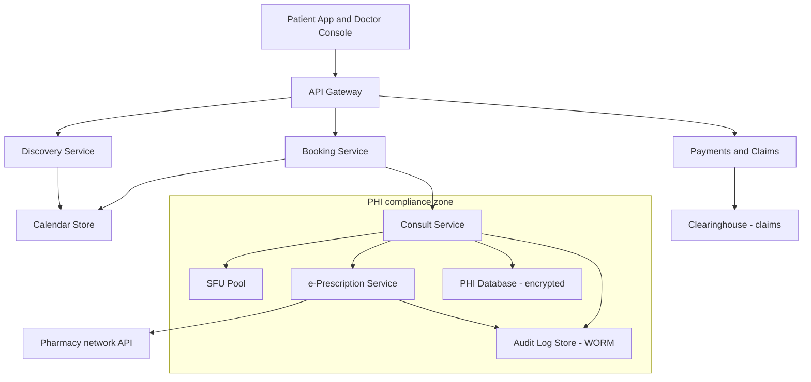
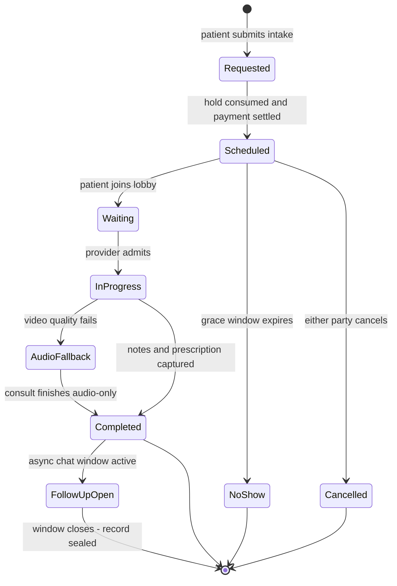

# Case Study: Design a Telehealth Consultation Platform

## Overview

This is the 45-minute walkthrough for designing a telemedicine platform: patients discover verified doctors, book against availability calendars with hold windows, join a WebRTC video consult, receive a digitally signed e-prescription that a pharmacy fulfills, and continue asynchronously over chat — all under PHI/HIPAA-style compliance obligations that shape the architecture more than raw scale does. Unlike a consumer video app, the interesting tensions are regulatory (who may read a consult record, and how you prove it), workflow (a doctor's calendar is scarce inventory), and media (a 2-party call where quality is a clinical requirement, not a nicety). Expect this as a healthcare-flavored system-design round or as the follow-up when an interviewer asks "how does your design change if the data is medical records?"

## Step 1 — Requirements

### Functional

- **Doctor discovery**: search/filter verified providers by specialty, language, availability, price, and rating; provider profiles carry credentials and license status
- **Availability calendars**: providers publish recurring and ad-hoc availability; patients book, reschedule, and cancel slots with a hold window during checkout
- **Video consult room**: scheduled and on-demand consults join a private room with lobby control, reconnect-on-drop, and an audio-only fallback
- **e-Prescription**: the provider composes a prescription during the consult, signs it digitally, and the platform transmits it to a patient-chosen pharmacy for fulfillment
- **Async follow-ups**: a bounded post-consult chat window per appointment for clarifications and photo updates
- **Payments & claims**: self-pay at booking (copay or full fee), plus insurance eligibility checks and claim submission hooks for covered consults
- **Records**: consult notes, vitals, attachments, and prescriptions stored as structured records (FHIR-style resources) accessible to the patient

### Non-Functional

- **Privacy/compliance**: PHI is encrypted in transit and at rest, every access is audit-logged, subprocessors are under BAA, and access is least-privilege and patient-scoped — this is a design constraint, not a checkbox
- **Media quality**: < 150 ms one-way mouth-to-ear latency (ITU-T G.114 target), < 1% audio loss, jitter < 30 ms; a call that sounds bad is a failed consult regardless of backend health
- **Scale**: 2M monthly active patients, 60K verified providers, 200K consultations/day, ~10K concurrent consults at evening peak — modest versus consumer media, but every session is revenue and clinical record
- **Availability**: 99.95% for booking and records; 99.99% for the media path during clinic hours — a canceled consult costs a patient's day
- **Auditability**: 6-year immutable access logs (HIPAA documentation retention), queryable by patient, provider, and incident investigator
- **Latency**: booking confirm < 500 ms p99; e-prescription signed and transmitted < 5 s after provider sign-off

## Step 2 — Back-of-Envelope Estimation

| Quantity | Assumption | Result |
|---|---|---|
| Consult starts | 200K/day over 14 clinic hours | ~4K consult starts/hour; evening peak 3–5× |
| Concurrent consults | 10K peak × ~12 min avg duration | churn of ~1.4K sessions/min at peak |
| Media egress | 10K consults × 2 participants × 2.5 Mbps (720p) | ~50 Gb/s SFU fleet egress |
| TURN relay share | ~15% of sessions behind symmetric NATs | 1.5K relayed sessions; ~7.5 Gb/s relay egress |
| Signaling | 2 joins/consult + heartbeats ×1/s | ~3.3K msg/s peak — signaling is tiny; media is not |
| Chat follow-ups | 3 messages per consult × 200K | 600K messages/day — a small [chat system](../real-world/chat-system.md) bolted on |
| e-Prescriptions | 70% of consults | 140K/day; each 2–5 KB signed payload |
| Recordings | 20% recorded with consent × 12 min × 2.5 Mbps | ~450 GB/day to object storage |
| Audit log | 10 PHI reads/consult × 200K + admin ops | ~2M+ events/day, append-only, 6-year retention |

The reframe that scores points: at this scale the *media plane* is the biggest pipe but a solved problem (buy or reuse an SFU fleet — see [Video Conferencing](./video-conferencing.md)), while the *hard design work* is the compliance zone: PHI storage, audit trails, e-signature legality, and vendor management. Capacity planning for media is straightforward math; the differentiator is the record/access model (see [Capacity Planning](../hld/capacity-planning.md)).

## Step 3 — API Sketch

```text
Discovery and booking:
  GET  /v1/providers?specialty=&language=&date=&price=   -> { providers[] }          pseudonymized profiles
  GET  /v1/providers/{id}/slots?from=&to=                -> { slots[]: { slot_id, start, status } }
  POST /v1/appointments             body: { slot_id, hold_key }          -> { hold_id, expires_at }  10-minute hold
  POST /v1/appointments/{id}/confirm  body: { hold_id, payment_intent }   -> { appointment_id, room_token }

Consult room:
  POST /v1/rooms/{room_id}/join     -> { ws_signaling_url, ice_servers, token }   short-lived room token
  WS   signaling: SDP offer/answer + ICE candidates + lobby + reconnect protocol

Records and prescriptions:
  GET  /v1/encounters/{id}          -> FHIR resource bundle (per-resource authz)
  POST /v1/encounters/{id}/prescriptions  body: { rx_lines[], pharmacy_id }  -> { rx_id }
  POST /v1/prescriptions/{rx_id}/sign   body: { signature }                 -> { status: transmitted }
```

Decisions worth stating out loud: discovery runs on pseudonymized profiles so the edge never sees a diagnosis before a consult exists; the room join response carries everything the client needs (signaling URL, ICE server list including TURN credentials, scoped token) in one round trip; and prescription signing is a separate endpoint from composition because the signature is a legal act by the provider, not an application state change. Every endpoint that can return PHI sets `Cache-Control: no-store` — intermediaries are not trusted with medical data.

## Step 4 — Doctor Discovery and Availability Calendars

### Calendar model

Availability is generated availability: providers define recurring weekly templates (`Mon 09:00–13:00, 15-min slots`) plus exceptions (vacation, blocked slots), and the materializer expands templates into concrete slot rows for a rolling 30-day window. The authoritative store is a slot table keyed `(provider_id, start_time, status, version, timezone)`; status moves `open → held → booked → completed` with the same conditional-update discipline as any inventory problem (see [Real-World: Airline Reservation](../real-world/airline-reservation.md) for the family of no-double-booking designs). Timezones are stored once, in UTC, with the provider's IANA zone attached — daylight-saving bugs in a clinic calendar mean a patient shows up an hour late. Slots are searched from a read-optimized projection (Elasticsearch or a materialized table by `specialty × date`) refreshed via change events; the booking API remains the only writer of truth.

```text
provider           id, name_hash, specialty, languages[], license_no, license_verified_at
availability_rule  id, provider_id, weekday, start_local, end_local, slot_minutes, tz
slot               id, provider_id, start_utc, minutes, status, version, hold_id NULL, hold_expires NULL
appointment        id, slot_id, patient_pseudonym, status, intake_ref, payment_intent_id,
                   room_id, no_show_policy_version
degree_of_skew     none: unique partial index on slot(provider_id) WHERE status IN held,booked
```

The `slot.status` invariant (one held/booked row per physical slot) is enforced by a partial unique index, not application logic; the `hold_id` + `hold_expires` pair makes an abandoned checkout a sweeper problem instead of a stuck calendar.

### Search ranking and provider quality

Discovery is not a neutral list: ranking blends availability-soonest, price, match on specialty and language, and outcomes data (completion rate, no-show rate, post-consult satisfaction), and every provider profile displays verification status — license checked against the registry at onboarding and re-verified on a rolling schedule. Two fraud-adjacent rules shape ranking: a suspended license must remove a provider from search within minutes (a change event, not a nightly job), and ratings are only computed from completed, paid consults to prevent review-bombing. The search index is a pure read projection; a re-rank experiment is a re-index, never a rewrite of calendar data, which keeps experimentation and correctness concerns separated.

### Booking with hold windows

Booking is a two-phase checkout: `POST /appointments` places a **10-minute hold** (conditional update `WHERE status='open'`, returning `hold_id, expires_at`), the patient completes intake forms and payment, and `POST /appointments/{id}/confirm` consumes the hold. Abandoned holds are reclaimed by a sweeper every minute — the hold TTL, the payment timeout, and the sweeper cadence must agree, or calendars and money drift apart (same coupling as the hold/pay dance in [Ticketmaster](./ticketmaster.md)). Providers overbook defensively because no-shows run 10–20% in telehealth; the platform supports a policy-level overbook factor per provider (e.g., sell 105% of slots) with automatic rebooking offers when a session overruns. Reschedule is implemented as cancel-and-hold-new atomically within one transaction so a patient never loses the old slot while failing to win the new one.

## Step 5 — Video Consult Room (WebRTC, SFU Reuse)

The room is a standard WebRTC deployment: browsers exchange **SDP offers/answers over a signaling channel** (authenticated WebSocket carrying short-lived room tokens), gather ICE candidates with STUN, and fall back to a TURN relay when symmetric NATs block direct paths — roughly 10–20% of consumer sessions in practice. Media is encrypted end-to-end at the transport layer via **DTLS-SRTP** (DTLS key negotiation per [RFC 9147](https://datatracker.ietf.org/doc/rfc9147/), SRTP packet protection per [RFC 3711](https://datatracker.ietf.org/doc/rfc3711/)), so the SFU forwards ciphertext it cannot read. The [W3C WebRTC specification](https://www.w3.org/TR/webrtc/) and [RFC 8825](https://datatracker.ietf.org/doc/rfc8825/) define the browser-side contract; [hpbn.co](https://hpbn.co/) remains the best performance-oriented walkthrough of the stack.

| Topology | Bandwidth per client | Server cost | Use when |
|---|---|---|---|
| Mesh (P2P) | N−1 upstreams — fine at 2, painful at 5+ | ~none | 1:1 calls only, no recording/simulcast needs |
| SFU (selective forwarding) | 1 upstream, N−1 downstream | egress ≈ N×1 stream | default for consults; enables recording, simulcast, active-speaker layout |
| MCU (mixing/transcoding) | 1 upstream, 1 downstream | transcode CPU per session | legacy devices or forced uniform layouts; 10–20× CPU of SFU |

**SFU reuse rationale**: a 2-party consult gains nothing in fan-out from an SFU, but the room service still routes media through an SFU pool for three reasons — recording (with consent) and active-speaker analytics happen server-side; group consults (patient + family member + interpreter + specialist, 4–6 participants) are a product requirement that mesh cannot serve; and centralized media makes TURN, simulcast, and congestion-control telemetry operable. The SFU pool is stateless with respect to sessions (session state lives in the room service + Redis), so a failed SFU means a client reconnect — the consult state machine records a drop/reconnect transition, and reconnection targets a *new* SFU while the conversation continues. Open-source references for building or boundary-testing the media tier: [Jitsi](https://jitsi.org/) and [mediasoup](https://mediasoup.org/). The deep SFU internals (forwarding, simulcast layers, congestion control) are the subject of the sibling page [Video Conferencing](./video-conferencing.md); this page treats the SFU fleet as a reusable component.

Quality is an SLO, not a hope — the room service consumes per-session WebRTC stats (client `getStats()` piped to the metrics pipeline) and acts on them:

| Signal (per session) | Target | Automatic action on breach |
|---|---|---|
| Audio packet loss | < 1% | enable FEC/RED, drop video layers, then audio-only prompt |
| Jitter | < 30 ms | step down simulcast layer; renegotiate encoder bitrate |
| Round-trip time | < 300 ms | prefer lower-resolution/higher-fps tradeoff |
| Reconnect events | < 2% of sessions | re-home to a different SFU in the pool |
| Audio-fallback rate | < 3% per region | capacity and client-default review (SLA dashboard) |

## Step 6 — e-Prescription Workflow

### Composition and digital signatures

During the consult the provider composes a prescription against a drug database (RxNorm-coded drugs and interactions from the [U.S. National Library of Medicine](https://www.nlm.nih.gov/research/umls/rxnorm/)); the platform checks formulary and interaction rules client-side and server-side. On sign-off, the prescription payload (patient, provider, drug codes, dose, quantity, refills, pharmacy) is **canonically serialized and signed with the provider's non-repudiation certificate** — a JSON Web Signature per [RFC 7515](https://datatracker.ietf.org/doc/rfc7515/) over the canonical payload, plus a human-readable PDF rendered with the same signature embedded (PAdES-style, per ETSI EN 319 142 — cited by title/venue). The signature proves *who* prescribed, *what* was prescribed, and that neither changed in transit — which is the legal substance of a prescription. Controlled substances add jurisdiction-specific requirements (identity-proofed prescribers, hardware-token signing, e.g., the U.S. EPCS regime — cited by title/venue); the design keeps a per-substance signing-policy table rather than hard-coding rules.

### Pharmacy fulfillment and hooks

The signed prescription is transmitted to the patient's chosen pharmacy via an e-prescribing network (NCPDP SCRIPT message standard — cited by title/venue) or delivered to the patient as a verifiable document for offline pharmacies. Fulfillment status flows back through webhooks: `received → in_fulfillment → ready → picked_up | rejected`, surfaced to the patient's appointment timeline. The pharmacy integration is a classic third-party boundary — flaky webhooks, duplicate deliveries, unknown failure modes — so every status update is idempotent by `(rx_id, event_id)` and reconciled by nightly polling against the network (the same pattern as any payment-webhook integration in [Payment System](../payment.md)). Refill requests and renewals re-enter the platform as async requests routed to the original provider's queue, which is where the follow-up chat and scheduling systems close the loop.

## Step 7 — PHI Compliance Zone (HIPAA-Style)

The compliance requirement is architecturally productive if you treat it as a *zone* rather than a checkbox: a bounded set of services that touch PHI, with every entry and exit controlled, logged, and encrypted.



| Control | Mechanism | Notes |
|---|---|---|
| Encryption in transit | TLS 1.2+ on every API path; DTLS-SRTP for media | no exceptions, including internal service-to-service (mTLS) |
| Encryption at rest | AES-256 with envelope keys via KMS; field-level encryption for identifiers | per-environment keys; rotation without re-encrypting data (see [Cryptography](../../../security/cryptography.md)) |
| Access control | least-privilege, patient-scoped authorization; break-glass role with mandatory justification | providers access only patients with an active care relationship |
| Audit trails | append-only WORM store: who, what, when, which record, from where | 6-year retention (HIPAA documentation rule); queryable; fail-closed on write failure (see [Secrets Manager](./secrets-manager.md) for the fail-closed audit pattern) |
| Subprocessors | BAA signed before any PHI touches a vendor; PHI-touching service inventory maintained | SFU, cloud, e-prescribing network, clearinghouse all under BAA |
| Data minimization | discovery/booking run on pseudonymized profiles; PHI decrypted only inside the zone | a breach of the edge leaks little |
| Breach response | incident runbook mapped to 60-day notification duties | rehearsed, not just documented — see [Security Design](../hld/security-design.md) |

The HHS HIPAA portal (Privacy, Security, and Breach Notification Rules) is the normative reference for the U.S. regime (https://www.hhs.gov/hipaa/), and the Security Rule's administrative/physical/technical safeguards map directly onto the table above (https://www.hhs.gov/hipaa/for-professionals/security/index.html). EU deployments add GDPR duties (lawful basis, data-subject rights, residency) under [Regulation 2016/679](https://eur-lex.europa.eu/eli/reg/2016/679/oj). The interview-worthy nuance: **minimum necessary access** changes the data model — records are stored as FHIR resources (https://www.hl7.org/fhir/) with per-resource authorization, because "the doctor can read the chart" is too coarse when labs, notes, and prescriptions have different audiences.

Residency and region pinning complete the zone. Consult recordings, chat transcripts, and record storage are pinned to the patient's region, which turns the SFU fleet from a pure cost optimization into a compliance component — media relays never carry a consult across a residency boundary, and the room allocator filters eligible SFUs by region before capacity. Cross-border telehealth (a licensed provider in one country, a patient in another) is a policy table that maps license jurisdictions to allowed regions, and the booking flow enforces it before a slot is ever offered.

## Step 8 — Consult Lifecycle, Follow-Ups, Payments & Claims



Every transition has an owner and a business consequence: `NoShow` triggers the no-show fee policy and the provider's overbook accounting; `AudioFallback` is a *recorded quality event* feeding SLA dashboards, not a silent degradation; `Completed → FollowUpOpen` grants the provider a bounded window (e.g., 7 days) of async messaging whose transcripts append to the same clinical record — one consult, one record, multiple channels. The chat itself is a small, compliant slice of a messenger (see [Real-World: Chat System](../real-world/chat-system.md)): delivery receipts, offline queueing, and attachments scanned and stored inside the PHI zone. The follow-up window is also a triage valve: messages that exceed the clinical scope of a follow-up (new symptoms, medication changes) are converted by the provider into a new billed encounter, which keeps the record, the payment, and the liability aligned.

Payments split by payer type. **Self-pay** authorizes at hold time and captures at consult completion (a no-show triggers the policy fee — the same idempotent intent/capture discipline as any [Payment System](../payment.md)). **Insurance** is a three-hook pipeline: an eligibility check before booking (real-time benefit inquiry — the X12 270/271 transaction set, cited by title/venue), claim submission after completion (X12 837 professional claim to a clearinghouse), and remittance reconciliation (X12 835) that posts adjustments back to the ledger and triggers patient balance statements. Claims fail and correct constantly — the design goal is that every claim mutation is idempotent, versioned, and reconcilable, with a work queue for denial codes that maps to the platform's billing operations team.

```text
Claims pipeline endpoints (internal, behind the compliance zone):
  POST /claims/eligibility     body: { patient_insurance, cpt_code } -> { covered, copay, auth_required }
  POST /claims                 body: { encounter_id, diagnosis[], procedures[] } -> { claim_id, status: submitted }
  POST /claims/{id}/remittance body: { paid, adjustments[], denial_code? }       -> applied to ledger idempotently

Denial work queue: denial_code -> owner team -> correction action (resubmit, appeal, write-off)
Every mutation keyed by (claim_id, event_id); nightly 835 reconciliation is the backstop.
```

## Bottlenecks & Follow-Up Questions

- **Provider calendar contention**: top providers' evening slots sell out in seconds. Follow-up: "same CAS problem as tickets?" → yes, plus a fairness twist: triage-based priority (urgent-care slots) may legitimately outrank first-come ordering, so admission logic is policy-aware, not purely temporal
- **SFU regional egress cost**: media is 80%+ of the bill. Follow-up: "how do you cut it?" → audio-only downgrade by default for low-bandwidth clients, 540p cap for non-diagnostic consults, and regional SFU pools that keep traffic in-region (also a data-residency requirement, not just cost)
- **Audit log write failure**: compliance says fail-closed, availability says serve. Follow-up: "which wins?" → PHI reads fail closed; non-PHI booking flows continue — scope the failure domain to the records, not the platform
- **Webhook loss from pharmacy networks**: fulfillment status stalls. Follow-up: "how does the patient find out?" → nightly reconciliation polling per prescription and a bounded-status UI ("dispatched to network, confirming") instead of silent limbo
- **Cross-continuity**: patient switches from video to in-person clinic. Follow-up: "one record?" → the FHIR record store is the substrate; consult channels (video, chat, clinic) are modalities, and the state machine extends rather than forks
- **Recording consent**: 20% of consults recorded. Follow-up: "who owns deletion?" → patient-initiated deletion jobs sweep object storage and indexes within the compliance window, with tombstones in the audit log proving the deletion itself

## Interview Questions

1. **Why route a 2-person consult through an SFU when P2P mesh would use less infrastructure?** Because the SFU is not buying fan-out here — it is buying operability: server-side recording with consent, simulcast and congestion-control telemetry, TURN management behind a single component, and a clean upgrade path to 4–6 participant group consults (family member, interpreter, specialist) which mesh cannot serve without every client uploading N−1 streams. Mesh is also harder to make compliant: you cannot reliably record, audit, or region-pin media that flows directly between browsers. The bandwidth math (10K consults × 2 × 2.5 Mbps ≈ 50 Gb/s egress) is identical for both topologies at 2 participants, so you pay the same egress and get observability for free.
2. **How do you keep booking inventory, payment, and the calendar consistent when a payment fails mid-hold?** The hold is a TTL state, not a financial state: `POST /appointments` wins the slot conditionally (`status='open' → 'held'`, 10-minute TTL) and payment runs as an authorized-not-captured intent keyed by the hold ID. If payment fails, the hold expires and the sweeper reopens the slot; if payment succeeded but the confirm response was lost, the client retries confirm with the same hold ID and the idempotent handler captures the existing intent exactly once. The invariant is that slot status, payment state, and appointment state all derive from the same event log of transitions, and the sweeper reconciles any divergence within one TTL.
3. **What does HIPAA change in the architecture, concretely?** Five things: a PHI zone — a bounded set of services that touch identifiable data, with pseudonymized discovery/booking outside it; encryption everywhere — TLS in transit including mTLS internally, envelope-encrypted storage with field-level protection for identifiers; mandatory, immutable audit logging of every PHI access with 6-year retention and fail-closed semantics; BAA contracts with every subprocessor that could touch PHI (cloud, SFU, e-prescribing network, clearinghouse); and minimum-necessary access — per-resource authorization on FHIR-style records rather than coarse chart-level grants. The architectural lesson is that compliance, done early, produces a cleaner design: one audited zone beats PHI smeared across twenty services.
4. **Walk through making an e-prescription legally meaningful and pharmacy-deliverable.** The provider composes against coded drugs (RxNorm), the platform runs interaction/formulary checks, and on sign-off the canonical prescription JSON is signed with the provider's non-repudiation certificate (JWS over the canonical payload; PAdES-style signature embedded in the rendered PDF). The signed payload is transmitted to the pharmacy through an e-prescribing network (NCPDP SCRIPT), and fulfillment status returns via webhooks that are idempotent by `(rx_id, event_id)` and reconciled by nightly polling. Controlled substances add identity-proofed, hardware-token signing per jurisdiction — handled by a signing-policy table, not bespoke code paths.
5. **A patient's video quality collapses mid-consult in a rural area. What does the system do, automatically?** The client and SFU have been negotiating all along — simulcast layers and congestion control drop to 540p, then the room service offers an audio-only fallback which the provider accepts with one tap, and the consult state machine records `InProgress → AudioFallback` as a quality event. If the audio also fails, the consult is parked with a rejoin token valid for the slot's remainder and both parties get a rebooking credit per policy. The design point is that degradation is a *modeled state*, not an error: clinicians are trained on the fallback, and the SLA dashboard tracks fallback rates by region so capacity and client defaults are tuned from evidence.
6. **How would you price/plan capacity for the media fleet versus the rest of the platform?** Media dominates egress math: 10K concurrent consults at 2.5 Mbps × 2 participants ≈ 50 Gb/s, plus ~15% TURN relay overhead — that is a fleet of SFU nodes with predictable, linear scaling and the unit economics of bandwidth, not compute. Everything else (booking, records, chat, eRx) is a few thousand RPS of ordinary request/response load that fits a modest service tier. The planning insight is that the two planes fail and scale independently — media needs regional pools and graceful degradation, while the transactional plane needs correctness and audit — so they are separate failure domains with separate on-call stories.

## Key Takeaways

- Split the design into planes: media (SFU fleet, degradation modes), transactions (booking, payments, eRx), and records (FHIR-style, per-resource authorization) — they scale and fail independently
- Availability calendars are inventory with policy: conditional-update holds, TTL agreement across hold/payment/sweeper, and provider-level overbooking for no-show economics
- The SFU is reused in 2-party consults for recording, telemetry, TURN, and group-consult headroom — not for fan-out; mesh cannot make media compliant or extensible
- e-Prescriptions are legal artifacts: canonical payload + provider non-repudiation signature (JWS/PAdES), transmitted via e-prescribing networks with idempotent, reconciled webhook status
- Treat HIPAA as a zone, not a checkbox: pseudonymized edge, encrypted and audited core, BAA'd subprocessors, break-glass with justification, fail-closed audit writes
- Consult degradation (audio fallback, reconnect, rebooking credit) is a modeled state machine transition with business consequences, not an exception path
- Insurance is a pipeline of idempotent, reconcilable hooks (eligibility → claim 837 → remittance 835) with a denial-code work queue, not a payment-gateway clone

## References

- W3C — WebRTC 1.0: Real-Time Communication Between Browsers (normative browser API): https://www.w3.org/TR/webrtc/
- IETF RFC 8825 — Overview: Real-Time Protocols for Browser-Based Applications: https://datatracker.ietf.org/doc/rfc8825/
- IETF RFC 3711 — SRTP (secure real-time transport): https://datatracker.ietf.org/doc/rfc3711/
- IETF RFC 9147 — DTLS 1.3 (WebRTC key negotiation): https://datatracker.ietf.org/doc/rfc9147/
- IETF RFC 8445 — ICE (candidate connectivity establishment/TURN fallback context): https://datatracker.ietf.org/doc/rfc8445/
- High Performance Browser Networking (I. Grigorik) — WebRTC, signaling, and media performance: https://hpbn.co/
- HHS — HIPAA Privacy, Security & Breach Notification Rules (normative U.S. reference): https://www.hhs.gov/hipaa/
- HHS — HIPAA Security Rule guidance for professionals: https://www.hhs.gov/hipaa/for-professionals/security/index.html
- HL7 FHIR — structured clinical records standard: https://www.hl7.org/fhir/
- U.S. National Library of Medicine — RxNorm (drug vocabulary for prescribing): https://www.nlm.nih.gov/research/umls/rxnorm/
- EU Regulation 2016/679 (GDPR) — EUR-Lex consolidated text: https://eur-lex.europa.eu/eli/reg/2016/679/oj
- Jitsi — open-source WebRTC platform (SFU reference implementation): https://jitsi.org/
- mediasoup — open-source SFU library: https://mediasoup.org/
- Cited by title/venue only (no stable URL): ITU-T G.114 (one-way latency target); NCPDP SCRIPT (e-prescribing messages); X12 270/271, 837, 835 (eligibility, claim, remittance transactions); ETSI EN 319 142 (PAdES); U.S. DEA EPCS (controlled-substance e-prescribing)

## Cross-References

- [Case Study: Video Conferencing](./video-conferencing.md) — the WebRTC/SFU internals deep dive this page builds on (present at build time)
- [Real-World: Chat System](../real-world/chat-system.md) — the async follow-up messaging slice and its delivery guarantees
- [Security: Cryptography](../../../security/cryptography.md) — envelope encryption, signatures, and key rotation behind the PHI zone
- [HLD: Security in System Design](../hld/security-design.md) — where the compliance zone, audit, and break-glass fit a broader security architecture
- [Design: Payment System](../payment.md) — authorize/capture discipline reused for copays, no-show fees, and claim reconciliation
- [Case Study: Secrets Manager](./secrets-manager.md) — the fail-closed audit-write pattern this platform borrows for PHI access logging
- [Real-World: Airline Reservation](../real-world/airline-reservation.md) — the no-double-booking calendar family this page applies to provider slots
