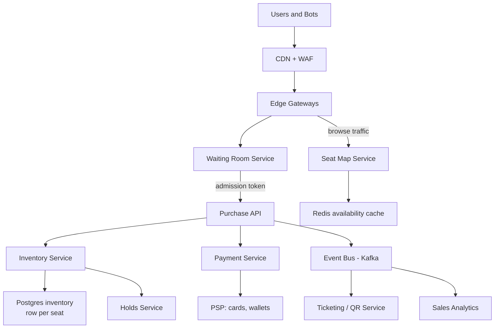
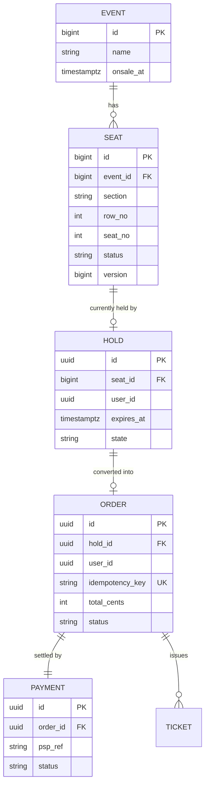
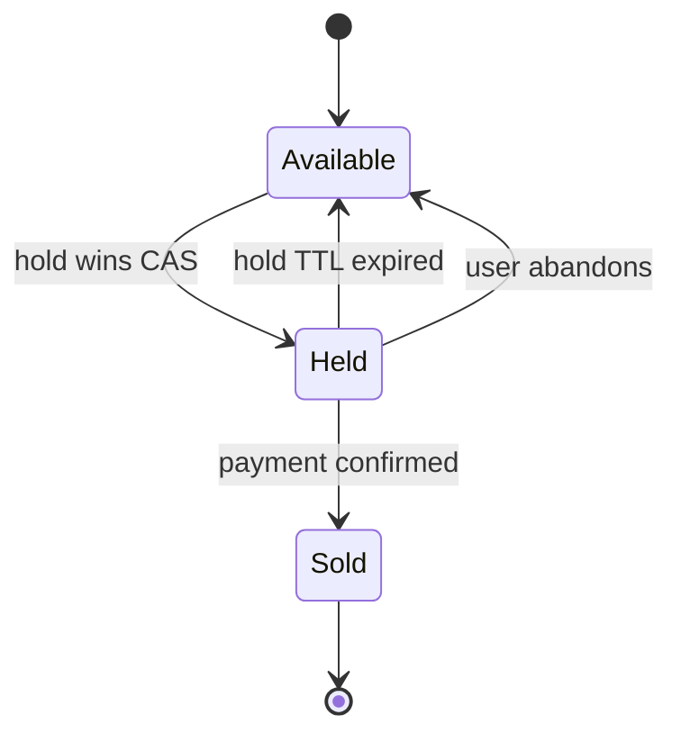
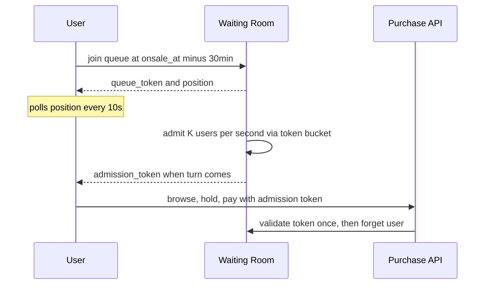
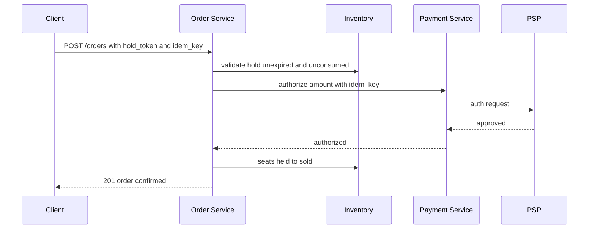

# Case Study: Design a Ticketmaster (Reserved Seating at Scale)

## Overview

This is the 45-minute walkthrough for designing a reserved-seating ticketing platform: inventory that can never oversell, a waiting room that absorbs a stadium-scale thundering herd, and payment flows where a 3-second duplicate click must not double-charge. Unlike [How Netflix Works](../real-world/netflix.md), which analyzes a running system, this page builds one from requirements on a whiteboard. The infamous Taylor Swift Eras Tour on-sale (November 2022) is the running hot-event example throughout: ~3.5 million Verified Fan registrants and 3.5 billion system requests, with bot traffic dwarfing humans.

## Step 1 — Requirements

### Functional

- List events with venues, seating maps (sections, rows, seats), and on-sale times
- Let a user select specific seats, hold them for a fixed window, then pay
- Prevent two users from ever being sold the same seat (hard invariant)
- Queue users before a hot on-sale opens (waiting room with fair admission)
- Cancel/refund; re-release seats from expired or abandoned holds
- Deliver digital tickets with rotating QR codes for venue entry

### Non-Functional

- **Correctness first**: zero oversell, ever. A delayed sale beats a double-sold seat
- **Scale**: 10M+ users attempting one hot on-sale; 15K+ events/year; ~200K tickets for a stadium event
- **Latency**: seat map interactions < 300 ms p99; checkout completion < 5 s p99
- **Hold window**: 7–10 minutes (industry standard checkout timer)
- **Availability**: 99.99% for the purchase path; degradation (queueing) is acceptable, overselling is not
- **Abuse resistance**: bots must not consume the fair-allocated quota

## Step 2 — Back-of-Envelope Estimation

Work the numbers for the hot event before drawing boxes.

| Quantity | Assumption | Result |
|---|---|---|
| Users arriving at on-sale | 10M over 30 min | ~5.5K joins/s |
| Concurrent users "in" the venue | 5% of arrivals persist | ~500K concurrent |
| Seat-map reads | 500K users × 1 request / 3 s | ~170K RPS reads |
| Seat-map payload | 200 KB (full map), 20 KB (section zoom) | ~30 Gb/s egress before caching |
| Hold creations | 500K users × 5% actually hold | ~25K holds/min ≈ 420 holds/s |
| Completed purchases | 200K seats sold in first hour | ~55 orders/s (bursty) |
| Live inventory rows | 200 concurrent on-sales × 20K seats | ~4M active seat rows |

The pattern to verbalize: **reads are 1000× writes**, so the seat map is a caching problem, while **writes concentrate on a few rows** (the best seats), so inventory is a concurrency-control problem. The two problems need different machines.

## Step 3 — API Sketch

```text
POST /v1/events/{id}/queue/join        → { queue_token, position_eta_s }
GET  /v1/events/{id}/queue             → { status, admission_token? }
GET  /v1/events/{id}/sections/{sec}    → seat map template + availability diff
POST /v1/events/{id}/holds             → { hold_token, expires_at }   body: seat_ids[]
POST /v1/orders                        → { order_id, status }         body: hold_token, idempotency_key
POST /v1/orders/{id}/cancel            → releases seats, triggers refund
```

Key API decisions worth stating out loud:

- `POST /orders` carries a **client-generated idempotency key**; retrying the same request returns the same order instead of double-charging (see [API Idempotency](../../../backend/api/api-idempotency.md) and RFC 9110 §9.2.2)
- Holds are resources with TTLs, not sessions: they expire server-side, so a crashed client never leaks inventory forever
- Seat availability for *browsing* is eventually consistent (cache); the hold endpoint is the only place that runs the atomic check

## Step 4 — High-Level Architecture



Browse traffic is served almost entirely from the CDN and the Redis availability cache. The only path that touches the authoritative inventory database is the hold/confirm API, and that is where every consistency dollar is spent.

## Step 5 — Data Model



`seat.status` is the state machine that matters: `available → held → sold → (void | released)`. The hold TTL and the payment timeout must be the same number; otherwise inventory and money drift apart.

## Deep Dive 1 — Seat Inventory: Never Oversell

The naive design ("check then update") has a read-modify-write race. Three candidates:

**1. Pessimistic row locking.** `SELECT ... FOR UPDATE` on the seat row inside a transaction, then flip status. Correct, but with 400 holds/s skewed toward the front rows, lock queues on the hottest seats serialize buyers and hold DB connections while the client "thinks."

**2. Optimistic versioned compare-and-swap.** Read `version`; attempt `UPDATE seats SET status='held', hold_id=?, version=version+1 WHERE id=? AND status='available' AND version=?`. Zero rows updated means someone else won; retry with a different seat or show "taken." No locks, no held connections — the database performs one atomic conditional write.

**3. Actor per section.** One in-memory actor owns a section's seat grid; holds are messages processed serially by that actor. This is the hot-event pattern: an Eras-tour section of ~500 seats fits in one actor's memory, decisions take microseconds, and the actor periodically snapshots and journals to durable storage for crash recovery (see [Actor Model Deep Dive](../../../concurrency/actor-model-deep.md)).



| Approach | Oversell-safe | Hot-row behavior | Recovery | Use when |
|---|---|---|---|---|
| DB row locks | Yes | Serializes on hot seats; connection pressure | DB WAL | Steady sales, low skew |
| Optimistic CAS | Yes | Failed retries, no blocking | Trivial — state lives in DB | Default for 90% of events |
| Actor per section | Yes — serial processing | In-memory, microsecond decisions | Journal + snapshot replay | Hot events, interactive seat maps |

The production answer is **hybrid**: optimistic CAS as the baseline inventory engine, promoted to an actor-per-section fast path for the handful of hot events flagged by the on-sale calendar. Both layers use the same state machine so the database remains the source of truth either way.

**What the interviewer is probing:** whether you reach for distributed locks immediately. A per-seat conflict is a *single-key* problem — a conditional UPDATE or a single actor is strictly safer and simpler than a Redis/etcd lease (see [Consistency Patterns](../consistency-patterns.md) and [Distributed Locks in Practice](../real-world/distributed-lock.md)).

## Deep Dive 2 — The Waiting Room

A hot on-sale is a deliberate thundering herd: 10M users, of which only ~2K seats/s can ever be sold. Letting everyone hit the seat map at t=0 melts the cache and the inventory DB. The waiting room converts a herd into a metered stream.



Design decisions to state explicitly:

- **Admission is a rate, not a rank.** Users are admitted roughly in arrival order with jitter; strict global ordering is not achievable at CDN edge with millions of connections
- **The queue must survive restarts**: position derives from a durable log of join events, not an in-memory list
- **Bots don't respect queues.** The 2022 Eras on-sale saw 3.5B bot requests; defenses are layered: verified-fan pre-registration tokens, device fingerprinting, behavioral signals at the edge, and per-user rate limits ([Rate Limiter](../rate-limiter.md))
- **Capacity ties to sell-through rate, not traffic**: admit users at the rate checkout can actually convert (~1–2K users/min), keeping concurrent in-checkout sessions near 100K

**What the interviewer is probing:** whether you notice that queueing *moves* load rather than removing it. The queue only works because downstream conversion is capped — otherwise it is a holding pen in front of the same fire.

## Deep Dive 3 — Payment Idempotency and the Hold/Pay Dance

Checkout is a distributed transaction across three systems (inventory, payments, ticketing) with a 7-minute fuse. The design that survives partial failure:

1. `POST /holds` → CAS wins, seats `held`, TTL 7 min, hold token returned
2. Client collects payment details, then `POST /orders` with `idempotency_key = hold_token` (one order per hold, ever)
3. Payment service records a `pending` intent keyed by the idempotency key, calls the PSP
4. On success: order `confirmed`, seats `sold`, tickets issued via Kafka event; on PSP timeout: poll with the same key, never re-submit
5. An expiry sweeper releases `held` seats whose TTL passed and voids any order still `pending`

The idempotency key must reach the PSP as well (most support client order references); a retry after a network partition then collapses to the same charge. Duplicate-charge cleanup is a reconciliation job, not a feature — the design goal is that it never fires.



**What the interviewer is probing:** what happens when "seats → sold" succeeds but the response to the client is lost. Answer: the client retries `GET /orders/{id}`, not `POST`; and the idempotency key makes even a blind `POST` retry safe. Partial-failure thinking is the actual test.

## Deep Dive 4 — Hot-Event Playbook (Taylor Swift Case)

| Lever | Mechanism | Effect |
|---|---|---|
| Pre-registered tokens | Verified-Fan-style registration gated by lottery + bot screening | Cuts bot share before the queue |
| Queue admission rate | Matched to checkout capacity (~1–2K users/min) | Keeps concurrent sessions bounded |
| Actor fast path | Section-level actors for top-N events | Microsecond hold decisions under skew |
| Seat map deltas | Push section-level diffs, not full maps | Egress drops ~100× |
| Isolated deployment | Hot event served by dedicated inventory shards | One event cannot melt general sales |

The honest numbers from the real Eras on-sale: ~3.5M Verified Fan registrants, 14M authenticated accounts (humans and bots) hitting the system, 3.5B requests over the sale window. No amount of horizontal scaling makes 3.5B human-with-credit-card requests true — the system must assume most traffic is hostile or idle, and meter everything.

## Bottlenecks & Follow-Up Questions

- **Front-row skew**: 90% of holds target 10% of seats. Follow-up: "Your best-section actor is 100% busy — now what?" → Shed to a waitlist for those sections, or split one section's seat space across two actors with disjoint seat ranges
- **Cache coherence**: availability diffs at 400 events/s; follow-up: "Can a user hold a seat the cache showed as free?" → Yes, and that is fine — the hold API is the arbiter; UX covers it with a spin-and-reoffer flow
- **PSP rate limits**: authorization bursts during checkout waves; follow-up: "PSP allows 200 TPS, checkout wants 500" → queue at the payment service with per-hold deadlines, or pre-auth at hold creation
- **Cross-event cart**: buying tickets for 3 events atomically; follow-up: two-phase holds across shards, or accept partial holds with per-event timers
- **Transfer/resale**: QR rotation and transfer events re-enter the inventory state machine as `sold → transferred`

## Interview Questions

1. **Why not just use Redis locks on seat rows?** A Redis lock is a hint with an expiry; the database conditional update is an atomicity guarantee. If a lock holder GC-pauses past the lease, two buyers both believe they hold the seat. With `UPDATE ... WHERE status='available'` the database serializes the win at the row, producing one loser and zero oversell with no lease-tuning cliff. Redis stays for caching and rate limiting, never for correctness.
2. **How do you pick the queue's admission rate?** Backwards from checkout capacity: if the order path sustains 200 conversions per minute per 10K concurrent sessions and checkout p99 must stay under 5 minutes, admit roughly the rate at which checkouts *complete*, not the arrival rate. Monitor funnel dwell time and close the loop — admission rate is a control variable, not a constant.
3. **Walk through a PSP timeout during checkout.** The order stays `pending` keyed by the idempotency key; the payment service polls the PSP with the same key rather than re-submitting a new authorization. If the PSP never confirms before the hold TTL, seats release and the order voids; if the PSP later confirms a voided order, reconciliation issues a refund. Every step is keyed, so replays converge to one outcome.
4. **Where does seat-map rendering cost actually go, and how do you cut it?** A full stadium map is ~20K seat objects; shipping it per view at 170K RPS is tens of Gb/s. Serve an immutable template (CDN-cached SVG/protobuf keyed by venue version) plus a tiny section-level availability bitmask that changes only on hold/sell events. Egress drops two orders of magnitude and staleness is bounded by the diff stream.
5. **What breaks first if the queue service is removed?** The inventory DB — 10M arrivals at t=0 is ~50K RPS against a seat-inventory workload with extreme skew, beyond any honest per-shard capacity. The queue is the only component that converts arrival rate into a sustainable hold rate; horizontal scaling elsewhere cannot fix an arrival-rate mismatch.

## Key Takeaways

- Split the problem early: seat *browsing* is a cache/CDN problem; seat *purchase* is a concurrency-control problem; they share almost nothing
- Oversell prevention comes from atomic conditional updates or single-owner actors per section — never from advisory distributed locks
- The waiting room meters arrivals to the checkout conversion rate; it relocates load rather than eliminating it, so admission is feedback-controlled
- One idempotency key threads through hold → order → PSP → ticket issuance, making every retry converge to a single outcome
- Hold TTL = payment timeout is the coupling that keeps inventory and money consistent
- Hot events get their own fast path (actors, isolated shards, seat-map deltas); the general platform never pays hot-event complexity costs

## References

- PostgreSQL documentation — row locking and SELECT FOR UPDATE: https://www.postgresql.org/docs/current/sql-select.html
- RFC 9110 (HTTP Semantics) — idempotent methods: https://datatracker.ietf.org/doc/rfc9110/
- Apache Kafka documentation — event backbone for ticket issuance and analytics: https://kafka.apache.org/documentation/
- Jepsen analyses — consistency claims tested under fault injection: https://jepsen.io/analyses
- Google SRE books — queueing, load shedding, and overload behavior: https://sre.google/books/

## Cross-References

- [LLD: Movie Ticket Booking](../lld/movie-ticket.md) — the low-level class-design sibling of this problem
- [Real-World: Airline Reservation](../real-world/airline-reservation.md) — the same no-oversell inventory in a different industry
- [Real-World: Hotel Booking](../real-world/hotel-booking.md) — holds, overbooking policy, and inventory TTLs
- [Design: Payment System](../payment.md) — idempotent charge flows and PSP integration
- [Design: Rate Limiter](../rate-limiter.md) — bot defense and per-user admission control
- [Case Study: Live Auction Platform](./live-auction.md) — competitive seat-grabbing without reserved inventory
- [Design: API Idempotency](../../../backend/api/api-idempotency.md) — idempotency-key mechanics in depth
