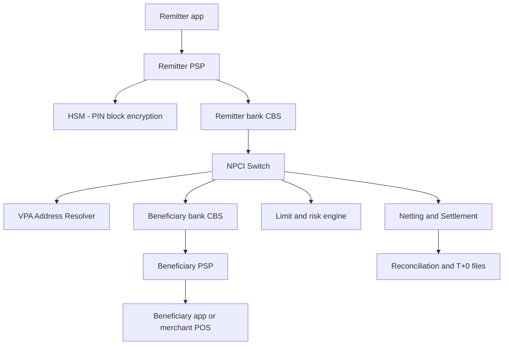
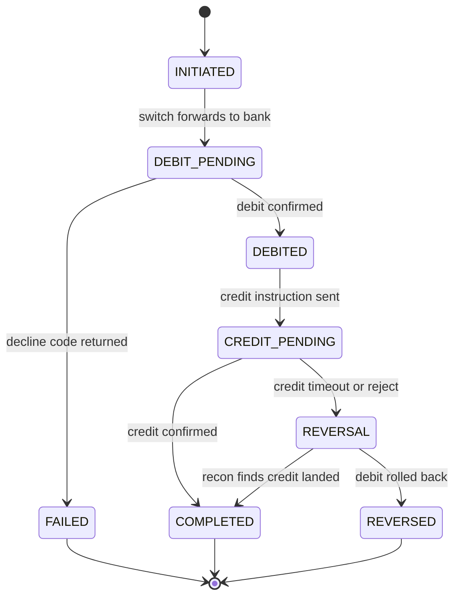
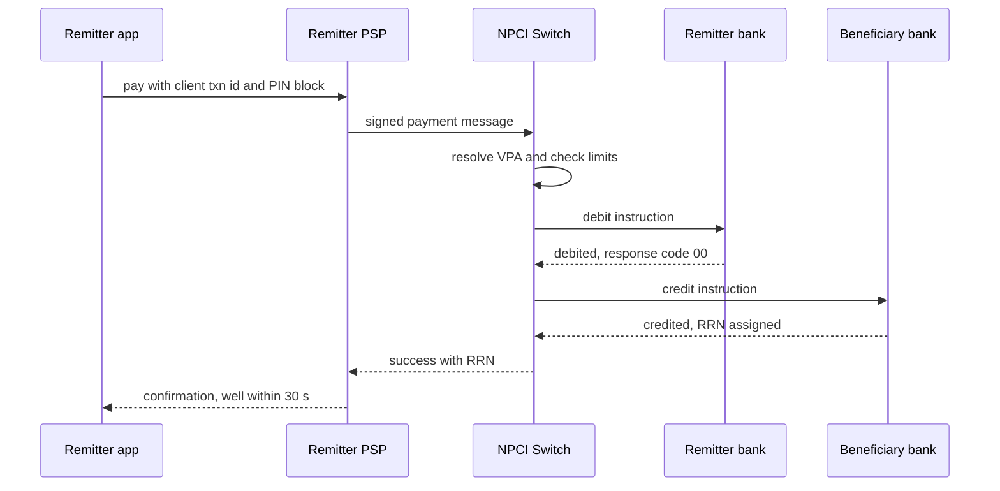

# Case Study: Design UPI — Real-Time Payments at NPCI Scale

## Overview

UPI (Unified Payments Interface) is India's real-time retail payment rail, operated by NPCI (National Payments Corporation of India): a mobile-first, VPA-addressed, 24×7 interbank transfer system that publicly reported volumes have grown past 16 billion transactions in a single month, with festival peaks in the tens of thousands of TPS and a regulator-mandated end-to-end completion target of ~30 seconds. The interview question — "design UPI" — is really a test of exactly-once thinking across independent bank cores: you cannot own the participants, the money moves in two halves (debit then credit) across systems with different uptime, and every retry is dangerous. This page is the **system-design build**; it complements [Real-World: Payment System](../real-world/payment-system.md), which analyzes a generic PSP/card platform, and [Design: Payment System](../payment.md), the textbook ledger/checkout design. The IRCTC connection runs both ways: rail bookings are a top UPI merchant category, and the [IRCTC case study](./irctc-train-booking.md) consumes exactly the payment semantics designed here.

## Step 1 — Requirements

### Functional

- **P2P push ("pay")**: remitter enters a VPA (e.g., `name@bank`) or scans a QR; money moves bank-to-bank in seconds
- **P2M and "collect" (pull)**: a merchant requests payment; the payer approves with UPI PIN — the merchant never sees bank credentials
- **VPA resolution**: a memorable alias maps to (bank, account) without exposing account numbers; a single account can have multiple VPAs and one VPA can switch banks
- **Balance check and transaction history** via the PSP app against the linked bank
- **Autopay mandates**: recurring pulls against pre-approved limits (SIPs, subscriptions)
- **Offline and device-limited variants**: UPI Lite (on-device wallet, small-value debits without bank round-trip per payment), UPI Lite X (fully offline NFC), and UPI 123PAY for feature phones

### Non-Functional

- **Latency**: end-to-end completion in ~30 seconds hard ceiling (regulatory framing); typical P2P completes in 2–5 s; balance debits must feel instant
- **Correctness**: money is never created or destroyed; every attempted transaction ends in exactly one of {completed, failed, auto-reversed} — partial states must self-heal within T+1
- **Scale**: 16B+ txns/month ⇒ ~6K TPS average platform-wide, with festival peaks an order of magnitude above average for minutes at a time
- **Availability**: the switch is systemically critical; PSPs and banks must degrade gracefully (retry, queue, or clear user messaging) — silent money loss is the one unacceptable outcome
- **Auditability**: every message is signed, logged, and reconcilable; disputes resolve against an immutable evidence trail

## Step 2 — Back-of-Envelope Estimation

| Quantity | Assumption | Result |
|---|---|---|
| Monthly volume | 16B+ txns/month | ~6.2K TPS platform-wide average |
| Peak factor | 8–10× average for minutes (festival, sales) | 50–60K TPS burst ingress, sustained tens of K |
| Message size | request/response < 1 KB | 50K TPS ≈ 100 MB/s of wire traffic — small payloads, huge per-message cost in bank-core round-trips |
| Participants | 650+ banks and PSPs live | heterogeneity is the constant; one slow bank core can stall the switch |
| Lookup load | VPA resolution on most txns + QR scans | the address resolver is a hot, cacheable read path |
| Retry behavior | user taps "retry" within 2–3 s after a timeout | 1.5–2× amplification during incidents unless keyed |

The insight to say aloud: throughput is not the hard part — a 1 KB message at 50K TPS is trivially shardable. The hard parts are **fan-in to a shared switch with 650 heterogeneous participants**, **two-phase money movement across independent cores**, and **retry storms** that multiply load exactly when systems are degraded.

## Step 3 — Participants and API Sketch

The architecture is a star: PSP apps face users; NPCI operates the central switch; banks run the actual debit/credit. Roles worth enumerating:

- **Remitter PSP**: hosts the app, does device/PIN binding, assembles the signed payment message
- **Remitter bank**: debits the account (CBS core-banking system)
- **NPCI switch**: routes, resolves VPAs, enforces limits, timestamps, assigns the RRN (12-digit Retrieval Reference Number)
- **Beneficiary bank**: credits the account; may post instantly or batch
- **Beneficiary PSP**: delivers the success notification to the payee app

```text
POST /v1/pay                  { payer_vpa, payee_vpa, amount_paise, txn_id, note } → { status, rrn }
POST /v1/collect              { payee_vpa, payer_vpa, amount_paise, expiry_s }     → { collect_id }
POST /v1/collect/{id}/approve { upi_pin_token }                                    → { status, rrn }
GET  /v1/txn/{txn_id}                                                              → status by client txn id
POST /v1/mandates               create/revoke autopay                              → { mandate_id }
```

Key API decisions:

- `txn_id` is **client-generated and globally unique**; re-submitting the same `txn_id` returns the original outcome instead of moving money twice — idempotency at the protocol level, not an HTTP nicety (see [API Idempotency](../../../backend/api/api-idempotency.md))
- The **RRN** is the switch-assigned canonical reference every participant logs; support, reconciliation, and dispute all key on it
- Approvals require the **UPI PIN**, whose blocks travel encrypted under HSM-managed keys — the PSP never sees the PIN in clear

## Step 4 — High-Level Architecture



Design points that matter:

- The **switch is stateful for the transaction lifecycle** (routing, dedup, timeouts) but not for user identity — VPAs resolve through the dedicated resolver, which is heavily cacheable (an alias→account mapping changes rarely)
- **Banks are the long pole**: a modern app can accept a request in 50 ms, but a bank CBS on an evening peak may take seconds to debit; the switch must therefore manage per-bank timeouts, circuit breakers, and queues rather than assume uniform latency
- **Money never rests in the switch**: NPCI instructs banks; settlement is multilateral netting of positions (Deep Dive 5). This separation of *instruction* from *settlement* is what lets 650 banks transact without pre-funding every pair

## Step 5 — Message Design and Data Model

UPI messages are compact, signed, and reference-numbered. A simplified payment message shows the fields every interview design should carry:

```json
{
  "txn_id": "4f9c2e81-6d3a-4c1e-9a7f-client-generated",
  "type": "PAY",
  "payer_vpa": "alice@pspA",
  "payee_vpa": "store@pspB",
  "amount": 45000,
  "currency": "INR",
  "ts": "2026-01-15T19:02:11.482Z",
  "payee_name": "Corner Store",
  "note": "order 8812",
  "pin_block": "<HSM-encrypted>",
  "device_id_hash": "b7f3...",
  "signature": "<JWS over canonical payload>"
}
```

Field-level decisions that carry design weight:

- **Amounts travel as integer paise** — float money is an instant credibility loss in any payments interview
- `ts` is recorded for audit and replay-window checks; like the auction page's `client_ts`, ordering decisions use the switch's clock, never the client's
- The **signature covers the canonical payload**, so a PSP cannot repudiate a request and a MITM cannot mutate the amount; the PIN block is separately encrypted under HSM keys and never transits PSP logs
- Persisted state at the switch is a thin row per transaction: `(txn_id, rrn, payer_bank, payee_bank, amount, state, ts)`, partitioned by participant and day — the switch is a router with a durable audit trail, not a ledger; balances live in bank cores
- Response messages mirror the request plus `resp_code` and `rrn`; response-code taxonomy (declined, insufficient funds, beneficiary unreachable, technical timeout) is what PSP UX and retry logic key on

## Deep Dive 1 — VPA Resolution and the Lookup Storm

A VPA is an alias (`user@psp`); resolving it yields the underlying (IIN, account) pair. Resolution is logically centralized but **cache-friendly**: mappings change when users re-link accounts, which is rare compared with payment frequency.

- **PSPs cache resolution results** (with short TTLs and invalidation on failed credits), so the most common payees (a family member, a milk vendor) never hit the resolver
- **Numeric IDs and QR**: merchant QRs embed the payee VPA or direct account+IFSC payload, cutting the lookup entirely; person-to-person VPAs dominate resolver load
- **Failure anatomy**: when the switch (or resolver) degrades, PSP apps surface timeouts; users tap retry; each retry re-resolves and re-submits — the **lookup storm** amplifies a 2× incident into 5× load. Defenses are boring and vital: PSP-side response caching, exponential backoff keyed by `txn_id` (a retry never creates a new transaction), circuit breakers per downstream bank, and clear "payment pending, do not retry" messaging instead of blank failures
- **The October–November 2021 class of multi-hour switch outages** (documented publicly by NPCI and widely reported) showed the recovery problem too: when service returns, a thundering herd of queued retries and withheld bill payments arrives together, so PSPs stagger retry release — same shape as the post-maintenance herd in [Design: Rate Limiter](../rate-limiter.md)

## Deep Dive 2 — Idempotency and Exactly-Once Semantics

Transport cannot deliver exactly-once across six systems; the *protocol* approximates it. The mechanism stack:

1. **Client `txn_id`**: the app generates a UUID per payment attempt; every hop keys its state on it
2. **Switch-side dedup**: the switch keeps a bounded window of recent `txn_id`s per participant; a repeat returns the recorded outcome (or in-flight status) instead of re-debiting
3. **Bank-side dedup**: the CBS honors the same key — the debit instruction carries the switch's message reference, so a network retry inside the bank is a no-op
4. **RRN as the outcome anchor**: once the switch assigns an RRN, that identifier is the single truth for "this money moved"; all participants' logs reconcile on it
5. **Compensation for the credit half**: if the debit succeeds but the credit times out, the transaction enters reversal (auto-reversal within T+1 per RBI rules, with customer compensation per day of delay) — a saga, not a distributed transaction (compare [Exactly-Once Delivery](../../../backend/patterns/exactly-once.md))



The terminal-state rule to state out loud: **every transaction reaches exactly one terminal state, and the system guarantees convergence to it** — `COMPLETED`, `FAILED` (money never left), or `REVERSED` (money returned). "Unknown" is never terminal; it is a state with a deadline and an owner (the reconciliation engine).

## Deep Dive 3 — Pay vs Collect Flows and the 30-Second SLA

The two flows have opposite trust directions. **Pay** (push) is remitter-authorized: fast, low-friction, used for P2P and scan-and-pay. **Collect** (pull) is payee-initiated but *payer-approved*: the merchant sends a request, the payer sees amount + payee and approves with PIN. Collect adds a human round-trip and a fraud surface (phishing collect requests), which is why NPCI constrains collect (expiry windows, per-VPA velocity caps, mandates for recurring pulls).



Where the ~30-second budget actually goes:

| Hop | Typical budget | Why |
|---|---|---|
| App + PSP pre-processing | ~1–2 s | device checks, PIN entry time is user-paced and excluded |
| Remitter bank debit | ~3–10 s | CBS is the long pole: legacy cores, evening batch contention |
| Switch routing + resolve | ~0.5–1 s | in-memory routing, cached VPA resolution |
| Beneficiary bank credit | ~3–10 s | second CBS hop; some banks post near-instantly, others lag |
| PSP ack / notification | ~0.5–1 s | push to payee app, receipt to payer |
| Headroom | remaining seconds | one retry window before technical decline |

Interview-worthy observation: the SLA is **dominated by bank cores the switch does not control**, so the switch's real job is deadline management — per-hop timeouts, "no second debit after first succeeded", and pushing participants toward faster posting with measured SLAs per bank.

## Deep Dive 4 — Limits, Fraud, and Rate Control

Every payment rail is an abuse magnet, and UPI's controls are layered between usability and safety:

- **Regulatory/protocol limits**: per-transaction and daily caps (P2P cap ₹1,00,000/day is the canonical figure; merchant categories vary); UPI Lite deliberately caps per-transaction (₹500–1,000) and wallet (₹4,000–5,000) values *because* its debits bypass real-time bank authorization — the limit is the blast radius
- **Velocity and risk checks inline**: per-device/per-VPA rates, new-device + large-amount friction, and blocklists evaluated in milliseconds at the switch's risk engine; heavy ML fraud scoring runs *adjacent* (blocking requires explainable, fast rules)
- **PSP-side rate limiting** protects the switch from one misbehaving app: per-PSP quotas, per-endpoint token buckets, and "get-in-line" semantics during incidents ([Rate Limiter](../rate-limiter.md))
- **Collect-request abuse** (spam/phishing pulls) is throttled by unread-collect caps and report/block signals; mandates require explicit first approval with PIN, turning recurring pulls into pre-authorized, revocable objects

The design point interviewers want: inline fraud checks must be **O(1) lookup-based** (counters, blocklists, score-thresholds); anything smarter is sampled and offline, because 50K TPS leaves no budget for per-transaction model inference in the critical path.

## Deep Dive 5 — Settlement and Reconciliation (T+0)

Instruction and settlement are decoupled. During the day, the switch accumulates every transaction between institutions; **multilateral netting** compresses 650×650 possible bilateral obligations into one net position per participant per settlement cycle. NPCI settles these positions through the banking system (with settlement guarantees), and participants download **reconciliation files** — per-transaction records keyed by RRN — to match against their CBS postings.

- **Recon is where "unknown" states die**: a debit logged but no matching credit at the payee bank and no reversal yet → the recon job finds the gap and drives reversal or completion. Without this, customer service would be the reconciliation engine
- **Disputes and chargebacks**: UPI disputes key on RRN with defined timelines; the evidence trail is the signed message log, which is why message signing and immutable logging are functional requirements, not security garnish
- **Daily cutoffs do not stop instruction**: the rail runs 24×7 including holidays; only *settlement cycles* are periodic, which is why intra-day liquidity management for banks matters and why a bank's settlement position can be healthy while its CBS is melting under retry load

## What Breaks During Outages (Failure Playbook)

- **Switch outage**: all PSPs fail fast or time out; the correct behavior is queue-and-hold with user-visible "try again shortly", keyed retries on recovery, and per-PSP token-bucket release so the recovery herd is metered — never a raw thundering herd into a freshly restarted switch
- **One bank's CBS outage**: the switch circuit-breaks that bank (fail its debits/credits quickly with a distinct response code), letting the other 649 continue; PSPs show bank-specific downtime messaging. Partial outage is the common case, and per-bank isolation is the whole resilience story (bulkheads, as in [Design: Notifications](../notifications.md) fanout isolation)
- **VPA resolver degradation**: fall back to cached mappings (stale alias data may bounce, which is safer than stalling the switch); numeric/QR payloads bypass resolution entirely

The standard incident decomposition — detect, contain, communicate, recover — maps onto concrete components:

| Failure | Detection signal | Containment | Customer-visible behavior |
|---|---|---|---|
| Switch outage | timeout ratio across all banks | fail-fast + PSP queues | "payments temporarily unavailable", no silent drops |
| One bank CBS down | that bank's error/timeout rate | per-bank circuit breaker | bank-specific downtime message; other banks unaffected |
| VPA resolver slow | resolver p99 latency | serve cached mappings | occasional stale bounce, safer than stall |
| Retry storm | load amplification factor | keyed backoff, token-bucket release | staged recovery after service returns |
| Half-completed txn | recon mismatch report | auto-reversal within T+1 | refund SMS with RRN reference |

- **UPI Lite as resilience**: because debits are on-device wallet decrements, small-value payments continue through switch/bank outages and reconcile later — an explicit consistency-for-availability trade with capped downside

## Interview Questions

1. **How does UPI deliver "exactly-once" when banks and the switch only have at-least-once messaging?** It does not get exactly-once from transport; it engineers the *outcome* to be unique. A client-generated `txn_id` keys dedup at every hop, the switch returns the recorded outcome for replays, and the RRN anchors the canonical result once money moves. The debit-credit pair is a saga: if the credit half fails after a successful debit, reversal converges the state to `REVERSED` within T+1, and reconciliation is the owner of every non-terminal state. So the guarantee is "one terminal state per attempt, reachable and provable," not "one network message."
2. **Decompose the 30-second SLA. Which hop dominates, and what can the switch actually do about it?** The two CBS hops (remitter debit, beneficiary credit) dominate — together they can consume 6–20 s, versus under a second for switch routing on cached VPA resolution. The switch cannot make bank cores faster, so it does deadline management: per-bank timeouts, distinct response codes so PSPs know whether money left, and no second debit after a confirmed first. The honest statement is that UPI's latency profile is a *governance* outcome (measured, published per-bank SLAs) as much as an engineering one.
3. **An NPCI switch outage begins at 8 PM on a festival day. Walk through the next 30 minutes at a major PSP.** First minutes: timeout spike, then the PSP's circuit breakers open and apps switch to fail-fast messaging ("payments temporarily unavailable") — blank spinning errors that induce retries are the real killer. Queued actions (scheduled bill payments, mandate debits) hold with original `txn_id`s. Load amplification from user retries is capped by backoff keyed on the same transaction id. On recovery, the PSP meters retry release (token bucket) because a restarted switch + millions of withheld payments is its own thundering herd. The post-incident recon of half-completed debit/credit pairs is already designed for, not improvised.
4. **Why does collect (pull) exist at all when push is simpler and safer?** Because merchants need initiation: a bill at a restaurant or a delivery COD flow wants "request ₹450" with the payer just approving, and recurring billing needs standing authorization. The costs are real and show up in the design: collect adds a human approval latency, a phishing surface (spam collect requests), and needs unread-request caps, expiry windows, and revocable mandates. Autopay moves recurring pulls into mandate objects approved once with PIN, converting an ongoing trust decision into a bounded, auditable object.
5. **How can UPI Lite work offline without breaking double-spend safety?** It moves small-value debits onto an on-device wallet: the phone decrements a locally-held balance and queues the posting; the bank reconciles when connectivity returns. Double spend is prevented by the constraint that the device balance is decremented per payment and the wallet is topped-up only online — the offline budget can never exceed what the bank previously debited. The low per-transaction and wallet caps exist precisely to bound the worst case of a stale/forked wallet state. It is a deliberate availability-for-consistency trade at capped denominations.
6. **Where would you place caches in this system, and where would you never cache?** Cache: VPA→account resolution (rare-change mapping, TTL + invalidation on failed credit), payee QR payloads, merchant catalog data, and rate-limit counters in Redis. Never cache: transaction outcomes and ledger states — a cached "pending" answer for a retried payment either double-moves money or lies to a user; outcome reads go to the keyed source of truth, possibly via a read replica with the same key. The boundary is "identity and limits are cacheable; money state is not."

## Key Takeaways

- UPI is a **star topology**: PSP apps face users, NPCI's switch routes and enforces, banks move the money — and the two bank-core hops dominate the ~30 s SLA
- "Exactly-once" is an **outcome-level construction**: client `txn_id` + switch dedup + RRN anchor + saga-style reversal + T+0 reconciliation, never a transport guarantee
- **Pay (push) vs collect (pull)** differ in trust direction, latency, and fraud surface; mandates turn recurring pulls into pre-approved, revocable objects
- The **VPA resolver is the hot read path**; during outages, uncached lookups plus user retries create the lookup storm — PSP caching, keyed backoff, and "do not retry" UX are load-bearing
- Per-bank **circuit breakers and bulkheads** are what keep one melting CBS from stalling 649 others; partial outage is the design case, not the exception
- Settlement is **multilateral netting on cycles** (T+0) decoupled from 24×7 instruction; reconciliation files keyed by RRN are where unknown states get resolved
- Limits are the **blast-radius control**: UPI Lite's small caps are what make its offline, eventually-posted debits safe

## References

- NPCI — Unified Payments Interface product overview and ecosystem rules: https://www.npci.org.in/what-we-do/upi/product-overview
- NPCI — organization and product index (UPI Lite, 123PAY, statistics): https://www.npci.org.in
- RBI — payment system regulations including auto-reversal timelines (T+1) and compensation rules: https://www.rbi.org.in/
- ISO 20022 — the financial messaging standard UPI message design aligns with: https://www.iso20022.org/
- RFC 9110 (HTTP Semantics) — idempotent methods and the vocabulary behind idempotent payment APIs: https://datatracker.ietf.org/doc/rfc9110/
- Google SRE books — circuit breaking, load shedding, and retry-budget practice for incident load: https://sre.google/books/

## Cross-References

- [Real-World: Payment System](../real-world/payment-system.md) — the generic PSP/card platform analysis this case complements with a bank-to-bank instant rail
- [Case Study: IRCTC Train Booking](./irctc-train-booking.md) — the consumer of these semantics: holds, payment windows, and UPI success rates during the Tatkal spike
- [Design: Payment System](../payment.md) — ledger, double-entry, and checkout idempotency fundamentals
- [Design: Rate Limiter](../rate-limiter.md) — token buckets, per-PSP quotas, and retry budgets during incidents
- [Backend: API Idempotency](../../../backend/api/api-idempotency.md) — idempotency-key mechanics underlying `txn_id` semantics
- [Backend: Exactly-Once Delivery](../../../backend/patterns/exactly-once.md) — why messaging guarantees can't substitute for protocol-level dedup
- [Design: Notifications](../notifications.md) — per-participant fanout isolation that mirrors per-bank bulkheading
