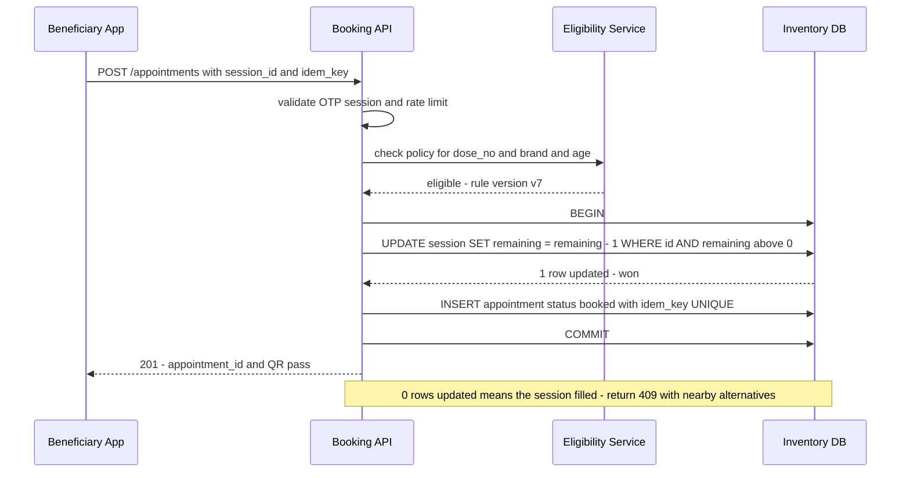
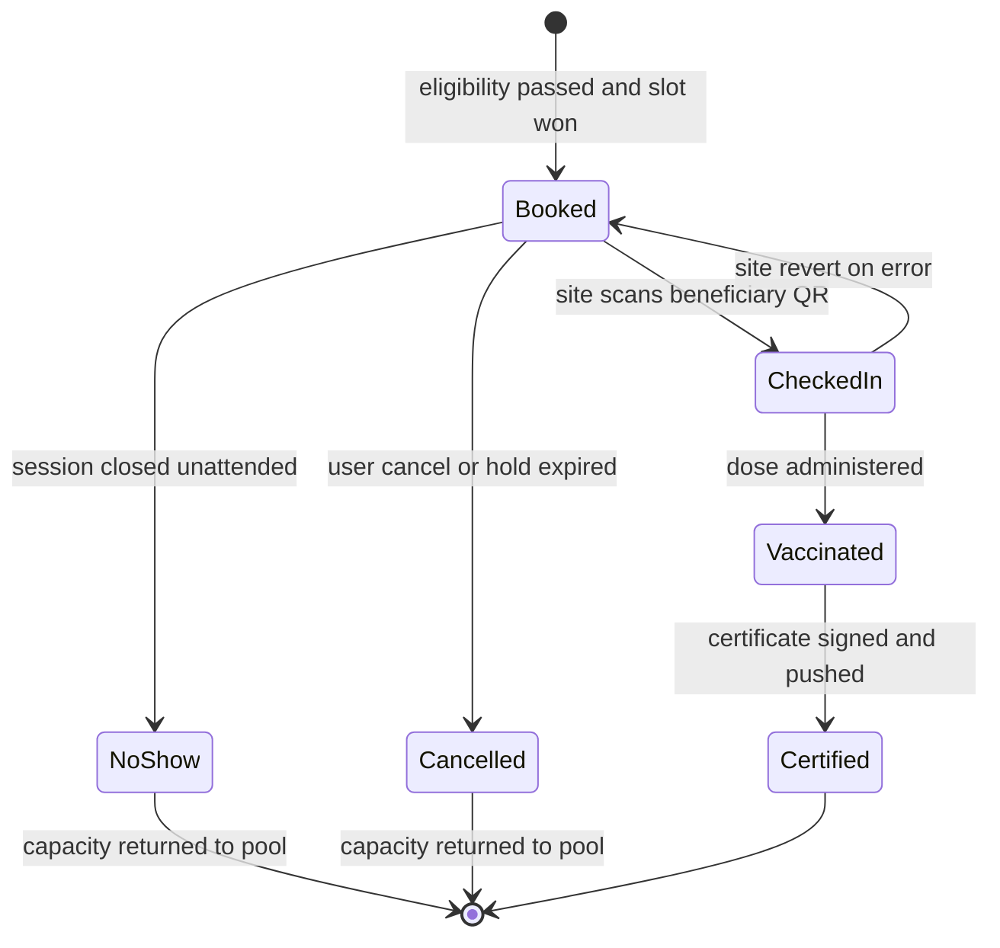
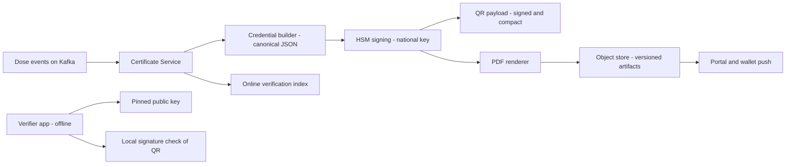

# Case Study: Design a Vaccination Slot Booking System (CoWIN-Style)

## Overview

This is the 45-minute walkthrough for designing a national-scale public-health slot booking platform in the style of India's CoWIN: a beneficiary registry measured in billions, vaccination centers with per-session slot inventory, hard eligibility rules for dose-1 vs dose-2, and a certificate pipeline whose signed output has legal value. It differs from the [Ticketmaster](./ticketmaster.md) case study in three ways: eligibility is *policy-driven* (age cohorts, dose intervals, vaccine brand), fairness is a first-class requirement (citizens vs bots at an 18:00 slot release), and the artifact produced is a signed, verifiable certificate rather than an event ticket. Expect this as a "design a system for your country" interview, as a capacity-planning drill, or as a follow-up probing whether you can reuse no-oversell inventory techniques under different constraints.

## Step 1 — Requirements

### Functional

- Maintain a **beneficiary registry**: register with a government ID or OTP-verified mobile, store demographics, and support lookup by mobile/ID for life of the program
- Maintain **center and slot inventory**: vaccination centers (public hospitals, private clinics) publish sessions (date, session period, vaccine brand, dose type offered, capacity in slots)
- **Search slots** by district/pincode/center and date; view live availability
- **Book, cancel, reschedule** appointments with hard eligibility enforcement: right dose number, minimum interval since last dose, age cohort, brand match for dose-2
- At most **one active appointment per beneficiary per dose**; booking requires an OTP-verified session
- Track the **appointment lifecycle** at the site: booked → checked-in → vaccinated → certified, with cancellation and no-show handling that returns capacity to the pool
- **Issue certificates** after each dose: signed document with a QR code, verifiable online and offline, pushed to the beneficiary portal and wallet apps
- **Scheduled slot releases**: centers batch-publish next-day sessions at a fixed time (18:00 local), producing a known daily thundering herd

### Non-Functional

- **Correctness first**: a slot is never sold twice, and a beneficiary never holds two active bookings for the same dose — a delayed booking is recoverable, a corrupt health record is not
- **Fairness over raw speed**: queue admission, per-identity rate limits, and bot screening outrank p99 latency; humans must beat scripts at 18:00
- **Scale**: a billion-person registry, ~100–160K centers, cumulative dose events in the billions, single-day peaks in the tens of millions of bookings
- **Latency**: slot search < 300 ms p95 from cache; booking confirm < 500 ms p99 when admitted
- **Availability**: 99.95% for the booking path; the search path may degrade to slightly stale data during release minutes, but the write path must never serve a lost update
- **Auditability**: every appointment and certificate state change is attributed (actor, device, timestamp) — health records are subject to audit years later

## Step 2 — Back-of-Envelope Estimation

Work the campaign numbers before drawing boxes. Public cumulative figures for CoWIN (as of 2024) are ~1.08 billion registered beneficiaries and ~2.2 billion doses administered, with a publicly reported single-day administration record of ~25M doses in June 2021.

| Quantity | Assumption | Result |
|---|---|---|
| Beneficiary registry | 1.08B rows × ~300 B | ~350 GB hot data — small-data problem, huge correctness problem |
| Centers / sessions | 150K centers × 3 sessions/day × 100 slots | ~45M slot rows live per day, partitioned by district |
| Peak-day bookings | 25M bookings concentrated in 12 h | ~600/s sustained, 10× minute bursts around 18:00 |
| 18:00 release burst | 5M slot searches in first 5 min | ~17K search RPS, 50K+ RPS in the worst minute |
| Read:write ratio | 50M searches/day vs ~10M bookings/day | ~5:1 at campaign scale — search caching carries the load |
| Certificates/day | 1 per administered dose | peak ~300K/hour generation, ~80–100/s sustained |
| Certificate size | PDF ~200 KB + QR payload 1–2 KB | ~5 TB/day at peak — object storage, not a database |

The pattern to verbalize: this is a **tiny-write, huge-read, spiky-write** system. The write rate is modest by consumer-internet standards, but it concentrates into minutes after a scheduled release and every write is a serialized decision on shared inventory rows. The registry is large but cold; the hot set is "today's sessions in popular districts."

## Step 3 — API Sketch

```text
Registration and identity:
  POST /v1/beneficiaries          body: { name, dob, gender, id_doc }  -> { beneficiary_id }
  POST /v1/auth/otp/request       body: { phone }                      -> { otp_session }   rate-limited per phone
  POST /v1/auth/otp/verify        body: { phone, otp }                 -> { session_token }

Search and booking:
  GET  /v1/slots?district_id=&date=&dose_no=&brand=   -> { snapshot_version, sessions[] }
  POST /v1/appointments            body: { session_id, dose_no, idempotency_key } -> { appointment_id, qr_pass }
  POST /v1/appointments/{id}/cancel                     -> releases capacity synchronously

Site operations (nurse console):
  POST /v1/checkins                body: { beneficiary_qr, session_id } -> { appointment_id, status: checked_in }
  POST /v1/doses                   body: { appointment_id, batch_no, vaccinator_id, idem_key } -> { dose_id }
```

Three API decisions deserve stating out loud. The slot search returns the snapshot *version* alongside results, so a booking attempt can be rejected against a stale snapshot before any database work happens. The `doses` endpoint is idempotent on `(appointment_id, idem_key)` because vaccinator devices retry over hospital Wi-Fi, and a double-tapped dose record would corrupt eligibility for life. Site-operation endpoints authenticate with device-bound tokens and are never reachable from the public app — the same QR that a beneficiary shows is a claim, not an authorization.

## Step 4 — Data Model: Centers, Slots, Beneficiaries

### Center and slot inventory model

Inventory is a three-level hierarchy: **center → session → slot bucket**. A session is the unit of inventory (`center_id, date, session_period, vaccine_brand, dose_type, capacity, remaining_count`); slot buckets (e.g., 10-minute granules across a 3-hour session) are advisory for queue spreading, not authoritative. Keeping the authoritative counter at session granularity means one conditional update per booking instead of per-minute-slot contention, and walk-in load balancing happens naturally within the session. A generic UUID or Snowflake ID (see [ID Generation](../hld/id-generation.md)) keys every row, and rows are partitioned by district so that release-time contention in one city cannot lock another.

```text
center        id, name, district_id, geohash, type(public/private)
session       id, center_id, date, period(am/pm), vaccine_brand,
              dose_type(dose1|dose2|precaution), capacity, remaining_count, version
appointment   id, beneficiary_id, dose_no, session_id, slot_start, status,
              idempotency_key UNIQUE, booked_via, created_at
beneficiary   id, name_norm, dob, gender, id_doc_type, id_doc_hash UNIQUE,
              phone_e164, phone_verified, prior_dose: {brand, date}[]
```

`remaining_count` with a `version` is the concurrency-control surface. Everything the booking path touches is a single session row plus the beneficiary row, so the hot-path transaction is two rows and a unique index — deliberately boring.

### Beneficiary registry and ID dedup

Dedup is a policy problem expressed as data. The hard layer is a **unique index on the hashed ID document** (one row per Aadhaar/ID number); the soft layer is a **phone-beneficiary link table** that allows one verified phone to own a bounded number of beneficiaries (e.g., 4 — a parent booking for family), since a shared family phone is the norm in the target population. On top of both, a near-duplicate guard compares normalized name + DOB + phone with an edit-distance or fingerprint match and flags look-alike registrations for review instead of silently merging, because a wrong merge corrupts medical history while a false positive costs one support ticket. Registration completes only after OTP verification of the phone, which converts "anonymous traffic" into "rate-limitable identity" — the foundation for both dedup and bot defense later.

## Step 5 — The 18:00 Slot Release and Thundering Herd

At 18:00, centers publish next-day sessions and tens of millions of app users who have been waiting on a countdown refresh simultaneously. The load has three shapes: a read stampede (slot search), a write stampede (bookings), and an abuse stampede (scripts that poll faster than humans can tap). The design treats each differently.

**Reads** are served from a Redis tier keyed by `(district_id, date)` holding versioned session snapshots, refreshed by change-data-capture from the inventory DB within ~2 s of any mutation. A search result is a *hint*, not a promise — the booking API revalidates against the authoritative row, exactly as the seat map does in [Ticketmaster](./ticketmaster.md). **Writes** are metered by an admission service: clients get a release token from a per-district token bucket, sized to what the booking path can confirm (start at ~2K confirms/s per large district), so the queue drains at the rate inventory can actually be won. **Abuse** is filtered before admission, not after.

- **Stagger the release**: instead of all districts at 18:00:00, open districts in waves (18:00, 18:05, 18:10) by pincode prefix. Ten waves cut peak burst by an order of magnitude with negligible fairness cost
- **Pre-warm and pre-queue**: the app opens a waiting-room session at 17:45; at release the server *pushes* admission tokens to connected sessions rather than letting millions re-poll
- **Snapshot versioning**: each district snapshot carries a monotonic version; booking requests pin the version they saw, and a stale version gets a fast 409 with refreshed data instead of a wasted DB round trip

### Fairness measures

Fairness is measurable and enforceable, and interviewers reward naming the mechanism with each goal. One active appointment per beneficiary per dose is a **unique partial index** on `(beneficiary_id, dose_no) WHERE status = 'active'` — the database enforces fairness rule zero, not application code. Holds expire: an admitted user gets a 10-minute hold token on the session row; an expiry sweeper re-releases abandoned holds every minute so camped inventory returns to the pool. Per-phone rate limits cap searches (e.g., 60/hour) and bookings (e.g., 5 attempts/day) per verified phone; randomized queue ordering with jitter prevents deterministically favoring whoever connects first; and waitlists for over-subscribed sessions get priority when cancellations re-enter the pool.

### Bot defense

The 18:00 herd is mostly automated, so defenses run before the booking API. Every booking session is born from an **OTP challenge (TOTP/RFC 6238-style server-side codes)** with per-phone daily quotas and progressive lockout; captcha is served *escalation-style* — invisible risk scoring first, interactive challenge after threshold crossings; device fingerprint and network signals feed a velocity model that down-ranks datacenter IPs and emulator patterns (see [Rate Limiter](../rate-limiter.md) for the token-bucket machinery and [API Design](../hld/api-design.md) for signed session tokens). The controls are layered so no single bypass is fatal: OTP proves a SIM, captcha proves a human-ish client, rate limits bound automation throughput, and the unique-index invariant guarantees that even a winning bot cannot take two slots for one person. The honest interview line: bots raise the cost of abuse, but only the inventory invariant and admission control protect the system's core promise.

## Step 6 — Booking Flow: Eligibility and Optimistic Locking

### Dose-1 and dose-2 eligibility rules

Eligibility is a pure function evaluated before any lock is taken, so rejected users cost one cheap read. Rules are policy-versioned because they changed repeatedly during the real campaign (dose-2 intervals moved with brand and supply):

| Rule | Dose-1 | Dose-2 | Enforced by |
|---|---|---|---|
| Age cohort | `dob` ≥ program cutoff (e.g., 18y or 12y phase) | same | eligibility service, policy version |
| Minimum interval | n/a | `today - last_dose_date ≥ min_gap_days` (brand-specific: 28–84 days historically) | beneficiary dose history |
| Brand match | any published brand | same brand as dose-1 | session attribute |
| Dose count | 0 prior doses of this series | exactly 1 prior | beneficiary record |
| One active booking | none active for this dose | none active | DB unique partial index |
| Center restriction | any center | any center offering the brand | search filter |

The policy table lives in config, keyed by `(brand, dose_no)` with an effective-date range, so a mid-campaign change is a data update, not a deploy. When a booking fails eligibility, the API returns the failing rule code — this is what makes the client's error messages precise and the audit trail meaningful.

```yaml
# eligibility policy — versioned, effective-dated, evaluated before any lock
dose_rules:
  - brand: covishield
    dose_no: 2
    min_gap_days: 84        # historical: moved 28 -> 84 -> 56 during the campaign
    requires_prior_dose: 1
    requires_prior_brand: covishield
  - brand: any
    dose_no: 1
    min_age_years: 18       # phase-dependent: 18+ cohorts, then 15+, then 12+
    requires_prior_dose: 0
effective_from: 2021-05-01
policy_version: v7
```

### Booking with optimistic locking

The booking transaction is a single conditional update — no distributed locks, no read-modify-write window:



Three properties carry the design. First, **atomicity lives in the row update**: `remaining = remaining - 1 WHERE remaining > 0` cannot double-sell regardless of how many workers race it — the loser updates zero rows and is told immediately (the same CAS discipline as the seat hold in [Ticketmaster](./ticketmaster.md)). Second, **the idempotency key is the client's retry armor**: a network timeout after commit is retried with the same key, and the unique index collapses the retry into the original appointment instead of booking twice (mechanics in [API Idempotency](../../../backend/api/api-idempotency.md)). Third, **the hold is a TTL, not a state**: `hold_expires_at` on a lightweight reservation record; the confirm call consumes it, and the sweeper re-releases it. Postgres row-level semantics are sufficient — this is a single-key conflict, the case where the database is provably simpler than a lock service (see [Real-World: Distributed Lock](../real-world/distributed-lock.md) for why advisory locks are the wrong tool here, and [Consistency Patterns](../consistency-patterns.md) for the consistency spectrum).

## Step 7 — Appointment State Machine

Every appointment moves through a small, explicitly owned state machine. Ownership matters: transitions are performed by named services (nurse console, sweeper, certificate pipeline), never by ad-hoc client calls, and each transition writes an audit event.



The transitions interviewers probe are the lossy ones. **Cancel/no-show → pool**: a sweeper closes sessions at session end, flips unattended bookings to `no_show`, and increments `remaining_count` in the same transaction — re-released capacity must be visible to search within seconds or citizens will chase ghosts. **CheckedIn → Booked revert**: a scanned patient who cannot be vaccinated (contraindication discovered) must return to `booked` without losing the slot, because re-entering the queue would be unfair. **Vaccinated → Certified is asynchronous**: the nurse records the dose and moves on; the certificate pipeline catches up in seconds. A dose recording is itself idempotent — the vaccinator's device retries on flaky hospital Wi-Fi, keyed by `(beneficiary_id, dose_no)`, so a double-tap cannot create a phantom second dose.

Transition ownership is the table the on-call engineer and the auditor both read:

| Transition | Owner | Trigger | Side effect |
|---|---|---|---|
| Booked → CheckedIn | site console | beneficiary QR scanned on-site | session clock starts; no-show timer armed |
| CheckedIn → Vaccinated | site console | dose recorded with batch number | dose event published to Kafka |
| Vaccinated → Certified | certificate pipeline | signed artifact stored | push to portal and wallets |
| Booked → Cancelled | beneficiary or sweeper | explicit cancel or hold TTL expiry | `remaining_count` incremented same-transaction |
| Booked → NoShow | session sweeper | session closed unattended | capacity returned; SMS rebooking nudge |

## Step 8 — Certificate Generation and Verification Pipeline

The certificate is the system's public face and its audit anchor. Generation is event-driven: the dose event lands on Kafka, the certificate service builds a canonical credential payload (beneficiary pseudonym, name, DOB, vaccine, batch, dose date, vaccinator ID, issuing authority), **signs it in an HSM with the national private key**, renders the signed PDF with a QR encoding the signature, and pushes the artifact to object storage plus the beneficiary portal and wallet integrations. At ~300K certificates/hour on peak days, signing is a **KMS/HSM throughput problem** — batch signing or key sessions on the HSM, with the signing queue buffered so a signing appliance hiccup delays certificates but never blocks the vaccination workflow (event backbone mechanics in the [Kafka documentation](https://kafka.apache.org/documentation/)).



Verification has two modes, and the distinction is the senior-answer territory. **Online verification** hits an index service that resolves certificate ID → signature and revocation/correction status; it supports corrections and revocations instantly. **Offline verification** embeds the issuer's public key in verifier apps (border checkpoints, airlines, employers): the QR carries a compact signed payload — a CBOR/COSE structure in the style of [RFC 9052](https://datatracker.ietf.org/doc/rfc9052/) and the [SMART Health Cards](https://spec.smarthealth.cards/) framework — and the verifier checks the signature locally with zero network. Offline verifiable certificates cannot be silently revoked, which is a deliberate policy trade: health certificates correct rarely (a botched batch number), and the correction path is reissue-with-supersede rather than revocation. The WHO's Digital Documentation of COVID-19 Certificates (DDCC) specification is the international reference for payload semantics (title + venue; no stable URL needed in the answer).

The QR payload itself is deliberately minimal — small enough for a v15 QR code, complete enough to be meaningful without network:

```text
COSE_Sign1 payload (illustrative, ~600 bytes before base45):
  iss: "MOH-IN"                     # issuing authority
  ben: "b3f1..."                    # pseudonymous beneficiary ID (not the raw doc number)
  nme: "A. Sharma"                  # display name only
  dob: "1989-04-12"
  vac: { brand: "COVISHIELD", dose: 2, date: "2021-08-03",
         batch: "4121Z003", lot_expiry: "2021-11-30",
         vaccinator: "v-77129", center: "c-10293" }
  ref: "cert-9f82e1"                # online verification / reissue lookup key
  sig_alg: ES256                    # signed by national key in HSM
```

Design notes worth volunteering: the raw government ID never enters the QR (a scanned certificate must not leak the permanent identity), and the `ref` field is the bridge to online verification where corrections and supersession status live. Verifiers pin the issuer's public key and an algorithm allow-list, so a downgrade attack on the signature algorithm is a client update, not a server-side scramble.

## Bottlenecks & Follow-Up Questions

- **18:00 minute-1 storm**: even with staggering, the first minute of a metro district release is 20–50K RPS. Follow-up: "cache is serving stale data — a user books a session the cache said was open" → the CAS update fails, return 409 with live alternatives; staleness is a UX cost, never a correctness cost
- **Hot districts**: 80% of demand targets 5% of centers. Follow-up: "metro center rows are 100% contended" → the conditional update still serializes at the row in microseconds; the real fix is inventory-side (more sessions) and admission-side (fewer users admitted to hopeless districts), not more locking machinery
- **Certificate signing throughput**: HSM operations are expensive. Follow-up: "2.2B certificates lifetime" → batch signing amortizes HSM calls, and the QR payload is signed once while the PDF is deterministic rendering downstream
- **Offline verification vs corrections**: a corrected batch number on an already-distributed QR cannot be un-distributed. Follow-up: "what is the actual policy?" → reissue with a new certificate ID and a superseded-by list; online verification rejects the old ID
- **Phone-sharing**: one phone, four beneficiaries, one 18:00 queue position. Follow-up: "does the family queue once or four times?" → four independent bookings but a per-phone booking rate limit must be sized for legitimate families, or fairness breaks for the exact users the program most needs

## Interview Questions

1. **Why optimistic locking instead of a distributed lock or a queue for bookings?** The conflict is on one session row, which is exactly the case a database conditional update solves atomically: `UPDATE ... WHERE remaining > 0` serializes winners at the row with microsecond cost and zero lease-tuning risk. A Redis-style lock is a hint with an expiry — a GC pause past the lease means two bookings both believe they won — while a queue serializes *all* bookings behind a single consumer and turns a 500 ms interaction into an async wait. The database is the arbiter of the invariant, and the unique partial index on `(beneficiary_id, dose_no)` catches the second class of double-booking for free.
2. **Walk through what happens when two users try to book the last slot at 18:00:01.** Both requests pass eligibility and hit the inventory DB. The first `UPDATE ... SET remaining = remaining - 1 WHERE id = ? AND remaining > 0` commits and returns 1 row updated; the second sees 0 rows updated, the transaction rolls back, and the API returns 409 with a refreshed snapshot showing the session full plus nearby sessions with capacity. The loser costs one cheap row probe — no lock waits, no retries against a hot lock — and the idempotency key ensures that if either client retried the same request after a network blip, it would collapse into the same appointment, not a second one.
3. **How do you make a billion-row registry safe against duplicate identities?** Layered invariants: a unique index on the hashed government ID makes exact duplicates impossible; a phone-link table bounds legitimate shared-family registration (one verified phone → ≤4 beneficiaries); a fuzzy near-duplicate guard (normalized name + DOB + phone fingerprints) flags look-alikes for human review rather than auto-merging, because a wrong merge poisons dose history and eligibility. Registration requires OTP phone verification, which converts every subsequent action into a rate-limitable, attributable identity — dedup and bot defense share the same foundation.
4. **Your slot search cache is 2 seconds stale at release time. Is that a bug?** No — it is the designed contract. Search is a hint service: it surfaces candidate sessions from versioned district snapshots, and the booking API is the only authority, revalidating with a conditional update. Letting search hit the DB to be exact would put 50K RPS on the row store for information that is out of date within seconds anyway. The user-visible mitigation is a 409-with-alternatives flow, so a lost race costs one tap instead of a support ticket. Correctness-critical paths are few and cheap; everything else is allowed to be eventually consistent.
5. **How does offline certificate verification work, and what do you give up?** The QR encodes a compact signed credential — CBOR/COSE Sign1-style, a few hundred bytes to 2 KB — signed by the issuer's key whose public half is pinned in verifier apps. A checker with no connectivity validates the signature, the payload hash, and the expiry fields locally, which is what makes border and workplace checks work in low-connectivity settings. What you give up is real-time revocation and correction: a superseded certificate remains offline-verifiable, so the program must rely on reissue semantics and accept that only online verification sees corrections.
6. **What changes if the government adds walk-ins alongside bookings?** Walk-ins consume the same session inventory, so the site console performs the same conditional decrement on `remaining_count` — the inventory engine is unchanged, only the client is different. The subtle part is capacity fairness: pre-booked users must find capacity when they arrive, so sites reserve a per-session headroom buffer (e.g., last 20% of slots not bookable online in high-traffic centers) and the sweeper releases unclaimed online holds to walk-ins mid-session. Two demand sources, one authoritative counter, and one reservation policy reconciling them.

## Key Takeaways

- Split the load shapes: slot *search* is a stale-cache problem, slot *booking* is a single-row concurrency problem, and the 18:00 *herd* is an admission-control problem — each needs a different machine
- The no-oversell invariant is one conditional update plus one unique partial index; anything fancier (locks, queues, consensus) is added risk without added guarantee
- Eligibility (dose gaps, brand match, age cohort) is versioned policy evaluated before locking, so rejected users cost one read and policy changes are data, not deploys
- Fairness is enforced with database invariants (one active appointment per beneficiary+dose), TTL holds with re-release sweeps, staggered releases, and per-identity rate limits — not with faster servers
- Bot defense is layered and lossy by design — OTP quotas, captcha escalation, device velocity — while the inventory invariant provides the last, unbreakable line
- Certificates are an event-driven signing pipeline: HSM-signed compact payloads (COSE-style QR) enable offline verification; reissue-with-supersede replaces revocation as the correction story
- Every appointment transition has a named owner and an audit event; the state machine is small but each lossy transition (no-show, revert, cancel) must return capacity to the pool within seconds

## References

- CoWIN digital platform (official portal) — the production system this case study abstracts: https://www.cowin.gov.in/
- IETF RFC 9052 — CBOR Object Signing and Encryption (COSE), the structure behind compact signed QR credentials: https://datatracker.ietf.org/doc/rfc9052/
- SMART Health Cards Framework — signed, offline-verifiable health credential design: https://spec.smarthealth.cards/
- WHO — Digital documentation of COVID-19 certificates (DDCC), Smart Vaccination Certificate workstream (title + venue; no stable deep URL)
- IETF RFC 6238 — TOTP: the OTP algorithm behind phone-verification rate limiting: https://datatracker.ietf.org/doc/rfc6238/
- OWASP — Automated Threats to Web Applications (bot traffic taxonomy): https://owasp.org/www-project-automated-threats-to-web-applications/
- PostgreSQL documentation — conditional updates and row-level locking semantics: https://www.postgresql.org/docs/current/sql-select.html
- Apache Kafka documentation — event backbone for dose events and certificate generation: https://kafka.apache.org/documentation/
- Google SRE Books — overload behavior, admission control, and load shedding patterns: https://sre.google/books/
- Jepsen analyses — consistency claims of stores tested under fault injection: https://jepsen.io/analyses

## Cross-References

- [Case Study: Ticketmaster](./ticketmaster.md) — sibling no-oversell inventory design; same CAS discipline, different fairness and artifact requirements
- [Design: Rate Limiter](../rate-limiter.md) — token buckets, per-identity quotas, and the machinery behind bot defense
- [Real-World: Hotel Booking](../real-world/hotel-booking.md) — inventory holds, TTLs, and re-release sweeps in a commercial domain
- [HLD: Consistency Tradeoffs](../hld/consistency-tradeoffs.md) — where stale search hints vs authoritative booking fits the consistency spectrum
- [Real-World: Distributed Lock](../real-world/distributed-lock.md) — why advisory locks are the wrong tool for single-key inventory conflicts
- [Design: API Idempotency](../../../backend/api/api-idempotency.md) — idempotency-key mechanics that make booking retries safe
- [Security: Cryptography](../../../security/cryptography.md) — signatures, HSMs, and key ceremonies behind certificate signing
- [References: Distributed Systems Library](../../../references/distributed-systems.md) — verified primary sources for consensus, queues, and coordination
