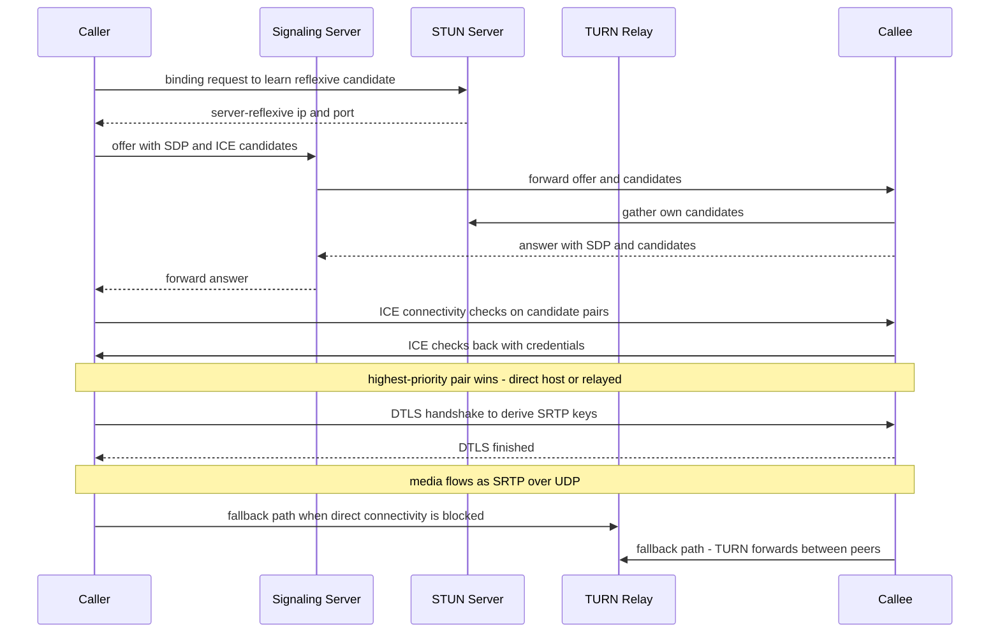
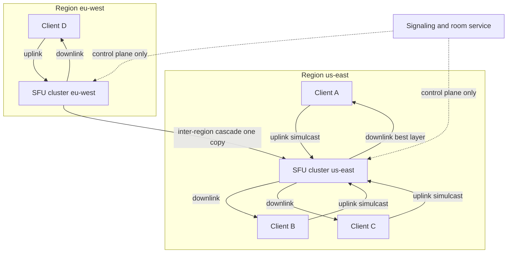
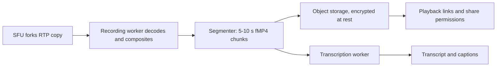

# Case Study: Design a Video Conferencing System (Zoom / Google Meet)

## Overview

This is the 45-minute walkthrough for designing real-time group video conferencing: bidirectional audio and video where every participant is simultaneously a publisher and a subscriber, under latency budgets an order of magnitude tighter than any streaming product. The core work is moving media packets — not storing or transcoding them — which inverts most instincts built on VOD systems like [How Netflix Works](../real-world/netflix.md). The WebRTC fundamentals themselves (SDP, data channels, API shape) live in [WebRTC](../../../web-development/webrtc.md); this page assumes those and goes one level up: topology choice (mesh vs MCU vs SFU), layered encoding, congestion control, signaling at fleet scale, geo-distributed media relays, and the operational numbers Zoom and Google Meet published during their 2020 growth spikes. Expect it in senior design rounds at any company with real-time products (Zoom, Discord, Google, Meta), usually as "design Zoom" or "design Google Meet."

## Step 1 — Requirements

### Functional

- Host meetings of 2 to ~1,000 interactive participants, and webinar-style events to 10K+ view-only attendees
- Publish camera, microphone, and screen share; consume a switchable layout (active speaker or grid)
- Host controls: mute/unmute, waiting room, remove participant, lock meeting, breakout rooms
- In-meeting chat and emoji reactions as side channels, carried separately from the media path
- Cloud recording with a consent announcement, plus post-call transcripts and share links
- Join from browser (WebRTC), native desktop/mobile apps, and dial-in telephony (SIP/PSTN bridges)

### Non-Functional

- **Latency**: mouth-to-ear target ≤ 150 ms for conversational quality; beyond ~400 ms turn-taking visibly breaks. This budget dominates every other decision
- **Scale**: Zoom reported ~300M daily meeting participants in April 2020, up from ~10M in December 2019; peak *concurrent* participants reached the tens of millions. Median meeting is small (2–8 people), which drives capacity math
- **Media resilience**: adapt to access links from 0.5–100 Mbps; survive 1–5% packet loss and 100+ ms jitter without visible collapse
- **Availability**: join success > 99.9%; a failing media path must degrade to audio-only, never drop the call
- **Privacy**: media encrypted hop-by-hop as SRTP (AES-256-GCM, per-meeting keys); optional end-to-end encryption where the SFU forwards opaque encrypted frames

## Step 2 — Back-of-Envelope Estimation

Work the numbers for the peak day before drawing boxes. The median meeting is small, so aggregate capacity is dominated by millions of tiny rooms, not by the 500-person all-hands.

| Quantity | Assumption | Result |
|---|---|---|
| Peak concurrent participants | Zoom-class peak day | ~50M concurrent |
| Uplink per participant | 3-layer simulcast + Opus audio | ~2.5–3.5 Mbps |
| Downlink per participant | 3–6 visible videos at chosen layer | ~1.5–4 Mbps |
| Aggregate media throughput | 50M × ~3 Mbps average | ~150 Tbps in and out |
| Meeting size distribution | 80% of meetings ≤ 8 people | SFUs mostly serve small rooms |
| Signaling connections | 1 WebSocket per participant | 50M concurrent, few KB/s each |
| TURN-relayed media | ~5–15% of flows behind symmetric NAT | adds ~2× egress on those flows |
| Recording | ~1% of meetings recorded | ~500K concurrent record pipelines at peak |

Two patterns to verbalize. First, media egress is ~2 orders of magnitude above any API workload — 150 Tbps is a content-delivery-network-scale problem, which is why media relays live in edge regions with 10–25 Gbps NICs and why "just use TCP" is dead on arrival. Second, the median meeting being tiny means the *per-room* control plane (join, roster, layout) sees far more traffic than any single large meeting; optimize the small-room path.

## Step 3 — API and Client-Server Contracts

```text
POST /v1/meetings                       → { meeting_id, host_key }
POST /v1/meetings/{id}/join             → { session_token, sfu_url, ice_servers[] }
WS   /v1/signaling/{session_id}         → SDP offer/answer, trickle candidates, roster
WS   /v1/media-events/{session_id}      → layout, chat, reactions (side channel)
POST /v1/meetings/{id}/recordings       → { recording_id, state: requested }
GET  /v1/recordings/{rid}               → { playlist_url, transcript_url, expires_at }
```

Two contracts to state out loud. First, the join response carries the *routing decision* — `sfu_url` plus the STUN/TURN server list — so the server, not the client, owns region placement and relay policy; a client never picks its own infrastructure, which is what lets you re-balance regions or swap TURN providers without a client release. Second, signaling is a private, versioned protocol over one WebSocket: renegotiation messages (track added/removed) and roster events share the pipe, and a `v` field per message is what lets a new client build talk to a fleet of SFUs mid-rollout instead of forcing a lockstep upgrade.

## Step 4 — WebRTC Connection Setup: SDP, ICE, STUN, TURN, DTLS

A meeting client must learn its own network addresses, exchange them with the peer or SFU, agree on codecs, and derive encryption keys — all before the first frame. The pieces (detailed API mechanics are in [WebRTC](../../../web-development/webrtc.md)):

- **SDP offer/answer (RFC 8829, JSEP)**: each side describes codecs, resolutions, and transport parameters; the answer negotiates the intersection. Renegotiation happens on every track add/remove (screen share starts, someone unmutes with video)
- **ICE (RFC 8445)**: gathers candidate addresses — host (local NIC), server-reflexive (via **STUN**, RFC 5389), and relay (via **TURN**, RFC 5766) — then runs pairwise connectivity checks and picks the highest-priority working pair
- **DTLS handshake** over the winning candidate pair derives the keys used to encrypt media as **SRTP** (RFC 3711); the media itself rides **RTP** (RFC 3550) over UDP
- **Trickle ICE**: candidates stream to the peer as they are gathered, cutting setup time from ~2 s to well under 1 s in the common case



**What the interviewer is probing:** whether you know why media is UDP + SRTP rather than TCP or HTTPS. TCP head-of-line blocking turns 2% loss into latency spikes that break conversation; SRTP provides confidentiality, integrity, and replay protection without reliability semantics the application does not want.

## Step 5 — Topology: Mesh vs MCU vs SFU

The central architecture decision. With \\( N \\) participants there are three canonical ways to route media.

| Topology | How it works | Per-client uplink | Server CPU per participant | Quality | Where it fits |
|---|---|---|---|---|---|
| **Mesh** | Every peer sends its stream directly to every other peer (P2P WebRTC) | \\( (N-1) \\) streams — ~4 Mbps at N=5, unusable at N=10 | None (no server media hop) | Full quality per stream, but uplink caps break first | 1:1 and calls up to 3–4 people; Google Meet stays peer-to-peer for very small calls |
| **MCU** | Server decodes all inputs, composites one output, re-encodes | 1 stream (~1–2.5 Mbps) | Highest — decode + composite + encode per participant | Uniform output; server adds encode latency; layout decided centrally | Legacy SIP/PSTN interop, mixing many codecs, low-power receive devices |
| **SFU** (selective forwarding unit) | Server receives every stream, routes RTP packets forward **without decoding**; clients send layered/simulcast streams and the SFU picks a layer per downlink | 1 simulcast upload (~2.5–3.5 Mbps) | Low — packet routing + RTP header work only | Per-viewer layer choice; active-speaker layouts are cheap | The production default at scale: Zoom, Google Meet, Discord, Teams all use SFU-family designs |

The SFU wins because it converts a server-side compute problem (transcoding) into a client-side upload problem (send 3 layers once), and compute is the scarcer resource. The MCU's per-participant encode cost at 50M concurrent participants is not purchasable; the mesh's uplink math fails at exactly the meeting sizes people actually hold. State the crossover explicitly: mesh ≤ 4–5 participants, SFU beyond, MCU only when a mandated output mix exists.



Sizing a single SFU node: forwarding RTP is memcpy-plus-header-work, so a 16-vCPU node with a 25 Gbps NIC relays roughly 10–20 Gbps — on the order of 2,500–8,000 720p-equivalent streams, or 50–150 small meetings. Open-source reference points: Jitsi Videobridge and mediasoup (both documented at [jitsi.github.io/handbook](https://jitsi.github.io/handbook/) and [mediasoup.org/documentation](https://mediasoup.org/documentation/)) are SFUs, and LiveKit's docs ([docs.livekit.io](https://docs.livekit.io/)) publish comparable per-node throughput figures. Inter-region meetings cascade: the SFU nearest each participant receives one uplink, and one copy crosses the WAN between region pairs — a 12-person call spread over 3 regions costs 2 cross-region streams, not 12.

## Deep Dive 1 — Simulcast and SVC: Layered Encoding

One fixed 720p stream cannot serve a phone on 4G and a fiber desktop simultaneously. Two solutions exist and interviews expect you to distinguish them:

- **Simulcast**: the encoder produces 2–3 *independent* full streams (e.g. 180p @ ~150 kbps, 360p @ ~500 kbps, 720p @ ~2.5 Mbps). The SFU forwards exactly one per downlink, chosen from each receiver's bandwidth estimate. Cost: upload bandwidth ~3×; the SFU never decodes
- **SVC (scalable video coding)**: one stream with *dependency layers* — spatial layers for resolution, temporal layers for frame rate. Downlinks subscribe to a layer and receive it plus its dependencies (RTP payload format in RFC 6190's lineage). Cost: less upload overhead than simulcast, but encoder complexity and layer-switching bookkeeping are harder

The SFU's layer decision loop is the heart of the system. Each receiver's transport reports a bandwidth estimate via RTCP (TWCC — transport-wide congestion control — is the modern mechanism), the SFU picks the highest layer that fits with headroom, and switches are executed at temporal-layer boundaries to avoid visible glitches. A pinned active-speaker layout means the SFU forwards the speaker's top layer plus thumbnails at the lowest layer, which is how a grid of 20 videos fits in 2–3 Mbps.

## Deep Dive 2 — Jitter Buffer, Echo Cancellation, and Adaptive Bitrate

Receiving real-time media is its own engineering problem:

- **Jitter buffer**: packets arrive with variable delay; the receiver holds them in a playout buffer (adaptive, typically 30–100 ms of target depth) that grows under jitter and shrinks when the network calms. Late packets are discarded — better to skip a frame than to fall behind. NetEQ-style algorithms combine this with **packet loss concealment** (synthesizing 20 ms of audio) so 2–3% loss is inaudible
- **Adaptive bitrate**: the delay-gradient estimator (Google's GCC algorithm, standardized in the RMCAT working group) infers congestion from one-way delay trends *before* loss appears, then throttles the encoder. Expect to cite the shape: probe up, back off fast on delay growth, recover slowly
- **Echo cancellation**: acoustic echo arises when microphone picks up speaker output, creating a feedback loop the far end hears as their own voice. The WebRTC audio pipeline (AEC3) models the loudspeaker-to-microphone path and subtracts the estimate, alongside noise suppression (ANS) and automatic gain control (AGC). Headsets sidestep AEC; laptop loudspeaker calls in reverberant rooms are the worst case, and AEC quality is a genuine competitive moat — it is also why conferencing apps request exclusive control of audio devices
- **Audio codec budget**: Opus (RFC 6716) runs 6–64 kbps for speech with DTX (discontinuous transmission) cutting bitrate ~50% during silence. Voice gets a tiny slice of the budget, so video congestion control is designed to preserve audio first — audio breaks a meeting before video does

The latency stack to quote: ~20–40 ms capture/encode, 30–100 ms jitter buffer, network RTT/2. A well-tuned call lands at 100–250 ms mouth-to-ear, meeting the conversational budget on decent networks.

## Deep Dive 3 — Signaling, Room State, and Geo-Distributed Relays

Signaling is the small-but-critical control plane:

- **Transport**: one WebSocket per participant to a regional signaling tier. Message volume is tiny (SDP blobs of a few KB at join and renegotiation, roster updates, chat/reactions), but connection count is the scale axis: 50M concurrent WebSockets sharded across connection gateways with ~100K–1M connections each
- **Room service**: join allocates the participant to an SFU via latency probing (ping each candidate region, pick lowest RTT with capacity), registers roster state, and mediates host controls. The roster is strongly consistent per room — a single room manager (or Raft-replicated group for hot rooms) owns it
- **Reconnection**: mobile clients flap constantly. Rejoin carries a session token, the room manager re-attaches the participant to the same SFU within the hold window, and clients jitter reconnect backoff to avoid synchronized reconnect storms after a shared network blip
- **Geo-distribution**: media relays deploy in dozens of edge regions; the join path picks the nearest with headroom. Cross-region meetings use the cascade from the topology diagram above. During the 2020 surge, capacity was effectively "one SFU fleet per continent" — the design must allow standing up a region in hours, which argues for stateless SFU nodes with all state in the room service
- **Encryption posture**: SFU deployments encrypt hop-by-hop (DTLS-SRTP with per-meeting keys rotated on membership change); end-to-end-encrypted meetings use frame-level encryption where the SFU forwards opaque payloads (SFrame-style), trading away server-side active-speaker detection and recording

**What the interviewer is probing:** whether signaling and media stay decoupled in your head. Signaling can be down and an established call keeps flowing; a signaling outage degrades *joins and roster changes*, not ongoing media — call that out explicitly.

### TURN Deployment in Practice

TURN is the insurance policy and the cost center, so it deserves its own operational paragraph. Roughly 5–15% of flows end up relayed — symmetric NATs, corporate firewalls, carrier-grade NAT on mobile networks — and each relayed flow doubles server-side egress (media enters the relay, exits to the peer) while holding an allocation whose default lifetime is 600 s under RFC 5766. Deploy relay pools per region sized to the *expected* relayed-flow ratio, issue short-lived scoped credentials (an HMAC over a username timestamp, per the STUN/TURN auth model), and alarm on the ratio itself: a region jumping from 8% relayed to 40% means a customer network changed, not your code, and catching it early is the difference between a cost blip and a capacity emergency.

## Deep Dive 4 — Recording Pipeline and Chat/Reactions Side-Channel

Recording is an offline video problem bolted onto a real-time one:



The SFU forks each participant's RTP stream to a recording worker, which decodes, composites the active-speaker layout, and writes chunked MP4 — segmenting keeps worker failure recoverable from the last chunk rather than restarting the recording. Latency to an available share link is minutes, not seconds, and nothing in the recording path may consume the real-time latency budget. Consent announcements and retention policy (who can view, for how long) are product-level compliance requirements, not optional features.

Chat and reactions are deliberately second-class citizens on a separate WebSocket (or SCTP data channel):

- Delivery is lossy-tolerant and unordered-enough: a dropped emoji is invisible, a dropped chat message is a minor defect — this is the opposite contract from the media path and it must be carried on separate infrastructure (see [Case Study: Live Comments](./live-comments.md) for the fan-out design at broadcast scale)
- Reactions at 10–50 msg/s per room are aggregated server-side into counters so a 1,000-person meeting's emoji storm costs bytes, not messages
- Host moderation (mute-all, remove) rides the same control channel with priority handling — control-plane messages preempt chat under load

## Deep Dive 5 — QoE Metrics: How You Know a Call Is Bad

Conferencing fleets are run on a small set of per-stream statistics harvested from the WebRTC `getStats()` pipeline, batched client-side and aggregated per meeting. These metrics are both the product's tuning loop (encoder settings, jitter-buffer targets, layer-switch thresholds) and the interview's credibility signal — naming them with targets shows operational depth no architecture diagram provides.

| Metric | Definition | Target | Why it leads or lags |
|---|---|---|---|
| Join time | click-to-first-frame, ICE through keyframe | p95 < 2 s | The most user-visible number; dominated by ICE checks and signaling RTT |
| One-way delay | network transport delay per stream | < 150 ms mouth-to-ear | Fixed by region placement; cannot be coded away |
| Packet loss post-FEC | media packets lost after repair | < 2% audio, < 5% video | Concealment hides loss up to the target, then quality falls off a cliff |
| Freeze ratio | seconds of frozen video / seconds of video | < 0.5% | The strongest single driver of "the call sucked" complaints |
| Audio MOS (estimated) | model-based 1–5 from delay, loss, codec stats | > 4.0 | Audio is the last thing to break and the first thing users judge |
| Degradation rate | share of downlinks below the base layer | < 1% | Leading indicator of capacity or last-mile trouble |
| Reconnect success | rejoins recovered within the hold window | > 99% | Mobile networks make reconnection the modal failure |

Two practices separate mature fleets. First, metrics are *double-ended*: sender and receiver stats for the same stream are joined by SSRC, so a high sender bitrate with a frozen receiver renders as a network path problem, not a silent mystery. Second, QoE is sliced by network class (wifi, cellular, corporate) and region before it is sliced by anything else — a global average freeze ratio of 0.3% can hide one region at 2%, and that region is the on-call page.

## Bottlenecks & Follow-Up Questions

- **Uplink asymmetry**: home internet upload is the binding constraint. Follow-up: "A participant has 1 Mbps uplink — now what?" → Their client drops to 1–2 simulcast layers; the SFU serves everyone else from other participants; audio always survives
- **SFU hot spots**: a 1,000-person webinar fans out 1,000 × 2.5 Mbps = 2.5 Gbps from one room's SFU set. Follow-up: "and at 10K?" → Tree/cascade forwarding — the room's SFUs form a distribution tree, each level replicating once; view-only attendees may also receive via CDN-delivered segmented HLS with 5–10 s delay as the cheap tail
- **Renegotiation storms**: screen-share toggles trigger SDP renegotiation; 30 participants toggling in a minute is 60 signaling round-trips on shared infra. Batch and coalesce; renegotiate per track, never per participant-event
- **Cross-region cascade failure**: losing the us-east↔eu-west link strands one region's participants. Follow-up: two independent cascade paths, or re-home the eu-west leg onto a third region within seconds
- **TURN cost blowout**: a misbehaving corporate firewall forces 100% of a large meeting through TURN, doubling egress and paying relay compute. Monitor relayed-flow ratio per region; it is a cost and a health metric
- **Clock and lip sync**: audio and video RTP clocks drift independently; receivers lip-sync via RTCP sender reports. Follow-up: "what breaks without them?" → Gradual desync, noticeable within minutes on hardware-delayed paths

## Interview Questions

1. **Why is an SFU almost always the right answer instead of a mesh or an MCU?** Mesh upload grows as \\( (N-1) \\) streams per client, which dies at residential uplink around 4–5 participants. An MCU transcodes every stream server-side — at 50M concurrent participants that encode farm is economically impossible, and it adds encode latency to the tightest budget in the system. An SFU takes each participant's single layered upload and routes RTP packets without decoding, so per-participant server cost is near-memcpy, while each receiver pulls the layer its bandwidth can afford. State the crossover (mesh ≤ 4–5, SFU beyond, MCU only for mandated mixing) and you have the topological argument interviewers want.
2. **Walk through what happens from "click Join" to first video frame.** Signaling over WebSocket authenticates and allocates an SFU by latency probe; the client gathers ICE candidates (host, STUN-derived reflexive, TURN relay), the SFU answers with its own SDP and candidates; ICE runs prioritized connectivity checks and the first working pair wins; a DTLS handshake over that pair derives SRTP keys; RTP flows and the first keyframe arrives within one GOP. Total is typically 0.5–2 s, dominated by candidate exchange and ICE checks — trickle ICE and pre-warmed TURN allocations are how you shave it.
3. **How does the system cope when a receiver's bandwidth drops from 5 Mbps to 800 kbps mid-call?** The receiver's transport reports the degradation via RTCP congestion signals; the SFU down-switches that downlink from the 720p simulcast layer to 360p, ideally at a temporal-layer boundary so no glitch is visible. The sender's own encoder keeps producing all three layers, so recovery is a single RTCP-driven switch, not a renegotiation. If congestion persists below 360p, the SFU drops to audio-forwarding for that downlink — degraded video, never a dropped call.
4. **Where does the 150 ms conversational latency budget actually get spent?** Roughly 20–40 ms capture plus encode, half the network RTT, and a 30–100 ms adaptive jitter buffer. The jitter buffer is the only term the receiver controls, so it is tuned aggressively — deep enough to absorb jitter and conceal 2–3% loss, shallow enough to keep the mouth-to-ear sum under ~150 ms. Everything that adds fixed latency (server-side mixing, TCP transport, transcode hops) is suspect for exactly this reason.
5. **A meeting spans three continents. How does media flow, and what are the failure modes?** Each participant uploads once to their nearest regional SFU; one simulcast copy crosses each inter-region link (cascading SFUs), and each regional SFU fans out to its local participants. Failure modes: an inter-region link loss strands one region's leg, so you maintain two independent cascade paths or re-home quickly; cascade adds one RTT of latency to the far region, which usually still fits the budget. The alternative — everyone into one region — burns WAN bandwidth on N copies and punishes the far region's latency.
6. **Why keep chat on a separate channel from the media path?** The delivery contracts are opposite: media demands low latency and tolerates loss, chat tolerates seconds of latency and demands eventual delivery. Sharing one transport couples their congestion control — an emoji storm would compete with video packets — and couples their failure domains. Separate WebSocket/data-channel infrastructure lets chat use the cheap broadcast-grade design from [Case Study: Live Comments](./live-comments.md) while media keeps its real-time guarantees.

## Key Takeaways

- Topology is the headline decision: mesh dies on uplink math beyond 4–5 people, MCU dies on server economics at scale, SFU converts server compute into client upload and wins everywhere in between
- Connection setup is a pipeline — SDP offer/answer, ICE candidate gathering and checks, DTLS-SRTP keying — and knowing why each stage exists (UDP for latency, SRTP for crypto, TURN for NAT fallback) matters more than API details
- Simulcast/SVC layered encoding is what makes per-receiver adaptation cheap: send layers once, let the SFU pick per downlink from RTCP bandwidth estimates
- The jitter buffer is the only latency term you fully control on the receive side; AEC/AGC/NS run on every call and are a real differentiator in product quality
- Signaling is a control plane with connection-count scale; media is a data plane with terabit scale — different regions, different failure modes, and an ongoing call must survive signaling loss
- Media relays live at the edge and cascade for cross-region meetings; relayed-flow ratio (TURN share) is simultaneously a cost and a health metric
- Recording is a forked, asynchronous copy of the same RTP with segment-level recovery — it must never sit on the real-time latency path
- Chat/reactions are lossy-tolerant side channels on separate infrastructure with a fundamentally different delivery contract

## References

- RFC 8825 — Overview: Real-Time Protocols for Browser-based Applications (WebRTC 1.0 requirements): https://datatracker.ietf.org/doc/rfc8825/
- RFC 8829 — JavaScript Session Establishment Protocol (JSEP, the SDP offer/answer engine): https://datatracker.ietf.org/doc/rfc8829/
- RFC 8445 — Interactive Connectivity Establishment (ICE): https://datatracker.ietf.org/doc/rfc8445/
- RFC 5389 — Session Traversal Utilities for NAT (STUN): https://datatracker.ietf.org/doc/rfc5389/
- RFC 5766 — Traversal Using Relays around NAT (TURN): https://datatracker.ietf.org/doc/rfc5766/
- RFC 3550 — RTP: A Transport Protocol for Real-Time Applications: https://datatracker.ietf.org/doc/rfc3550/
- RFC 3711 — The Secure Real-time Transport Protocol (SRTP): https://datatracker.ietf.org/doc/rfc3711/
- RFC 6716 — Definition of the Opus Audio Codec: https://datatracker.ietf.org/doc/rfc6716/
- W3C WebRTC 1.0 specification: https://www.w3.org/TR/webrtc/
- webrtc.org — the open-source WebRTC project (audio pipeline, congestion control reference implementations): https://webrtc.org/
- I. Grigorik, *High Performance Browser Networking*, WebRTC chapter: https://hpbn.co/webrtc/
- mediasoup documentation — SFU design and simulcast APIs: https://mediasoup.org/documentation/
- Jitsi Handbook — Jitsi Videobridge SFU architecture: https://jitsi.github.io/handbook/
- LiveKit documentation — open-source SFU with published per-node scaling figures: https://docs.livekit.io/
- D. Hayes et al., draft-ietf-rmcat-gcc — Google Congestion Control algorithm for RTP media: https://datatracker.ietf.org/doc/html/draft-ietf-rmcat-gcc-02

## Cross-References

- [WebRTC](../../../web-development/webrtc.md) — the fundamentals layer: SDP fields, data channels, and browser API mechanics this page assumes
- [Case Study: Live Comments](./live-comments.md) — the chat/reaction side channel at broadcast scale, with a different delivery contract
- [Case Study: Video Transcoding Pipeline](./video-transcoding-pipeline.md) — the offline sibling: what happens when media is stored and re-encoded, not relayed
- [Real-World: Netflix](../real-world/netflix.md) — one-to-many streaming; contrasts ABR-over-HTTP with the interactive media path
- [Design: Rate Limiter](../rate-limiter.md) — protecting join/signup APIs during demand spikes like April 2020
- [References: Networking Library](../../../references/networking.md) — verified primary sources for the RFCs and real-time transport standards cited above
