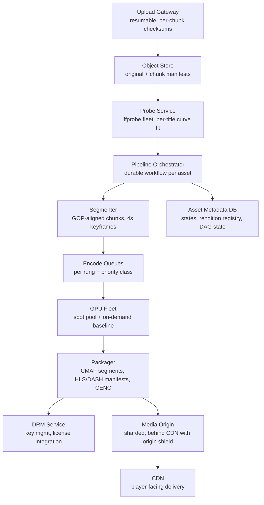
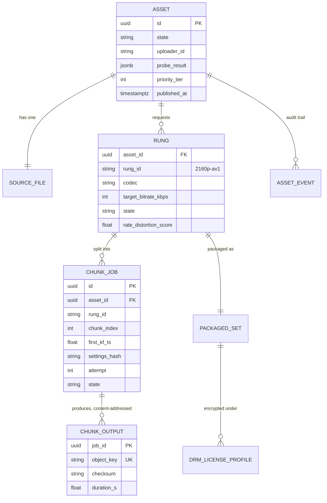
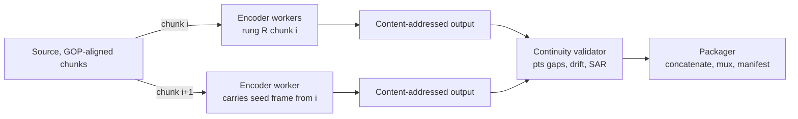
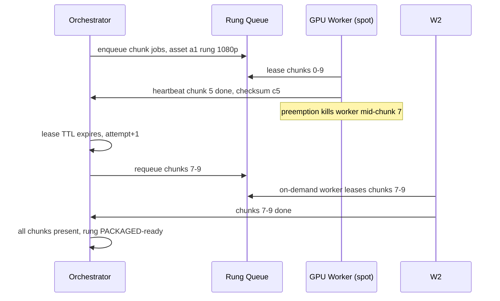

# Case Study: Design a Video Transcoding Pipeline (YouTube-Scale Ingest)

## Overview

"Design the system that turns an uploaded video into playable streams" is the ingest half of the video question — and it is a *factory*: a distributed batch pipeline with GPUs, spot instances, a retry DAG, and a cost-per-hour budget. This walkthrough designs the pipeline from upload to CDN origin: resumable upload, probe, segmenting, the ABR encode ladder, chunk-parallel encoding on a mixed spot/on-demand GPU pool, packaging with HLS/DASH and CMAF, DRM and watermarking, origin serving, and the QoE feedback loop — with the cost math per hour of video worked end to end. The *delivery* side (players, ABR algorithms, CDN caching) is the sibling page [Video Streaming](../video-streaming.md); the end-to-end product views are [YouTube](../real-world/youtube.md) and [Netflix](../real-world/netflix.md). The pipeline is orchestrated exactly like the workflow engine in [Durable Execution Engine](./durable-execution-engine.md) — because it is one.

## Step 1 — Requirements

### Functional

- Creators upload video files (any container/codec, up to 256 GB / 12 h) via **resumable upload** that survives connection churn
- On ingest completion: **probe** (ffprobe-class metadata extraction: resolution, fps, codec, bitrate, duration, SAR), malware/format validation, content-ID fingerprinting, thumbnail + storyboard sprites
- **Transcode** every asset into an **ABR ladder** of renditions (resolutions/codecs/bitrates) with per-title optimization; outputs must be **segment-aligned** across rungs (shared GOP clock) so clients can switch seamlessly (the RFC 8216 Variant Stream invariants)
- **Package** into HLS and DASH from one CMAF (fMP4) media fleet; optional **DRM** (CENC-encrypted media + Widevine/FairPlay/PlayReady license integration) and **forensic watermarking** for leak tracing
- **Publish** atomically: manifests + segments land at the media origin, asset goes searchable; support re-encode, takedown, and partial re-upload flows

### Non-Functional

- **Scale**: 30K hours of video ingested/hour (≈500 h/min) sustained, 10× burst on events
- **Time-to-publish**: p95 < 2 h from upload-complete to public for a 1 h video; priority tier (news/live VOD clip) < 15 min
- **Durability**: a partially failed encode never publishes a broken asset — an asset is public only when every rung's manifest verifies; no rung is ever left half-written behind a published manifest
- **Cost**: encode cost budgeted per output hour (worked in Deep Dive 3); spot/preemptible GPUs are the default, with preemption handled by design, not by heroics
- **Quality invariants**: cross-rung segment alignment (same keyframe timestamps), deterministic encoder settings per chunk, audio bitstream shared across rungs — the properties [Video Streaming](../video-streaming.md) requires from the player side
- **Retries**: any step re-runs idempotently; a chunk job re-run produces byte-identical output (or is versioned and swapped atomically)

## Step 2 — Back-of-Envelope Estimation

| Quantity | Assumption | Result |
|---|---|---|
| Ingest rate | 30K output-hours ingested/hour | ~8.3 video-hours/s entering the factory |
| Ladder output bitrate | 10 rungs, ~22 Mbps total across rungs (table below) | ~9.9 GB of encoded output per input hour |
| New encoded storage | 30K h/h × 9.9 GB | ~300 TB/hour of new segments (before dedup/retention) |
| Encode throughput, GPU | H.264 1080p ≈ 6× real-time per NVENC-class session; ~3 sessions/GPU | 1 GPU ≈ 18 output-hours of 1080p-equivalent per wall-hour |
| Ladder cost multiplier | 4K rung ≈ 4× 1080p cost per output hour; total ladder ≈ 7–8× | ~0.42 GPU-hours per output hour across the ladder |
| GPU fleet | 0.42 GPU-h/output-h × 30K output-h/h | ~12.6K GPU-hours consumed per wall-hour → ~12.6K GPUs busy at steady state |
| Cost per output hour | Blended $0.35/GPU-h (80% spot @ ~$0.25, 20% on-demand @ ~$0.75) | ~$0.15 per ingested hour for encode; ~$0.03 storage/mo per hour at 9.9 GB |
| Segmenting/probe | CPU-bound, 1 h video probes + segments in ~2 min on 8 vCPU | ~1K vCPUs for probe at peak — trivial next to encode |

The insight to state: the pipeline is **GPU-cost-bound and failure-bound**, not I/O-bound — the storage numbers are large but cheap; the design problems are packing the GPU fleet above 70% utilization, surviving spot preemption every few minutes, and keeping the retry DAG from re-encoding hours of finished work.

## Step 3 — API Sketch

```text
POST /v1/uploads                     → upload_id, chunk_size (8 MB), upload URLs
PUT  /v1/uploads/{id}/chunks/{n}     → 200 | 308 (Resume Incomplete, per-byte-range)
POST /v1/uploads/{id}/complete       → asset_id (starts pipeline)
GET  /v1/assets/{id}                 → { state, progress: { probe, encode, package, publish } }
GET  /v1/assets/{id}/renditions      → [ { rung, codec, bitrate, segments, drm_key_id } ]
POST /v1/assets/{id}/reencode        { rungs: ["2160p-av1"], reason }  # targeted re-encode
POST /v1/assets/{id}/takedown        → tombstone + CDN purge
```

Asset state machine (the orchestrator's contract):

```text
UPLOADED → PROBING → SEGMENTED → ENCODING → PACKAGING → PUBLISHED
                ↘ REJECTED (corrupt, duplicate, policy-fail)
ENCODING → ENCODE_PARTIAL (retries)   PACKAGING → REPACKAGING (manifest fix)
PUBLISHED → REENCODING (add rung)     any → TAKEN_DOWN
```

## Step 4 — High-Level Architecture



- **Upload gateway** splits files into ~8 MB chunks with per-chunk checksums and a byte-range completion bitmap; `complete` is rejected until every chunk verifies. Retries are free because chunks are the idempotency unit — the same trick the encode DAG reuses downstream
- **Orchestrator**: one durable workflow per asset (the [Durable Execution Engine](./durable-execution-engine.md) pattern; the sibling [Case Study: Distributed Task Scheduler](./distributed-task-scheduler.md) covers the cron-flavored cousin). Its event history is the pipeline's audit log: which chunks, which attempts, which worker, which output checksum
- **Segmenter**: cuts the source into chunks on GOP boundaries — chunks are the parallelism unit and the retry unit. Every chunk carries `(asset_id, rung, chunk_index, first_keyframe_ts)`; outputs are content-addressed by that key plus encoder settings hash
- **GPU fleet**: heterogeneous pools — spot GPU nodes (majority) + on-demand baseline for deadline-critical tiers. Scheduling deep-dive in Deep Dive 3; the eviction math itself is [Spot and Preemptible Instances](../../../cloud/spot-preemptible.md)
- **Packager**: pulls encoded chunk outputs, validates durations/pts continuity, writes CMAF segments, generates HLS media+master playlists and DASH MPDs from one manifest model, applies CENC encryption when the asset is DRM-flagged
- **Publish**: manifests land at the origin **last** — the origin is sharded by asset id, and publish is a single manifest flip, so partially-encoded assets are structurally unpublishable

## Step 5 — Data Model



Design points:

- **`settings_hash` inside the content address**: a chunk's output key is derived from `(asset_id, rung, chunk_index, settings_hash)` — changing encoder settings produces a *new* address instead of overwriting, which makes re-encodes safe on live assets and makes the object store the dedup layer
- **The DAG is data**: chunk jobs and their dependencies (chunk *i+1* of the same rung needs chunk *i*'s last-GOP seed frame for some codecs; packaging needs all chunks) are rows, not in-flight state — any crashed orchestrator resumes from the table, exactly the event-sourced discipline of [Durable Execution Engine](./durable-execution-engine.md)
- **`priority_tier` on the asset** flows into every queue: a news clip's 4K rung jumps ahead of a backcatalog AV1 re-encode — priority is a pipeline-first-class concept, not a queue-afterthought

## Deep Dive 1 — The ABR Ladder and Per-Title Encoding

A production ladder for H.264/HEVC/AV1 VOD looks like this (settings are the *contract* between rungs — all rungs encode from one GOP clock, 4 s segments, keyframe-aligned):

| Rung | Resolution | Codec | Target bitrate | Audio | Notes |
|---|---|---|---|---|---|
| 0 | 240p @ 30fps | H.264 | 400 kbps | AAC 64k | floor rung; 2 s segments |
| 1 | 360p | H.264 | 800 kbps | AAC 64k | |
| 2 | 480p | H.264 | 1.4 Mbps | AAC 96k | |
| 3 | 720p | H.264 | 2.8 Mbps | AAC 128k | most-watched rung on mobile |
| 4 | 1080p | H.264 | 5.0 Mbps | AAC 128k | reference rung |
| 5 | 1080p | HEVC | 3.2 Mbps | AAC 128k | codec ladder parallel |
| 6 | 1440p | VP9/HEVC | 9.0 Mbps | AAC 192k | |
| 7 | 2160p | HEVC | 16.0 Mbps | AAC 192k | |
| 8 | 2160p | AV1 | 11.0 Mbps | AAC 192k | ~30% bitrate saving, ~5–10× encode cost |
| 9 | 2160p HFR | AV1 | 18.0 Mbps | AAC 192k | 60fps sources only |

Ladder sum ≈ 68 Mbps across all rungs; the *common* H.264 ladder (rungs 0–4) is the ~10.4 Mbps every asset must have, which is why the storage and fleet math in Step 2 uses the common ladder and treats codec ladders as opt-in by viewership.

- **Per-title encoding**: the fixed ladder assumes content is "average." Probe the source at a few bitrates (e.g., 3–5 one-pass encodes of short samples), fit the rate-distortion curve, and pick the rungs that lie on the convex hull — a static talking-head gets 1080p@2.4 Mbps that looks better than 1080p@5 Mbps on a cinematic source gets 5 Mbps *plus* a 720p rung that actually helps. The per-title fit is computed once by the probe service and stored on the asset; rungs are then instantiated from it
- **Ladder decisions are cost decisions**: every rung is a full copy of the catalog (the storage multiplication worked out in [Video Streaming](../video-streaming.md)); per-title laddering typically removes 1–2 useless rungs per asset — at 300 TB/hour of new encoded output, dropping 15% of rungs is a fleet-sized saving
- **Cross-rung invariants are enforced at packaging time**: packaging re-checks that every rung's segment boundary timestamps match the reference rung's within tolerance and rejects the asset otherwise — misaligned keyframes are the classic "video plays fine but switching pops" bug, and it is cheaper to catch at publish than in playback

## Deep Dive 2 — Chunk-Parallel Encoding and the Retry DAG

Encoding one 1 h video as one 1 h job is the naive design; the factory cuts each rung into GOP-aligned chunks and encodes them in parallel:



And the failure model — a retry DAG with per-chunk idempotency:



Mechanics that make parallel chunking safe:

- **Chunk boundaries only at IDR keyframes**, and chunk length = whole GOPs (e.g., 4 s GOPs → 15 s chunks of 4 GOPs): intra-chunk encoding never depends on data outside the chunk except the **seed frame** (the last decoded frame of chunk *i* passed to chunk *i+1*) for rate control continuity — one frame of state, not a whole stream
- **Deterministic settings per chunk**: fixed quantizer/rate-control mode chosen so that identical inputs + identical settings produce identical outputs; the output's checksum is verified against a re-run before publish when a chunk job reports suspicious stats (bitrate outliers > 3σ of its rung)
- **Idempotency keys are free**: `(asset_id, rung, chunk_index, settings_hash)` *is* the dedup key — a re-queued chunk that someone already encoded hits the content-addressed output and no-ops. Same discipline as the scheduler's `idem_key` in [Case Study: Distributed Task Scheduler](./distributed-task-scheduler.md)
- **Retry policy per chunk**: 3 attempts with backoff on transient failures (worker preemption, GPU ECC error, OOM on 4K rung); a chunk failing 3 times marks the *rung* degraded and either re-encodes the whole rung on on-demand hardware (suspect the settings, not the luck) or drops the rung for non-critical tiers. Assets never publish with a degraded reference-ladder rung
- **Fan-in is the serializer**: packaging can't start until all chunks of the rung verify — for a 2 h 4K asset that's ~480 chunks × 10 rungs ≈ 4.8K chunk jobs per asset, which is why the fleet math in Step 2 matters more than per-chunk latency

## Deep Dive 3 — GPU Pool Scheduling: Spot, Preemption, and Cost per Hour

The fleet is mixed by design:

| Pool | Share | Hardware | Price assumption | Role |
|---|---|---|---|---|
| Spot GPU | 70–80% | 2–3 GPU nodes, eviction on 2-min notice | ~$0.25/GPU-h | Bulk chunk encoding, low-priority re-encodes |
| On-demand GPU | 15–25% | Same, reserved capacity | ~$0.75/GPU-h | Priority-tier assets, deadline-critical, spot-gap backfill |
| CPU overflow | remainder | 64-vCPU nodes | ~$0.30/node-h | Software fallback (VP9/AV1 CPU paths), probe, packaging |

- **Preemption handling is a queue property, not a heroic property**: chunk jobs are small (15 s of video ≈ 1–3 min of GPU work), so eviction mid-job costs one chunk, not one asset. Workers checkpoint nothing — the orchestrator's lease TTL expiry (2 min notice honored by finishing the current chunk, then draining) plus requeue is the whole mechanism. The eviction math and checkpoint-on-boundary pattern are exactly [Spot and Preemptible Instances](../../../cloud/spot-preemptible.md)
- **Bin-packing rungs to GPUs**: a GPU runs multiple encoder sessions concurrently (NVENC sessions or SR-IOV slices); the queue groups same-rung chunks per node to reuse decoder contexts and avoid re-uploading the source — source-fetch is a real cost at 4K (a 40 GB source re-read per rung per node), so rungs are scheduled in passes (all H.264 rungs share one decoded pass where the encoder allows scalpel-free two-pass setups; otherwise one decode cache per node)
- **Priority and fairness**: queues are per priority-tier with weighted sharing — the news-tier preempts backcatalog AV1 re-encodes by queue order, not by killing jobs. Backfill re-encodes run only in the spot pool and are the first thing shed under pressure
- **Cost math per output hour** (the interview table):

| Line item | Assumption | Cost per output hour |
|---|---|---|
| Encode GPU (common ladder) | 0.42 GPU-h × $0.35 blended | ~$0.15 |
| AV1 re-encode (opt-in rungs) | +1.8 GPU-h × $0.25 spot | ~$0.45 (per enabled asset) |
| Storage (new segments) | 9.9 GB × $0.015/GB-mo (transient tiers) | ~$0.15/mo, amortized over views |
| Origin egress avoided | CDN hit ratio 99%+ (shield pattern) | ~$0.01 per 1K plays at origin |
| **Total per newly ingested hour** | | **≈ $0.60–0.80 first month, dominated by encode + storage** |

State the sensitivity honestly: AV1 doubles-plus the per-hour cost for ~30% bitrate savings, so it is a *viewership*-gated decision (encode the top-N% of watched assets in AV1), not a default. The same gating logic drives per-title ladder pruning — the factory's cheapest optimization is not encoding things nobody watches (defer non-reference rungs until first view).

## Deep Dive 4 — Packaging, DRM, Watermarking, and the Origin

- **One media fleet, two manifests**: CMAF (fMP4) segments are shared by HLS and DASH — the packager emits HLS playlists and DASH MPDs pointing at the same segment objects, halving storage vs. dual TS/fMP4 fleets. Segment URIs are stable and content-addressed, so CDN caches key on the segment, and manifests carry short TTLs
- **DRM**: when the asset is DRM-flagged, packager encrypts with CENC (AES-128) under a content key from the key-management service; license servers (Widevine/FairPlay/PlayReady) request keys per-device with policy (resolution caps, offline windows, HDCP enforcement). Key material never touches the pipeline's queues or logs — the packager references a `key_id`, and the chunk-parallel path encrypts per-chunk with the same key id, keeping parallelism without scattering secrets
- **Forensic watermarking**: for leak-traced premium assets, a per-session (or per-user-cohort) invisible watermark is inserted at packaging or at the CDN edge (edge insertion is cheaper: one stored master per variant, watermark applied per session). It is a storage/cost trade — per-session watermarks at packaging multiply stored variants and are reserved for the highest-value catalog
- **Media origin**: segments are immutable and sharded by asset id across origin clusters; manifests are the only mutable objects. The origin sits behind the CDN with an **origin shield** tier (one request per object per shield POP misses through — the CloudFront Origin Shield pattern), so viral assets generate ~zero origin load. Publish flips the manifest; takedown purges manifests (segments may be purged lazily, tombstoned at origin first)
- **Byte-range addressing**: one physical segment object can back multiple logical segments (per the EXT-X-BYTERANGE model), cutting small-object overhead at the origin and improving CDN cache efficiency — an origin-design decision that pays at 300 TB/hour

## Deep Dive 5 — QoE Metrics and the Feedback Loop

- **Pipeline SLOs** (the factory's own health): time-to-publish p95 per tier, chunk-encode p50/p99 by rung, spot-eviction rate and its effect on time-to-publish, packaging verification failures, publish rollback rate. The last one is the invariant metric: rollbacks should be ~zero because publishing requires every rung verified
- **Player QoE** (consumed from the delivery side — see [Video Streaming](../video-streaming.md)): startup latency, rebuffer ratio, average delivered bitrate, switch rate, and per-rung watch share. The factory's contribution: per-rung watch share tells you which rungs earn their storage; rebuffer correlated with missing low rungs is a ladder bug
- **The loop**: QoE + watch-share feeds ladder generation (add/prune rungs, retune per-title curves) and codec rollout (AV1 for the top watch-share assets). Ladder changes are pipeline config changes — versioned, canaried on a small asset cohort, and rolled back by the same asset-state machinery, not by hand-edited encoder configs
- **Content-quality gates**: probe-stage black-frame/silence detectors and encode-stage VMAF scores per rung (sampled, not every chunk) catch bad sources and encoder regressions before publish; a fleet-wide VMAF drop after an encoder rollout is an automatic halt — the same guardrail discipline as the flag service's rollout tripwires in [Case Study: Feature Flag Service](./feature-flag-service.md)

## Bottlenecks & Follow-Up Questions

- **Fan-in at packaging**: 4.8K chunk outputs per large asset means the validator and muxer are the stragglers. Follow-ups: validate incrementally (chunk-level verification at encode completion, rung-level at fan-in), and pipeline packaging per rung instead of per asset
- **Spot capacity events** (regional spot reclamation waves): a 30% fleet eviction at once slows the whole catalog. Follow-ups: multi-region spot pools with queue-level failover, on-demand baseline sized for the priority tier only (never for the mean), and admission-shaping of backcatalog re-encodes
- **Source fetch cost at 4K**: re-reading a 40 GB source per rung. Follow-ups: per-node decode cache, rung co-scheduling, and two-pass encoders that reuse the pass-1 analysis across rungs
- **Orchestrator history size**: a 4.8K-chunk asset produces tens of thousands of events per rung. Follow-ups: the continue-as-new pattern from [Durable Execution Engine](./durable-execution-engine.md) — checkpoint the rung into a fresh workflow once packaging starts; keep only summaries in the parent
- **AV1 economics**: 5–10× encode cost for ~30% savings is a loss below a viewership threshold. Follow-up: viewership-gated codec ladder, hardware-AV1 encoders as they land in the fleet
- **Duplicate/abusive uploads**: content-ID fingerprinting at probe dedupes re-uploads before any GPU is spent — the cheapest job is the one never enqueued

## Interview Questions

1. **Why segment into chunks before encoding, and what does chunk-parallelism cost you?** Chunks (15 s, GOP-aligned) are the parallelism, retry, and idempotency unit: thousands of small GPU jobs replace one multi-hour job, spot preemption costs one chunk, and re-encodes touch only the affected rung. The costs are rate-control continuity (solved with a one-frame seed handoff), cross-chunk quality drift (solved with deterministic settings plus checksum verification), and fan-in overhead at packaging. Without GOP-aligned boundaries you get keyframe pops at chunk seams — the alignment invariant is what the player depends on for seamless ABR switching.
2. **Your spot GPU pool gets a 40% eviction wave. What happens and what do you design for?** In-flight chunk jobs die mid-encode; lease TTLs expire; the orchestrator requeues those chunks, which land on surviving spot nodes and the on-demand baseline. Because chunks are small and idempotent, no asset state is corrupted — time-to-publish stretches, nothing fails. The design levers: multi-region spot pools, priority tiers that always have on-demand headroom, shedding backcatalog re-encodes first, and alerting on eviction rate as a leading indicator. Sizing the on-demand baseline for the *mean* load is the anti-pattern — it must cover the priority tier plus recovery headroom.
3. **Walk the cost of one ingested hour through your pipeline.** Encode is ~0.42 GPU-hours across the common ladder (per-rung pixel-proportional cost, 4K ≈ 4× 1080p), ≈ $0.15 blended at 80% spot; opt-in AV1 adds ~$0.45 on spot; new encoded storage is ~9.9 GB per hour ≈ $0.15/month in transient tiers; origin egress is engineered toward zero via the origin-shield pattern and 99%+ CDN hit ratios. First-month cost lands around $0.60–0.80 per hour. The interview point is the levers: per-title ladder pruning, viewership-gated codecs, and not encoding rungs nobody watches yet.
4. **How do you guarantee a partially encoded asset is never publicly playable?** Publish is a manifest flip at the origin, and manifests are generated only after every rung in the asset's reference ladder passes continuity validation (pts continuity, duration match, alignment against the reference rung). Segments are content-addressed and immutable, so there is no partial-write window on media; a degraded non-reference rung may be absent (clients fall down the ladder), but a degraded reference-ladder rung blocks publish. Takedown inverts the flip: manifests purge first, segments tombstone lazily.
5. **Where does this pipeline need durable execution, and where would a plain queue suffice?** The per-asset orchestration (multi-day fan-out/fan-in, timers for stalled rungs, resumable after any crash, full audit history) is exactly durable-execution territory — the orchestrator's event history is the pipeline's recovery and audit mechanism. The chunk-encode layer itself is a plain lease-based queue: single-step jobs with idempotency keys and retries don't need replayable state. The skill being probed is not using the heavy tool everywhere, but drawing the boundary — workflow for the DAG, queue for the leaves.
6. **A new encoder version ships and VMAF drops fleet-wide by 8 points two days later. What did your design do?** The quality gate should have caught it before publish: per-rung VMAF sampling with a fleet-wide drop threshold halts the rollout automatically, and because encoder settings hash into the content address, the old outputs are untouched — canary assets encoded with the new version are a separate content-addressed set, and rollback is a pipeline-config flip plus re-encode of the canary cohort. This is the same guardrail/auto-halt contract as feature rollouts; the failure it prevents is silently degrading every new upload for days.

## Key Takeaways

- Video ingest is a batch factory: the numbers that matter are GPU-hours per output hour, spot-eviction behavior, and storage multiplication per rung — not request latency
- GOP-aligned chunks are the universal unit: parallelism, retry, idempotency, and preemption recovery all key off `(asset, rung, chunk, settings_hash)`
- The ladder is a cost decision: every rung is a full catalog copy, so per-title curve fitting and viewership-gated codecs (AV1) are fleet-scale economics, not encoder trivia
- Publish is a manifest flip gated on full-ladder validation — structural impossibility of publishing partial assets beats any amount of checking elsewhere
- Spot GPUs are the default with eviction absorbed by job size; on-demand covers priority tiers, never the mean
- The orchestrator is a durable workflow; the encoders are a queue — knowing which layer gets which machinery is the systems judgment the interview tests

## References

- Pantos, R. (Ed.); May, W. "HTTP Live Streaming" (HLS), RFC 8216, August 2017 — playlist model, Variant Stream alignment invariants the ladder must satisfy: https://www.rfc-editor.org/rfc/rfc8216.txt
- DASH Industry Forum, "DASH-IF Interoperability Points, V5.0 (IOP V5)" — DASH packaging profile over CMAF: https://dash-industry-forum.github.io/guidelines/iop-v5/
- Apple HLS authoring documentation — ladder and segment-authoring guidance: https://developer.apple.com/streaming/
- FFmpeg documentation — probe (ffprobe) and encoder behavior referenced throughout: https://ffmpeg.org/ffmpeg.html
- Amazon Web Services, "Use Amazon CloudFront Origin Shield" — the origin-shield pattern behind the media origin: https://docs.aws.amazon.com/AmazonCloudFront/latest/DeveloperGuide/origin-shield.md
- Netflix Tech Blog, "Per-Title Encode Optimization" — origin of per-title ladder fitting (blocks automated fetchers; cited by title per this book's verification policy)
- Temporal documentation — the durable-execution model the per-asset orchestrator follows: https://docs.temporal.io/
- Apache Kafka documentation — event bus for asset state and pipeline telemetry: https://kafka.apache.org/documentation/

## Cross-References

- [Video Streaming](../video-streaming.md) — the player/ABR/delivery half that consumes this pipeline's output
- [How YouTube Works](../real-world/youtube.md) — end-to-end product view; this page is its ingest factory in depth
- [How Netflix Works](../real-world/netflix.md) — Open Connect and the commercial counterpart of the ladder economics
- [Spot and Preemptible Instances](../../../cloud/spot-preemptible.md) — eviction math and checkpoint-on-boundary scheduling behind the GPU fleet
- [Durable Execution Engine](./durable-execution-engine.md) — the workflow model the per-asset orchestrator implements
- [Case Study: Distributed Task Scheduler](./distributed-task-scheduler.md) — lease-based assignment and idempotency keys reused by the chunk layer
- [Batch Processing](../../../data-engineering/batch-processing.md) — DAG orchestration and idempotent partitioned jobs the pipeline generalizes
- [Capacity Planning](../hld/capacity-planning.md) — the fleet-sizing method behind the GPU math
