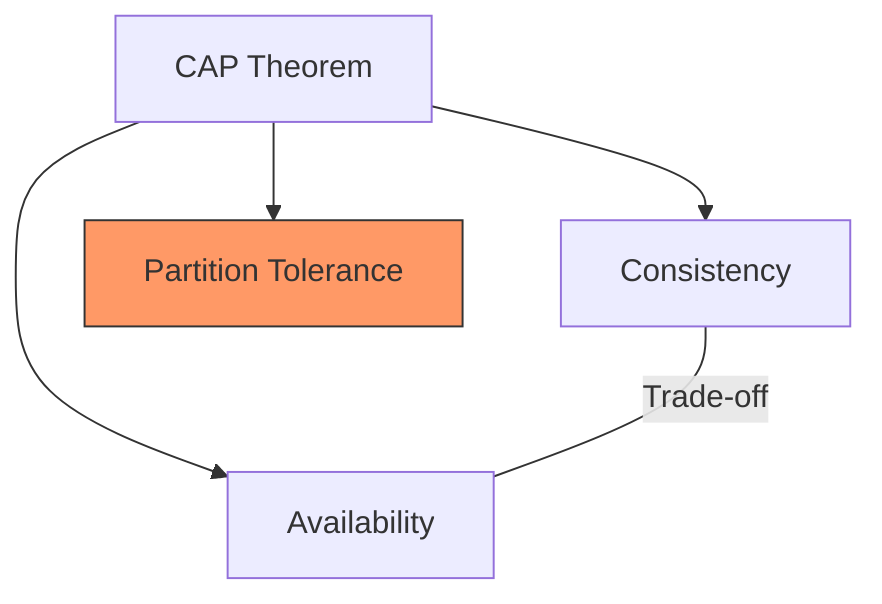
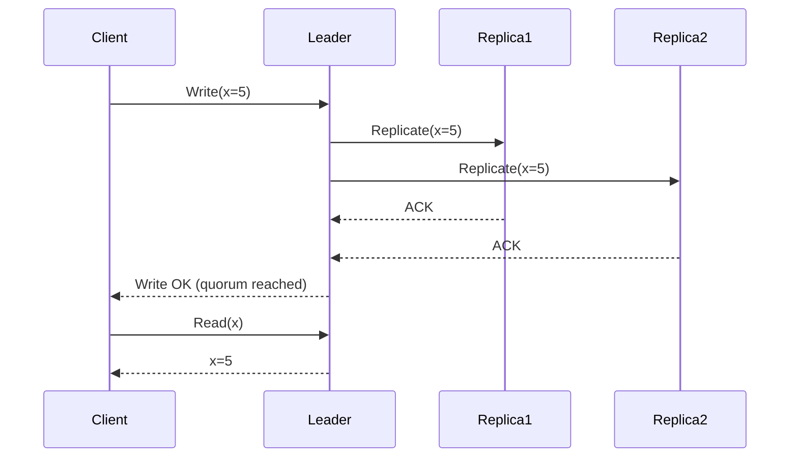
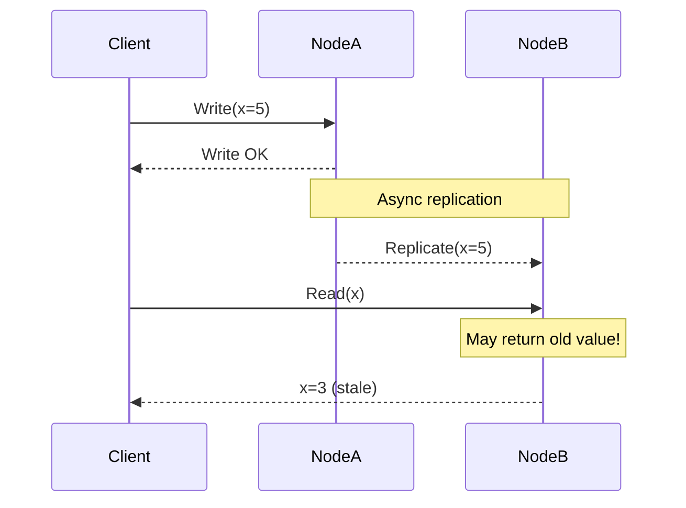
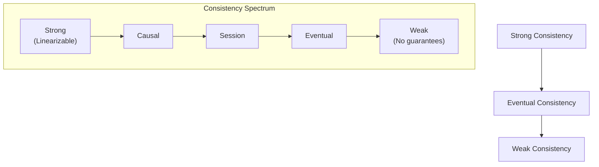

# Consistency Patterns

## Overview

Consistency defines the rules for when and how updates become visible across distributed nodes. Choosing the right consistency model is one of the most critical decisions in distributed system design. The three main patterns — **strong**, **eventual**, and **weak** consistency — represent different trade-offs between correctness, availability, and performance.

## The CAP Theorem Context

The CAP theorem (Brewer, 2000) states that a distributed system can guarantee at most two of three properties:

- **Consistency (C)**: Every read receives the most recent write
- **Availability (A)**: Every request receives a response (success or failure)
- **Partition Tolerance (P)**: The system continues operating despite network partitions

Since network partitions are unavoidable in distributed systems, the real choice is between **CP** (consistency over availability) and **AP** (availability over consistency).



## Strong Consistency

### Definition
After a write completes, all subsequent reads will return that value. The system behaves as if there's a single copy of the data.

### How It Works
- Writes are **synchronously replicated** to a quorum or all replicas before being acknowledged
- Reads always contact the leader or a quorum
- Often implemented via **consensus protocols** (Raft, Paxos, ZAB)

### Implementation: Quorum-Based

For N replicas with W (write quorum) and R (read quorum):
- **W + R > N** guarantees strong consistency
- Example: N=3, W=2, R=2 → any read overlaps with any write



### Use Cases
- Financial transactions (banking, stock trading)
- Inventory management (prevent overselling)
- Distributed locks and leader election
- Sequence number generation

### Examples
- Google Spanner (TrueTime-based strong consistency)
- CockroachDB (Raft-based)
- ZooKeeper (ZAB protocol)
- etcd (Raft protocol)

### Trade-Offs
| Pro | Con |
|-----|-----|
| Correctness guaranteed | Higher latency (synchronous replication) |
| Simple mental model | Lower availability during partitions |
| No stale reads | Reduced throughput (quorum overhead) |

## Eventual Consistency

### Definition
If no new updates are made, all replicas will **eventually** converge to the same value. There's no guarantee about *when* convergence happens.

### How It Works
- Writes are acknowledged immediately (local or single-node write)
- Updates propagate **asynchronously** to replicas
- Conflicts are resolved via strategies (last-write-wins, vector clocks, CRDTs)

### Conflict Resolution Strategies

**Last-Write-Wins (LWW)**
- Simplest approach; uses timestamps to pick the winner
- Problem: clock skew can cause data loss

**Vector Clocks**
- Each node maintains a version vector
- Detects concurrent writes; application resolves conflicts
- Used by Amazon DynamoDB (pre-2017), Riak

**CRDTs (Conflict-free Replicated Data Types)**
- Data structures that mathematically guarantee convergence
- Types: G-Counter, PN-Counter, OR-Set, LWW-Register
- Used by Redis (CRDT mode), Automerge, Yjs



### Use Cases
- Social media feeds (posts appear eventually)
- DNS records
- Shopping cart (Amazon Dynamo model)
- Content delivery networks
- User profile updates

### Examples
- Amazon DynamoDB (default mode)
- Apache Cassandra (tunable consistency)
- CouchDB
- DNS

### Trade-Offs
| Pro | Con |
|-----|-----|
| High availability | Stale reads possible |
| Low latency writes | Conflict resolution complexity |
| Scales globally | Application must handle inconsistency |

## Weak Consistency

### Definition
After a write, there's **no guarantee** that subsequent reads will return the written value. The system provides a "best effort" approach.

### How It Works
- Writes may be buffered locally
- Reads may hit any replica regardless of sync state
- Often used with **session consistency** or **read-your-writes** guarantees as add-ons

### Variants

**Causal Consistency**
- Operations that are causally related are seen in order
- Concurrent operations may be seen in different orders
- Stronger than eventual, weaker than strong

**Read-Your-Writes**
- A user always sees their own writes
- Other users may see stale data

**Monotonic Reads**
- Once you read a value, you'll never see an older value
- Prevents "going back in time"

**Session Consistency**
- Consistency guarantees scoped to a user session
- Combines read-your-writes + monotonic reads



### Use Cases
- Real-time multiplayer games (slight staleness OK)
- Live video streaming metadata
- IoT sensor data aggregation
- Analytics and metrics

### Trade-Offs
| Pro | Con |
|-----|-----|
| Highest availability | Stale or lost reads possible |
| Lowest latency | Application complexity to handle inconsistency |
| Best partition tolerance | Harder to reason about correctness |

## Tunable Consistency

Some systems let you choose consistency per request:

### Apache Cassandra
- ONE: Acknowledge from 1 node (fastest, weakest)
- QUORUM: Acknowledge from majority (balanced)
- ALL: Acknowledge from all nodes (strongest, slowest)

```python
# Cassandra consistency levels
session.execute(
    "INSERT INTO users (id, name) VALUES (?, ?)",
    [user_id, name],
    consistency_level=ConsistencyLevel.QUORUM
)

session.execute(
    "SELECT * FROM users WHERE id = ?",
    [user_id],
    consistency_level=ConsistencyLevel.QUORUM
)
```

### Amazon DynamoDB
- **Eventually consistent reads** (default, higher throughput)
- **Strongly consistent reads** (lower throughput, up-to-date data)

## Comparison Matrix

| Property | Strong | Eventual | Weak |
|----------|--------|----------|------|
| Consistency guarantee | Linearizable | Convergent | None |
| Read latency | Higher | Lower | Lowest |
| Write latency | Higher | Lower | Lowest |
| Availability | Lower | Higher | Highest |
| Complexity | Simpler (for apps) | Moderate | Highest (for apps) |
| Example system | Spanner, etcd | DynamoDB, Cassandra | Memcached, DNS |

## Interview Tips

1. **Start with the requirements** — "Does this system need strong consistency or is eventual OK?"
2. **Use the right terminology** — linearizable, causal, eventual, read-your-writes
3. **Mention CAP explicitly** — "During a partition, we choose availability over consistency (AP system)"
4. **Discuss conflict resolution** — LWW, vector clocks, CRDTs for eventual consistency
5. **Tunable consistency** — show you know systems like Cassandra let you choose per-request
6. **Give concrete examples** — "A banking system needs strong consistency; a social feed is fine with eventual"
7. **Don't forget the PACELC theorem** — Even without partitions, there's a latency-consistency trade-off

## Key Takeaways

- **Strong consistency**: Correct but slow. Use for financial data, inventory.
- **Eventual consistency**: Fast and available but stale reads possible. Use for feeds, DNS, CDNs.
- **Weak consistency**: Fastest, no guarantees. Use for analytics, IoT.
- **Tunable consistency** (Cassandra, DynamoDB) lets you choose per-request.
- Conflict resolution (LWW, vector clocks, CRDTs) is critical for AP systems.
- PACELC extends CAP: even without partitions, there's a latency vs. consistency trade-off.

## Cross-References

- [Availability Patterns](./availability-patterns.md)
- [CAP Theorem](./hld/consistency-tradeoffs.md)
- [Distributed File System](./dfs.md)
- [Key-Value Store](./kv-store.md)
- [Storage Distributed](../../storage/distributed.md)
