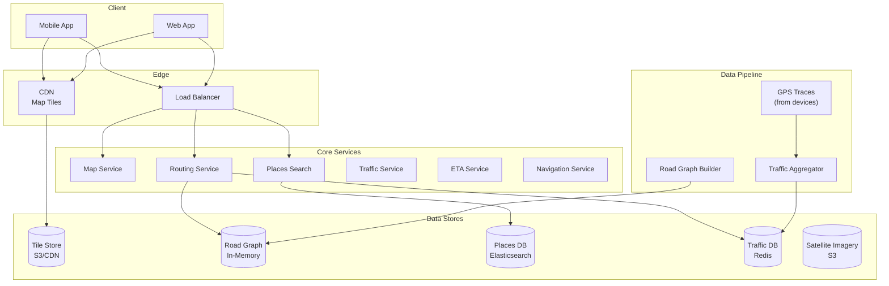
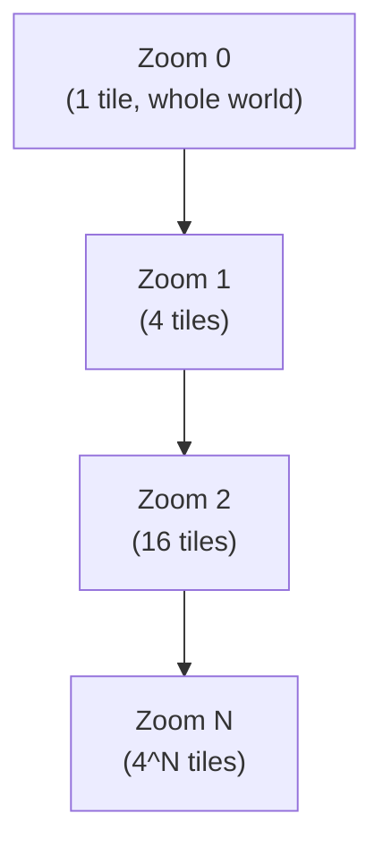
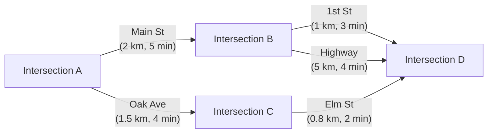
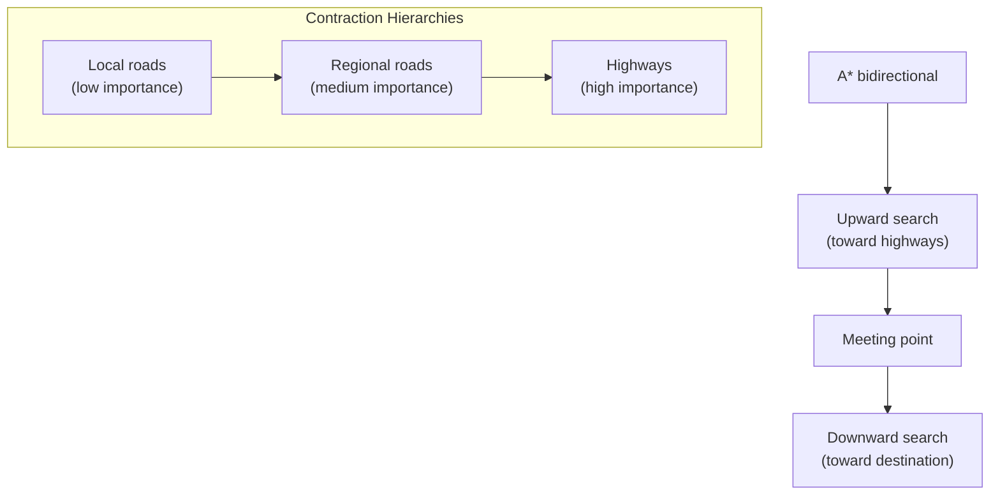
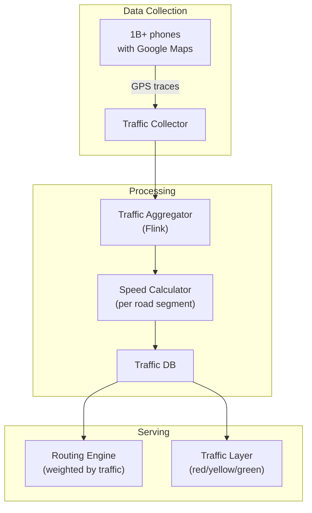
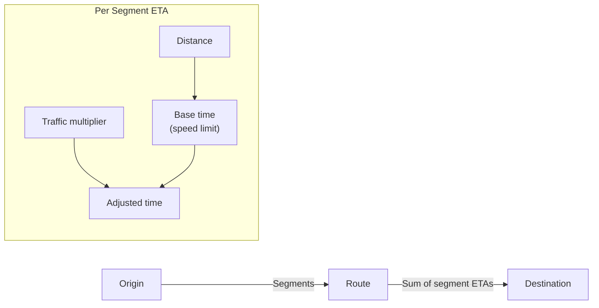
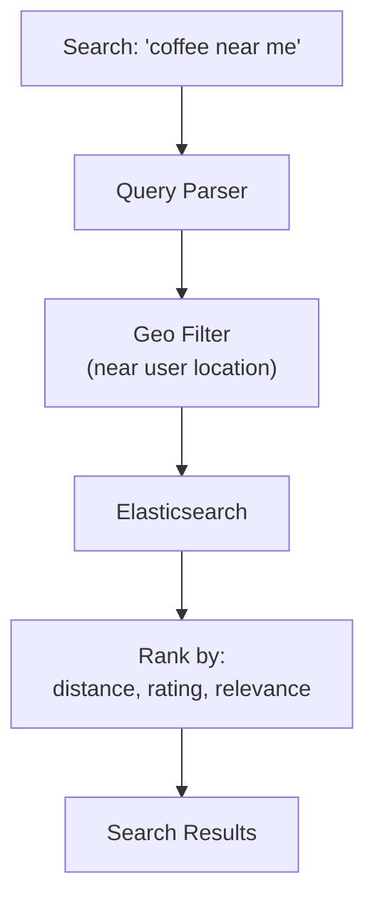

# Design Google Maps

## Overview

Google Maps serves billions of users with navigation, real-time traffic, location search, and satellite imagery. It processes GPS traces from millions of devices to calculate optimal routes and predict traffic. The core challenges are representing the road network as a graph, computing shortest paths efficiently, and handling real-time traffic updates.

## Requirements

### Functional
- Display a map with streets, buildings, and points of interest
- Search for places (restaurants, gas stations, addresses)
- Turn-by-turn navigation with ETA
- Real-time traffic visualization
- Multiple transport modes (driving, walking, cycling, transit)
- Street View imagery
- Offline maps

### Non-Functional
- **Scale**: 1+ billion monthly active users
- **Latency**: Route calculation < 500ms, map tiles < 200ms
- **Freshness**: Traffic updated every 1-2 minutes
- **Availability**: 99.99%
- **Storage**: Petabytes of map data and satellite imagery

## Architecture



## Deep Dive: Map Tiles

Maps are served as pre-rendered **tiles** — small square images at different zoom levels.



**Tile system:**
- Each tile is 256×256 pixels
- Tiles identified by (zoom, x, y) coordinates
- Higher zoom = more detail, more tiles
- Tiles are pre-rendered and cached on CDN

**Tile URL pattern:**
```
https://tile.server/{z}/{x}/{y}.png
```

**Storage:**
```
Zoom 0: 1 tile
Zoom 10: ~1M tiles
Zoom 20: ~1 trillion tiles (only populated areas stored)
Total: ~100 PB of tile data
```

## Deep Dive: Road Network Graph

The road network is represented as a weighted directed graph.



**Graph representation:**
```python
# Node: intersection
node = {
    "id": 12345,
    "lat": 37.7749,
    "lng": -122.4194,
    "edges": [edge1, edge2, ...]
}

# Edge: road segment
edge = {
    "from_node": 12345,
    "to_node": 67890,
    "distance_m": 2000,
    "base_time_s": 300,      # without traffic
    "road_type": "highway",
    "speed_limit": 65,
    "one_way": True
}
```

**Graph size:**
- US road network: ~4.2 million miles of roads
- Nodes: ~50 million intersections
- Edges: ~100 million road segments
- Memory: ~10 GB (fits in a single server's RAM)

## Deep Dive: Routing Algorithms

### Dijkstra's Algorithm (Baseline)

```python
import heapq

def dijkstra(graph, start, end):
    distances = {start: 0}
    pq = [(0, start)]
    previous = {start: None}
    
    while pq:
        current_dist, current = heapq.heappop(pq)
        
        if current == end:
            return reconstruct_path(previous, end)
        
        for edge in graph.edges(current):
            neighbor = edge.to_node
            new_dist = current_dist + edge.weight
            
            if neighbor not in distances or new_dist < distances[neighbor]:
                distances[neighbor] = new_dist
                previous[neighbor] = current
                heapq.heappush(pq, (new_dist, neighbor))
    
    return None  # No path found
```

**Time complexity:** O((V + E) log V) — too slow for continental-scale graphs.

### A* Algorithm (With Heuristic)

A* uses a heuristic to guide the search toward the destination:

```python
def a_star(graph, start, end):
    g_score = {start: 0}
    f_score = {start: heuristic(start, end)}
    pq = [(f_score[start], start)]
    
    while pq:
        current = heapq.heappop(pq)[1]
        
        if current == end:
            return reconstruct_path(current)
        
        for edge in graph.edges(current):
            tentative_g = g_score[current] + edge.weight
            
            if tentative_g < g_score.get(edge.to_node, float('inf')):
                g_score[edge.to_node] = tentative_g
                f_score[edge.to_node] = tentative_g + heuristic(edge.to_node, end)
                heapq.heappush(pq, (f_score[edge.to_node], edge.to_node))

def heuristic(node, end):
    # Euclidean distance / max speed
    return haversine(node, end) / 130  # 130 km/h max
```

### Contraction Hierarchies (CH) — Google's Approach

The key insight: on long trips, you'll use highways. Pre-compute shortcuts for highway routes.



**How CH works:**
1. **Preprocessing**: Rank nodes by importance (highways > regional > local)
2. **Contraction**: Add shortcut edges that bypass unimportant nodes
3. **Query**: Bidirectional search — only move "up" in the hierarchy
4. **Result**: Routes computed in microseconds (vs seconds for Dijkstra)

**Performance:**
- Dijkstra: ~1 second for continental routes
- A*: ~100ms
- Contraction Hierarchies: ~1ms (1000x faster)

## Deep Dive: Real-Time Traffic



**Traffic data pipeline:**
1. Phones send GPS traces (anonymized) every few seconds
2. Map-match GPS points to road segments
3. Calculate average speed per segment (compare to free-flow speed)
4. Color segments: green (normal), yellow (slow), red (very slow)
5. Update routing weights: `travel_time = distance / current_speed`

**Traffic prediction:**
- Historical patterns: Monday 8am traffic differs from Sunday 8am
- Real-time data: current speed on each segment
- ML model: predict future traffic based on historical + current
- Used for ETA prediction: "You'll arrive at 5:23 PM"

## Deep Dive: ETA Estimation



**ETA calculation:**
```python
def calculate_eta(route, traffic_data):
    total_time = 0
    
    for segment in route.segments:
        # Base time from road type and speed limit
        base_time = segment.distance / segment.speed_limit
        
        # Traffic multiplier (1.0 = free flow, 2.0 = twice as slow)
        traffic_multiplier = traffic_data.get_multiplier(segment.id)
        
        # Adjusted time
        segment_time = base_time * traffic_multiplier
        total_time += segment_time
    
    # Apply ML correction
    ml_adjustment = ml_model.predict(route, current_time, weather)
    total_time *= ml_adjustment
    
    return total_time
```

## Deep Dive: Place Search



**Place data:**
```json
{
    "place_id": "ChIJN1t_tDeuEmsRUsoyG83frY4",
    "name": "Blue Bottle Coffee",
    "type": "cafe",
    "location": {"lat": 37.7749, "lng": -122.4194},
    "rating": 4.5,
    "reviews_count": 2500,
    "address": "123 Main St, San Francisco, CA",
    "hours": {...}
}
```

## Scalability

| Component | Strategy |
|-----------|---------|
| Map tiles | Pre-rendered, cached on CDN |
| Road graph | In-memory (~10GB), replicated |
| Routing | Contraction Hierarchies (microsecond queries) |
| Traffic | Flink streaming, Redis for real-time data |
| Places | Elasticsearch with geo-index |
| Satellite imagery | S3 + CDN |
| GPS traces | Kafka → Flink → aggregated speed data |

## Trade-Offs

| Decision | Benefit | Cost |
|----------|---------|------|
| Pre-rendered tiles | Fast map display | Storage cost, update lag |
| Contraction Hierarchies | Microsecond routing | Hours of preprocessing |
| GPS-based traffic | Real-time updates | Privacy concerns, battery drain |
| In-memory road graph | Fast routing | Limited to one server's RAM |
| ML-based ETA | More accurate | Requires training data |

## Interview Tips

1. **Start with the map tiles** — pre-rendered images cached on CDN, identified by (z, x, y)
2. **Explain the road graph** — weighted directed graph with ~100M edges, fits in memory
3. **Discuss routing algorithms** — Dijkstra (baseline) → A* (heuristic) → Contraction Hierarchies (production)
4. **Mention real-time traffic** — GPS traces from 1B+ phones, aggregated per road segment
5. **Talk about ETA** — base time × traffic multiplier × ML adjustment
6. **Don't forget place search** — Elasticsearch with geo-index
7. **Discuss offline maps** — pre-download tiles + road graph for a region

## Key Takeaways

- Map tiles are pre-rendered 256×256 images cached on CDN, identified by (zoom, x, y).
- Road network is a weighted directed graph (~100M edges) that fits in memory (~10GB).
- Contraction Hierarchies enable microsecond routing by pre-computing highway shortcuts.
- Real-time traffic: GPS traces from 1B+ phones → Flink → speed per road segment.
- ETA = base time × traffic multiplier × ML correction.
- Place search uses Elasticsearch with geo-indexing for location-based queries.
- Offline maps: pre-download tiles + road graph for a geographic region.
