# High Availability

## What is High Availability?

High availability (HA) is a system's ability to remain operational and accessible for a **long period of time**, minimizing downtime. It's measured as a percentage of uptime over a given period.

> **Key Principle**: Availability is not a feature you bolt on — it's an architectural property that must be designed in from the start.

### Availability Levels

| Availability | Downtime per Year | Downtime per Month | Downtime per Day | Common Name |
|-------------|-------------------|-------------------|-----------------|-------------|
| 99% | 3.65 days | 7.3 hours | 14.4 minutes | Two nines |
| 99.9% | 8.76 hours | 43.8 minutes | 1.44 minutes | Three nines |
| 99.99% | 52.6 minutes | 4.38 minutes | 8.6 seconds | Four nines |
| 99.999% | 5.26 minutes | 26.3 seconds | 0.86 seconds | Five nines |

### What Each Level Means
- **99% (two nines)**: Acceptable for internal tools, dev environments, non-critical services
- **99.9% (three nines)**: Standard for most web applications, SaaS products
- **99.99% (four nines)**: Expected for critical services (banking, e-commerce, healthcare)
- **99.999% (five nines)**: Reserved for life-critical systems (aviation, emergency services)

### The Cost of Downtime

```
Revenue per hour = Annual revenue / 8760 hours

E-commerce ($1B/year): ~$114K/hour downtime cost
SaaS ($100M/year):     ~$11.4K/hour downtime cost
```

**Each additional nine of availability costs significantly more**:
- 99% → 99.9%: Moderate cost (redundancy, monitoring)
- 99.9% → 99.99%: High cost (multi-region, auto-failover)
- 99.99% → 99.999%: Extreme cost (active-active everywhere, zero-downtime everything)

## SLA, SLO, SLI

These three terms are often confused but are distinct concepts that form a hierarchy.

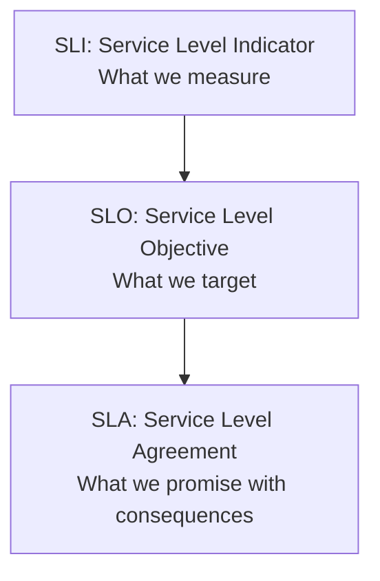

### SLI (Service Level Indicator)
A **quantitative measure** of a service aspect. The raw metrics you collect.

```
SLIs (what we measure):
- Request latency: p50=50ms, p95=150ms, p99=300ms
- Error rate: 5xx responses / total responses
- Throughput: requests per second
- Availability: successful requests / total requests
- Durability: data loss events / total data operations
```

**Common SLIs by service type**:

| Service Type | Key SLIs |
|-------------|----------|
| Web application | Latency (p99), error rate, availability |
| Data pipeline | Throughput, data freshness, completeness |
| Storage | Durability, availability, latency |
| API | Latency, error rate, throughput |
| Video streaming | Buffering ratio, startup time, resolution |

### SLO (Service Level Objective)
The **target value** for an SLI. Defines what "good enough" looks like.

```
SLOs (what we target):
- 99.9% of requests complete in < 200ms (latency SLO)
- Error rate < 0.1% of requests (reliability SLO)
- 99.95% availability (availability SLO)
- p99 latency < 500ms (tail latency SLO)
```

**SLO Design Principles**:
- Set SLOs slightly tighter than SLA (leave margin for error)
- Don't set too many SLOs (focus on what matters to users)
- Review and adjust SLOs based on actual performance
- SLOs should be achievable (aspirational but realistic)

### SLA (Service Level Agreement)
A **contract** with consequences (usually financial) for missing SLOs.

```
SLA (contract with penalties):
- 99.9% uptime guarantee
- If uptime < 99.9%: 10% service credit
- If uptime < 99%: 30% service credit
- If uptime < 95%: Contract termination option
```

### Error Budget

The gap between SLO and 100% is the **error budget** — the amount of failure you can tolerate.

```
SLO: 99.9% availability
Error budget: 0.1% = ~43.8 minutes/month

If you've used 30 minutes of downtime this month:
  Remaining budget: 13.8 minutes → Safe to deploy

If you've used 40 minutes of downtime this month:
  Remaining budget: 3.8 minutes → Freeze deployments, focus on reliability
```

**Error budget policy**:
| Remaining Budget | Action |
|-----------------|--------|
| >50% | Normal development velocity |
| 25-50% | Careful deployments, more testing |
| <25% | Freeze features, focus on reliability |
| 0% | Incident response, no changes until resolved |

## Redundancy

Eliminating single points of failure by duplicating components.

### Types of Redundancy

| Type | How | Resource Use | Failover Time | Use Case |
|------|-----|-------------|---------------|----------|
| **Active-Active** | All nodes serve traffic | 100% | Instant | Load balancing, stateless services |
| **Active-Passive** | Standby takes over on failure | ~50% | Seconds to minutes | Databases, stateful services |
| **N+1** | One extra node for failover | ~(N/N+1) | Seconds | Cost-effective redundancy |
| **N+M** | M extra nodes for N active | ~(N/N+M) | Seconds | Multiple failure tolerance |
| **2N** | Full duplicate of everything | 50% | Instant | Mission-critical (financial, healthcare) |

### Active-Active vs Active-Passive

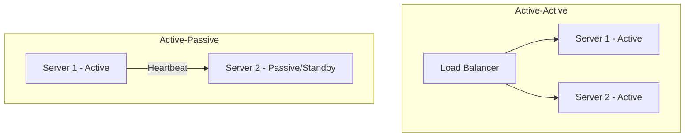

| Aspect | Active-Active | Active-Passive |
|--------|--------------|----------------|
| Resource utilization | 100% (all nodes serving) | ~50% (standby idle) |
| Failover time | Instant (already serving) | Seconds to minutes (promotion) |
| Complexity | Higher (conflict resolution, state sync) | Lower (simpler failover) |
| Cost | Higher (all nodes provisioned) | Lower (standby can be smaller) |
| Data consistency | Harder (writes on multiple nodes) | Simpler (single primary) |
| Best for | Stateless services, read-heavy | Databases, stateful services |

### Database Redundancy Patterns

#### Primary with Sync Replica
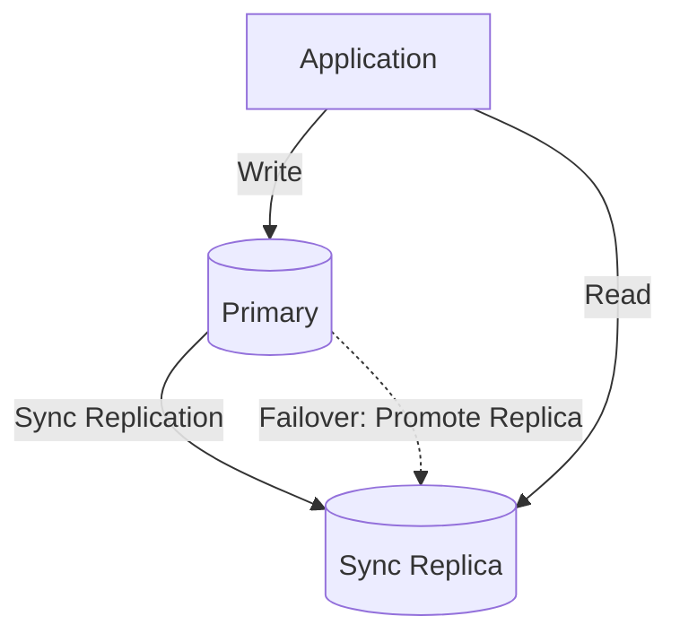
- Write acknowledged only after replica confirms
- Zero data loss, but higher write latency
- Automatic failover: promote replica if primary fails

#### Primary with Multiple Async Replicas
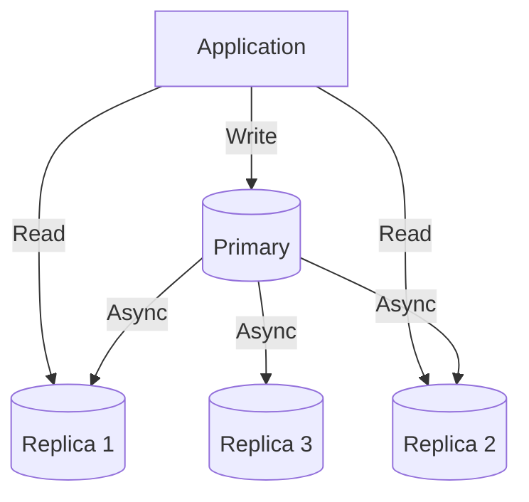
- Low write latency (don't wait for replicas)
- Potential data loss on primary failure (replication lag)
- Can scale reads horizontally

## Failover

The process of switching to a redundant system when the primary fails.

### Automatic Failover Process
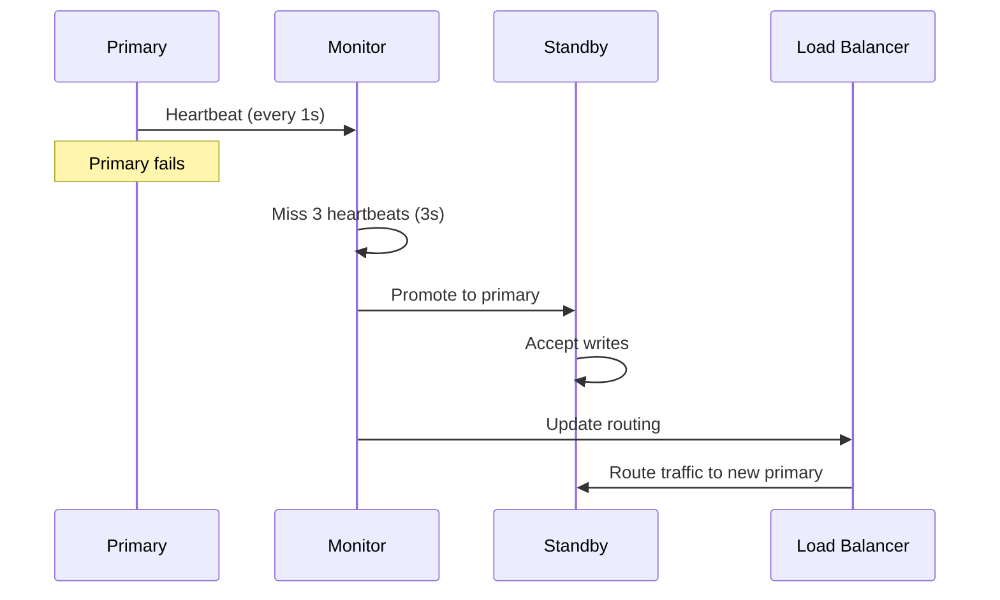

### Failover Timing

```
Detection time:     3-30 seconds (health check interval × threshold)
Promotion time:     5-60 seconds (depends on replication state)
Routing update:     1-30 seconds (DNS TTL, LB config propagation)
Total failover:     10-120 seconds
```

### Failover Challenges

| Challenge | Problem | Solution |
|-----------|---------|----------|
| **Split-brain** | Both nodes think they're primary | Fencing, quorum, STONITH |
| **Data loss** | Async replication loses recent writes | Sync replication (slower) |
| **Failover time** | Detection + promotion takes time | Faster health checks, pre-promoted standby |
| **Cascading failures** | Failover causes overload on remaining nodes | Over-provision, circuit breakers |
| **False positives** | Network glitch triggers unnecessary failover | Multiple health check endpoints, longer thresholds |

### Split-Brain Prevention

```mermaid
graph TD
    P[Primary] -->|Heartbeat| S[Standby]
    S -->|Heartbeat| P
    Q[Quorum Service] -->|Vote| P
    Q -->|Vote| S
    Note: Only node with quorum majority becomes primary
```

**Methods**:
- **Quorum**: Require majority of nodes to agree on primary
- **Fencing/STONITH**: Kill the old primary before promoting standby
- **Witness server**: Third node breaks ties
- **Lease-based**: Primary must renew lease to stay primary

## Disaster Recovery (DR)

### DR Strategies

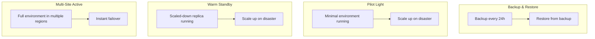

| Strategy | RPO | RTO | Cost | Complexity | Use Case |
|----------|-----|-----|------|------------|----------|
| **Backup & Restore** | Hours | Hours-Days | Low | Low | Non-critical, batch systems |
| **Pilot Light** | Minutes | 15-60 min | Medium | Medium | Important systems |
| **Warm Standby** | Seconds | Minutes | High | High | Critical systems |
| **Multi-site Active** | Near zero | Near zero | Very high | Very high | Mission-critical |

### RPO and RTO

```
RPO (Recovery Point Objective): How much data can we lose?
  → "We can lose up to 1 hour of data" → RPO = 1 hour
  → Determines replication strategy (sync vs async)

RTO (Recovery Time Objective): How quickly must we recover?
  → "System must be back within 15 minutes" → RTO = 15 minutes
  → Determines failover automation level
```

**RPO/RTO to Strategy mapping**:

| RPO | RTO | Strategy |
|-----|-----|----------|
| Hours | Hours | Backup & Restore |
| Minutes | Minutes | Pilot Light |
| Seconds | Minutes | Warm Standby |
| Zero | Seconds | Multi-site Active |

### Multi-Region Deployment

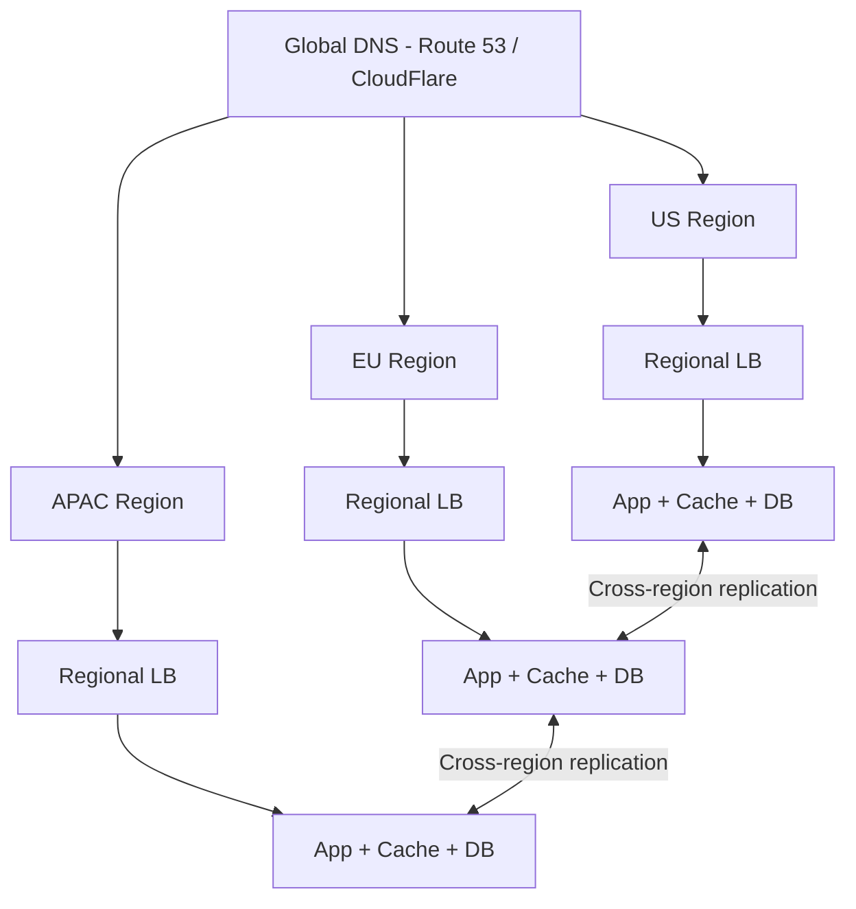

### Backup Best Practices

- **3-2-1 Rule**: 3 copies, 2 different media types, 1 offsite
- **Test restores regularly**: Backups are useless if you can't restore
- **Point-in-time recovery**: Transaction log backups for granular recovery
- **Encrypted backups**: Protect data at rest
- **Automated verification**: Regularly verify backup integrity

## Designing for High Availability

### 1. Eliminate Single Points of Failure

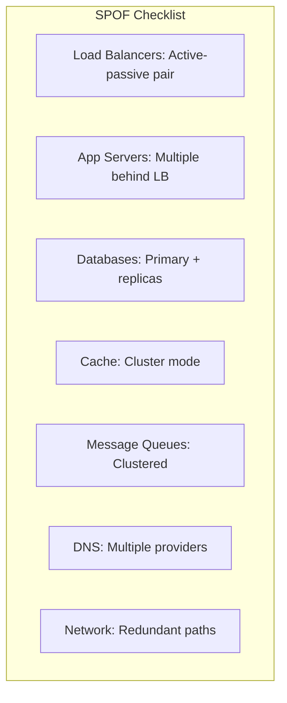

### 2. Graceful Degradation

When a component fails, degrade functionality rather than total failure.

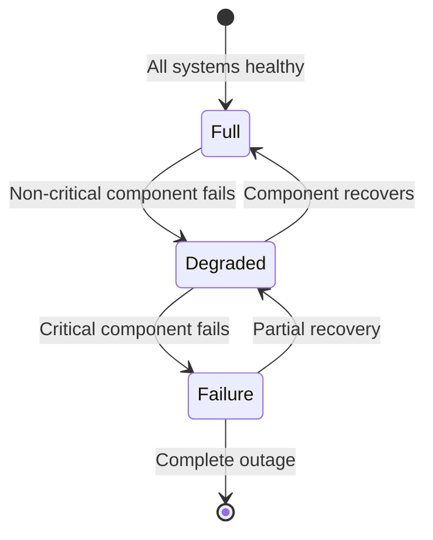

**Examples of graceful degradation**:
- **Amazon**: Browse works even if recommendations service is down
- **Netflix**: Play video even if "My List" service is slow
- **Twitter**: Show cached timeline if real-time feed fails
- **YouTube**: Lower video quality instead of buffering

```python
# Graceful degradation with fallbacks
def get_recommendations(user_id):
    try:
        return recommendation_service.get(user_id, timeout=100ms)
    except ServiceUnavailable:
        # Fall back to popular items
        return cache.get("popular_items")
    except TimeoutError:
        # Fall back to category-based recommendations
        return get_category_recommendations(user_id)
```

### 3. Circuit Breaker Pattern

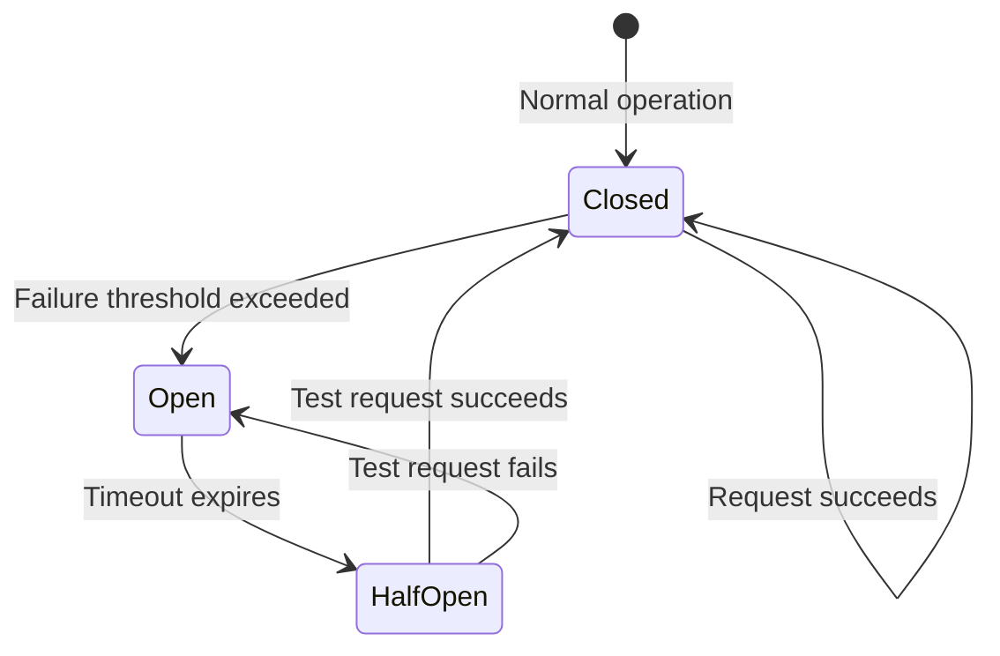

```python
class CircuitBreaker:
    def __init__(self, failure_threshold=5, timeout=30):
        self.state = "CLOSED"
        self.failure_count = 0
        self.failure_threshold = failure_threshold
        self.timeout = timeout
        self.last_failure_time = None

    def call(self, func, *args):
        if self.state == "OPEN":
            if time.time() - self.last_failure_time > self.timeout:
                self.state = "HALF_OPEN"
            else:
                raise CircuitOpenError("Circuit is open")

        try:
            result = func(*args)
            self.on_success()
            return result
        except Exception as e:
            self.on_failure()
            raise

    def on_success(self):
        self.failure_count = 0
        self.state = "CLOSED"

    def on_failure(self):
        self.failure_count += 1
        self.last_failure_time = time.time()
        if self.failure_count >= self.failure_threshold:
            self.state = "OPEN"
```

### 4. Bulkhead Pattern

Isolate components so failure in one doesn't cascade.

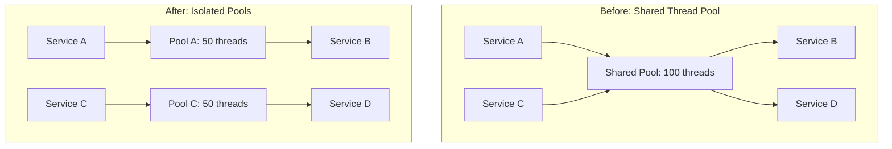

- If Service A floods Pool A, Pool C still works
- Prevents one bad dependency from taking down the whole system
- Can be implemented at thread pool, connection pool, or process level

### 5. Timeout and Retry with Backoff

```python
def call_with_retry(func, max_retries=3, base_backoff=1):
    for attempt in range(max_retries):
        try:
            return func(timeout=5)
        except TimeoutError:
            if attempt == max_retries - 1:
                raise
            backoff = base_backoff * (2 ** attempt)  # Exponential backoff
            jitter = random.uniform(0, backoff * 0.1)  # Add jitter
            sleep(backoff + jitter)
```

**Retry best practices**:
- Use exponential backoff (prevent thundering herd)
- Add jitter (randomize backoff)
- Set max retries (don't retry forever)
- Only retry idempotent operations
- Use circuit breaker to stop retries when service is down

### 6. Rate Limiting and Load Shedding

```python
# Load shedding: Drop requests when overloaded
def handle_request(request):
    if current_load > MAX_LOAD:
        if request.priority == "low":
            return Response(503, "Service overloaded")
        # High priority requests still processed
    return process(request)
```

## Chaos Engineering

Deliberately injecting failures to find weaknesses before they cause outages.

### Principles

1. **Start with steady state**: Define what "normal" looks like (SLIs)
2. **Hypothesize**: "If we kill a server, the LB will route traffic to healthy ones"
3. **Inject failure**: Actually kill the server, introduce latency, corrupt data
4. **Observe**: Did the system behave as expected?
5. **Fix**: Address any weaknesses found
6. **Automate**: Run chaos experiments regularly

### Common Chaos Experiments

| Experiment | What You Test | Tool |
|-----------|--------------|------|
| Kill a server instance | Load balancer failover, service resilience | Chaos Monkey |
| Add network latency | Timeout handling, retry logic | TC (traffic control) |
| Drop network packets | Connection resilience, retry logic | iptables, tc |
| Fill disk space | Alerting, log rotation, graceful degradation | dd, fallocate |
| CPU stress | Auto-scaling, load shedding | stress-ng |
| Kill a database replica | DB failover, read path resilience | Manual or Chaos Kong |
| DNS failure | DNS caching, fallback DNS | iptables |
| Clock skew | Distributed system clock handling | date -s |

### Netflix's Chaos Engineering Suite

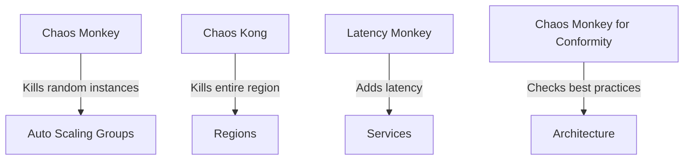

- **Chaos Monkey**: Randomly kills production instances during business hours
- **Chaos Kong**: Simulates entire region failure
- **Latency Monkey**: Injects artificial delays
- **Conformity Monkey**: Checks services follow best practices

## Real-World HA Architectures

### Netflix
- Multi-region active-active across AWS regions
- Chaos Monkey (randomly kills instances in production)
- Circuit breakers (Hystrix/Resilience4j)
- Fallback mechanisms for every dependency
- Zuul gateway with retry and timeout policies

### Amazon
- Multi-AZ deployments by default (3 AZs per region)
- Auto-scaling groups with health checks
- ELB with cross-zone load balancing
- Cross-region replication for critical data (S3, DynamoDB Global Tables)
- Every service must have a "runbook" for failure scenarios

### Google
- Live migration (move VMs without downtime)
- Global load balancing with anycast
- Automatic failover at every layer
- Borg/Kubernetes for container orchestration and resiliency
- SRE error budget culture

### Slack
- Multi-region with active-active for messaging
- Database failover with automated promotion
- Graceful degradation (file sharing degrades, messaging stays up)
- Comprehensive monitoring and alerting

## Monitoring for Availability

### Key Metrics to Monitor

| Metric | What It Tells You | Alert Threshold |
|--------|------------------|-----------------|
| Error rate (5xx) | Service failures | >1% of requests |
| Latency (p99) | User experience degradation | >2× normal |
| Saturation | Resource exhaustion | >80% CPU/memory |
| Traffic | Unusual load patterns | ±50% from baseline |
| Uptime | Overall availability | Below SLO |

### The Four Golden Signals (Google SRE)

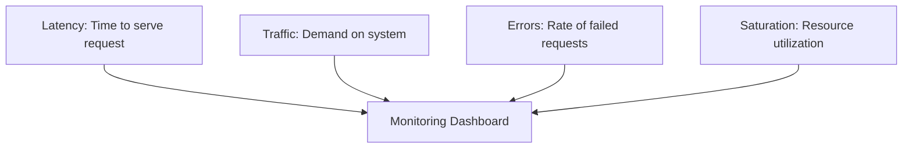

### Alerting Philosophy

- **Page on symptoms, not causes**: Page when users are affected, not when a server CPU is high
- **Actionable alerts**: Every alert should have a clear response procedure
- **Reduce noise**: Too many alerts → alert fatigue → important alerts ignored
- **Severity levels**: Critical (page immediately), Warning (investigate soon), Info (review later)

## Interview Tips

1. **Define availability target** — "We need 99.9% availability, which means ~43 min downtime/month"
2. **Identify SPOFs** — Walk through the architecture and find every single point of failure
3. **Discuss redundancy at every layer** — LB, app, DB, cache, queue, DNS, network
4. **Mention specific strategies** — "Active-passive for DB, active-active for app servers"
5. **Consider failure modes** — "What happens if the primary DB fails? How fast do we detect and recover?"
6. **Talk about DR** — "Cross-region replication with RPO of 1 minute, RTO of 5 minutes"
7. **Include monitoring** — "Health checks every 10 seconds, alert on 3 consecutive failures"
8. **Don't over-engineer** — Match HA level to business requirements (99.9% vs 99.99%)
9. **Mention chaos engineering** — Shows maturity in reliability thinking
10. **Discuss error budgets** — Shows understanding of SRE practices

## Common Mistakes

- ❌ Ignoring SPOFs in the design (walking through architecture without checking)
- ❌ Not defining SLO/SLA targets (measuring nothing)
- ❌ Over-engineering for five nines when three nines suffice (cost explosion)
- ❌ Forgetting about database failover (most common SPOF)
- ❌ Not testing failover procedures (failover that's never tested will fail)
- ❌ Ignoring cascading failures (one failure taking down everything)
- ❌ Alert fatigue (too many non-actionable alerts)
- ❌ No error budget policy (deploying without considering reliability)

## References

- Betsy Beyer et al., *Site Reliability Engineering*, O'Reilly, 2016
- Betsy Beyer et al., *The Site Reliability Workbook*, O'Reilly, 2018
- Casey Rosenthal & Nora Jones, *Chaos Engineering*, O'Reilly, 2020
- [Google SRE Book](https://sre.google/sre-book/table-of-contents/)
- [Netflix Tech Blog - Chaos Engineering](https://netflixtechblog.com/)
- [AWS Well-Architected Framework - Reliability](https://aws.amazon.com/architecture/well-architected/)
- [Microsoft Azure - High Availability](https://learn.microsoft.com/en-us/azure/architecture/high-availability/)

## Cross-References

- [Load Balancing](./load-balancing-design.md) — Distributes traffic for HA
- [Scalability](./scalability.md) — Scaling enables redundancy
- [Consistency Tradeoffs](./consistency-tradeoffs.md) — CAP theorem trade-offs
- [Monitoring](./monitoring-observability.md) — Detect failures for failover
- [Messaging Systems](./messaging-systems.md) — Queues for fault tolerance
- [Availability Patterns](../availability-patterns.md)
- [Cloud Overview](../../cloud/overview.md)
- [DBMS Replication](../../dbms/distributed/replication.md)
