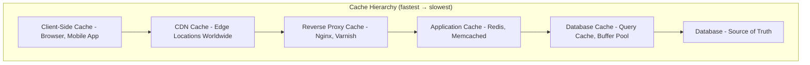
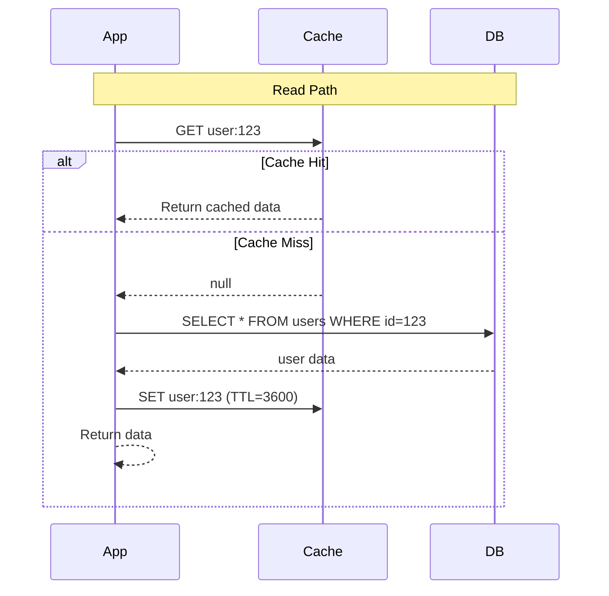
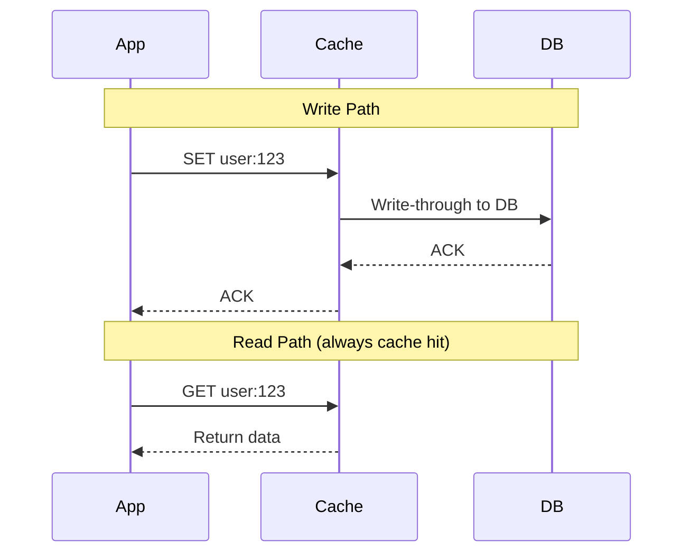
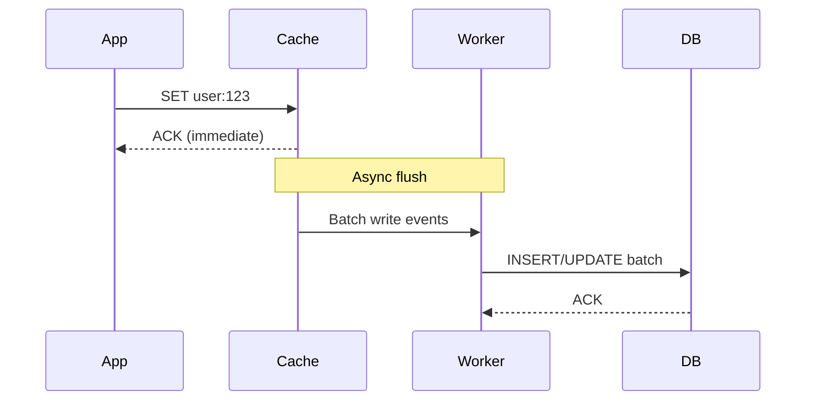
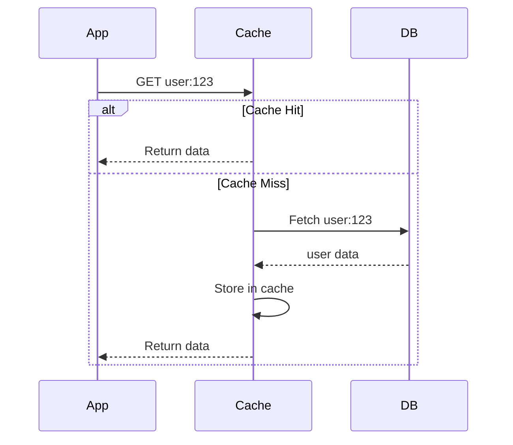
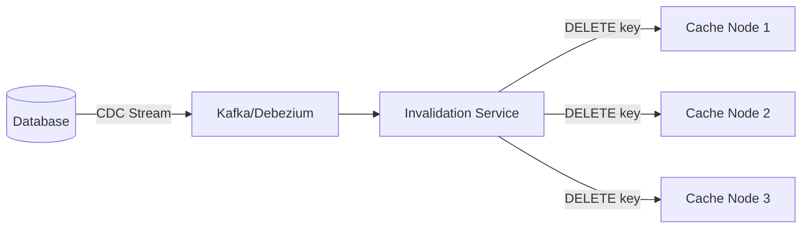
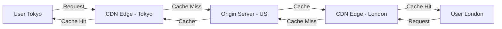
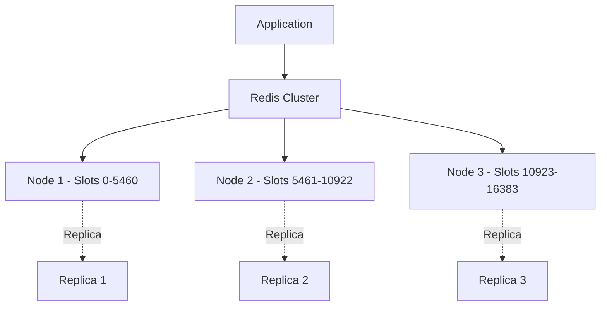
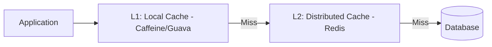
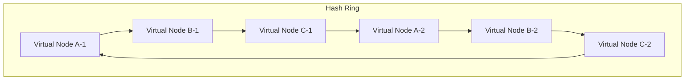

# Caching Strategy Design

## What is Caching?

Caching stores frequently accessed data in a **fast-access storage layer** to reduce latency and database load. It's one of the most impactful optimizations in system design.

```
Without Cache:  Client → App → Database (10ms)
With Cache:     Client → App → Cache (0.1ms) ✓ hit
                             → Database (10ms) ✗ miss
```

### Why Cache?

| Metric | Without Cache | With Cache |
|--------|--------------|------------|
| Latency | 10-100ms (DB query) | 0.1-2ms (memory read) |
| DB Load | 100% of reads | 5-20% of reads (80%+ hit rate) |
| Throughput | Limited by DB connections | Limited by cache memory |
| Cost | Expensive DB scaling | Cheap cache nodes |

## Where to Cache?



### Caching Layers

| Layer | Technology | Latency | Use Case | Size |
|-------|-----------|---------|----------|------|
| Client | Browser cache, localStorage, app cache | 0ms | Static assets, API responses | MB |
| CDN | Cloudflare, CloudFront, Akamai | 5-20ms | Static files, images, videos | TB |
| Reverse Proxy | Varnish, Nginx | 1-5ms | Page caching, API responses | GB |
| Application | Redis, Memcached | 0.5-2ms | Session, computed data, DB results | GB-TB |
| Database | Buffer pool, query cache | 2-5ms | Frequent queries | GB |

### What to Cache at Each Layer

| Data Type | Client | CDN | App Cache | DB Cache |
|-----------|--------|-----|-----------|----------|
| Static assets (JS, CSS, images) | ✅ | ✅ | ❌ | ❌ |
| Public API responses | ✅ (short TTL) | ✅ | ✅ | ❌ |
| User-specific data | ❌ | ❌ | ✅ | ✅ |
| Session data | ❌ | ❌ | ✅ | ❌ |
| Database query results | ❌ | ❌ | ✅ | ✅ |
| Computed/aggregated data | ❌ | ❌ | ✅ | ❌ |

## Caching Strategies

### 1. Cache-Aside (Lazy Loading)

The most common pattern. Application manages the cache explicitly.



```python
def get_user(user_id):
    # 1. Check cache
    cached = redis.get(f"user:{user_id}")
    if cached:
        return json.loads(cached)
    
    # 2. Cache miss - read from DB
    user = db.query("SELECT * FROM users WHERE id = ?", user_id)
    
    # 3. Store in cache with TTL
    if user:
        redis.setex(f"user:{user_id}", 3600, json.dumps(user))
    
    return user

def update_user(user_id, data):
    # 1. Write to DB
    db.execute("UPDATE users SET ... WHERE id = ?", user_id, data)
    
    # 2. Invalidate cache (delete, not update)
    redis.delete(f"user:{user_id}")
```

**Pros**: Only caches data that's actually requested; cache failures don't break the system; simple to implement
**Cons**: Cache miss is slow (two round trips); stale data possible until TTL or invalidation; cache stampede risk

**When to use**: Read-heavy workloads; general-purpose caching; most web applications

### 2. Write-Through

Write to cache and database simultaneously. Cache is always consistent with DB.



```python
def update_user(user_id, data):
    # Write to both cache and DB
    cache_key = f"user:{user_id}"
    redis.set(cache_key, json.dumps(data))
    db.execute("UPDATE users SET ... WHERE id = ?", user_id, data)
    return data

def get_user(user_id):
    # Always read from cache (guaranteed to be fresh)
    cached = redis.get(f"user:{user_id}")
    if cached:
        return json.loads(cached)
    # If not in cache, read from DB and populate
    user = db.query("SELECT * FROM users WHERE id = ?", user_id)
    if user:
        redis.set(f"user:{user_id}", json.dumps(user))
    return user
```

**Pros**: Cache is always fresh; reads are always fast for written data; strong consistency
**Cons**: Write latency (two synchronous writes); most written data may never be read (cache pollution); cache and DB must be in sync

**When to use**: Read-after-write consistency is critical; data is frequently read after being written

### 3. Write-Behind (Write-Back)

Write to cache immediately, flush to database asynchronously.



**Pros**: Very fast writes (only cache latency); can batch DB writes (reduces DB load); absorbs write spikes
**Cons**: Risk of data loss if cache crashes before flush; complex implementation; eventual consistency
**Mitigation**: Use Redis with AOF persistence; implement write-ahead log; redundant cache nodes

**When to use**: Write-heavy workloads; can tolerate brief data loss; analytics/logging systems

### 4. Read-Through

Cache itself fetches data from database on miss. The cache acts as the data source.



**Pros**: Simpler application code (just talks to cache); cache is the single data source
**Cons**: Requires cache library support (read-through logic); first read for any key is slow; cache library complexity

**When to use**: When you want a unified data access layer; frameworks that support read-through natively

### 5. Refresh-Ahead

Proactively refresh cache entries before they expire, based on access patterns.

```python
def get_with_refresh_ahead(key, ttl=3600, refresh_threshold=0.8):
    data, metadata = redis.get_with_metadata(key)
    if data:
        # If accessed after 80% of TTL, refresh in background
        age = time.time() - metadata.created_at
        if age > ttl * refresh_threshold:
            background_refresh(key)  # Async refresh
        return data
    return fetch_and_cache(key, ttl)
```

**Pros**: Eliminates cache miss latency for hot keys; no stampede risk
**Cons**: Complex to implement; may refresh unused keys; extra DB load

**When to use**: Very hot keys with predictable access patterns; latency-critical paths

### Strategy Comparison

| Strategy | Read Speed | Write Speed | Consistency | Complexity | Data Loss Risk | Best For |
|----------|-----------|-------------|-------------|------------|----------------|----------|
| Cache-Aside | Fast (hit) | Normal | Eventual | Low | Low | General purpose |
| Write-Through | Always fast | Slower | Strong | Medium | None | Read-after-write |
| Write-Behind | Always fast | Very fast | Eventual | High | Yes | Write-heavy |
| Read-Through | Fast (hit) | Normal | Eventual | Medium | Low | Unified data layer |
| Refresh-Ahead | Always fast | Normal | Eventual | High | Low | Hot keys, low latency |

## Cache Invalidation

> "There are only two hard things in Computer Science: cache invalidation and naming things." — Phil Karlton

### Invalidation Strategies

#### 1. TTL (Time-To-Live)
```python
redis.setex("user:123", 3600, data)  # Expires in 1 hour
```
- Simple and effective
- Data is stale until TTL expires
- Choose TTL based on staleness tolerance

**TTL Selection Guide**:
| Data Type | Staleness Tolerance | Suggested TTL |
|-----------|-------------------|---------------|
| User profile | Minutes | 5-15 min |
| Product catalog | Hours | 1-4 hours |
| Static config | Hours/days | 24 hours |
| Session data | Minutes | 15-30 min |
| Leaderboard | Seconds | 5-30 sec |

#### 2. Event-Based Invalidation
```python
# When data changes in the database
def on_user_update(user_id):
    redis.delete(f"user:{user_id}")
    # Or publish event for distributed invalidation
    pubsub.publish("cache:invalidate", {"key": f"user:{user_id}"})
```
- Immediate invalidation
- Requires event system (pub/sub, CDC, change streams)
- Works across distributed caches

**Implementation with Change Data Capture (CDC)**:


#### 3. Version-Based Invalidation
```python
# Cache key includes version number
version = get_user_version(user_id)
cache_key = f"user:{user_id}:v{version}"
# Old version automatically becomes orphan (expires via TTL)
```
- No explicit delete needed
- Old entries expire naturally via TTL
- Version can be stored in DB or a separate counter

#### 4. Tag-Based Invalidation
```python
# Associate cache entries with tags
redis.set("user:123", data, tags=["user", "profile:123"])
# Invalidate all entries with a tag
redis.invalidate_tag("user")  # Invalidates all user caches
```
- Invalidate groups of related cache entries
- Useful for hierarchical data
- Requires tag tracking infrastructure

### Cache Stampede Problem

When a popular cache entry expires, many requests simultaneously hit the database.

```
T=0: Cache entry expires
T=0.1: 1000 requests → all miss → all hit DB → DB overload
```

**Solutions**:

| Solution | How | Trade-off |
|----------|-----|-----------|
| **Distributed Locking** | First request acquires lock, others wait | Adds latency for waiters |
| **Probabilistic early refresh** | Refresh before expiry based on probability | Complex math |
| **Background refresh** | Async refresh before TTL expires | Extra process to manage |
| **Stale-while-revalidate** | Serve stale data, refresh async | Brief staleness |
| **Request coalescing** | Deduplicate concurrent requests for same key | Requires coordination |

```python
def get_with_lock(key, ttl=3600):
    data = redis.get(key)
    if data:
        return json.loads(data)
    
    # Try to acquire distributed lock
    lock_key = f"lock:{key}"
    if redis.set(lock_key, "1", nx=True, ex=10):
        try:
            # Winner fetches from DB and populates cache
            data = db.query(...)
            redis.setex(key, ttl, json.dumps(data))
            return data
        finally:
            redis.delete(lock_key)
    else:
        # Losers wait and retry (with backoff)
        time.sleep(0.05)
        return get_with_lock(key, ttl)
```

## CDN (Content Delivery Network)

### How CDN Works


### What to Cache at CDN
| Content Type | Cache? | TTL | Notes |
|-------------|--------|-----|-------|
| Static assets (JS, CSS, images) | ✅ | Days/weeks | Use versioned URLs |
| API responses (public, read-heavy) | ✅ | Minutes | Ensure no user-specific data |
| User-specific data | ❌ | — | Privacy risk, low hit rate |
| Dynamic content | ❌ | — | Use edge computing instead |
| Video streams | ✅ | Hours | HLS/DASH segments |

### CDN Invalidation Methods
- **Purge**: Explicitly remove from all edge locations (immediate, costly)
- **TTL-based**: Wait for expiry (free, but stale until expiry)
- **Versioned URLs**: `/app.v2.js` instead of `/app.js` (preferred, no purge needed)
- **Stale-while-revalidate**: Serve stale while fetching fresh in background

### CDN Edge Computing
Modern CDNs run code at the edge (Cloudflare Workers, AWS Lambda@Edge):
- A/B testing at the edge
- Personalization without origin round-trip
- Bot detection and security
- Request routing and transformation

## Cache Eviction Policies

When cache is full, which entries to remove?

| Policy | How | Best For | Weakness |
|--------|-----|----------|----------|
| **LRU** (Least Recently Used) | Remove least recently accessed | General purpose | Scan resistance |
| **LFU** (Least Frequently Used) | Remove least frequently accessed | Stable patterns | Stale popular keys |
| **FIFO** (First In First Out) | Remove oldest entry | Simple, time-based | Ignores access patterns |
| **TTL** (Time-To-Live) | Remove expired entries | Time-sensitive data | May keep unused keys |
| **Random** | Remove random entry | When all entries equal | Unpredictable |
| **LRU-K** | LRU considering K-th recent access | Complex access patterns | Higher overhead |

**Redis default**: LRU approximation (`allkeys-lru`) or TTL-aware (`volatile-lru`)

## Distributed Caching

### Memcached vs Redis

| Feature | Memcached | Redis |
|---------|-----------|-------|
| Data structures | Key-value only | Strings, lists, sets, hashes, sorted sets, streams, HyperLogLog |
| Persistence | No | Yes (RDB snapshots, AOF log) |
| Clustering | Client-side sharding | Built-in Redis Cluster |
| Pub/Sub | No | Yes |
| Lua scripting | No | Yes |
| Transactions | No | Yes (MULTI/EXEC) |
| Memory efficiency | Better (simpler) | Slightly more overhead |
| Max value size | 1MB (default) | 512MB |
| Replication | No | Yes (primary-replica) |
| Use case | Simple caching, high throughput | Complex data, pub/sub, queues, leaderboards |

**When to choose Memcached**: Simple key-value caching; memory efficiency is critical; multi-threaded performance needed
**When to choose Redis**: Need data structures beyond key-value; need persistence; need pub/sub or scripting; need clustering

### Cache Topologies

#### Single Cache Server
```
[App1] → [Redis] ← [App2]
```
Simple but single point of failure. Use for development only.

#### Cache Cluster (Redis Cluster)

- Data partitioned by hash slots (16384 total)
- Each node owns a range of slots
- Automatic failover with replicas
- Client-side routing (MOVED/ASK redirections)

#### Multi-tier Cache (L1 + L2)

- L1: In-process cache (ultra-fast, per-instance)
- L2: Distributed cache (shared across instances)
- L1 for hot data, L2 for warm data
- **Challenge**: L1 invalidation across instances (use pub/sub)

**L1/L2 invalidation**:
```python
# On write
def update_user(user_id, data):
    db.update(user_id, data)
    redis.delete(f"user:{user_id}")
    # Notify all instances to clear L1
    pubsub.publish("cache:invalidate:l1", f"user:{user_id}")

# On receiving invalidation message
def on_l1_invalidate(key):
    local_cache.delete(key)
```

### Consistent Hashing for Cache Distribution



- Maps cache keys and server nodes to a hash ring
- Each key is assigned to the next server clockwise
- When a server is added/removed, only ~1/N keys need to move
- Virtual nodes ensure even distribution

## Real-World Examples

### Facebook's Memcached Architecture
- **Scale**: Trillions of items cached, billions of requests/sec
- **McSqueal**: Replicates DB changes to cache (CDC-based invalidation)
- **Memcache pools**: Separate pools by workload type (social graph, news feed, etc.)
- **Regional caching**: Cross-region invalidation via "invalidation pipeline"
- **Look-aside cache**: Application manages cache (cache-aside pattern)
- **Lease mechanism**: Prevents cache stampede (gives "lease" to one client)

### Twitter's Cache Strategy
- **Redis clusters**: For timeline cache, trending topics, counters
- **Memcached**: For user data, tweet data (simpler, memory-efficient)
- **Cache-aside**: Most reads check cache first
- **Write-through**: For critical data (user auth tokens)
- **Manhattan**: Custom distributed store with built-in caching

### Netflix's Cache Architecture
- **EVCache**: Custom Memcached-based caching layer
- **Regional caching**: Each region has its own cache cluster
- **Cache warming**: Pre-populate caches before peak hours
- **Tiered caching**: L1 (in-process) → L2 (EVCache) → DB

## Cache Monitoring

### Key Metrics

| Metric | What It Measures | Target |
|--------|-----------------|--------|
| **Hit rate** | % of requests served from cache | >80% |
| **Miss rate** | % of requests that miss cache | <20% |
| **Latency** | Cache read/write time | <2ms |
| **Eviction rate** | Entries removed due to memory pressure | Low |
| **Memory usage** | Cache memory consumption | <80% capacity |
| **Connection count** | Active cache connections | Within pool limits |

### Cache Hit Rate Optimization
- **Too low** (<70%): Increase cache size, review TTLs, check key distribution
- **Too high** (>99%): Cache might be too large or TTLs too long (stale data risk)
- **Optimal** (80-95%): Good balance of freshness and performance

## Interview Tips

1. **Always mention cache** — It's expected in any HLD discussion
2. **Choose strategy based on read/write ratio** — Read-heavy → cache-aside; write-heavy → write-behind
3. **Discuss invalidation** — "We'll use TTL of 1 hour + event-based invalidation via CDC"
4. **Consider cache stampede** — Mention locking or probabilistic early refresh
5. **Think about cache size** — What's the working set size? Will it fit in memory?
6. **Don't cache everything** — Some data changes too frequently or is rarely accessed
7. **Mention specific technology** — "Redis Cluster with allkeys-lru eviction, 3 nodes with replicas"
8. **Discuss failure modes** — "If Redis goes down, we fall back to DB (cache-aside graceful degradation)"
9. **Consider multi-tier caching** — L1 (local) + L2 (distributed) for ultra-low latency
10. **Talk about cache warming** — Pre-populate cache on deployment to avoid cold-start

## Common Mistakes

- ❌ Caching without considering invalidation strategy
- ❌ Not setting TTL (cache grows forever, memory leak)
- ❌ Caching user-specific data at CDN (privacy risk)
- ❌ Ignoring cache stampede for hot keys
- ❌ Using cache as primary data store without persistence
- ❌ Not monitoring cache hit rate (flying blind)
- ❌ Caching everything blindly (some data doesn't benefit)
- ❌ Forgetting to invalidate on write (stale data bugs)

## References

- [AWS - Database Caching Strategies Using Redis](https://docs.aws.amazon.com/whitepapers/latest/database-caching-strategies-using-redis/)
- [Redis Documentation](https://redis.io/docs/)
- [Memcached Wiki](https://github.com/memcached/memcached/wiki)
- [Facebook Engineering - Scaling Memcache](https://engineering.fb.com/2022/03/07/core-data/scaling-memcache-at-facebook/)
- Nishtala et al., "Scaling Memcache at Facebook", NSDI 2013
- Martin Kleppmann, *Designing Data-Intensive Applications*, Chapter 5

## Cross-References

- [Scalability](./scalability.md) — Caching is key to scaling reads
- [Database Design](./database-design.md) — Cache reduces DB load
- [Consistency Tradeoffs](./consistency-tradeoffs.md) — Caching introduces eventual consistency
- [Monitoring](./monitoring-observability.md) — Monitor cache hit rates
- [LRU Cache LLD](../lld/cache-lld.md) — Implementation details
