# Consistency Tradeoffs in Distributed Systems

## The Fundamental Challenge

In distributed systems, you can't have everything. The **CAP theorem** proves that when a network partition occurs, you must choose between consistency and availability. Understanding this trade-off is essential for designing systems that meet real-world requirements.

> **Key Insight**: The CAP theorem isn't about choosing two out of three in general — it's about what you do *when* a network partition happens. Partitions are inevitable in distributed systems.

## CAP Theorem

### The Three Properties

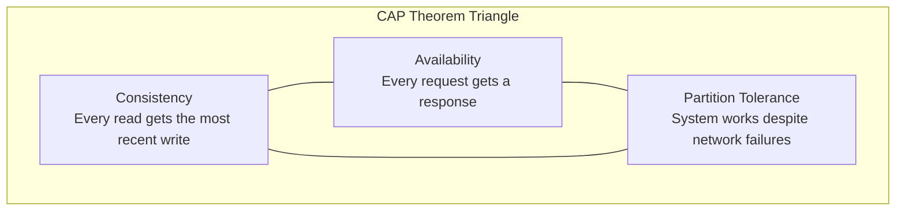

| Property | Definition | Example | How It Breaks |
|----------|-----------|---------|---------------|
| **Consistency** | Every read gets the most recent write | Read from any node → same result | Node returns stale data |
| **Availability** | Every request gets a (non-error) response | Node responds even if data is stale | Node returns error/timeout |
| **Partition Tolerance** | System works despite network failures | Nodes can't communicate → system still works | System halts to preserve consistency |

### CAP in Practice

In a distributed system, network partitions **will** happen (network failures, switch failures, cable cuts). So you **must** tolerate partitions, which means you must choose between C and A during a partition.

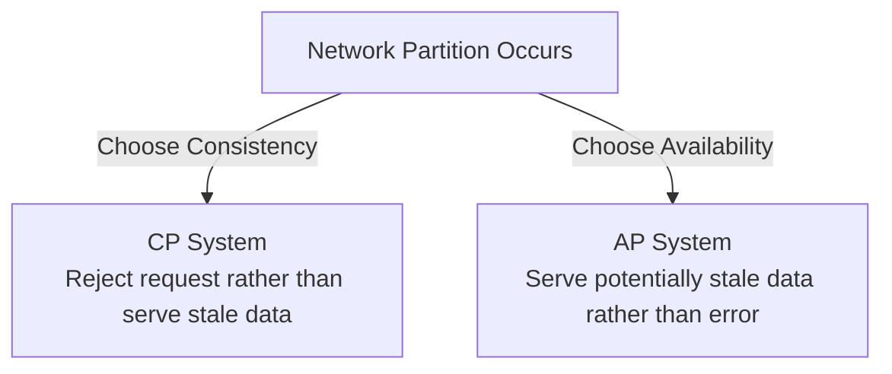

**CP (Consistency + Partition Tolerance)**:
- Sacrifice availability during partitions
- Return errors rather than stale data
- Examples: MongoDB (with majority reads), HBase, ZooKeeper, etcd, Google Spanner

**AP (Availability + Partition Tolerance)**:
- Sacrifice consistency during partitions
- Serve stale data rather than errors
- Examples: Cassandra, DynamoDB, CouchDB, Riak, DNS

**CA (Consistency + Availability)**:
- Only possible in single-node systems (no partitions possible)
- Traditional RDBMS on one server
- Not truly "choosing" — just avoiding distribution

### CAP Theorem Detailed Example

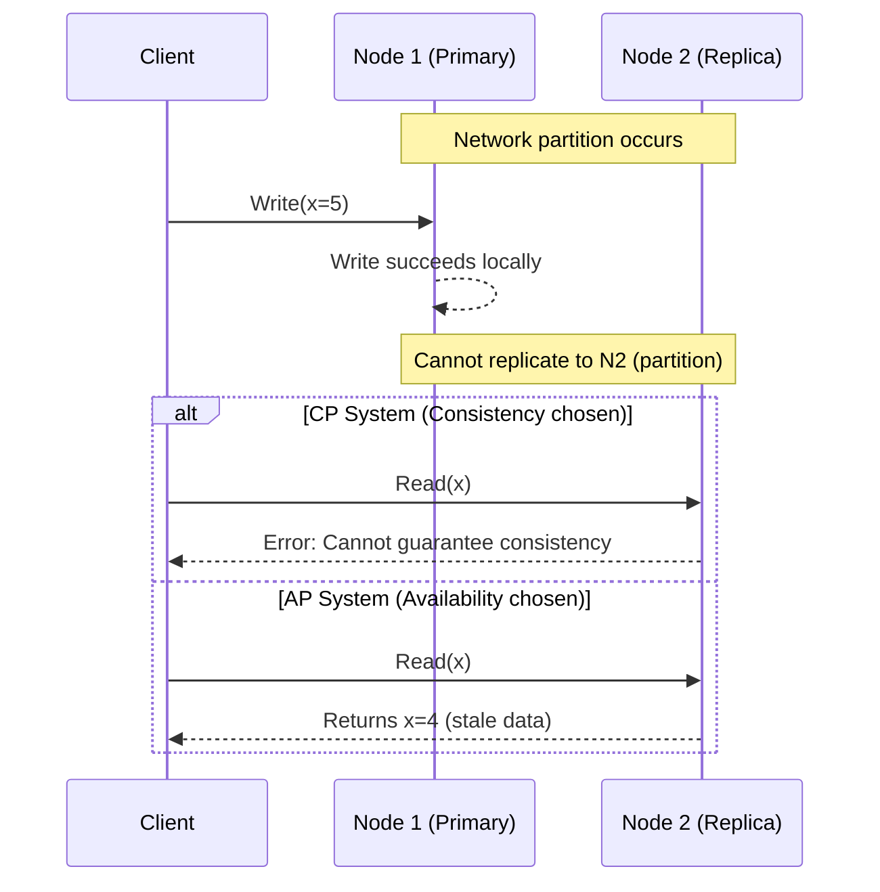

### CAP in the Real World

| System | CAP Choice | How |
|--------|-----------|-----|
| **ZooKeeper** | CP | Leader election, quorum reads |
| **etcd** | CP | Raft consensus, linearizable reads |
| **MongoDB** | CP (with majority) | Write concern: majority, read concern: majority |
| **HBase** | CP | Strong consistency via HDFS |
| **Cassandra** | AP (tunable) | Consistency level per query (ONE, QUORUM, ALL) |
| **DynamoDB** | AP (default) | Eventually consistent reads (strongly consistent optional) |
| **CouchDB** | AP | Multi-master replication, conflict detection |
| **Redis Cluster** | CP | Async replication, may lose data on partition |

## Consistency Models

Understanding the spectrum of consistency models helps you choose the right one for each part of your system.

### Strong Consistency (Linearizability)

Every read returns the most recent write. Operations appear to execute atomically and in order.

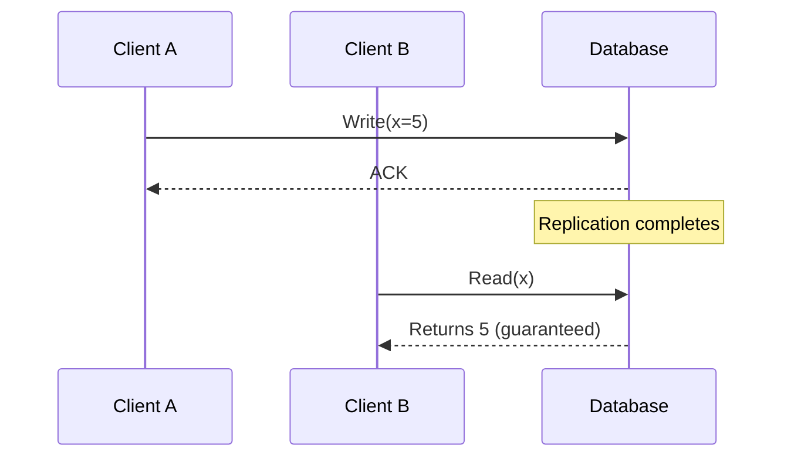

**Guarantee**: If you wrote it, everyone sees it immediately (or the write fails).

**When to use**:
- Financial transactions (bank balances, payments)
- Inventory management (prevent overselling)
- Distributed locks and leader election
- Any "single source of truth" scenario

**Cost**: Higher latency (must wait for replication/consensus), lower availability

**Implementation**: Consensus protocols (Raft, Paxos), synchronous replication

### Eventual Consistency

Given enough time (and no new writes), all replicas converge to the same value.

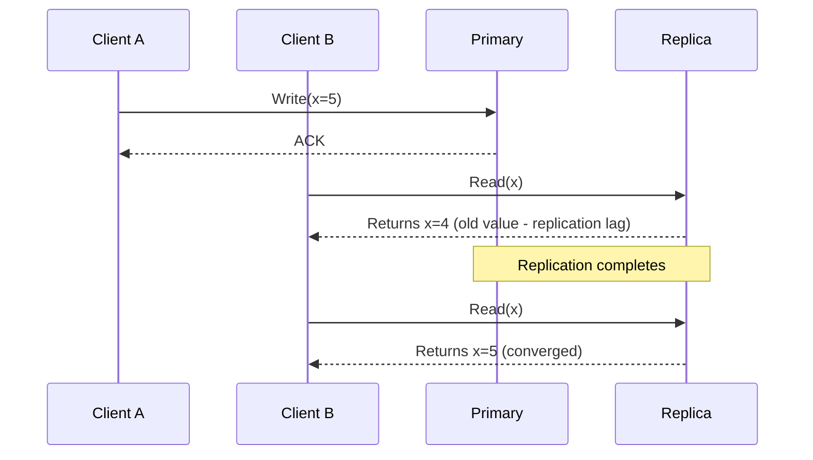

**Guarantee**: If you stop writing, eventually all reads return the last write.

**When to use**:
- Social media feeds (posts can be slightly delayed)
- Product reviews, comments
- DNS records
- CDN content
- User profile updates

**Cost**: May read stale data temporarily; no upper bound on staleness

### Causal Consistency

Operations that are causally related are seen in the same order by all nodes. Unrelated operations can be seen in any order.

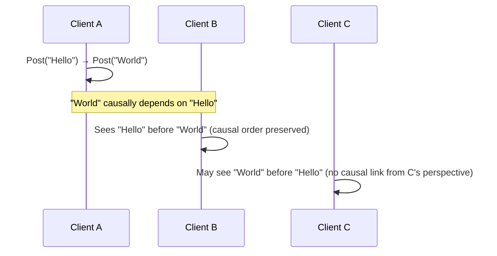

**Guarantee**: Cause-and-effect relationships are preserved across all nodes.

**When to use**:
- Social media (reply depends on original post)
- Collaborative editing (edit depends on previous state)
- Comment threads (replies follow parent)

**Cost**: More bookkeeping than eventual consistency; vector clocks or version vectors needed

### Read-Your-Writes Consistency

A user always sees their own writes, but other users may not.

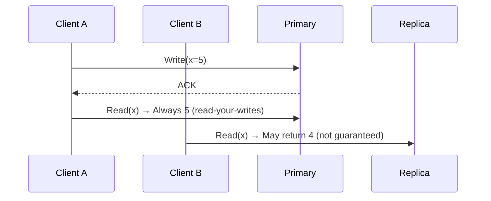

**Guarantee**: You see your own changes immediately.

**When to use**:
- User profile updates (user should see their own changes)
- Settings changes
- Any user-facing write-then-read pattern

**Implementation**: Route reads to primary after writes; use write timestamp; sticky sessions to same replica

### Monotonic Reads

Once you've read a value, you'll never see an older value.

```
Read 1: x=5 ✓
Read 2: x=7 ✓ (newer)
Read 3: x=4 ✗ (older - violates monotonic reads)
```

**Guarantee**: Reads never go backwards in time.

**When to use**: User timelines, feeds where going backwards is confusing.

### Consistency Spectrum

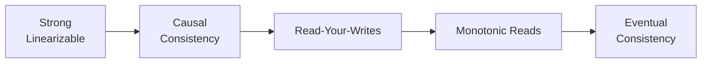

```
Strong ←──────────────────────────────────→ Eventual
  │           │           │           │
Strong    Causal    Read-Your    Eventual
Consistency  Consistency  Writes    Consistency

Higher latency ←──────────────────→ Lower latency
Lower availability ←──────────────→ Higher availability
Simpler reasoning ←──────────────→ Harder reasoning
```

## Conflict Resolution

When multiple nodes accept writes concurrently, conflicts arise. How you resolve them depends on your consistency requirements.

### Last-Writer-Wins (LWW)

```
Node 1: Write(x=5) at T=1
Node 2: Write(x=7) at T=2
Resolution: x=7 (latest timestamp wins)
```

- Simple to implement
- **May lose concurrent updates silently**
- Timestamps must be synchronized (problematic with clock skew)
- Used by: Cassandra, DynamoDB (default)

### Vector Clocks

Track causal relationships between events to detect conflicts.

```
Initial:  {N1:0, N2:0}

Client A writes to N1: {N1:1, N2:0}
Client B writes to N2: {N1:0, N2:1}

Both concurrent: {N1:1, N2:0} and {N1:0, N2:1}
→ Conflict detected! Neither dominates the other.
→ Application must resolve (merge, pick one, present both)
```

- Detects conflicts (doesn't automatically resolve them)
- Used by: DynamoDB (original paper), Riak, CouchDB

### CRDTs (Conflict-free Replicated Data Types)

Data structures that automatically resolve conflicts by design. All concurrent operations commute.

```mermaid
graph TD
    subgraph "G-Counter (Grow-only)"
        G1[Node 1: {N1:5, N2:0} → value=5]
        G2[Node 2: {N1:0, N2:3} → value=3]
        G3[Merged: {N1:5, N2:3} → value=8]
    end
    subgraph "PN-Counter (Positive-Negative)"
        P1[Increment: G-Counter for adds]
        P2[Decrement: G-Counter for subtracts]
        P3[Value: Increment - Decrement]
    end
```

**Types of CRDTs**:

| Type | Operations | Use Case | Example |
|------|-----------|----------|---------|
| **G-Counter** | Increment only | Counters that only go up | Page views, likes, followers |
| **PN-Counter** | Increment/Decrement | Counters that go up and down | Shopping cart item count |
| **G-Set** | Add only | Sets that only grow | Tags, followers list |
| **OR-Set** | Add/Remove | Sets with removal | Shopping cart items |
| **LWW-Register** | Set value | Last write wins | User profile field |
| **MV-Register** | Set value | Multi-value (keep all) | Concurrently edited field |
| **LWW-Element-Set** | Add/Remove with timestamps | Shopping cart with timestamps | Cart items |

**How CRDTs work (G-Counter example)**:
```
Node 1 increments: counter = {N1:1, N2:0}
Node 2 increments: counter = {N1:0, N2:1}
Node 1 increments again: counter = {N1:2, N2:0}

Merge (take max per node): {N1:2, N2:1} → value = 3
No conflict! All increments preserved.
```

### Merge Functions

| System | Strategy | Trade-off |
|--------|----------|-----------|
| DynamoDB | Last-writer-wins | Simple, may lose data |
| Riak | Siblings (application resolves) | No data loss, app complexity |
| Redis | Single-leader (no conflict) | No conflicts, not multi-master |
| Cassandra | LWW with timestamp | Simple, clock skew issues |
| CouchDB | Conflict tree (app resolves) | Full history, complex |
| OrbitDB (CRDT) | Automatic CRDT merge | No conflicts, limited operations |

## Tunable Consistency

Some systems let you choose consistency level per operation, giving you fine-grained control.

### Cassandra Consistency Levels

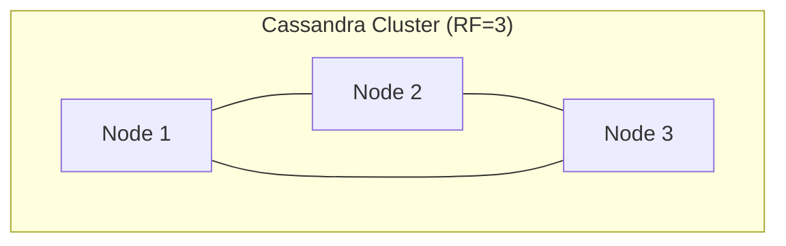

```
ONE:    Ack from 1 replica     (fastest, weakest)
TWO:    Ack from 2 replicas    (balanced)
QUORUM: Ack from majority      (balanced, recommended)
ALL:    Ack from all replicas  (slowest, strongest)
LOCAL_QUORUM: Majority in local DC (good for multi-DC)
```

**The Quorum Formula**:
```
W + R > N = Strong consistency

Where:
  W = Write consistency level (number of replicas that must acknowledge)
  R = Read consistency level (number of replicas that must respond)
  N = Replication factor (total replicas)

Example (RF=3):
  Write QUORUM (2) + Read QUORUM (2) = 4 > 3 → Strong consistency ✓
  Write ONE (1) + Read ALL (3) = 4 > 3 → Strong consistency ✓
  Write ONE (1) + Read ONE (1) = 2 < 3 → Eventual consistency ✗
```

**Practical recommendations**:

| Use Case | Write CL | Read CL | Trade-off |
|----------|----------|---------|-----------|
| Critical data | QUORUM | QUORUM | Strong consistency, moderate latency |
| High availability | ONE | ONE | Eventual consistency, lowest latency |
| Write-heavy, read-rarely | ONE | ALL | Fast writes, slow reads |
| Read-heavy, write-rarely | ALL | ONE | Slow writes, fast reads |
| Multi-DC | LOCAL_QUORUM | LOCAL_QUORUM | Strong within DC, eventual across DC |

### MongoDB Write and Read Concerns

```
Write Concerns:
  w:1          → Ack from primary only (fastest)
  w:majority   → Ack from majority of replicas (durable)
  w:all        → Ack from all replicas (strongest)

Read Concerns:
  local        → Read from primary (may include uncommitted)
  majority     → Only return data committed to majority
  linearizable → Linearizable read (strongest, slowest)

Read Preferences:
  primary          → Always read from primary (strongest)
  primaryPreferred → Prefer primary, fallback to secondary
  secondary        → Read from secondaries (eventual)
  nearest          → Read from nearest node (lowest latency)
```

### DynamoDB Consistency Options

```
Eventually Consistent Read (default):
  - Returns immediately
  - May not reflect recent writes
  - Lower cost (1 RCU)

Strongly Consistent Read:
  - Returns most recent write
  - Higher latency
  - Higher cost (2 RCU)
  - May fail during partitions
```

## PACELC Theorem

Extension of CAP that accounts for **normal operation** (when there's no partition).

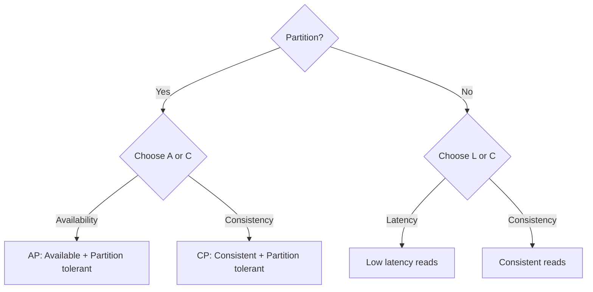

**PACELC**: If **P**artition, choose **A**vailability or **C**onsistency; **E**lse (normal), choose **L**atency or **C**onsistency.

| System | Partition: A or C | Else: L or C | Full PACELC |
|--------|------------------|--------------|-------------|
| **Cassandra** | A | L (low latency) | PA/EL |
| **DynamoDB** | A | L | PA/EL |
| **MongoDB** | C | C (consistency) | PC/EC |
| **PostgreSQL** | C | C | PC/EC |
| **CockroachDB** | C | C | PC/EC |
| **Cosmos DB** | Tunable | Tunable | Configurable |

### What PACELC Tells Us

**MongoDB** (PC/EC): Chooses consistency both during partitions AND during normal operation. Higher latency but always consistent.

**Cassandra** (PA/EL): Chooses availability during partitions AND low latency during normal operation. Fast but may serve stale data.

**Neither is "better"** — it depends on your requirements:
- Banking: PC/EC (consistency matters more than latency)
- Social media: PA/EL (availability and speed matter more than perfect consistency)
- E-commerce: Mixed (PA/EL for browsing, PC/EC for checkout)

## Real-World Consistency Choices

### Amazon DynamoDB
- **Default**: Eventually consistent reads
- **Option**: Strongly consistent reads (2× cost, higher latency)
- **Why**: Massive scale requires availability over consistency
- **Conflict resolution**: Last-writer-wins with vector clocks (internal)

### Cassandra
- **Model**: Tunable consistency per operation
- **Default**: ONE (eventual)
- **Recommended**: QUORUM for reads and writes (strong consistency)
- **Multi-DC**: LOCAL_QUORUM for per-DC consistency

### PostgreSQL
- **Default**: Strong consistency (single node, SERIALIZABLE isolation)
- **Replication**: Async by default, sync option available
- **Why**: ACID transactions are core feature
- **Trade-off**: Sync replication increases write latency

### MongoDB
- **Default**: Strong consistency (primary reads)
- **Secondary reads**: Eventually consistent by default
- **Write concern**: Configurable (w:1, w:majority, w:all)
- **Read concern**: Configurable (local, majority, linearizable)

### Google Spanner
- **Model**: Externally consistent (stronger than linearizable)
- **How**: TrueTime API (GPS + atomic clocks for synchronized timestamps)
- **Trade-off**: Higher latency (10-20ms per transaction)
- **Use case**: Financial data, inventory, globally consistent systems

### Azure Cosmos DB
- **Five consistency levels**: Strong, Bounded Staleness, Session, Consistent Prefix, Eventual
- **Configurable per request**: Fine-grained control
- **SLA-backed**: Each level has guaranteed latency and throughput

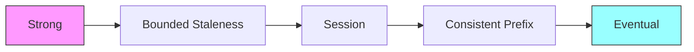

## Practical Decision Framework

### Choosing Consistency by Use Case

| Use Case | Consistency Model | Why |
|----------|------------------|-----|
| Bank balance | Strong | Money must be accurate |
| Inventory count | Strong | Prevent overselling |
| Leaderboard | Eventual | Slightly stale is fine |
| Social feed | Eventual/Causal | Posts can be delayed |
| User profile | Read-your-writes | User sees own changes |
| Comments/replies | Causal | Reply order matters |
| Analytics | Eventual | Aggregations can be approximate |
| Shopping cart | CRDT (eventual, no conflicts) | Must not lose items |
| Session data | Eventual | Brief staleness acceptable |
| Configuration | Strong | Must be consistent across services |
| Search index | Eventual | Can be slightly behind |

### Interview Decision Tree

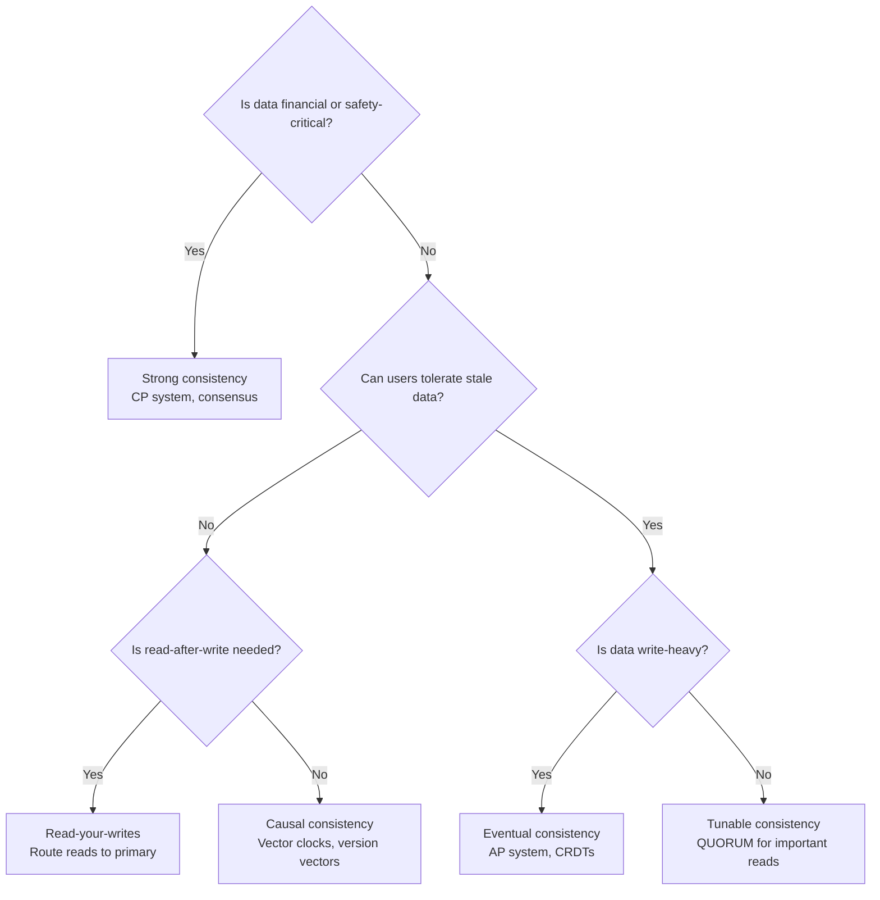

## Interview Tips

1. **Always mention CAP** — Shows distributed systems understanding
2. **Choose based on requirements** — "Financial data needs strong consistency, but social feed can be eventual"
3. **Discuss trade-offs explicitly** — "We choose availability over consistency because users prefer a working system with slightly stale data"
4. **Mention specific technologies** — "Cassandra with QUORUM reads for strong consistency on critical data"
5. **Consider tunable consistency** — "Different operations need different consistency levels"
6. **Talk about conflict resolution** — "We'll use CRDTs for the shopping cart to avoid conflicts"
7. **Don't forget about normal operation** — PACELC extends CAP
8. **Give concrete examples** — "User profile can be eventually consistent, but bank balance must be strongly consistent"
9. **Mention the cost of consistency** — "Strong consistency adds 10-20ms latency per operation"
10. **Discuss real systems** — "Google Spanner achieves strong consistency with TrueTime, but at higher latency"

## Common Mistakes

- ❌ Assuming strong consistency is always needed (most data doesn't need it)
- ❌ Ignoring network partitions in distributed systems (they will happen)
- ❌ Using LWW without understanding data loss implications
- ❌ Not considering the latency cost of strong consistency
- ❌ Confusing consistency models (CAP "C" is linearizability, not ACID "C")
- ❌ Over-complicating with CRDTs when simple LWW suffices
- ❌ Not testing behavior during partitions
- ❌ Choosing consistency level without understanding the trade-off

## References

- Seth Gilbert & Nancy Lynch, "Brewer's Conjecture and the Feasibility of Consistent, Available, Partition-Tolerant Web Services", ACM SIGACT News, 2002
- Daniel Abadi, "Problems with CAP, and Yahoo's Little Known NoSQL System", 2010
- Martin Kleppmann, *Designing Data-Intensive Applications*, O'Reilly, 2017 (Chapters 5, 7, 9)
- [Amazon DynamoDB Consistency Models](https://docs.aws.amazon.com/amazondynamodb/latest/developerguide/HowItWorks.ReadConsistency.html)
- [Azure Cosmos DB Consistency Levels](https://learn.microsoft.com/en-us/azure/cosmos-db/consistency-levels)
- [Google Spanner: Google's Globally-Distributed Database](https://research.google/pubs/pub39966/)
- [Apache Cassandra Consistency Levels](https://cassandra.apache.org/doc/latest/cassandra/operating/consistency.html)
- [CAP Theorem - AlgoMaster](https://algomaster.io/learn/system-design/cap-theorem)
- [CRDTs - Conflict-free Replicated Data Types](https://crdt.tech/)

## Cross-References

- [Database Design](./database-design.md) — Replication and consistency
- [Availability](./availability.md) — CAP and availability trade-offs
- [Caching Strategy](./caching-strategy.md) — Cache consistency
- [Scalability](./scalability.md) — Sharding and consistency
- [Messaging Systems](./messaging-systems.md) — Eventual consistency in async systems
- [Consistency Patterns](../consistency-patterns.md)
- [DBMS Distributed Consistency](../../dbms/distributed/consistency.md)
- [Storage Distributed](../../storage/distributed.md)
