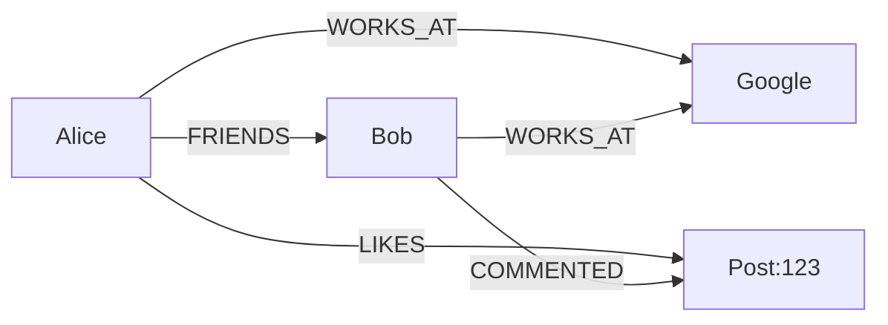
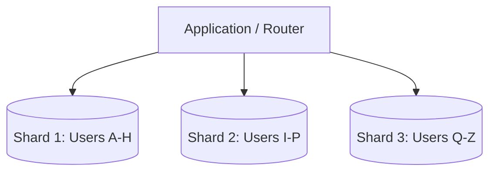
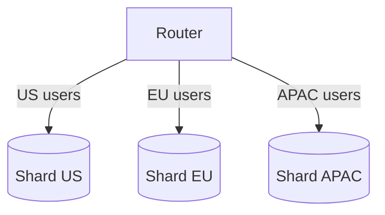
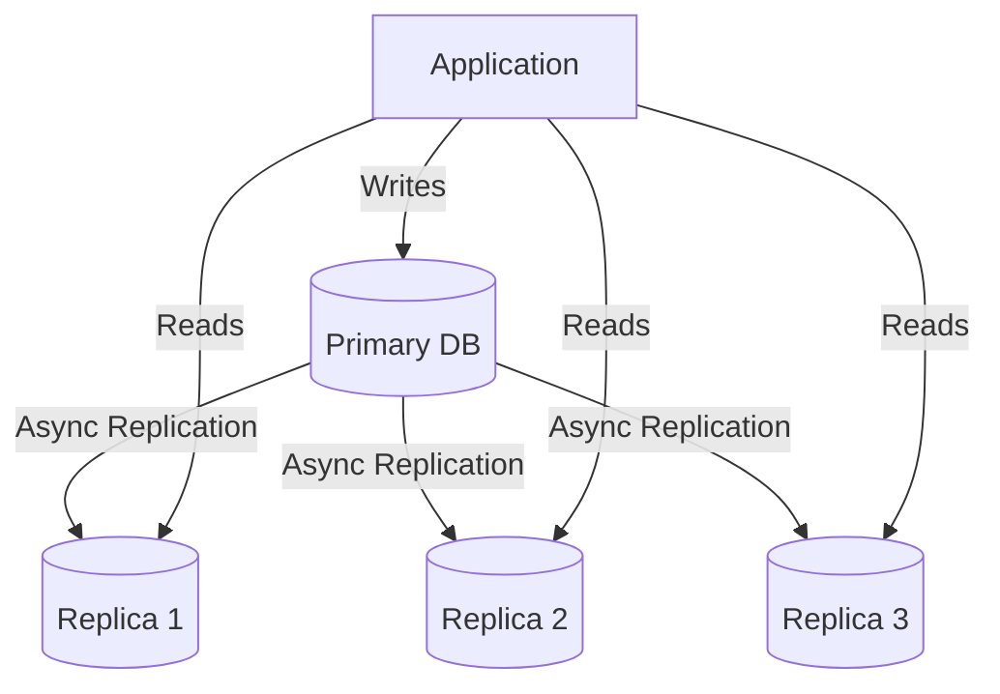
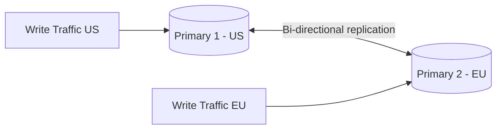
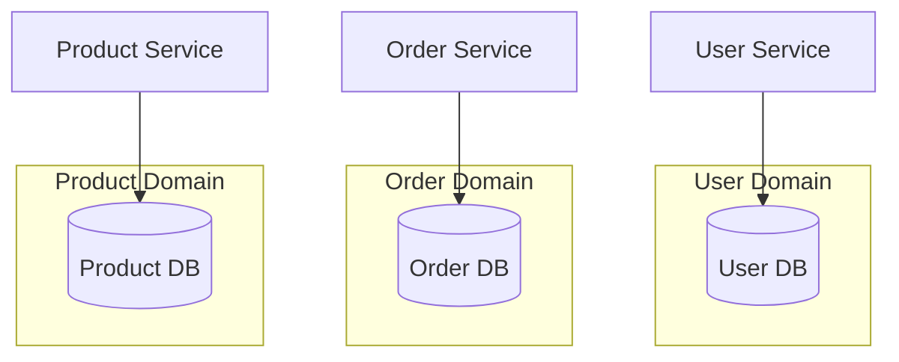
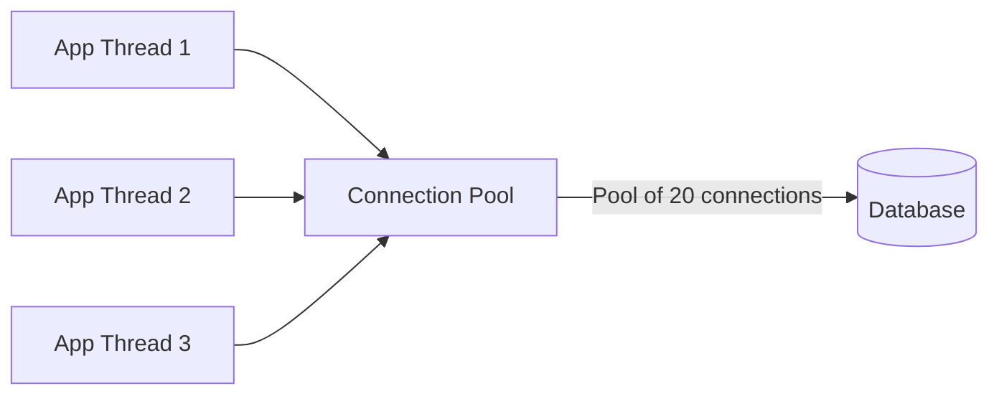

# Database Selection and Design

## Choosing the Right Database

The database choice is one of the most critical decisions in system design. It affects performance, scalability, consistency, and operational complexity. There is no "best" database — only the best fit for your specific requirements.

### Decision Framework

```mermaid
graph TD
    Q1{What data model?} -->|Structured, relational| SQL[SQL Database]
    Q1 -->|Flexible, document| DOC[Document Store]
    Q1 -->|Key-value pairs| KV[Key-Value Store]
    Q1 -->|Time-series, write-heavy| COL[Column-Family]
    Q1 -->|Relationships, traversals| GRAPH[Graph Database]

    Q2{Consistency needs?} -->|Strong (ACID)| SQL
    Q2 -->|Eventual OK| DOC
    Q2 -->|Tunable| COL

    Q3{Scale needs?} -->|Vertical OK| SQL
    Q3 -->|Horizontal required| DOC
    Q3 -->|Massive write throughput| COL
```

## SQL vs NoSQL

### SQL (Relational Databases)

```
┌─────────────────────────────────┐
│           Users Table           │
├────┬─────────┬────────┬────────┤
│ id │  name   │ email  │ dept_id│
├────┼─────────┼────────┼────────┤
│ 1  │ Alice   │ a@x.co │ 10     │
│ 2  │ Bob     │ b@x.co │ 20     │
└────┴─────────┴────────┴────────┘
         ↓ JOIN ↓
┌─────────────────────────┐
│     Departments Table   │
├────┬────────────────────┤
│ id │  name              │
├────┼────────────────────┤
│ 10 │  Engineering       │
│ 20 │  Marketing         │
└────┴────────────────────┘
```

**Examples**: PostgreSQL, MySQL, Oracle, SQL Server, CockroachDB, Spanner

**Characteristics**:
- Structured schema (tables, rows, columns)
- ACID transactions (Atomicity, Consistency, Isolation, Durability)
- SQL query language (standardized, powerful)
- Relationships via foreign keys + JOINs
- Vertical scaling (primarily), horizontal via sharding

### NoSQL (Non-relational)

#### Document Store
```json
{
  "_id": "user1",
  "name": "Alice",
  "email": "a@x.co",
  "department": {
    "id": 10,
    "name": "Engineering"
  },
  "skills": ["Python", "Go", "Kubernetes"]
}
```
**Examples**: MongoDB, CouchDB, Firestore, Amazon DocumentDB
**Best for**: Content management, user profiles, catalogs, CMS, mobile backends

#### Key-Value Store
```
"user:1:name" → "Alice"
"user:1:email" → "a@x.co"
"session:abc123" → "{...}"
"rate_limit:ip:1.2.3.4" → "45"
```
**Examples**: Redis, DynamoDB, Memcached, etcd, Riak KV
**Best for**: Caching, session storage, real-time data, feature flags, rate limiting

#### Column-Family Store
```
Row Key: user1
  ┌──────────┬──────────┬──────────┐
  │ Profile  │ Activity │ Settings │
  │ name:Ali │ last:now │ theme:dk │
  │ email:a@ │ login:5  │ lang:en  │
  └──────────┴──────────┴──────────┘
```
**Examples**: Cassandra, HBase, ScyllaDB, Google Bigtable
**Best for**: Time-series data, IoT, logging, write-heavy workloads, analytics

#### Graph Database

**Examples**: Neo4j, Amazon Neptune, ArangoDB, JanusGraph
**Best for**: Social networks, recommendation engines, fraud detection, knowledge graphs

#### Time-Series Database
```
metric: cpu_usage
  host: web-1
  timestamp: 2024-01-15T10:30:00Z
  value: 72.5%

timestamp: 2024-01-15T10:30:01Z
  value: 73.1%
```
**Examples**: InfluxDB, TimescaleDB, Prometheus, QuestDB
**Best for**: Monitoring, IoT metrics, financial tickers, application metrics

### SQL vs NoSQL Comparison

| Factor | SQL | NoSQL |
|--------|-----|-------|
| Schema | Fixed, predefined | Flexible, dynamic |
| Scaling | Vertical (primarily) | Horizontal (native) |
| Consistency | Strong (ACID) | Eventual (BASE), tunable |
| Transactions | Full ACID support | Limited or none |
| Query Language | SQL (standardized) | Varies by DB |
| Relationships | JOINs (powerful) | Denormalized/embedded |
| Maturity | Decades of tooling | Rapidly evolving |
| Best for | Complex queries, transactions | High scale, flexible schema |

### Decision Matrix

| Use Case | Recommended | Why |
|----------|------------|-----|
| E-commerce (orders, payments) | SQL (PostgreSQL) | ACID transactions needed |
| Social media feed | NoSQL (Cassandra) | Write-heavy, high scale |
| User sessions | Key-Value (Redis) | Fast reads, TTL support |
| Product catalog | Document (MongoDB) | Flexible schema, varied attributes |
| Real-time analytics | Column (Cassandra) | Write-optimized, time-series |
| Social graph | Graph (Neo4j) | Relationship traversal queries |
| Financial transactions | SQL (PostgreSQL/CockroachDB) | Strong consistency, ACID |
| IoT sensor data | Column (Cassandra) or TSDB | High write throughput |
| Configuration/Feature flags | Key-Value (etcd) | Simple lookups, watch support |
| Search | Elasticsearch | Full-text search, facets |
| Geospatial | MongoDB or PostGIS | Geo queries natively supported |

## Database Sharding

### What is Sharding?
Splitting a large database into smaller, faster, more manageable pieces called **shards**. Each shard is an independent database that holds a subset of the total data.



### Shard Key Selection

The shard key determines how data is distributed. Choosing the wrong key can lead to hotspots and poor performance.

| Shard Key | Distribution | Range Queries | Hotspots | Example |
|-----------|-------------|---------------|----------|---------|
| User ID (hash) | Even | Poor | None | `hash(user_id) % N` |
| Geographic | By region | Good | If one region is huge | `region = US/EU/APAC` |
| Time-based | By period | Excellent | Yes (current period) | `created_at month` |
| Tenant ID | By customer | Good | If one tenant is large | `tenant_id` |
| Composite | Custom | Depends | Depends | `region + user_id` |

### Sharding Strategies Deep Dive

#### Hash-Based Sharding
```python
def get_shard(user_id, num_shards):
    return hash(user_id) % num_shards

# user_id=12345 → shard 2 (out of 4 shards)
# user_id=67890 → shard 1
```
- **Pros**: Even distribution regardless of key pattern
- **Cons**: Range queries span all shards; adding shards requires rehashing
- **Solution**: Consistent hashing minimizes data movement

#### Range-Based Sharding
```
Shard 1: users with ID 1-1000000
Shard 2: users with ID 1000001-2000000
Shard 3: users with ID 2000001-3000000
```
- **Pros**: Range queries are efficient (hit one shard)
- **Cons**: Hotspots if new users cluster in one range
- **Solution**: Split hot ranges, use auto-splitting

#### Directory-Based Sharding
```
Lookup Table:
  user_id 1-1000000    → Shard 1
  user_id 1000001-2000000 → Shard 2
  tenant "acme"        → Shard 3
  tenant "globex"      → Shard 1
```
- **Pros**: Maximum flexibility, can remap without data migration
- **Cons**: Lookup table is a SPOF and bottleneck
- **Solution**: Cache the lookup table, replicate it

#### Geographic Sharding

- **Pros**: Data locality, compliance (GDPR), low latency
- **Cons**: Cross-region queries are expensive; users who travel
- **Solution**: Replicate reference data globally

### Sharding Challenges

1. **Cross-shard queries**: JOINs across shards are expensive or impossible
2. **Rebalancing**: Adding shards requires data migration (can be disruptive)
3. **Hotspots**: Uneven data distribution creates overloaded shards
4. **Referential integrity**: Foreign keys across shards don't work
5. **Distributed transactions**: 2PC is slow and complex
6. **Global unique IDs**: Need distributed ID generation (Snowflake, UUID)

### Handling Cross-Shard Queries

```python
# Option 1: Scatter-gather (expensive)
def get_user_orders(user_id):
    # Query all shards, merge results
    results = []
    for shard in all_shards:
        results += shard.query(f"SELECT * FROM orders WHERE user_id = {user_id}")
    return results

# Option 2: Materialized views (denormalization)
# Pre-compute cross-shard data in a separate store
def get_user_with_orders(user_id):
    return materialized_view.query(f"user_orders:{user_id}")

# Option 3: Co-locate related data
# Shard orders by user_id (same shard as user)
def get_user_orders(user_id):
    shard = get_shard(user_id)
    return shard.query(f"SELECT * FROM orders WHERE user_id = {user_id}")
```

### Sharding Approaches

#### Application-Level Sharding
```python
def get_shard(user_id):
    shard_num = hash(user_id) % NUM_SHARDS
    return SHARDS[shard_num]
```
- Application decides shard routing
- Flexible but adds complexity to application code
- Must handle failover and rebalancing

#### Proxy-Based Sharding
```
App → Proxy (Vitess, ProxySQL, Citus) → Shards
```
- Proxy handles routing transparently
- Application thinks it's talking to one database
- Examples: Vitess (for MySQL), Citus (for PostgreSQL), ProxySQL

#### Managed Sharding
- AWS DynamoDB: Automatic partitioning based on partition key
- MongoDB Atlas: Auto-sharding with configurable shard key
- Google Spanner: Automatic splitting with SQL interface

### Distributed ID Generation

When sharding, you need globally unique IDs that don't require coordination.

| Method | Example | Pros | Cons |
|--------|---------|------|------|
| UUID | `550e8400-e29b-41d4-a716-446655440000` | No coordination | Large, not sortable |
| Snowflake | `1234567890123456789` | Sortable, time-ordered | Clock dependency |
| ULID | `01ARZ3NDEKTSV4RRFFQ69G5FAV` | Sortable, compact | Newer standard |
| Auto-increment + offset | Shard 1: 1,3,5; Shard 2: 2,4,6 | Simple | Requires coordination |
| Timestamp + random | `20240115-abc123` | Time-sortable | Collision risk at scale |

## Database Replication

### Primary-Replica (Master-Slave)


- **Primary**: Handles all writes
- **Replicas**: Handle reads, receive changes asynchronously
- **Use case**: Read-heavy workloads (90%+ reads)
- **Trade-off**: Replication lag means replicas may be slightly behind

### Multi-Primary (Master-Master)


- Both primaries accept writes
- Conflict resolution needed (last-writer-wins, application logic)
- **Use case**: Multi-region deployments, active-active geo
- **Challenge**: Write conflicts, split-brain scenarios

### Synchronous vs Asynchronous Replication

| Aspect | Synchronous | Asynchronous | Semi-synchronous |
|--------|------------|--------------|------------------|
| Consistency | Strong | Eventual | Near-strong |
| Write latency | High (waits for replica ACK) | Low | Medium |
| Data loss risk | None | Possible on primary failure | Minimal |
| Availability | Lower (replica failure blocks writes) | Higher | Medium |
| Throughput | Lower | Higher | Medium |
| Use case | Financial data | Most web apps | Important data |

### Read-After-Write Consistency

**Problem**: User writes to primary, then reads from replica that hasn't caught up yet.

**Solutions**:
1. **Read from primary after write**: Route recent writes to primary
2. **Read from same replica**: Sticky routing for read-after-write
3. **Causal consistency tokens**: Return write timestamp, ensure replica is caught up
4. **Wait for replication**: Block read until replica confirms it has the write

```python
# Option 1: Read from primary for recent writes
def get_user(user_id, write_timestamp=None):
    if write_timestamp and (now() - write_timestamp) < 5.seconds:
        return primary_db.query(user_id)  # Read from primary
    return replica_db.query(user_id)  # Read from replica
```

## Partitioning Strategies

### Horizontal Partitioning (Sharding)
Split rows across databases based on a key. Already covered above.

### Vertical Partitioning
Split columns across databases to separate hot and cold data.

```mermaid
graph LR
    subgraph "Before: Single Table"
        T1[id | name | email | bio | avatar | settings | logs]
    end
    subgraph "After: Vertical Partition"
        T2[id | name | email]
        T3[id | bio | avatar]
        T4[id | settings | logs]
    end
    T1 --> T2
    T1 --> T3
    T1 --> T4
```

- Reduces row size, improves cache efficiency
- Separate hot columns (name, email) from cold columns (bio, avatar)
- Different storage engines per partition (InnoDB for hot, Archive for cold)

### Functional Partitioning
Split by feature/service. Each service owns its data.



- Each microservice owns its database (no shared DB)
- Enables independent scaling, deployment, and technology choices
- Requires API-based inter-service communication

## Schema Design Patterns

### 1. Denormalization
Trade normalization for read performance by duplicating data.

```sql
-- Normalized (3NF)
SELECT u.name, o.total
FROM users u JOIN orders o ON u.id = o.user_id;

-- Denormalized (pre-joined)
SELECT user_name, total FROM orders_with_user;
-- user_name is duplicated in every order row
```
- **Pros**: Faster reads (no JOINs)
- **Cons**: Data redundancy, update anomalies, more storage
- **Use when**: Read-heavy, JOINs are expensive, data rarely changes

### 2. Polymorphic Association
Store different entity types in one table.

```sql
-- Comments on posts, photos, or videos
comments:
  id | body | commentable_type | commentable_id
  1  | Nice | post             | 123
  2  | Wow  | photo            | 456
```

### 3. Entity-Attribute-Value (EAV)
Store attributes as rows instead of columns (extremely flexible schema).

```
entity_id | attribute  | value
1         | name       | Alice
1         | email      | a@x.co
1         | age        | 30
```
- **Pros**: Schema-less, add attributes without migration
- **Cons**: Complex queries, poor performance, hard to validate
- **Use when**: Highly variable attributes (product catalogs with thousands of attributes)

### 4. Materialized Views
Pre-computed query results stored as a table.

```sql
CREATE MATERIALIZED VIEW user_order_summary AS
SELECT user_id, COUNT(*) as order_count, SUM(total) as total_spent
FROM orders
GROUP BY user_id;

-- Fast query against pre-computed data
SELECT * FROM user_order_summary WHERE user_id = 123;
```
- **Pros**: Fast reads for complex aggregations
- **Cons**: Must be refreshed (stale between refreshes), extra storage
- **Use when**: Complex aggregations, dashboards, reporting

### 5. Soft Deletes
Mark records as deleted instead of actually deleting them.

```sql
-- Instead of DELETE FROM users WHERE id = 123
UPDATE users SET deleted_at = NOW() WHERE id = 123;

-- All queries must filter out soft-deleted records
SELECT * FROM users WHERE deleted_at IS NULL;
```
- **Pros**: Recoverable, audit trail, referential integrity preserved
- **Cons**: Table bloat, query complexity, must remember to filter

### 6. Temporal Tables / Event Sourcing
Store all changes as immutable events.

```
events:
  id | entity_id | event_type | data           | timestamp
  1  | user:123  | created    | {name: Alice}  | T1
  2  | user:123  | updated    | {name: Bob}    | T2
  3  | user:123  | deleted    | {}             | T3
```
- **Pros**: Complete audit trail, time-travel queries, undo capability
- **Cons**: Storage growth, query complexity, eventual consistency
- **Use when**: Financial systems, audit requirements, complex state machines

## Indexing

### Why Index?
Without index: Full table scan O(n)
With index: Binary search O(log n)

For a table with 1 billion rows:
- Without index: Scan 1B rows (seconds to minutes)
- With index: ~30 comparisons (microseconds)

### Types of Indexes

| Type | Structure | Use Case | Example |
|------|-----------|----------|---------|
| **B-Tree** | Balanced tree | Range queries, sorting, equality | `CREATE INDEX ON users(name)` |
| **Hash** | Hash table | Exact lookups only | `CREATE INDEX ON users USING HASH(email)` |
| **GIN** | Inverted index | Full-text search, arrays, JSONB | `CREATE INDEX ON posts USING GIN(body)` |
| **GiST** | Generalized search tree | Geospatial, ranges, full-text | PostGIS spatial queries |
| **Composite** | Multiple columns | Multi-column queries | `CREATE INDEX ON orders(user_id, created_at)` |
| **Covering** | Includes query columns | Index-only scans | `CREATE INDEX ON users(name) INCLUDE (email)` |
| **Partial** | Filtered index | Subset of rows | `CREATE INDEX ON users(email) WHERE active = true` |
| **BRIN** | Block range | Very large ordered tables | Time-series data by timestamp |

### Index Trade-offs
- ✅ Faster reads (often 100-1000× improvement)
- ❌ Slower writes (index must be updated on every write)
- ❌ Extra storage (indexes can be larger than the table)
- ❌ Can cause write amplification (WAL + index updates)
- ❌ Maintenance overhead (REINDEX, ANALYZE)

### Index Best Practices

```sql
-- Good: Index on frequently queried column
CREATE INDEX idx_orders_user_id ON orders(user_id);

-- Good: Composite index for common query pattern
CREATE INDEX idx_orders_user_date ON orders(user_id, created_at DESC);

-- Good: Partial index for active records only
CREATE INDEX idx_active_users ON users(email) WHERE deleted_at IS NULL;

-- Bad: Too many indexes (slows down writes)
-- Bad: Index on low-cardinality column (gender: M/F)
-- Bad: Redundant index (index on (a) when (a,b) exists)
```

## Connection Pooling

Database connections are expensive (memory, TCP handshake, authentication).



### Pool Configuration
```
Min connections:    5  (keep warm)
Max connections:    20 (limit DB load)
Idle timeout:       300s (close idle connections)
Connection timeout: 5s (fail fast if pool exhausted)
```

### Connection Pooling Tools
| Tool | Database | Features |
|------|----------|----------|
| **PgBouncer** | PostgreSQL | Lightweight, transaction-level pooling |
| **ProxySQL** | MySQL | Query routing, caching, connection pooling |
| **HikariCP** | Java (any DB) | Fast, low-overhead Java pool |
| **SQLAlchemy Pool** | Python (any DB) | Built-in pooling for Python |

## Real-World Database Choices

| Company | Primary DB | Why | Secondary Stores |
|---------|-----------|-----|-----------------|
| **Amazon** | DynamoDB (custom) | Massive scale, eventual consistency OK | Aurora, Redshift |
| **Netflix** | Cassandra | Write-heavy, multi-region | MySQL (billing), EVCache |
| **Uber** | MySQL + Schemaless | ACID for transactions, flexibility | Cassandra, Redis |
| **Twitter** | Manhattan (custom) | Low latency, high availability | MySQL (social graph), Redis |
| **Instagram** | PostgreSQL | Strong consistency, rich queries | Redis, Cassandra |
| **Facebook** | MySQL (sharded) | Proven at scale, strong consistency | TAO (graph), Memcached |
| **LinkedIn** | Espresso (custom) | Multi-tenant, high availability | Oracle (legacy), Kafka |
| **Discord** | Cassandra → ScyllaDB | Message storage, write-heavy | PostgreSQL (user data), Redis |
| **GitHub** | MySQL (sharded) | Proven, strong consistency | Redis, Elasticsearch |

## Interview Tips

1. **Never default to one DB** — "Let me consider the requirements before choosing..."
2. **Discuss read/write ratio** — Read-heavy → replicas; write-heavy → sharding
3. **Consider data relationships** — Relational? → SQL. Document-oriented? → NoSQL
4. **Mention specific technologies** — "PostgreSQL for transactions, Redis for caching, Elasticsearch for search"
5. **Discuss scaling strategy** — "We'll start with read replicas, then shard when write throughput exceeds..."
6. **Think about data model** — Schema design drives DB choice and indexing strategy
7. **Consider operational complexity** — "Cassandra is great but requires expertise in compaction tuning"
8. **Don't forget about backups, monitoring, and DR**
9. **Discuss migration strategy** — "We'll use dual-write during migration, then cut over"

## Common Mistakes

- ❌ Choosing NoSQL just because it's "cool" or trendy
- ❌ Sharding too early (adds complexity before it's needed)
- ❌ Ignoring data relationships and choosing the wrong paradigm
- ❌ Not considering operational overhead (monitoring, backups, upgrades)
- ❌ Using the wrong shard key (causes hotspots)
- ❌ Forgetting about indexes (or creating too many)
- ❌ Using a single database for everything (one-size-fits-none)
- ❌ Not planning for data growth and migration

## References

- Martin Kleppmann, *Designing Data-Intensive Applications*, O'Reilly, 2017
- [PostgreSQL Documentation](https://www.postgresql.org/docs/)
- [MongoDB Manual](https://www.mongodb.com/docs/)
- [Cassandra Architecture](https://cassandra.apache.org/doc/latest/cassandra/architecture/)
- [Vitess Documentation](https://vitess.io/docs/)
- [AWS Database Blog](https://aws.amazon.com/blogs/database/)
- [Google Cloud - Choosing a Database](https://cloud.google.com/docs/get-started/choose-a-database)

## Cross-References

- [Scalability](./scalability.md) — Sharding and replication strategies
- [Consistency Tradeoffs](./consistency-tradeoffs.md) — CAP theorem implications
- [Caching Strategy](./caching-strategy.md) — Cache-DB consistency
- [Data Intensive](./data-intensive.md) — Data warehouses and lakes
- [Capacity Planning](./capacity-planning.md) — Storage estimation
- [DBMS Overview](../../dbms/overview.md)
- [DBMS Normalization](../../dbms/normalization/3nf.md)
- [Storage Distributed](../../storage/distributed.md)
- [Key-Value Store](../kv-store.md)
