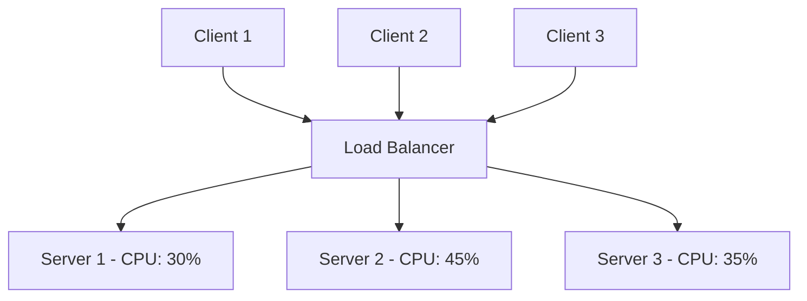
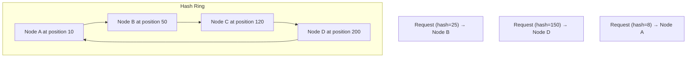
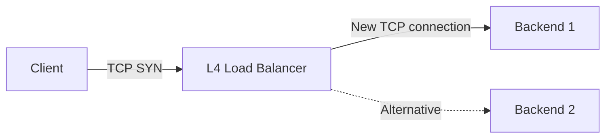
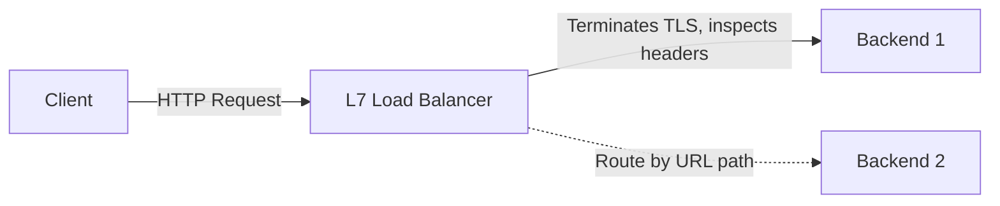
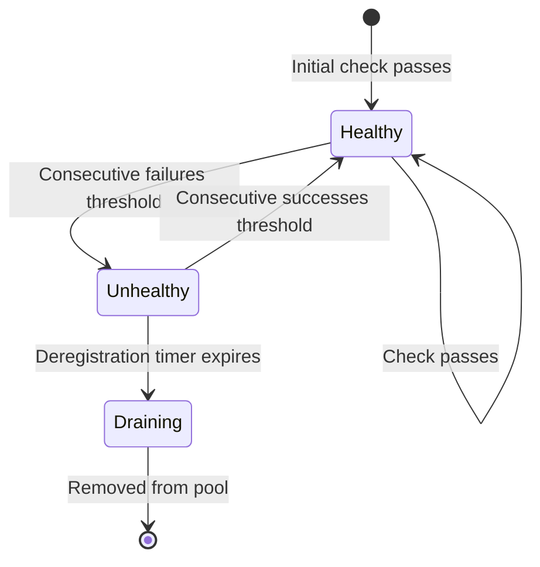
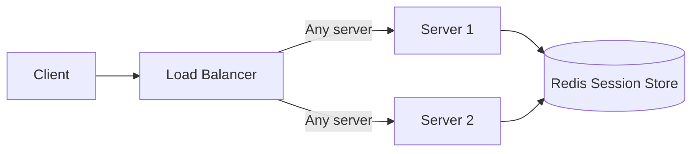
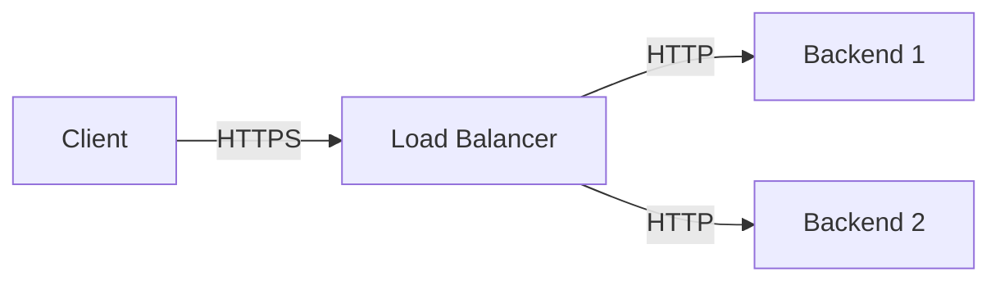
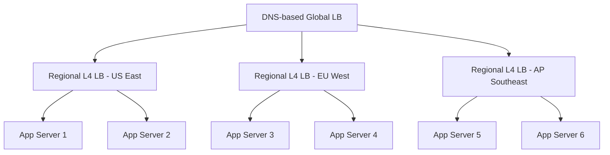
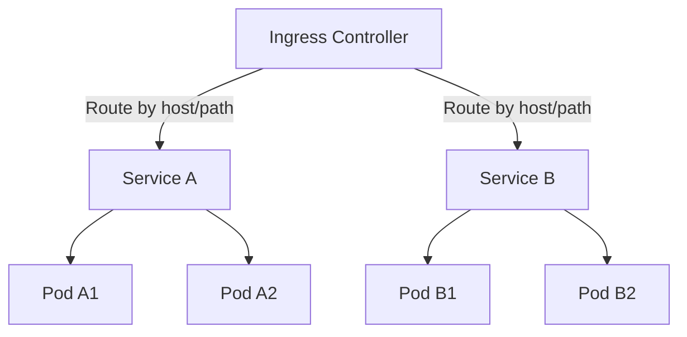
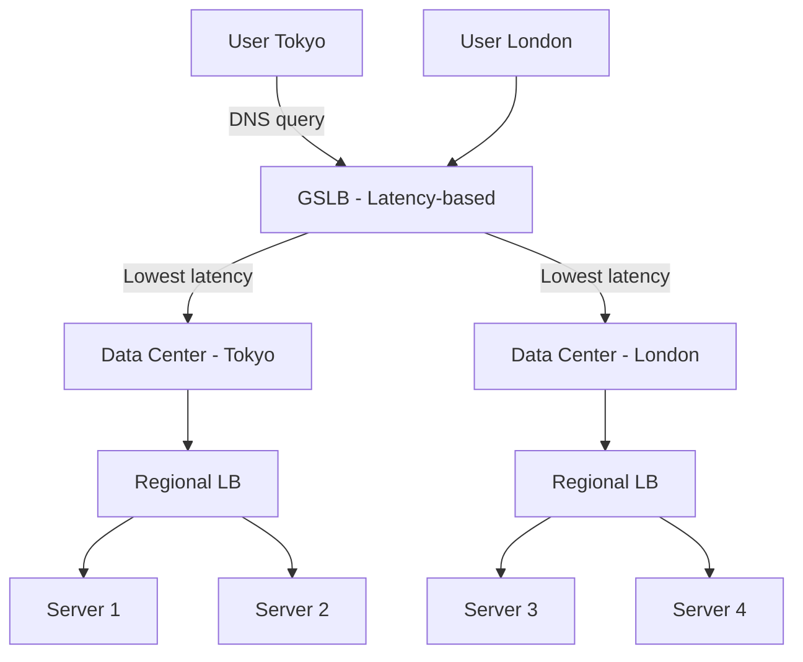

# Load Balancing Design

## What is Load Balancing?

A load balancer distributes incoming network traffic across multiple backend servers to ensure no single server bears too much demand. It improves responsiveness, availability, and resource utilization.



## Why Load Balancing?

| Without Load Balancer | With Load Balancer |
|----------------------|-------------------|
| Single point of failure | High availability |
| Limited throughput | Scales horizontally |
| Uneven resource use | Even distribution |
| Downtime during deploys | Zero-downtime deploys |
| No fault tolerance | Automatic failover |

## Load Balancing Algorithms

### 1. Round Robin
```
Request 1 → Server A
Request 2 → Server B
Request 3 → Server C
Request 4 → Server A  (cycle repeats)
```

- **How**: Cycles through servers sequentially
- **Pros**: Simple, fair distribution, no state tracking
- **Cons**: Ignores server capacity/load; a slow server gets the same traffic
- **Use when**: All servers have equal capacity and similar request processing times

### 2. Weighted Round Robin
```
Server A (weight=5): gets 5/10 requests
Server B (weight=3): gets 3/10 requests
Server C (weight=2): gets 2/10 requests
```

- **How**: Assigns weights based on server capacity
- **Pros**: Accounts for different server specs
- **Cons**: Weights are static, don't reflect real-time load
- **Use when**: Servers have different capacities (e.g., mixed instance types)

### 3. Least Connections
```
Server A: 10 active connections → pick (fewest)
Server B: 25 active connections
Server C: 15 active connections
```

- **How**: Routes to the server with fewest active connections
- **Pros**: Adapts to real-time load; handles long-lived connections well
- **Cons**: Doesn't account for connection duration or server capacity
- **Use when**: Requests have varying processing times (e.g., API calls with different complexity)

### 4. Weighted Least Connections
```
Server A (weight=5, connections=20): ratio = 20/5 = 4.0
Server B (weight=3, connections=9):  ratio = 9/3  = 3.0 → pick
Server C (weight=2, connections=10): ratio = 10/2 = 5.0
```

- **How**: Combines weights with connection count; picks lowest ratio
- **Pros**: Best of both worlds — capacity-aware and load-aware
- **Cons**: More complex to implement
- **Use when**: Mixed server capacities with varying request durations

### 5. Least Response Time
```
Server A: avg 50ms → pick (fastest)
Server B: avg 120ms
Server C: avg 80ms
```

- **How**: Routes to the server with lowest average response time
- **Pros**: Accounts for both load and network latency
- **Cons**: Can oscillate under load, more overhead to track
- **Use when**: Response time is the critical metric (user-facing APIs)

### 6. IP Hash
```
hash(client_ip) % num_servers = server_index
Client 192.168.1.1 → hash → Server A (always)
Client 192.168.1.2 → hash → Server B (always)
```

- **How**: Hash of client IP determines server
- **Pros**: Same client always goes to same server (session affinity)
- **Cons**: Uneven distribution if IPs are clustered (NAT, corporate proxies)
- **Use when**: Session affinity is needed without cookies; simple stateful routing

### 7. Consistent Hashing



- **How**: Maps both servers and requests to positions on a hash ring; request goes to nearest server clockwise
- **Pros**: Minimal redistribution when servers are added/removed (only ~1/N keys move)
- **Cons**: More complex to implement; can have uneven distribution without virtual nodes
- **Use when**: Distributed caching (Memcached, Redis), CDN routing, database sharding

**Virtual Nodes**: Each physical node gets multiple positions on the ring (e.g., 150 virtual nodes per physical). This ensures even distribution even with few physical nodes.

```
Physical Node A → positions: 5, 35, 67, 99, 131, 163, 195, 227, 259
Physical Node B → positions: 12, 44, 76, 108, 140, 172, 204, 236, 268
```

### 8. Random with Two Choices (Power of Two)

```
Pick 2 random servers → Choose the one with fewer connections
```

- **How**: Randomly select two servers, pick the one with lower load
- **Pros**: Near-optimal distribution with minimal state; avoids thundering herd
- **Cons**: Slightly more complex than pure random
- **Use when**: Large clusters where tracking all server states is expensive

### Algorithm Comparison

| Algorithm | Load Aware | Session Affinity | Complexity | Best For |
|-----------|-----------|-----------------|------------|----------|
| Round Robin | ❌ | ❌ | Low | Equal servers |
| Weighted RR | Partial | ❌ | Low | Unequal capacity |
| Least Conn | ✅ | ❌ | Medium | Varying request times |
| Weighted LC | ✅ | ❌ | Medium | Mixed capacity + varying load |
| Least RT | ✅ | ❌ | Medium | Latency-sensitive |
| IP Hash | ❌ | ✅ | Low | Session persistence |
| Consistent Hash | ❌ | ✅ | High | Distributed cache, sharding |
| Power of Two | ✅ | ❌ | Medium | Large clusters |

## L4 vs L7 Load Balancing

Understanding which OSI layer the load balancer operates on is fundamental to choosing the right solution.

### Layer 4 (Transport Layer)



- **Operates on**: IP address + port (TCP/UDP headers)
- **Speed**: Very fast (minimal processing, no payload inspection)
- **Decisions**: Based on source/dest IP, port, protocol
- **Connection handling**: New TCP connection to backend (NAT or DSR)
- **Use cases**: Database load balancing, gaming servers, IoT, raw TCP/UDP
- **Examples**: AWS NLB, HAProxy (TCP mode), Linux IPVS, LVS

**Direct Server Return (DSR)**: In L4, the backend can respond directly to the client, bypassing the load balancer on the return path. This reduces LB bandwidth but requires special network configuration.

### Layer 7 (Application Layer)



- **Operates on**: HTTP headers, URL, cookies, payload, gRPC metadata
- **Speed**: Slower (must parse HTTP/gRPC, terminate TLS)
- **Decisions**: Content-based routing (URL path, headers, cookies)
- **Connection handling**: Two separate connections (client↔LB, LB↔backend)
- **Use cases**: Web applications, API gateways, microservices routing
- **Examples**: AWS ALB, Nginx, Envoy, HAProxy (HTTP mode), Traefik

### L4 vs L7 Detailed Comparison

| Feature | L4 | L7 |
|---------|----|----|
| Speed | Faster (~μs overhead) | Slower (~ms overhead) |
| Content inspection | No | Yes |
| URL-based routing | No | Yes |
| Header-based routing | No | Yes |
| SSL/TLS termination | Pass-through | Can terminate |
| Cookie handling | No | Yes |
| WebSocket support | Yes (TCP) | Yes (HTTP upgrade) |
| gRPC support | TCP only | Full (path, metadata) |
| Request rate limiting | Connection-level | Per-endpoint |
| Cost | Lower (CPU) | Higher (CPU, memory) |
| DSR support | Yes | No |
| Protocol | Any TCP/UDP | HTTP/HTTPS/gRPC/WebSocket |

### When to Use Which

| Scenario | Choice | Why |
|----------|--------|-----|
| HTTP/HTTPS web app | L7 | Need URL routing, SSL termination |
| Database (MySQL, PostgreSQL) | L4 | Protocol-specific, no HTTP |
| Gaming servers | L4 | Low latency, raw UDP |
| Microservices gateway | L7 | Path-based routing to services |
| gRPC services | L7 | Need gRPC method routing |
| IoT device connections | L4 | Raw TCP, minimal overhead |
| WebSocket at scale | L7 | Need HTTP upgrade handling |

### L7 Routing Examples
```
/api/v1/users/*    → User Service
/api/v1/orders/*   → Order Service
/static/*          → CDN / Static Servers
*.websocket        → WebSocket Servers
Host: api.x.com    → API Cluster
Host: web.x.com    → Web Cluster
Header: X-Version: v2 → Canary Deployment
```

## Health Checks

Health checks ensure traffic is only sent to healthy servers. They are **essential** for any production load balancing setup.

### Types of Health Checks

| Type | How | Detects | Overhead |
|------|-----|---------|----------|
| **TCP** | Can we connect to port? | Server down, port blocked | Very low |
| **HTTP** | GET /health returns 200? | App crash, dependency failure | Low |
| **HTTPS** | Same as HTTP with TLS | TLS issues | Low-medium |
| **Custom/Script** | Checks DB, cache, disk, queue | Deep health issues | Variable |
| **gRPC Health** | gRPC Health Checking Protocol | Service-specific issues | Low |

### Health Check Configuration
```
Interval:     10 seconds (check every 10s)
Timeout:      5 seconds (mark unhealthy if no response in 5s)
Threshold:    3 (3 consecutive failures → unhealthy)
Recovery:     2 (2 consecutive successes → healthy)
Deregister:   300 seconds (remove from pool after 5 min unhealthy)
```

### Health Check Endpoint Design

```json
// GET /health (shallow - for load balancer)
{
  "status": "healthy",
  "uptime": 86400
}

// GET /health/deep (deep - for monitoring)
{
  "status": "degraded",
  "checks": {
    "database": { "status": "ok", "latency_ms": 5 },
    "cache": { "status": "ok", "latency_ms": 1 },
    "message_queue": { "status": "warning", "latency_ms": 150 },
    "disk": { "status": "ok", "free_gb": 50 }
  },
  "version": "1.2.3",
  "uptime": 86400
}
```

**Best Practices**:
- Use **shallow health checks** for load balancing (fast, just check process)
- Use **deep health checks** for monitoring (comprehensive, check dependencies)
- Include dependency status in deep health endpoint
- Don't make health checks too expensive (they run every few seconds)
- Return appropriate HTTP status codes (200 OK, 503 Service Unavailable)
- Health check should not trigger side effects or count as traffic

### Health Check States



## Sticky Sessions

Sticky sessions (session affinity) ensure a user's requests go to the same server.

### Methods

| Method | How | Pros | Cons |
|--------|-----|------|------|
| **Cookie-based** | LB injects cookie with server ID | Reliable, survives IP changes | Requires L7, cookie overhead |
| **IP-based** | Hash client IP | Works at L4 | NAT/proxy breaks it |
| **App-level token** | App includes server hint in response | Flexible | App complexity |

### Problems with Sticky Sessions
- **Uneven load distribution**: Popular sessions create hotspots
- **Server failure loses all sessions**: Users affected by a single server crash
- **Harder to scale down**: Can't remove server with active sessions
- **Violates stateless architecture**: Makes horizontal scaling harder
- **Complicates deployments**: Rolling updates affect pinned users

**Better Alternative**: Store sessions in external store (Redis, Memcached)


### When Sticky Sessions Are Acceptable
- WebSocket connections (inherently sticky to one server)
- In-memory caches that are expensive to replicate
- Legacy applications that can't be refactored
- Short-lived sessions with low data volume

## Connection Draining

When removing a server from the pool (for deployment, scaling in, maintenance), connection draining ensures active connections complete gracefully.

```
1. Mark server as "draining" (no new connections)
2. Wait for active connections to complete
3. Force-close remaining connections after timeout
4. Remove server from pool
```

**Configuration**:
- Draining timeout: 300 seconds (configurable)
- Active connections: Let them finish naturally
- New requests: Route to other healthy servers

## SSL/TLS Termination

The load balancer can terminate TLS, offloading encryption from backend servers.



### Where to Terminate TLS

| Location | Pros | Cons |
|----------|------|------|
| **At LB** | Offloads crypto from backends, central cert management | Internal traffic unencrypted |
| **At backend** | End-to-end encryption | Each server needs cert, more CPU |
| **At both** (re-encrypt) | Secure internal traffic | Double encryption overhead |

### TLS Termination Trade-offs
- **Performance**: TLS handshake is CPU-intensive; offloading to LB frees backend CPU
- **Security**: Terminating at LB means internal traffic is in plaintext (use mTLS or VPC for protection)
- **Certificate management**: Centralized at LB is easier than per-server

## Load Balancer in Practice

### Common Load Balancer Solutions

| Solution | Type | L4/L7 | Use Case | Cost |
|----------|------|-------|----------|------|
| **Nginx** | Software | L7 (+ L4) | Web server + LB | Free/OSS |
| **HAProxy** | Software | L4 + L7 | High-performance LB | Free/OSS |
| **Envoy** | Software | L4 + L7 | Service mesh proxy | Free/OSS |
| **Traefik** | Software | L7 | Container-native LB | Free/OSS |
| **AWS ALB** | Managed | L7 | HTTP/HTTPS workloads | Pay per use |
| **AWS NLB** | Managed | L4 | TCP/UDP, ultra-low latency | Pay per use |
| **GCP CLB** | Managed | L4 + L7 | Google Cloud workloads | Pay per use |
| **Cloudflare** | CDN + LB | L7 | Global load balancing | Freemium |
| **F5 BIG-IP** | Hardware | L4 + L7 | Enterprise on-prem | License |

### Multi-tier Load Balancing



**Tier 1 — Global (DNS-based)**:
- Routes users to nearest region (latency-based or geo-based)
- Examples: AWS Route 53, Cloudflare Load Balancer, Azure Traffic Manager

**Tier 2 — Regional (L4)**:
- High-throughput TCP/UDP distribution within a region
- Examples: AWS NLB, Linux LVS/IPVS

**Tier 3 — Service (L7)**:
- Content-based routing to specific microservices
- Examples: Nginx, Envoy, AWS ALB

### Load Balancing in Kubernetes



**Types of Kubernetes Services**:
- **ClusterIP**: Internal-only load balancing (L4)
- **NodePort**: Exposes on each node's port
- **LoadBalancer**: Provisions cloud LB (L4)
- **Ingress**: L7 routing with path/host rules
- **Gateway API**: Next-gen L7 routing (more flexible than Ingress)

### Global Server Load Balancing (GSLB)



**GSLB Strategies**:
- **Latency-based**: Route to lowest-latency data center
- **Geo-based**: Route based on user's geographic location
- **Weighted**: Distribute traffic by percentage (e.g., 80% US, 20% EU)
- **Failover**: Primary region fails → route to secondary

## Interview Tips

1. **Start with requirements** — "What's the traffic pattern? Read-heavy or write-heavy? Global or regional?"
2. **Choose algorithm based on use case** — Don't default to round robin; explain your reasoning
3. **Explain the "why"** — "Least connections because request processing times vary from 10ms to 5s"
4. **Consider failure scenarios** — "What happens when a server goes down? How quickly do we detect it?"
5. **Mention health checks** — Always include health checking in your design
6. **Discuss sticky sessions trade-off** — "We'd prefer stateless, but if needed, use Redis for session storage"
7. **Think about SSL termination** — Where does TLS end? What are the security implications?
8. **Consider multi-region** — "For global users, we'd use DNS-based geo-routing with regional L4/L7"
9. **Mention connection draining** — Important for zero-downtime deployments

## Common Mistakes

- ❌ Forgetting health checks (traffic goes to dead servers)
- ❌ Using sticky sessions without discussing trade-offs
- ❌ Not considering the load balancer itself as a single point of failure
- ❌ Ignoring SSL/TLS termination strategy
- ❌ Choosing L7 when L4 would suffice (adding unnecessary latency)
- ❌ Not planning for the load balancer's own capacity limits
- ❌ Using round robin for servers with different capacities

## References

- [Nginx HTTP Load Balancing Documentation](https://docs.nginx.com/nginx/admin-guide/load-balancer/http-load-balancer/)
- [HAProxy Configuration Manual](https://www.haproxy.com/documentation/haproxy-configuration-manual/)
- [Envoy Proxy Documentation](https://www.envoyproxy.io/docs/envoy/latest/)
- [AWS ELB Documentation](https://docs.aws.amazon.com/elasticloadbalancing/)
- [Google Cloud Load Balancing](https://cloud.google.com/load-balancing/docs)
- Karger et al., "Consistent Hashing and Random Trees", MIT, 1997
- Martin Kleppmann, *Designing Data-Intensive Applications*, Chapter 6

## Cross-References

- [Scalability](./scalability.md) — Horizontal scaling requires load balancing
- [Availability](./availability.md) — LB is key to high availability
- [Caching Strategy](./caching-strategy.md) — Consistent hashing for cache distribution
- [API Design](./api-design.md) — Rate limiting at the LB level
- [Security Design](./security-design.md) — SSL termination, DDoS protection
- [Cloud Kubernetes Services](../../../cloud/kubernetes/services.md)
- [Networks HTTP](../../../networks/http/rest.md)
- [Rate Limiter](../rate-limiter.md)
