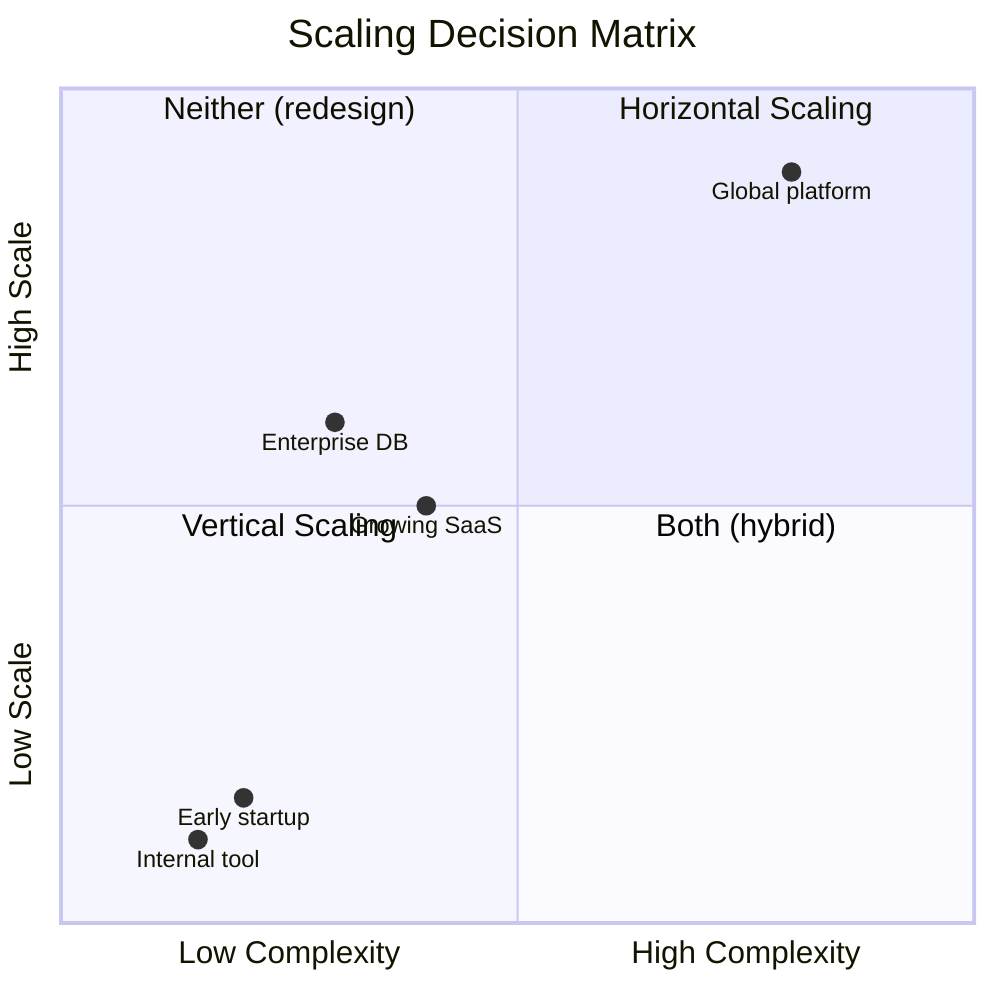
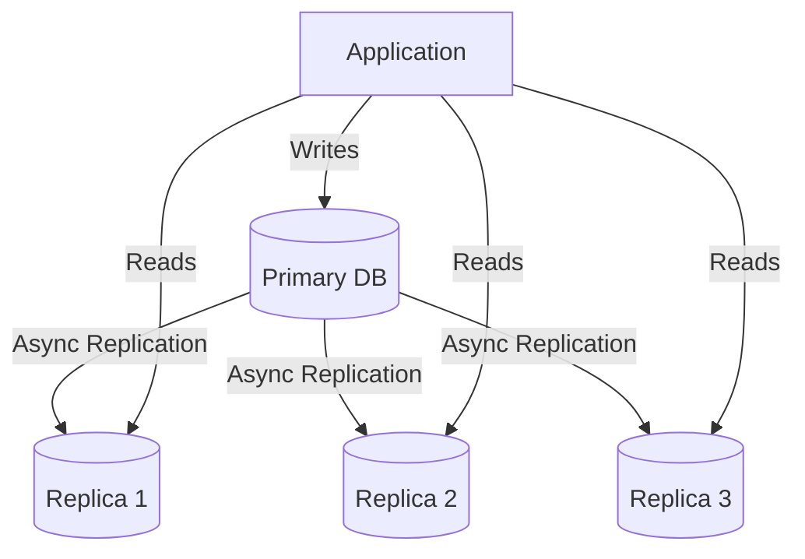
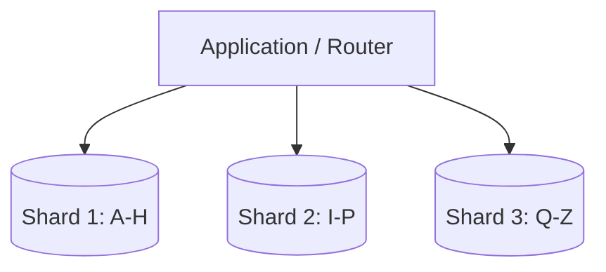
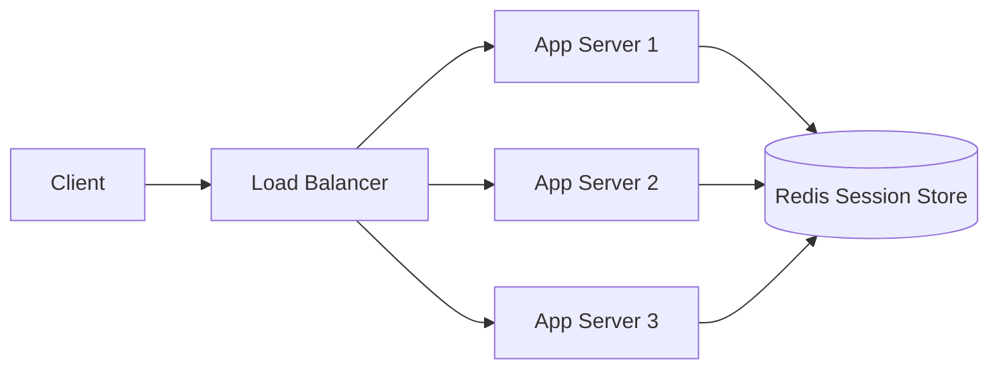
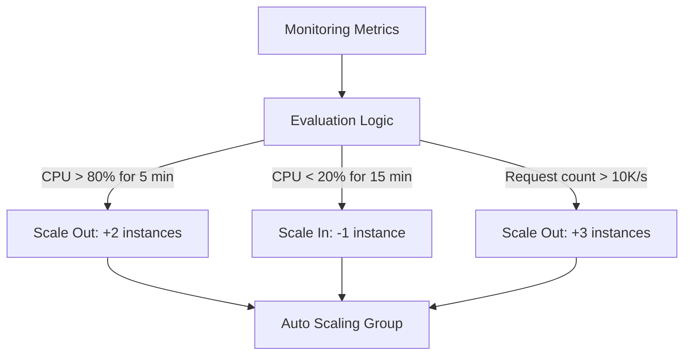
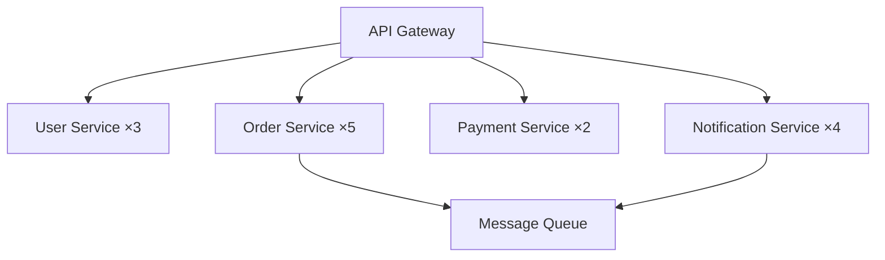
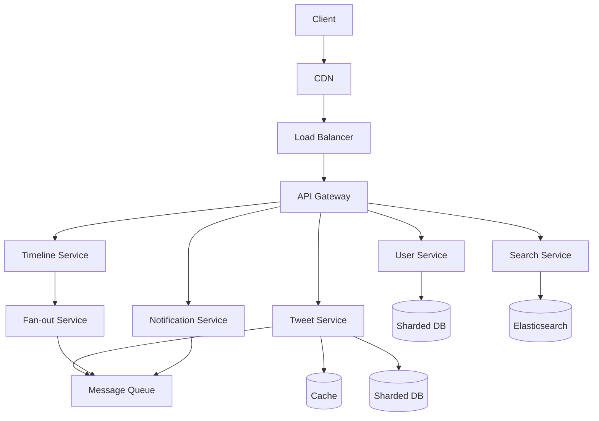
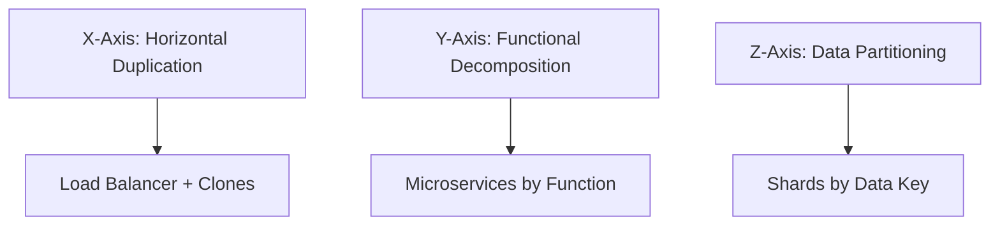

# Scalability Fundamentals

## What is Scalability?

Scalability is a system's ability to handle **increasing load** without degrading performance. A scalable system can grow from serving 1,000 users to 10 million users by adding resources rather than rewriting code.

> **Key Insight**: Scalability is not the same as performance. A fast single-threaded application is performant but not scalable. A scalable system maintains acceptable performance as load grows.

### Scalability Dimensions

| Dimension | What Grows | Example |
|-----------|-----------|---------|
| **Load scalability** | More users/requests | 1K → 10M users |
| **Data scalability** | More storage/records | GB → PB of data |
| **Geographic scalability** | More regions | US-only → Global |
| **Administrative scalability** | More teams/services | Monolith → Microservices |

## Vertical Scaling (Scale Up)

Adding more power to a single machine.

```
Before:  4 CPU, 16GB RAM  →  After:  16 CPU, 64GB RAM
```

### Pros
- Simple — no code changes needed
- No distributed system complexity
- Strong consistency is easy (single machine)
- No network overhead between nodes

### Cons
- Hardware limits (max CPU/RAM per machine)
- Single point of failure
- Expensive at the high end (cost grows exponentially)
- Downtime during upgrades
- Diminishing returns beyond a certain point

### When to Use
- Early-stage startups
- Databases (before sharding becomes necessary)
- When simplicity matters more than scale
- Legacy applications that can't be distributed

### Real-World Examples
- **PostgreSQL on a beefy server**: Many startups run a single powerful DB server with 64+ cores and 512GB RAM before considering sharding
- **Redis single-threaded**: Redis is single-threaded and benefits from fast CPUs; vertical scaling is the primary approach until Redis Cluster is needed
- **Mainframe systems**: Banks still run mainframes with massive vertical scale for transaction processing

## Horizontal Scaling (Scale Out)

Adding more machines to distribute the load.

```
Before:  [Server 1]
After:   [Server 1] [Server 2] [Server 3] [Server 4]
              ↑ Load Balancer ↑
```

### Pros
- Near-infinite scaling potential
- Cost-effective (commodity hardware)
- Built-in redundancy
- No single point of failure
- Can scale incrementally (add one node at a time)

### Cons
- Distributed system complexity
- Data consistency challenges
- Requires load balancing
- Network overhead between nodes
- Application must be designed for distribution

### When to Use
- Production systems with variable load
- Microservices architectures
- When high availability is required
- Stateless application tiers

### Horizontal vs Vertical Scaling Decision Matrix



| Factor | Vertical | Horizontal |
|--------|----------|------------|
| Complexity | Low | High |
| Cost at scale | High | Moderate |
| Max capacity | Limited | Near-infinite |
| Fault tolerance | Low | High |
| Data consistency | Easy | Hard |
| Downtime | Required | Zero-downtime |
| Best for | DB, early stage | Stateless services |

## Scaling Patterns

### 1. Database Scaling

#### Read Replicas


- Primary handles writes
- Replicas handle reads (eventually consistent)
- Great for read-heavy workloads (90%+ reads)
- **Trade-off**: Replicas lag behind primary (replication lag)

#### Sharding (Horizontal Partitioning)


- Split data across multiple databases
- Each shard holds a subset of data
- Challenges: cross-shard queries, rebalancing, distributed transactions

#### Sharding Strategies

| Strategy | How It Works | Pros | Cons |
|----------|-------------|------|------|
| **Range** | A-M in shard 1, N-Z in shard 2 | Simple, range queries work | Hotspots if data is skewed |
| **Hash** | hash(key) % num_shards | Even distribution | Range queries don't work |
| **Directory** | Lookup table maps key → shard | Flexible | Lookup table is SPOF |
| **Geographic** | US users in US, EU in EU | Low latency | Cross-region queries |
| **Consistent Hashing** | Hash ring with virtual nodes | Minimal redistribution | More complex |

### 2. Application Scaling

#### Stateless Services


- No server-side session state
- Any request can go to any server
- Session data in external store (Redis)
- **Key requirement**: All state must be externalized

#### Auto-scaling


- Scale based on metrics (CPU, memory, request count, queue depth)
- Cloud providers offer this natively (AWS ASG, GCP MIG, Azure VMSS)
- **Proactive scaling**: Scale before the load hits (predictive)
- **Reactive scaling**: Scale after metrics breach thresholds
- **Cool-down periods**: Prevent scaling oscillation

**Auto-scaling configuration example (AWS ASG)**:
```
Min instances:     2
Max instances:     20
Desired:           4
Scale-out:         CPU > 70% for 3 min → add 2
Scale-in:          CPU < 30% for 10 min → remove 1
Cooldown:          300 seconds
```

### 3. Microservices Scaling



- Scale each service independently
- High-traffic services get more instances
- Low-traffic services save resources
- **Key advantage**: Right-size each service based on its specific load pattern

### 4. Data Partitioning Patterns

#### Time-Based Partitioning
```
Table: events_2024_01  (January 2024)
Table: events_2024_02  (February 2024)
Table: events_2024_03  (March 2024)
```
- Hot data in recent partitions, cold data archived
- Easy to drop old data (drop entire partition)
- Common for time-series data, logs, analytics

#### Functional Partitioning
```
┌─────────────┐  ┌─────────────┐  ┌─────────────┐
│ User DB     │  │ Order DB    │  │ Product DB  │
│ (users,     │  │ (orders,    │  │ (products,  │
│  auth)      │  │  payments)  │  │  inventory) │
└─────────────┘  └─────────────┘  └─────────────┘
```
- Each service owns its data store
- No shared databases between services
- Enables independent scaling per domain

## Common Bottlenecks

### 1. Database Bottlenecks
**Symptom**: Slow queries, connection pool exhaustion, high I/O wait
**Solutions**:
- Add read replicas
- Optimize queries (indexes, query plans, EXPLAIN ANALYZE)
- Implement caching (Redis/Memcached)
- Shard if write-heavy
- Use connection pooling (PgBouncer, ProxySQL)

### 2. Network Bottlenecks
**Symptom**: High latency, timeouts, packet loss
**Solutions**:
- CDN for static content
- Compress responses (gzip, Brotli)
- Connection pooling and keep-alive
- Reduce round trips (batch requests, GraphQL)
- Use HTTP/2 multiplexing

### 3. CPU Bottlenecks
**Symptom**: High CPU usage, slow response times, request queuing
**Solutions**:
- Horizontal scaling
- Optimize algorithms (O(n²) → O(n log n))
- Use async processing for I/O-bound work
- Offload to specialized hardware (GPU for ML, FPGA for crypto)
- Profile and optimize hot code paths

### 4. Memory Bottlenecks
**Symptom**: OOM errors, swapping, GC pauses
**Solutions**:
- Increase memory / use larger instances
- Implement caching with TTL and eviction policies
- Optimize data structures (use compact representations)
- Use streaming for large datasets
- Tune garbage collection (G1GC, ZGC for Java)

### 5. Disk I/O Bottlenecks
**Symptom**: Slow reads/writes, high disk utilization, iowait
**Solutions**:
- Use SSDs (NVMe for highest IOPS)
- Implement caching to reduce disk access
- Batch writes (write-ahead logs)
- Use append-only storage patterns
- Separate hot and cold storage tiers

## Scaling a Real System: Example

### Scaling Twitter from 0 to 500M Users

**Phase 1: Single Server (0-1K users)**
```
[Client] → [App + DB on same machine]
```
- Simple LAMP stack
- Everything on one machine
- Good enough for early users

**Phase 2: Separate App and DB (1K-100K users)**
```
[Client] → [App Server] → [Database]
```
- Separate concerns
- DB gets its own resources
- Can scale app and DB independently

**Phase 3: Add Caching + CDN (100K-1M users)**
```
[Client] → [CDN] → [LB] → [App] → [Cache] → [DB]
```
- CDN offloads static content
- Cache reduces DB reads
- Load balancer enables multiple app servers

**Phase 4: Read Replicas + Service Split (1M-100M users)**
```
[Client] → [CDN] → [LB] → [Tweet Service] → [Cache] → [Primary DB]
           → [LB] → [User Service] → [Read Replicas]
```
- Read replicas for tweet timeline (read-heavy)
- Services split by domain
- Fan-out pattern for timelines

**Phase 5: Full Microservices (100M-500M users)**


### Scaling Instagram

| Stage | Users | Architecture |
|-------|-------|-------------|
| Launch | 0-25K | Django + PostgreSQL on single EC2 instance |
| Growth | 25K-1M | Multiple app servers, PostgreSQL read replicas |
| Scale | 1M-100M | Sharded PostgreSQL, Redis cache, Celery workers |
| Global | 100M+ | Multi-region, Cassandra for feed, custom CDN |

## The Scale Cube



- **X-axis**: Clone services behind a load balancer (easiest)
- **Y-axis**: Split by function into microservices (medium)
- **Z-axis**: Split data by key into shards (hardest)

Most systems scale along all three axes as they grow.

## Capacity Estimation Framework

### Step-by-Step Estimation

```
1. Estimate users
   - 100M registered users, 10% DAU = 10M DAU

2. Estimate requests
   - Each DAU makes 20 requests/day
   - 10M × 20 = 200M requests/day
   - 200M / 86400 ≈ 2,300 requests/second (average)
   - Peak = 3× average ≈ 7,000 requests/second

3. Estimate storage
   - Each request generates 1KB of data
   - 200M × 1KB = 200GB/day
   - 1 year = 200GB × 365 = 73TB

4. Estimate bandwidth
   - 2,300 req/s × 10KB avg response = 23MB/s
   - Peak: 70MB/s
```

### Back-of-Envelope Numbers

| Resource | Quick Reference |
|----------|----------------|
| 1 request | ~100 bytes (API) to ~10KB (page) |
| 1 million users | ~100 requests/sec (average) |
| 1 day of logs | ~1GB per 10M requests |
| 1 image | ~200KB-2MB |
| 1 video | ~10MB-1GB |
| Latency target | <200ms for API, <3s for page load |

## Interview Tips

1. **Always ask about scale** — "How many users? What's the read/write ratio? What's the growth rate?"
2. **Start simple** — Begin with a single server, then scale step by step
3. **Identify bottlenecks** — "The database will be the first bottleneck because..."
4. **Use numbers** — "If we have 100M users and 10% are DAU, that's 10M DAU..."
5. **Mention specific technologies** — "Use Redis for caching, Kafka for async processing"
6. **Discuss trade-offs** — "Sharding gives us write scaling but makes joins expensive"
7. **Consider the data model** — Your data model drives your scaling strategy
8. **Don't over-engineer** — Match the solution to the actual scale requirement

## Common Mistakes

- ❌ Over-engineering from day one (don't shard at 1K users)
- ❌ Ignoring the read/write ratio
- ❌ Forgetting about data consistency in distributed systems
- ❌ Not considering the cost of scaling (both infrastructure and operational)
- ❌ Assuming everything needs to scale to billions
- ❌ Scaling the application but not the database
- ❌ Not planning for failure (what happens when a node dies?)

## References

- Martin Kleppmann, *Designing Data-Intensive Applications*, O'Reilly, 2017
- [AWS Auto Scaling Documentation](https://docs.aws.amazon.com/autoscaling/ec2/userguide/what-is-amazon-ec2-auto-scaling.html)
- [Google Cloud - Scalability](https://cloud.google.com/architecture/scalability)
- [Meta Engineering Blog - Scaling Instagram](https://engineering.fb.com/)
- [Twitter Engineering Blog - Scaling](https://blog.twitter.com/engineering)
- [The Scale Cube - Microservices](https://microservices.io/articles/scalecube.html)

## Cross-References

- [Load Balancing](./load-balancing-design.md) — Distribute traffic across scaled instances
- [Caching Strategy](./caching-strategy.md) — Reduce database load
- [Database Design](./database-design.md) — Sharding and replication
- [Capacity Planning](./capacity-planning.md) — Estimate scale requirements
- [Consistency Tradeoffs](./consistency-tradeoffs.md) — CAP theorem and its implications
- [Performance vs Scalability](../performance-vs-scalability.md)
- [Cloud Auto Scaling](../../../cloud/aws/ec2.md)
- [Storage Distributed](../../../storage/distributed.md)
