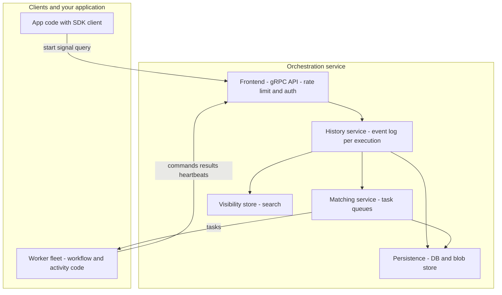

# Workflow Orchestration and Durable Execution

Almost every backend starts with cron jobs, a work queue, and a homegrown retry script — and that combination quietly collapses as long-running, multi-step business processes multiply. A workflow orchestration engine (Temporal, Cadence, Azure Durable Functions, AWS Step Functions) replaces it with one abstraction: **durable execution**, where a function's progress survives the crash of the machine running it. This page designs such an engine: execution model, architecture, determinism and versioning, delivery semantics, capacity math, and failure modes. It complements [Data-Intensive Design](./data-intensive.md) and the batch-era scheduler story in [Apache Airflow](../../../data-engineering/airflow.md).

## Why cron + queues + retry scripts collapse

Three technologies, each individually reasonable, fail as a system:

- **Invisible state.** A cron job that "processes pending orders" holds its position in the business process in an ad hoc database column (`status = 'PARTIALLY_REFUNDED'`). Nobody can answer "where is order 1234 in the refund flow?" without reading code and data. The state machine exists — only implicitly.
- **No replay.** If the script crashes between step 3 and step 4, recovery means re-running everything (double-charging customers) or hand-repairing rows. Nothing records which steps already succeeded.
- **Timeout spaghetti.** Every external call needs a timeout, every timeout a retry policy, every retry idempotency. A task stuck in a queue with no consumer looks identical to a task that will never run; "cron ran but the queue was down" is indistinguishable from "cron never ran".

The requirements that fall out: run processes spanning hours to months; survive mid-process failures; expose per-execution state and history; fan out to elastic fleets; fire reliable timers over days; scale to millions of concurrent executions; stay auditable, testable, and upgradeable in-flight.

## The core abstraction: durable execution

**Durable execution = event-sourced workflow state + deterministic replay.** The engine records every decision a workflow function makes as events; after a crash, it replays the events through the same deterministic code to reconstruct in-memory state and continue as if nothing happened. No checkpoint blobs of the function's stack — the *history is the state*.

Temporal's docs state the replay contract directly: "Temporal uses the Event History to record every step taken along the way. Each time your Workflow Definition makes an API call to execute an Activity or start a Timer for instance, it doesn't perform the action directly. Instead, it sends a Command to the Temporal Service." Commands are "then mapped to Events which are persisted in case of failure. For example, if the Worker crashes, the Worker uses the Event History to replay the code and recreate the state of the Workflow Execution to what it was immediately before the crash."

This is exactly the event-sourcing pattern from [Event Sourcing](../../../backend/patterns/event-sourcing-deep.md) applied to *execution state* instead of entity state — same trade: the event log is authoritative, replay is the read path, and any nondeterminism corrupts the projection.

The lineage explains the shared vocabulary. **Uber Cadence** — "an open-source platform since 2017 for building and running scalable, fault-tolerant, and long-running workflows," with event-sourced state: "Workflows resume seamlessly from exact points of failure using execution history logs." **Temporal** is the same architecture productized: it "originated as a fork of Uber's Cadence." **Azure Durable Functions** proved the model fits serverless — Burckhardt et al., *Durable Functions: Semantics for Stateful Serverless* (OOPSLA 2021, DOI [10.1145/3485510](https://doi.org/10.1145/3485510)), describes a runtime that can "persist execution progress without requiring checkpointing support by the language runtime" via record-replay; Microsoft's docs echo it: "Orchestrators use event sourcing to ensure reliable execution... orchestrator functions must be deterministic: an orchestrator function replays multiple times, and it must produce the same result each time." **AWS Step Functions** is the managed contrast — declarative JSON state machines ("state machines are called workflows... Each step in a workflow is called a state"), trading code expressiveness for zero infrastructure.

## Architecture

A production engine has five separable planes. Temporal's docs describe "a Frontend and multiple backend services, plus a database as a required external component":

- **Frontend (API) service** — a stateless gRPC endpoint. "Your client sends requests (start Workflow, Signal, Query, etc.) to the Frontend, and the Frontend forwards them to the appropriate backend services. It handles rate limiting, authorization, validation, and routing." Starting an execution is a `StartWorkflowExecution` call carrying the workflow type, input, and task-queue name.
- **History service** — the stateful core. "It writes an ordered Event History to the database so Temporal always knows what has happened... It persists all Workflow Execution state, including the Event History, any mutable state, and internal task queues like timers, transfers, replication, and visibility/indexing." Every execution belongs to exactly one history shard, hashed by **workflow ID**: each execution's event log has a single serialization point while different executions scale across shards — the sharded-single-writer principle of [Database Sharding](../../../dbms/advanced/database-sharding.md), with the same hot-partition risks.
- **Matching service** — owns task queues: "This is where Tasks are dispatched to their respective queues before being picked up by the corresponding Workers... Worker polling also takes place here."
- **Worker fleet** — *your* compute. "A Worker Process polls for a message only when it has spare capacity, avoiding overloading itself." Poll-based (long-poll) task queues invert the push model: the server never routes to a dead worker, and an idle worker naturally claims more work. Workers also execute workflow tasks by replaying history, which keeps service compute small and app compute elastic.
- **Persistence** — a database (Cassandra, MySQL, PostgreSQL, SQLite are supported — the design must tolerate a pluggable store, so the event log is an append-only record stream, not relational joins), plus a blob store for large payloads where deployed. "The database stores... Tasks... State of Workflow Executions: Execution table... History table: An append-only log of Workflow Execution History Events," plus namespace metadata and visibility data.
- **Visibility/search store** — "enables operations like 'show all running Workflow Executions'", backed by SQL or Elasticsearch with custom Search Attributes. Keeping it a separate read-optimized store avoids loading the transactional history path with operational queries.

## Workflow vs activity: the load-bearing split

The single most important API decision splits code into two kinds:

- **Workflow code** is orchestration logic: deterministic, side-effect-free, *replayed* rather than resumed. It coordinates activities, timers, signals, and child workflows by emitting commands.
- **Activity code** is where the world is touched: HTTP calls, DB writes, ML inference. Activities run once per attempt, outside the replay path, with retry policies and timeouts owned by the engine.

Temporal is explicit: "Workflow code must be deterministic to support replay. To handle non-deterministic operations like API calls, LLM/AI invocations, database queries, and other external interactions, put them in Activities. Activities execute outside the replay path and are automatically retried so they don't cause non-determinism errors."

**Timeouts** — the exact taxonomy to reproduce in an interview (definitions near-verbatim from Temporal's docs):

| Timeout | Definition (docs, near-verbatim) | Catches |
|---|---|---|
| Schedule-to-Start | "the maximum amount of time that is allowed from when an Activity Task is scheduled (that is, placed in a Task Queue) to when a Worker starts... that Activity Task" | queue starvation, dead worker pool, wrong queue name |
| Start-to-Close | "the maximum time allowed for a single Activity Task Execution" | hung call, crashed worker mid-attempt |
| Heartbeat | "the maximum time between Activity Heartbeats" | slow-progress or wedged long activity |

Heartbeats are the progress signal: "a ping from the Worker that is executing the Activity to the Temporal Service. Each ping informs the Temporal Service that the Activity Execution is making progress and the Worker has not crashed" — and their payloads carry progress details that survive to the next attempt.

**Retry policies** are per-activity and declarative: initial interval, backoff coefficient (default 2.0), maximum interval (default "100 × Initial Interval"), maximum attempts ("The default is unlimited"), and a non-retryable error list ("non-retryable errors default to none"). Errors that will never succeed on retry must be declared non-retryable or you retry them forever — the poison-pill default in the failure-modes section.

## Determinism rules and versioning

Inside workflow code, the following are banned because they break replay — the docs list "inline logic that branches... based off a local time setting or a random number" as intrinsic non-determinism:

- **Raw clock access** — use engine-provided time; SDK time/random APIs exist precisely so their results get "stored as part of the Event History", keeping re-execution consistent.
- **External RNG** — use the SDK's seeded random.
- **Direct I/O** — any HTTP call, DB query, filesystem read, or environment read belongs in activities.

Enforcement is command matching: on replay, "the Commands that are emitted are compared with the existing Event History. If a generated Command doesn't match what it needs to in the existing Event History, then the Workflow Execution returns a _non-deterministic_ error."

Replay breaks when deployed code diverges from the code recorded in a live history — the docs' canonical example: swap the order of a timer and an activity, and the replayed worker emits a ScheduleActivityTask Command that "wouldn't match up to the expected TimerStarted Event." Two versioning strategies fix this:

1. **Worker versioning**: pin workers to code revisions "so that old Workers can run old code paths and new Workers can run new code paths."
2. **Patching (GetVersion/patched + marker events)**: a three-step protocol — "1. Patch in any new, updated code using the `patched()` function... 2. Remove old code and use `deprecate_patch()`... 3. Once there are no longer any open Workflow Executions of the previous version... remove `deprecate_patch()`." Mechanically, "Using `patched` inserts a marker into the Event History. During Replay, if a Worker encounters a history with that marker, it will fail the Workflow task when the Workflow code doesn't produce the same patch marker." The marker *is* an event — versioning is itself written into the log.

## Timers and long-running state

A durable timer is not a sleeping thread; it is two events. `TimerStarted` is appended to history and an internal timer task persisted; when it fires, `TimerFired` is appended and a workflow task wakes the workflow. The docs: "Timers in Temporal are persisted, meaning that even if your Worker or Temporal Service is down when the time period completes, as soon as your Worker and Temporal Service become available, the call that is awaiting the Timer in your Workflow code will resolve... a single Worker can await millions of Timers concurrently." A 30-day trial-then-bill flow is one workflow, not 30 days of cron checks.

**History size limits** force a second pattern. Histories are bounded (Temporal "logs a warning after 10,240 Events" and terminates at 51,200 events), because every replay must read the whole log. The fix is **continue-as-new**: "the latest relevant state is passed to a new Workflow Execution, with a fresh Event History... The new Workflow Execution has the same Workflow Id, but a different Run Id." High-churn loops checkpoint themselves into a new execution instead of growing an unbounded log — semantically a tail-recursive fold over the business process.

## Delivery semantics: at-least-once execution, exactly-once effects

The engine's native guarantee is honest and narrow: **activities execute at least once**. "Temporal guarantees that an Activity Task either runs or timeouts... Temporal doesn't detect task loss directly. It relies on Start-To-Close timeout. If the Activity Task times out, the Activity Execution will be retried." A worker that completes a charge and dies before reporting success produces a retry — a duplicate charge, if you did nothing. Exactly-once *effects* are an application concern, the same contract as [Idempotency](../../../backend/patterns/idempotency.md): key each side effect by workflow ID + activity ID + attempt (or a business key) and let the downstream deduplicate — Temporal's docs point at payment-processor idempotency keys as the pattern.

For multi-step processes spanning services, the engine is the scaffold for a [Saga](../../../dbms/transactions/saga.md): forward steps as activities, compensations invoked by the workflow's error path, and the event history doubles as the saga's audit log. Durable execution is "sagas with a runtime."

## Capacity math: 1M concurrent workflows

Given: 1M concurrent workflow executions, each peaking at 10 events/s, sustained average ~1 event/s per execution.

- **Event append TPS.** Sustained: 1M × 1 = **1M events/s**; worst case 10M/s. The peak is not sustainable by any persistence layer at this fan-out — the first interview insight. Real engines batch: a workflow-task completion appends several events in one DB write; timer fires are batched per shard.
- **Activity throughput.** One activity round trip costs ~6 events (ActivityTaskScheduled/Started/Completed + WorkflowTaskScheduled/Started/Completed); a timer costs 2. At 1M sustained events/s ≈ **~160k activity executions/s**.
- **History write load.** Shard by workflow ID into 4,096 shards: ≈250 events/s per shard sustained, ≈2,400/s at peak — comfortable for a sharded DB. Each shard is single-writer per execution, so no cross-shard coordination is needed for correctness.
- **Storage.** At ~1KB/event, sustained ingest is ~1GB/s ≈ **86TB/day** raw. Levers: continue-as-new bounds per-execution histories; retention keeps the hot store to days and archival pushes years to object storage; payloads are references (IDs, S3 pointers), not blobs.
- **Worker count.** Target 160k activity executions/s. Avg activity 200ms with 20 concurrent slots per worker → 100 exec/s/worker → **~1,600 workers**, ×2 for p99 and headroom ≈ **3,200 workers**.
- **Hot-partition risk.** Hashing by workflow ID balances *executions*, not *load*: one tenant owning 30% of executions or one workflow type fanning out 100:1 still makes a shard hot. Mitigations: task-queue partitioning, routing keys mixing tenant + entropy (the Discord lesson in [ID Generation](./id-generation.md) applies verbatim), shard-split tooling.

## Failure modes

- **Worker crashes mid-activity.** The last heartbeat ages past the heartbeat timeout (or start-to-close expires); the engine records a timeout event and the retry policy re-schedules the task — possibly on another worker, seeded with the last heartbeat's progress payload. Idempotent activity, invisible retry; otherwise a duplicate.
- **History DB outage.** Nothing that needs an event append proceeds: no new executions start (start = first append), running workflows stall at their next workflow task, and **timers also stall** — a timer only "fires" when the service can append `TimerFired`; durable timers degrade with the persistence layer rather than firing from a worker's RAM. Because state lives entirely in the log, a persistence failover resumes every execution — delayed, not lost.
- **Nondeterminism bug mid-replay.** A code change ships; running workflows replay against the new binary, emit a mismatched command, and fail their workflow task — then fail again on every retry, stuck on the same history. Mitigations in order: patching/GetVersion markers so old and new paths coexist; worker versioning for big-bang changes; and **workflow reset** — rewind to a pre-break event and replay forward with fixed code, a recovery unique to event-sourced execution.
- **Task-queue backlog aging.** A consumer pool dies for an hour and the queue grows. Schedule-to-start timeouts turn "old task" into "fast-failing task" — the workflow gets the timeout and can route to a fallback instead of silently executing work two hours late. Alert on queue age, not depth.
- **Poison-pill activity.** An activity that always fails defaults to *unlimited* retries — a permanent retry machine. Cures: declare the error class non-retryable (the workflow handles it as a business failure and triggers compensation), cap maximum attempts, dead-letter terminal failures for triage.

## Interview scoring

**Junior** — explains cron/queue pain points; knows the workflow-vs-activity split; confuses durable execution with job scheduling; hand-waves replay.

**Mid** — derives at-least-once + idempotency for exactly-once effects; sets the three activity timeouts and knows what each detects; explains event-history replay and why random/time APIs break it; sizes workers from activity throughput.

**Senior** — designs the history-shard topology and its hot-partition trade-offs; articulates versioning protocols (patching markers vs worker versioning) and workflow reset as operational recovery; reasons through the history-DB outage cascade including timers; connects durable execution to event sourcing and sagas as the same pattern at different layers; knows when *not* to use it (short-lived fire-and-forget work is over-engineered here).

## Key Takeaways

- Durable execution = event-sourced state + deterministic replay. The history log *is* the workflow's state.
- Activities execute at-least-once; exactly-once effects come from idempotency keys you design in. Compensation flows make it a saga runtime.
- Workflow code is deterministic and replayed; activities carry side effects, retries, heartbeats, and timeouts — know which failure each timeout detects.
- Non-determinism is the unforgivable bug: patch markers and worker versioning exist because you *will* change code under live histories.
- Scale: history shards by workflow ID (single-writer per execution), poll-based task queues, continue-as-new to bound history size.

## References

All Temporal doc pages below support `.md` fetch and were fetched and quoted this session.

- [Temporal docs: Workflow Definition](https://docs.temporal.io/workflow-definition) — determinism constraints, command/event matching, versioning.
- [Temporal docs: Event History](https://docs.temporal.io/encyclopedia/event-history) — commands-to-events mapping, replay recovery.
- [Temporal docs: Workflow Execution Events](https://docs.temporal.io/workflow-execution/event) — history limits.
- [Temporal docs: Continue-As-New](https://docs.temporal.io/workflow-execution/continue-as-new) — fresh history, same Workflow ID / new Run ID.
- [Temporal docs: Timers and Start Delays](https://docs.temporal.io/workflow-execution/timers-delays) — persisted timers.
- [Temporal docs: Detecting Activity Failures](https://docs.temporal.io/encyclopedia/detecting-activity-failures) — the three activity timeouts.
- [Temporal docs: Retry Policies](https://docs.temporal.io/encyclopedia/retry-policies) — defaults: unlimited attempts, 2.0 backoff, non-retryable list.
- [Temporal docs: Activity Execution](https://docs.temporal.io/activity-execution) — task-loss detection via start-to-close.
- [Temporal docs: Temporal Architecture](https://docs.temporal.io/encyclopedia/architecture/temporal-architecture) and [How Temporal Works](https://docs.temporal.io/encyclopedia/architecture/how-temporal-works) — service decomposition, execution walkthrough.
- [Temporal docs: Task Queues](https://docs.temporal.io/task-queue) — worker long-polling.
- [Temporal docs: Persistence](https://docs.temporal.io/temporal-service/persistence) and [Visibility](https://docs.temporal.io/visibility) — DB tables, search store.
- [Temporal docs: Versioning (Python SDK)](https://docs.temporal.io/develop/python/workflows/versioning) — patching protocol, history markers.
- [Temporal `README.md` (GitHub)](https://github.com/temporalio/temporal) — Cadence fork lineage.
- [Cadence Workflow site](https://cadenceworkflow.io/) and [cadence-workflow/cadence `README.md`](https://github.com/cadence-workflow/cadence) — event-sourced histories, pluggable persistence.
- Burckhardt et al., "Durable Functions: Semantics for Stateful Serverless," *Proc. ACM Program. Lang.* (OOPSLA 2021), DOI [10.1145/3485510](https://doi.org/10.1145/3485510) — record-replay persistence without runtime checkpointing. *(DOI Crossref-verified; venue is OOPSLA, not USENIX; abstract via Semantic Scholar API — dl.acm.org blocks automated fetches.)*
- [Microsoft Learn: Durable Functions Overview](https://learn.microsoft.com/en-us/azure/azure-functions/durable/durable-functions-overview) and [Orchestrator Code Constraints](https://learn.microsoft.com/en-us/azure/azure-functions/durable/durable-functions-code-constraints) — orchestrator determinism, event sourcing. *(Fetched.)*
- [AWS Step Functions Developer Guide](https://docs.aws.amazon.com/step-functions/latest/dg/welcome.html) — workflows as state machines; Standard vs Express. *(Fetched.)*

## Cross-References

- [Event Sourcing](../../../backend/patterns/event-sourcing-deep.md) — the same event-log-as-state pattern applied to entity data
- [Saga Pattern](../../../dbms/transactions/saga.md) — compensation flows the engine scaffolds
- [Idempotency](../../../backend/patterns/idempotency.md) — turns at-least-once into exactly-once effects
- [Database Sharding](../../../dbms/advanced/database-sharding.md) — history shards by workflow ID; hot-partition trade-offs
- [Data-Intensive Design](./data-intensive.md) — batch/stream data pipelines versus process orchestration
- [Apache Airflow](../../../data-engineering/airflow.md) — batch-DAG scheduling, the cron-era contrast
- [Serverless Computing](../../../cloud/advanced/serverless.md) — FaaS execution model whose weak guarantees motivated Durable Functions
