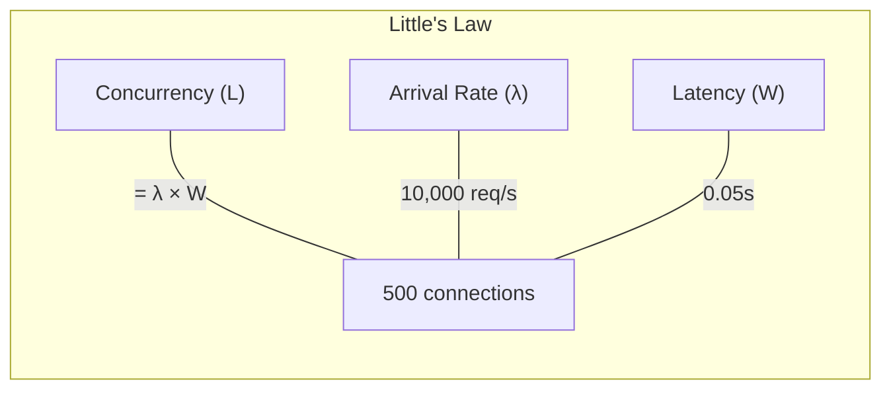
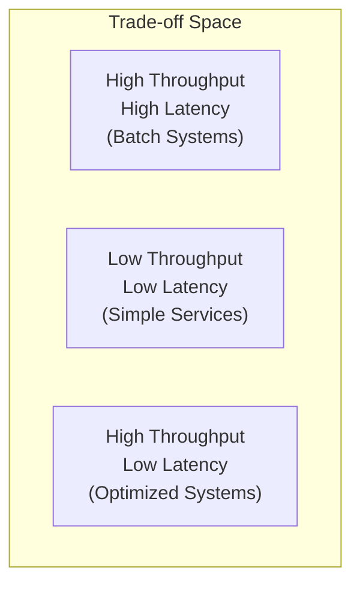
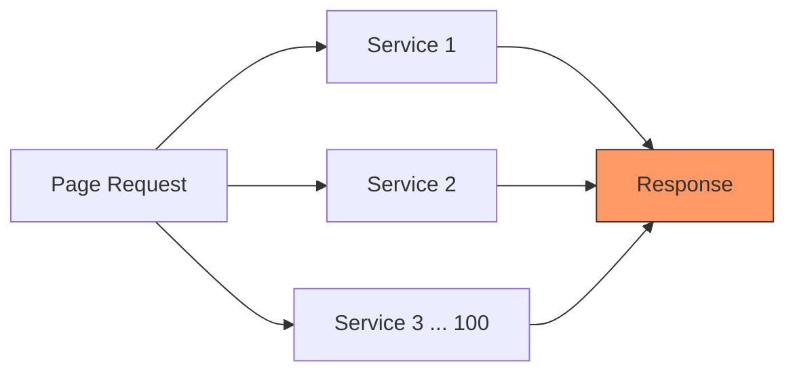

# Latency vs Throughput

## Overview

Latency and throughput are the two most important performance metrics in system design. Understanding their relationship — and especially **Little's Law** — is essential for capacity planning and for answering interview questions about system performance.

## Definitions

### Latency
- **Time to complete a single operation** (measured in ms, μs, or ns)
- Often reported as percentiles: **p50** (median), **p95**, **p99**
- Example: "Our API has a p99 latency of 200ms"

### Throughput
- **Number of operations completed per unit time** (measured in req/s, ops/s, MB/s)
- Example: "Our system handles 50,000 requests per second"

## The Relationship

> **Throughput = Concurrent Requests / Latency**

This is a simplified form of Little's Law. If your service handles 100 concurrent requests with an average latency of 100ms, your throughput is:

```
Throughput = 100 / 0.1s = 1,000 req/s
```

## Little's Law

Little's Law (from queueing theory) states:

> **L = λ × W**

Where:
- **L** = average number of items in the system (concurrency)
- **λ** = average arrival rate (throughput)
- **W** = average time an item spends in the system (latency)

### Rearranged Forms

```
Throughput (λ) = Concurrency (L) / Latency (W)
Latency (W) = Concurrency (L) / Throughput (λ)
Concurrency (L) = Throughput (λ) × Latency (W)
```

### Practical Example

Suppose you're designing a URL shortener:
- Expected traffic: **10,000 req/s**
- Average request latency: **50ms** (0.05s)
- Required concurrency: **10,000 × 0.05 = 500 concurrent connections**

This tells you how many threads, connections, or workers you need.



## Why Both Matter

### High Throughput, High Latency
- Batch processing systems (MapReduce, ETL pipelines)
- Acceptable: jobs take hours but process terabytes
- Not acceptable for real-time user requests

### Low Latency, Low Throughput
- A single-threaded in-memory cache lookup (~1μs)
- But it can only handle one request at a time
- Need concurrency to get useful throughput

### The Sweet Spot: High Throughput, Low Latency
- What every real-time system aims for
- Achieved through: parallelism, batching, caching, connection pooling



## Improving Latency

| Technique | How It Helps |
|-----------|-------------|
| Caching (Redis, CDN) | Avoid recomputation or distant fetches |
| Connection pooling | Eliminate TCP/TLS handshake overhead |
| Pre-computation | Compute results before they're needed |
| Data locality | Keep data close to compute (same AZ, same machine) |
| Async I/O | Don't block threads waiting for I/O |
| Faster hardware | NVMe, more RAM, better CPUs |

## Improving Throughput

| Technique | How It Helps |
|-----------|-------------|
| Horizontal scaling | More servers = more parallel capacity |
| Batching | Process multiple items per operation (batch DB writes) |
| Concurrency | Thread pools, async handlers, event loops |
| Load balancing | Distribute work evenly |
| Queueing | Decouple producers and consumers, smooth bursts |
| Reduce contention | Partition data, use lock-free structures |

## Latency Percentiles — Why Averages Lie

Average latency hides the truth. If 99% of requests take 10ms but 1% take 5,000ms:
- **Average**: ~60ms (seems fine)
- **p99**: 5,000ms (1 in 100 users waits 5 seconds)

For user-facing systems, **tail latency (p99, p99.9)** matters more than averages.

### The Tail at Scale

In a system where a single page request fans out to 100 backend services:
- If each service has p99 latency of 10ms, the probability that ALL respond within 10ms is 0.99^100 ≈ **37%**
- That means 63% of page loads exceed the p99 of a single service
- This is why Google engineers obsess over p99.9 and beyond



## Capacity Planning with Little's Law

### Step-by-Step

1. **Estimate traffic**: 1M DAU, each user makes 10 requests/day
2. **Calculate QPS**: 1M × 10 / 86,400 ≈ 116 avg QPS; peak ≈ 350 QPS (3x)
3. **Measure latency**: Assume p99 = 100ms
4. **Calculate concurrency**: 350 × 0.1 = 35 concurrent requests
5. **Add headroom**: 35 × 3 (safety factor) = ~100 concurrent connections needed

## Trade-Offs

| Optimization | Latency Impact | Throughput Impact | Trade-off |
|-------------|---------------|-------------------|-----------|
| More caching | ↓↓ | ↑ | Stale data risk |
| Batching | ↑ (individual) | ↑↑ | Complexity, delay |
| Connection pooling | ↓ | ↑ | Memory overhead |
| Queueing | ↑ (adds delay) | ↑↑ | Eventual processing |
| Compression | ↑ (CPU time) | ↑ (less bandwidth) | CPU cost |

## Interview Tips

1. **Always specify both** — "We need 10K QPS at <200ms p99 latency"
2. **Use Little's Law** to calculate required concurrency from throughput and latency targets
3. **Use percentiles**, not averages — "p99 latency" not "average latency"
4. **Explain the tail-at-scale effect** — fan-out amplifies tail latency
5. **Mention the trade-off** — batching improves throughput but hurts individual latency
6. **Back up claims with numbers** — "With 50ms latency and 10K QPS, we need 500 concurrent connections"

## Key Takeaways

- Latency = time per request. Throughput = requests per time.
- Little's Law: Concurrency = Throughput × Latency. It's the foundation of capacity planning.
- Always use percentiles (p50, p99), not averages.
- Tail latency compounds in distributed systems (the "tail at scale" problem).
- Most optimizations trade latency for throughput or vice versa — know the trade-off.

## Cross-References

- [Performance vs Scalability](./performance-vs-scalability.md)
- [Latency Numbers](./latency-numbers.md)
- [Backpressure](./backpressure.md)
- [Load Balancing](./hld/load-balancing-design.md)
- [Concurrency Overview](../../concurrency/overview.md)
- [Cloud Load Balancing](../../cloud/kubernetes/services.md)
- [Storage SSD](../../storage/ssd.md)

