# LLD: ATM System

## Requirements

### Functional Requirements
1. User authenticates with card + PIN
2. Check account balance
3. Withdraw cash (with denomination handling)
4. Deposit cash/cheques
5. Transfer between accounts
6. Print receipts
7. Cancel transaction at any point

### Non-Functional Requirements
- Secure (encrypt PIN, audit trail)
- Handle concurrent access to accounts
- Accurate cash dispensing

## Class Diagram

```mermaid
classDiagram
    class ATM {
        -atmId: String
        -cashDispenser: CashDispenser
        -cardReader: CardReader
        -screen: Screen
        -keypad: Keypad
        -printer: Printer
        +authenticate(card: Card, pin: String): boolean
        +processTransaction(transaction: Transaction): boolean
    }
    
    class Card {
        -cardNumber: String
        -expiryDate: Date
        -pinHash: String
        -accountId: String
        +validatePin(pin: String): boolean
    }
    
    class Account {
        -accountId: String
        -balance: double
        -accountType: AccountType
        +getBalance(): double
        +withdraw(amount: double): boolean
        +deposit(amount: double)
        +transfer(to: Account, amount: double): boolean
    }
    
    class AccountType {
        <<enumeration>>
        SAVINGS
        CHECKING
    }
    
    class Transaction {
        <<abstract>>
        -transactionId: String
        -account: Account
        -amount: double
        -timestamp: DateTime
        -status: TransactionStatus
        +execute(): boolean
        +cancel()
    }
    
    class WithdrawTransaction {
        -cashDispenser: CashDispenser
        +execute(): boolean
    }
    
    class DepositTransaction {
        +execute(): boolean
    }
    
    class TransferTransaction {
        -toAccount: Account
        +execute(): boolean
    }
    
    class BalanceInquiry {
        +execute(): boolean
    }
    
    class TransactionStatus {
        <<enumeration>>
        PENDING
        COMPLETED
        FAILED
        CANCELLED
    }
    
    class CashDispenser {
        -denominations: Map~Integer, Integer~
        +dispense(amount: double): Map~Integer, Integer~
        +canDispense(amount: double): boolean
        +addCash(denomination: int, count: int)
    }
    
    class BankService {
        +validateCard(card: Card): boolean
        +authenticate(card: Card, pin: String): boolean
        +getAccount(accountId: String): Account
        +logTransaction(transaction: Transaction)
    }
    
    class Screen {
        +display(message: String)
        +displayMenu(options: List~String~)
    }
    
    class Printer {
        +printReceipt(transaction: Transaction)
    }
    
    ATM --> CardReader
    ATM --> CashDispenser
    ATM --> Screen
    ATM --> Keypad
    ATM --> Printer
    ATM --> BankService
    Transaction <|-- WithdrawTransaction
    Transaction <|-- DepositTransaction
    Transaction <|-- TransferTransaction
    Transaction <|-- BalanceInquiry
    Transaction --> Account
    Transaction --> TransactionStatus
    Card --> Account
```



## Code Implementation

```python
from abc import ABC, abstractmethod
from enum import Enum
from datetime import datetime
from typing import Dict, Optional, List
import uuid
import hashlib
import threading

class AccountType(Enum):
    SAVINGS = "SAVINGS"
    CHECKING = "CHECKING"

class TransactionStatus(Enum):
    PENDING = "PENDING"
    COMPLETED = "COMPLETED"
    FAILED = "FAILED"
    CANCELLED = "CANCELLED"

class Account:
    def __init__(self, account_id: str, balance: float, account_type: AccountType):
        self._account_id = account_id
        self._balance = balance
        self._account_type = account_type
        self._lock = threading.Lock()
    
    @property
    def account_id(self) -> str:
        return self._account_id
    
    def get_balance(self) -> float:
        with self._lock:
            return self._balance
    
    def withdraw(self, amount: float) -> bool:
        with self._lock:
            if amount <= 0:
                raise ValueError("Amount must be positive")
            if self._balance >= amount:
                self._balance -= amount
                return True
            return False
    
    def deposit(self, amount: float):
        with self._lock:
            if amount <= 0:
                raise ValueError("Amount must be positive")
            self._balance += amount
    
    def transfer(self, to_account: 'Account', amount: float) -> bool:
        # Lock ordering to prevent deadlock
        first = min(self, to_account, key=lambda a: a._account_id)
        second = max(self, to_account, key=lambda a: a._account_id)
        
        with first._lock:
            with second._lock:
                if self._balance >= amount:
                    self._balance -= amount
                    to_account._balance += amount
                    return True
                return False

class Card:
    def __init__(self, card_number: str, expiry_date: datetime, 
                 pin: str, account_id: str):
        self._card_number = card_number
        self._expiry_date = expiry_date
        self._pin_hash = hashlib.sha256(pin.encode()).hexdigest()
        self._account_id = account_id
    
    @property
    def card_number(self) -> str:
        return self._card_number
    
    @property
    def account_id(self) -> str:
        return self._account_id
    
    def validate_pin(self, pin: str) -> bool:
        pin_hash = hashlib.sha256(pin.encode()).hexdigest()
        return self._pin_hash == pin_hash
    
    def is_expired(self) -> bool:
        return datetime.now() > self._expiry_date
```

### Cash Dispenser

```python
class CashDispenser:
    def __init__(self, initial_cash: Dict[int, int]):
        # denomination -> count
        self._cash: Dict[int, int] = initial_cash.copy()
        self._lock = threading.Lock()
    
    def can_dispense(self, amount: float) -> bool:
        with self._lock:
            if amount <= 0:
                return False
            
            remaining = int(amount)
            temp_cash = self._cash.copy()
            
            for denomination in sorted(temp_cash.keys(), reverse=True):
                if remaining <= 0:
                    break
                count = min(remaining // denomination, temp_cash[denomination])
                remaining -= count * denomination
            
            return remaining == 0
    
    def dispense(self, amount: float) -> Optional[Dict[int, int]]:
        with self._lock:
            if not self.can_dispense(amount):
                return None
            
            remaining = int(amount)
            dispensed = {}
            
            for denomination in sorted(self._cash.keys(), reverse=True):
                if remaining <= 0:
                    break
                count = min(remaining // denomination, self._cash[denomination])
                if count > 0:
                    dispensed[denomination] = count
                    self._cash[denomination] -= count
                    remaining -= count * denomination
            
            return dispensed
    
    def add_cash(self, denomination: int, count: int):
        with self._lock:
            if denomination in self._cash:
                self._cash[denomination] += count
            else:
                self._cash[denomination] = count
    
    def get_total_cash(self) -> int:
        with self._lock:
            return sum(denom * count for denom, count in self._cash.items())
```

### Transactions

```python
class Transaction(ABC):
    def __init__(self, account: Account, amount: float = 0):
        self._transaction_id = str(uuid.uuid4())[:8]
        self._account = account
        self._amount = amount
        self._timestamp = datetime.now()
        self._status = TransactionStatus.PENDING
    
    @property
    def transaction_id(self) -> str:
        return self._transaction_id
    
    @property
    def status(self) -> TransactionStatus:
        return self._status
    
    @abstractmethod
    def execute(self) -> bool:
        pass
    
    def cancel(self):
        if self._status == TransactionStatus.PENDING:
            self._status = TransactionStatus.CANCELLED

class WithdrawTransaction(Transaction):
    def __init__(self, account: Account, amount: float, 
                 cash_dispenser: CashDispenser):
        super().__init__(account, amount)
        self._cash_dispenser = cash_dispenser
    
    def execute(self) -> bool:
        if self._status != TransactionStatus.PENDING:
            return False
        
        # Check if ATM can dispense
        if not self._cash_dispenser.can_dispense(self._amount):
            self._status = TransactionStatus.FAILED
            return False
        
        # Withdraw from account
        if not self._account.withdraw(self._amount):
            self._status = TransactionStatus.FAILED
            return False
        
        # Dispense cash
        dispensed = self._cash_dispenser.dispense(self._amount)
        if not dispensed:
            # Rollback
            self._account.deposit(self._amount)
            self._status = TransactionStatus.FAILED
            return False
        
        self._status = TransactionStatus.COMPLETED
        return True

class DepositTransaction(Transaction):
    def execute(self) -> bool:
        if self._status != TransactionStatus.PENDING:
            return False
        
        self._account.deposit(self._amount)
        self._status = TransactionStatus.COMPLETED
        return True

class TransferTransaction(Transaction):
    def __init__(self, from_account: Account, to_account: Account, amount: float):
        super().__init__(from_account, amount)
        self._to_account = to_account
    
    def execute(self) -> bool:
        if self._status != TransactionStatus.PENDING:
            return False
        
        if self._account.transfer(self._to_account, self._amount):
            self._status = TransactionStatus.COMPLETED
            return True
        
        self._status = TransactionStatus.FAILED
        return False

class BalanceInquiry(Transaction):
    def execute(self) -> bool:
        self._status = TransactionStatus.COMPLETED
        return True
```

### ATM Main Class

```python
class ATM:
    def __init__(self, atm_id: str, cash_dispenser: CashDispenser):
        self._atm_id = atm_id
        self._cash_dispenser = cash_dispenser
        self._current_card: Optional[Card] = None
        self._current_account: Optional[Account] = None
        self._bank_service = BankService()
        self._screen = Screen()
        self._printer = Printer()
        self._lock = threading.Lock()
    
    def insert_card(self, card: Card, pin: str) -> bool:
        with self._lock:
            if card.is_expired():
                self._screen.display("Card expired")
                return False
            
            if not card.validate_pin(pin):
                self._screen.display("Invalid PIN")
                return False
            
            self._current_card = card
            self._current_account = self._bank_service.get_account(card.account_id)
            return True
    
    def check_balance(self) -> float:
        if not self._current_account:
            raise ValueError("No card inserted")
        
        transaction = BalanceInquiry(self._current_account)
        transaction.execute()
        balance = self._current_account.get_balance()
        self._printer.print_receipt(transaction)
        return balance
    
    def withdraw(self, amount: float) -> bool:
        if not self._current_account:
            raise ValueError("No card inserted")
        
        transaction = WithdrawTransaction(
            self._current_account, amount, self._cash_dispenser
        )
        
        if transaction.execute():
            self._printer.print_receipt(transaction)
            self._screen.display(f"Please take your cash: ${amount}")
            return True
        else:
            self._screen.display("Transaction failed")
            return False
    
    def deposit(self, amount: float) -> bool:
        if not self._current_account:
            raise ValueError("No card inserted")
        
        transaction = DepositTransaction(self._current_account, amount)
        
        if transaction.execute():
            self._printer.print_receipt(transaction)
            return True
        return False
    
    def transfer(self, to_account_id: str, amount: float) -> bool:
        if not self._current_account:
            raise ValueError("No card inserted")
        
        to_account = self._bank_service.get_account(to_account_id)
        transaction = TransferTransaction(
            self._current_account, to_account, amount
        )
        
        if transaction.execute():
            self._printer.print_receipt(transaction)
            return True
        return False
    
    def eject_card(self):
        self._current_card = None
        self._current_account = None
        self._screen.display("Please take your card")

class BankService:
    def __init__(self):
        self._accounts: Dict[str, Account] = {}
    
    def get_account(self, account_id: str) -> Account:
        if account_id not in self._accounts:
            raise ValueError(f"Account {account_id} not found")
        return self._accounts[account_id]
    
    def log_transaction(self, transaction: Transaction):
        print(f"Transaction {transaction.transaction_id}: {transaction.status.value}")

class Screen:
    def display(self, message: str):
        print(f"[SCREEN] {message}")

class Printer:
    def print_receipt(self, transaction: Transaction):
        print(f"[RECEIPT] Transaction {transaction.transaction_id}")
        print(f"  Status: {transaction.status.value}")
        print(f"  Time: {transaction._timestamp}")
```

## Design Patterns Used

| Pattern | Where | Why |
|---------|-------|-----|
| **Command** | Transaction classes | Encapsulate operations |
| **State** | ATM states (idle, authenticated) | Behavior changes by state |
| **Strategy** | Different transaction types | Varying execution logic |

## Edge Cases

1. **Insufficient funds**: Check before dispensing
2. **ATM out of cash**: Check dispenser capacity
3. **Invalid PIN**: Limit attempts, lock card
4. **Network failure**: Transaction rollback
5. **Concurrent access**: Thread-safe accounts

## Interview Questions

1. **Q: How would you handle multiple accounts per card?**
   A: Add account selection step after authentication.

2. **Q: How would you handle denomination preferences?**
   A: Add denomination strategy to CashDispenser.

3. **Q: How would you add mini-statements?**
   A: Add TransactionHistory to Account, implement PrintStatement transaction.

## Cross-References

- [Design Patterns](./design-patterns.md) — Command, State, Strategy
- [Concurrency Design](./concurrency-design.md) — Thread-safe accounts
- [Error Handling](./error-handling.md) — Transaction rollback
- [OOP Concepts](./oop-concepts.md)
- [Payment System](../payment.md)
