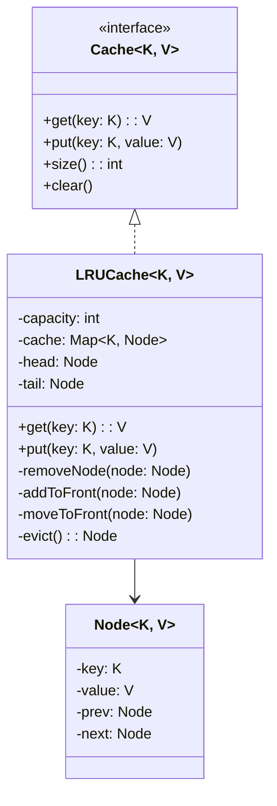

# LLD: LRU Cache Implementation

## Requirements

### Functional Requirements
1. `get(key)` — Retrieve value by key, return -1 if not found
2. `put(key, value)` — Insert or update key-value pair
3. When capacity is reached, evict **Least Recently Used** item
4. Both `get` and `put` must be O(1) time complexity

### Non-Functional Requirements
- Thread-safe
- Generic (support any key/value types)

## Class Diagram



## Design Approach

The key insight is combining two data structures:
1. **HashMap** — O(1) lookup by key
2. **Doubly Linked List** — O(1) insertion/deletion, maintain access order

```
HashMap:                    Doubly Linked List (most → least recent):
key1 → Node1               HEAD ↔ Node3 ↔ Node1 ↔ Node4 ↔ TAIL
key2 → Node2
key3 → Node3               On access: move node to HEAD
key4 → Node4               On eviction: remove from TAIL
```

## Code Implementation

### Python Implementation

```python
from typing import TypeVar, Generic, Optional, Dict
import threading

K = TypeVar('K')
V = TypeVar('V')

class Node(Generic[K, V]):
    """Doubly linked list node"""
    def __init__(self, key: K = None, value: V = None):
        self.key = key
        self.value = value
        self.prev: Optional['Node[K, V]'] = None
        self.next: Optional['Node[K, V]'] = None

class LRUCache(Generic[K, V]):
    """
    LRU Cache using HashMap + Doubly Linked List.
    Time: O(1) for get and put
    Space: O(capacity)
    """
    
    def __init__(self, capacity: int):
        if capacity <= 0:
            raise ValueError("Capacity must be positive")
        
        self._capacity = capacity
        self._cache: Dict[K, Node[K, V]] = {}
        
        # Dummy head and tail to avoid null checks
        self._head = Node[K, V]()  # Most recently used
        self._tail = Node[K, V]()  # Least recently used
        self._head.next = self._tail
        self._tail.prev = self._head
        
        self._lock = threading.Lock()
    
    def get(self, key: K) -> Optional[V]:
        """Get value by key. Returns None if not found."""
        with self._lock:
            if key not in self._cache:
                return None
            
            node = self._cache[key]
            self._move_to_front(node)
            return node.value
    
    def put(self, key: K, value: V) -> None:
        """Insert or update key-value pair."""
        with self._lock:
            if key in self._cache:
                # Update existing node
                node = self._cache[key]
                node.value = value
                self._move_to_front(node)
            else:
                # Create new node
                node = Node(key, value)
                self._cache[key] = node
                self._add_to_front(node)
                
                # Evict if over capacity
                if len(self._cache) > self._capacity:
                    evicted = self._evict()
                    del self._cache[evicted.key]
    
    def _remove_node(self, node: Node[K, V]) -> None:
        """Remove node from linked list"""
        node.prev.next = node.next
        node.next.prev = node.prev
    
    def _add_to_front(self, node: Node[K, V]) -> None:
        """Add node right after head (most recently used position)"""
        node.prev = self._head
        node.next = self._head.next
        self._head.next.prev = node
        self._head.next = node
    
    def _move_to_front(self, node: Node[K, V]) -> None:
        """Move existing node to front"""
        self._remove_node(node)
        self._add_to_front(node)
    
    def _evict(self) -> Node[K, V]:
        """Remove and return the least recently used node"""
        lru = self._tail.prev
        self._remove_node(lru)
        return lru
    
    def size(self) -> int:
        return len(self._cache)
    
    def clear(self) -> None:
        with self._lock:
            self._cache.clear()
            self._head.next = self._tail
            self._tail.prev = self._head
    
    def __str__(self) -> str:
        items = []
        current = self._head.next
        while current != self._tail:
            items.append(f"{current.key}: {current.value}")
            current = current.next
        return f"LRUCache([{', '.join(items)}])"
```

### Java Implementation

```java
import java.util.HashMap;
import java.util.Map;

public class LRUCache<K, V> {
    private final int capacity;
    private final Map<K, Node<K, V>> cache;
    private final Node<K, V> head;  // Most recently used
    private final Node<K, V> tail;  // Least recently used
    
    private static class Node<K, V> {
        K key;
        V value;
        Node<K, V> prev;
        Node<K, V> next;
        
        Node(K key, V value) {
            this.key = key;
            this.value = value;
        }
        
        Node() {
            this(null, null);
        }
    }
    
    public LRUCache(int capacity) {
        this.capacity = capacity;
        this.cache = new HashMap<>();
        this.head = new Node<>();
        this.tail = new Node<>();
        head.next = tail;
        tail.prev = head;
    }
    
    public synchronized V get(K key) {
        Node<K, V> node = cache.get(key);
        if (node == null) return null;
        moveToHead(node);
        return node.value;
    }
    
    public synchronized void put(K key, V value) {
        Node<K, V> node = cache.get(key);
        if (node != null) {
            node.value = value;
            moveToHead(node);
        } else {
            Node<K, V> newNode = new Node<>(key, value);
            cache.put(key, newNode);
            addToHead(newNode);
            if (cache.size() > capacity) {
                Node<K, V> evicted = removeTail();
                cache.remove(evicted.key);
            }
        }
    }
    
    private void removeNode(Node<K, V> node) {
        node.prev.next = node.next;
        node.next.prev = node.prev;
    }
    
    private void addToHead(Node<K, V> node) {
        node.prev = head;
        node.next = head.next;
        head.next.prev = node;
        head.next = node;
    }
    
    private void moveToHead(Node<K, V> node) {
        removeNode(node);
        addToHead(node);
    }
    
    private Node<K, V> removeTail() {
        Node<K, V> lru = tail.prev;
        removeNode(lru);
        return lru;
    }
}
```

## Usage Example

```python
# Create cache with capacity 3
cache = LRUCache[str, int](capacity=3)

cache.put("a", 1)
cache.put("b", 2)
cache.put("c", 3)
print(cache)  # LRUCache([c: 3, b: 2, a: 1])

cache.get("a")  # Access 'a', moves to front
print(cache)  # LRUCache([a: 1, c: 3, b: 2])

cache.put("d", 4)  # Add 'd', evicts 'b' (LRU)
print(cache)  # LRUCache([d: 4, a: 1, c: 3])

print(cache.get("b"))  # None (evicted)
print(cache.get("a"))  # 1
```

## Variants

### LFU (Least Frequently Used) Cache

```python
from collections import defaultdict

class LFUCache:
    def __init__(self, capacity: int):
        self.capacity = capacity
        self.cache = {}  # key -> value
        self.freq = {}   # key -> frequency
        self.freq_to_keys = defaultdict(OrderedDict)  # freq -> {key: None}
        self.min_freq = 0
    
    def get(self, key: int) -> int:
        if key not in self.cache:
            return -1
        self._update_freq(key)
        return self.cache[key]
    
    def put(self, key: int, value: int) -> None:
        if self.capacity == 0:
            return
        
        if key in self.cache:
            self.cache[key] = value
            self._update_freq(key)
            return
        
        if len(self.cache) >= self.capacity:
            # Evict LFU item
            evict_key, _ = self.freq_to_keys[self.min_freq].popitem(last=False)
            del self.cache[evict_key]
            del self.freq[evict_key]
        
        self.cache[key] = value
        self.freq[key] = 1
        self.freq_to_keys[1][key] = None
        self.min_freq = 1
    
    def _update_freq(self, key: int) -> None:
        freq = self.freq[key]
        del self.freq_to_keys[freq][key]
        if not self.freq_to_keys[freq]:
            del self.freq_to_keys[freq]
            if self.min_freq == freq:
                self.min_freq += 1
        
        self.freq[key] = freq + 1
        self.freq_to_keys[freq + 1][key] = None
```

### Thread-Safe Cache with TTL

```python
import time

class TTLCache:
    """Cache with Time-To-Live expiration"""
    
    def __init__(self, capacity: int, default_ttl: float = 300):
        self._cache = LRUCache(capacity)
        self._ttl = {}  # key -> expiration_time
        self._default_ttl = default_ttl
        self._lock = threading.Lock()
    
    def get(self, key: str) -> Optional[any]:
        with self._lock:
            if key in self._ttl and time.time() > self._ttl[key]:
                # Expired
                del self._ttl[key]
                return None
            return self._cache.get(key)
    
    def put(self, key: str, value: any, ttl: float = None):
        with self._lock:
            self._cache.put(key, value)
            self._ttl[key] = time.time() + (ttl or self._default_ttl)
```

## Concurrency: From Single-Lock LRU to Sharded, Near-Lock-Free

The implementations above are correct, but the lock hides a scaling ceiling that interviewers expect you to articulate.

### The single lock is the throughput ceiling

Every `get` and `put` takes the same lock — and note that a `get` is a *write*: `moveToFront` mutates the list. There are no read-only operations on an LRU cache, so read-heavy workloads serialize exactly like write-heavy ones. The LRU list is a serialization point **by design**: it imposes one total order on all accesses, and a total order requires mutual exclusion. Under contention, the cost isn't the critical section itself (a few pointer updates) but the cache-line ping-pong on the lock and head/tail pointers as every core fights for the same words. The escape routes are: (1) split the key space so different keys hit different structures, (2) relax the "least recently used" guarantee so reads stop mutating shared state, or (3) both.

### Striped (Segmented) LRU

The classic first fix — the design Java's `ConcurrentHashMap` used before JDK 8: N independent segments, each a complete `(map + list + lock)` mini-cache:

```python
class StripedLRUCache:
    def __init__(self, capacity: int, segments: int = 16):
        self._segments = [LRUCache(capacity // segments) for _ in range(segments)]

    def _seg(self, key) -> LRUCache:
        return self._segments[hash(key) & (len(self._segments) - 1)]

    def get(self, key):  return self._seg(key).get(key)
    def put(self, key, value): self._seg(key).put(key, value)
```

- **Segment count**: power of two (so the index is a mask), roughly 4–16× the core count. Too few → threads still collide; too many → memory overhead per segment and coarser capacity accounting.
- **Capacity becomes approximate.** Each segment evicts within itself, so the global LRU is lost: a segment can evict a globally-hot key while another segment hoards cold ones. Sizing is per-segment (`capacity / N`), and `size()` needs an approximate counter (sum of per-segment counts) unless you pay for a global atomic.
- **Resize is per-segment** and only touches one lock — but rehashing moves keys between buckets *within* a segment, never between segments, because the segment choice must be stable.
- Keys hash independently per segment, so contention drops roughly by N for uniform access; skew (one celebrity key) is unaffected — a single hot key still serializes its segment, which is why point (2) below exists.

### Approximate LRU: drop the list, keep the policy

The deeper fix recognizes that a strictly-consistent LRU list is what costs you. Approximate policies preserve most of the hit rate with far less coordination:

- **Atomic timestamp + lazy eviction.** Each entry stores `last_access` updated with an atomic store on every read — no list mutation, no lock. When capacity is hit, the inserter evicts an *approximately* least-recently-used victim (e.g., samples a handful of entries and takes the oldest, or drains a small victim pool). Accesses stay contention-free; only eviction pays.
- **Redis's sampled LRU.** Redis documents exactly this reasoning: "The Redis LRU algorithm uses an approximation of the least recently used keys rather than calculating them exactly. It samples a small number of keys at random and then evicts the ones with the longest time since last access. From Redis 3.0 onwards, the algorithm also tracks a pool of good candidates for eviction." The number of samples is tunable (`maxmemory-samples 5` by default; raise to 10 "at the cost of some additional CPU usage"), and Redis is explicit about the trade: "The reason Redis does not use a true LRU implementation is because it costs more memory." A true LRU needs a linked-list pointer pair (and the cache-hostile writes) per key; sampling needs a few bits of per-key timestamp and a probe.
- **Batched reordering (Caffeine's read buffer).** Caffeine's design notes state the problem the same way: "Typical caches lock on each operation to safely reorder the entry in the access queue. An alternative is to store each reorder operation in a buffer and apply the changes in batches. This could be viewed as a write-ahead log for the page replacement policy." Reads append to a **striped ring buffer** (stripes chosen by thread-hash to cut contention) and a single drainer replays the reorderings onto the LRU list. The read buffer "is allowed to be lossy" — a dropped access event slightly skews eviction but never correctness — while the *write* buffer "cannot be lost, so it must be implemented as an efficient bounded queue." This is the near-lock-free shape: reads never take the list lock, they enqueue; the list is maintained by one drainer thread per cache.

**W-TinyLFU in one paragraph.** Caffeine doesn't actually evict by plain LRU; it uses Window TinyLfu: the access queue is split into "an admission window that evicts to the main spaces if accepted by the TinyLfu policy. TinyLfu estimates the frequency of the window's victim and the main's victim, choosing to retain the entry with the highest historic usage," with counts kept in a 4-bit Count-Min sketch ("8 bytes per cache entry"). The window/main split is adaptive — "A large window is favored if recency-biased and a smaller one by frequency-biased. Caffeine uses hill climbing to sample the hit rate, adjust, and configure itself to the optimal balance." The design lesson for interviews: recency (LRU) and frequency (LFU) fail on different workloads, and a sketch-based admission filter gets near-optimal hit rates on both at O(1) cost and tiny memory.

### LFU with O(1) Frequency Buckets

The LFU variant above already uses frequency buckets; the concurrency question is where the locks go. The two-doubly-linked-list structure: a vertical list of frequency buckets, each holding a horizontal list of keys with that count; a hash maps key → node. `get` unlinks the node from bucket *f* and pushes it to the head of bucket *f+1*; eviction takes the tail of the lowest non-empty bucket — O(1) everywhere, with `min_freq` advancing only when a bucket empties.

- **One lock around the whole structure** is the correct baseline: all operations are O(1) pointer surgery, so the critical sections are tiny.
- **Striping across keys** (per-segment LFU) inherits the striped-LRU analysis, with one trap: a promotion moves a node *between* two buckets, which may live in different segments — either keep buckets segment-local (recompute the key's segment as part of its identity) or impose a lock order by frequency index to avoid deadlock.
- **Decay/aging is not optional.** Unbounded counters make early-hot items immortal. Classic fix: periodically halve all counts. Redis's LFU mode (also documented on the eviction page) instead uses a logarithmic counter — "The counter logarithm factor changes how many hits are needed to saturate the frequency counter, which is just in the range 0-255" (`lfu-log-factor`) — plus time-based decay: "the amount of minutes a counter should be decayed, when sampled and found to be older than that value. A special value of 0 means: we will never decay the counter" (`lfu-decay-time`).

### Eviction-Callback Races

Real caches do work on eviction — write-back to a store, metrics, teardown. Two ordering choices, both with traps:

1. **Remove-then-callback** (the right default): atomically remove the entry from map and list *inside* the lock, then deliver the callback *outside* it. Guarantees the listener sees a genuinely-evicted entry and keeps user code off the cache's lock (a listener that calls back into the cache under the lock is a deadlock factory). The race that remains: between removal and callback, another thread may `put` the same key again. If the callback writes the *stale* value to the backing store (write-back caches do exactly this), it clobbers the fresh value — a lost update. Fix: attach a per-entry generation/version; the callback acts only if the key still maps to that generation, or route callbacks through a single-drainer queue so stale events are detected at drain time.
2. **Reinsertion loops.** A listener that reloads on eviction (evict → callback → `put(reloaded)`) can livelock: the reload itself becomes the next eviction victim. Guard with a flag or queue that suppresses reload for entries evicted as part of a reload chain, or make reload asynchronous so it doesn't compete for the same capacity accounting.

The interview summary: correctness needs *atomicity of removal* and *happens-before between evict and callback*; throughput needs reads to stop mutating shared state; and both are achieved by the same move — decouple the hot path (map lookup + timestamp/buffer append) from the policy path (list/sketch maintenance on a drainer).

## Design Patterns Used

| Pattern | Where | Why |
|---------|-------|-----|
| **Strategy** | Eviction policy | LRU, LFU, FIFO interchangeable |
| **Composite** | HashMap + LinkedList | Two data structures work together |

## Complexity Analysis

| Operation | Time | Space |
|-----------|------|-------|
| `get` | O(1) | O(1) |
| `put` | O(1) | O(1) |
| Space | - | O(n) |

## Edge Cases

1. **Capacity = 1**: Every put evicts the previous item
2. **Duplicate key update**: Update value, move to front
3. **Empty cache**: `get` returns None
4. **Thread safety**: Lock all operations
5. **Null keys/values**: Validate input

## Interview Questions

1. **Q: How would you implement LRU with a max size in bytes?**
   A: Track byte size per entry, evict until under limit.

2. **Q: How would you make this distributed?**
   A: Consistent hashing across nodes, each node has local LRU.

3. **Q: How would you implement write-through to database?**
   A: On put, write to both cache and DB; on evict, DB already has data.

## Common Mistakes

- ❌ Using OrderedDict alone (no O(1) for move_to_end on arbitrary key in Python)
- ❌ Forgetting to update the linked list on get
- ❌ Not handling the capacity correctly (check after adding)
- ❌ Off-by-one errors in eviction

## References

- [Redis: Key eviction](https://redis.io/docs/latest/develop/reference/eviction/) — approximated LRU (sampling, eviction pool, `maxmemory-samples`) and LFU mode (`lfu-log-factor`, `lfu-decay-time`).
- [Caffeine wiki: Design](https://github.com/ben-manes/caffeine/wiki/Design) — access/write queues, striped read buffer, Window TinyLfu admission with 4-bit Count-Min sketch, adaptivity.
- Gil Einziger, Roy Friedman, Ben Manes. "TinyLFU: A Highly Efficient Cache Admission Policy." *ACM Transactions on Storage*, 2017. [DOI 10.1145/3149371](https://doi.org/10.1145/3149371) — the TinyLFU/W-TinyLFU policy Caffeine implements.

## Cross-References

- [Design Patterns](./design-patterns.md) — Strategy pattern
- [Concurrency Design](./concurrency-design.md) — Thread-safe implementation
- [Key-Value Store LLD](./key-value-store-lld.md) — Redis-class store design (eviction, TTLs, persistence)
- [Distributed Cache](../real-world/distributed-cache.md) — the fleet-level version of this problem
- [HLD: Caching Strategy](../hld/caching-strategy.md) — Caching concepts
- [HLD: Database Design](../hld/database-design.md) — Cache-aside pattern
