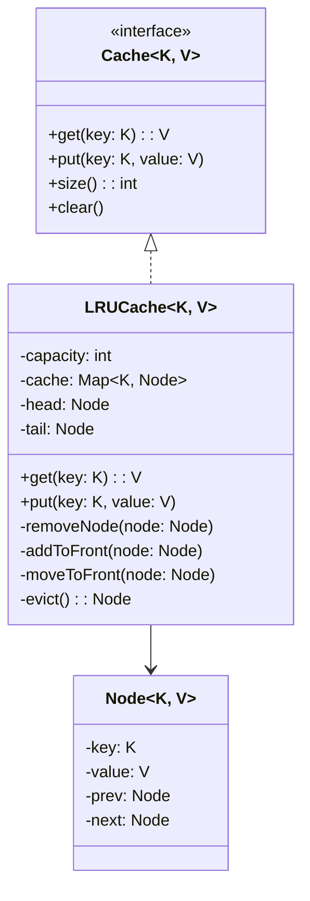

# LLD: LRU Cache Implementation

## Requirements

### Functional Requirements
1. `get(key)` — Retrieve value by key, return -1 if not found
2. `put(key, value)` — Insert or update key-value pair
3. When capacity is reached, evict **Least Recently Used** item
4. Both `get` and `put` must be O(1) time complexity

### Non-Functional Requirements
- Thread-safe
- Generic (support any key/value types)

## Class Diagram



## Design Approach

The key insight is combining two data structures:
1. **HashMap** — O(1) lookup by key
2. **Doubly Linked List** — O(1) insertion/deletion, maintain access order

```
HashMap:                    Doubly Linked List (most → least recent):
key1 → Node1               HEAD ↔ Node3 ↔ Node1 ↔ Node4 ↔ TAIL
key2 → Node2
key3 → Node3               On access: move node to HEAD
key4 → Node4               On eviction: remove from TAIL
```

## Code Implementation

### Python Implementation

```python
from typing import TypeVar, Generic, Optional, Dict
import threading

K = TypeVar('K')
V = TypeVar('V')

class Node(Generic[K, V]):
    """Doubly linked list node"""
    def __init__(self, key: K = None, value: V = None):
        self.key = key
        self.value = value
        self.prev: Optional['Node[K, V]'] = None
        self.next: Optional['Node[K, V]'] = None

class LRUCache(Generic[K, V]):
    """
    LRU Cache using HashMap + Doubly Linked List.
    Time: O(1) for get and put
    Space: O(capacity)
    """
    
    def __init__(self, capacity: int):
        if capacity <= 0:
            raise ValueError("Capacity must be positive")
        
        self._capacity = capacity
        self._cache: Dict[K, Node[K, V]] = {}
        
        # Dummy head and tail to avoid null checks
        self._head = Node[K, V]()  # Most recently used
        self._tail = Node[K, V]()  # Least recently used
        self._head.next = self._tail
        self._tail.prev = self._head
        
        self._lock = threading.Lock()
    
    def get(self, key: K) -> Optional[V]:
        """Get value by key. Returns None if not found."""
        with self._lock:
            if key not in self._cache:
                return None
            
            node = self._cache[key]
            self._move_to_front(node)
            return node.value
    
    def put(self, key: K, value: V) -> None:
        """Insert or update key-value pair."""
        with self._lock:
            if key in self._cache:
                # Update existing node
                node = self._cache[key]
                node.value = value
                self._move_to_front(node)
            else:
                # Create new node
                node = Node(key, value)
                self._cache[key] = node
                self._add_to_front(node)
                
                # Evict if over capacity
                if len(self._cache) > self._capacity:
                    evicted = self._evict()
                    del self._cache[evicted.key]
    
    def _remove_node(self, node: Node[K, V]) -> None:
        """Remove node from linked list"""
        node.prev.next = node.next
        node.next.prev = node.prev
    
    def _add_to_front(self, node: Node[K, V]) -> None:
        """Add node right after head (most recently used position)"""
        node.prev = self._head
        node.next = self._head.next
        self._head.next.prev = node
        self._head.next = node
    
    def _move_to_front(self, node: Node[K, V]) -> None:
        """Move existing node to front"""
        self._remove_node(node)
        self._add_to_front(node)
    
    def _evict(self) -> Node[K, V]:
        """Remove and return the least recently used node"""
        lru = self._tail.prev
        self._remove_node(lru)
        return lru
    
    def size(self) -> int:
        return len(self._cache)
    
    def clear(self) -> None:
        with self._lock:
            self._cache.clear()
            self._head.next = self._tail
            self._tail.prev = self._head
    
    def __str__(self) -> str:
        items = []
        current = self._head.next
        while current != self._tail:
            items.append(f"{current.key}: {current.value}")
            current = current.next
        return f"LRUCache([{', '.join(items)}])"
```

### Java Implementation

```java
import java.util.HashMap;
import java.util.Map;

public class LRUCache<K, V> {
    private final int capacity;
    private final Map<K, Node<K, V>> cache;
    private final Node<K, V> head;  // Most recently used
    private final Node<K, V> tail;  // Least recently used
    
    private static class Node<K, V> {
        K key;
        V value;
        Node<K, V> prev;
        Node<K, V> next;
        
        Node(K key, V value) {
            this.key = key;
            this.value = value;
        }
        
        Node() {
            this(null, null);
        }
    }
    
    public LRUCache(int capacity) {
        this.capacity = capacity;
        this.cache = new HashMap<>();
        this.head = new Node<>();
        this.tail = new Node<>();
        head.next = tail;
        tail.prev = head;
    }
    
    public synchronized V get(K key) {
        Node<K, V> node = cache.get(key);
        if (node == null) return null;
        moveToHead(node);
        return node.value;
    }
    
    public synchronized void put(K key, V value) {
        Node<K, V> node = cache.get(key);
        if (node != null) {
            node.value = value;
            moveToHead(node);
        } else {
            Node<K, V> newNode = new Node<>(key, value);
            cache.put(key, newNode);
            addToHead(newNode);
            if (cache.size() > capacity) {
                Node<K, V> evicted = removeTail();
                cache.remove(evicted.key);
            }
        }
    }
    
    private void removeNode(Node<K, V> node) {
        node.prev.next = node.next;
        node.next.prev = node.prev;
    }
    
    private void addToHead(Node<K, V> node) {
        node.prev = head;
        node.next = head.next;
        head.next.prev = node;
        head.next = node;
    }
    
    private void moveToHead(Node<K, V> node) {
        removeNode(node);
        addToHead(node);
    }
    
    private Node<K, V> removeTail() {
        Node<K, V> lru = tail.prev;
        removeNode(lru);
        return lru;
    }
}
```

## Usage Example

```python
# Create cache with capacity 3
cache = LRUCache[str, int](capacity=3)

cache.put("a", 1)
cache.put("b", 2)
cache.put("c", 3)
print(cache)  # LRUCache([c: 3, b: 2, a: 1])

cache.get("a")  # Access 'a', moves to front
print(cache)  # LRUCache([a: 1, c: 3, b: 2])

cache.put("d", 4)  # Add 'd', evicts 'b' (LRU)
print(cache)  # LRUCache([d: 4, a: 1, c: 3])

print(cache.get("b"))  # None (evicted)
print(cache.get("a"))  # 1
```

## Variants

### LFU (Least Frequently Used) Cache

```python
from collections import defaultdict

class LFUCache:
    def __init__(self, capacity: int):
        self.capacity = capacity
        self.cache = {}  # key -> value
        self.freq = {}   # key -> frequency
        self.freq_to_keys = defaultdict(OrderedDict)  # freq -> {key: None}
        self.min_freq = 0
    
    def get(self, key: int) -> int:
        if key not in self.cache:
            return -1
        self._update_freq(key)
        return self.cache[key]
    
    def put(self, key: int, value: int) -> None:
        if self.capacity == 0:
            return
        
        if key in self.cache:
            self.cache[key] = value
            self._update_freq(key)
            return
        
        if len(self.cache) >= self.capacity:
            # Evict LFU item
            evict_key, _ = self.freq_to_keys[self.min_freq].popitem(last=False)
            del self.cache[evict_key]
            del self.freq[evict_key]
        
        self.cache[key] = value
        self.freq[key] = 1
        self.freq_to_keys[1][key] = None
        self.min_freq = 1
    
    def _update_freq(self, key: int) -> None:
        freq = self.freq[key]
        del self.freq_to_keys[freq][key]
        if not self.freq_to_keys[freq]:
            del self.freq_to_keys[freq]
            if self.min_freq == freq:
                self.min_freq += 1
        
        self.freq[key] = freq + 1
        self.freq_to_keys[freq + 1][key] = None
```

### Thread-Safe Cache with TTL

```python
import time

class TTLCache:
    """Cache with Time-To-Live expiration"""
    
    def __init__(self, capacity: int, default_ttl: float = 300):
        self._cache = LRUCache(capacity)
        self._ttl = {}  # key -> expiration_time
        self._default_ttl = default_ttl
        self._lock = threading.Lock()
    
    def get(self, key: str) -> Optional[any]:
        with self._lock:
            if key in self._ttl and time.time() > self._ttl[key]:
                # Expired
                del self._ttl[key]
                return None
            return self._cache.get(key)
    
    def put(self, key: str, value: any, ttl: float = None):
        with self._lock:
            self._cache.put(key, value)
            self._ttl[key] = time.time() + (ttl or self._default_ttl)
```

## Design Patterns Used

| Pattern | Where | Why |
|---------|-------|-----|
| **Strategy** | Eviction policy | LRU, LFU, FIFO interchangeable |
| **Composite** | HashMap + LinkedList | Two data structures work together |

## Complexity Analysis

| Operation | Time | Space |
|-----------|------|-------|
| `get` | O(1) | O(1) |
| `put` | O(1) | O(1) |
| Space | - | O(n) |

## Edge Cases

1. **Capacity = 1**: Every put evicts the previous item
2. **Duplicate key update**: Update value, move to front
3. **Empty cache**: `get` returns None
4. **Thread safety**: Lock all operations
5. **Null keys/values**: Validate input

## Interview Questions

1. **Q: How would you implement LRU with a max size in bytes?**
   A: Track byte size per entry, evict until under limit.

2. **Q: How would you make this distributed?**
   A: Consistent hashing across nodes, each node has local LRU.

3. **Q: How would you implement write-through to database?**
   A: On put, write to both cache and DB; on evict, DB already has data.

## Common Mistakes

- ❌ Using OrderedDict alone (no O(1) for move_to_end on arbitrary key in Python)
- ❌ Forgetting to update the linked list on get
- ❌ Not handling the capacity correctly (check after adding)
- ❌ Off-by-one errors in eviction

## Cross-References

- [Design Patterns](./design-patterns.md) — Strategy pattern
- [Concurrency Design](./concurrency-design.md) — Thread-safe implementation
- [HLD: Caching Strategy](../hld/caching-strategy.md) — Caching concepts
- [HLD: Database Design](../hld/database-design.md) — Cache-aside pattern
