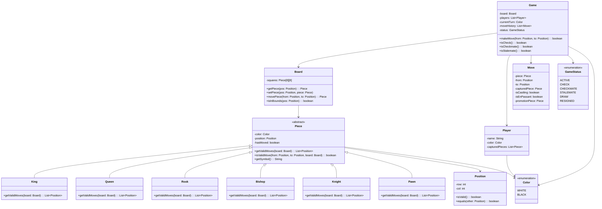

# LLD: Chess Game

## Requirements

### Functional Requirements
1. Two players play on an 8×8 board
2. Support all piece types: King, Queen, Rook, Bishop, Knight, Pawn
3. Validate legal moves for each piece
4. Detect check, checkmate, and stalemate
5. Track game state (turns, captured pieces, move history)
6. Support castling, en passant, pawn promotion
7. Allow resignation and draw offers

### Non-Functional Requirements
- Clear separation of game logic and UI
- Extensible for variants (Chess960, etc.)

## Class Diagram



## Code Implementation

```python
from abc import ABC, abstractmethod
from enum import Enum
from typing import List, Optional, Tuple
from copy import deepcopy

class Color(Enum):
    WHITE = "WHITE"
    BLACK = "BLACK"

class GameStatus(Enum):
    ACTIVE = "ACTIVE"
    CHECK = "CHECK"
    CHECKMATE = "CHECKMATE"
    STALEMATE = "STALEMATE"
    DRAW = "DRAW"
    RESIGNED = "RESIGNED"

class Position:
    def __init__(self, row: int, col: int):
        self.row = row
        self.col = col
    
    def is_valid(self) -> bool:
        return 0 <= self.row < 8 and 0 <= self.col < 8
    
    def __eq__(self, other):
        if not isinstance(other, Position):
            return False
        return self.row == other.row and self.col == other.col
    
    def __hash__(self):
        return hash((self.row, self.col))
    
    def __repr__(self):
        return f"({self.row}, {self.col})"
```

### Pieces

```python
class Piece(ABC):
    def __init__(self, color: Color, position: Position):
        self._color = color
        self._position = position
        self._has_moved = False
    
    @property
    def color(self) -> Color:
        return self._color
    
    @property
    def position(self) -> Position:
        return self._position
    
    @position.setter
    def position(self, value: Position):
        self._position = value
    
    @property
    def has_moved(self) -> bool:
        return self._has_moved
    
    def mark_moved(self):
        self._has_moved = True
    
    @abstractmethod
    def get_valid_moves(self, board: 'Board') -> List[Position]:
        pass
    
    @abstractmethod
    def get_symbol(self) -> str:
        pass
    
    def _get_color_symbol(self, symbol: str) -> str:
        return symbol if self._color == Color.WHITE else symbol.lower()

class King(Piece):
    def get_valid_moves(self, board: 'Board') -> List[Position]:
        moves = []
        directions = [(-1,-1), (-1,0), (-1,1), (0,-1), (0,1), (1,-1), (1,0), (1,1)]
        
        for dr, dc in directions:
            new_pos = Position(self._position.row + dr, self._position.col + dc)
            if new_pos.is_valid():
                target = board.get_piece(new_pos)
                if target is None or target.color != self._color:
                    moves.append(new_pos)
        
        # Castling
        if not self._has_moved:
            # Kingside castling
            rook = board.get_piece(Position(self._position.row, 7))
            if (rook and isinstance(rook, Rook) and not rook.has_moved 
                and rook.color == self._color):
                if all(board.get_piece(Position(self._position.row, c)) is None 
                       for c in [5, 6]):
                    moves.append(Position(self._position.row, 6))
            
            # Queenside castling
            rook = board.get_piece(Position(self._position.row, 0))
            if (rook and isinstance(rook, Rook) and not rook.has_moved 
                and rook.color == self._color):
                if all(board.get_piece(Position(self._position.row, c)) is None 
                       for c in [1, 2, 3]):
                    moves.append(Position(self._position.row, 2))
        
        return moves
    
    def get_symbol(self) -> str:
        return self._get_color_symbol("K")

class Queen(Piece):
    def get_valid_moves(self, board: 'Board') -> List[Position]:
        # Queen = Rook + Bishop moves
        moves = []
        directions = [(-1,-1), (-1,0), (-1,1), (0,-1), (0,1), (1,-1), (1,0), (1,1)]
        
        for dr, dc in directions:
            for i in range(1, 8):
                new_pos = Position(self._position.row + dr*i, self._position.col + dc*i)
                if not new_pos.is_valid():
                    break
                target = board.get_piece(new_pos)
                if target is None:
                    moves.append(new_pos)
                elif target.color != self._color:
                    moves.append(new_pos)
                    break
                else:
                    break
        
        return moves
    
    def get_symbol(self) -> str:
        return self._get_color_symbol("Q")

class Rook(Piece):
    def get_valid_moves(self, board: 'Board') -> List[Position]:
        moves = []
        directions = [(-1,0), (1,0), (0,-1), (0,1)]
        
        for dr, dc in directions:
            for i in range(1, 8):
                new_pos = Position(self._position.row + dr*i, self._position.col + dc*i)
                if not new_pos.is_valid():
                    break
                target = board.get_piece(new_pos)
                if target is None:
                    moves.append(new_pos)
                elif target.color != self._color:
                    moves.append(new_pos)
                    break
                else:
                    break
        
        return moves
    
    def get_symbol(self) -> str:
        return self._get_color_symbol("R")

class Bishop(Piece):
    def get_valid_moves(self, board: 'Board') -> List[Position]:
        moves = []
        directions = [(-1,-1), (-1,1), (1,-1), (1,1)]
        
        for dr, dc in directions:
            for i in range(1, 8):
                new_pos = Position(self._position.row + dr*i, self._position.col + dc*i)
                if not new_pos.is_valid():
                    break
                target = board.get_piece(new_pos)
                if target is None:
                    moves.append(new_pos)
                elif target.color != self._color:
                    moves.append(new_pos)
                    break
                else:
                    break
        
        return moves
    
    def get_symbol(self) -> str:
        return self._get_color_symbol("B")

class Knight(Piece):
    def get_valid_moves(self, board: 'Board') -> List[Position]:
        moves = []
        offsets = [(-2,-1), (-2,1), (-1,-2), (-1,2), (1,-2), (1,2), (2,-1), (2,1)]
        
        for dr, dc in offsets:
            new_pos = Position(self._position.row + dr, self._position.col + dc)
            if new_pos.is_valid():
                target = board.get_piece(new_pos)
                if target is None or target.color != self._color:
                    moves.append(new_pos)
        
        return moves
    
    def get_symbol(self) -> str:
        return self._get_color_symbol("N")

class Pawn(Piece):
    def get_valid_moves(self, board: 'Board') -> List[Position]:
        moves = []
        direction = 1 if self._color == Color.WHITE else -1
        
        # Forward move
        new_pos = Position(self._position.row + direction, self._position.col)
        if new_pos.is_valid() and board.get_piece(new_pos) is None:
            moves.append(new_pos)
            
            # Double move from starting position
            start_row = 1 if self._color == Color.WHITE else 6
            if self._position.row == start_row:
                new_pos = Position(self._position.row + 2*direction, self._position.col)
                if board.get_piece(new_pos) is None:
                    moves.append(new_pos)
        
        # Diagonal captures
        for dc in [-1, 1]:
            new_pos = Position(self._position.row + direction, self._position.col + dc)
            if new_pos.is_valid():
                target = board.get_piece(new_pos)
                if target and target.color != self._color:
                    moves.append(new_pos)
        
        return moves
    
    def get_symbol(self) -> str:
        return self._get_color_symbol("P")
```

### Board and Game

```python
class Board:
    def __init__(self):
        self._squares: List[List[Optional[Piece]]] = [[None]*8 for _ in range(8)]
        self._setup_board()
    
    def _setup_board(self):
        # Setup pawns
        for col in range(8):
            self._squares[1][col] = Pawn(Color.WHITE, Position(1, col))
            self._squares[6][col] = Pawn(Color.BLACK, Position(6, col))
        
        # Setup other pieces
        piece_order = [Rook, Knight, Bishop, Queen, King, Bishop, Knight, Rook]
        for col, piece_class in enumerate(piece_order):
            self._squares[0][col] = piece_class(Color.WHITE, Position(0, col))
            self._squares[7][col] = piece_class(Color.BLACK, Position(7, col))
    
    def get_piece(self, position: Position) -> Optional[Piece]:
        if not position.is_valid():
            return None
        return self._squares[position.row][position.col]
    
    def set_piece(self, position: Position, piece: Optional[Piece]):
        self._squares[position.row][position.col] = piece
        if piece:
            piece.position = position
    
    def move_piece(self, from_pos: Position, to_pos: Position) -> Optional[Piece]:
        piece = self.get_piece(from_pos)
        captured = self.get_piece(to_pos)
        self.set_piece(to_pos, piece)
        self.set_piece(from_pos, None)
        if piece:
            piece.mark_moved()
        return captured
    
    def find_king(self, color: Color) -> Optional[Position]:
        for row in range(8):
            for col in range(8):
                piece = self._squares[row][col]
                if piece and isinstance(piece, King) and piece.color == color:
                    return Position(row, col)
        return None

class Move:
    def __init__(self, piece: Piece, from_pos: Position, to_pos: Position,
                 captured: Optional[Piece] = None, is_castling: bool = False,
                 is_en_passant: bool = False):
        self.piece = piece
        self.from_pos = from_pos
        self.to_pos = to_pos
        self.captured = captured
        self.is_castling = is_castling
        self.is_en_passant = is_en_passant

class Player:
    def __init__(self, name: str, color: Color):
        self.name = name
        self.color = color
        self.captured_pieces: List[Piece] = []

class Game:
    def __init__(self, player1_name: str, player2_name: str):
        self._board = Board()
        self._players = [
            Player(player1_name, Color.WHITE),
            Player(player2_name, Color.BLACK)
        ]
        self._current_turn = Color.WHITE
        self._move_history: List[Move] = []
        self._status = GameStatus.ACTIVE
    
    @property
    def board(self) -> Board:
        return self._board
    
    @property
    def status(self) -> GameStatus:
        return self._status
    
    def make_move(self, from_pos: Position, to_pos: Position) -> bool:
        if self._status not in [GameStatus.ACTIVE, GameStatus.CHECK]:
            return False
        
        piece = self._board.get_piece(from_pos)
        if not piece or piece.color != self._current_turn:
            return False
        
        valid_moves = piece.get_valid_moves(self._board)
        if to_pos not in valid_moves:
            return False
        
        # Make move
        captured = self._board.move_piece(from_pos, to_pos)
        move = Move(piece, from_pos, to_pos, captured)
        self._move_history.append(move)
        
        if captured:
            current_player = self._players[0] if self._current_turn == Color.WHITE else self._players[1]
            current_player.captured_pieces.append(captured)
        
        # Switch turns
        self._current_turn = Color.BLACK if self._current_turn == Color.WHITE else Color.WHITE
        
        # Check game state
        self._update_game_status()
        
        return True
    
    def _update_game_status(self):
        opponent = self._current_turn
        
        if self._is_in_check(opponent):
            if self._has_no_legal_moves(opponent):
                self._status = GameStatus.CHECKMATE
            else:
                self._status = GameStatus.CHECK
        elif self._has_no_legal_moves(opponent):
            self._status = GameStatus.STALEMATE
    
    def _is_in_check(self, color: Color) -> bool:
        king_pos = self._board.find_king(color)
        if not king_pos:
            return False
        
        opponent_color = Color.BLACK if color == Color.WHITE else Color.WHITE
        for row in range(8):
            for col in range(8):
                piece = self._board.get_piece(Position(row, col))
                if piece and piece.color == opponent_color:
                    if king_pos in piece.get_valid_moves(self._board):
                        return True
        return False
    
    def _has_no_legal_moves(self, color: Color) -> bool:
        for row in range(8):
            for col in range(8):
                piece = self._board.get_piece(Position(row, col))
                if piece and piece.color == color:
                    valid_moves = piece.get_valid_moves(self._board)
                    for move in valid_moves:
                        # Try move and check if still in check
                        temp_board = deepcopy(self._board)
                        temp_board.move_piece(Position(row, col), move)
                        if not self._would_be_in_check(temp_board, color):
                            return False
        return True
    
    def _would_be_in_check(self, board: Board, color: Color) -> bool:
        king_pos = board.find_king(color)
        if not king_pos:
            return True
        
        opponent_color = Color.BLACK if color == Color.WHITE else Color.WHITE
        for row in range(8):
            for col in range(8):
                piece = board.get_piece(Position(row, col))
                if piece and piece.color == opponent_color:
                    if king_pos in piece.get_valid_moves(board):
                        return True
        return False
    
    def display_board(self):
        print("  a b c d e f g h")
        for row in range(7, -1, -1):
            print(f"{row+1} ", end="")
            for col in range(8):
                piece = self._board.get_piece(Position(row, col))
                if piece:
                    print(f"{piece.get_symbol()} ", end="")
                else:
                    print(". ", end="")
            print(f"{row+1}")
        print("  a b c d e f g h")
```

## Design Patterns Used

| Pattern | Where | Why |
|---------|-------|-----|
| **Strategy** | Piece move validation | Each piece has different movement rules |
| **Composite** | Board with pieces | Tree structure of game elements |
| **Command** | Move class | Encapsulate move operations |

## Edge Cases

1. **Castling through check**: Can't castle through attacked squares
2. **En passant**: Pawn capture that looks like regular move
3. **Pawn promotion**: Pawn reaches last rank
4. **Threefold repetition**: Draw condition
5. **50-move rule**: No captures or pawn moves

## Interview Questions

1. **Q: How would you add undo functionality?**
   A: Store full board state before each move, or reverse moves.

2. **Q: How would you support Chess960?**
   A: Randomize back rank in _setup_board, modify castling logic.

3. **Q: How would you add an AI player?**
   A: Implement Minimax with alpha-beta pruning, plug in as Player.

## Cross-References

- [Design Patterns](./design-patterns.md) — Strategy, Command
- [SOLID Principles](./solid.md) — Open/Closed for new pieces
- [OOP Concepts](./oop-concepts.md) — Polymorphism for piece moves
- [Game Design](./elevator.md)
