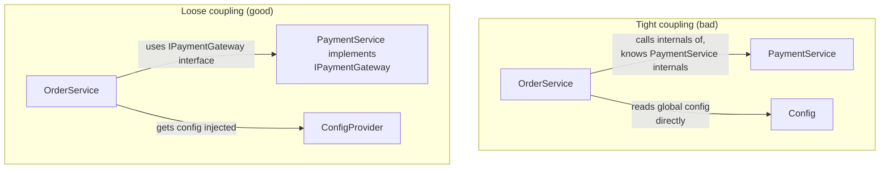
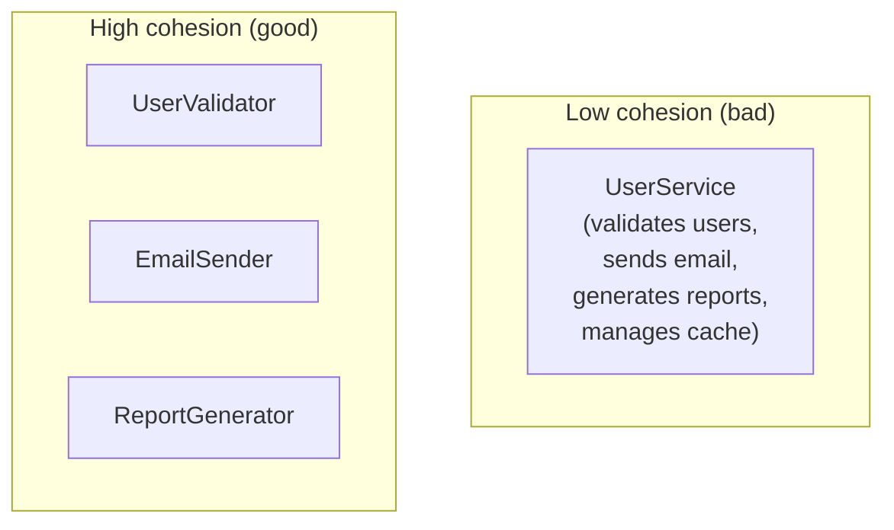

# Coupling, Cohesion, and Design Principles

## Overview

Beyond the four pillars of OOP, senior interviews probe **design quality**: how modules relate (**coupling**), how well each module holds together (**cohesion**), and the principles that keep designs maintainable (**DRY, YAGNI, KISS, Law of Demeter, information hiding**). These concepts apply to classes, functions, packages, and microservices alike.

## Coupling

**Coupling** measures how much one module depends on another. Lower coupling is better: modules should interact through **stable, narrow interfaces** so a change in one doesn't force changes in others.

| Coupling type | What it means | Example |
|---|---|---|
| **Content** (worst) | One module reaches into another's internals | Directly poking another object's fields |
| **Common/global** | Shared global state | Global mutable singletons |
| **Control** | Passing flags that change the callee's control flow | `process(order, isExpress)` |
| **Data** | Sharing data through parameters | Passing an `Order` object |
| **Message/interface** (best) | Communicating through defined interfaces | Calling a method on an interface |

**How to reduce coupling**: depend on interfaces/abstractions, inject dependencies (see [Dependency Injection](./abstraction-interfaces.md)), avoid global state, prefer events/messages between modules, and keep module boundaries clean.

## Cohesion

**Cohesion** measures how strongly the elements of a module belong together. High cohesion = a module has **one clear responsibility** and all its parts serve that purpose.

| Level | Description |
|---|---|
| **Functional** (best) | All elements contribute to one function |
| **Sequential** | Output of one is input of next |
| **Communicational** | Share the same data |
| **Procedural** | Related by order of operations |
| **Temporal** | Happen at the same time |
| **Coincidental** (worst) | No meaningful relationship |

**High cohesion + low coupling is the target**: cohesive modules are easier to test, reason about, and reuse; low coupling keeps changes local.

## Design Principles

### DRY — Don't Repeat Yourself

Every piece of knowledge should have a **single, unambiguous representation**. Duplication means a fix must be applied in N places and they drift. Apply at the right granularity — over-abstracting (the "DRY taken too far" failure) creates coupling to a premature abstraction.

### YAGNI — You Aren't Gonna Need It

Don't build speculative features "just in case." Unused abstractions cost code, complexity, and testing. YAGNI says implement for today's requirements and refactor when the real need appears. (YAGNI and DRY are in tension — DRY says extract now, YAGNI says wait until the third use.)

### KISS — Keep It Simple

The simplest design that meets the requirements is usually the best: fewer moving parts, fewer bugs, easier review. Prefer the obvious solution over the clever one unless there's measured need.

### Law of Demeter (principle of least knowledge)

"Talk only to your immediate friends." A method should only call methods on: itself, its parameters, objects it creates, and its own fields — **not** on objects returned by those calls (`a.getB().getC().doThing()`). Chained access couples you to the whole object graph and breaks when any intermediate shape changes.

### Information Hiding

Hide implementation details behind interfaces so callers depend on **what** a module does, not **how**. This is the basis of encapsulation and the key enabler of refactoring: as long as the interface is stable, the implementation can change freely.

### Composition over Inheritance

Prefer **composition** (has-a) to **inheritance** (is-a) for reuse. Inheritance couples a subclass to its parent's implementation, creates fragile hierarchies (the "fragile base class problem"), and forces a single classification. Composition assembles behavior from smaller, focused objects and swaps them at runtime. Use inheritance mainly for true subtype polymorphism (an `IsA` relationship) with stable contracts.

## SOLID (quick recap)

| Principle | Core idea |
|---|---|
| **S**ingle Responsibility | One reason to change per class |
| **O**pen/Closed | Open for extension, closed for modification |
| **L**iskov Substitution | Subtypes usable where the base type is expected |
| **I**nterface Segregation | Small, specific interfaces over fat ones |
| **D**ependency Inversion | Depend on abstractions, not concretions |

See [SOLID Principles](./solid.md) for the deep dive.

## Coupling/Cohesion in the Large

The same ideas scale beyond classes:

- **Modules/packages** — hide internals, export narrow APIs.
- **Microservices** — bounded contexts, API contracts, event-driven decoupling (see [Microservices](../../../backend/patterns/microservices.md)).
- **Layers** — presentation → application → domain → infrastructure, each depending only on the layer below (via abstractions).

## Interview Questions

### Q: What is the difference between coupling and cohesion?

Coupling measures **inter-module** dependency (how much one module knows about another); cohesion measures **intra-module** unity (how strongly a module's parts belong together). Good design pursues **high cohesion and low coupling**: each module does one thing well and interacts with others only through narrow interfaces.

### Q: Give an example of how you'd reduce coupling.

Introduce an interface between the caller and the dependency, inject it rather than constructing it (constructor injection), and avoid global state. Example: `OrderService` depends on `IPaymentGateway`, not `StripeClient` — swapping Stripe for PayPal (or a test double) requires no change to `OrderService`. Also avoid the Law of Demeter violations (no `getA().getB().doX()` chains).

### Q: When does DRY conflict with YAGNI?

DRY says extract duplicated logic into a shared abstraction; YAGNI says don't build abstractions until needed. The pragmatic resolution: **rule of three** — duplicate it twice, extract on the third occurrence (or when the duplication's cost is clear). Premature extraction creates speculative abstractions that couple unrelated code; waiting too long lets drift creep in.

### Q: What is the Law of Demeter and why does it matter?

It says a method should only interact with its immediate dependencies (its own fields, its parameters, objects it creates). Violations appear as long accessor chains (`user.getAddress().getCity().getName()`), which couple the caller to the entire object graph — any shape change ripples through every chain. Fix by adding behavior to the intermediate objects or restructuring the interface.

### Q: Composition vs inheritance — how do you decide?

Use inheritance when there's a true **is-a** subtype relationship with a stable contract you want to polymorphically substitute. Prefer composition (has-a) for code reuse: it avoids fragile base classes, lets behavior be assembled/swapped at runtime, and keeps classes single-purpose. The classic example: a `Bird` inheriting from a `FlyingThing` breaks when `Penguin` shows up — `Penguin` should compose with a `MovementStrategy` instead.

## References

- Martin Fowler: *Coupling, Cohesion* — https://martinfowler.com/books/refactoring.html
- Wikipedia: Law of Demeter — https://en.wikipedia.org/wiki/Law_of_Demeter
- *Clean Code* (Robert C. Martin) — principles and heuristics
- GRASP patterns (Larman): information expert, low coupling, high cohesion — https://en.wikipedia.org/wiki/GRASP_(object-oriented_design)
- Martin Fowler: *YAGNI* — https://martinfowler.com/bliki/Yagni.html

## Related Topics

- [OOP Concepts](./oop-concepts.md) — the four pillars
- [SOLID Principles](./solid.md) — the five principles
- [Abstraction & Interfaces](./abstraction-interfaces.md) — dependency injection, interface design
- [Design Patterns](./design-patterns.md) — patterns that encode low coupling/high cohesion
- [Microservices](../../../backend/patterns/microservices.md) — coupling/cohesion at service scale
