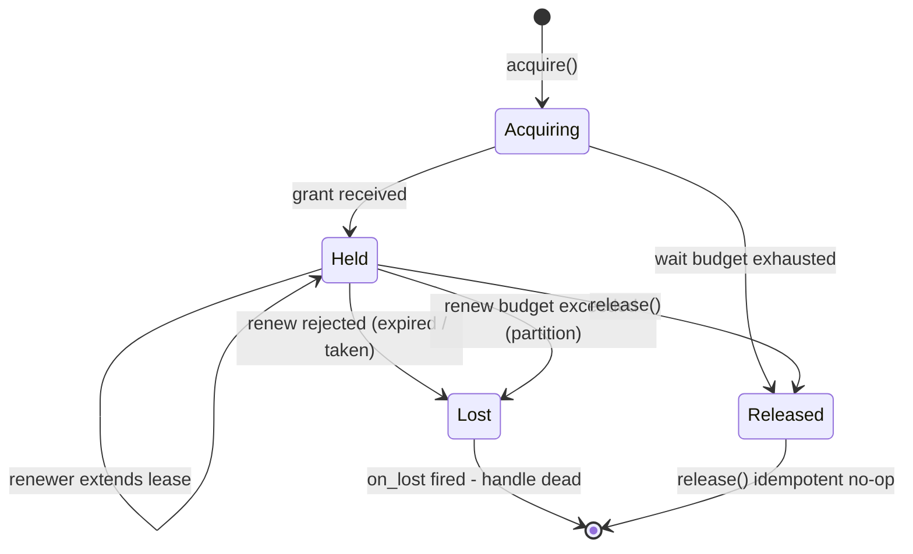
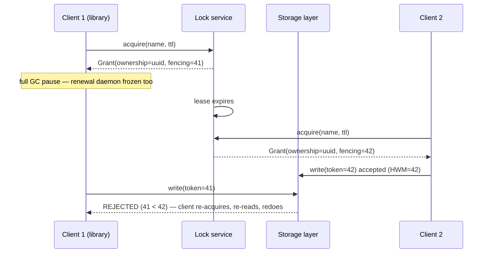

# LLD: Distributed Lock Client Library

The [lock service itself](../real-world/distributed-lock.md) is an HLD problem: which
store backs the lock, how grants survive failures, what TTL means. This page designs
the other side — the **client library** your application code actually links against.
That library is where a lease becomes a programming model: an object with a lifecycle,
a background renewal loop, a fencing token you can hand to downstream systems, retry
policies that respect validity windows, and the test seams that make the failure modes
reproducible before production demonstrates them for you.

The hard rule that shapes every decision below: the client library can *detect* that it
lost a lock, but it can never *enforce* exclusivity. Enforcement lives at the resource,
via [fencing tokens](../../../distributed/fundamentals/fencing-tokens.md). A client
library that pretends otherwise — one whose `is_held()` promises safety — is the most
common design failure in this problem space.

## Requirements

### Functional
- `acquire(name, ttl, opts)` → a handle that represents owned access
- `renew` (auto, via a daemon; manual as an escape hatch)
- `release` — only by the holder, only once
- Optional: try-lock with bounded wait, reentrancy within a process, notification on
  lock transfer (watch/callback) instead of polling

### Non-Functional
- **Safety**: at most one live holder per name, tolerated clock skew bounded and
  accounted for in the validity window
- **Liveness**: a blocked acquirer eventually acquires (or fails explicitly), no
  thundering herd on release
- **Fail-open**: the library must never hang application threads; every indefinite
  wait is behind an explicit opt-in
- **Testability**: deterministic under simulated pauses, partitions, and clock steps

## API Surface

```python
from typing import Protocol, Optional, Callable
from dataclasses import dataclass
from enum import Enum, auto

class Clock(Protocol):
    """Injected time. No library code calls time.time() directly."""
    def now(self) -> float: ...
    def monotonic(self) -> float: ...

class LockService(Protocol):
    """Transport to the HLD-level service (Redis, etcd, ZooKeeper, ...)."""
    def acquire(self, name: str, owner_id: str, ttl_s: float) -> "Grant": ...
    def renew(self, name: str, owner_id: str, ownership_token: str,
              ttl_s: float) -> bool: ...
    def release(self, name: str, ownership_token: str) -> None: ...
    def watch(self, name: str, on_released: Callable[[], None]) -> Callable[[], None]: ...

@dataclass(frozen=True)
class Grant:
    ownership_token: str   # random per grant; guards release/renew (no ordering)
    fencing_token: int     # strictly monotonic, minted by the service
    expires_at: float      # monotonic deadline, already drift-adjusted

class LockClient:
    """Thread-safe. One instance per process per backend; holds the connection
    pool, the renewal scheduler, and configuration."""
    def acquire(self, name: str, ttl_s: float, *,
                wait_s: float = 0.0,            # bounded retry budget
                reentrant: bool = False,        # in-process refcounting only
                on_lost: Optional[Callable[["LockHandle"], None]] = None,
                ) -> "LockHandle": ...

    # escape hatches
    def on_release(self, name: str, cb: Callable[[], None]) -> Callable[[], None]: ...

class LockHandle:
    """NOT thread-safe. One logical owner; hand it off explicitly if you must."""
    @property
    def name(self) -> str: ...
    @property
    def fencing_token(self) -> int: ...        # attach to every protected operation
    def is_held(self) -> bool: ...             # advisory; see GC-pause section
    def release(self) -> None: ...             # idempotent
    def __enter__(self) -> "LockHandle": ...
    def __exit__(self, *exc) -> None: ...
```

Three API decisions worth defending in an interview:

1. **`acquire` returns a handle, not a boolean.** Ownership is a resource with a
   lifecycle (renew, release, lose), so it gets a first-class object — the same
   reasoning that makes a connection pool return a pooled connection rather than a
   `bool`.
2. **Two different tokens, never conflated.** The *ownership token* is a random
   value (Redis docs: ~20 bytes from `/dev/urandom`) used in a compare-and-delete so
   `release` cannot delete someone else's lock. It has **no ordering**, so it cannot
   serve as a fencing token. The *fencing token* is minted by the lock service from a
   strictly monotonic counter. Conflating them — using the UUID for fencing — is
   silently unsound because storage cannot compare UUIDs for recency.
3. **`wait_s` is bounded by construction.** There is no "wait forever" option; callers
   who want that pass a large budget and renew it. Unbounded blocking inside a library
   call is how lock contention becomes a production outage.

## Handle Lifecycle



Rules the implementation must enforce:

- **Terminal states are sticky.** After `Lost` or `Released`, `renew` fails fast
  locally without a network call, and the handle never revives. Getting a new lease is
  always a new `acquire` — reanimation code paths are where split-brain bugs breed.
- **`release()` is idempotent** and compares ownership tokens server-side before
  deleting (the Lua compare-and-delete from the
  [HLD page](../real-world/distributed-lock.md), or `DELEX ... IFEQ` on Redis ≥ 8.4).
- **`is_held()` is advisory.** It reports the client's belief, which may be stale by
  up to one renewal interval plus one network delay. Callers use it to stop work
  early; only the fencing token checked at the resource is authoritative.

## The Renewal Daemon (Auto-Extension)

A daemon thread (or timer wheel, one per client) extends leases at roughly `ttl/3`:

```python
class _LeaseRenewer(threading.Thread):
    def __init__(self, service, handle, clock, ttl, on_lost, fail_budget=2):
        super().__init__(daemon=True)
        self._svc, self._h, self._clock = service, handle, clock
        self._interval = ttl / 3
        self._ttl, self._on_lost, self._fail_budget = ttl, on_lost, fail_budget
        self._failures = 0

    def run(self):
        while True:
            self._sleep(self._interval * (0.9 + 0.2 * self._clock.rand()))  # jitter
            h = self._h
            if not h.transition_if_held(lambda g: g):          # still HELD?
                return
            if self._clock.monotonic() > h.grant.expires_at - 2 * self._interval:
                h.transition_to_lost(self._on_lost)            # too close to expiry
                return
            try:
                ok = self._svc.renew(h.name, h.owner_id, h.grant.ownership_token,
                                     self._ttl)
                self._failures = 0
            except TransportError:
                self._failures += 1
                ok = self._failures < self._fail_budget        # transient grace
            if not ok:
                h.transition_to_lost(self._on_lost)
                return
```

Design points that come up in every review:

- **Schedule = `ttl/3` with jitter.** Renewing at 90% of TTL has no room for a retry;
  renewing continuously triples load on the lock service. The `ttl/3` cadence means a
  single failed renew can be retried twice before the deadline.
- **Local expiry check first.** If `monotonic()` says the lease is within `2 ×
  interval` of expiry, declare `Lost` without asking the server. The client's clock
  (`monotonic`, immune to wall-clock steps) is the conservative one; the
  [Redis docs note Redis itself uses a non-monotonic clock for TTLs](https://redis.io/docs/latest/develop/clients/patterns/distributed-locks/),
  which is exactly why the *client* must not derive deadlines from wall time.
- **What renewal proves and does not.** A successful renew proves the *renewer* was
  alive at that instant (Chubby's KeepAlive renews the session, not your writes'
  validity). It does not retroactively legalize operations that happened during an
  expired window. Treat renewal as liveness telemetry, never as safety.
- **`on_lost` runs on the daemon thread.** Document it. Callbacks that grab application
  locks can deadlock against a thread that holds the handle and waits on them.

## Fencing Tokens End-to-End

The full flow — grant, pause, takeover, rejection:



The client library's job is to make the token *unforgettable*: `handle.fencing_token`
is right there on the object the code already holds, and the documented pattern is to
pass it into every protected operation. The enforcement point is the storage layer —
a component the misbehaving (stale) client cannot fool:

```python
class StaleFencingToken(Exception): ...

def apply(conn, resource: str, fencing_token: int, mutation) -> None:
    """Fencing gate: one transaction holds the high-water mark and the write."""
    with conn.transaction():
        row = conn.execute(
            "SELECT last_fencing_token FROM lock_state WHERE resource = %s FOR UPDATE",
            (resource,)).fetchone()
        if row is not None and fencing_token < row.last_fencing_token:
            raise StaleFencingToken(fencing_token, row.last_fencing_token)
        mutation(conn)                     # the protected write, same transaction
        conn.execute(
            "INSERT INTO lock_state(resource, last_fencing_token) VALUES (%s, %s) "
            "ON CONFLICT (resource) DO UPDATE SET last_fencing_token = EXCLUDED.last_fencing_token",
            (resource, fencing_token))
```

Details that separate a working gate from a decorative one:

- **High-water mark, not equality.** Retries of the *same* operation carry the same
  token and must be accepted after an in-flight duplicate; rejecting `token <= HWM`
  breaks idempotent retries. Reject only `token < HWM`.
- **Check and write share one transaction.** A gate that checks in one transaction and
  writes in another has a race window identical to the bug it was meant to close.
- **Redis offers no token facility.** The Redis docs' own guidance: "You should
  implement fencing tokens... don't assume that a lock is retained as long as the
  process that had acquired it is alive." If your backend cannot mint a monotonic
  token (plain Redis), take one from a service that can (etcd revision, ZooKeeper
  zxid) or accept that the lock is an efficiency lock only.

## Correctness Properties

**Safety — mutual exclusion with clock-skew tolerance.** Expiry is a timing contract,
so the library must budget for clocks: a Redlock grant is only *valid* for
`MIN_VALIDITY = TTL − (T2 − T1) − CLOCK_DRIFT`, where `T2 − T1` is the time the
acquisition itself consumed and `CLOCK_DRIFT` compensates for per-node drift. A client
library that treats the full TTL as usable time is spending time that does not exist.
The honest statement of the guarantee: mutual exclusion holds *for operations whose
duration fits inside the validity window*; the asynchronous-system pause is unbounded,
which is why the pause case gets its own section below. Frame locks as
[leases](../../../distributed/advanced/leases.md): a permission that decays, not a
physical exclusion.

**Liveness — eventual acquisition.** Every acquirer either gets the lock or fails
within its bounded wait budget. Two enemies: retry storms and herd effects (next
section), and starvation — with random jitter and no fairness, an unlucky contender can
lose repeatedly; that is usually acceptable, but say it out loud and offer the fair
alternative (queueing via sequential nodes) when asked.

## Retry with Jitter and Bounded Wait

```python
import random

def acquire(self, name, ttl, *, wait_s=0.0, base_s=0.05, cap_s=1.0, on_lost=None):
    deadline = self._clock.monotonic() + wait_s
    attempt = 0
    while True:
        try:
            grant = self._svc.acquire(name, self._owner_id(), ttl)
        except TransportError:
            grant = None                      # service down: keep budget discipline
        if grant is not None:
            return self._make_handle(name, grant, ttl, on_lost)
        remaining = deadline - self._clock.monotonic()
        if remaining <= 0:
            return None                       # explicit failure, never block forever
        delay = min(cap_s, base_s * (2 ** attempt))
        self._sleep(min(random.uniform(0, delay), remaining))   # full jitter
        attempt += 1
```

The jitter is not cosmetic — the Redis docs require a random delay on retry to
desynchronize contenders, noting that synchronized retries can produce a window where
*nobody* holds the lock. Polling cadence trades liveness against load: a 10 ms poll
across 500 waiters is 50k QPS of noise on the lock service. The alternative is
**watch/callback on lock transfer**: etcd and ZooKeeper can push a DELETE event on the
lock key and the library wakes a parked waiter. Watches do not eliminate the herd —
release still wakes everyone — they just remove the polling. ZooKeeper's
[lock recipe](https://zookeeper.apache.org/doc/current/recipes.html) shows the
refinement: every waiter watches only its *predecessor* in the queue, so one release
wakes exactly one contender; the recipes explicitly "avoid polling, timers or anything
else that would result in a herd effect."

## Reentrancy: Threads vs Processes

**Within a process**, reentrancy is a library-local refcount: the client keeps a
registry of held names; a reentrant `acquire` bumps a count and returns the same
handle; only the last `release` touches the network. This mirrors `RLock` semantics
without lying to the server about multiple grants.

**Across processes**, reentrancy must be opt-in and explicitly scoped, because the
server cannot cheaply authenticate "is this the same logical owner?" The owner identity
is a composed string — `instance_id:process_id:thread_id` — and the safe policy is:
reentrancy within a process is automatic; across processes it is refused by default.
Silently granting cross-process reentrancy is how two workers on the same instance
convince themselves they hold distinct locks. Note the interaction with the lifecycle:
a reentrant count is private to the process, so a `Lost` transition invalidates every
nested holder simultaneously — the callback must reach all of them.

## The GC-Pause Problem (What Renewal Cannot Fix)

The Kleppmann argument, run through the client library's own machinery:

1. Holder's process hits a full GC pause (or VM freeze, cgroup throttle) that outlives
   the TTL. **The renewal daemon is frozen too** — stop-the-world pauses all threads,
   so "the renewal thread was still running" is never evidence of safety.
2. Lease expires; the service grants to Client 2 with a higher fencing token.
3. Client 1 wakes, *believes* it holds the lock, and writes. Its next renew would fail
   (ownership token rejected) — but the dangerous write raced ahead of the next renew.
4. Only the storage-side fencing check (above) rejects the stale write.

The library's honest contributions: surface `fencing_token` and document its use as
the only complete fix; make `Lost` detection as fast as the renewal cadence allows
(and never slower than the TTL); fire `on_lost` so application code can abort and
re-do work; and size defaults so that a *typical* pause (say, a few hundred ms) never
consumes the budget — TTLs are a budget `ttl > renew_interval + pause_margin + drift`,
derived on the leases page. Chubby's fallback — block re-grants for a lock-delay after
an abnormal release — widens the pause window but, as Burrows notes, is "imperfect":
it shrinks the window, it does not close it.

## Testability

The design above is deliberately testable; these seams are the interview payoff:

```python
class FakeClock:                       # injectable time: step, never sleep
    def __init__(self): self._t = 0.0
    def monotonic(self): return self._t
    def advance(self, s): self._t += s

class FakeLockService:                 # in-process service; fault switches
    def __init__(self): self.locks, self._next = {}, 0
    def acquire(self, name, owner_id, ttl):
        self._next += 1
        if name in self.locks: return None
        self.locks[name] = (owner_id, self._next)     # fencing token = counter
        return Grant(owner_id, self._next, self.clock.monotonic() + ttl)
    def renew(self, name, owner_id, token, ttl):
        return self.locks.get(name) == (owner_id, ...) and not self.partitioned
```

- **Injectable clock** — `FakeClock.advance()` drives renewal scheduling, expiry, and
  backoff deterministically; the library contains no `time.sleep`.
- **Simulated slow holder** — a test hook that blocks the renewer thread while the
  fake clock advances past the TTL; asserts the handle transitions to `Lost` and
  `on_lost` fires.
- **Partition injection** — `TransportError` mode on the fake service; asserts the
  grace budget, then `Lost`.
- **Property test for the core invariant** — N workers, random pauses injected,
  random clock steps; a shared fake storage records every accepted fencing token and
  asserts monotonicity (mutual exclusion with fencing). This is the shape of
  [Jepsen-style testing](../../../distributed/testing/jepsen.md) scaled down to a unit
  suite.
- **Integration seam** — `LockService` is a Protocol, so tests swap in an etcd
  testcontainer without touching client code.

## Thread-Safety Notes

| Component | Contract | Rationale |
|---|---|---|
| `LockClient` | Thread-safe, immutable config, shared connection pool | One instance per process; construction is expensive |
| `LockHandle` | Single logical owner; internal state guarded by a private lock; **not** for concurrent `release` racing `renew` from user code | Ownership is singular by definition; concurrent release is an application bug we refuse to launder |
| `_LeaseRenewer` | Owns handle state transitions; fires `on_lost` on its thread | Single-writer discipline: only the daemon mutates `HELD → LOST` |
| Registry (reentrancy) | Guarded by a client-level lock; entries are `(name → refcount, handle)` | Contention is per-name; strip or shard if profiling ever shows it |

## Interview Follow-Ups

1. **Why does `acquire` return a handle instead of a bool?**
   Because ownership has a lifecycle (renew/lose/release) and carries credentials
   (fencing token) that downstream code needs. A bool forces callers to keep the
   credentials in ad-hoc variables, and the first thing that gets forgotten is the
   fencing token.

2. **The renewal thread never logged an error, yet two instances acted as leader. How?**
   A stop-the-world GC pause froze renewal *and* business threads together; on wake,
   the instance raced a write before the next renew observed `Lost`. Renewal proves
   liveness at an instant, not continuous safety — the fix is fencing-token checks at
   the storage layer, not longer TTLs.

3. **Where exactly is the fencing token checked, and why there?**
   In the transaction that performs the protected write, against a stored high-water
   mark, rejecting strictly-lower tokens (accepting equal ones so retries pass). It
   must live in a component the stale client cannot fool — client-side checks are the
   buggy party grading its own homework.

4. **How would you make acquisition fair?**
   You can't be strictly fair with expiring grants, but you can approximate FIFO:
   sequential queue nodes (ZooKeeper recipe) where each contender watches only its
   predecessor, plus a TTL on queue entries so crashed waiters self-remove.

5. **Should a distributed lock be reentrant?**
   In-process: yes, cheap refcounting, mirrors `RLock`. Cross-process: only with an
   explicit owner identity and the acceptance that the server trusts it — most designs
   refuse by default, because silent cross-process reentrancy turns one logical owner
   into two.

6. **What TTL do you pick, and how do you test it?**
   TTL ≥ 3× renewal interval + pause margin + clock drift; test it with the injected
   clock: simulate the p99 pause (from GC logs, not guesses) and assert no `Lost`
   flapping under normal operation, plus that `Lost` is detected within one interval
   of a real takeover.

7. **Redlock vs a consensus-backed lock for the client library — does the API change?**
   No — that is the point of the `LockService` seam. What changes is semantics
   documentation: Redlock's validity window math (`MIN_VALIDITY`) and the requirement
   that correctness-critical use attach fencing tokens from a token minting service.

## Cross-References

- [HLD: Design a Distributed Lock Manager](../real-world/distributed-lock.md) — service-side design and storage choices
- [Fencing Tokens: Enforcing Expiry Where the Data Lives](../../../distributed/fundamentals/fencing-tokens.md) — the token contract and real-system tokens
- [Distributed Locks and Fencing Tokens](../../../distributed/fundamentals/distributed-locks.md) — lock taxonomy and lease-expiration race
- [Leases: Correctness From a Ticking Clock](../../../distributed/advanced/leases.md) — the timing budget `L > 2d + p + s`
- [Rate Limiter](../rate-limiter.md) — the other canonical coordination LLD
- [Concurrency in LLD](./concurrency-design.md) — local locks, thread pools, thread-safety idioms
- [ZooKeeper](../../../distributed/fundamentals/zookeeper.md) — ephemeral sequential nodes, watches
- [Jepsen-Style Testing](../../../distributed/testing/jepsen.md) — finding fencing gaps systematically

## References

- Martin Kleppmann, "How to do distributed locking" (2016): https://martin.kleppmann.com/2016/02/08/how-to-do-distributed-locking.html — the GC-pause argument and fencing-token requirement
- Redis, "Distributed locks with Redis" (Redlock; `MIN_VALIDITY` formula; fencing-token guidance): https://redis.io/docs/latest/develop/clients/patterns/distributed-locks/
- Salvatore Sanfilippo, "Is Redlock safe?" (antirez's response): http://antirez.com/news/101
- Apache ZooKeeper, "ZooKeeper Recipes and Solutions" (lock recipe, herd avoidance): https://zookeeper.apache.org/doc/current/recipes.html
- Apache ZooKeeper, "Programmer's Guide" (ephemeral sequential nodes, sessions): https://zookeeper.apache.org/doc/current/zookeeperProgrammers.html
- etcd, "Learning API" (leases, transactions, watches, revisions): https://etcd.io/docs/v3.5/learning/api/
- etcd, "Client design" (clientv3 concurrency primitives): https://etcd.io/docs/v3.5/learning/design-client/
- Mike Burrows, "The Chubby lock service for loosely-coupled distributed systems," OSDI 2006 (sequencers, lock-delay, client epochs): https://research.google/pubs/pub27897/
