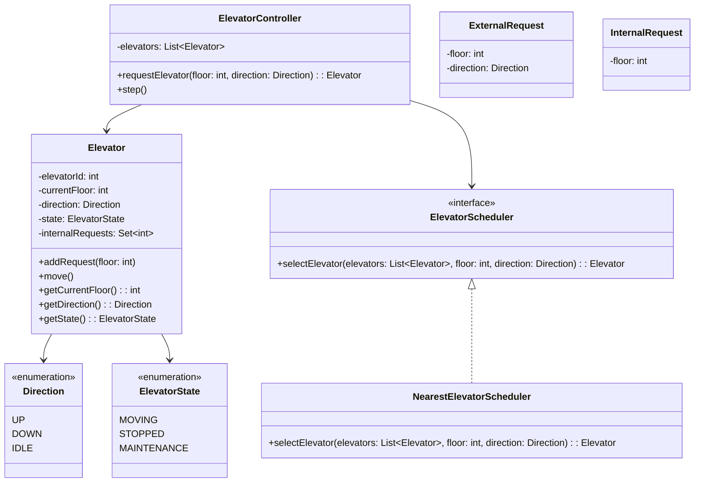

# LLD: Elevator System

## Requirements

### Functional Requirements
1. Multiple elevators in a building
2. Each elevator can go up or down
3. Users can request elevator from any floor (external request)
4. Users can select destination floor inside elevator (internal request)
5. Elevator moves in one direction, stops at requested floors
6. Elevator reverses direction when no more requests in current direction
7. Display current floor and direction for each elevator

### Non-Functional Requirements
- Efficient scheduling (minimize wait time)
- Handle concurrent requests
- Fair service to all floors

## Class Diagram



## Code Implementation

### Enums

```python
from enum import Enum
from typing import List, Set, Optional
from abc import ABC, abstractmethod
import threading

class Direction(Enum):
    UP = "UP"
    DOWN = "DOWN"
    IDLE = "IDLE"

class ElevatorState(Enum):
    MOVING = "MOVING"
    STOPPED = "STOPPED"
    DOORS_OPEN = "DOORS_OPEN"
    MAINTENANCE = "MAINTENANCE"
```

### Elevator

```python
class Elevator:
    def __init__(self, elevator_id: int, total_floors: int):
        self._elevator_id = elevator_id
        self._current_floor = 0  # Ground floor
        self._total_floors = total_floors
        self._direction = Direction.IDLE
        self._state = ElevatorState.STOPPED
        self._internal_requests: Set[int] = set()
        self._lock = threading.Lock()
    
    @property
    def elevator_id(self) -> int:
        return self._elevator_id
    
    @property
    def current_floor(self) -> int:
        return self._current_floor
    
    @property
    def direction(self) -> Direction:
        return self._direction
    
    @property
    def state(self) -> ElevatorState:
        return self._state
    
    def add_request(self, floor: int) -> None:
        """Add an internal request (destination floor)"""
        with self._lock:
            if 0 <= floor < self._total_floors:
                self._internal_requests.add(floor)
                if self._state == ElevatorState.STOPPED:
                    self._update_direction()
    
    def step(self) -> None:
        """Move elevator one step"""
        with self._lock:
            if self._state == ElevatorState.MAINTENANCE:
                return
            
            if not self._internal_requests:
                self._direction = Direction.IDLE
                self._state = ElevatorState.STOPPED
                return
            
            # Check if we should stop at current floor
            if self._current_floor in self._internal_requests:
                self._stop_at_floor()
                return
            
            # Move in current direction
            self._state = ElevatorState.MOVING
            if self._direction == Direction.UP:
                self._current_floor += 1
            elif self._direction == Direction.DOWN:
                self._current_floor -= 1
            
            # Check if we need to reverse direction
            self._update_direction()
    
    def _stop_at_floor(self) -> None:
        """Stop elevator and open doors"""
        self._internal_requests.discard(self._current_floor)
        self._state = ElevatorState.DOORS_OPEN
        # In real system, wait for doors to close
        self._state = ElevatorState.STOPPED
        self._update_direction()
    
    def _update_direction(self) -> None:
        """Update direction based on remaining requests"""
        if not self._internal_requests:
            self._direction = Direction.IDLE
            return
        
        if self._direction == Direction.UP:
            # Continue up if there are floors above
            if any(f > self._current_floor for f in self._internal_requests):
                self._direction = Direction.UP
            else:
                self._direction = Direction.DOWN
        elif self._direction == Direction.DOWN:
            # Continue down if there are floors below
            if any(f < self._current_floor for f in self._internal_requests):
                self._direction = Direction.DOWN
            else:
                self._direction = Direction.UP
        else:
            # IDLE - move towards nearest request
            nearest = min(self._internal_requests, 
                         key=lambda f: abs(f - self._current_floor))
            if nearest > self._current_floor:
                self._direction = Direction.UP
            else:
                self._direction = Direction.DOWN
    
    def distance_to(self, floor: int) -> int:
        """Calculate distance to a floor"""
        return abs(self._current_floor - floor)
    
    def is_moving_towards(self, floor: int) -> bool:
        """Check if elevator is moving towards a floor"""
        if self._direction == Direction.UP:
            return floor > self._current_floor
        elif self._direction == Direction.DOWN:
            return floor < self._current_floor
        return True  # IDLE - can go anywhere
```

### Elevator Scheduler

```python
class ElevatorScheduler(ABC):
    @abstractmethod
    def select_elevator(self, elevators: List[Elevator], 
                       floor: int, direction: Direction) -> Optional[Elevator]:
        pass

class NearestElevatorScheduler(ElevatorScheduler):
    """Selects the nearest idle elevator, or one moving towards the floor"""
    
    def select_elevator(self, elevators: List[Elevator],
                       floor: int, direction: Direction) -> Optional[Elevator]:
        best_elevator = None
        best_score = float('inf')
        
        for elevator in elevators:
            if elevator.state == ElevatorState.MAINTENANCE:
                continue
            
            score = self._calculate_score(elevator, floor, direction)
            if score < best_score:
                best_score = score
                best_elevator = elevator
        
        return best_elevator
    
    def _calculate_score(self, elevator: Elevator, 
                        floor: int, direction: Direction) -> int:
        distance = elevator.distance_to(floor)
        
        # Best case: elevator is idle
        if elevator.direction == Direction.IDLE:
            return distance
        
        # Good case: elevator is moving towards us
        if elevator.is_moving_towards(floor):
            return distance
        
        # Worst case: elevator is moving away
        return distance + elevator._total_floors  # Penalty
```

### Elevator Controller

```python
class ElevatorController:
    def __init__(self, num_elevators: int, total_floors: int):
        self._elevators = [
            Elevator(i, total_floors) for i in range(num_elevators)
        ]
        self._scheduler = NearestElevatorScheduler()
        self._total_floors = total_floors
        self._lock = threading.Lock()
    
    def request_elevator(self, floor: int, direction: Direction) -> Optional[Elevator]:
        """External request: call elevator to a floor"""
        with self._lock:
            if floor < 0 or floor >= self._total_floors:
                raise ValueError(f"Invalid floor: {floor}")
            
            elevator = self._scheduler.select_elevator(
                self._elevators, floor, direction
            )
            
            if elevator:
                elevator.add_request(floor)
            return elevator
    
    def select_floor(self, elevator_id: int, floor: int) -> None:
        """Internal request: select destination floor"""
        with self._lock:
            if elevator_id < 0 or elevator_id >= len(self._elevators):
                raise ValueError(f"Invalid elevator ID: {elevator_id}")
            
            self._elevators[elevator_id].add_request(floor)
    
    def step(self) -> None:
        """Advance all elevators one step"""
        for elevator in self._elevators:
            elevator.step()
    
    def get_status(self) -> List[dict]:
        """Get status of all elevators"""
        return [
            {
                "id": e.elevator_id,
                "floor": e.current_floor,
                "direction": e.direction.value,
                "state": e.state.value,
                "requests": list(e._internal_requests)
            }
            for e in self._elevators
        ]
```

### Usage

```python
# Create a building with 3 elevators and 10 floors
controller = ElevatorController(num_elevators=3, total_floors=10)

# User on floor 5 requests elevator going up
elevator = controller.request_elevator(5, Direction.UP)
print(f"Elevator {elevator.elevator_id} assigned")

# User selects floor 8
controller.select_floor(elevator.elevator_id, 8)

# Simulate elevator movement
for _ in range(20):
    controller.step()
    status = controller.get_status()
    for e in status:
        print(f"Elevator {e['id']}: Floor {e['floor']}, {e['direction']}")
```

## Design Patterns Used

| Pattern | Where | Why |
|---------|-------|-----|
| **Strategy** | ElevatorScheduler | Different scheduling algorithms |
| **State** | ElevatorState | Elevator behavior changes by state |
| **Observer** | Floor displays | Notify when elevator moves |

## SOLID Principles

| Principle | How Applied |
|-----------|-------------|
| **SRP** | Elevator handles movement, Scheduler handles assignment |
| **OCP** | New schedulers via interface, no Elevator modification |
| **LSP** | Any scheduler can replace NearestElevatorScheduler |
| **ISP** | Focused interfaces for scheduling |
| **DIP** | Controller depends on Scheduler abstraction |

## Edge Cases

1. **All elevators busy**: Queue the request
2. **Elevator at requested floor**: Open doors immediately
3. **Multiple requests same direction**: Batch stops
4. **Emergency stop**: Add emergency state
5. **Maintenance mode**: Exclude from scheduling

## Interview Questions

1. **Q: How would you optimize for minimum wait time?**
   A: Implement SCAN (elevator) algorithm - move in one direction, serve all requests, then reverse.

2. **Q: How would you handle peak hours?**
   A: Pre-position elevators at high-traffic floors, use predictive scheduling.

3. **Q: How would you handle 100 floors?**
   A: Express elevators for certain floor ranges, sky lobbies for transfers.

4. **Q: How would you handle priority requests?**
   A: Add priority to requests, implement priority queue in scheduler.

## Common Mistakes

- ❌ Not handling direction reversal properly
- ❌ Ignoring concurrent access to elevator state
- ❌ Not considering elevator capacity
- ❌ Scheduling algorithm is too simple (just nearest)

## Cross-References

- [Design Patterns](./design-patterns.md) — Strategy, State patterns
- [Concurrency Design](./concurrency-design.md) — Thread safety
- [State Pattern](./design-patterns.md#10-state) — Elevator state management
- [OOP Concepts](./oop-concepts.md)

