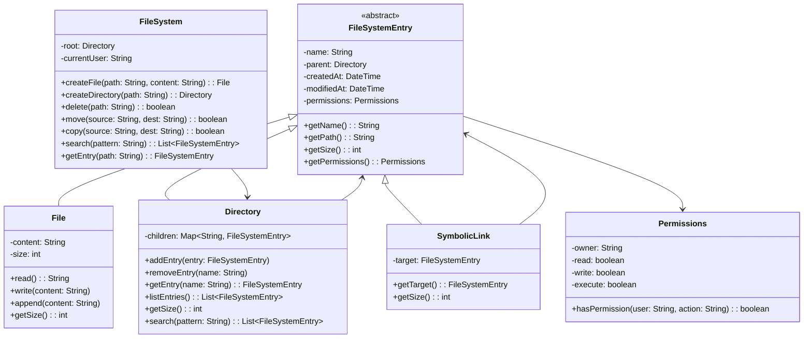

# LLD: File System Design

## Requirements

### Functional Requirements
1. Create, read, update, delete files and directories
2. Navigate directory hierarchy
3. Search for files by name, type, size
4. Support file permissions (read, write, execute)
5. Track file metadata (size, created/modified dates)
6. Support symbolic links
7. Calculate directory size

### Non-Functional Requirements
- Efficient traversal of large directories
- Thread-safe operations
- Support large number of files

## Class Diagram



## Code Implementation

```python
from abc import ABC, abstractmethod
from datetime import datetime
from typing import List, Dict, Optional
import threading

class Permissions:
    def __init__(self, owner: str, read: bool = True, write: bool = True, execute: bool = False):
        self.owner = owner
        self.read = read
        self.write = write
        self.execute = execute
    
    def has_permission(self, user: str, action: str) -> bool:
        if user == self.owner:
            if action == "read": return self.read
            if action == "write": return self.write
            if action == "execute": return self.execute
        return False  # Simplified: only owner has permissions
    
    def __str__(self):
        r = "r" if self.read else "-"
        w = "w" if self.write else "-"
        x = "x" if self.execute else "-"
        return f"{r}{w}{x}"

class FileSystemEntry(ABC):
    def __init__(self, name: str, owner: str):
        self._name = name
        self._parent: Optional['Directory'] = None
        self._created_at = datetime.now()
        self._modified_at = datetime.now()
        self._permissions = Permissions(owner)
        self._lock = threading.Lock()
    
    @property
    def name(self) -> str:
        return self._name
    
    @name.setter
    def name(self, value: str):
        with self._lock:
            self._name = value
            self._modified_at = datetime.now()
    
    @property
    def parent(self) -> Optional['Directory']:
        return self._parent
    
    @parent.setter
    def parent(self, value: 'Directory'):
        self._parent = value
    
    def get_path(self) -> str:
        if self._parent is None:
            return f"/{self._name}"
        parent_path = self._parent.get_path()
        if parent_path == "/":
            return f"/{self._name}"
        return f"{parent_path}/{self._name}"
    
    @abstractmethod
    def get_size(self) -> int:
        pass
    
    def get_permissions(self) -> Permissions:
        return self._permissions
```

### File, Directory, SymbolicLink

```python
class File(FileSystemEntry):
    def __init__(self, name: str, owner: str, content: str = ""):
        super().__init__(name, owner)
        self._content = content
    
    def read(self, user: str) -> str:
        if not self._permissions.has_permission(user, "read"):
            raise PermissionError(f"User {user} doesn't have read permission")
        return self._content
    
    def write(self, user: str, content: str):
        if not self._permissions.has_permission(user, "write"):
            raise PermissionError(f"User {user} doesn't have write permission")
        with self._lock:
            self._content = content
            self._modified_at = datetime.now()
    
    def append(self, user: str, content: str):
        if not self._permissions.has_permission(user, "write"):
            raise PermissionError(f"User {user} doesn't have write permission")
        with self._lock:
            self._content += content
            self._modified_at = datetime.now()
    
    def get_size(self) -> int:
        return len(self._content)

class Directory(FileSystemEntry):
    def __init__(self, name: str, owner: str):
        super().__init__(name, owner)
        self._children: Dict[str, FileSystemEntry] = {}
    
    def add_entry(self, entry: FileSystemEntry):
        with self._lock:
            if entry.name in self._children:
                raise ValueError(f"'{entry.name}' already exists in directory")
            entry.parent = self
            self._children[entry.name] = entry
            self._modified_at = datetime.now()
    
    def remove_entry(self, name: str) -> bool:
        with self._lock:
            if name in self._children:
                del self._children[name]
                self._modified_at = datetime.now()
                return True
            return False
    
    def get_entry(self, name: str) -> Optional[FileSystemEntry]:
        return self._children.get(name)
    
    def list_entries(self) -> List[FileSystemEntry]:
        return list(self._children.values())
    
    def get_size(self) -> int:
        return sum(entry.get_size() for entry in self._children.values())
    
    def search(self, pattern: str) -> List[FileSystemEntry]:
        results = []
        pattern_lower = pattern.lower()
        
        for entry in self._children.values():
            if pattern_lower in entry.name.lower():
                results.append(entry)
            if isinstance(entry, Directory):
                results.extend(entry.search(pattern))
        
        return results

class SymbolicLink(FileSystemEntry):
    def __init__(self, name: str, owner: str, target: FileSystemEntry):
        super().__init__(name, owner)
        self._target = target
    
    @property
    def target(self) -> FileSystemEntry:
        return self._target
    
    def get_size(self) -> int:
        return 0  # Symlinks have no size themselves
```

### FileSystem

```python
class FileSystem:
    def __init__(self, root_owner: str = "root"):
        self._root = Directory("/", root_owner)
        self._current_user = root_owner
        self._lock = threading.Lock()
    
    def _resolve_path(self, path: str) -> Optional[FileSystemEntry]:
        """Resolve a path to its FileSystemEntry"""
        if path == "/":
            return self._root
        
        parts = path.strip("/").split("/")
        current = self._root
        
        for part in parts:
            if not isinstance(current, Directory):
                return None
            current = current.get_entry(part)
            if current is None:
                return None
        
        return current
    
    def _resolve_parent(self, path: str) -> Optional[Directory]:
        """Resolve parent directory of a path"""
        parts = path.strip("/").split("/")
        parent_path = "/".join(parts[:-1])
        if not parent_path:
            return self._root
        parent = self._resolve_path(parent_path)
        if isinstance(parent, Directory):
            return parent
        return None
    
    def create_file(self, path: str, content: str = "") -> File:
        parent = self._resolve_parent(path)
        if not parent:
            raise ValueError("Parent directory not found")
        
        name = path.strip("/").split("/")[-1]
        file = File(name, self._current_user, content)
        parent.add_entry(file)
        return file
    
    def create_directory(self, path: str) -> Directory:
        parent = self._resolve_parent(path)
        if not parent:
            raise ValueError("Parent directory not found")
        
        name = path.strip("/").split("/")[-1]
        directory = Directory(name, self._current_user)
        parent.add_entry(directory)
        return directory
    
    def delete(self, path: str) -> bool:
        if path == "/":
            raise ValueError("Cannot delete root directory")
        
        parent = self._resolve_parent(path)
        if not parent:
            return False
        
        name = path.strip("/").split("/")[-1]
        return parent.remove_entry(name)
    
    def move(self, source: str, dest: str) -> bool:
        source_entry = self._resolve_path(source)
        if not source_entry:
            return False
        
        source_parent = self._resolve_parent(source)
        dest_parent = self._resolve_parent(dest)
        
        if not source_parent or not dest_parent:
            return False
        
        # Remove from source
        source_name = source.strip("/").split("/")[-1]
        source_parent.remove_entry(source_name)
        
        # Add to destination
        dest_name = dest.strip("/").split("/")[-1]
        source_entry.name = dest_name
        dest_parent.add_entry(source_entry)
        
        return True
    
    def copy(self, source: str, dest: str) -> bool:
        source_entry = self._resolve_path(source)
        if not source_entry:
            return False
        
        dest_parent = self._resolve_parent(dest)
        if not dest_parent:
            return False
        
        dest_name = dest.strip("/").split("/")[-1]
        
        if isinstance(source_entry, File):
            new_file = File(dest_name, self._current_user, source_entry.read(self._current_user))
            dest_parent.add_entry(new_file)
        elif isinstance(source_entry, Directory):
            new_dir = Directory(dest_name, self._current_user)
            dest_parent.add_entry(new_dir)
            # Recursively copy children
            for child in source_entry.list_entries():
                self.copy(child.get_path(), f"{dest}/{child.name}")
        
        return True
    
    def search(self, pattern: str) -> List[FileSystemEntry]:
        return self._root.search(pattern)
    
    def get_entry(self, path: str) -> Optional[FileSystemEntry]:
        return self._resolve_path(path)
    
    def list_directory(self, path: str) -> List[FileSystemEntry]:
        entry = self._resolve_path(path)
        if isinstance(entry, Directory):
            return entry.list_entries()
        return []
```

## Design Patterns Used

| Pattern | Where | Why |
|---------|-------|-----|
| **Composite** | Directory contains FileSystemEntry | Tree structure |
| **Visitor** | Search operations | Traverse without modifying |
| **Decorator** | SymbolicLink wraps entry | Add behavior |

## Edge Cases

1. **Circular symlinks**: Detect cycles in symlink resolution
2. **Concurrent modifications**: Thread-safe with locks
3. **Large directories**: Pagination for listing
4. **Path normalization**: Handle `.` and `..`
5. **Permission checks**: Validate before every operation

## Interview Questions

1. **Q: How would you implement file versioning?**
   A: Store versions as a list of snapshots in each File.

2. **Q: How would you handle disk quota?**
   A: Track usage per user, check before write operations.

3. **Q: How would you implement hard links?**
   A: Multiple directory entries pointing to same inode.

## Cross-References

- [Design Patterns](./design-patterns.md) — Composite, Visitor
- [OOP Concepts](./oop-concepts.md) — Inheritance, polymorphism
- [Concurrency Design](./concurrency-design.md) — Thread-safe operations
- [OS Filesystems](../../../os/filesystems/ext4.md)
- [Storage File Storage](../../../storage/file-storage.md)

