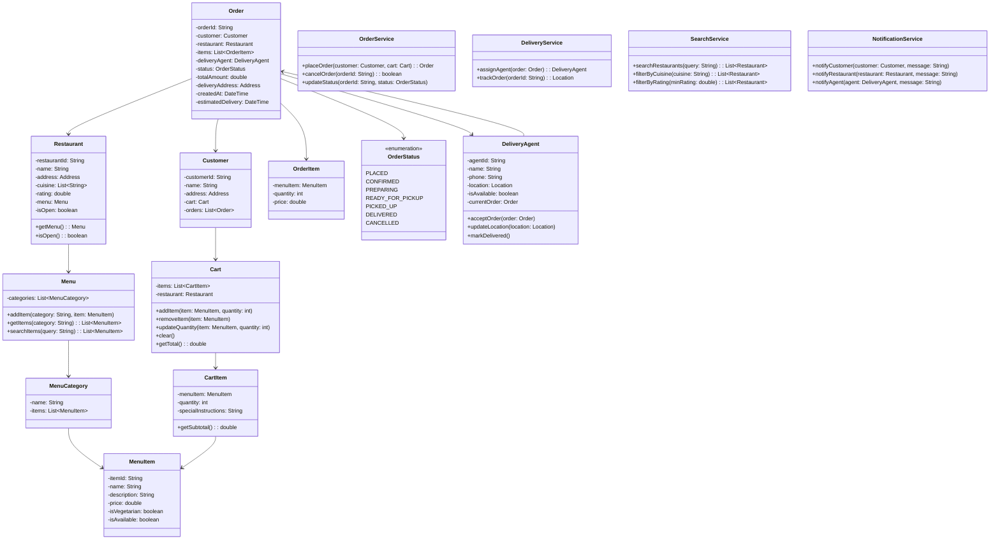

# LLD: Food Delivery App (Swiggy/Zomato)

## Requirements

### Functional Requirements
1. Browse restaurants and menus
2. Place food orders
3. Track order status (placed, preparing, picked up, delivered)
4. Assign delivery agents
5. Rate restaurants and delivery agents
6. Search restaurants by cuisine, rating, distance
7. Cart management

### Non-Functional Requirements
- Real-time order tracking
- Low latency search
- Handle concurrent orders

## Class Diagram



## Code Implementation

```python
from enum import Enum
from datetime import datetime, timedelta
from typing import List, Dict, Optional
from dataclasses import dataclass, field
import uuid
import threading

@dataclass
class Address:
    street: str
    city: str
    state: str
    zip_code: str
    latitude: float = 0.0
    longitude: float = 0.0

@dataclass
class MenuItem:
    item_id: str
    name: str
    description: str
    price: float
    is_vegetarian: bool = True
    is_available: bool = True

@dataclass
class MenuCategory:
    name: str
    items: List[MenuItem] = field(default_factory=list)

class Menu:
    def __init__(self):
        self._categories: Dict[str, MenuCategory] = {}
    
    def add_category(self, name: str):
        if name not in self._categories:
            self._categories[name] = MenuCategory(name)
    
    def add_item(self, category: str, item: MenuItem):
        if category not in self._categories:
            self.add_category(category)
        self._categories[category].items.append(item)
    
    def get_items(self, category: str) -> List[MenuItem]:
        return self._categories.get(category, MenuCategory("")).items
    
    def search_items(self, query: str) -> List[MenuItem]:
        results = []
        query_lower = query.lower()
        for category in self._categories.values():
            for item in category.items:
                if query_lower in item.name.lower():
                    results.append(item)
        return results

class Restaurant:
    def __init__(self, restaurant_id: str, name: str, address: Address, 
                 cuisine: List[str]):
        self.restaurant_id = restaurant_id
        self.name = name
        self.address = address
        self.cuisine = cuisine
        self.rating = 0.0
        self.rating_count = 0
        self.menu = Menu()
        self._is_open = True
        self._lock = threading.Lock()
    
    def is_open(self) -> bool:
        return self._is_open
    
    def set_open(self, is_open: bool):
        with self._lock:
            self._is_open = is_open
    
    def update_rating(self, new_rating: int):
        with self._lock:
            total = self.rating * self.rating_count
            self.rating_count += 1
            self.rating = (total + new_rating) / self.rating_count

class CartItem:
    def __init__(self, menu_item: MenuItem, quantity: int, special_instructions: str = ""):
        self.menu_item = menu_item
        self.quantity = quantity
        self.special_instructions = special_instructions
    
    def get_subtotal(self) -> float:
        return self.menu_item.price * self.quantity

class Cart:
    def __init__(self):
        self._items: Dict[str, CartItem] = {}  # item_id -> CartItem
        self._restaurant: Optional[Restaurant] = None
        self._lock = threading.Lock()
    
    @property
    def restaurant(self) -> Optional[Restaurant]:
        return self._restaurant
    
    def add_item(self, restaurant: Restaurant, menu_item: MenuItem, 
                quantity: int = 1, special_instructions: str = ""):
        with self._lock:
            # Clear cart if adding from different restaurant
            if self._restaurant and self._restaurant.restaurant_id != restaurant.restaurant_id:
                self._items.clear()
            
            self._restaurant = restaurant
            
            if menu_item.item_id in self._items:
                self._items[menu_item.item_id].quantity += quantity
            else:
                self._items[menu_item.item_id] = CartItem(
                    menu_item, quantity, special_instructions
                )
    
    def remove_item(self, item_id: str):
        with self._lock:
            self._items.pop(item_id, None)
            if not self._items:
                self._restaurant = None
    
    def update_quantity(self, item_id: str, quantity: int):
        with self._lock:
            if item_id in self._items:
                if quantity <= 0:
                    del self._items[item_id]
                else:
                    self._items[item_id].quantity = quantity
    
    def clear(self):
        with self._lock:
            self._items.clear()
            self._restaurant = None
    
    def get_total(self) -> float:
        return sum(item.get_subtotal() for item in self._items.values())
    
    def get_items(self) -> List[CartItem]:
        return list(self._items.values())
```

### Orders and Delivery

```python
class OrderStatus(Enum):
    PLACED = "PLACED"
    CONFIRMED = "CONFIRMED"
    PREPARING = "PREPARING"
    READY_FOR_PICKUP = "READY_FOR_PICKUP"
    PICKED_UP = "PICKED_UP"
    DELIVERED = "DELIVERED"
    CANCELLED = "CANCELLED"

@dataclass
class OrderItem:
    menu_item: MenuItem
    quantity: int
    price: float

class Order:
    def __init__(self, customer: 'Customer', restaurant: Restaurant, 
                 items: List[OrderItem], delivery_address: Address, total: float):
        self.order_id = str(uuid.uuid4())[:8]
        self.customer = customer
        self.restaurant = restaurant
        self.items = items
        self.delivery_agent: Optional['DeliveryAgent'] = None
        self.status = OrderStatus.PLACED
        self.total_amount = total
        self.delivery_address = delivery_address
        self.created_at = datetime.now()
        self.estimated_delivery = datetime.now() + timedelta(minutes=45)
        self._lock = threading.Lock()
    
    def update_status(self, new_status: OrderStatus):
        with self._lock:
            valid_transitions = {
                OrderStatus.PLACED: [OrderStatus.CONFIRMED, OrderStatus.CANCELLED],
                OrderStatus.CONFIRMED: [OrderStatus.PREPARING, OrderStatus.CANCELLED],
                OrderStatus.PREPARING: [OrderStatus.READY_FOR_PICKUP],
                OrderStatus.READY_FOR_PICKUP: [OrderStatus.PICKED_UP],
                OrderStatus.PICKED_UP: [OrderStatus.DELIVERED],
            }
            
            allowed = valid_transitions.get(self.status, [])
            if new_status not in allowed:
                raise ValueError(f"Cannot transition from {self.status} to {new_status}")
            self.status = new_status

class DeliveryAgent:
    def __init__(self, agent_id: str, name: str, phone: str):
        self.agent_id = agent_id
        self.name = name
        self.phone = phone
        self.location: Optional[Address] = None
        self.is_available = True
        self.current_order: Optional[Order] = None
        self._lock = threading.Lock()
    
    def accept_order(self, order: Order):
        with self._lock:
            if not self.is_available:
                raise ValueError("Agent is not available")
            self.current_order = order
            self.is_available = False
    
    def mark_delivered(self):
        with self._lock:
            self.current_order = None
            self.is_available = True

class Customer:
    def __init__(self, customer_id: str, name: str, address: Address):
        self.customer_id = customer_id
        self.name = name
        self.address = address
        self.cart = Cart()
        self.orders: List[str] = []
```

### Services

```python
class OrderService:
    def __init__(self):
        self._orders: Dict[str, Order] = {}
        self._lock = threading.Lock()
    
    def place_order(self, customer: Customer, delivery_address: Address) -> Order:
        cart = customer.cart
        if not cart.restaurant or not cart.get_items():
            raise ValueError("Cart is empty")
        
        # Create order items
        order_items = []
        for cart_item in cart.get_items():
            order_items.append(OrderItem(
                menu_item=cart_item.menu_item,
                quantity=cart_item.quantity,
                price=cart_item.get_subtotal()
            ))
        
        order = Order(
            customer=customer,
            restaurant=cart.restaurant,
            items=order_items,
            delivery_address=delivery_address,
            total=cart.get_total()
        )
        
        with self._lock:
            self._orders[order.order_id] = order
            customer.orders.append(order.order_id)
        
        # Clear cart after order
        cart.clear()
        
        return order
    
    def cancel_order(self, order_id: str) -> bool:
        order = self._orders.get(order_id)
        if not order:
            return False
        
        try:
            order.update_status(OrderStatus.CANCELLED)
            return True
        except ValueError:
            return False
    
    def update_status(self, order_id: str, status: OrderStatus):
        order = self._orders.get(order_id)
        if order:
            order.update_status(status)
    
    def get_order(self, order_id: str) -> Optional[Order]:
        return self._orders.get(order_id)

class DeliveryService:
    def __init__(self):
        self._agents: Dict[str, DeliveryAgent] = {}
        self._lock = threading.Lock()
    
    def register_agent(self, agent: DeliveryAgent):
        self._agents[agent.agent_id] = agent
    
    def assign_agent(self, order: Order) -> Optional[DeliveryAgent]:
        with self._lock:
            available_agents = [
                agent for agent in self._agents.values()
                if agent.is_available
            ]
            
            if not available_agents:
                return None
            
            # Simple assignment: pick first available
            agent = available_agents[0]
            agent.accept_order(order)
            order.delivery_agent = agent
            return agent

class SearchService:
    def __init__(self):
        self._restaurants: Dict[str, Restaurant] = {}
    
    def add_restaurant(self, restaurant: Restaurant):
        self._restaurants[restaurant.restaurant_id] = restaurant
    
    def search_restaurants(self, query: str) -> List[Restaurant]:
        results = []
        query_lower = query.lower()
        for restaurant in self._restaurants.values():
            if (query_lower in restaurant.name.lower() or
                any(query_lower in c.lower() for c in restaurant.cuisine)):
                results.append(restaurant)
        return results
    
    def filter_by_cuisine(self, cuisine: str) -> List[Restaurant]:
        return [
            r for r in self._restaurants.values()
            if cuisine.lower() in [c.lower() for c in r.cuisine]
        ]
    
    def filter_by_rating(self, min_rating: float) -> List[Restaurant]:
        return [
            r for r in self._restaurants.values()
            if r.rating >= min_rating
        ]

class FoodDeliverySystem:
    def __init__(self):
        self.order_service = OrderService()
        self.delivery_service = DeliveryService()
        self.search_service = SearchService()
        self._customers: Dict[str, Customer] = {}
    
    def register_customer(self, name: str, address: Address) -> Customer:
        customer_id = str(uuid.uuid4())[:8]
        customer = Customer(customer_id, name, address)
        self._customers[customer_id] = customer
        return customer
    
    def add_restaurant(self, restaurant: Restaurant):
        self.search_service.add_restaurant(restaurant)
    
    def place_order(self, customer_id: str, delivery_address: Address) -> Order:
        customer = self._customers[customer_id]
        order = self.order_service.place_order(customer, delivery_address)
        
        # Assign delivery agent
        agent = self.delivery_service.assign_agent(order)
        if agent:
            order.update_status(OrderStatus.CONFIRMED)
        
        return order
```

## Design Patterns Used

| Pattern | Where | Why |
|---------|-------|-----|
| **State** | Order status | Status-driven behavior |
| **Strategy** | Search/ranking | Different algorithms |
| **Observer** | Notifications | Event-driven updates |
| **Service Layer** | Business logic | Clean separation |

## Edge Cases

1. **Restaurant closes after order**: Notify customer, cancel order
2. **Item unavailable**: Suggest alternatives
3. **No delivery agents**: Queue order, notify when available
4. **Cart from multiple restaurants**: Clear cart on restaurant change
5. **Order cancellation timing**: Different policies based on status

## Interview Questions

1. **Q: How would you implement real-time tracking?**
   A: WebSocket connection, periodic location updates from delivery agent.

2. **Q: How would you handle surge pricing?**
   A: Calculate demand/supply ratio per area, apply multiplier.

3. **Q: How would you implement recommendations?**
   A: Collaborative filtering based on order history, popular items.

## Cross-References

- [Design Patterns](./design-patterns.md) — State, Strategy, Observer
- [HLD: Messaging Systems](../hld/messaging-systems.md) — Async notifications
- [Concurrency Design](./concurrency-design.md) — Thread-safe operations
