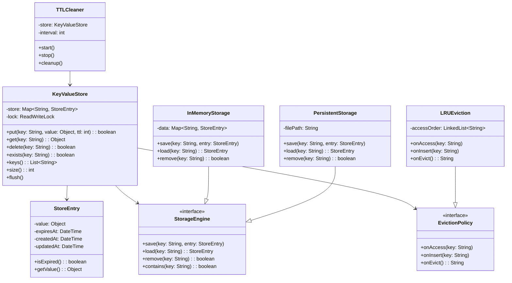

# LLD: Key-Value Store

## Requirements

### Functional Requirements
1. `put(key, value)` — Store a key-value pair
2. `get(key)` — Retrieve value by key
3. `delete(key)` — Remove a key-value pair
4. `exists(key)` — Check if key exists
5. Support for TTL (Time-To-Live) on keys
6. Support for different data types (string, list, hash, set)

### Non-Functional Requirements
- Thread-safe operations
- O(1) average time for get/put/delete
- Memory efficient
- Support for persistence (optional)

## Class Diagram



## Code Implementation

### Core Classes

```python
from abc import ABC, abstractmethod
from datetime import datetime, timedelta
from typing import Any, Optional, List, Dict, Set
from collections import OrderedDict
import threading
import json
import time

class StoreEntry:
    """Represents a single key-value entry with metadata"""
    
    def __init__(self, value: Any, ttl_seconds: Optional[int] = None):
        self.value = value
        self.created_at = datetime.now()
        self.updated_at = datetime.now()
        self.expires_at = (
            datetime.now() + timedelta(seconds=ttl_seconds) 
            if ttl_seconds else None
        )
    
    def is_expired(self) -> bool:
        if self.expires_at is None:
            return False
        return datetime.now() > self.expires_at
    
    def update(self, value: Any, ttl_seconds: Optional[int] = None):
        self.value = value
        self.updated_at = datetime.now()
        if ttl_seconds is not None:
            self.expires_at = datetime.now() + timedelta(seconds=ttl_seconds)
```

### Storage Engines

```python
class StorageEngine(ABC):
    """Abstract storage engine interface"""
    
    @abstractmethod
    def save(self, key: str, entry: StoreEntry):
        pass
    
    @abstractmethod
    def load(self, key: str) -> Optional[StoreEntry]:
        pass
    
    @abstractmethod
    def remove(self, key: str) -> bool:
        pass
    
    @abstractmethod
    def contains(self, key: str) -> bool:
        pass
    
    @abstractmethod
    def keys(self) -> List[str]:
        pass
    
    @abstractmethod
    def size(self) -> int:
        pass
    
    @abstractmethod
    def clear(self):
        pass

class InMemoryStorage(StorageEngine):
    """In-memory storage using dictionary"""
    
    def __init__(self):
        self._data: Dict[str, StoreEntry] = {}
        self._lock = threading.RLock()
    
    def save(self, key: str, entry: StoreEntry):
        with self._lock:
            self._data[key] = entry
    
    def load(self, key: str) -> Optional[StoreEntry]:
        with self._lock:
            return self._data.get(key)
    
    def remove(self, key: str) -> bool:
        with self._lock:
            if key in self._data:
                del self._data[key]
                return True
            return False
    
    def contains(self, key: str) -> bool:
        with self._lock:
            return key in self._data
    
    def keys(self) -> List[str]:
        with self._lock:
            return list(self._data.keys())
    
    def size(self) -> int:
        with self._lock:
            return len(self._data)
    
    def clear(self):
        with self._lock:
            self._data.clear()

class PersistentStorage(StorageEngine):
    """File-based persistent storage"""
    
    def __init__(self, file_path: str):
        self._file_path = file_path
        self._data: Dict[str, StoreEntry] = {}
        self._lock = threading.RLock()
        self._load_from_file()
    
    def _load_from_file(self):
        try:
            with open(self._file_path, 'r') as f:
                data = json.load(f)
                for key, entry_data in data.items():
                    entry = StoreEntry(entry_data['value'])
                    entry.created_at = datetime.fromisoformat(entry_data['created_at'])
                    entry.updated_at = datetime.fromisoformat(entry_data['updated_at'])
                    if entry_data.get('expires_at'):
                        entry.expires_at = datetime.fromisoformat(entry_data['expires_at'])
                    self._data[key] = entry
        except FileNotFoundError:
            pass
    
    def _save_to_file(self):
        data = {}
        for key, entry in self._data.items():
            data[key] = {
                'value': entry.value,
                'created_at': entry.created_at.isoformat(),
                'updated_at': entry.updated_at.isoformat(),
                'expires_at': entry.expires_at.isoformat() if entry.expires_at else None
            }
        with open(self._file_path, 'w') as f:
            json.dump(data, f, indent=2)
    
    def save(self, key: str, entry: StoreEntry):
        with self._lock:
            self._data[key] = entry
            self._save_to_file()
    
    def load(self, key: str) -> Optional[StoreEntry]:
        with self._lock:
            return self._data.get(key)
    
    def remove(self, key: str) -> bool:
        with self._lock:
            if key in self._data:
                del self._data[key]
                self._save_to_file()
                return True
            return False
    
    def contains(self, key: str) -> bool:
        with self._lock:
            return key in self._data
    
    def keys(self) -> List[str]:
        with self._lock:
            return list(self._data.keys())
    
    def size(self) -> int:
        with self._lock:
            return len(self._data)
    
    def clear(self):
        with self._lock:
            self._data.clear()
            self._save_to_file()
```

### Eviction Policy

```python
class EvictionPolicy(ABC):
    """Abstract eviction policy"""
    
    @abstractmethod
    def on_access(self, key: str):
        pass
    
    @abstractmethod
    def on_insert(self, key: str):
        pass
    
    @abstractmethod
    def on_evict(self) -> Optional[str]:
        pass
    
    @abstractmethod
    def on_remove(self, key: str):
        pass

class LRUEviction(EvictionPolicy):
    """LRU eviction using OrderedDict"""
    
    def __init__(self):
        self._access_order = OrderedDict()
        self._lock = threading.Lock()
    
    def on_access(self, key: str):
        with self._lock:
            if key in self._access_order:
                self._access_order.move_to_end(key)
    
    def on_insert(self, key: str):
        with self._lock:
            self._access_order[key] = None
    
    def on_evict(self) -> Optional[str]:
        with self._lock:
            if self._access_order:
                key, _ = self._access_order.popitem(last=False)
                return key
            return None
    
    def on_remove(self, key: str):
        with self._lock:
            self._access_order.pop(key, None)

class LFUEviction(EvictionPolicy):
    """LFU eviction"""
    
    def __init__(self):
        self._freq: Dict[str, int] = {}
        self._freq_to_keys: Dict[int, OrderedDict] = {}
        self._min_freq = 0
        self._lock = threading.Lock()
    
    def on_access(self, key: str):
        with self._lock:
            if key in self._freq:
                self._update_freq(key)
    
    def on_insert(self, key: str):
        with self._lock:
            self._freq[key] = 1
            if 1 not in self._freq_to_keys:
                self._freq_to_keys[1] = OrderedDict()
            self._freq_to_keys[1][key] = None
            self._min_freq = 1
    
    def on_evict(self) -> Optional[str]:
        with self._lock:
            if not self._freq_to_keys.get(self._min_freq):
                return None
            key, _ = self._freq_to_keys[self._min_freq].popitem(last=False)
            del self._freq[key]
            return key
    
    def on_remove(self, key: str):
        with self._lock:
            if key in self._freq:
                freq = self._freq[key]
                del self._freq[key]
                if freq in self._freq_to_keys:
                    self._freq_to_keys[freq].pop(key, None)
    
    def _update_freq(self, key: str):
        freq = self._freq[key]
        self._freq_to_keys[freq].pop(key, None)
        if not self._freq_to_keys[freq]:
            del self._freq_to_keys[freq]
            if self._min_freq == freq:
                self._min_freq += 1
        
        new_freq = freq + 1
        self._freq[key] = new_freq
        if new_freq not in self._freq_to_keys:
            self._freq_to_keys[new_freq] = OrderedDict()
        self._freq_to_keys[new_freq][key] = None
```

### TTL Cleaner

```python
class TTLCleaner:
    """Background thread to clean expired keys"""
    
    def __init__(self, store: 'KeyValueStore', interval: float = 60.0):
        self._store = store
        self._interval = interval
        self._running = False
        self._thread: Optional[threading.Thread] = None
    
    def start(self):
        self._running = True
        self._thread = threading.Thread(target=self._run, daemon=True)
        self._thread.start()
    
    def stop(self):
        self._running = False
        if self._thread:
            self._thread.join()
    
    def _run(self):
        while self._running:
            self.cleanup()
            time.sleep(self._interval)
    
    def cleanup(self):
        expired_keys = []
        for key in self._store.keys():
            entry = self._store._storage.load(key)
            if entry and entry.is_expired():
                expired_keys.append(key)
        
        for key in expired_keys:
            self._store.delete(key)
```

### Main Key-Value Store

```python
class KeyValueStore:
    """
    Thread-safe Key-Value store with TTL and eviction support.
    """
    
    def __init__(self, capacity: int = 10000, 
                 storage_engine: StorageEngine = None,
                 eviction_policy: EvictionPolicy = None):
        self._capacity = capacity
        self._storage = storage_engine or InMemoryStorage()
        self._eviction = eviction_policy or LRUEviction()
        self._ttl_cleaner = TTLCleaner(self, interval=60.0)
        self._lock = threading.RLock()
    
    def start(self):
        """Start background TTL cleaner"""
        self._ttl_cleaner.start()
    
    def stop(self):
        """Stop background TTL cleaner"""
        self._ttl_cleaner.stop()
    
    def put(self, key: str, value: Any, ttl_seconds: Optional[int] = None) -> bool:
        """Store a key-value pair with optional TTL"""
        with self._lock:
            # Check if key exists (update)
            if self._storage.contains(key):
                entry = self._storage.load(key)
                if entry and not entry.is_expired():
                    entry.update(value, ttl_seconds)
                    self._storage.save(key, entry)
                    self._eviction.on_access(key)
                    return True
            
            # Check capacity and evict if needed
            if self._storage.size() >= self._capacity:
                evict_key = self._eviction.on_evict()
                if evict_key:
                    self._storage.remove(evict_key)
                    self._eviction.on_remove(evict_key)
            
            # Insert new entry
            entry = StoreEntry(value, ttl_seconds)
            self._storage.save(key, entry)
            self._eviction.on_insert(key)
            return True
    
    def get(self, key: str) -> Optional[Any]:
        """Retrieve value by key"""
        with self._lock:
            entry = self._storage.load(key)
            if entry is None:
                return None
            
            # Check if expired
            if entry.is_expired():
                self.delete(key)
                return None
            
            self._eviction.on_access(key)
            return entry.value
    
    def delete(self, key: str) -> bool:
        """Delete a key-value pair"""
        with self._lock:
            if self._storage.contains(key):
                self._storage.remove(key)
                self._eviction.on_remove(key)
                return True
            return False
    
    def exists(self, key: str) -> bool:
        """Check if key exists and is not expired"""
        with self._lock:
            entry = self._storage.load(key)
            if entry is None:
                return False
            if entry.is_expired():
                self.delete(key)
                return False
            return True
    
    def keys(self) -> List[str]:
        """Get all non-expired keys"""
        with self._lock:
            result = []
            for key in self._storage.keys():
                entry = self._storage.load(key)
                if entry and not entry.is_expired():
                    result.append(key)
            return result
    
    def size(self) -> int:
        """Get number of non-expired entries"""
        return len(self.keys())
    
    def flush(self) -> None:
        """Remove all entries"""
        with self._lock:
            self._storage.clear()
            # Reset eviction policy
            self._eviction = LRUEviction()
    
    def get_with_metadata(self, key: str) -> Optional[Dict]:
        """Get value with metadata (TTL remaining, created_at, etc.)"""
        with self._lock:
            entry = self._storage.load(key)
            if entry is None or entry.is_expired():
                return None
            
            ttl_remaining = None
            if entry.expires_at:
                ttl_remaining = (entry.expires_at - datetime.now()).total_seconds()
            
            return {
                "value": entry.value,
                "created_at": entry.created_at,
                "updated_at": entry.updated_at,
                "ttl_remaining": ttl_remaining
            }
```

## Usage Example

```python
# Basic usage
store = KeyValueStore(capacity=1000)
store.start()

# Put/Get
store.put("user:1", {"name": "Alice", "age": 30})
store.put("user:2", {"name": "Bob", "age": 25})
print(store.get("user:1"))  # {'name': 'Alice', 'age': 30}

# TTL
store.put("session:abc", "active", ttl_seconds=300)
print(store.exists("session:abc"))  # True

# Delete
store.delete("user:2")
print(store.get("user:2"))  # None

# Metadata
print(store.get_with_metadata("user:1"))
# {'value': {...}, 'created_at': ..., 'updated_at': ..., 'ttl_remaining': None}

# Cleanup
store.stop()
```

## Design Patterns Used

| Pattern | Where | Why |
|---------|-------|-----|
| **Strategy** | StorageEngine, EvictionPolicy | Pluggable implementations |
| **Template Method** | StorageEngine interface | Define algorithm skeleton |
| **Observer** | TTLCleaner | Background monitoring |

## Complexity Analysis

| Operation | Average | Worst Case |
|-----------|---------|------------|
| `put` | O(1) | O(n) if eviction |
| `get` | O(1) | O(1) |
| `delete` | O(1) | O(1) |
| `exists` | O(1) | O(1) |
| Space | O(n) | O(n) |

## Edge Cases

1. **TTL expiration**: Lazy deletion on access + background cleanup
2. **Capacity overflow**: Eviction before insert
3. **Concurrent access**: Read-write locks
4. **Null values**: Allow null values (different from missing key)
5. **Key collision**: Hash map handles naturally

## Interview Questions

1. **Q: How would you make this distributed?**
   A: Consistent hashing across nodes, replication for fault tolerance.

2. **Q: How would you implement persistence?**
   A: Write-ahead log (WAL) + periodic snapshots.

3. **Q: How would you handle hot keys?**
   A: Replicate hot keys across multiple nodes, local caching.

4. **Q: How would you implement transactions?**
   A: Optimistic locking with version numbers, or pessimistic locking.

## Common Mistakes

- ❌ Not handling TTL expiration properly
- ❌ Race conditions in concurrent access
- ❌ Memory leaks from expired but not cleaned entries
- ❌ O(n) eviction when capacity is reached

## Cross-References

- [Design Patterns](./design-patterns.md) — Strategy pattern
- [Concurrency Design](./concurrency-design.md) — Thread-safe implementation
- [HLD: Caching Strategy](../hld/caching-strategy.md) — Caching concepts
- [LRU Cache](./cache-lld.md) — Eviction implementation
- [HLD: Database Design](../hld/database-design.md) — Storage engines
