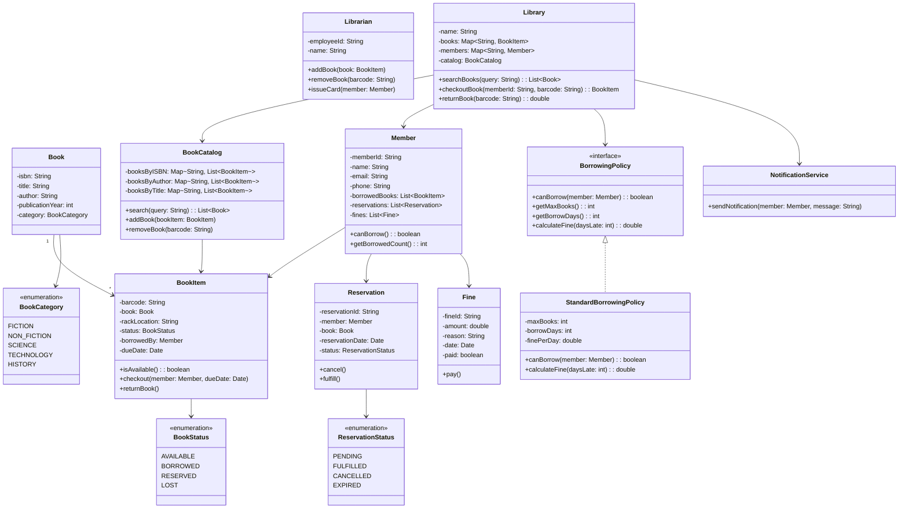

# LLD: Library Management System

## Requirements

### Functional Requirements
1. Add/remove books from the library catalog
2. Members can borrow and return books
3. Track book availability (copies)
4. Search books by title, author, ISBN
5. Set borrowing limits per member (max books, duration)
6. Calculate and track fines for late returns
7. Reserve books that are currently unavailable
8. Notify members when reserved books become available

### Non-Functional Requirements
- Handle concurrent borrow/return operations
- Scalable to millions of books and members
- Audit trail for all transactions

## Class Diagram



## Code Implementation

### Core Classes

```python
from abc import ABC, abstractmethod
from enum import Enum
from datetime import datetime, timedelta
from typing import List, Dict, Optional
import uuid
import threading

class BookStatus(Enum):
    AVAILABLE = "AVAILABLE"
    BORROWED = "BORROWED"
    RESERVED = "RESERVED"
    LOST = "LOST"

class BookCategory(Enum):
    FICTION = "FICTION"
    NON_FICTION = "NON_FICTION"
    SCIENCE = "SCIENCE"
    TECHNOLOGY = "TECHNOLOGY"
    HISTORY = "HISTORY"

class Book:
    def __init__(self, isbn: str, title: str, author: str, 
                 publication_year: int, category: BookCategory):
        self._isbn = isbn
        self._title = title
        self._author = author
        self._publication_year = publication_year
        self._category = category
    
    @property
    def isbn(self) -> str:
        return self._isbn
    
    @property
    def title(self) -> str:
        return self._title
    
    @property
    def author(self) -> str:
        return self._author

class BookItem:
    def __init__(self, barcode: str, book: Book, rack_location: str):
        self._barcode = barcode
        self._book = book
        self._rack_location = rack_location
        self._status = BookStatus.AVAILABLE
        self._borrowed_by: Optional['Member'] = None
        self._due_date: Optional[datetime] = None
    
    @property
    def barcode(self) -> str:
        return self._barcode
    
    @property
    def book(self) -> Book:
        return self._book
    
    @property
    def status(self) -> BookStatus:
        return self._status
    
    def is_available(self) -> bool:
        return self._status == BookStatus.AVAILABLE
    
    def checkout(self, member: 'Member', due_date: datetime):
        if not self.is_available():
            raise ValueError("Book is not available")
        self._status = BookStatus.BORROWED
        self._borrowed_by = member
        self._due_date = due_date
    
    def return_book(self) -> float:
        if self._status != BookStatus.BORROWED:
            raise ValueError("Book is not borrowed")
        
        fine = 0.0
        if self._due_date and datetime.now() > self._due_date:
            days_late = (datetime.now() - self._due_date).days
            fine = days_late * 0.50  # $0.50 per day
        
        self._status = BookStatus.AVAILABLE
        self._borrowed_by = None
        self._due_date = None
        return fine
```

### Member and Borrowing Policy

```python
class Member:
    def __init__(self, member_id: str, name: str, email: str, phone: str):
        self._member_id = member_id
        self._name = name
        self._email = email
        self._phone = phone
        self._borrowed_books: List[BookItem] = []
        self._fines: List[float] = []
        self._reservations: List['Reservation'] = []
    
    @property
    def member_id(self) -> str:
        return self._member_id
    
    @property
    def name(self) -> str:
        return self._name
    
    def get_borrowed_count(self) -> int:
        return len(self._borrowed_books)
    
    def add_borrowed_book(self, book_item: BookItem):
        self._borrowed_books.append(book_item)
    
    def remove_borrowed_book(self, book_item: BookItem):
        self._borrowed_books.remove(book_item)
    
    def can_borrow(self, policy: 'BorrowingPolicy') -> bool:
        return policy.can_borrow(self)

class BorrowingPolicy(ABC):
    @abstractmethod
    def can_borrow(self, member: Member) -> bool:
        pass
    
    @abstractmethod
    def get_max_books(self) -> int:
        pass
    
    @abstractmethod
    def get_borrow_days(self) -> int:
        pass
    
    @abstractmethod
    def calculate_fine(self, days_late: int) -> float:
        pass

class StandardBorrowingPolicy(BorrowingPolicy):
    def __init__(self, max_books: int = 5, borrow_days: int = 14, 
                 fine_per_day: float = 0.50):
        self._max_books = max_books
        self._borrow_days = borrow_days
        self._fine_per_day = fine_per_day
    
    def can_borrow(self, member: Member) -> bool:
        return member.get_borrowed_count() < self._max_books
    
    def get_max_books(self) -> int:
        return self._max_books
    
    def get_borrow_days(self) -> int:
        return self._borrow_days
    
    def calculate_fine(self, days_late: int) -> float:
        return days_late * self._fine_per_day
```

### Reservation System

```python
class ReservationStatus(Enum):
    PENDING = "PENDING"
    FULFILLED = "FULFILLED"
    CANCELLED = "CANCELLED"
    EXPIRED = "EXPIRED"

class Reservation:
    def __init__(self, member: Member, book: Book):
        self._reservation_id = str(uuid.uuid4())[:8]
        self._member = member
        self._book = book
        self._reservation_date = datetime.now()
        self._status = ReservationStatus.PENDING
    
    @property
    def reservation_id(self) -> str:
        return self._reservation_id
    
    @property
    def member(self) -> Member:
        return self._member
    
    @property
    def book(self) -> Book:
        return self._book
    
    def cancel(self):
        if self._status == ReservationStatus.PENDING:
            self._status = ReservationStatus.CANCELLED
    
    def fulfill(self):
        if self._status == ReservationStatus.PENDING:
            self._status = ReservationStatus.FULFILLED
```

### Library (Main Class)

```python
class NotificationService:
    def send_notification(self, member: Member, message: str):
        print(f"Notification to {member.name}: {message}")

class BookCatalog:
    def __init__(self):
        self._books_by_isbn: Dict[str, List[BookItem]] = {}
        self._books_by_author: Dict[str, List[BookItem]] = {}
        self._lock = threading.Lock()
    
    def add_book(self, book_item: BookItem):
        with self._lock:
            isbn = book_item.book.isbn
            author = book_item.book.author
            
            if isbn not in self._books_by_isbn:
                self._books_by_isbn[isbn] = []
            self._books_by_isbn[isbn].append(book_item)
            
            if author not in self._books_by_author:
                self._books_by_author[author] = []
            self._books_by_author[author].append(book_item)
    
    def search_by_isbn(self, isbn: str) -> List[BookItem]:
        return self._books_by_isbn.get(isbn, [])
    
    def search_by_author(self, author: str) -> List[BookItem]:
        return self._books_by_author.get(author, [])

class Library:
    def __init__(self, name: str):
        self._name = name
        self._books: Dict[str, BookItem] = {}  # barcode -> BookItem
        self._members: Dict[str, Member] = {}
        self._catalog = BookCatalog()
        self._policy = StandardBorrowingPolicy()
        self._notification_service = NotificationService()
        self._reservations: Dict[str, List[Reservation]] = {}  # isbn -> reservations
        self._lock = threading.Lock()
    
    def add_book(self, book_item: BookItem):
        with self._lock:
            self._books[book_item.barcode] = book_item
            self._catalog.add_book(book_item)
    
    def register_member(self, member: Member):
        with self._lock:
            self._members[member.member_id] = member
    
    def checkout_book(self, member_id: str, barcode: str) -> BookItem:
        with self._lock:
            member = self._members.get(member_id)
            if not member:
                raise ValueError(f"Member {member_id} not found")
            
            book_item = self._books.get(barcode)
            if not book_item:
                raise ValueError(f"Book {barcode} not found")
            
            if not book_item.is_available():
                raise ValueError("Book is not available")
            
            if not member.can_borrow(self._policy):
                raise ValueError(f"Borrowing limit reached ({self._policy.get_max_books()})")
            
            due_date = datetime.now() + timedelta(days=self._policy.get_borrow_days())
            book_item.checkout(member, due_date)
            member.add_borrowed_book(book_item)
            
            return book_item
    
    def return_book(self, barcode: str) -> float:
        with self._lock:
            book_item = self._books.get(barcode)
            if not book_item:
                raise ValueError(f"Book {barcode} not found")
            
            if book_item.status != BookStatus.BORROWED:
                raise ValueError("Book is not borrowed")
            
            member = book_item._borrowed_by
            fine = book_item.return_book()
            member.remove_borrowed_book(book_item)
            
            # Check for reservations
            isbn = book_item.book.isbn
            if isbn in self._reservations and self._reservations[isbn]:
                reservation = self._reservations[isbn].pop(0)
                reservation.fulfill()
                self._notification_service.send_notification(
                    reservation.member,
                    f"Your reserved book '{book_item.book.title}' is now available"
                )
            
            return fine
    
    def reserve_book(self, member_id: str, isbn: str) -> Reservation:
        with self._lock:
            member = self._members.get(member_id)
            if not member:
                raise ValueError(f"Member {member_id} not found")
            
            available = self._catalog.search_by_isbn(isbn)
            if any(b.is_available() for b in available):
                raise ValueError("Book is available, no need to reserve")
            
            book = available[0].book if available else None
            if not book:
                raise ValueError(f"Book with ISBN {isbn} not found")
            
            reservation = Reservation(member, book)
            member._reservations.append(reservation)
            
            if isbn not in self._reservations:
                self._reservations[isbn] = []
            self._reservations[isbn].append(reservation)
            
            return reservation
    
    def search_books(self, query: str) -> List[Book]:
        results = set()
        # Search by title
        for book_item in self._books.values():
            if query.lower() in book_item.book.title.lower():
                results.add(book_item.book)
        # Search by author
        for book_item in self._catalog.search_by_author(query):
            results.add(book_item.book)
        return list(results)
```

## Design Patterns Used

| Pattern | Where | Why |
|---------|-------|-----|
| **Strategy** | BorrowingPolicy | Different borrowing rules |
| **Observer** | Reservation notifications | Notify on availability |
| **Singleton** | Library (optional) | One library instance |

## Edge Cases

1. **All copies borrowed**: Allow reservation
2. **Member has fines**: Block borrowing until paid
3. **Concurrent checkout**: Thread-safe with locks
4. **Lost book**: Mark as LOST, charge replacement fee
5. **Reservation expiry**: Cancel after X days

## Interview Questions

1. **Q: How would you handle multiple library branches?**
   A: Create a LibrarySystem that manages multiple Library instances with inter-branch transfers.

2. **Q: How would you implement book recommendations?**
   A: Track borrowing history, use collaborative filtering.

3. **Q: How would you handle digital books (e-books)?**
   A: Extend BookItem with DigitalBookItem, add DRM and expiry.

## Cross-References

- [Design Patterns](./design-patterns.md) — Strategy, Observer
- [SOLID Principles](./solid.md) — Applied in design
- [Concurrency Design](./concurrency-design.md) — Thread safety
- [OOP Concepts](./oop-concepts.md)

