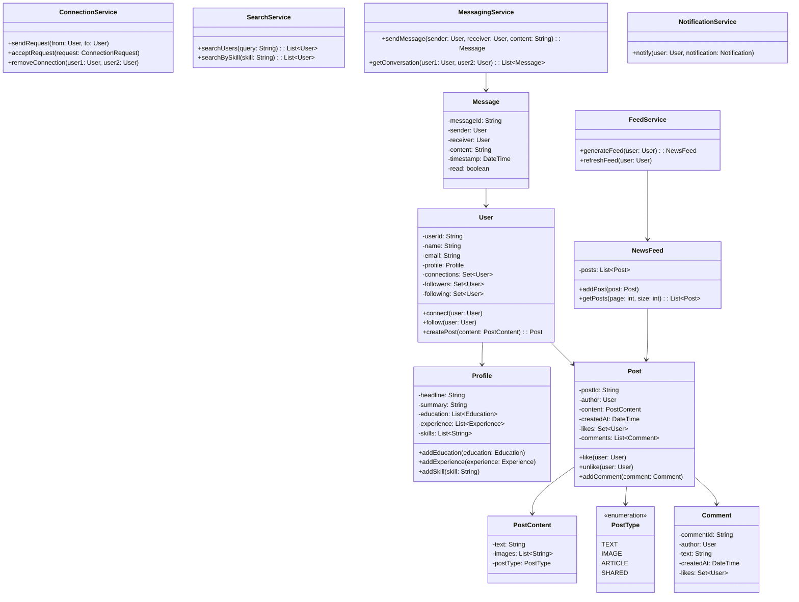

# LLD: LinkedIn/Twitter-like Social Network

## Requirements

### Functional Requirements
1. Users can create profiles with education, experience, skills
2. Users can follow/connect with other users
3. Users can post updates (text, images)
4. News feed shows posts from connections
5. Users can like, comment on posts
6. Search for users by name, skills, company
7. Direct messaging between users

### Non-Functional Requirements
- Scalable to millions of users
- Low latency feed generation
- Handle concurrent operations

## Class Diagram



## Code Implementation

```python
from abc import ABC, abstractmethod
from enum import Enum
from datetime import datetime
from typing import List, Dict, Set, Optional
import uuid
import threading

class PostType(Enum):
    TEXT = "TEXT"
    IMAGE = "IMAGE"
    ARTICLE = "ARTICLE"
    SHARED = "SHARED"

class Education:
    def __init__(self, school: str, degree: str, field: str, start_year: int, end_year: int = None):
        self.school = school
        self.degree = degree
        self.field = field
        self.start_year = start_year
        self.end_year = end_year

class Experience:
    def __init__(self, company: str, title: str, start_date: datetime, end_date: datetime = None):
        self.company = company
        self.title = title
        self.start_date = start_date
        self.end_date = end_date

class Profile:
    def __init__(self):
        self.headline = ""
        self.summary = ""
        self.education: List[Education] = []
        self.experience: List[Experience] = []
        self.skills: List[str] = []
    
    def add_education(self, education: Education):
        self.education.append(education)
    
    def add_experience(self, experience: Experience):
        self.experience.append(experience)
    
    def add_skill(self, skill: str):
        if skill not in self.skills:
            self.skills.append(skill)

class User:
    def __init__(self, user_id: str, name: str, email: str):
        self.user_id = user_id
        self.name = name
        self.email = email
        self.profile = Profile()
        self.connections: Set[str] = set()  # user_ids
        self.followers: Set[str] = set()
        self.following: Set[str] = set()
        self.posts: List[str] = []  # post_ids
        self._lock = threading.Lock()
    
    def connect(self, user_id: str):
        with self._lock:
            self.connections.add(user_id)
    
    def follow(self, user_id: str):
        with self._lock:
            self.following.add(user_id)
    
    def add_follower(self, user_id: str):
        with self._lock:
            self.followers.add(user_id)

class PostContent:
    def __init__(self, text: str, images: List[str] = None, post_type: PostType = PostType.TEXT):
        self.text = text
        self.images = images or []
        self.post_type = post_type

class Comment:
    def __init__(self, author_id: str, text: str):
        self.comment_id = str(uuid.uuid4())[:8]
        self.author_id = author_id
        self.text = text
        self.created_at = datetime.now()
        self.likes: Set[str] = set()
    
    def like(self, user_id: str):
        self.likes.add(user_id)

class Post:
    def __init__(self, author_id: str, content: PostContent):
        self.post_id = str(uuid.uuid4())[:8]
        self.author_id = author_id
        self.content = content
        self.created_at = datetime.now()
        self.likes: Set[str] = set()
        self.comments: List[Comment] = []
        self._lock = threading.Lock()
    
    def like(self, user_id: str):
        with self._lock:
            self.likes.add(user_id)
    
    def unlike(self, user_id: str):
        with self._lock:
            self.likes.discard(user_id)
    
    def add_comment(self, comment: Comment):
        with self._lock:
            self.comments.append(comment)

class NewsFeed:
    def __init__(self, user_id: str):
        self.user_id = user_id
        self.posts: List[Post] = []
        self._lock = threading.Lock()
    
    def add_post(self, post: Post):
        with self._lock:
            self.posts.insert(0, post)  # Newest first
    
    def get_posts(self, page: int = 0, page_size: int = 20) -> List[Post]:
        start = page * page_size
        return self.posts[start:start + page_size]
```

### Services

```python
class SocialNetwork:
    def __init__(self):
        self._users: Dict[str, User] = {}
        self._posts: Dict[str, Post] = {}
        self._feeds: Dict[str, NewsFeed] = {}
        self._messages: Dict[str, List['Message']] = {}  # conversation_id -> messages
        self._lock = threading.Lock()
    
    def create_user(self, name: str, email: str) -> User:
        with self._lock:
            user_id = str(uuid.uuid4())[:8]
            user = User(user_id, name, email)
            self._users[user_id] = user
            self._feeds[user_id] = NewsFeed(user_id)
            return user
    
    def connect_users(self, user1_id: str, user2_id: str):
        user1 = self._users[user1_id]
        user2 = self._users[user2_id]
        user1.connect(user2_id)
        user2.connect(user1_id)
    
    def follow_user(self, follower_id: str, followee_id: str):
        follower = self._users[follower_id]
        followee = self._users[followee_id]
        follower.follow(followee_id)
        followee.add_follower(follower_id)
    
    def create_post(self, author_id: str, content: PostContent) -> Post:
        author = self._users[author_id]
        post = Post(author_id, content)
        
        with self._lock:
            self._posts[post.post_id] = post
            author.posts.append(post.post_id)
        
        # Fan-out to followers' feeds
        self._fan_out_post(post, author)
        
        return post
    
    def _fan_out_post(self, post: Post, author: User):
        """Distribute post to followers' feeds"""
        # Add to author's feed
        self._feeds[author.user_id].add_post(post)
        
        # Add to followers' feeds
        for follower_id in author.followers:
            if follower_id in self._feeds:
                self._feeds[follower_id].add_post(post)
    
    def get_feed(self, user_id: str, page: int = 0) -> List[Post]:
        return self._feeds[user_id].get_posts(page)
    
    def like_post(self, user_id: str, post_id: str):
        post = self._posts[post_id]
        post.like(user_id)
    
    def comment_on_post(self, user_id: str, post_id: str, text: str) -> Comment:
        post = self._posts[post_id]
        comment = Comment(user_id, text)
        post.add_comment(comment)
        return comment
    
    def search_users(self, query: str) -> List[User]:
        results = []
        query_lower = query.lower()
        for user in self._users.values():
            if (query_lower in user.name.lower() or 
                query_lower in user.profile.headline.lower()):
                results.append(user)
        return results
    
    def search_by_skill(self, skill: str) -> List[User]:
        results = []
        skill_lower = skill.lower()
        for user in self._users.values():
            if any(skill_lower in s.lower() for s in user.profile.skills):
                results.append(user)
        return results

class Message:
    def __init__(self, sender_id: str, receiver_id: str, content: str):
        self.message_id = str(uuid.uuid4())[:8]
        self.sender_id = sender_id
        self.receiver_id = receiver_id
        self.content = content
        self.timestamp = datetime.now()
        self.read = False

class MessagingService:
    def __init__(self):
        self._conversations: Dict[str, List[Message]] = {}
        self._lock = threading.Lock()
    
    def _get_conversation_key(self, user1_id: str, user2_id: str) -> str:
        ids = sorted([user1_id, user2_id])
        return f"{ids[0]}_{ids[1]}"
    
    def send_message(self, sender_id: str, receiver_id: str, content: str) -> Message:
        message = Message(sender_id, receiver_id, content)
        key = self._get_conversation_key(sender_id, receiver_id)
        
        with self._lock:
            if key not in self._conversations:
                self._conversations[key] = []
            self._conversations[key].append(message)
        
        return message
    
    def get_conversation(self, user1_id: str, user2_id: str) -> List[Message]:
        key = self._get_conversation_key(user1_id, user2_id)
        return self._conversations.get(key, [])
```

### Feed Generation Strategy

```python
class FeedStrategy(ABC):
    @abstractmethod
    def generate_feed(self, user: User, social_network: SocialNetwork) -> List[Post]:
        pass

class ChronologicalFeedStrategy(FeedStrategy):
    """Simple chronological feed"""
    def generate_feed(self, user: User, social_network: SocialNetwork) -> List[Post]:
        return social_network.get_feed(user.user_id)

class RankedFeedStrategy(FeedStrategy):
    """Feed ranked by engagement and relevance"""
    def generate_feed(self, user: User, social_network: SocialNetwork) -> List[Post]:
        posts = social_network.get_feed(user.user_id)
        
        # Score each post
        scored_posts = []
        for post in posts:
            score = self._calculate_score(post, user)
            scored_posts.append((score, post))
        
        # Sort by score descending
        scored_posts.sort(key=lambda x: x[0], reverse=True)
        return [post for _, post in scored_posts]
    
    def _calculate_score(self, post: Post, user: User) -> float:
        score = 0.0
        
        # Engagement signals
        score += len(post.likes) * 1.0
        score += len(post.comments) * 2.0
        
        # Recency (newer = higher score)
        hours_old = (datetime.now() - post.created_at).total_seconds() / 3600
        score += max(0, 24 - hours_old)  # Decays over 24 hours
        
        # Connection strength (direct connection = higher)
        if post.author_id in user.connections:
            score += 5.0
        
        return score
```

## Design Patterns Used

| Pattern | Where | Why |
|---------|-------|-----|
| **Strategy** | Feed generation | Different feed algorithms |
| **Observer** | Notifications | Notify on events |
| **Repository** | Data access | Abstract storage |
| **Service Layer** | Business logic | Clean separation |

## Edge Cases

1. **Self-connection**: Prevent users connecting to themselves
2. **Duplicate posts**: Idempotent post creation
3. **Feed pagination**: Efficient cursor-based pagination
4. **Large fan-out**: Async fan-out for users with many followers
5. **Spam detection**: Rate limiting on posts and messages

## Interview Questions

1. **Q: How would you handle a user with 10M followers?**
   A: Use pull model for celebrity feeds - generate feed on read, not write.

2. **Q: How would you implement trending topics?**
   A: Count hashtags in real-time using a streaming system.

3. **Q: How would you handle the "who to follow" feature?**
   A: Graph-based recommendations, mutual connections analysis.

## Cross-References

- [HLD: Messaging Systems](../hld/messaging-systems.md) — Fan-out architecture
- [Design Patterns](./design-patterns.md) — Strategy, Observer
- [Concurrency Design](./concurrency-design.md) — Thread-safe operations
