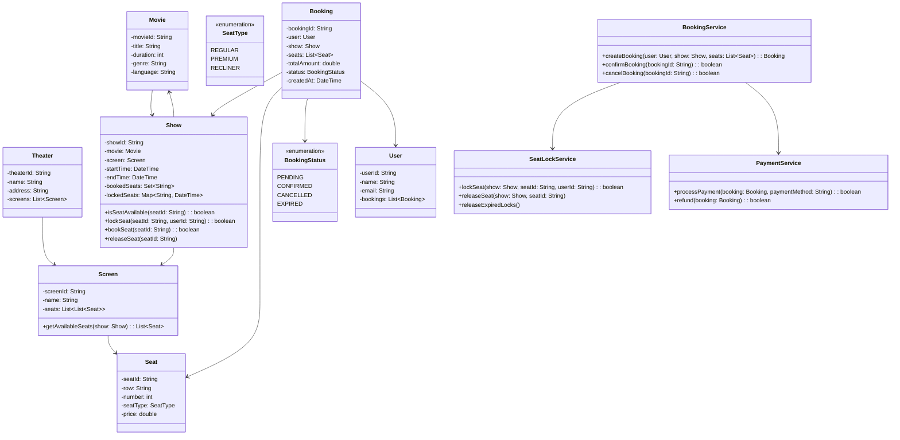

# LLD: Movie Ticket Booking System

## Requirements

### Functional Requirements
1. Browse movies and showtimes
2. Select seats for a show
3. Book tickets with payment
4. Cancel bookings (with refund policy)
5. View booking history
6. Seat locking (temporary hold during booking)

### Non-Functional Requirements
- Handle concurrent seat bookings (no double-booking)
- Consistent seat availability
- Low latency booking

## Class Diagram



## Code Implementation

```python
from enum import Enum
from datetime import datetime, timedelta
from typing import List, Dict, Set, Optional, Tuple
import uuid
import threading
import time

class SeatType(Enum):
    REGULAR = "REGULAR"
    PREMIUM = "PREMIUM"
    RECLINER = "RECLINER"

class BookingStatus(Enum):
    PENDING = "PENDING"
    CONFIRMED = "CONFIRMED"
    CANCELLED = "CANCELLED"
    EXPIRED = "EXPIRED"

class Movie:
    def __init__(self, movie_id: str, title: str, duration: int, 
                 genre: str, language: str):
        self.movie_id = movie_id
        self.title = title
        self.duration = duration
        self.genre = genre
        self.language = language

class Seat:
    def __init__(self, seat_id: str, row: str, number: int, 
                 seat_type: SeatType, price: float):
        self.seat_id = seat_id
        self.row = row
        self.number = number
        self.seat_type = seat_type
        self.price = price
    
    def __eq__(self, other):
        return isinstance(other, Seat) and self.seat_id == other.seat_id
    
    def __hash__(self):
        return hash(self.seat_id)

class Screen:
    def __init__(self, screen_id: str, name: str, seat_layout: List[List[Seat]]):
        self.screen_id = screen_id
        self.name = name
        self.seats = seat_layout
    
    def get_all_seats(self) -> List[Seat]:
        all_seats = []
        for row in self.seats:
            all_seats.extend(row)
        return all_seats
    
    def get_seat_by_id(self, seat_id: str) -> Optional[Seat]:
        for row in self.seats:
            for seat in row:
                if seat.seat_id == seat_id:
                    return seat
        return None
```

### Show and Seat Locking

```python
class Show:
    def __init__(self, show_id: str, movie: Movie, screen: Screen, 
                 start_time: datetime):
        self.show_id = show_id
        self.movie = movie
        self.screen = screen
        self.start_time = start_time
        self.end_time = start_time + timedelta(minutes=movie.duration)
        self._booked_seats: Set[str] = set()
        self._locked_seats: Dict[str, Tuple[str, datetime]] = {}  # seat_id -> (user_id, lock_time)
        self._lock = threading.Lock()
        self._lock_timeout = timedelta(minutes=10)
    
    def is_seat_available(self, seat_id: str) -> bool:
        with self._lock:
            if seat_id in self._booked_seats:
                return False
            if seat_id in self._locked_seats:
                user_id, lock_time = self._locked_seats[seat_id]
                if datetime.now() - lock_time < self._lock_timeout:
                    return False
                # Lock expired, release it
                del self._locked_seats[seat_id]
            return True
    
    def lock_seat(self, seat_id: str, user_id: str) -> bool:
        with self._lock:
            if seat_id in self._booked_seats:
                return False
            
            # Check if locked by same user (re-lock)
            if seat_id in self._locked_seats:
                existing_user, lock_time = self._locked_seats[seat_id]
                if existing_user == user_id:
                    self._locked_seats[seat_id] = (user_id, datetime.now())
                    return True
                # Check if lock expired
                if datetime.now() - lock_time < self._lock_timeout:
                    return False
            
            self._locked_seats[seat_id] = (user_id, datetime.now())
            return True
    
    def book_seat(self, seat_id: str, user_id: str) -> bool:
        with self._lock:
            if seat_id in self._booked_seats:
                return False
            
            # Must be locked by this user
            if seat_id not in self._locked_seats:
                return False
            
            lock_user, lock_time = self._locked_seats[seat_id]
            if lock_user != user_id:
                return False
            
            if datetime.now() - lock_time >= self._lock_timeout:
                del self._locked_seats[seat_id]
                return False
            
            self._booked_seats.add(seat_id)
            del self._locked_seats[seat_id]
            return True
    
    def release_seat(self, seat_id: str, user_id: str):
        with self._lock:
            if seat_id in self._locked_seats:
                lock_user, _ = self._locked_seats[seat_id]
                if lock_user == user_id:
                    del self._locked_seats[seat_id]
    
    def release_expired_locks(self):
        with self._lock:
            expired = [
                seat_id for seat_id, (_, lock_time) in self._locked_seats.items()
                if datetime.now() - lock_time >= self._lock_timeout
            ]
            for seat_id in expired:
                del self._locked_seats[seat_id]
    
    def get_available_seats(self) -> List[Seat]:
        available = []
        for seat in self.screen.get_all_seats():
            if self.is_seat_available(seat.seat_id):
                available.append(seat)
        return available

class User:
    def __init__(self, user_id: str, name: str, email: str):
        self.user_id = user_id
        self.name = name
        self.email = email
        self.bookings: List[str] = []

class Booking:
    def __init__(self, user: User, show: Show, seats: List[Seat], total: float):
        self.booking_id = str(uuid.uuid4())[:8]
        self.user = user
        self.show = show
        self.seats = seats
        self.total_amount = total
        self.status = BookingStatus.PENDING
        self.created_at = datetime.now()
        self.payment_id: Optional[str] = None
```

### Services

```python
class BookingService:
    def __init__(self):
        self._bookings: Dict[str, Booking] = {}
        self._shows: Dict[str, Show] = {}
        self._lock = threading.Lock()
    
    def add_show(self, show: Show):
        self._shows[show.show_id] = show
    
    def create_booking(self, user: User, show_id: str, 
                      seat_ids: List[str]) -> Optional[Booking]:
        show = self._shows.get(show_id)
        if not show:
            raise ValueError("Show not found")
        
        # Lock all requested seats
        locked_seats = []
        for seat_id in seat_ids:
            if show.lock_seat(seat_id, user.user_id):
                locked_seats.append(seat_id)
            else:
                # Release already locked seats
                for locked in locked_seats:
                    show.release_seat(locked, user.user_id)
                raise ValueError(f"Seat {seat_id} is not available")
        
        # Get seat objects and calculate total
        seats = []
        total = 0.0
        for seat_id in seat_ids:
            seat = show.screen.get_seat_by_id(seat_id)
            seats.append(seat)
            total += seat.price
        
        booking = Booking(user, show, seats, total)
        
        with self._lock:
            self._bookings[booking.booking_id] = booking
            user.bookings.append(booking.booking_id)
        
        return booking
    
    def confirm_booking(self, booking_id: str, payment_id: str) -> bool:
        booking = self._bookings.get(booking_id)
        if not booking or booking.status != BookingStatus.PENDING:
            return False
        
        # Book all seats
        for seat in booking.seats:
            if not booking.show.book_seat(seat.seat_id, booking.user.user_id):
                # Rollback
                for s in booking.seats:
                    booking.show.release_seat(s.seat_id, booking.user.user_id)
                booking.status = BookingStatus.EXPIRED
                return False
        
        booking.status = BookingStatus.CONFIRMED
        booking.payment_id = payment_id
        return True
    
    def cancel_booking(self, booking_id: str) -> bool:
        booking = self._bookings.get(booking_id)
        if not booking or booking.status != BookingStatus.CONFIRMED:
            return False
        
        # Release seats
        for seat in booking.seats:
            booking.show._booked_seats.discard(seat.seat_id)
        
        booking.status = BookingStatus.CANCELLED
        return True
    
    def get_user_bookings(self, user_id: str) -> List[Booking]:
        return [
            b for b in self._bookings.values()
            if b.user.user_id == user_id
        ]

class MovieTicketSystem:
    def __init__(self):
        self.booking_service = BookingService()
        self._movies: Dict[str, Movie] = {}
        self._theaters: Dict[str, 'Theater'] = {}
        self._users: Dict[str, User] = {}
    
    def add_movie(self, movie: Movie):
        self._movies[movie.movie_id] = movie
    
    def register_user(self, name: str, email: str) -> User:
        user_id = str(uuid.uuid4())[:8]
        user = User(user_id, name, email)
        self._users[user_id] = user
        return user
    
    def search_movies(self, query: str) -> List[Movie]:
        query_lower = query.lower()
        return [
            m for m in self._movies.values()
            if query_lower in m.title.lower()
        ]
    
    def get_shows(self, movie_id: str) -> List[Show]:
        return [
            show for show in self.booking_service._shows.values()
            if show.movie.movie_id == movie_id
        ]
    
    def book_tickets(self, user_id: str, show_id: str, 
                    seat_ids: List[str]) -> Booking:
        user = self._users[user_id]
        return self.booking_service.create_booking(user, show_id, seat_ids)
```

## Design Patterns Used

| Pattern | Where | Why |
|---------|-------|-----|
| **State** | Booking status | Status-driven behavior |
| **Strategy** | Pricing | Different pricing for seat types |
| **Lock** | Seat locking | Prevent double-booking |

## Edge Cases

1. **Double-booking**: Seat locking mechanism prevents this
2. **Lock expiry**: Auto-release after timeout
3. **Concurrent booking**: Thread-safe seat operations
4. **Partial booking failure**: Rollback all locked seats
5. **Payment failure**: Release seats, expire booking

## Interview Questions

1. **Q: How would you handle hold expiration?**
   A: Background job to release expired locks every minute.

2. **Q: How would you implement seat recommendations?**
   A: Suggest best available seats based on preference (center, aisle).

3. **Q: How would you handle multiple screens in a theater?**
   A: Each screen has its own seat layout, independent shows.

## Cross-References

- [Design Patterns](./design-patterns.md) — State, Strategy
- [Concurrency Design](./concurrency-design.md) — Thread-safe seat booking
- [Error Handling](./error-handling.md) — Transaction rollback
- [OOP Concepts](./oop-concepts.md)
- [DBMS Transactions](../../../dbms/transactions/acid.md)

