# LLD: Notification Service

## Requirements

### Functional Requirements
1. Send notifications via multiple channels (email, SMS, push, in-app)
2. Support notification templates
3. User notification preferences (opt-in/out per channel)
4. Notification prioritization (critical, normal, low)
5. Rate limiting per user
6. Retry failed notifications
7. Track notification delivery status
8. Batch notifications

### Non-Functional Requirements
- High throughput (millions of notifications/day)
- Reliable delivery (at-least-once)
- Low latency for critical notifications

## Class Diagram

```mermaid
classDiagram
    class Notification {
        -notificationId: String
        -userId: String
        -type: NotificationType
        -priority: Priority
        -subject: String
        -body: String
        -data: Map~String, Object~
        -status: NotificationStatus
        -createdAt: DateTime
        -sentAt: DateTime
    }
    
    class NotificationType {
        <<enumeration>>
        EMAIL
        SMS
        PUSH
        IN_APP
    }
    
    class Priority {
        <<enumeration>>
        CRITICAL
        HIGH
        NORMAL
        LOW
    }
    
    class NotificationStatus {
        <<enumeration>>
        PENDING
        SENT
        DELIVERED
        FAILED
        READ
    }
    
    class NotificationChannel {
        <<interface>>
        +send(notification: Notification): boolean
        +supports(type: NotificationType): boolean
    }
    
    class EmailChannel {
        +send(notification: Notification): boolean
    }
    
    class SMSChannel {
        +send(notification: Notification): boolean
    }
    
    class PushChannel {
        +send(notification: Notification): boolean
    }
    
    class InAppChannel {
        +send(notification: Notification): boolean
    }
    
    class NotificationService {
        -channels: Map~NotificationType, NotificationChannel~
        -userPreferences: Map~String, UserPreferences~
        -rateLimiter: RateLimiter
        +send(notification: Notification): boolean
        +sendBulk(notifications: List~Notification~)
        +getNotificationStatus(notificationId: String): NotificationStatus
    }
    
    class UserPreferences {
        -userId: String
        -enabledChannels: Set~NotificationType~
        -quietHoursStart: int
        -quietHoursEnd: int
        +isChannelEnabled(type: NotificationType): boolean
        +isQuietHour(): boolean
    }
    
    class NotificationTemplate {
        -templateId: String
        -name: String
        -subject: String
        -body: String
        -variables: List~String~
        +render(data: Map~String, String~): Notification
    }
    
    class RateLimiter {
        +canSend(userId: String): boolean
        +recordSend(userId: String)
    }
    
    class RetryPolicy {
        +shouldRetry(attempt: int, error: Exception): boolean
        +getDelay(attempt: int): int
    }
    
    class NotificationQueue {
        +enqueue(notification: Notification)
        +dequeue(): Notification
        +peek(): Notification
    }
    
    Notification --> NotificationType
    Notification --> Priority
    Notification --> NotificationStatus
    NotificationChannel <|.. EmailChannel
    NotificationChannel <|.. SMSChannel
    NotificationChannel <|.. PushChannel
    NotificationChannel <|.. InAppChannel
    NotificationService --> NotificationChannel
    NotificationService --> UserPreferences
    NotificationService --> RateLimiter
    NotificationService --> RetryPolicy
    NotificationService --> NotificationQueue
    NotificationTemplate --> Notification
```



## Code Implementation

```python
from abc import ABC, abstractmethod
from enum import Enum
from datetime import datetime, time
from typing import List, Dict, Set, Optional, Any, Callable
from dataclasses import dataclass, field
import uuid
import threading
import time as time_module

class NotificationType(Enum):
    EMAIL = "EMAIL"
    SMS = "SMS"
    PUSH = "PUSH"
    IN_APP = "IN_APP"

class Priority(Enum):
    CRITICAL = 0
    HIGH = 1
    NORMAL = 2
    LOW = 3

class NotificationStatus(Enum):
    PENDING = "PENDING"
    SENT = "SENT"
    DELIVERED = "DELIVERED"
    FAILED = "FAILED"
    READ = "READ"

@dataclass
class Notification:
    user_id: str
    notification_type: NotificationType
    priority: Priority
    subject: str
    body: str
    data: Dict[str, Any] = field(default_factory=dict)
    notification_id: str = field(default_factory=lambda: str(uuid.uuid4())[:8])
    status: NotificationStatus = NotificationStatus.PENDING
    created_at: datetime = field(default_factory=datetime.now)
    sent_at: Optional[datetime] = None
    retry_count: int = 0
```

### Channels

```python
class NotificationChannel(ABC):
    @abstractmethod
    def send(self, notification: Notification) -> bool:
        pass
    
    @abstractmethod
    def supports(self, notification_type: NotificationType) -> bool:
        pass

class EmailChannel(NotificationChannel):
    def __init__(self, smtp_host: str, smtp_port: int):
        self.smtp_host = smtp_host
        self.smtp_port = smtp_port
    
    def send(self, notification: Notification) -> bool:
        # Simulate email sending
        print(f"Sending email to user {notification.user_id}: {notification.subject}")
        return True
    
    def supports(self, notification_type: NotificationType) -> bool:
        return notification_type == NotificationType.EMAIL

class SMSChannel(NotificationChannel):
    def __init__(self, api_key: str):
        self.api_key = api_key
    
    def send(self, notification: Notification) -> bool:
        print(f"Sending SMS to user {notification.user_id}: {notification.body[:50]}")
        return True
    
    def supports(self, notification_type: NotificationType) -> bool:
        return notification_type == NotificationType.SMS

class PushChannel(NotificationChannel):
    def __init__(self, fcm_key: str):
        self.fcm_key = fcm_key
    
    def send(self, notification: Notification) -> bool:
        print(f"Sending push to user {notification.user_id}: {notification.subject}")
        return True
    
    def supports(self, notification_type: NotificationType) -> bool:
        return notification_type == NotificationType.PUSH

class InAppChannel(NotificationChannel):
    def __init__(self, notification_store: Dict[str, List[Notification]]):
        self._store = notification_store
    
    def send(self, notification: Notification) -> bool:
        if notification.user_id not in self._store:
            self._store[notification.user_id] = []
        self._store[notification.user_id].append(notification)
        print(f"In-app notification stored for user {notification.user_id}")
        return True
    
    def supports(self, notification_type: NotificationType) -> bool:
        return notification_type == NotificationType.IN_APP
```

### User Preferences and Rate Limiting

```python
class UserPreferences:
    def __init__(self, user_id: str):
        self.user_id = user_id
        self.enabled_channels: Set[NotificationType] = {
            NotificationType.EMAIL,
            NotificationType.SMS,
            NotificationType.PUSH,
            NotificationType.IN_APP
        }
        self.quiet_hours_start: Optional[time] = None
        self.quiet_hours_end: Optional[time] = None
    
    def is_channel_enabled(self, notification_type: NotificationType) -> bool:
        return notification_type in self.enabled_channels
    
    def is_quiet_hour(self) -> bool:
        if not self.quiet_hours_start or not self.quiet_hours_end:
            return False
        now = datetime.now().time()
        if self.quiet_hours_start <= self.quiet_hours_end:
            return self.quiet_hours_start <= now <= self.quiet_hours_end
        else:  # Crosses midnight
            return now >= self.quiet_hours_start or now <= self.quiet_hours_end

class RateLimiter:
    def __init__(self, max_per_minute: int = 10, max_per_hour: int = 100):
        self._max_per_minute = max_per_minute
        self._max_per_hour = max_per_hour
        self._minute_counts: Dict[str, List[datetime]] = {}
        self._hour_counts: Dict[str, List[datetime]] = {}
        self._lock = threading.Lock()
    
    def can_send(self, user_id: str) -> bool:
        with self._lock:
            now = datetime.now()
            
            # Clean old entries
            if user_id in self._minute_counts:
                self._minute_counts[user_id] = [
                    t for t in self._minute_counts[user_id]
                    if (now - t).seconds < 60
                ]
            else:
                self._minute_counts[user_id] = []
            
            if user_id in self._hour_counts:
                self._hour_counts[user_id] = [
                    t for t in self._hour_counts[user_id]
                    if (now - t).seconds < 3600
                ]
            else:
                self._hour_counts[user_id] = []
            
            return (len(self._minute_counts[user_id]) < self._max_per_minute and
                    len(self._hour_counts[user_id]) < self._max_per_hour)
    
    def record_send(self, user_id: str):
        with self._lock:
            now = datetime.now()
            if user_id not in self._minute_counts:
                self._minute_counts[user_id] = []
            if user_id not in self._hour_counts:
                self._hour_counts[user_id] = []
            self._minute_counts[user_id].append(now)
            self._hour_counts[user_id].append(now)
```

### Notification Templates and Queue

```python
class NotificationTemplate:
    def __init__(self, template_id: str, name: str, subject: str, body: str,
                 notification_type: NotificationType, priority: Priority):
        self.template_id = template_id
        self.name = name
        self.subject_template = subject
        self.body_template = body
        self.notification_type = notification_type
        self.priority = priority
    
    def render(self, user_id: str, data: Dict[str, str]) -> Notification:
        subject = self.subject_template
        body = self.body_template
        for key, value in data.items():
            subject = subject.replace(f"{{{key}}}", value)
            body = body.replace(f"{{{key}}}", value)
        
        return Notification(
            user_id=user_id,
            notification_type=self.notification_type,
            priority=self.priority,
            subject=subject,
            body=body,
            data=data
        )

class RetryPolicy:
    def __init__(self, max_retries: int = 3, base_delay: float = 1.0):
        self.max_retries = max_retries
        self.base_delay = base_delay
    
    def should_retry(self, attempt: int, error: Exception) -> bool:
        return attempt < self.max_retries
    
    def get_delay(self, attempt: int) -> float:
        return self.base_delay * (2 ** attempt)  # Exponential backoff

import queue

class NotificationQueue:
    def __init__(self):
        self._queue = queue.PriorityQueue()
    
    def enqueue(self, notification: Notification):
        # Priority queue uses tuple (priority, timestamp, notification)
        self._queue.put((notification.priority.value, notification.created_at, notification))
    
    def dequeue(self) -> Optional[Notification]:
        if self._queue.empty():
            return None
        _, _, notification = self._queue.get()
        return notification
    
    def size(self) -> int:
        return self._queue.qsize()
```

### Notification Service

```python
class NotificationService:
    def __init__(self):
        self._channels: Dict[NotificationType, NotificationChannel] = {}
        self._user_preferences: Dict[str, UserPreferences] = {}
        self._rate_limiter = RateLimiter()
        self._retry_policy = RetryPolicy()
        self._queue = NotificationQueue()
        self._notifications: Dict[str, Notification] = {}
        self._in_app_store: Dict[str, List[Notification]] = {}
        self._lock = threading.Lock()
        
        # Register default channels
        self._channels[NotificationType.IN_APP] = InAppChannel(self._in_app_store)
    
    def register_channel(self, channel: NotificationChannel):
        for ntype in NotificationType:
            if channel.supports(ntype):
                self._channels[ntype] = channel
    
    def set_user_preferences(self, preferences: UserPreferences):
        self._user_preferences[preferences.user_id] = preferences
    
    def send(self, notification: Notification) -> bool:
        # Store notification
        with self._lock:
            self._notifications[notification.notification_id] = notification
        
        # Check user preferences
        preferences = self._user_preferences.get(notification.user_id)
        if preferences:
            if not preferences.is_channel_enabled(notification.notification_type):
                notification.status = NotificationStatus.FAILED
                return False
            
            # Skip non-critical during quiet hours
            if preferences.is_quiet_hour() and notification.priority != Priority.CRITICAL:
                self._queue.enqueue(notification)
                return True
        
        # Check rate limit
        if not self._rate_limiter.can_send(notification.user_id):
            if notification.priority == Priority.CRITICAL:
                pass  # Allow critical notifications
            else:
                self._queue.enqueue(notification)
                return True
        
        # Send via appropriate channel
        channel = self._channels.get(notification.notification_type)
        if not channel:
            notification.status = NotificationStatus.FAILED
            return False
        
        success = self._send_with_retry(notification, channel)
        
        if success:
            notification.status = NotificationStatus.SENT
            notification.sent_at = datetime.now()
            self._rate_limiter.record_send(notification.user_id)
        else:
            notification.status = NotificationStatus.FAILED
        
        return success
    
    def _send_with_retry(self, notification: Notification, 
                         channel: NotificationChannel) -> bool:
        for attempt in range(self._retry_policy.max_retries + 1):
            try:
                return channel.send(notification)
            except Exception as e:
                notification.retry_count = attempt + 1
                if not self._retry_policy.should_retry(attempt, e):
                    return False
                time_module.sleep(self._retry_policy.get_delay(attempt))
        return False
    
    def send_bulk(self, notifications: List[Notification]) -> Dict[str, bool]:
        results = {}
        for notification in notifications:
            results[notification.notification_id] = self.send(notification)
        return results
    
    def get_notification_status(self, notification_id: str) -> Optional[NotificationStatus]:
        notification = self._notifications.get(notification_id)
        return notification.status if notification else None
    
    def get_user_notifications(self, user_id: str) -> List[Notification]:
        return self._in_app_store.get(user_id, [])
    
    def process_queue(self):
        """Process queued notifications (called by background worker)"""
        while not self._queue._queue.empty():
            notification = self._queue.dequeue()
            if notification:
                self.send(notification)
```

## Design Patterns Used

| Pattern | Where | Why |
|---------|-------|-----|
| **Strategy** | NotificationChannel | Different delivery mechanisms |
| **Observer** | Event-driven notifications | Publish/subscribe |
| **Template Method** | NotificationTemplate | Reusable notification formats |
| **Queue** | NotificationQueue | Async processing |

## Edge Cases

1. **Quiet hours**: Queue non-critical notifications
2. **Rate limiting**: Queue when limit exceeded
3. **Channel failure**: Retry with exponential backoff
4. **User opt-out**: Check preferences before sending
5. **Critical notifications**: Bypass rate limits and quiet hours

## Interview Questions

1. **Q: How would you handle millions of notifications?**
   A: Use message queue (Kafka), worker pools, batch processing.

2. **Q: How would you implement notification grouping?**
   A: Group similar notifications, send digest instead of individual.

3. **Q: How would you track delivery status?**
   A: Webhook callbacks from email/SMS providers, update status.

## Cross-References

- [Design Patterns](./design-patterns.md) — Strategy, Observer, Template Method
- [HLD: Messaging Systems](../hld/messaging-systems.md) — Queue-based processing
- [Error Handling](./error-handling.md) — Retry strategies
- [Concurrency Design](./concurrency-design.md) — Thread-safe queue
