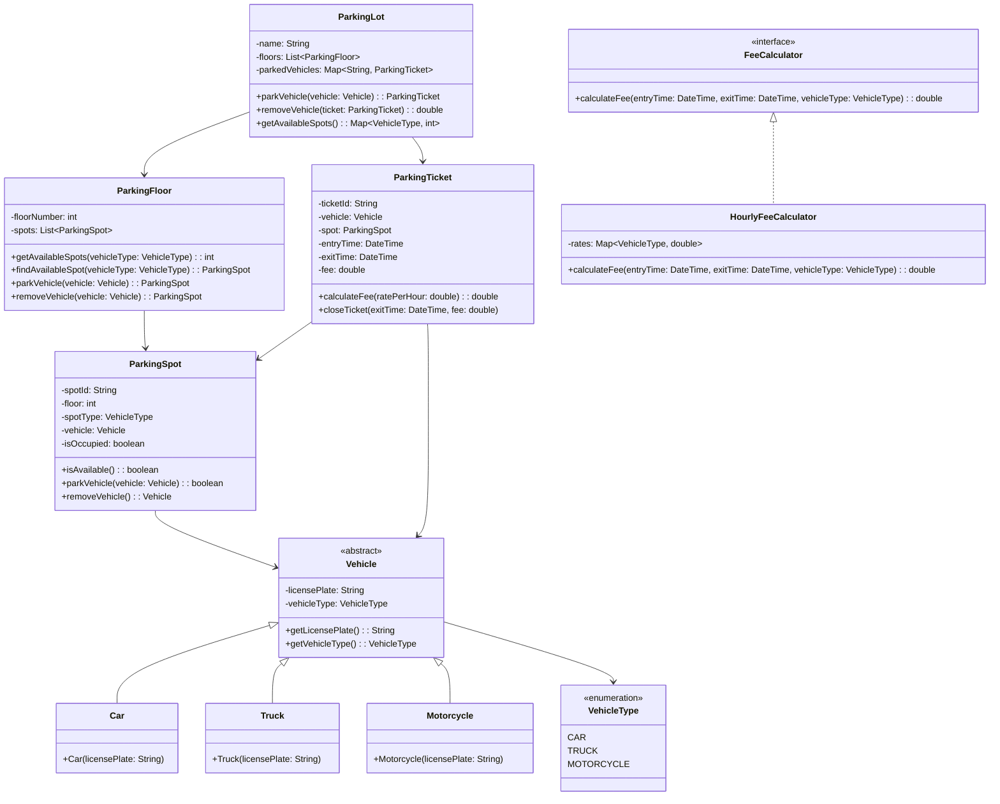

# LLD: Parking Lot System

## Requirements

### Functional Requirements
1. The parking lot has multiple floors and multiple spots per floor
2. Support different vehicle types: Car, Truck, Motorcycle
3. Each spot is designated for a specific vehicle type
4. Vehicles enter and get assigned an available spot
5. Vehicles leave and the spot becomes available
6. Display available spots per floor and per vehicle type
7. Calculate parking fee based on duration

### Non-Functional Requirements
- Thread-safe (multiple entrances/exits)
- Scalable to multiple parking lots
- Extensible for new vehicle types

### Constraints
- Each floor has a fixed number of spots
- A vehicle can only park in a spot designated for its type
- Parking fee is calculated per hour (minimum 1 hour)

## Class Diagram



## Code Implementation

### Vehicle Types

```python
from abc import ABC, abstractmethod
from enum import Enum
from datetime import datetime
from typing import Optional, Dict, List
import uuid
import threading

class VehicleType(Enum):
    CAR = "CAR"
    TRUCK = "TRUCK"
    MOTORCYCLE = "MOTORCYCLE"

class Vehicle(ABC):
    def __init__(self, license_plate: str):
        self._license_plate = license_plate
    
    @property
    def license_plate(self) -> str:
        return self._license_plate
    
    @abstractmethod
    def get_type(self) -> VehicleType:
        pass
    
    def __eq__(self, other):
        if not isinstance(other, Vehicle):
            return False
        return self._license_plate == other._license_plate
    
    def __hash__(self):
        return hash(self._license_plate)

class Car(Vehicle):
    def get_type(self) -> VehicleType:
        return VehicleType.CAR

class Truck(Vehicle):
    def get_type(self) -> VehicleType:
        return VehicleType.TRUCK

class Motorcycle(Vehicle):
    def get_type(self) -> VehicleType:
        return VehicleType.MOTORCYCLE
```

### Parking Spot

```python
class ParkingSpot:
    def __init__(self, spot_id: str, floor: int, spot_type: VehicleType):
        self._spot_id = spot_id
        self._floor = floor
        self._spot_type = spot_type
        self._vehicle: Optional[Vehicle] = None
        self._lock = threading.Lock()
    
    @property
    def spot_id(self) -> str:
        return self._spot_id
    
    @property
    def floor(self) -> int:
        return self._floor
    
    @property
    def spot_type(self) -> VehicleType:
        return self._spot_type
    
    def is_available(self) -> bool:
        with self._lock:
            return self._vehicle is None
    
    def park_vehicle(self, vehicle: Vehicle) -> bool:
        with self._lock:
            if self._vehicle is not None:
                return False
            if vehicle.get_type() != self._spot_type:
                return False
            self._vehicle = vehicle
            return True
    
    def remove_vehicle(self) -> Optional[Vehicle]:
        with self._lock:
            vehicle = self._vehicle
            self._vehicle = None
            return vehicle
    
    def __str__(self):
        status = "Occupied" if self._vehicle else "Available"
        return f"Spot {self._spot_id} (Floor {self._floor}, {self._spot_type.value}): {status}"
```

### Parking Floor

```python
class ParkingFloor:
    def __init__(self, floor_number: int, spots_config: Dict[VehicleType, int]):
        self._floor_number = floor_number
        self._spots: List[ParkingSpot] = []
        
        spot_counter = 0
        for vehicle_type, count in spots_config.items():
            for _ in range(count):
                spot_id = f"F{floor_number}-S{spot_counter}"
                self._spots.append(ParkingSpot(spot_id, floor_number, vehicle_type))
                spot_counter += 1
    
    @property
    def floor_number(self) -> int:
        return self._floor_number
    
    def get_available_spots(self, vehicle_type: VehicleType) -> int:
        return sum(
            1 for spot in self._spots
            if spot.spot_type == vehicle_type and spot.is_available()
        )
    
    def find_available_spot(self, vehicle_type: VehicleType) -> Optional[ParkingSpot]:
        for spot in self._spots:
            if spot.spot_type == vehicle_type and spot.is_available():
                return spot
        return None
    
    def park_vehicle(self, vehicle: Vehicle) -> Optional[ParkingSpot]:
        spot = self.find_available_spot(vehicle.get_type())
        if spot and spot.park_vehicle(vehicle):
            return spot
        return None
    
    def remove_vehicle(self, vehicle: Vehicle) -> Optional[ParkingSpot]:
        for spot in self._spots:
            if not spot.is_available():
                removed = spot.remove_vehicle()
                if removed == vehicle:
                    return spot
        return None
```

### Parking Ticket

```python
class ParkingTicket:
    def __init__(self, vehicle: Vehicle, spot: ParkingSpot):
        self._ticket_id = str(uuid.uuid4())[:8]
        self._vehicle = vehicle
        self._spot = spot
        self._entry_time = datetime.now()
        self._exit_time: Optional[datetime] = None
        self._fee: float = 0.0
    
    @property
    def ticket_id(self) -> str:
        return self._ticket_id
    
    @property
    def vehicle(self) -> Vehicle:
        return self._vehicle
    
    @property
    def spot(self) -> ParkingSpot:
        return self._spot
    
    @property
    def entry_time(self) -> datetime:
        return self._entry_time
    
    @property
    def exit_time(self) -> Optional[datetime]:
        return self._exit_time
    
    @property
    def fee(self) -> float:
        return self._fee
    
    def close_ticket(self, exit_time: datetime, fee: float):
        self._exit_time = exit_time
        self._fee = fee
```

### Fee Calculator

```python
class FeeCalculator(ABC):
    @abstractmethod
    def calculate_fee(self, entry_time: datetime, exit_time: datetime, 
                     vehicle_type: VehicleType) -> float:
        pass

class HourlyFeeCalculator(FeeCalculator):
    def __init__(self):
        self._rates = {
            VehicleType.CAR: 2.0,
            VehicleType.TRUCK: 3.0,
            VehicleType.MOTORCYCLE: 1.0
        }
        self._minimum_hours = 1
    
    def calculate_fee(self, entry_time: datetime, exit_time: datetime,
                     vehicle_type: VehicleType) -> float:
        duration = exit_time - entry_time
        hours = max(duration.total_seconds() / 3600, self._minimum_hours)
        return hours * self._rates[vehicle_type]
```

### Parking Lot (Main Class)

```python
class ParkingLot:
    def __init__(self, name: str, floors_config: List[Dict[VehicleType, int]]):
        self._name = name
        self._floors = [
            ParkingFloor(i, config) for i, config in enumerate(floors_config)
        ]
        self._active_tickets: Dict[str, ParkingTicket] = {}  # license_plate -> ticket
        self._fee_calculator = HourlyFeeCalculator()
        self._lock = threading.Lock()
    
    def park_vehicle(self, vehicle: Vehicle) -> Optional[ParkingTicket]:
        with self._lock:
            # Check if vehicle is already parked
            if vehicle.license_plate in self._active_tickets:
                raise ValueError(f"Vehicle {vehicle.license_plate} is already parked")
            
            # Find available spot on any floor
            for floor in self._floors:
                spot = floor.park_vehicle(vehicle)
                if spot:
                    ticket = ParkingTicket(vehicle, spot)
                    self._active_tickets[vehicle.license_plate] = ticket
                    return ticket
            
            return None  # No available spots
    
    def remove_vehicle(self, ticket_id: str) -> Optional[float]:
        with self._lock:
            # Find ticket by ID
            ticket = None
            for t in self._active_tickets.values():
                if t.ticket_id == ticket_id:
                    ticket = t
                    break
            
            if not ticket:
                raise ValueError(f"Invalid ticket: {ticket_id}")
            
            # Calculate fee
            exit_time = datetime.now()
            fee = self._fee_calculator.calculate_fee(
                ticket.entry_time, exit_time, ticket.vehicle.get_type()
            )
            ticket.close_ticket(exit_time, fee)
            
            # Remove vehicle from spot
            spot = ticket.spot
            spot.remove_vehicle()
            
            # Remove from active tickets
            del self._active_tickets[ticket.vehicle.license_plate]
            
            return fee
    
    def get_available_spots(self) -> Dict[VehicleType, int]:
        result = {}
        for vehicle_type in VehicleType:
            total = sum(
                floor.get_available_spots(vehicle_type) for floor in self._floors
            )
            result[vehicle_type] = total
        return result
    
    def get_occupancy(self) -> Dict[int, Dict[VehicleType, Dict[str, int]]]:
        """Get detailed occupancy per floor"""
        result = {}
        for floor in self._floors:
            floor_info = {}
            for vtype in VehicleType:
                available = floor.get_available_spots(vtype)
                total = sum(
                    1 for spot in floor._spots if spot.spot_type == vtype
                )
                floor_info[vtype] = {"available": available, "occupied": total - available}
            result[floor.floor_number] = floor_info
        return result
```

## Design Patterns Used

| Pattern | Where | Why |
|---------|-------|-----|
| **Strategy** | FeeCalculator | Different fee calculation strategies |
| **Factory** | Vehicle creation | Create different vehicle types |
| **Singleton** | ParkingLot (optional) | One parking lot instance |

## SOLID Principles Applied

| Principle | How Applied |
|-----------|-------------|
| **SRP** | Each class has one responsibility (Spot, Floor, Ticket, Fee) |
| **OCP** | New vehicle types via extension, new fee strategies via interface |
| **LSP** | Car, Truck, Motorcycle substitutable as Vehicle |
| **ISP** | FeeCalculator interface is focused |
| **DIP** | ParkingLot depends on FeeCalculator abstraction |

## Edge Cases

1. **Vehicle already parked**: Check before assigning spot
2. **No available spots**: Return None, handle gracefully
3. **Invalid ticket**: Validate ticket before removing vehicle
4. **Concurrent access**: Thread-safe with locks
5. **Minimum fee**: At least 1 hour charge
6. **Multiple floors**: Search across all floors

## Interview Questions

1. **Q: How would you handle multiple parking lots?**
   A: Create a ParkingLotManager that manages multiple ParkingLot instances.

2. **Q: How would you support different fee strategies?**
   A: Use Strategy pattern - implement different FeeCalculator classes.

3. **Q: How would you handle reservations?**
   A: Add a Reservation class and modify ParkingSpot to support reserved spots.

4. **Q: How would you support handicapped parking?**
   A: Add a HANDICAPPED VehicleType or a special spot type.

5. **Q: How would you handle peak pricing?**
   A: Implement a PeakHourFeeCalculator that checks time of day.

## Common Mistakes

- ❌ Not handling concurrent access
- ❌ Coupling fee calculation with parking logic
- ❌ Not validating vehicle type vs spot type
- ❌ Forgetting to check if vehicle is already parked
- ❌ Hardcoding fee rates

## Cross-References

- [Design Patterns](./design-patterns.md) — Strategy, Factory patterns
- [SOLID Principles](./solid.md) — Applied in this design
- [UML Class Diagrams](./uml-class-diagrams.md) — Diagram conventions
- [OOP Concepts](./oop-concepts.md) — Inheritance, polymorphism
- [Elevator](./elevator.md)

