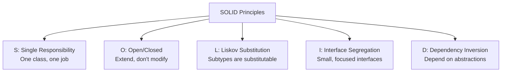

# SOLID Principles

## What is SOLID?

SOLID is a set of five design principles that make object-oriented designs more understandable, flexible, and maintainable. Coined by Robert C. Martin (Uncle Bob).

```
S - Single Responsibility Principle (SRP)
O - Open/Closed Principle (OCP)
L - Liskov Substitution Principle (LSP)
I - Interface Segregation Principle (ISP)
D - Dependency Inversion Principle (DIP)
```



---

## S — Single Responsibility Principle

> "A class should have only one reason to change."

Each class should have exactly one job or responsibility.

### Violation (Python)
```python
class User:
    def __init__(self, name: str, email: str):
        self.name = name
        self.email = email
    
    # Responsibility 1: User data
    def get_name(self) -> str:
        return self.name
    
    # Responsibility 2: Persistence (should be separate!)
    def save_to_database(self):
        db.execute("INSERT INTO users ...", self.name, self.email)
    
    # Responsibility 3: Email (should be separate!)
    def send_email(self, message: str):
        smtp.send(self.email, message)
```

**Problems**: Changing email logic requires changing User class. Database change affects User.

### Correct (Python)
```python
class User:
    def __init__(self, name: str, email: str):
        self.name = name
        self.email = email

class UserRepository:
    def save(self, user: User):
        db.execute("INSERT INTO users ...", user.name, user.email)

class EmailService:
    def send(self, user: User, message: str):
        smtp.send(user.email, message)
```

### Java Example
```java
// Violation: God class with multiple responsibilities
public class Employee {
    private String name;
    private double salary;
    
    public void calculatePay() { /* payroll logic */ }
    public void saveToDatabase() { /* persistence logic */ }
    public String generateReport() { /* reporting logic */ }
    public void sendNotification() { /* notification logic */ }
}

// Correct: Separate classes, each with one responsibility
public class Employee {
    private String name;
    private double salary;
    // getters/setters only
}

public class PayrollService {
    public double calculatePay(Employee emp) {
        return emp.getSalary();
    }
}

public class EmployeeRepository {
    public void save(Employee emp) {
        // database logic
    }
}

public class ReportGenerator {
    public String generateReport(Employee emp) {
        return "Report for " + emp.getName();
    }
}

public class NotificationService {
    public void sendNotification(Employee emp, String message) {
        // email/SMS logic
    }
}
```

---

## O — Open/Closed Principle

> "Software entities should be open for extension but closed for modification."

You should be able to add new behavior without modifying existing code.

### Violation (Python)
```python
class AreaCalculator:
    def calculate_area(self, shape):
        if isinstance(shape, Circle):
            return 3.14 * shape.radius ** 2
        elif isinstance(shape, Rectangle):
            return shape.width * shape.height
        elif isinstance(shape, Triangle):  # Must modify for each new shape!
            return 0.5 * shape.base * shape.height
```

Every new shape requires modifying `AreaCalculator`.

### Correct (Python)
```python
from abc import ABC, abstractmethod

class Shape(ABC):
    @abstractmethod
    def area(self) -> float:
        pass

class Circle(Shape):
    def __init__(self, radius: float):
        self.radius = radius
    
    def area(self) -> float:
        return 3.14 * self.radius ** 2

class Rectangle(Shape):
    def __init__(self, width: float, height: float):
        self.width = width
        self.height = height
    
    def area(self) -> float:
        return self.width * self.height

class AreaCalculator:
    def calculate_area(self, shape: Shape) -> float:
        return shape.area()  # No modification needed for new shapes
```

Adding a new shape? Just create a new class extending Shape.

### Java Example
```java
// Violation: Must modify for each new shape
public class AreaCalculator {
    public double calculate(Object shape) {
        if (shape instanceof Circle) {
            return Math.PI * ((Circle) shape).getRadius() * ((Circle) shape).getRadius();
        } else if (shape instanceof Rectangle) {
            return ((Rectangle) shape).getWidth() * ((Rectangle) shape).getHeight();
        }
        // Every new shape = modify this class!
        throw new IllegalArgumentException("Unknown shape");
    }
}

// Correct: Open for extension, closed for modification
public interface Shape {
    double area();
}

public class Circle implements Shape {
    private final double radius;
    
    public Circle(double radius) { this.radius = radius; }
    
    @Override
    public double area() { return Math.PI * radius * radius; }
}

public class Rectangle implements Shape {
    private final double width, height;
    
    public Rectangle(double width, double height) {
        this.width = width;
        this.height = height;
    }
    
    @Override
    public double area() { return width * height; }
}

// New shapes don't require modifying AreaCalculator
public class Triangle implements Shape {
    private final double base, height;
    
    public Triangle(double base, double height) {
        this.base = base;
        this.height = height;
    }
    
    @Override
    public double area() { return 0.5 * base * height; }
}

public class AreaCalculator {
    public double calculate(Shape shape) {
        return shape.area();  // Works with any Shape implementation
    }
}
```

---

## L — Liskov Substitution Principle

> "Subtypes must be substitutable for their base types."

If class B is a subclass of class A, you should be able to use B anywhere A is expected without breaking the program.

### Violation (Python)
```python
class Bird:
    def fly(self):
        return "Flying"

class Sparrow(Bird):
    def fly(self):
        return "Sparrow flying"

class Penguin(Bird):
    def fly(self):
        raise Exception("Penguins can't fly!")  # Violates LSP!

def make_bird_fly(bird: Bird):
    print(bird.fly())  # Crashes for Penguin!
```

### Correct (Python)
```python
from abc import ABC, abstractmethod

class Bird(ABC):
    @abstractmethod
    def move(self) -> str:
        pass

class FlyingBird(Bird):
    @abstractmethod
    def fly(self) -> str:
        pass
    
    def move(self) -> str:
        return self.fly()

class Sparrow(FlyingBird):
    def fly(self) -> str:
        return "Sparrow flying"

class Penguin(Bird):
    def move(self) -> str:
        return "Penguin swimming"

def make_bird_move(bird: Bird):
    print(bird.move())  # Works for all birds!
```

### Java Example
```java
// Violation: Square overrides setWidth/setHeight, breaking Rectangle behavior
public class Rectangle {
    protected int width, height;
    
    public void setWidth(int width) { this.width = width; }
    public void setHeight(int height) { this.height = height; }
    public int getArea() { return width * height; }
}

public class Square extends Rectangle {
    @Override
    public void setWidth(int width) {
        this.width = width;
        this.height = width;  // Breaks expectation!
    }
    
    @Override
    public void setHeight(int height) {
        this.width = height;
        this.height = height;  // Breaks expectation!
    }
}

// Client code breaks:
void resize(Rectangle r) {
    r.setWidth(5);
    r.setHeight(10);
    assert r.getArea() == 50;  // FAILS for Square (area = 100)
}

// Correct: Separate interfaces
public interface Shape {
    double getArea();
}

public class Rectangle implements Shape {
    private final int width, height;
    public Rectangle(int w, int h) { this.width = w; this.height = h; }
    @Override
    public double getArea() { return width * height; }
}

public class Square implements Shape {
    private final int side;
    public Square(int side) { this.side = side; }
    @Override
    public double getArea() { return side * side; }
}
```

---

## I — Interface Segregation Principle

> "Clients should not be forced to depend on interfaces they don't use."

Keep interfaces small and focused. Don't create "fat" interfaces.

### Violation (Python)
```python
class Machine(ABC):
    @abstractmethod
    def print_document(self):
        pass
    
    @abstractmethod
    def scan_document(self):
        pass
    
    @abstractmethod
    def fax_document(self):
        pass

class SimplePrinter(Machine):
    def print_document(self):
        print("Printing...")
    
    def scan_document(self):
        raise Exception("Can't scan!")  # Forced to implement!
    
    def fax_document(self):
        raise Exception("Can't fax!")  # Forced to implement!
```

### Correct (Python)
```python
class Printer(ABC):
    @abstractmethod
    def print_document(self):
        pass

class Scanner(ABC):
    @abstractmethod
    def scan_document(self):
        pass

class Fax(ABC):
    @abstractmethod
    def fax_document(self):
        pass

class SimplePrinter(Printer):
    def print_document(self):
        print("Printing...")

class MultiFunctionMachine(Printer, Scanner, Fax):
    def print_document(self):
        print("Printing...")
    
    def scan_document(self):
        print("Scanning...")
    
    def fax_document(self):
        print("Faxing...")
```

### Java Example
```java
// Violation: Fat interface forces unnecessary implementations
public interface Worker {
    void work();
    void eat();
    void sleep();
}

public class Robot implements Worker {
    @Override
    public void work() { /* OK */ }
    
    @Override
    public void eat() { throw new UnsupportedOperationException(); } // Robots don't eat!
    
    @Override
    public void sleep() { throw new UnsupportedOperationException(); } // Robots don't sleep!
}

// Correct: Segregated interfaces
public interface Workable {
    void work();
}

public interface Feedable {
    void eat();
}

public interface Sleepable {
    void sleep();
}

public class HumanWorker implements Workable, Feedable, Sleepable {
    @Override
    public void work() { /* work logic */ }
    @Override
    public void eat() { /* eat logic */ }
    @Override
    public void sleep() { /* sleep logic */ }
}

public class Robot implements Workable {
    @Override
    public void work() { /* work logic */ }
    // No need to implement eat() or sleep()
}
```

---

## D — Dependency Inversion Principle

> "High-level modules should not depend on low-level modules. Both should depend on abstractions."

Depend on interfaces, not concrete implementations.

### Violation (Python)
```python
class MySQLDatabase:
    def connect(self):
        print("Connecting to MySQL")
    
    def query(self, sql: str):
        print(f"MySQL: {sql}")

class UserService:
    def __init__(self):
        self.db = MySQLDatabase()  # Direct dependency on concrete class!
    
    def get_user(self, user_id: int):
        self.db.connect()
        return self.db.query(f"SELECT * FROM users WHERE id = {user_id}")
```

### Correct (Python)
```python
from abc import ABC, abstractmethod

class Database(ABC):
    @abstractmethod
    def connect(self):
        pass
    
    @abstractmethod
    def query(self, sql: str):
        pass

class MySQLDatabase(Database):
    def connect(self):
        print("Connecting to MySQL")
    
    def query(self, sql: str):
        print(f"MySQL: {sql}")

class PostgreSQLDatabase(Database):
    def connect(self):
        print("Connecting to PostgreSQL")
    
    def query(self, sql: str):
        print(f"PostgreSQL: {sql}")

class UserService:
    def __init__(self, db: Database):  # Depends on abstraction
        self.db = db
    
    def get_user(self, user_id: int):
        self.db.connect()
        return self.db.query(f"SELECT * FROM users WHERE id = {user_id}")

# Usage
service = UserService(MySQLDatabase())      # Easy to swap
service = UserService(PostgreSQLDatabase())  # Just change this line
```

### Java Example
```java
// Violation: High-level depends directly on low-level
public class EmailService {
    public void sendEmail(String to, String message) {
        // Gmail SMTP implementation
        System.out.println("Sending via Gmail to " + to);
    }
}

public class OrderService {
    private EmailService emailService = new EmailService(); // Tight coupling!
    
    public void placeOrder(Order order) {
        // process order...
        emailService.sendEmail(order.getEmail(), "Order confirmed");
    }
}

// Correct: Both depend on abstraction
public interface MessageSender {
    void send(String to, String message);
}

public class EmailSender implements MessageSender {
    @Override
    public void send(String to, String message) {
        System.out.println("Email to " + to + ": " + message);
    }
}

public class SMSSender implements MessageSender {
    @Override
    public void send(String to, String message) {
        System.out.println("SMS to " + to + ": " + message);
    }
}

public class PushNotificationSender implements MessageSender {
    @Override
    public void send(String to, String message) {
        System.out.println("Push to " + to + ": " + message);
    }
}

public class OrderService {
    private final MessageSender messageSender;
    
    // Inject dependency through constructor
    public OrderService(MessageSender messageSender) {
        this.messageSender = messageSender;
    }
    
    public void placeOrder(Order order) {
        // process order...
        messageSender.send(order.getEmail(), "Order confirmed");
    }
}

// Usage — easy to swap, easy to test
OrderService service = new OrderService(new EmailSender());
OrderService service = new OrderService(new SMSSender());
```

---

## SOLID Summary

| Principle | Key Idea | Benefit |
|-----------|----------|---------|
| **SRP** | One class, one job | Easier to maintain and test |
| **OCP** | Extend, don't modify | Add features without breaking existing code |
| **LSP** | Subtypes are substitutable | Polymorphism works correctly |
| **ISP** | Small, focused interfaces | Classes don't depend on unused methods |
| **DIP** | Depend on abstractions | Loose coupling, easy to swap implementations |

---

## Applying SOLID in Real Systems

### Example: Notification System (Python)

```python
# SRP: Separate responsibilities
class Notification:
    def __init__(self, recipient: str, message: str):
        self.recipient = recipient
        self.message = message

class NotificationSender(ABC):
    @abstractmethod
    def send(self, notification: Notification):
        pass

class EmailSender(NotificationSender):
    def send(self, notification: Notification):
        print(f"Email to {notification.recipient}: {notification.message}")

class SMSSender(NotificationSender):
    def send(self, notification: Notification):
        print(f"SMS to {notification.recipient}: {notification.message}")

# OCP: Add new channels without modifying existing code
class PushNotificationSender(NotificationSender):
    def send(self, notification: Notification):
        print(f"Push to {notification.recipient}: {notification.message}")

# DIP: High-level depends on abstraction
class NotificationService:
    def __init__(self, senders: list[NotificationSender]):
        self.senders = senders
    
    def notify(self, notification: Notification):
        for sender in self.senders:
            sender.send(notification)

# ISP: Small, focused interfaces
class Retryable(ABC):
    @abstractmethod
    def retry(self, notification: Notification, max_attempts: int):
        pass

class Loggable(ABC):
    @abstractmethod
    def log(self, notification: Notification):
        pass
```

### Example: Notification System (Java)

```java
// SRP: Each class has one responsibility
public class Notification {
    private final String recipient;
    private final String message;
    // constructor, getters
}

// ISP: Segregated interfaces
public interface Sendable {
    void send(Notification notification);
}

public interface Retryable {
    void retry(Notification notification, int maxAttempts);
}

public interface Loggable {
    void log(Notification notification);
}

// OCP: Open for extension
public class EmailSender implements Sendable, Retryable, Loggable {
    @Override
    public void send(Notification n) {
        System.out.println("Email: " + n.getMessage());
    }
    
    @Override
    public void retry(Notification n, int maxAttempts) {
        for (int i = 0; i < maxAttempts; i++) {
            try { send(n); break; }
            catch (Exception e) { /* retry */ }
        }
    }
    
    @Override
    public void log(Notification n) {
        System.out.println("Logged: " + n.getRecipient());
    }
}

public class SMSSender implements Sendable {
    @Override
    public void send(Notification n) {
        System.out.println("SMS: " + n.getMessage());
    }
}

// DIP: Depends on abstraction, not implementation
public class NotificationService {
    private final List<Sendable> senders;
    
    public NotificationService(List<Sendable> senders) {
        this.senders = senders;
    }
    
    public void notifyAll(Notification notification) {
        for (Sendable sender : senders) {
            sender.send(notification);
        }
    }
}

// Usage
NotificationService service = new NotificationService(
    List.of(new EmailSender(), new SMSSender())
);
service.notifyAll(new Notification("user@example.com", "Hello!"));
```

---

## Interview Tips

1. **Mention SOLID by name** — "I'm applying the Open/Closed Principle here"
2. **Explain the "why"** — Not just "I used SRP" but "SRP makes this easier to test"
3. **Show trade-offs** — Sometimes strict SOLID adds complexity
4. **Apply naturally** — Don't force SOLID where it doesn't fit
5. **Give examples** — Reference real-world code you've written
6. **Know violations** — Being able to spot violations shows depth

## Common Mistakes

- ❌ Creating too many tiny classes (over-applying SRP)
- ❌ Using inheritance when composition is better
- ❌ Forcing interfaces where concrete classes would suffice
- ❌ Not explaining why you chose a principle
- ❌ Applying SOLID rigidly in simple scripts or prototypes
- ❌ Confusing DIP with dependency injection (DI is a pattern, DIP is a principle)

## Cross-References

- [Design Patterns](./design-patterns.md) — Patterns embody SOLID principles
- [OOP Concepts](./oop-concepts.md) — Foundation for SOLID
- [Abstraction & Interfaces](./abstraction-interfaces.md) — DIP and ISP implementation
- [UML Class Diagrams](./uml-class-diagrams.md) — Visualizing SOLID designs
