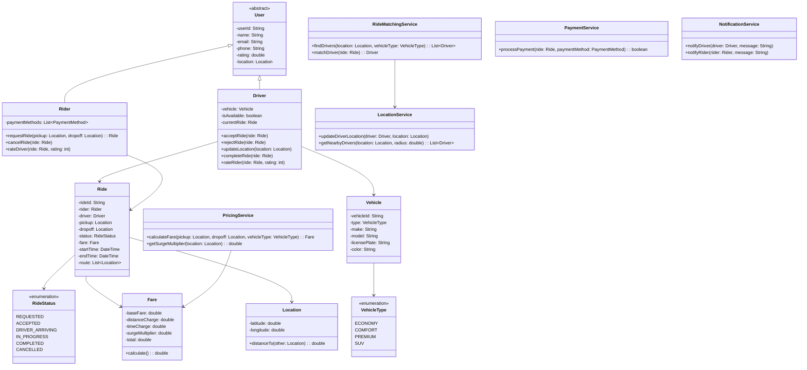

# LLD: Uber/Ola Ride-Sharing

## Requirements

### Functional Requirements
1. Riders can request rides (pickup, dropoff locations)
2. Drivers can accept/reject ride requests
3. Match riders with nearby available drivers
4. Track ride status (requested, accepted, in-progress, completed, cancelled)
5. Calculate fare based on distance, time, surge pricing
6. Rate system for riders and drivers
7. Payment processing

### Non-Functional Requirements
- Real-time location tracking
- Low latency matching
- Handle millions of concurrent rides

## Class Diagram



## Code Implementation

```python
from abc import ABC, abstractmethod
from enum import Enum
from datetime import datetime
from typing import List, Dict, Optional, Tuple
from dataclasses import dataclass
import uuid
import math
import threading

@dataclass
class Location:
    latitude: float
    longitude: float
    
    def distance_to(self, other: 'Location') -> float:
        """Calculate distance in km using Haversine formula"""
        R = 6371  # Earth's radius in km
        lat1, lon1 = math.radians(self.latitude), math.radians(self.longitude)
        lat2, lon2 = math.radians(other.latitude), math.radians(other.longitude)
        
        dlat = lat2 - lat1
        dlon = lon2 - lon1
        
        a = math.sin(dlat/2)**2 + math.cos(lat1) * math.cos(lat2) * math.sin(dlon/2)**2
        c = 2 * math.asin(math.sqrt(a))
        
        return R * c

class VehicleType(Enum):
    ECONOMY = "ECONOMY"
    COMFORT = "COMFORT"
    PREMIUM = "PREMIUM"
    SUV = "SUV"

class RideStatus(Enum):
    REQUESTED = "REQUESTED"
    ACCEPTED = "ACCEPTED"
    DRIVER_ARRIVING = "DRIVER_ARRIVING"
    IN_PROGRESS = "IN_PROGRESS"
    COMPLETED = "COMPLETED"
    CANCELLED = "CANCELLED"

class Vehicle:
    def __init__(self, vehicle_id: str, vehicle_type: VehicleType, 
                 make: str, model: str, license_plate: str, color: str):
        self.vehicle_id = vehicle_id
        self.vehicle_type = vehicle_type
        self.make = make
        self.model = model
        self.license_plate = license_plate
        self.color = color
```

### Users and Ride

```python
class User:
    def __init__(self, user_id: str, name: str, email: str, phone: str):
        self.user_id = user_id
        self.name = name
        self.email = email
        self.phone = phone
        self.rating = 5.0
        self.rating_count = 0
        self.location: Optional[Location] = None
        self._lock = threading.Lock()
    
    def update_rating(self, new_rating: int):
        with self._lock:
            total = self.rating * self.rating_count
            self.rating_count += 1
            self.rating = (total + new_rating) / self.rating_count

class Rider(User):
    def __init__(self, user_id: str, name: str, email: str, phone: str):
        super().__init__(user_id, name, email, phone)
        self.payment_methods: List[str] = []
        self.ride_history: List[str] = []

class Driver(User):
    def __init__(self, user_id: str, name: str, email: str, phone: str, vehicle: Vehicle):
        super().__init__(user_id, name, email, phone)
        self.vehicle = vehicle
        self.is_available = True
        self.current_ride: Optional[str] = None
        self.ride_history: List[str] = []
    
    def set_available(self, available: bool):
        with self._lock:
            self.is_available = available

class Fare:
    def __init__(self, base_fare: float, distance_charge: float, 
                 time_charge: float, surge_multiplier: float):
        self.base_fare = base_fare
        self.distance_charge = distance_charge
        self.time_charge = time_charge
        self.surge_multiplier = surge_multiplier
        self.total = self._calculate()
    
    def _calculate(self) -> float:
        subtotal = self.base_fare + self.distance_charge + self.time_charge
        return subtotal * self.surge_multiplier

class Ride:
    def __init__(self, rider: Rider, pickup: Location, dropoff: Location, 
                 vehicle_type: VehicleType):
        self.ride_id = str(uuid.uuid4())[:8]
        self.rider = rider
        self.driver: Optional[Driver] = None
        self.pickup = pickup
        self.dropoff = dropoff
        self.vehicle_type = vehicle_type
        self.status = RideStatus.REQUESTED
        self.fare: Optional[Fare] = None
        self.requested_at = datetime.now()
        self.started_at: Optional[datetime] = None
        self.completed_at: Optional[datetime] = None
        self.route: List[Location] = []
        self._lock = threading.Lock()
    
    def accept(self, driver: Driver):
        with self._lock:
            if self.status != RideStatus.REQUESTED:
                raise ValueError(f"Cannot accept ride in {self.status.value} state")
            self.driver = driver
            self.status = RideStatus.ACCEPTED
    
    def start_ride(self):
        with self._lock:
            if self.status != RideStatus.ACCEPTED:
                raise ValueError(f"Cannot start ride in {self.status.value} state")
            self.status = RideStatus.IN_PROGRESS
            self.started_at = datetime.now()
    
    def complete_ride(self, fare: Fare):
        with self._lock:
            if self.status != RideStatus.IN_PROGRESS:
                raise ValueError(f"Cannot complete ride in {self.status.value} state")
            self.status = RideStatus.COMPLETED
            self.completed_at = datetime.now()
            self.fare = fare
    
    def cancel(self):
        with self._lock:
            if self.status in [RideStatus.COMPLETED, RideStatus.CANCELLED]:
                raise ValueError(f"Cannot cancel ride in {self.status.value} state")
            self.status = RideStatus.CANCELLED
```

### Services

```python
class LocationService:
    def __init__(self):
        self._driver_locations: Dict[str, Location] = {}
        self._lock = threading.Lock()
    
    def update_driver_location(self, driver_id: str, location: Location):
        with self._lock:
            self._driver_locations[driver_id] = location
    
    def get_nearby_drivers(self, location: Location, radius_km: float, 
                          drivers: Dict[str, Driver]) -> List[Tuple[Driver, float]]:
        nearby = []
        with self._lock:
            for driver_id, driver_loc in self._driver_locations.items():
                distance = location.distance_to(driver_loc)
                if distance <= radius_km and driver_id in drivers:
                    driver = drivers[driver_id]
                    if driver.is_available:
                        nearby.append((driver, distance))
        
        # Sort by distance
        nearby.sort(key=lambda x: x[1])
        return nearby

class PricingService:
    def __init__(self):
        self._base_rates = {
            VehicleType.ECONOMY: {"base": 2.0, "per_km": 1.0, "per_min": 0.15},
            VehicleType.COMFORT: {"base": 3.0, "per_km": 1.5, "per_min": 0.20},
            VehicleType.PREMIUM: {"base": 5.0, "per_km": 2.5, "per_min": 0.35},
            VehicleType.SUV: {"base": 4.0, "per_km": 2.0, "per_min": 0.25},
        }
    
    def calculate_fare(self, pickup: Location, dropoff: Location, 
                      vehicle_type: VehicleType, duration_minutes: float) -> Fare:
        rates = self._base_rates[vehicle_type]
        distance = pickup.distance_to(dropoff)
        
        base_fare = rates["base"]
        distance_charge = distance * rates["per_km"]
        time_charge = duration_minutes * rates["per_min"]
        surge_multiplier = self._get_surge_multiplier(pickup)
        
        return Fare(base_fare, distance_charge, time_charge, surge_multiplier)
    
    def _get_surge_multiplier(self, location: Location) -> float:
        # In real system, check demand/supply ratio in area
        return 1.0

class RideMatchingService:
    def __init__(self, location_service: LocationService):
        self._location_service = location_service
        self._search_radius_km = 5.0
    
    def find_nearby_drivers(self, pickup: Location, vehicle_type: VehicleType,
                           drivers: Dict[str, Driver]) -> List[Driver]:
        nearby = self._location_service.get_nearby_drivers(
            pickup, self._search_radius_km, drivers
        )
        
        # Filter by vehicle type
        matching = [
            driver for driver, distance in nearby
            if driver.vehicle.vehicle_type == vehicle_type
        ]
        
        return matching
    
    def match_driver(self, ride: Ride, drivers: Dict[str, Driver]) -> Optional[Driver]:
        nearby_drivers = self.find_nearby_drivers(
            ride.pickup, ride.vehicle_type, drivers
        )
        
        if not nearby_drivers:
            return None
        
        # Return nearest available driver
        return nearby_drivers[0]

class UberSystem:
    def __init__(self):
        self._riders: Dict[str, Rider] = {}
        self._drivers: Dict[str, Driver] = {}
        self._rides: Dict[str, Ride] = {}
        self._location_service = LocationService()
        self._pricing_service = PricingService()
        self._matching_service = RideMatchingService(self._location_service)
        self._lock = threading.Lock()
    
    def register_rider(self, name: str, email: str, phone: str) -> Rider:
        rider_id = str(uuid.uuid4())[:8]
        rider = Rider(rider_id, name, email, phone)
        self._riders[rider_id] = rider
        return rider
    
    def register_driver(self, name: str, email: str, phone: str, 
                       vehicle: Vehicle) -> Driver:
        driver_id = str(uuid.uuid4())[:8]
        driver = Driver(driver_id, name, email, phone, vehicle)
        self._drivers[driver_id] = driver
        return driver
    
    def update_driver_location(self, driver_id: str, location: Location):
        self._location_service.update_driver_location(driver_id, location)
        self._drivers[driver_id].location = location
    
    def request_ride(self, rider_id: str, pickup: Location, 
                    dropoff: Location, vehicle_type: VehicleType) -> Ride:
        rider = self._riders[rider_id]
        ride = Ride(rider, pickup, dropoff, vehicle_type)
        
        with self._lock:
            self._rides[ride.ride_id] = ride
            rider.ride_history.append(ride.ride_id)
        
        return ride
    
    def accept_ride(self, driver_id: str, ride_id: str) -> bool:
        driver = self._drivers[driver_id]
        ride = self._rides[ride_id]
        
        try:
            ride.accept(driver)
            driver.set_available(False)
            driver.current_ride = ride_id
            return True
        except ValueError:
            return False
    
    def start_ride(self, ride_id: str) -> bool:
        ride = self._rides[ride_id]
        try:
            ride.start_ride()
            return True
        except ValueError:
            return False
    
    def complete_ride(self, ride_id: str, duration_minutes: float) -> Optional[float]:
        ride = self._rides[ride_id]
        
        fare = self._pricing_service.calculate_fare(
            ride.pickup, ride.dropoff, ride.vehicle_type, duration_minutes
        )
        
        try:
            ride.complete_ride(fare)
            ride.driver.set_available(True)
            ride.driver.current_ride = None
            ride.driver.ride_history.append(ride_id)
            return fare.total
        except ValueError:
            return None
    
    def cancel_ride(self, ride_id: str) -> bool:
        ride = self._rides[ride_id]
        try:
            ride.cancel()
            if ride.driver:
                ride.driver.set_available(True)
                ride.driver.current_ride = None
            return True
        except ValueError:
            return False
    
    def find_drivers(self, pickup: Location, vehicle_type: VehicleType) -> List[Driver]:
        return self._matching_service.find_nearby_drivers(
            pickup, vehicle_type, self._drivers
        )
    
    def rate_driver(self, rider_id: str, ride_id: str, rating: int):
        ride = self._rides[ride_id]
        ride.driver.update_rating(rating)
    
    def rate_rider(self, driver_id: str, ride_id: str, rating: int):
        ride = self._rides[ride_id]
        ride.rider.update_rating(rating)
```

## Design Patterns Used

| Pattern | Where | Why |
|---------|-------|-----|
| **Strategy** | Pricing, Matching | Different algorithms |
| **State** | Ride status | Behavior changes by state |
| **Observer** | Notifications | Event-driven updates |
| **Factory** | User creation | Create riders/drivers |

## Edge Cases

1. **Driver goes offline during ride**: Handle gracefully
2. **Rider cancels after driver accepts**: Apply cancellation fee
3. **No drivers available**: Queue request, notify when available
4. **Surge pricing**: Dynamic pricing based on demand
5. **Multiple ride requests**: Driver can only handle one at a time

## Interview Questions

1. **Q: How would you implement ride pooling?**
   A: Match riders with similar routes, calculate shared fare.

2. **Q: How would you handle driver matching at scale?**
   A: Geospatial indexing (Geohash, Quadtree), sharded by region.

3. **Q: How would you implement scheduled rides?**
   A: Add scheduling service, store future ride requests.

## Cross-References

- [HLD: Load Balancing](../hld/load-balancing-design.md) — Geospatial load balancing
- [Design Patterns](./design-patterns.md) — Strategy, State, Observer
- [Concurrency Design](./concurrency-design.md) — Thread-safe operations
