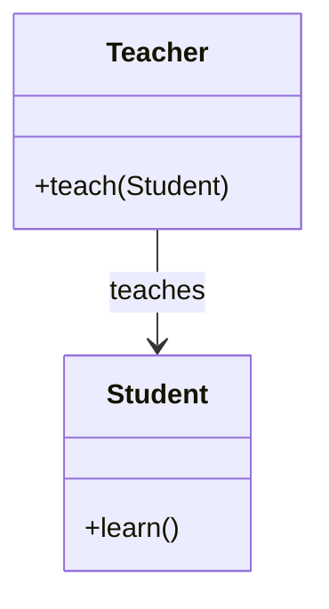
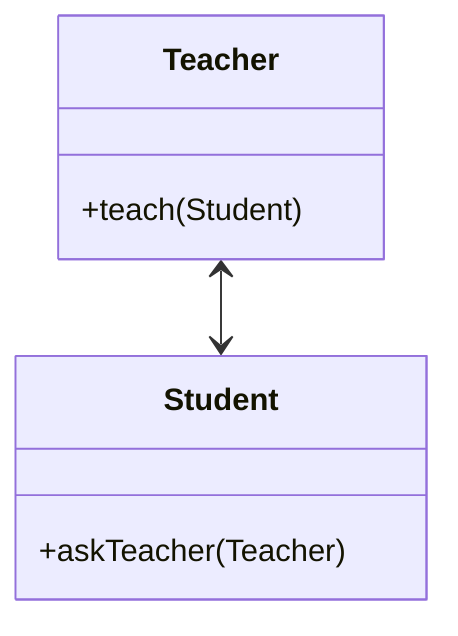
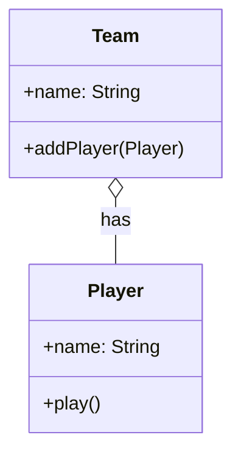
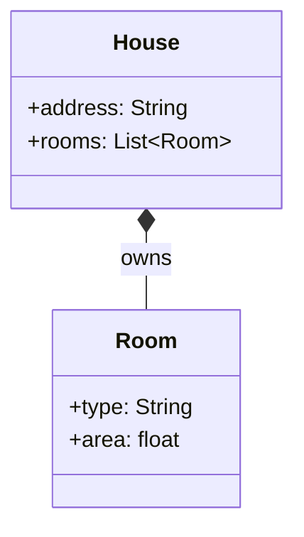
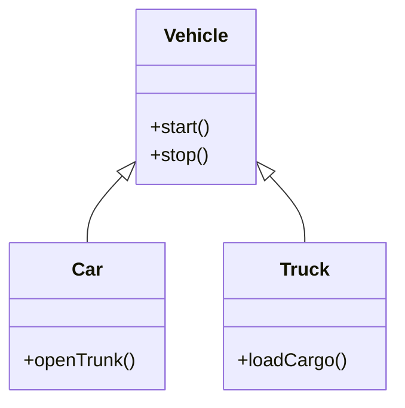
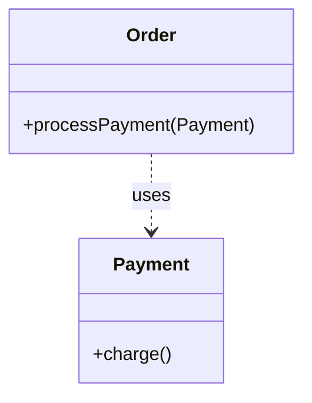
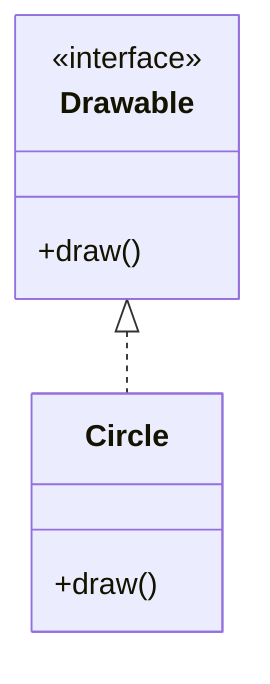
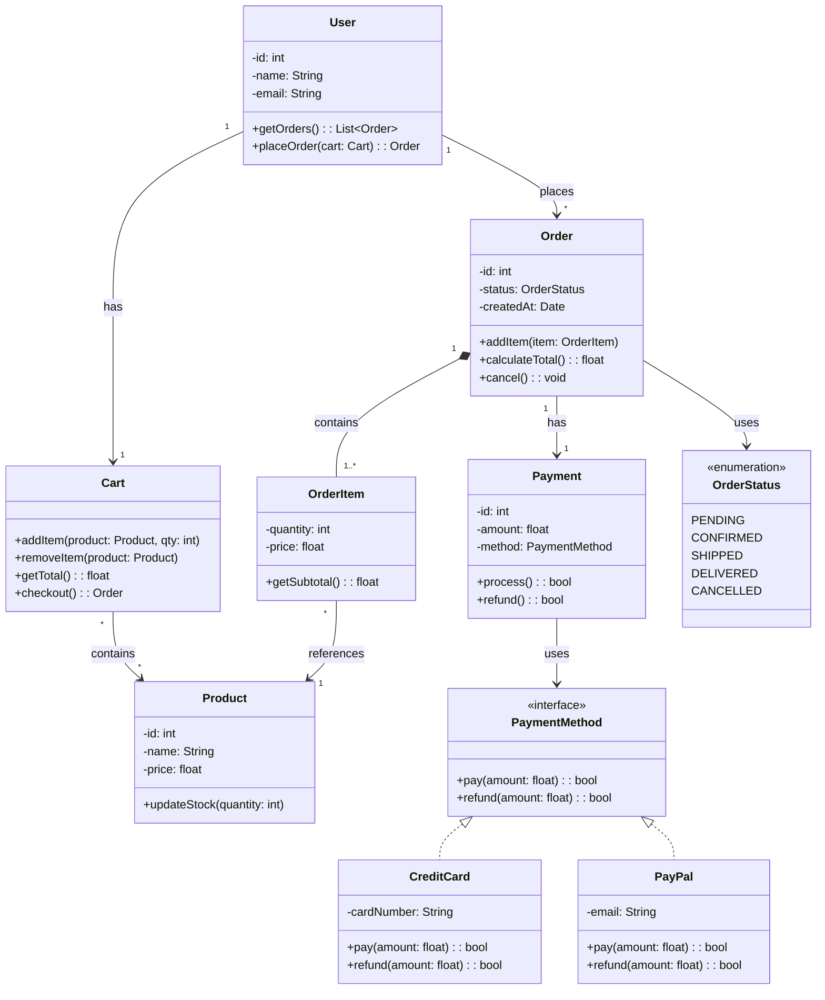
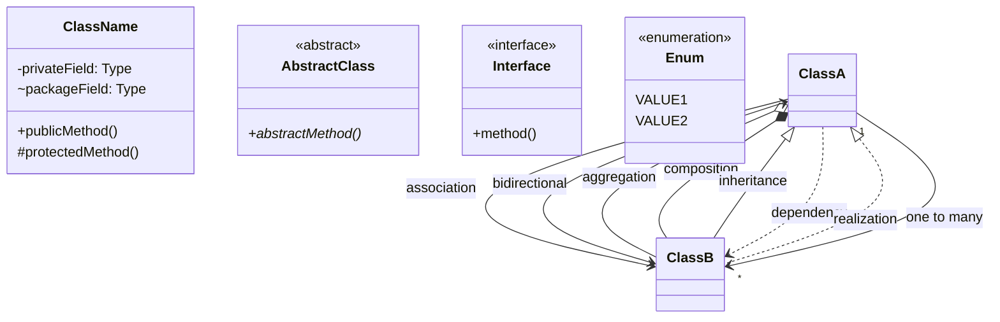

# UML Class Diagrams

## What are UML Class Diagrams?

UML (Unified Modeling Language) class diagrams show the **structure** of a system by depicting classes, their attributes, methods, and relationships. They're essential for communicating design decisions in LLD interviews.

## Class Representation

### Basic Class
```
┌─────────────────────┐
│       User          │  ← Class name
├─────────────────────┤
│ - id: int           │  ← Attributes (- = private)
│ - name: String      │
│ - email: String     │
│ # role: String      │  ← (# = protected)
├─────────────────────┤
│ + getId(): int      │  ← Methods (+ = public)
│ + getName(): String │
│ + setEmail(e: void) │
│ + login(): bool     │
└─────────────────────┘
```

### Visibility Modifiers

| Symbol | Visibility | Meaning |
|--------|-----------|---------|
| `+` | Public | Accessible from anywhere |
| `-` | Private | Accessible only within class |
| `#` | Protected | Accessible within class and subclasses |
| `~` | Package | Accessible within package |

### Abstract Class
```
┌─────────────────────────┐
│    «abstract»           │  ← Stereotype
│       Shape             │
├─────────────────────────┤
│ # color: String         │
├─────────────────────────┤
│ + area(): float {abstract}│  ← Italic for abstract
│ + draw(): void          │
└─────────────────────────┘
```

### Interface
```
┌─────────────────────────┐
│    «interface»          │
│     Drawable            │
├─────────────────────────┤
│                         │
├─────────────────────────┤
│ + draw(): void          │
│ + resize(factor: void)  │
└─────────────────────────┘
```

## Relationships

### 1. Association
A general relationship where one class uses or knows about another.

```
┌─────────┐         ┌─────────┐
│ Teacher │────────│ Student │
└─────────┘  teaches └─────────┘

Teacher teaches Student (unidirectional)
```

**Mermaid**:


### 2. Bidirectional Association
Both classes know about each other.

```
┌─────────┐         ┌─────────┐
│ Teacher │────────│ Student │
└─────────┘         └─────────┘
    teaches              studies under
```

**Mermaid**:


### 3. Aggregation ("has-a", weak ownership)
Part can exist without the whole.

```
┌─────────┐         ┌─────────┐
│   Team  │◇───────│ Player  │
└─────────┘  has    └─────────┘
            (hollow diamond)

Team has Players, but Players can exist without Team
```

**Mermaid**:


### 4. Composition ("owns-a", strong ownership)
Part cannot exist without the whole.

```
┌─────────┐         ┌─────────┐
│  House  │◆───────│  Room   │
└─────────┘  owns   └─────────┘
            (filled diamond)

House owns Rooms. If House is deleted, Rooms are deleted too.
```

**Mermaid**:


### 5. Inheritance ("is-a")
Child class inherits from parent class.

```
┌─────────┐
│ Vehicle │
└────┬────┘
     △ (triangle/arrow pointing to parent)
     │
┌────┴────┐
│   Car   │
└─────────┘

Car is-a Vehicle
```

**Mermaid**:


### 6. Dependency ("uses-a")
One class temporarily uses another.

```
┌─────────┐         ┌─────────┐
│  Order  │- - - - →│ Payment │
└─────────┘  uses   └─────────┘
            (dashed arrow)

Order uses Payment temporarily (method parameter)
```

**Mermaid**:


### 7. Realization (Interface Implementation)
Class implements an interface.

```
┌─────────────────┐
│  «interface»    │
│   Drawable      │
└────────┬────────┘
         ╯ (dashed line with triangle)
         │
    ┌────┴────┐
    │  Circle │
    └─────────┘

Circle implements Drawable
```

**Mermaid**:


## Relationship Summary

| Relationship | Line | Diamond | Meaning | Example |
|-------------|------|---------|---------|---------|
| Association | Solid line | None | Uses/knows | Teacher → Student |
| Aggregation | Hollow diamond | ◇ | Has-a (weak) | Team ◇→ Player |
| Composition | Filled diamond | ◆ | Owns-a (strong) | House ◆→ Room |
| Inheritance | Solid triangle | △ | Is-a | Car △→ Vehicle |
| Dependency | Dashed arrow | - - > | Uses temporarily | Order - → Payment |
| Realization | Dashed triangle | △ - - | Implements | Circle △- → Drawable |

## Multiplicity

```
┌─────────┐         ┌─────────┐
│  Order  │────────│  Item   │
└─────────┘  1   * └─────────┘

1 Order has many Items (1..*)
```

| Notation | Meaning |
|----------|---------|
| `1` | Exactly one |
| `0..1` | Zero or one |
| `*` | Zero or more |
| `1..*` | One or more |
| `n` | Exactly n |
| `n..m` | Between n and m |

## Complete Example: E-Commerce System



## Mermaid Syntax Quick Reference



## Interview Tips

1. **Draw as you explain** — Sketch the diagram while describing your design
2. **Start with core classes** — Don't try to draw everything at once
3. **Use correct relationships** — Composition vs aggregation matters
4. **Include key methods** — Show the important operations
5. **Add multiplicity** — "One user has many orders"
6. **Show interfaces** — When applying patterns like Strategy or Observer
7. **Use stereotypes** — «abstract», «interface», «enumeration»

## Common Mistakes

- ❌ Using composition when aggregation is correct
- ❌ Forgetting multiplicity
- ❌ Too many relationships (diagram becomes unreadable)
- ❌ Not showing key methods
- ❌ Missing interfaces when applying patterns

## Cross-References

- [SOLID Principles](./solid.md) — Principles reflected in class design
- [Design Patterns](./design-patterns.md) — Patterns shown in UML
- [OOP Concepts](./oop-concepts.md) — OOP in diagram form
- [LLD Problems](./parking-lot.md) — Complete UML examples
