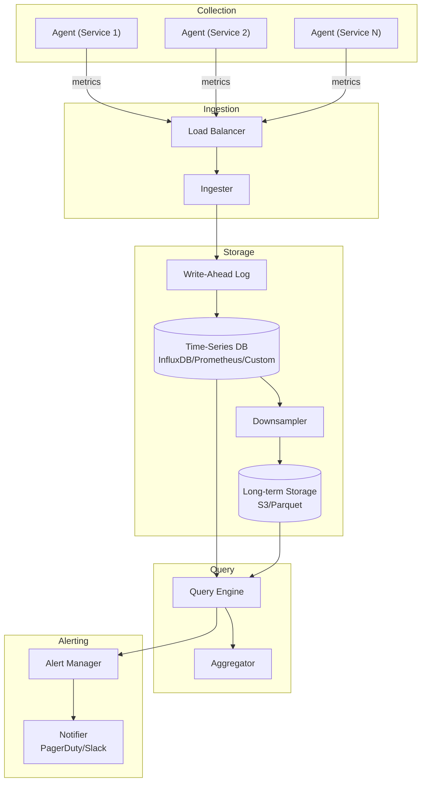
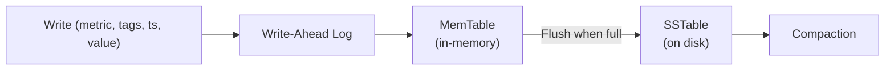
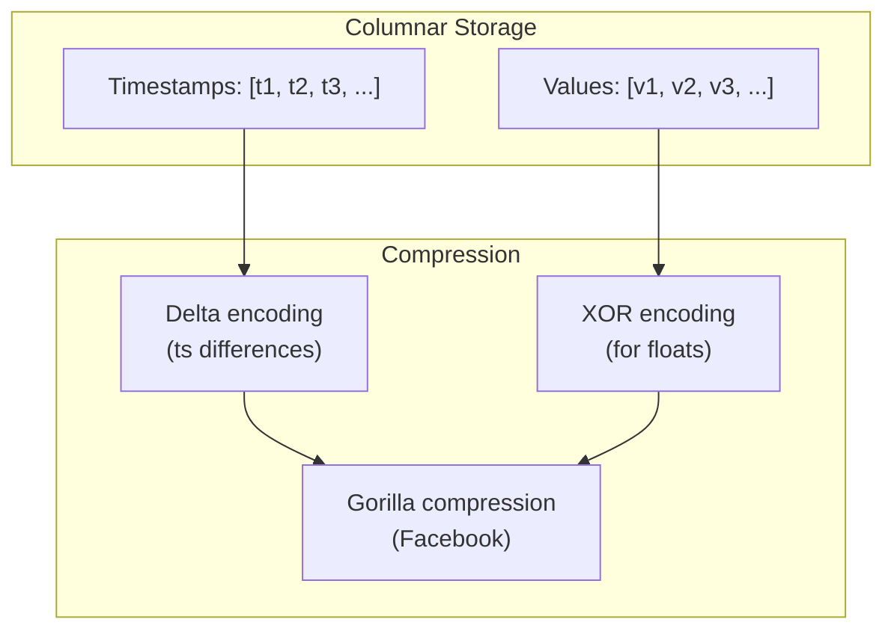
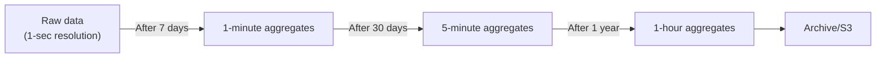
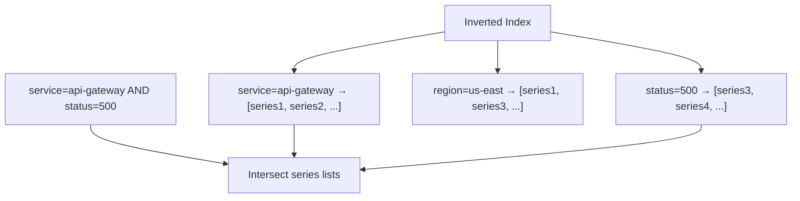
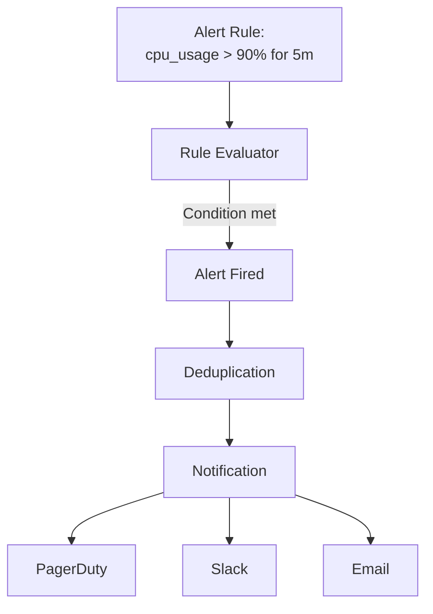
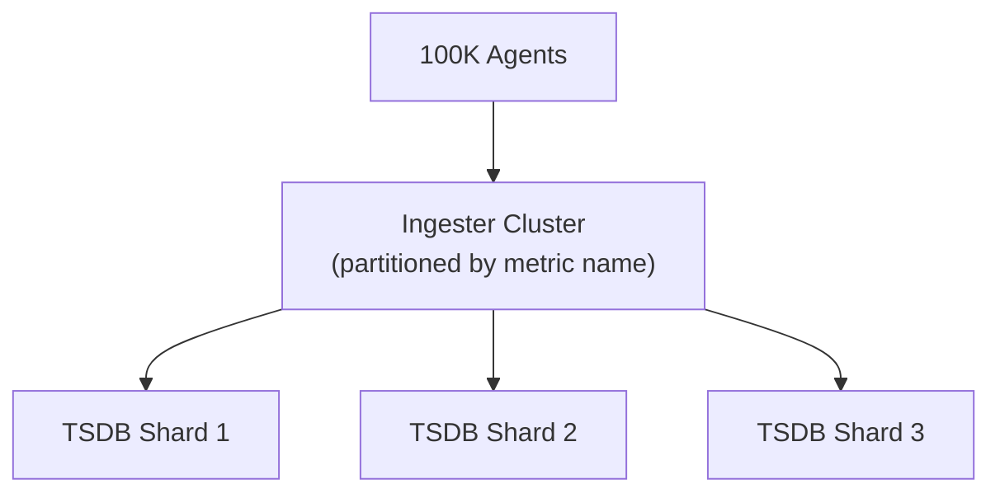

# Design a Metrics System

## Overview

A metrics system collects, stores, and queries time-series data (CPU usage, request counts, error rates, business KPIs). Systems like Datadog, Prometheus, and Graphite handle billions of data points per minute. The core challenges are high write throughput, efficient time-series storage, and fast range queries.

## Requirements

### Functional
- Collect metrics from thousands of services (counters, gauges, histograms)
- Query metrics by name, tags, and time range
- Support aggregations (sum, avg, percentiles, min, max)
- Alerting on metric thresholds
- Dashboard visualization
- Retention policies (raw data for 7 days, 1-min aggregates for 1 year)

### Non-Functional
- **Scale**: 10 billion data points/minute, 100K+ unique metric series
- **Write throughput**: 100M+ writes/second
- **Query latency**: < 500ms for dashboard queries
- **Retention**: Raw for 7 days, downsampled for 1+ year
- **Availability**: 99.9% (some data loss acceptable)

## Architecture



## Deep Dive: Data Model

A metric data point:

```json
{
    "metric": "http_requests_total",
    "tags": {
        "service": "api-gateway",
        "method": "POST",
        "status": "200",
        "region": "us-east-1"
    },
    "timestamp": 1705312200,
    "value": 42
}
```

**Metric types:**
- **Counter**: Monotonically increasing (e.g., total requests)
- **Gauge**: Can go up or down (e.g., CPU usage, temperature)
- **Histogram**: Distribution of values (e.g., request latency percentiles)
- **Summary**: Pre-calculated percentiles

### Time-Series Key

```
metric_name{tag1=val1, tag2=val2} → [(timestamp, value), ...]
```

Each unique combination of metric name + tags is a **time series**.

## Deep Dive: Storage Engine

### Write Path



**Storage engine (similar to LSM-tree):**
1. Write to WAL (durability)
2. Buffer in MemTable (sorted in-memory structure)
3. When MemTable is full, flush to SSTable (sorted, immutable file on disk)
4. Periodically compact SSTables (merge and deduplicate)

### Time-Series Optimized Storage



**Gorilla compression (Facebook, 2015):**
- Delta-of-delta encoding for timestamps: stores difference between consecutive deltas
- XOR encoding for values: stores XOR with previous value, only non-zero bits
- Achieves ~1.37 bytes per data point (vs 16 bytes uncompressed)
- Enables storing 1 year of per-second data for 100K series in ~4 TB

### Downsampling



**Aggregates stored:**
- Sum, count, min, max, avg, p50, p95, p99
- Enables fast queries at different granularities

## Deep Dive: Query Engine

```sql
-- Example: CPU usage for api-gateway in the last hour, 1-minute resolution
SELECT mean("cpu_usage")
FROM "system_metrics"
WHERE "service" = 'api-gateway'
  AND time > now() - 1h
GROUP BY time(1m)
```

**Query execution:**
1. Parse query and identify relevant time series (by metric name + tags)
2. Fetch data blocks from storage (MemTable + SSTables + downsampled)
3. Apply aggregation (mean, sum, percentile)
4. Return time-series results

### Tag-Based Indexing



## Deep Dive: Alerting



**Alert rule example:**
```yaml
alert: HighCPUUsage
expr: cpu_usage{service="api-gateway"} > 90
for: 5m
labels:
  severity: critical
annotations:
  summary: "High CPU usage on {{ $labels.instance }}"
```

## Deep Dive: Scaling

### Write Path Scaling



- **Partition by metric name hash**: Each ingester handles a subset of metrics
- **Batch writes**: Agents buffer data points and send in batches (every 10-60 seconds)
- **Write buffer**: WAL ensures no data loss on crash

### Query Path Scaling

- Query fan-out to all relevant shards
- Results merged at query engine
- Caching: cache query results for dashboards (30s TTL)

## Trade-Offs

| Decision | Benefit | Cost |
|----------|---------|------|
| LSM-tree storage | High write throughput | Read amplification (compaction) |
| Gorilla compression | ~10x compression | CPU for encoding/decoding |
| Downsampling | Reduced storage | Loss of granularity |
| Tag-based indexing | Fast tag queries | High cardinality explosion |
| Pull (Prometheus) vs Push (InfluxDB) | Simpler agent vs real-time | Different trade-offs |

## Interview Tips

1. **Start with scale** — 10B data points/minute, 100K+ unique series
2. **Explain the data model** — metric name + tags + timestamp + value
3. **Discuss storage** — LSM-tree, Gorilla compression, downsampling
4. **Mention the inverted index** — for fast tag-based queries
5. **Talk about alerting** — rule evaluation, deduplication, notification
6. **Don't forget downsampling** — raw → 1min → 5min → 1hr aggregates
7. **Compare systems** — Prometheus (pull), InfluxDB (push), Datadog (SaaS)

## Key Takeaways

- Metrics systems collect billions of time-series data points per minute.
- Storage uses LSM-trees with Gorilla compression (~1.37 bytes per data point).
- Downsampling reduces storage: raw (7 days) → 1-min (30 days) → 1-hr (1 year).
- Tag-based inverted index enables fast filtering by metric dimensions.
- Alerting: rule evaluation on query results, deduplication, multi-channel notification.
- Scaling: partition by metric name hash, batch writes, query fan-out.
- Write-Ahead Log (WAL) ensures no data loss on crash.

## Cross-References

- [Monitoring & Observability](./hld/monitoring-observability.md)
- [Cloud Observability](../../cloud/observability/README.md)
- [MLOps Monitoring](../../ml/mlops/monitoring.md)
- [Latency vs Throughput](./latency-vs-throughput.md)

