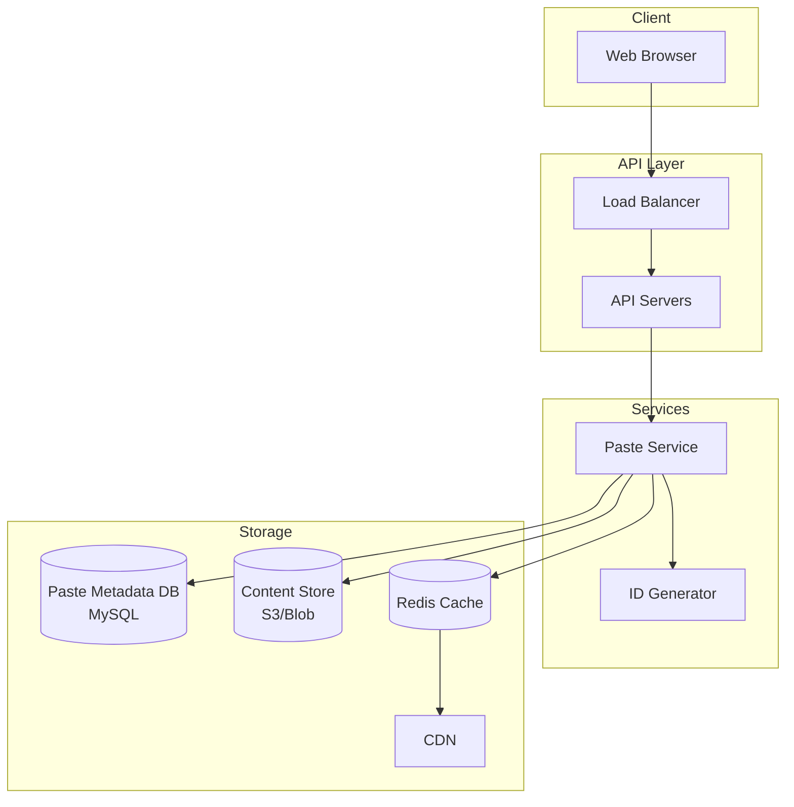
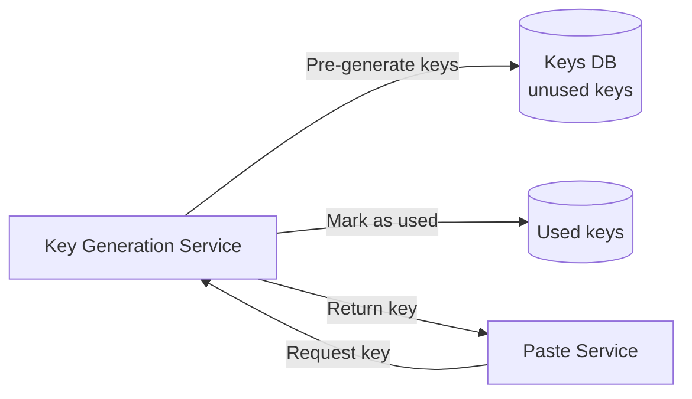
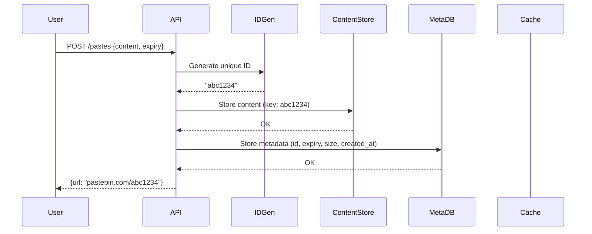
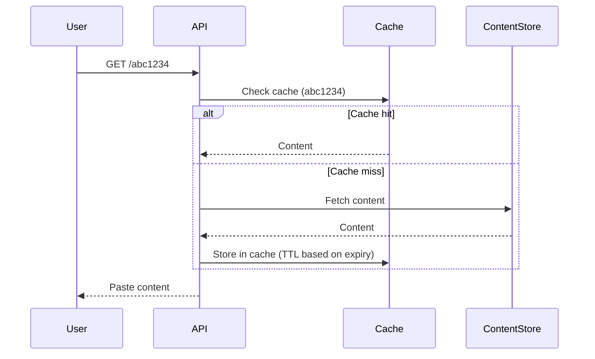
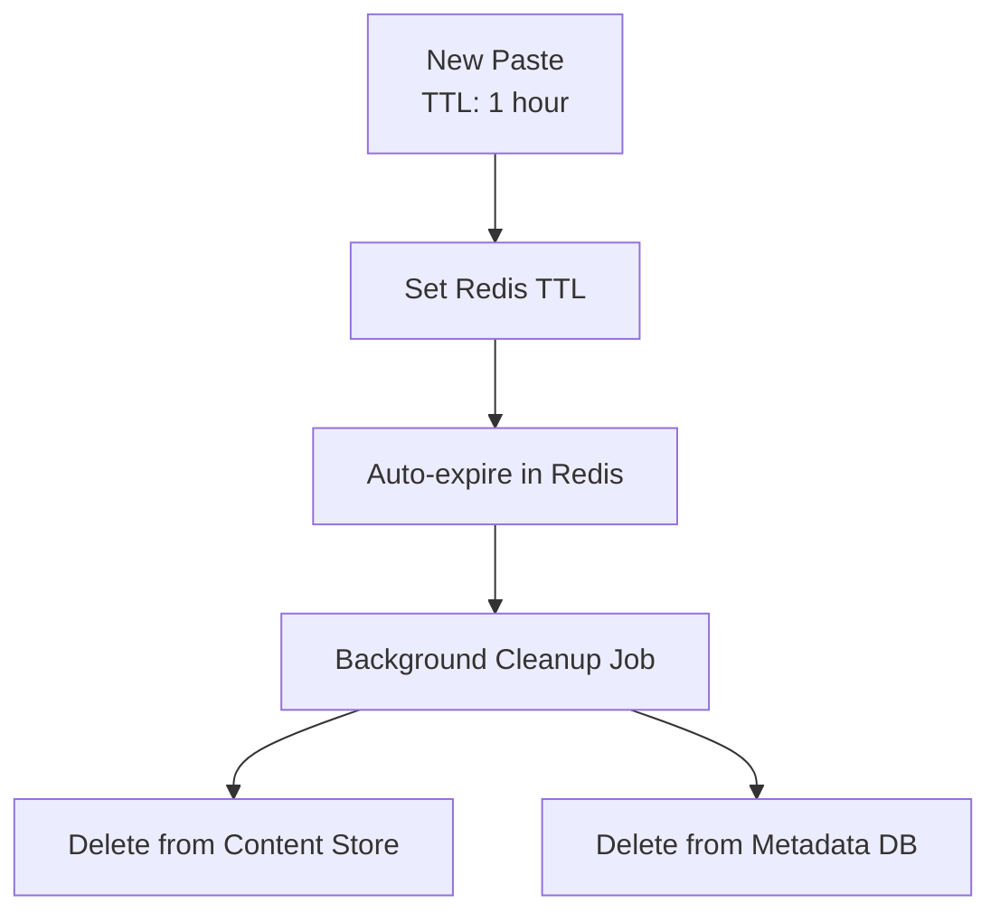

# Design Pastebin

## Overview

Pastebin is a text-sharing service where users can paste text (code snippets, logs, config files) and get a shareable short URL. The design is similar to URL shorteners but with larger payloads. Key challenges include generating unique short URLs, storing large amounts of text, and handling expiration.

## Requirements

### Functional
- Create a paste with text content (up to 10 MB)
- Generate a unique short URL for each paste
- Set expiration time (10 min, 1 hour, 1 day, 1 week, 1 month, never)
- View paste by short URL
- Syntax highlighting for code
- Optional: raw text view, download, fork

### Non-Functional
- **Scale**: 10M pastes/day (write-heavy relative to reads)
- **Read/Write ratio**: ~5:1 (reads dominate)
- **Latency**: Paste creation < 200ms, read < 100ms
- **Availability**: 99.99%
- **Storage**: ~5 years retention for non-expiring pastes

## Capacity Estimation

```
Writes: 10M pastes/day = ~116 pastes/sec (peak: ~350/sec)
Reads: 50M reads/day = ~579 reads/sec (peak: ~1,740/sec)
Average paste size: 10 KB
Daily storage: 10M × 10 KB = 100 GB/day
Yearly storage: 100 GB × 365 = 36.5 TB/year
5-year storage: ~182 TB
```

## Architecture



## Deep Dive: Short URL Generation

### Approach 1: Hash-Based (MD5/SHA256)

```python
import hashlib

def generate_short_url(long_url):
    hash_hex = hashlib.md5(long_url.encode()).hexdigest()
    # Take first 7 characters
    return hash_hex[:7]
```

- Simple but collisions possible
- Need to check database before assigning

### Approach 2: Base62 Encoding of Auto-Increment ID

```python
CHARS = "0123456789abcdefghijklmnopqrstuvwxyzABCDEFGHIJKLMNOPQRSTUVWXYZ"

def encode_base62(num):
    if num == 0:
        return CHARS[0]
    result = []
    while num > 0:
        result.append(CHARS[num % 62])
        num //= 62
    return ''.join(reversed(result))

# ID 123456789 → "8m0Kx"
```

- No collisions (unique IDs)
- Shorter URLs (7 chars = 62^7 = 3.5 trillion unique URLs)
- Need a distributed ID generator

### Approach 3: Pre-Generated Key Service (KGS)



- KGS generates random 7-character keys in advance
- Stores unused keys in a database
- Paste service requests a key when creating a paste
- Key is marked as used (moved to used table)
- Need to ensure KGS doesn't become a bottleneck

## Deep Dive: Write Path (Create Paste)



## Deep Dive: Read Path (View Paste)



## Deep Dive: Expiration



**Expiration strategies:**
1. **Redis TTL**: Cache entries auto-expire
2. **Background cleanup**: Periodically scan metadata DB for expired pastes
3. **Lazy deletion**: Delete from content store when expired paste is accessed
4. **TTL in metadata DB**: Use MySQL events or a cron job

## Deep Dive: Storage Design

### Metadata DB Schema (MySQL)

```sql
CREATE TABLE pastes (
    id VARCHAR(7) PRIMARY KEY,
    user_id BIGINT,
    title VARCHAR(255),
    content_size BIGINT,
    content_hash VARCHAR(64),  -- SHA-256
    syntax VARCHAR(50),
    visibility ENUM('public', 'unlisted', 'private'),
    expires_at DATETIME,
    created_at DATETIME,
    view_count BIGINT DEFAULT 0,
    INDEX idx_expires (expires_at),
    INDEX idx_user (user_id)
);
```

### Content Store (S3)

```
s3://pastebin-content/{id}
```

- Content stored separately from metadata
- Enables efficient storage of large pastes
- S3 handles replication and durability

## Scalability

| Component | Strategy |
|-----------|---------|
| API servers | Horizontal, stateless |
| ID generator | Snowflake or pre-generated keys (KGS) |
| Metadata DB | MySQL with read replicas, sharded by ID prefix |
| Content store | S3 (unlimited scale, 99.999999999% durability) |
| Cache | Redis cluster, LRU eviction |
| CDN | Cache popular pastes at edge |

## Trade-Offs

| Decision | Benefit | Cost |
|----------|---------|------|
| Base62 encoding | Short URLs, no collisions | Requires distributed ID generator |
| Separate metadata/content | Independent scaling | Extra lookup for content |
| Redis cache | Fast reads | Stale data risk (mitigated by TTL) |
| S3 for content | Durable, scalable | Higher latency than local disk |
| Background cleanup | Efficient expiration | Slight delay in deletion |

## Interview Tips

1. **Start with capacity estimation** — 10M pastes/day, 10KB average, ~100GB/day
2. **Explain short URL generation** — Base62 encoding or pre-generated keys
3. **Discuss storage separation** — metadata in MySQL, content in S3
4. **Mention caching** — Redis with TTL matching paste expiration
5. **Talk about expiration** — Redis TTL + background cleanup job
6. **Don't forget** — syntax highlighting (client-side), raw view, download

## Key Takeaways

- Pastebin is a write-heavy service: 10M pastes/day with 5:1 read/write ratio.
- Short URL generation: Base62 encoding of auto-increment IDs or pre-generated keys (KGS).
- Storage separation: metadata in MySQL, content in S3 for independent scaling.
- Expiration: Redis TTL for cache, background cleanup for content store.
- Caching: Redis caches popular pastes; TTL matches paste expiration.
- Content deduplication: store content by hash to avoid duplicates.
